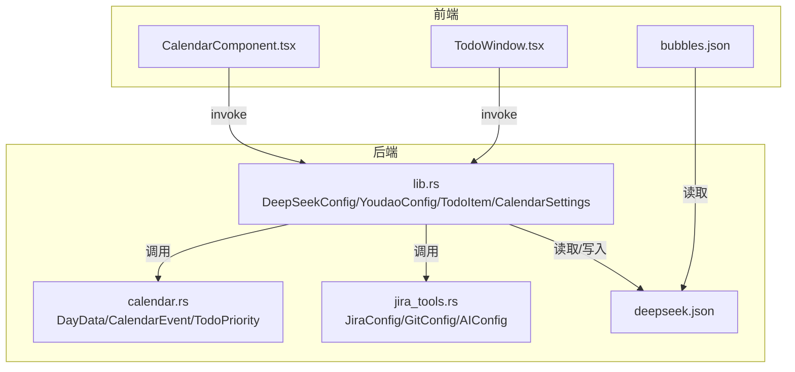
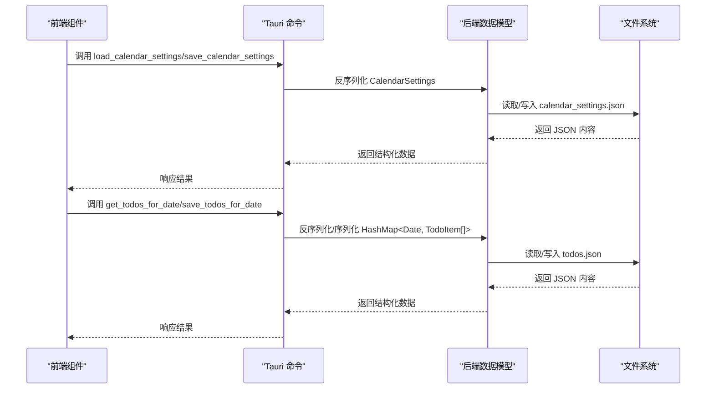
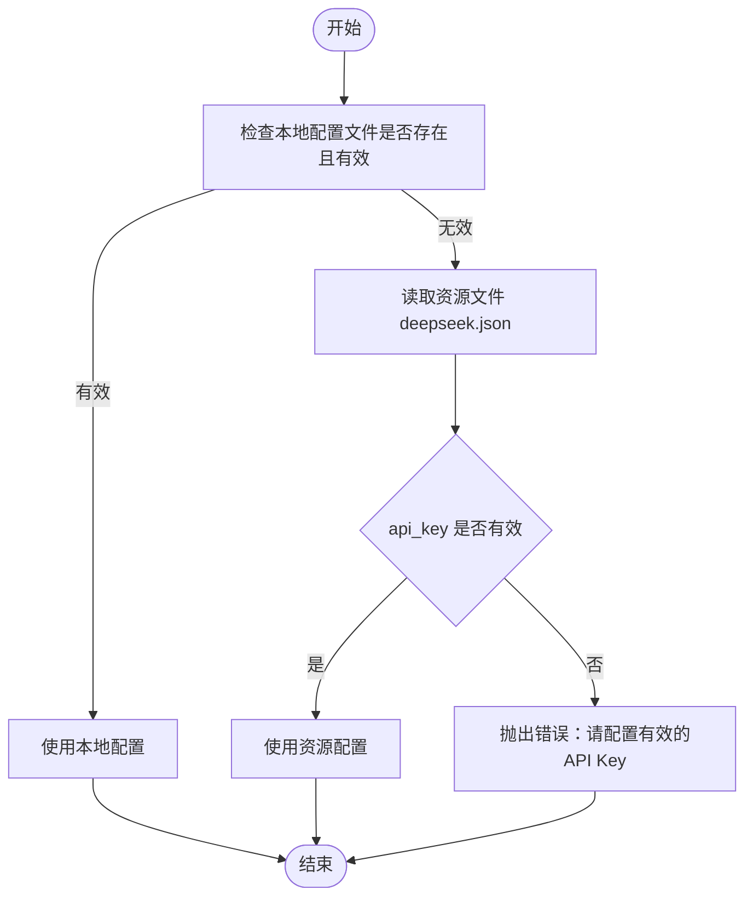
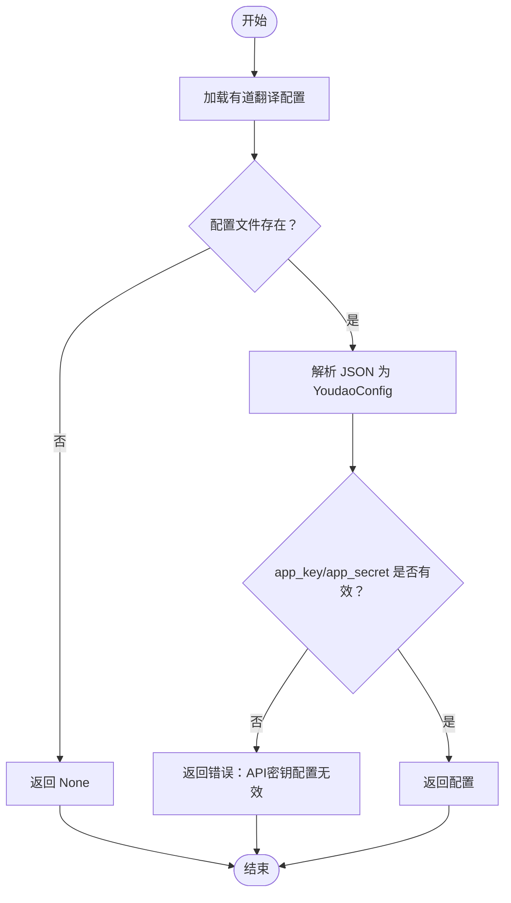
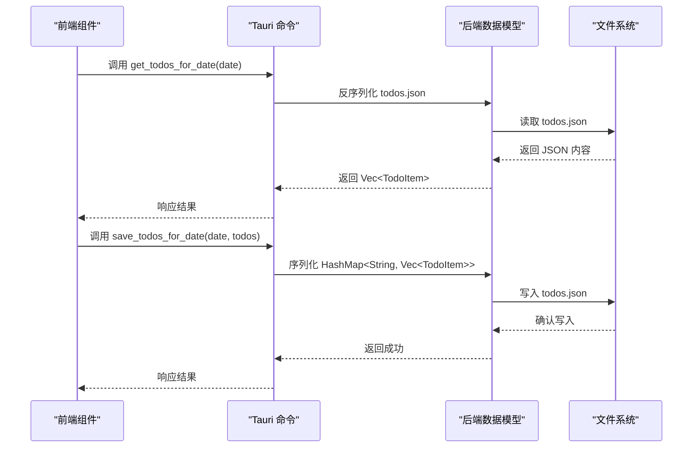
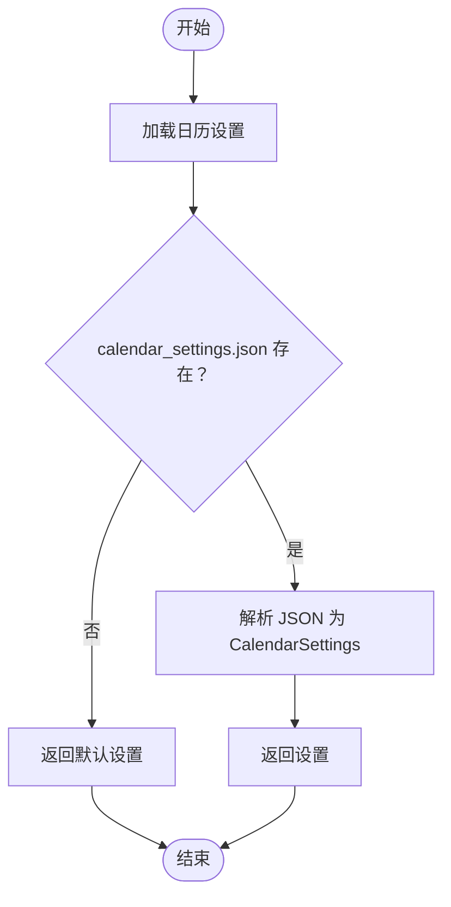
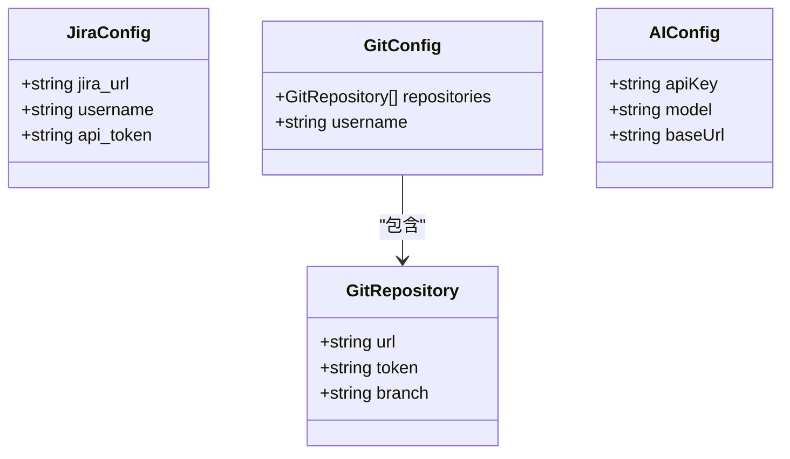
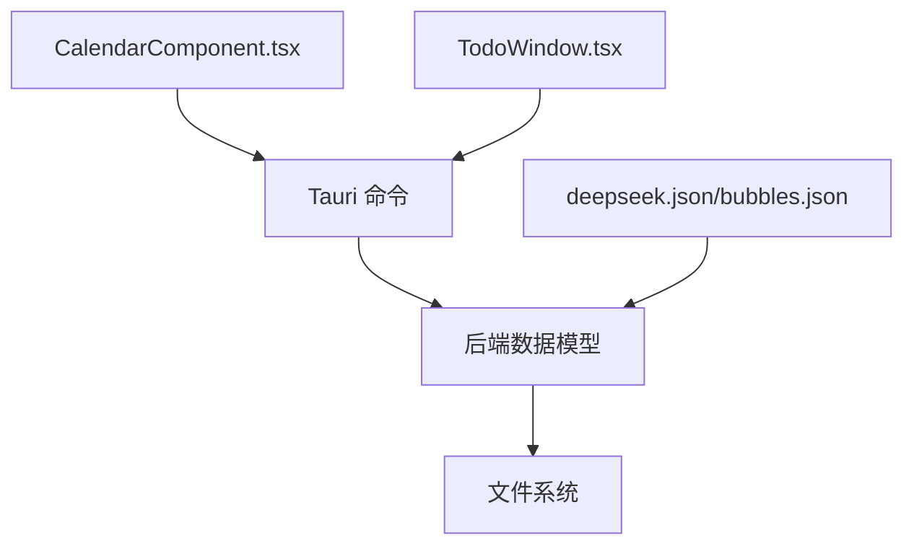

# 数据模型设计

<cite>
**本文档引用的文件**
- [lib.rs](file://src-tauri/src/lib.rs)
- [calendar.rs](file://src-tauri/src/calendar.rs)
- [jira_tools.rs](file://src-tauri/src/jira_tools.rs)
- [CalendarComponent.tsx](file://src/components/CalendarComponent.tsx)
- [TodoWindow.tsx](file://src/components/TodoWindow.tsx)
- [deepseek.json](file://src-tauri/config/deepseek.json)
- [bubbles.json](file://public/config/bubbles.json)
</cite>

## 目录
1. [引言](#引言)
2. [项目结构](#项目结构)
3. [核心数据组件](#核心数据组件)
4. [架构概览](#架构概览)
5. [详细组件分析](#详细组件分析)
6. [依赖关系分析](#依赖关系分析)
7. [性能考量](#性能考量)
8. [故障排除指南](#故障排除指南)
9. [结论](#结论)

## 引言
本文件面向数据模型设计，系统梳理项目中的核心数据结构，包括 DeepSeekConfig、YoudaoConfig、TodoItem、DayTodos、CalendarSettings 等关键数据模型。文档将深入解释每个数据模型的字段定义、数据类型约束和业务规则；分析数据模型之间的关系映射（嵌套结构、关联关系和继承模式）；描述数据验证规则和输入校验机制（必填字段、格式验证和范围限制）；解释数据序列化和反序列化过程（JSON 格式转换、字段重命名和默认值处理）；提供数据模型的扩展和演进策略（向后兼容性保证和版本管理）；并给出数据模型的使用示例和最佳实践指南。

## 项目结构
项目采用前端 React + Tauri 的混合架构，数据模型在 Rust 后端通过 serde 序列化为 JSON 并与前端交互。前端组件通过 Tauri 命令调用后端数据模型，实现配置管理、日历 TODO 和翻译等功能。

**图表来源**
- [lib.rs:219-280](file://src-tauri/src/lib.rs#L219-L280)
- [calendar.rs:5-81](file://src-tauri/src/calendar.rs#L5-L81)
- [jira_tools.rs:42-64](file://src-tauri/src/jira_tools.rs#L42-L64)
- [CalendarComponent.tsx:63-122](file://src/components/CalendarComponent.tsx#L63-L122)
- [TodoWindow.tsx:44-70](file://src/components/TodoWindow.tsx#L44-L70)
- [deepseek.json:1-6](file://src-tauri/config/deepseek.json#L1-L6)
- [bubbles.json:1-52](file://public/config/bubbles.json#L1-L52)

**章节来源**
- [lib.rs:219-280](file://src-tauri/src/lib.rs#L219-L280)
- [calendar.rs:5-81](file://src-tauri/src/calendar.rs#L5-L81)
- [jira_tools.rs:42-64](file://src-tauri/src/jira_tools.rs#L42-L64)
- [CalendarComponent.tsx:63-122](file://src/components/CalendarComponent.tsx#L63-L122)
- [TodoWindow.tsx:44-70](file://src/components/TodoWindow.tsx#L44-L70)
- [deepseek.json:1-6](file://src-tauri/config/deepseek.json#L1-L6)
- [bubbles.json:1-52](file://public/config/bubbles.json#L1-L52)

## 核心数据组件
本节对项目中的核心数据模型进行逐项分析，涵盖字段定义、数据类型、约束条件和业务规则。

- DeepSeekConfig（后端）
  - 字段
    - api_key: 字符串，必填，用于鉴权
    - base_url: 字符串，必填，API 基础地址
    - model: 字符串，必填，模型名称
  - 约束与规则
    - 通过 serde rename 将 JSON 字段名映射为 api_key/base_url
    - 本地配置优先于资源文件配置
    - 若本地配置无效或为空，则回退到资源文件 deepseek.json
    - 当 api_key 为空或为占位符时，抛出错误
  - 用途
    - 提供 AI 对话服务的配置，支持动态保存与加载

- YoudaoConfig（后端）
  - 字段
    - app_key: 字符串，必填
    - app_secret: 字符串，必填
    - base_url: 字符串，必填
  - 约束与规则
    - 通过 serde rename 将 JSON 字段名映射为 app_key/app_secret/base_url
    - 本地配置优先于资源文件配置
    - 若配置缺失或为空，调用翻译接口会报错
  - 用途
    - 有道翻译服务的鉴权与调用

- TodoItem（后端）
  - 字段
    - id: 字符串，唯一标识
    - content: 字符串，内容
    - completed: 布尔值，完成状态
    - created_at: 整数，时间戳
  - 约束与规则
    - id 必须唯一
    - created_at 通常为毫秒级时间戳
  - 用途
    - 日历 TODO 的基础单元

- DayTodos（后端）
  - 字段
    - date: 字符串，日期格式（YYYY-MM-DD）
    - todos: TodoItem 数组
  - 约束与规则
    - date 作为键存储在 todos.json 中
    - todos 可为空数组
  - 用途
    - 按日组织的 TODO 列表

- CalendarSettings（后端）
  - 字段
    - background_images: 字符串数组，背景图路径列表
    - rotation_interval: 无符号整型，轮播间隔（分钟）
  - 约束与规则
    - 通过 serde rename 将 JSON 字段名映射为 backgroundImages/rotationInterval
    - 默认值：background_images=["data/img0.jpeg"]，rotation_interval=30
  - 用途
    - 日历界面的个性化设置

- DayData（前端/后端共享）
  - 字段
    - date: 字符串，日期
    - todos: TodoItem 数组
    - events: CalendarEvent 数组
    - notes: 可选字符串
  - 约束与规则
    - 用于聚合某一天的 TODO 和事件
  - 用途
    - 日历组件渲染的数据载体

- CalendarEvent（后端）
  - 字段
    - id: 字符串
    - title: 字符串
    - description: 可选字符串
    - start_time/end_time: 可选整数（时间戳）
    - all_day: 布尔值
    - color: 可选字符串
  - 约束与规则
    - 时间字段可为空表示全天事件
  - 用途
    - 日历事件的存储与展示

- TodoPriority（后端）
  - 枚举
    - Low/Medium/High
  - 用途
    - TODO 优先级标注（在 calendar.rs 中定义）

- JiraConfig/GitConfig/GitRepository/AIConfig（后端）
  - 字段
    - JiraConfig: jira_url, username, api_token
    - GitConfig: repositories[], username
    - GitRepository: url, token, branch
    - AIConfig: apiKey, model, baseUrl
  - 约束与规则
    - 通过 serde rename 映射 JSON 字段名
    - 支持本地配置文件保存与加载
  - 用途
    - JIRA/Git/AI 功能的配置管理

**章节来源**
- [lib.rs:219-280](file://src-tauri/src/lib.rs#L219-L280)
- [lib.rs:381-405](file://src-tauri/src/lib.rs#L381-L405)
- [lib.rs:548-568](file://src-tauri/src/lib.rs#L548-L568)
- [calendar.rs:5-81](file://src-tauri/src/calendar.rs#L5-L81)
- [jira_tools.rs:42-64](file://src-tauri/src/jira_tools.rs#L42-L64)
- [jira_tools.rs:11-21](file://src-tauri/src/jira_tools.rs#L11-L21)
- [jira_tools.rs:524-654](file://src-tauri/src/jira_tools.rs#L524-L654)

## 架构概览
下图展示了数据模型在前后端之间的交互流程，包括配置加载、数据持久化和事件驱动刷新。

**图表来源**
- [lib.rs:671-718](file://src-tauri/src/lib.rs#L671-L718)
- [lib.rs:571-631](file://src-tauri/src/lib.rs#L571-L631)
- [CalendarComponent.tsx:63-122](file://src/components/CalendarComponent.tsx#L63-L122)
- [TodoWindow.tsx:44-70](file://src/components/TodoWindow.tsx#L44-L70)

## 详细组件分析

### DeepSeekConfig 数据模型
- 字段定义与约束
  - api_key/base_url/model 通过 serde rename 映射 JSON 字段
  - 本地配置优先：若本地配置有效则直接使用
  - 资源文件回退：本地配置无效时读取资源文件 deepseek.json
  - 校验规则：当 api_key 为空或为占位符时拒绝使用
- 序列化与反序列化
  - 保存：Pretty JSON 格式写入应用数据目录
  - 加载：优先本地，后退资源文件，最终校验有效性
- 使用场景
  - AI 对话服务的配置注入与调用

**图表来源**
- [lib.rs:350-379](file://src-tauri/src/lib.rs#L350-L379)
- [deepseek.json:1-6](file://src-tauri/config/deepseek.json#L1-L6)

**章节来源**
- [lib.rs:219-280](file://src-tauri/src/lib.rs#L219-L280)
- [lib.rs:350-379](file://src-tauri/src/lib.rs#L350-L379)
- [deepseek.json:1-6](file://src-tauri/config/deepseek.json#L1-L6)

### YoudaoConfig 数据模型
- 字段定义与约束
  - app_key/app_secret/base_url 通过 serde rename 映射 JSON 字段
  - 本地配置优先，若缺失或为空则调用翻译接口时报错
- 序列化与反序列化
  - 保存：Pretty JSON 格式写入应用数据目录
  - 加载：读取本地配置文件，不存在则返回 None
- 使用场景
  - 有道翻译服务的鉴权与调用

**图表来源**
- [lib.rs:436-455](file://src-tauri/src/lib.rs#L436-L455)
- [lib.rs:472-545](file://src-tauri/src/lib.rs#L472-L545)

**章节来源**
- [lib.rs:381-405](file://src-tauri/src/lib.rs#L381-L405)
- [lib.rs:436-455](file://src-tauri/src/lib.rs#L436-L455)
- [lib.rs:472-545](file://src-tauri/src/lib.rs#L472-L545)

### TodoItem 与 DayTodos 数据模型
- TodoItem 字段与约束
  - id 唯一标识，content 非空，completed 布尔值，created_at 时间戳
- DayTodos 字段与约束
  - date 作为键，todos 为 TodoItem 数组
- 序列化与反序列化
  - todos.json 存储 HashMap<String, Vec<TodoItem>>
  - 读取时若文件不存在返回空数组
- 使用场景
  - 日历 TODO 的增删改查与持久化

**图表来源**
- [lib.rs:571-631](file://src-tauri/src/lib.rs#L571-L631)
- [calendar.rs:98-141](file://src-tauri/src/calendar.rs#L98-L141)

**章节来源**
- [lib.rs:548-568](file://src-tauri/src/lib.rs#L548-L568)
- [lib.rs:571-631](file://src-tauri/src/lib.rs#L571-L631)
- [calendar.rs:5-81](file://src-tauri/src/calendar.rs#L5-L81)
- [calendar.rs:98-141](file://src-tauri/src/calendar.rs#L98-L141)

### CalendarSettings 数据模型
- 字段定义与约束
  - background_images 默认至少包含一张图片
  - rotation_interval 默认 30 分钟
  - 通过 serde rename 映射 JSON 字段名
- 序列化与反序列化
  - 保存：Pretty JSON 格式写入应用数据目录
  - 加载：若文件不存在则返回默认值
- 使用场景
  - 日历背景图轮播与个性化设置

**图表来源**
- [lib.rs:694-718](file://src-tauri/src/lib.rs#L694-L718)
- [CalendarComponent.tsx:63-81](file://src/components/CalendarComponent.tsx#L63-L81)

**章节来源**
- [lib.rs:671-718](file://src-tauri/src/lib.rs#L671-L718)
- [CalendarComponent.tsx:27-38](file://src/components/CalendarComponent.tsx#L27-L38)
- [CalendarComponent.tsx:63-81](file://src/components/CalendarComponent.tsx#L63-L81)

### JiraConfig/GitConfig/AIConfig 数据模型
- 字段定义与约束
  - JiraConfig: jira_url, username, api_token
  - GitConfig: repositories[], username
  - GitRepository: url, token, branch
  - AIConfig: apiKey, model, baseUrl
  - 通过 serde rename 映射 JSON 字段名
- 序列化与反序列化
  - 保存：Pretty JSON 格式写入应用数据目录
  - 加载：读取本地配置文件，不存在则返回 None
- 使用场景
  - JIRA/Git/AI 功能的配置管理与调用

**图表来源**
- [jira_tools.rs:42-64](file://src-tauri/src/jira_tools.rs#L42-L64)
- [jira_tools.rs:524-654](file://src-tauri/src/jira_tools.rs#L524-L654)

**章节来源**
- [jira_tools.rs:42-64](file://src-tauri/src/jira_tools.rs#L42-L64)
- [jira_tools.rs:524-654](file://src-tauri/src/jira_tools.rs#L524-L654)

## 依赖关系分析
- 组件耦合与内聚
  - CalendarComponent 与 TodoWindow 通过 Tauri 命令与后端数据模型解耦
  - 后端通过 serde 实现数据模型与 JSON 的稳定映射
- 外部依赖与集成点
  - 文件系统：应用数据目录用于配置与数据持久化
  - JSON 配置：deepseek.json、bubbles.json 提供默认配置
- 潜在循环依赖
  - 未发现直接循环依赖，模块职责清晰

**图表来源**
- [CalendarComponent.tsx:63-122](file://src/components/CalendarComponent.tsx#L63-L122)
- [TodoWindow.tsx:44-70](file://src/components/TodoWindow.tsx#L44-L70)
- [lib.rs:571-718](file://src-tauri/src/lib.rs#L571-L718)
- [deepseek.json:1-6](file://src-tauri/config/deepseek.json#L1-L6)
- [bubbles.json:1-52](file://public/config/bubbles.json#L1-L52)

**章节来源**
- [CalendarComponent.tsx:63-122](file://src/components/CalendarComponent.tsx#L63-L122)
- [TodoWindow.tsx:44-70](file://src/components/TodoWindow.tsx#L44-L70)
- [lib.rs:571-718](file://src-tauri/src/lib.rs#L571-L718)
- [deepseek.json:1-6](file://src-tauri/config/deepseek.json#L1-L6)
- [bubbles.json:1-52](file://public/config/bubbles.json#L1-L52)

## 性能考量
- JSON 序列化性能
  - 使用 Pretty JSON 格式写入，便于人工阅读但略增体积；可按需调整为紧凑格式
- 文件访问优化
  - 异步读写（tokio::fs）避免阻塞主线程
  - 仅在必要时创建目录，减少 IO 操作
- 数据聚合与缓存
  - 日历组件按月加载 TODO，避免一次性加载过多数据
  - 背景图轮播通过定时器控制，避免频繁切换

## 故障排除指南
- 配置加载失败
  - 检查本地配置文件是否存在且格式正确
  - 若本地配置无效，确认资源文件 deepseek.json 是否存在且 api_key 非空
- 翻译功能异常
  - 确认 YoudaoConfig 的 app_key/app_secret/base_url 是否完整
  - 检查网络连通性和有道翻译 API 状态
- 日历数据丢失
  - 检查 todos.json 是否被意外删除或损坏
  - 确认应用数据目录权限正常
- 背景图轮播异常
  - 确认 calendar_settings.json 中的 background_images 是否包含有效路径
  - 检查图片文件是否存在于应用数据目录

**章节来源**
- [lib.rs:350-379](file://src-tauri/src/lib.rs#L350-L379)
- [lib.rs:436-455](file://src-tauri/src/lib.rs#L436-L455)
- [lib.rs:571-631](file://src-tauri/src/lib.rs#L571-L631)
- [lib.rs:694-718](file://src-tauri/src/lib.rs#L694-L718)

## 结论
本项目的数据模型设计遵循清晰的字段定义、严格的约束与规则、稳定的序列化映射以及良好的前后端分离架构。通过 serde 的 rename 机制实现 JSON 字段与 Rust 字段的灵活映射，结合本地配置与资源文件的回退策略，确保了配置管理的灵活性与可靠性。日历 TODO 与设置的持久化采用 JSON 文件存储，配合异步 IO 保障了性能与用户体验。未来可在保持向后兼容的前提下，逐步引入更强的校验与版本迁移机制，进一步提升系统的健壮性与可维护性。