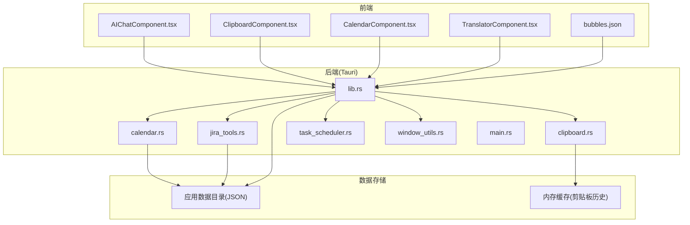
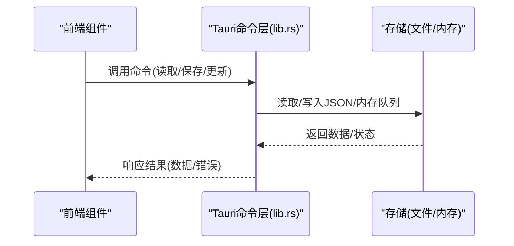
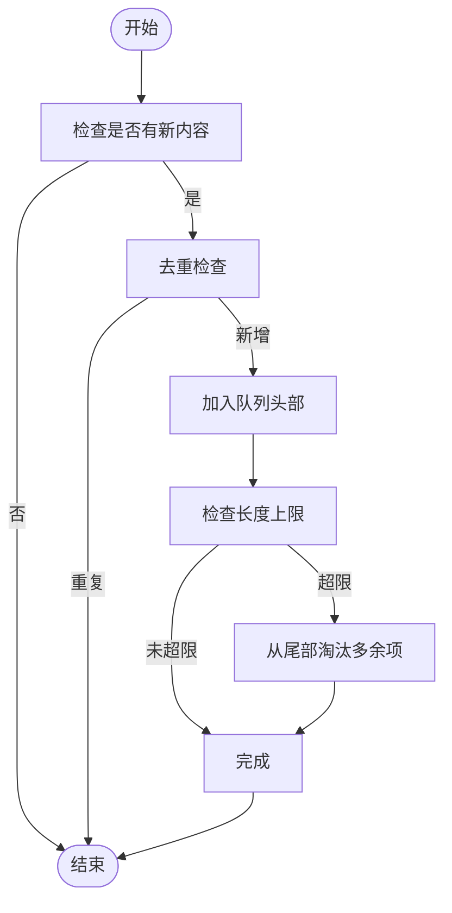
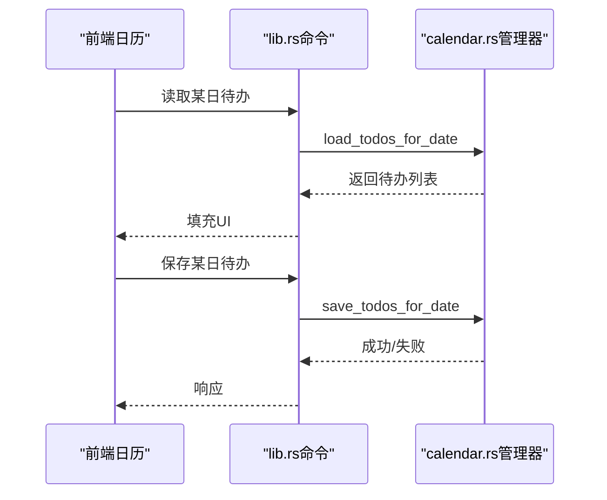
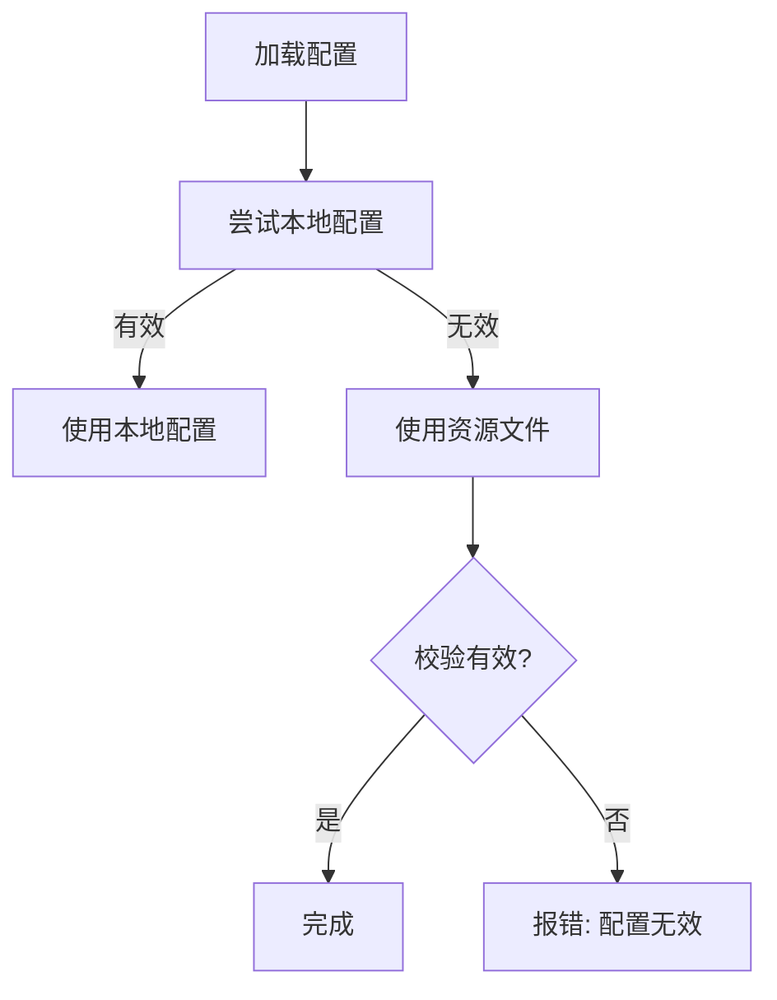
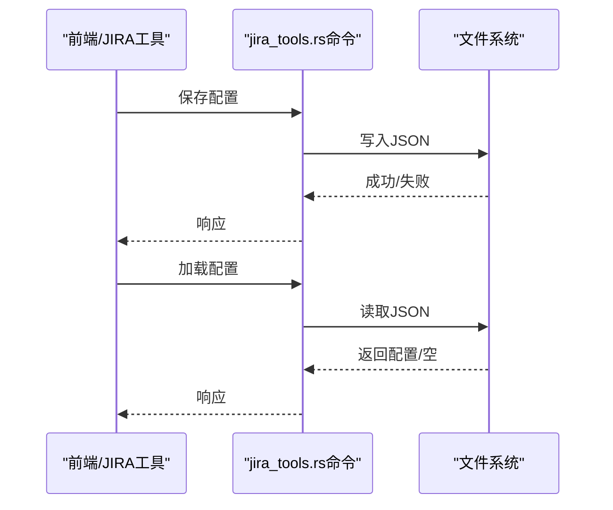
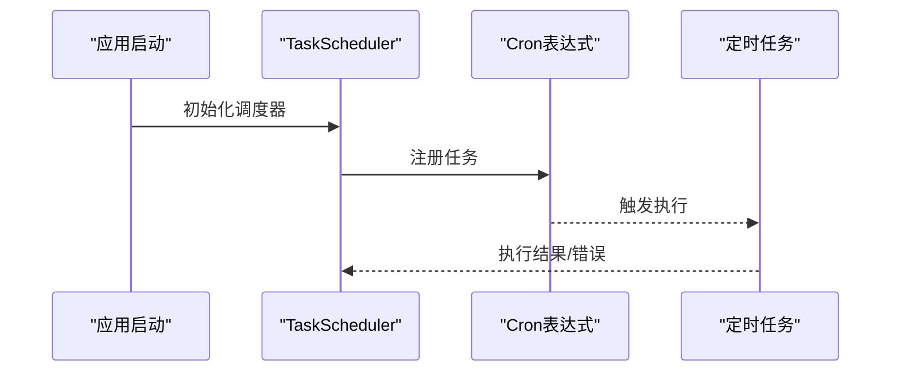
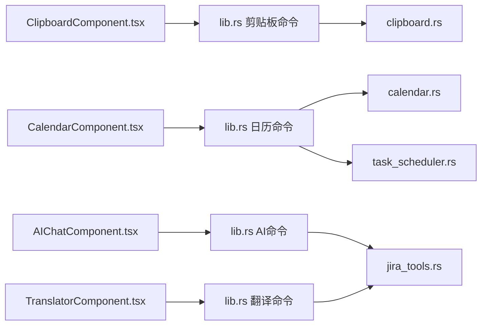

# 数据生命周期管理

<cite>
**本文引用的文件**
- [README.md](file://README.md)
- [main.rs](file://src-tauri/src/main.rs)
- [lib.rs](file://src-tauri/src/lib.rs)
- [clipboard.rs](file://src-tauri/src/clipboard.rs)
- [calendar.rs](file://src-tauri/src/calendar.rs)
- [jira_tools.rs](file://src-tauri/src/jira_tools.rs)
- [task_scheduler.rs](file://src-tauri/src/task_scheduler.rs)
- [window_utils.rs](file://src-tauri/src/window_utils.rs)
- [ClipboardComponent.tsx](file://src/components/ClipboardComponent.tsx)
- [CalendarComponent.tsx](file://src/components/CalendarComponent.tsx)
- [AIChatComponent.tsx](file://src/components/AIChatComponent.tsx)
- [TranslatorComponent.tsx](file://src/components/TranslatorComponent.tsx)
- [bubbles.json](file://public/config/bubbles.json)
</cite>

## 目录
1. [引言](#引言)
2. [项目结构](#项目结构)
3. [核心组件](#核心组件)
4. [架构总览](#架构总览)
5. [详细组件分析](#详细组件分析)
6. [依赖关系分析](#依赖关系分析)
7. [性能考量](#性能考量)
8. [故障排查指南](#故障排查指南)
9. [结论](#结论)
10. [附录](#附录)

## 引言
本文件围绕“数据生命周期管理”的主题，结合代码库中的实际实现，系统阐述不同类型数据的创建、初始化、更新、归档与清理的完整流程，并给出监控与自动化管理建议。重点覆盖以下方面：
- 数据创建与初始化：默认值、初始状态、预填充策略
- 更新与同步：增量更新、冲突检测、版本控制思路
- 归档与压缩：历史数据管理、存储空间优化、长期保留策略
- 清理与回收：过期数据删除、垃圾回收、存储空间释放
- 监控与管理：生命周期跟踪、自动化清理、容量预警
- 最佳实践与故障恢复

## 项目结构
该项目采用前端 React + TypeScript 与后端 Rust + Tauri 的混合架构。数据持久化主要通过应用数据目录下的 JSON 文件实现；部分内存型数据（如剪贴板历史）在应用重启后丢失。

图表来源
- [main.rs:8-10](file://src-tauri/src/main.rs#L8-L10)
- [lib.rs:1-32](file://src-tauri/src/lib.rs#L1-L32)
- [clipboard.rs:1-20](file://src-tauri/src/clipboard.rs#L1-L20)
- [calendar.rs:83-96](file://src-tauri/src/calendar.rs#L83-L96)
- [jira_tools.rs:66-78](file://src-tauri/src/jira_tools.rs#L66-L78)
- [task_scheduler.rs:1-20](file://src-tauri/src/task_scheduler.rs#L1-L20)
- [window_utils.rs:1-33](file://src-tauri/src/window_utils.rs#L1-L33)
- [ClipboardComponent.tsx:1-21](file://src/components/ClipboardComponent.tsx#L1-L21)
- [CalendarComponent.tsx:63-81](file://src/components/CalendarComponent.tsx#L63-L81)
- [AIChatComponent.tsx:55-68](file://src/components/AIChatComponent.tsx#L55-L68)
- [TranslatorComponent.tsx:95-109](file://src/components/TranslatorComponent.tsx#L95-L109)
- [bubbles.json:1-52](file://public/config/bubbles.json#L1-L52)

章节来源
- [README.md:129-215](file://README.md#L129-L215)
- [main.rs:8-10](file://src-tauri/src/main.rs#L8-L10)
- [lib.rs:1-32](file://src-tauri/src/lib.rs#L1-L32)

## 核心组件
- 剪贴板历史（内存型）：由后端维护固定长度的最近记录队列，应用重启即丢失。
- 日历待办与设置（磁盘型）：以 JSON 文件形式存储，支持按日期分片与配置项持久化。
- AI/有道翻译配置（磁盘型）：以 JSON 文件形式存储，支持本地优先与资源文件回退。
- JIRA/Git 配置（磁盘型）：以 JSON 文件形式存储，支持加载与保存。
- 定时任务调度：基于 cron 表达式的周期性任务，用于自动化处理。

章节来源
- [clipboard.rs:14-27](file://src-tauri/src/clipboard.rs#L14-L27)
- [calendar.rs:83-96](file://src-tauri/src/calendar.rs#L83-L96)
- [lib.rs:578-638](file://src-tauri/src/lib.rs#L578-L638)
- [lib.rs:302-386](file://src-tauri/src/lib.rs#L302-L386)
- [lib.rs:428-476](file://src-tauri/src/lib.rs#L428-L476)
- [jira_tools.rs:66-115](file://src-tauri/src/jira_tools.rs#L66-L115)
- [task_scheduler.rs:21-61](file://src-tauri/src/task_scheduler.rs#L21-L61)

## 架构总览
前端通过 Tauri 的 invoke 与后端命令交互，后端负责数据读写、状态管理与系统能力调用。数据持久化主要通过异步文件系统与内存结构实现。

图表来源
- [lib.rs:578-638](file://src-tauri/src/lib.rs#L578-L638)
- [clipboard.rs:124-134](file://src-tauri/src/clipboard.rs#L124-L134)
- [calendar.rs:115-141](file://src-tauri/src/calendar.rs#L115-L141)
- [jira_tools.rs:80-115](file://src-tauri/src/jira_tools.rs#L80-L115)

## 详细组件分析

### 剪贴板历史生命周期
- 创建与初始化
  - 后端维护固定长度的最近记录队列，首次使用时自动创建内存结构。
  - 去重策略：若与最近一次内容相同则忽略。
  - 长度上限：固定最多 N 条，超出时从尾部淘汰。
- 更新与同步
  - 前端定时轮询后端命令获取最新历史。
  - 后端在检测到新内容时追加，避免重复。
- 归档与清理
  - 无长期归档；应用重启后清空。
  - 支持手动清空历史。
- 监控与管理
  - 前端显示条数与大小估算；后端打印调试信息。

图表来源
- [clipboard.rs:84-121](file://src-tauri/src/clipboard.rs#L84-L121)
- [clipboard.rs:29-82](file://src-tauri/src/clipboard.rs#L29-L82)

章节来源
- [clipboard.rs:14-27](file://src-tauri/src/clipboard.rs#L14-L27)
- [clipboard.rs:84-121](file://src-tauri/src/clipboard.rs#L84-L121)
- [clipboard.rs:124-224](file://src-tauri/src/clipboard.rs#L124-L224)
- [ClipboardComponent.tsx:17-32](file://src/components/ClipboardComponent.tsx#L17-L32)

### 日历待办与设置生命周期
- 创建与初始化
  - 首次访问某日期时，若文件不存在则创建空容器。
  - 设置加载失败时使用默认值。
- 更新与同步
  - 按日期维度写入/读取，支持覆盖与删除。
  - 前端监听刷新事件以同步 UI。
- 归档与清理
  - 提供清理旧数据的命令，按日期阈值裁剪历史。
- 监控与管理
  - 前端轮询加载当月/当周待办；支持背景图上传与删除。

图表来源
- [lib.rs:578-638](file://src-tauri/src/lib.rs#L578-L638)
- [calendar.rs:98-141](file://src-tauri/src/calendar.rs#L98-L141)
- [CalendarComponent.tsx:83-122](file://src/components/CalendarComponent.tsx#L83-L122)

章节来源
- [lib.rs:578-638](file://src-tauri/src/lib.rs#L578-L638)
- [calendar.rs:83-96](file://src-tauri/src/calendar.rs#L83-L96)
- [calendar.rs:324-361](file://src-tauri/src/calendar.rs#L324-L361)
- [CalendarComponent.tsx:63-81](file://src/components/CalendarComponent.tsx#L63-L81)

### AI/有道翻译配置生命周期
- 创建与初始化
  - 本地配置优先；若为空则回退到资源文件。
  - 加载失败时提示配置缺失。
- 更新与同步
  - 前端保存配置后立即生效。
- 归档与清理
  - 无自动归档；可通过删除文件或覆盖配置实现。
- 监控与管理
  - 前端显示配置状态与错误提示。

图表来源
- [lib.rs:358-386](file://src-tauri/src/lib.rs#L358-L386)
- [lib.rs:428-476](file://src-tauri/src/lib.rs#L428-L476)
- [AIChatComponent.tsx:55-68](file://src/components/AIChatComponent.tsx#L55-L68)
- [TranslatorComponent.tsx:95-109](file://src/components/TranslatorComponent.tsx#L95-L109)

章节来源
- [lib.rs:302-386](file://src-tauri/src/lib.rs#L302-L386)
- [lib.rs:428-476](file://src-tauri/src/lib.rs#L428-L476)
- [AIChatComponent.tsx:55-68](file://src/components/AIChatComponent.tsx#L55-L68)
- [TranslatorComponent.tsx:95-109](file://src/components/TranslatorComponent.tsx#L95-L109)

### JIRA/Git 配置生命周期
- 创建与初始化
  - 配置文件按需创建；加载失败返回空。
- 更新与同步
  - 保存后立即写入文件；读取时进行有效性检查。
- 归档与清理
  - 无内置归档；可通过删除文件或迁移配置实现。
- 监控与管理
  - 提供连接测试命令，便于诊断。

图表来源
- [jira_tools.rs:80-115](file://src-tauri/src/jira_tools.rs#L80-L115)
- [jira_tools.rs:117-166](file://src-tauri/src/jira_tools.rs#L117-L166)

章节来源
- [jira_tools.rs:66-115](file://src-tauri/src/jira_tools.rs#L66-L115)
- [jira_tools.rs:117-166](file://src-tauri/src/jira_tools.rs#L117-L166)

### 定时任务调度生命周期
- 创建与初始化
  - 启动时初始化调度器并注册周期任务。
- 更新与同步
  - 任务按 cron 表达式执行，内部逻辑调用后端处理函数。
- 归档与清理
  - 任务本身不直接产生归档；可配合业务清理逻辑使用。
- 监控与管理
  - 控制台输出任务执行状态与错误。

图表来源
- [task_scheduler.rs:21-61](file://src-tauri/src/task_scheduler.rs#L21-L61)

章节来源
- [task_scheduler.rs:1-93](file://src-tauri/src/task_scheduler.rs#L1-L93)

## 依赖关系分析
- 前端组件通过 Tauri 命令与后端交互，后端命令进一步访问文件系统或内存结构。
- 日历与剪贴板模块分别承担不同的数据域；AI/翻译与 JIRA 工具模块提供配置与外部服务集成。
- 定时任务调度器作为后台服务，驱动周期性业务逻辑。

图表来源
- [lib.rs:19-31](file://src-tauri/src/lib.rs#L19-L31)
- [clipboard.rs:1-20](file://src-tauri/src/clipboard.rs#L1-L20)
- [calendar.rs:1-10](file://src-tauri/src/calendar.rs#L1-L10)
- [jira_tools.rs:1-10](file://src-tauri/src/jira_tools.rs#L1-L10)
- [task_scheduler.rs:1-10](file://src-tauri/src/task_scheduler.rs#L1-L10)

章节来源
- [lib.rs:19-31](file://src-tauri/src/lib.rs#L19-L31)

## 性能考量
- 剪贴板历史：内存队列操作为 O(1) 插入与 O(n) 淘汰，N 固定较小，整体开销低。
- 日历数据：按日期分片读写，避免大文件全量扫描；建议定期清理旧数据以维持查询效率。
- 配置读写：异步文件 I/O，建议合并频繁变更，减少磁盘写入次数。
- 定时任务：使用轻量调度器，注意任务执行耗时与并发控制。

## 故障排查指南
- 配置加载失败
  - 现象：AI/翻译配置提示无效或缺失。
  - 排查：确认本地配置文件是否存在与格式正确；检查资源文件路径与内容。
  - 处理：重新保存配置或修复资源文件。
- 日历数据异常
  - 现象：待办读取为空或保存失败。
  - 排查：检查应用数据目录权限与磁盘空间；确认 JSON 文件完整性。
  - 处理：重建文件或手动修复 JSON。
- 剪贴板历史异常
  - 现象：历史不更新或重复。
  - 排查：检查前端轮询频率与后端去重逻辑；确认内容长度限制。
  - 处理：调整轮询间隔或清理历史。
- 定时任务未执行
  - 现象：任务未按预期触发。
  - 排查：检查调度器初始化与 cron 表达式；查看控制台输出。
  - 处理：修正表达式或重启调度器。

章节来源
- [lib.rs:358-386](file://src-tauri/src/lib.rs#L358-L386)
- [lib.rs:428-476](file://src-tauri/src/lib.rs#L428-L476)
- [calendar.rs:324-361](file://src-tauri/src/calendar.rs#L324-L361)
- [clipboard.rs:84-121](file://src-tauri/src/clipboard.rs#L84-L121)
- [task_scheduler.rs:21-61](file://src-tauri/src/task_scheduler.rs#L21-L61)

## 结论
本项目的数据生命周期管理以“按需创建、增量更新、本地持久化、定期清理”为核心策略。剪贴板历史采用内存队列实现即时访问与自动去重；日历与配置类数据采用 JSON 文件实现稳定持久化与默认回退；定时任务提供自动化能力。建议在生产环境中补充：
- 历史数据归档与压缩策略
- 存储空间监控与容量预警
- 版本控制与冲突检测机制
- 自动备份与恢复流程

## 附录
- 生命周期最佳实践
  - 创建：提供默认值与回退策略；确保幂等性。
  - 初始化：最小化初始化成本；延迟加载非关键数据。
  - 更新：采用增量更新与事务性写入；实现冲突检测。
  - 归档：按时间窗口归档；支持压缩与索引。
  - 清理：设定保留期限；提供回收站与恢复接口。
  - 监控：埋点统计与告警；可视化仪表盘。
- 故障恢复
  - 配置回退：本地配置无效时自动回退到资源文件。
  - 数据修复：提供校验与修复工具；支持离线修复。
  - 快速恢复：定期备份；一键恢复到最近可用状态。