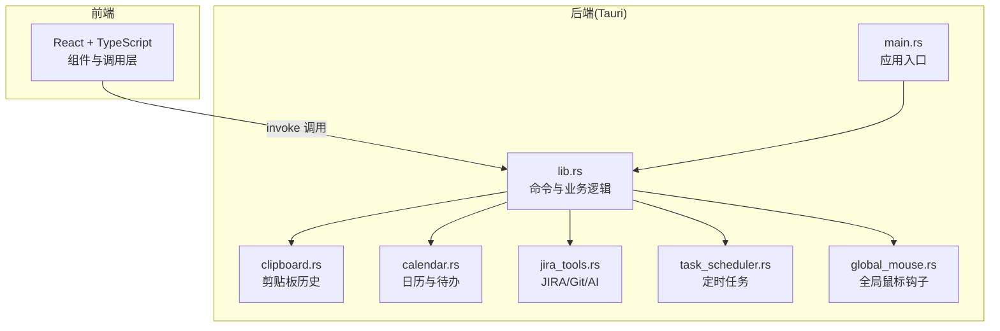
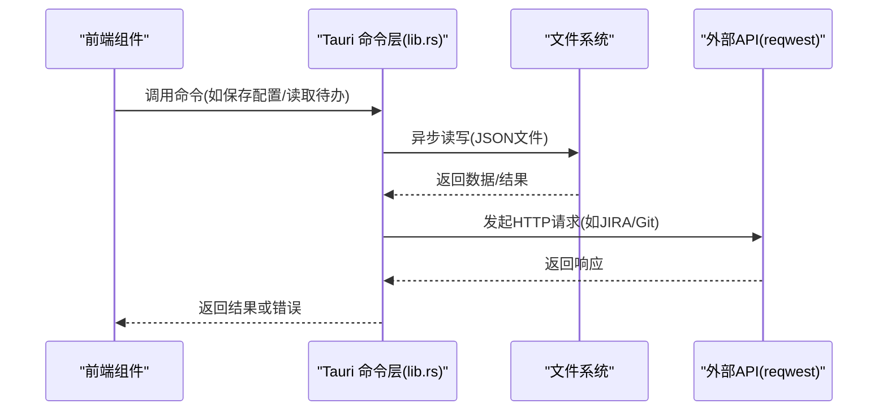
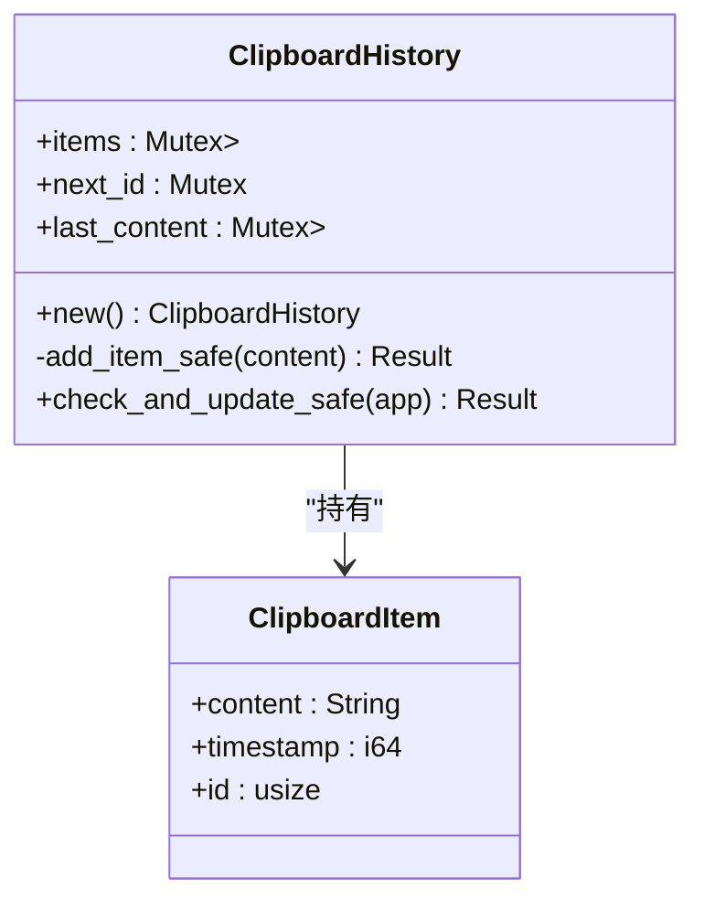
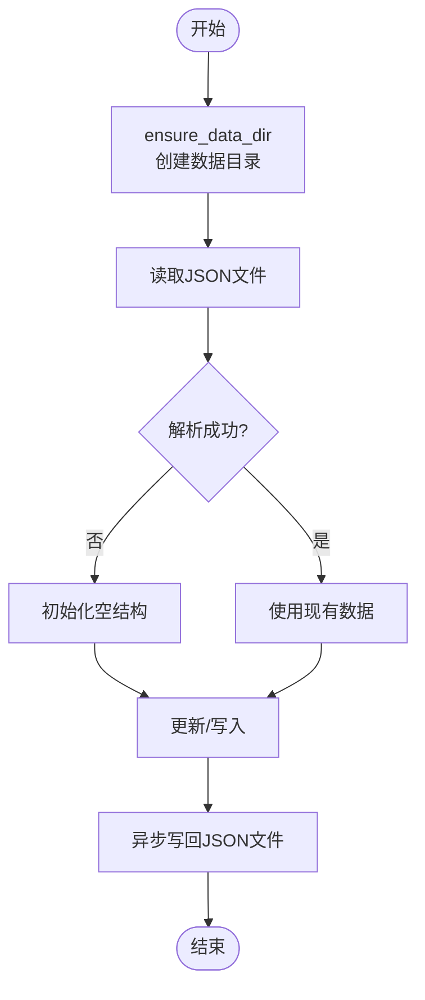
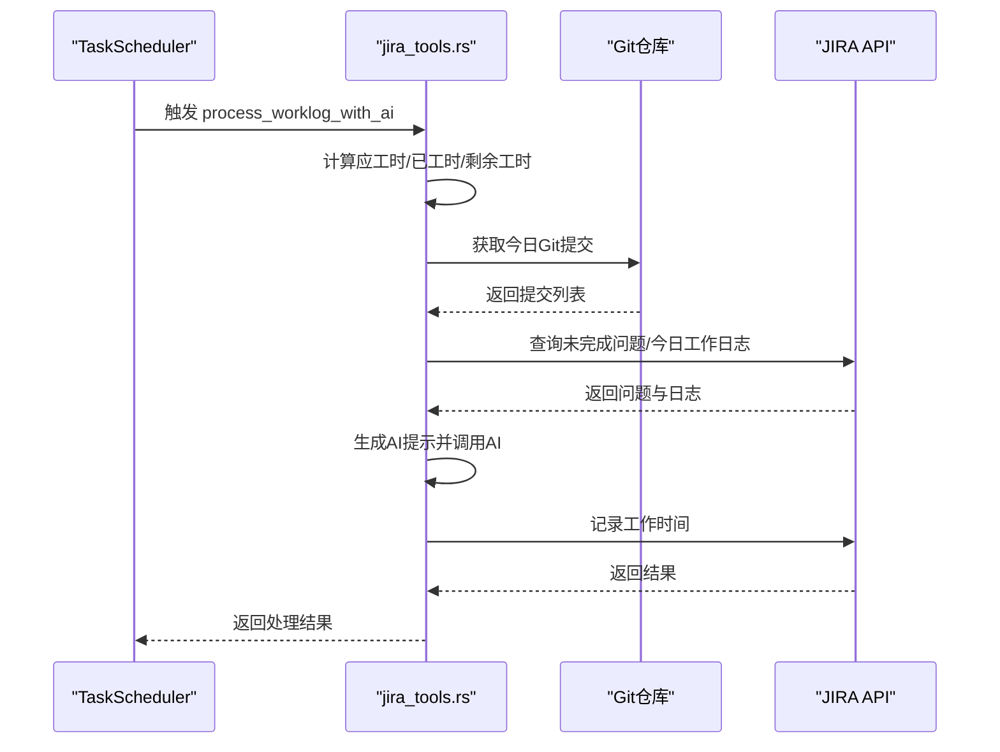
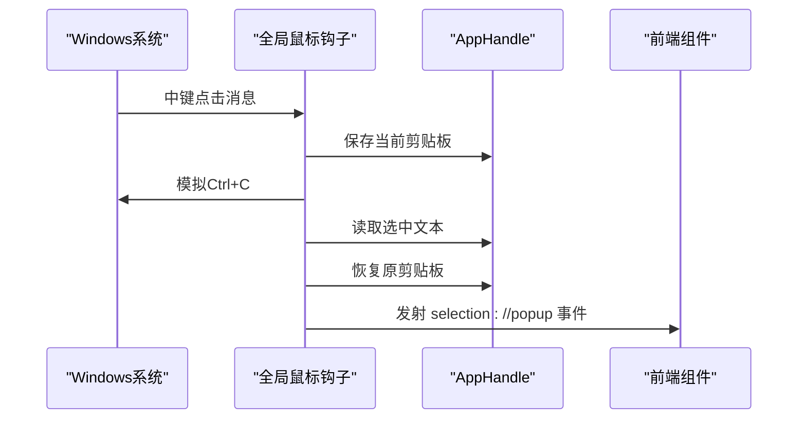
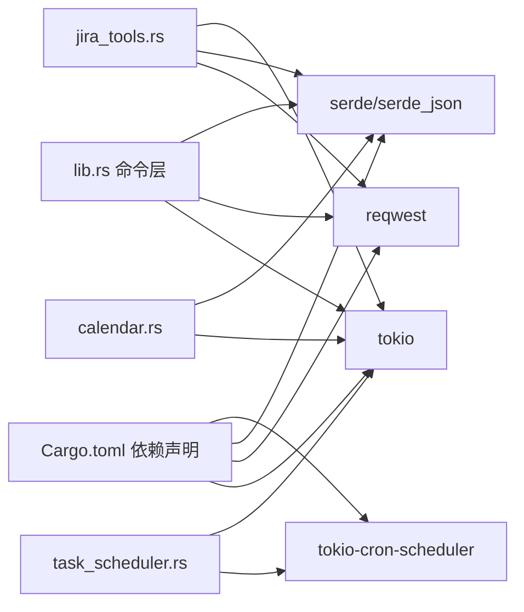

# 数据访问模式

<cite>
**本文档引用的文件**
- [Cargo.toml](file://src-tauri/Cargo.toml)
- [lib.rs](file://src-tauri/src/lib.rs)
- [clipboard.rs](file://src-tauri/src/clipboard.rs)
- [calendar.rs](file://src-tauri/src/calendar.rs)
- [jira_tools.rs](file://src-tauri/src/jira_tools.rs)
- [task_scheduler.rs](file://src-tauri/src/task_scheduler.rs)
- [global_mouse.rs](file://src-tauri/src/global_mouse.rs)
- [main.rs](file://src-tauri/src/main.rs)
- [deepseek.json](file://src-tauri/config/deepseek.json)
- [bubbles.json](file://public/config/bubbles.json)
- [README.md](file://README.md)
</cite>

## 目录
1. [引言](#引言)
2. [项目结构](#项目结构)
3. [核心组件](#核心组件)
4. [架构概览](#架构概览)
5. [详细组件分析](#详细组件分析)
6. [依赖关系分析](#依赖关系分析)
7. [性能考量](#性能考量)
8. [故障排查指南](#故障排查指南)
9. [结论](#结论)
10. [附录](#附录)

## 引言
本文件围绕桌面应用中的数据访问模式进行系统化技术文档整理，重点覆盖以下方面：
- 数据访问模式：读写分离、缓存策略、事务处理
- 异步数据访问：Tokio 异步运行时、并发控制、错误处理
- 性能优化：批量操作、连接池管理、查询优化
- 一致性保障：原子操作、事务边界、冲突解决
- 安全措施：SQL 注入防护、参数绑定、访问权限控制
- 监控与调试：性能指标、错误追踪、日志记录
- 最佳实践与常见问题解决方案

本项目为基于 Rust + Tauri 的桌面应用，数据访问主要通过文件系统持久化与外部 API 调用实现，未使用数据库驱动，因此本文将结合现有实现给出针对性的模式说明与改进建议。

## 项目结构
后端采用 Rust + Tauri 架构，核心业务逻辑集中在 src-tauri/src 下的模块中，通过 Tauri 命令暴露给前端调用。数据持久化主要依赖文件系统，部分模块涉及网络请求与定时任务。

**图表来源**
- [main.rs:8-10](file://src-tauri/src/main.rs#L8-L10)
- [lib.rs:1-33](file://src-tauri/src/lib.rs#L1-L33)
- [clipboard.rs:1-20](file://src-tauri/src/clipboard.rs#L1-L20)
- [calendar.rs:1-20](file://src-tauri/src/calendar.rs#L1-L20)
- [jira_tools.rs:1-20](file://src-tauri/src/jira_tools.rs#L1-L20)
- [task_scheduler.rs:1-20](file://src-tauri/src/task_scheduler.rs#L1-L20)
- [global_mouse.rs:1-20](file://src-tauri/src/global_mouse.rs#L1-L20)

**章节来源**
- [README.md:129-168](file://README.md#L129-L168)
- [main.rs:8-10](file://src-tauri/src/main.rs#L8-L10)
- [lib.rs:1-33](file://src-tauri/src/lib.rs#L1-L33)

## 核心组件
- 命令与状态管理：通过 #[tauri::command] 暴露的函数作为数据访问入口；使用 State/Arc<Mutex<...>> 管理共享状态（如系统信息、剪贴板历史）。
- 文件系统持久化：应用数据目录下以 JSON 文件形式存储配置与业务数据（如剪贴板历史、日历待办、JIRA 配置等）。
- 异步运行时：Tokio 提供异步文件系统与 HTTP 请求能力；定时任务通过 tokio-cron-scheduler 实现。
- 外部 API 集成：JIRA、Git、AI 接口通过 reqwest 发起请求，实现数据读取与写入。

**章节来源**
- [lib.rs:41-72](file://src-tauri/src/lib.rs#L41-L72)
- [clipboard.rs:14-27](file://src-tauri/src/clipboard.rs#L14-L27)
- [calendar.rs:83-90](file://src-tauri/src/calendar.rs#L83-L90)
- [jira_tools.rs:66-115](file://src-tauri/src/jira_tools.rs#L66-L115)
- [task_scheduler.rs:9-19](file://src-tauri/src/task_scheduler.rs#L9-L19)

## 架构概览
应用采用“前端调用 + 后端命令 + 文件系统/外部 API”的数据访问架构。命令函数负责参数校验、错误处理与数据序列化，文件系统承担持久化职责，外部 API 提供业务数据。

**图表来源**
- [lib.rs:311-323](file://src-tauri/src/lib.rs#L311-L323)
- [calendar.rs:115-141](file://src-tauri/src/calendar.rs#L115-L141)
- [jira_tools.rs:188-243](file://src-tauri/src/jira_tools.rs#L188-L243)

## 详细组件分析

### 剪贴板历史模块（数据读写与并发控制）
- 数据结构：ClipboardHistory 使用 Mutex 包裹 VecDeque 与计数器，确保线程安全；ClipboardItem 包含内容、时间戳与 ID。
- 并发控制：通过 Mutex 锁保护共享状态；在 check_and_update_safe 中先读取剪贴板，再安全地更新历史队列。
- 读写策略：add_item_safe 控制最大容量（固定上限），避免无限增长；check_and_update_safe 去重与长度限制。
- 错误处理：对锁获取、文件读写、API 调用均进行 Result 包装与错误信息透传。

**图表来源**
- [clipboard.rs:7-27](file://src-tauri/src/clipboard.rs#L7-L27)

**章节来源**
- [clipboard.rs:20-122](file://src-tauri/src/clipboard.rs#L20-L122)

### 日历与待办模块（文件系统持久化与批量操作）
- 数据模型：TodoItem、DayData、CalendarSettings 等结构体；CalendarManager 负责数据目录管理与 CRUD。
- 读写策略：load/save 采用 tokio::fs 异步读写 todos.json/events.json；支持按日期批量读取与写入。
- 批量操作：cleanup_old_data 对历史数据进行裁剪，减少文件体积与 IO 压力。
- 错误处理：对文件存在性检查、JSON 解析、序列化失败进行捕获与返回。

**图表来源**
- [calendar.rs:92-141](file://src-tauri/src/calendar.rs#L92-L141)

**章节来源**
- [calendar.rs:83-141](file://src-tauri/src/calendar.rs#L83-L141)
- [calendar.rs:324-361](file://src-tauri/src/calendar.rs#L324-L361)

### JIRA/Git/AI 集成（外部 API 与定时任务）
- 配置管理：JIRA/Git/AI 配置分别保存在应用数据目录下的 JSON 文件中；优先读取本地配置，否则回退至资源文件。
- API 调用：通过 reqwest 发起 GET/POST 请求，处理鉴权（Basic/Base64）、查询参数与响应解析。
- 定时任务：使用 tokio-cron-scheduler 每分钟检查，工作日 17:00 左右触发 AI 自动补全日志流程。
- 错误处理：对 HTTP 状态码、响应体解析、错误 JSON 结构进行统一处理与错误信息拼装。

**图表来源**
- [task_scheduler.rs:21-61](file://src-tauri/src/task_scheduler.rs#L21-L61)
- [jira_tools.rs:808-955](file://src-tauri/src/jira_tools.rs#L808-L955)

**章节来源**
- [jira_tools.rs:66-115](file://src-tauri/src/jira_tools.rs#L66-L115)
- [jira_tools.rs:168-185](file://src-tauri/src/jira_tools.rs#L168-L185)
- [jira_tools.rs:188-243](file://src-tauri/src/jira_tools.rs#L188-L243)
- [jira_tools.rs:262-373](file://src-tauri/src/jira_tools.rs#L262-L373)
- [jira_tools.rs:375-455](file://src-tauri/src/jira_tools.rs#L375-L455)
- [jira_tools.rs:457-503](file://src-tauri/src/jira_tools.rs#L457-L503)
- [jira_tools.rs:525-654](file://src-tauri/src/jira_tools.rs#L525-L654)
- [jira_tools.rs:808-955](file://src-tauri/src/jira_tools.rs#L808-L955)
- [task_scheduler.rs:9-79](file://src-tauri/src/task_scheduler.rs#L9-L79)

### 全局鼠标钩子（事件驱动与数据采集）
- 事件采集：通过 Windows 钩子捕获中键点击事件，模拟 Ctrl+C 获取选中文本，恢复剪贴板内容并发射事件。
- 数据流转：将选中文本与光标位置封装为 SelectionPayload，通过 Tauri 事件通道传递给前端。

**图表来源**
- [global_mouse.rs:30-69](file://src-tauri/src/global_mouse.rs#L30-L69)

**章节来源**
- [global_mouse.rs:111-149](file://src-tauri/src/global_mouse.rs#L111-L149)

## 依赖关系分析
- Tokio 异步运行时：提供异步文件系统与定时任务能力；在命令与调度器中广泛使用。
- reqwest：用于外部 API 调用，支持 JSON 传输与 TLS。
- serde/serde_json：用于配置与业务数据的序列化/反序列化。
- tokio-cron-scheduler：基于 cron 表达式的定时任务调度。

**图表来源**
- [Cargo.toml:15-35](file://src-tauri/Cargo.toml#L15-L35)
- [lib.rs:1-11](file://src-tauri/src/lib.rs#L1-L11)
- [calendar.rs:1-4](file://src-tauri/src/calendar.rs#L1-L4)
- [jira_tools.rs:1-9](file://src-tauri/src/jira_tools.rs#L1-L9)
- [task_scheduler.rs:1-8](file://src-tauri/src/task_scheduler.rs#L1-L8)

**章节来源**
- [Cargo.toml:15-35](file://src-tauri/Cargo.toml#L15-L35)

## 性能考量
- 异步 I/O 与并发
  - 使用 tokio::fs::read_to_string/write 等异步 API，避免阻塞主线程。
  - 通过 Mutex 保护共享状态，避免竞态条件；在高频更新场景下可考虑拆分锁粒度或引入无锁队列。
- 批量与缓存
  - 日历模块按日期聚合数据，避免频繁小文件读写；可通过内存缓存近期日期数据降低 IO。
  - 剪贴板模块限制最大容量，防止内存膨胀。
- 连接与请求优化
  - 外部 API 请求复用客户端（如 reqwest Client），减少握手开销。
  - 对大响应体进行分块处理与超时控制，避免长时间占用异步任务。
- 定时任务
  - 使用 cron 表达式精确控制执行频率，避免过于频繁的任务导致资源争用。

[本节为通用性能指导，无需特定文件引用]

## 故障排查指南
- 常见错误与定位
  - 文件读写失败：检查应用数据目录权限与路径；确认 tokio::fs::try_exists 与错误信息。
  - API 请求失败：检查鉴权头、URL 拼接与响应状态码；解析错误 JSON 并记录详细信息。
  - 剪贴板异常：确认系统剪贴板可用性与权限；检查模拟按键过程中的异常。
- 日志与追踪
  - 在命令函数中打印关键步骤与错误信息，便于前端或开发者定位问题。
  - 对定时任务执行结果进行日志记录，便于审计与排障。
- 配置校验
  - 本地配置优先策略：若本地配置无效，回退到资源文件；确保错误信息清晰提示用户配置缺失。

**章节来源**
- [lib.rs:352-379](file://src-tauri/src/lib.rs#L352-L379)
- [jira_tools.rs:457-503](file://src-tauri/src/jira_tools.rs#L457-L503)
- [clipboard.rs:84-122](file://src-tauri/src/clipboard.rs#L84-L122)

## 结论
本项目采用“文件系统 + 外部 API + Tokio 异步”的数据访问模式，通过 Tauri 命令层统一对外提供能力。现有实现具备良好的异步与并发控制，但在数据库驱动缺失的情况下，建议在需要强一致性的场景引入轻量级嵌入式数据库（如 SQLite），并通过连接池与事务机制提升可靠性与性能。同时，完善监控与日志体系，有助于持续优化数据访问链路。

[本节为总结性内容，无需特定文件引用]

## 附录

### 数据访问模式最佳实践清单
- 读写分离
  - 读多写少场景：对热点数据进行内存缓存；写操作采用批量落盘策略。
  - 写多场景：使用异步写入队列，合并多次变更后再持久化。
- 缓存策略
  - LRU/LFU 缓存：针对日历等按日期访问的数据，按日期维度缓存。
  - 失效策略：基于 TTL 或基于变更事件的主动失效。
- 事务处理
  - 单文件事务：通过临时文件 + 原子替换实现事务语义。
  - 多文件事务：引入锁文件或版本号，保证多文件一致性。
- 异步与并发
  - 使用 tokio::sync::Mutex/Semaphore 控制并发；避免在锁内进行耗时操作。
  - 对高频操作进行批量化，减少上下文切换。
- 安全措施
  - 参数绑定与输入校验：对外部 API 参数进行严格校验与编码。
  - 访问权限控制：限制文件系统访问范围，遵循最小权限原则。
- 监控与调试
  - 指标采集：记录请求耗时、错误率、缓存命中率。
  - 日志分级：区分 INFO/WARN/ERROR，保留关键上下文。
  - 链路追踪：为命令调用建立唯一 ID，串联前后端日志。

[本节为通用最佳实践，无需特定文件引用]