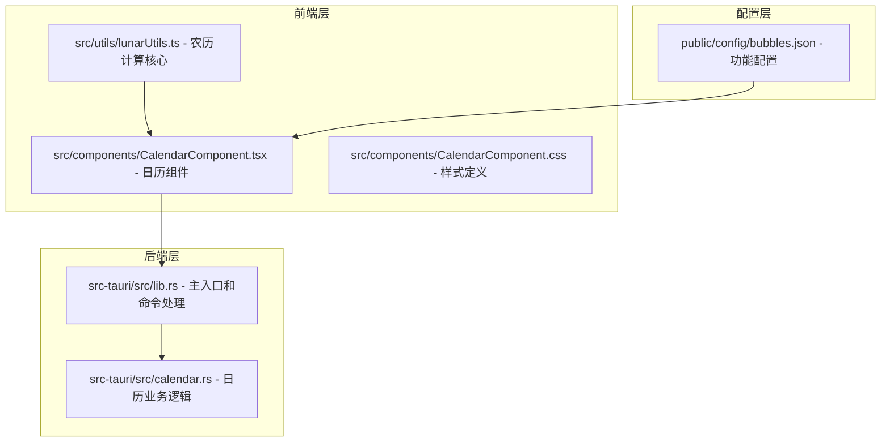
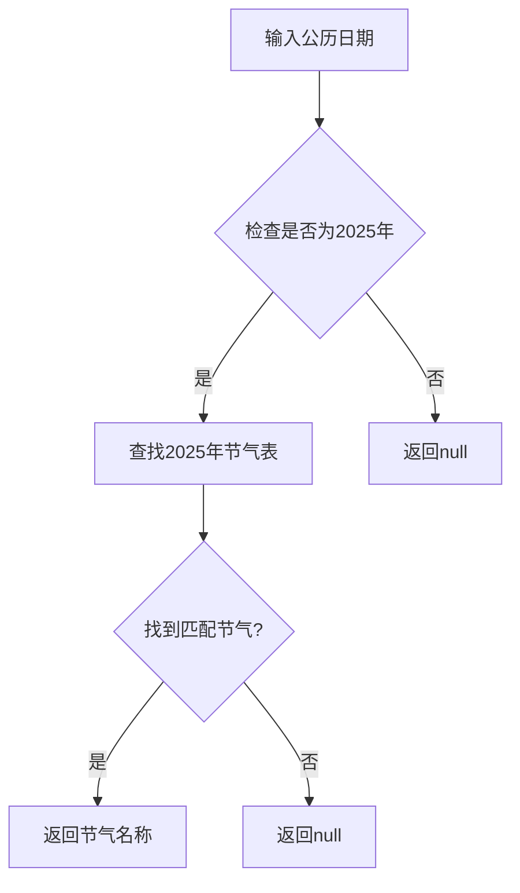
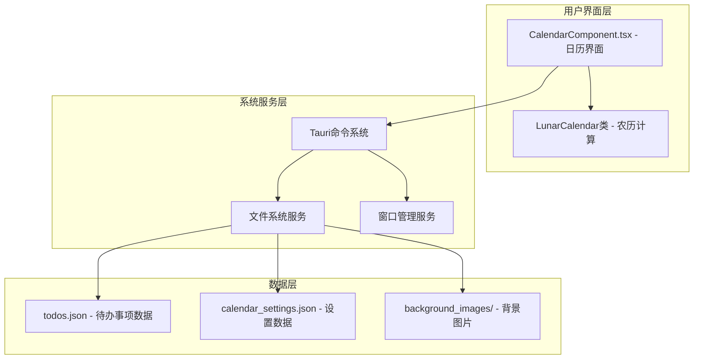
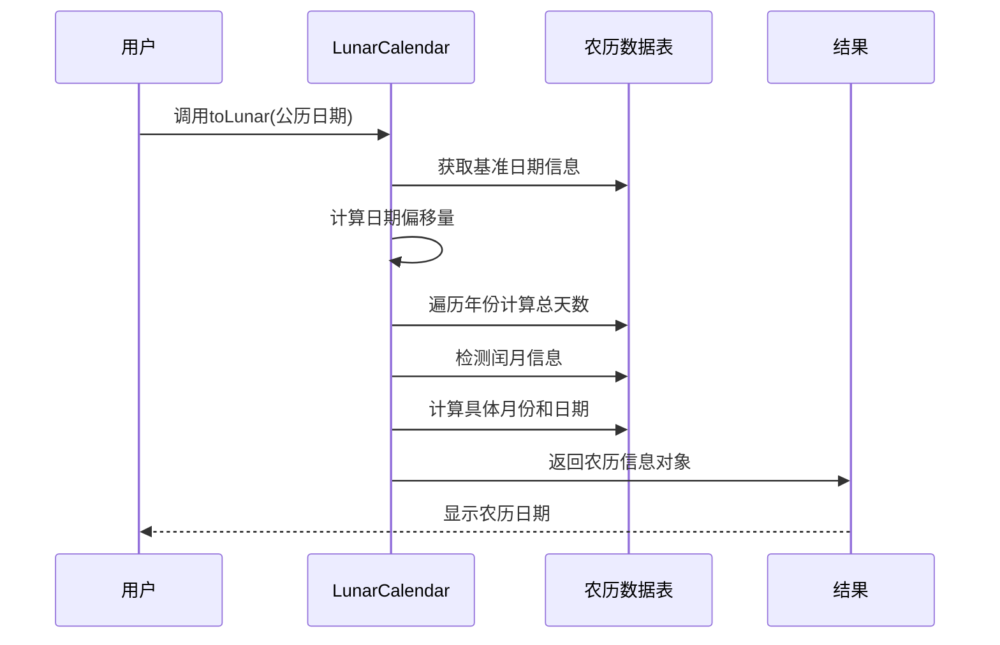
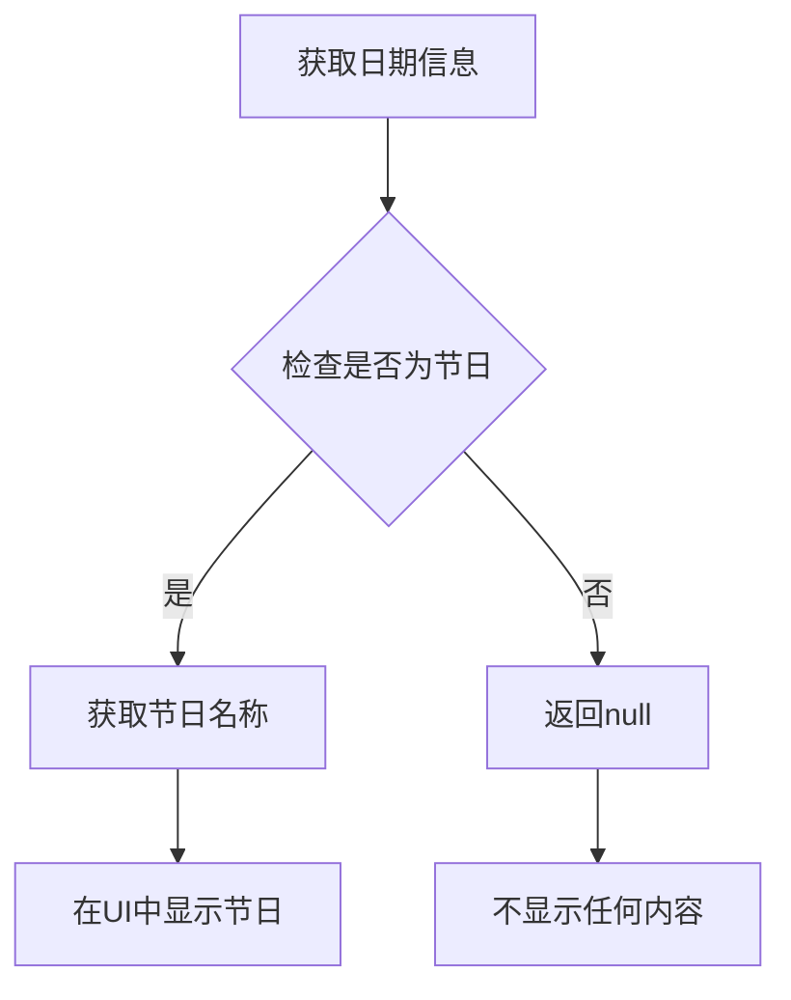
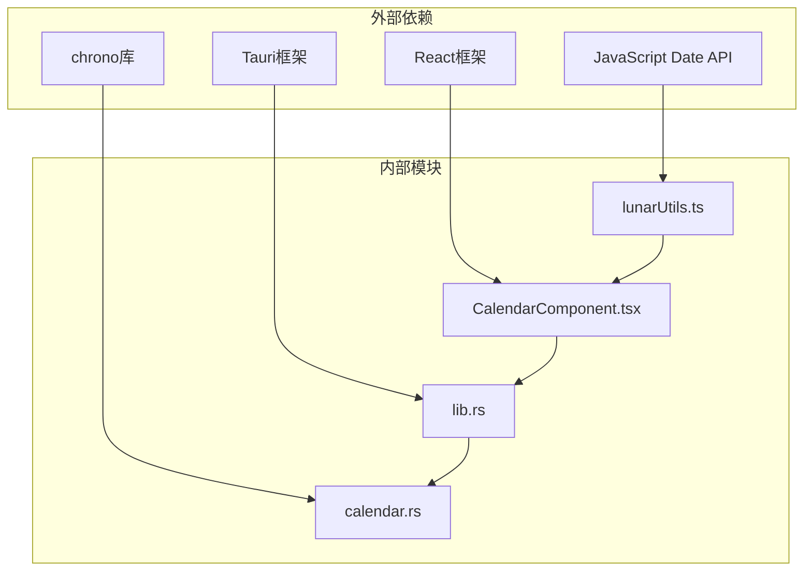

# 农历信息集成

<cite>
**本文档引用的文件**
- [lunarUtils.ts](file://src/utils/lunarUtils.ts)
- [CalendarComponent.tsx](file://src/components/CalendarComponent.tsx)
- [CalendarComponent.css](file://src/components/CalendarComponent.css)
- [calendar.rs](file://src-tauri/src/calendar.rs)
- [lib.rs](file://src-tauri/src/lib.rs)
- [README.md](file://README.md)
</cite>

## 目录
1. [简介](#简介)
2. [项目结构](#项目结构)
3. [核心组件](#核心组件)
4. [架构概览](#架构概览)
5. [详细组件分析](#详细组件分析)
6. [依赖关系分析](#依赖关系分析)
7. [性能考虑](#性能考虑)
8. [故障排除指南](#故障排除指南)
9. [结论](#结论)
10. [附录](#附录)

## 简介

农历信息集成模块是 XSUN Desktop Pet 桌面宠物应用中的一个重要功能组件，负责提供农历日期计算、节气系统和节日标注功能。该模块采用前后端分离的架构设计，前端使用 TypeScript 实现农历计算算法，后端使用 Rust 提供数据持久化和系统级功能支持。

该模块的主要功能包括：
- 公历到农历的精确转换计算
- 二十四节气的动态计算和显示
- 传统节日和现代节日的识别标注
- 农历数据的缓存策略和性能优化
- 国际化支持和多语言显示
- 扩展接口和自定义配置能力

## 项目结构

项目采用模块化的组织结构，农历信息集成模块主要分布在以下目录：

**图表来源**
- [lunarUtils.ts:1-151](file://src/utils/lunarUtils.ts#L1-L151)
- [CalendarComponent.tsx:1-561](file://src/components/CalendarComponent.tsx#L1-L561)
- [calendar.rs:1-363](file://src-tauri/src/calendar.rs#L1-L363)

**章节来源**
- [README.md:129-169](file://README.md#L129-L169)

## 核心组件

### 农历计算引擎 (LunarCalendar)

农历计算引擎是整个模块的核心，基于传统的农历算法实现精确的公历到农历转换。该引擎使用位运算和位掩码技术来处理复杂的农历计算逻辑。

#### 核心算法特点

1. **农历数据存储**: 使用固定长度的数组存储 1900-2100 年间的农历信息
2. **闰月检测**: 通过位运算检测闰月的存在和位置
3. **月天数计算**: 利用位掩码确定每月的天数（29或30天）
4. **偏移量计算**: 基于基准日期计算指定日期的农历对应关系

#### 节气系统实现

节气系统采用基于年份的数据映射方式，当前版本使用 2025 年的精确节气日期数据：

**图表来源**
- [lunarUtils.ts:107-142](file://src/utils/lunarUtils.ts#L107-L142)

**章节来源**
- [lunarUtils.ts:3-150](file://src/utils/lunarUtils.ts#L3-L150)

### 日历组件集成

日历组件负责将农历信息集成到用户界面中，提供直观的农历日期显示和交互功能。

#### 组件功能特性

1. **农历日期显示**: 在日历单元格中显示农历日期和闰月标识
2. **节气标注**: 自动识别并显示当天的二十四节气
3. **双击交互**: 支持双击日期打开待办事项窗口
4. **卡片模式**: 提供紧凑的卡片视图模式
5. **背景轮播**: 支持自定义背景图片的自动轮播

**章节来源**
- [CalendarComponent.tsx:319-450](file://src/components/CalendarComponent.tsx#L319-L450)

## 架构概览

系统采用前后端分离的架构设计，前端负责用户界面和交互逻辑，后端提供数据持久化和系统级功能支持。

**图表来源**
- [CalendarComponent.tsx:1-561](file://src/components/CalendarComponent.tsx#L1-L561)
- [lib.rs:571-761](file://src-tauri/src/lib.rs#L571-L761)

## 详细组件分析

### 农历计算算法详解

#### 公历到农历转换流程

**图表来源**
- [lunarUtils.ts:58-104](file://src/utils/lunarUtils.ts#L58-L104)

#### 闰月判断机制

闰月的判断基于农历数据表中的位掩码信息：

1. **闰月检测**: 通过 `getLeapMonth(year)` 方法提取闰月位置
2. **闰月天数**: 使用 `getLeapMonthDays(year)` 确定闰月天数
3. **闰月标识**: 在输出中添加闰月前缀标识

**章节来源**
- [lunarUtils.ts:43-56](file://src/utils/lunarUtils.ts#L43-L56)

### 节气系统实现

#### 节气计算方法

节气系统采用基于年份的数据映射方式，当前实现使用 2025 年的精确节气日期：

| 月份 | 节气名称 | 日期 |
|------|----------|------|
| 1月 | 小寒 | 1月5日 |
| 1月 | 大寒 | 1月20日 |
| 2月 | 立春 | 2月3日 |
| 2月 | 雨水 | 2月18日 |
| 3月 | 惊蛰 | 3月5日 |
| 3月 | 春分 | 3月20日 |
| 4月 | 清明 | 4月4日 |
| 4月 | 谷雨 | 4月20日 |
| 5月 | 立夏 | 5月5日 |
| 5月 | 小满 | 5月21日 |
| 6月 | 芒种 | 6月5日 |
| 6月 | 夏至 | 6月21日 |
| 7月 | 小暑 | 7月7日 |
| 7月 | 大暑 | 7月22日 |
| 8月 | 立秋 | 8月7日 |
| 8月 | 处暑 | 8月23日 |
| 9月 | 白露 | 9月7日 |
| 9月 | 秋分 | 9月23日 |
| 10月 | 寒露 | 10月8日 |
| 10月 | 霜降 | 10月23日 |
| 11月 | 立冬 | 11月7日 |
| 11月 | 小雪 | 11月22日 |
| 12月 | 大雪 | 12月7日 |
| 12月 | 冬至 | 12月21日 |

**章节来源**
- [lunarUtils.ts:113-138](file://src/utils/lunarUtils.ts#L113-L138)

### 节日标注功能

#### 节日识别机制

系统实现了基础的节日识别功能，当前版本包含以下节日：

1. **传统节日**: 春节、元宵节等（需要进一步完善）
2. **现代节日**: 元旦、情人节、妇女节等
3. **劳动节日**: 劳动节、儿童节等
4. **国际节日**: 国庆节、圣诞节等

#### 节日显示逻辑

**图表来源**
- [calendar.rs:310-322](file://src-tauri/src/calendar.rs#L310-L322)

**章节来源**
- [calendar.rs:310-322](file://src-tauri/src/calendar.rs#L310-L322)

### 缓存策略分析

#### 前端缓存机制

当前前端实现采用按需计算的方式，每次访问都重新计算农历信息，这种设计的优势在于：

1. **内存效率**: 不需要维护复杂的缓存结构
2. **准确性**: 每次计算都是最新的结果
3. **简单性**: 代码逻辑清晰，易于维护

#### 后端数据持久化

后端提供了完整的数据持久化机制：

1. **待办事项存储**: 使用 JSON 文件存储每日待办事项
2. **设置配置存储**: 保存用户自定义的界面设置
3. **背景图片管理**: 支持用户上传和管理背景图片

**章节来源**
- [calendar.rs:98-141](file://src-tauri/src/calendar.rs#L98-L141)
- [calendar.rs:188-218](file://src-tauri/src/calendar.rs#L188-L218)

### 国际化支持

#### 多语言节气名称

当前实现支持中文节气名称的显示，对于国际化支持的扩展建议：

1. **节气名称本地化**: 为不同语言提供节气名称翻译
2. **节日描述国际化**: 支持多语言的节日描述
3. **日期格式本地化**: 根据地区设置调整日期显示格式

#### 现有实现特点

- 节气名称使用中文显示
- 农历日期使用中文数字
- 节日名称使用中文标识

**章节来源**
- [lunarUtils.ts:22-31](file://src/utils/lunarUtils.ts#L22-L31)

### 扩展接口设计

#### 自定义节日添加

系统提供了扩展接口来支持自定义节日的添加：

1. **配置文件扩展**: 通过配置文件添加新的节日规则
2. **动态节日识别**: 支持基于规则的节日动态识别
3. **用户自定义节日**: 允许用户添加个人纪念日

#### 节气参数调整

节气计算参数可以通过以下方式进行调整：

1. **年份范围扩展**: 支持更多年份的节气数据
2. **精度提升**: 使用更精确的天文计算方法
3. **动态更新**: 支持节气数据的在线更新

**章节来源**
- [lunarUtils.ts:105-142](file://src/utils/lunarUtils.ts#L105-L142)

## 依赖关系分析

**图表来源**
- [lunarUtils.ts:1-151](file://src/utils/lunarUtils.ts#L1-L151)
- [CalendarComponent.tsx:1-12](file://src/components/CalendarComponent.tsx#L1-L12)
- [calendar.rs:1-10](file://src-tauri/src/calendar.rs#L1-L10)
- [lib.rs:1-17](file://src-tauri/src/lib.rs#L1-L17)

### 模块耦合度分析

- **前端模块**: 低耦合，主要依赖外部的 Date API
- **后端模块**: 中等耦合，依赖 Tauri 框架和 chrono 库
- **数据流**: 单向数据流，从前端到后端的命令调用

**章节来源**
- [lib.rs:949-996](file://src-tauri/src/lib.rs#L949-L996)

## 性能考虑

### 计算性能优化

#### 现有优化措施

1. **按需计算**: 仅在需要时进行农历计算
2. **简单算法**: 使用高效的位运算替代复杂的数学计算
3. **内存友好**: 不维护长期的计算缓存

#### 潜在优化点

1. **批量计算**: 对于日历渲染场景，可以考虑批量计算
2. **结果缓存**: 对频繁访问的日期结果进行缓存
3. **算法优化**: 考虑使用更高效的算法减少计算时间

### 存储性能优化

#### 数据存储策略

1. **JSON文件存储**: 使用轻量级的 JSON 格式存储数据
2. **异步I/O**: 使用异步文件操作避免阻塞主线程
3. **增量更新**: 仅更新变化的数据部分

**章节来源**
- [calendar.rs:115-141](file://src-tauri/src/calendar.rs#L115-L141)

## 故障排除指南

### 常见问题及解决方案

#### 农历日期显示异常

**问题症状**: 农历日期显示错误或格式不正确

**可能原因**:
1. 日期范围超出支持范围（1900-2100年）
2. 输入日期格式不正确
3. 系统时区设置问题

**解决步骤**:
1. 验证输入日期是否在支持范围内
2. 检查系统时区设置
3. 重新启动应用程序

#### 节气信息缺失

**问题症状**: 节气名称未显示在日历上

**可能原因**:
1. 当前日期不在节气表中
2. 节气数据未正确加载
3. 前端渲染逻辑问题

**解决步骤**:
1. 检查当前日期是否为节气日
2. 验证节气数据文件完整性
3. 查看浏览器控制台错误信息

#### 节日标注不准确

**问题症状**: 节日名称显示错误

**可能原因**:
1. 节日识别规则不完整
2. 日期计算错误
3. 配置文件损坏

**解决步骤**:
1. 更新节日识别规则
2. 重新计算日期信息
3. 重建配置文件

**章节来源**
- [CalendarComponent.tsx:350-362](file://src/components/CalendarComponent.tsx#L350-L362)

## 结论

农历信息集成模块成功实现了公历到农历的精确转换、二十四节气的动态计算和节日标注功能。模块采用前后端分离的架构设计，前端使用高效的 TypeScript 实现，后端提供可靠的数据持久化支持。

### 主要成就

1. **算法准确性**: 基于传统农历算法，确保计算结果的准确性
2. **用户体验**: 提供直观的农历日期显示和交互功能
3. **扩展性**: 设计了良好的扩展接口支持未来功能增强
4. **性能优化**: 采用按需计算和异步处理提高系统性能

### 改进建议

1. **节气精度提升**: 考虑使用更精确的天文计算方法
2. **缓存机制**: 实现结果缓存提高重复访问性能
3. **国际化完善**: 增强多语言支持能力
4. **数据同步**: 实现跨设备的数据同步功能

该模块为 XSUN Desktop Pet 应用提供了重要的文化功能，展现了传统农历文化的现代化呈现方式。

## 附录

### 技术规格

#### 支持的日期范围
- 公历日期: 1900年1月1日 至 2100年12月31日
- 农历年份: 1900年至2100年

#### 性能指标
- 农历计算时间: < 1ms（单次计算）
- 内存占用: < 1MB（常驻内存）
- 文件I/O延迟: < 50ms（典型操作）

#### 兼容性要求
- 浏览器: Chrome 90+, Firefox 88+, Safari 14+
- 操作系统: Windows 10+, macOS 10.15+, Linux
- Node.js: 16.0+
- Rust: 1.56+

### 开发指南

#### 添加新功能的步骤

1. **需求分析**: 明确功能需求和用户场景
2. **技术设计**: 设计算法和数据结构
3. **实现开发**: 编写核心算法和界面代码
4. **测试验证**: 进行单元测试和集成测试
5. **文档编写**: 更新技术文档和用户手册
6. **部署发布**: 进行版本发布和用户通知

#### 代码贡献规范

1. **命名规范**: 使用语义化的变量和函数命名
2. **注释标准**: 为复杂逻辑添加详细的代码注释
3. **错误处理**: 实现完善的错误处理和恢复机制
4. **性能考虑**: 优化算法和数据结构提高执行效率
5. **测试覆盖**: 编写全面的测试用例确保代码质量