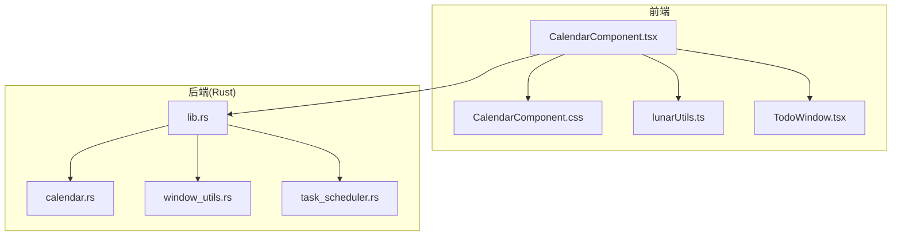
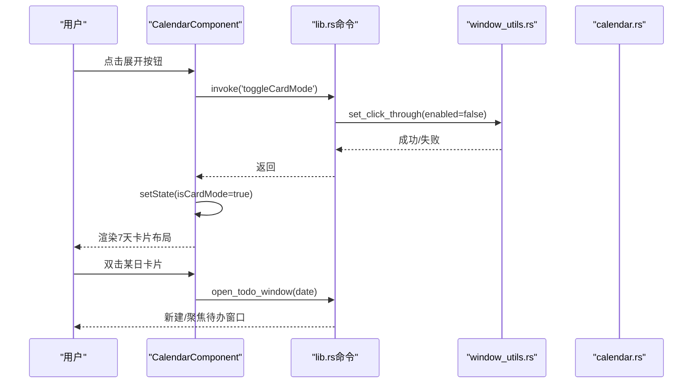
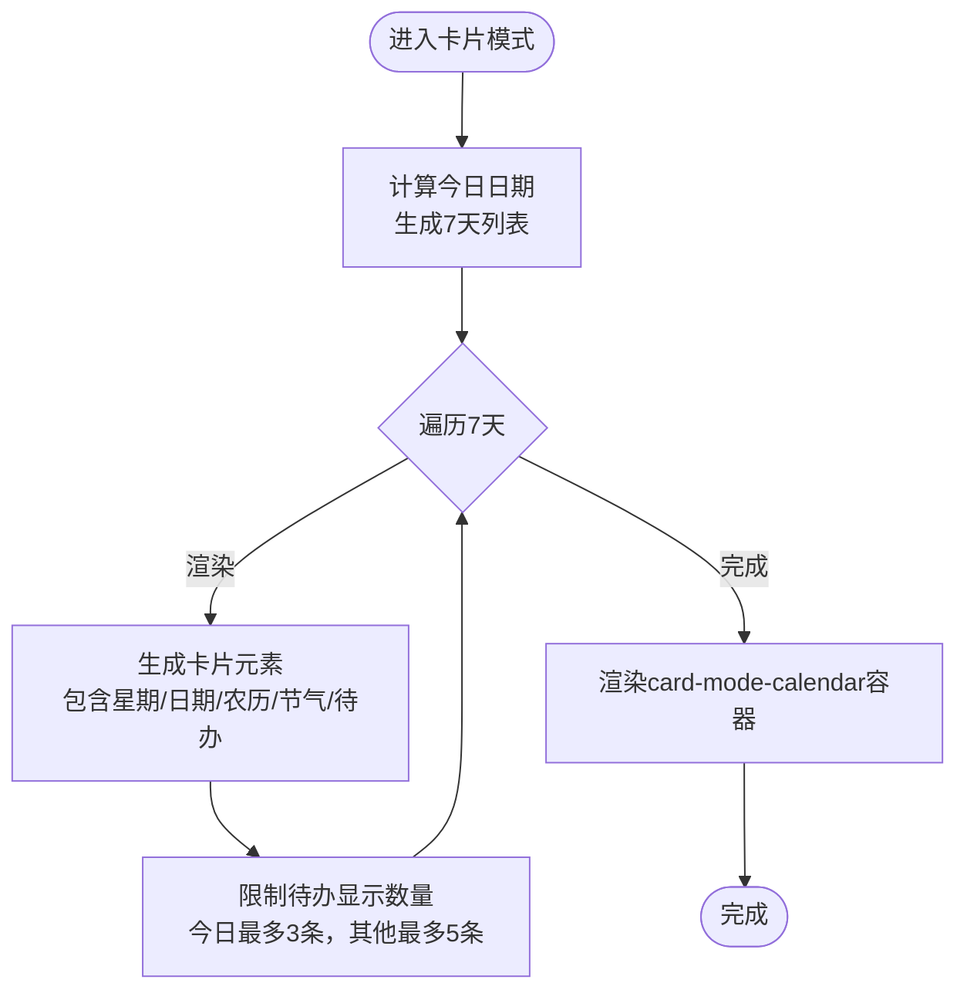
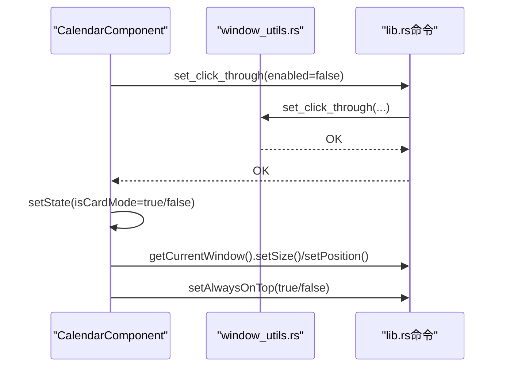
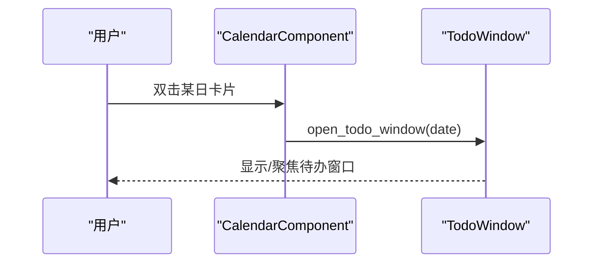
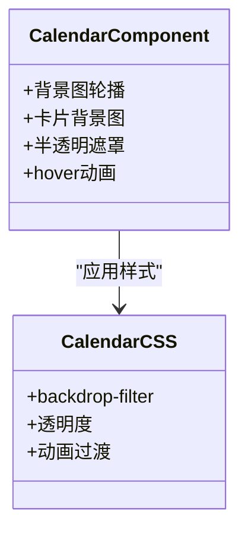
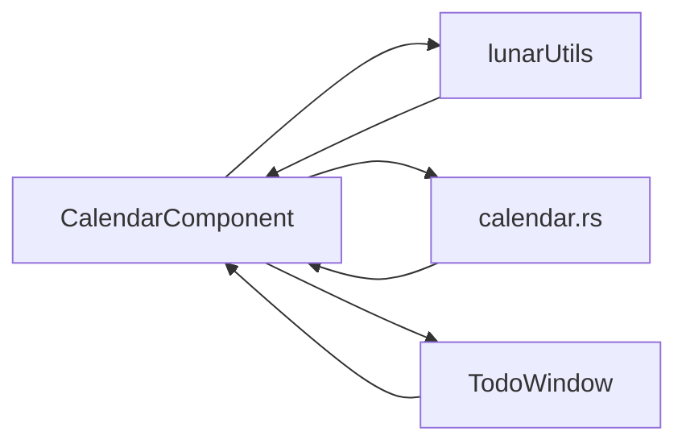
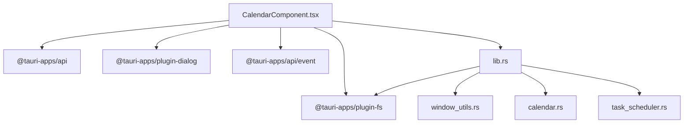

# 卡片模式

<cite>
**本文引用的文件**
- [CalendarComponent.tsx](file://src/components/CalendarComponent.tsx)
- [CalendarComponent.css](file://src/components/CalendarComponent.css)
- [lunarUtils.ts](file://src/utils/lunarUtils.ts)
- [calendar.rs](file://src-tauri/src/calendar.rs)
- [lib.rs](file://src-tauri/src/lib.rs)
- [window_utils.rs](file://src-tauri/src/window_utils.rs)
- [TodoWindow.tsx](file://src/components/TodoWindow.tsx)
- [task_scheduler.rs](file://src-tauri/src/task_scheduler.rs)
</cite>

## 目录
1. [简介](#简介)
2. [项目结构](#项目结构)
3. [核心组件](#核心组件)
4. [架构总览](#架构总览)
5. [详细组件分析](#详细组件分析)
6. [依赖关系分析](#依赖关系分析)
7. [性能考量](#性能考量)
8. [故障排查指南](#故障排查指南)
9. [结论](#结论)
10. [附录](#附录)

## 简介
本文件围绕“卡片模式”进行系统性技术文档梳理，重点覆盖以下方面：
- 设计理念：信息密度优化、空间利用效率、用户体验提升
- 卡片布局：7天时间轴设计、卡片尺寸计算、响应式布局适配
- 窗口管理：窗口尺寸调整、位置定位、始终置顶与点击穿透
- 交互设计：双击打开、滑动切换（概念性）、手势支持（概念性）
- 视觉效果：背景图片应用、透明度设置、动画过渡
- 性能优化：渲染优化、内存管理、CPU使用率控制
- 配置选项：卡片宽度设置、背景图片选择、显示偏好
- 功能集成：待办事项显示、农历信息标注、节气提示
- 使用场景与最佳实践

## 项目结构
卡片模式位于日历组件中，通过状态切换实现“普通模式”与“卡片模式”的互斥渲染，并通过Tauri命令与窗口工具实现窗口尺寸、位置与置顶行为的动态控制。

图表来源
- [CalendarComponent.tsx:1-561](file://src/components/CalendarComponent.tsx#L1-L561)
- [CalendarComponent.css:1-707](file://src/components/CalendarComponent.css#L1-L707)
- [lunarUtils.ts:1-151](file://src/utils/lunarUtils.ts#L1-L151)
- [TodoWindow.tsx:1-230](file://src/components/TodoWindow.tsx#L1-L230)
- [lib.rs:1-800](file://src-tauri/src/lib.rs#L1-L800)
- [calendar.rs:1-363](file://src-tauri/src/calendar.rs#L1-L363)
- [window_utils.rs:1-33](file://src-tauri/src/window_utils.rs#L1-L33)
- [task_scheduler.rs:1-93](file://src-tauri/src/task_scheduler.rs#L1-L93)

章节来源
- [CalendarComponent.tsx:1-561](file://src/components/CalendarComponent.tsx#L1-L561)
- [CalendarComponent.css:1-707](file://src/components/CalendarComponent.css#L1-L707)
- [lib.rs:1-800](file://src-tauri/src/lib.rs#L1-L800)

## 核心组件
- 日历组件（CalendarComponent）：负责日历渲染、7天卡片布局、背景图轮播、待办加载、窗口模式切换、双击打开待办窗口。
- 窗口工具（window_utils）：跨平台实现点击穿透与置顶控制。
- 日历后端（calendar.rs）：提供待办、事件、设置的持久化与查询接口。
- 待办窗口（TodoWindow）：按日期展示与编辑待办事项。
- 农历工具（lunarUtils）：提供农历与节气信息。

章节来源
- [CalendarComponent.tsx:1-561](file://src/components/CalendarComponent.tsx#L1-L561)
- [window_utils.rs:1-33](file://src-tauri/src/window_utils.rs#L1-L33)
- [calendar.rs:1-363](file://src-tauri/src/calendar.rs#L1-L363)
- [TodoWindow.tsx:1-230](file://src/components/TodoWindow.tsx#L1-L230)
- [lunarUtils.ts:1-151](file://src/utils/lunarUtils.ts#L1-L151)

## 架构总览
卡片模式通过前端状态驱动渲染，同时调用Tauri命令对窗口进行尺寸与位置调整，并通过事件机制刷新日历数据。

图表来源
- [CalendarComponent.tsx:243-311](file://src/components/CalendarComponent.tsx#L243-L311)
- [lib.rs:48-50](file://src-tauri/src/lib.rs#L48-L50)
- [window_utils.rs:9-32](file://src-tauri/src/window_utils.rs#L9-L32)
- [TodoWindow.tsx:641-676](file://src/components/TodoWindow.tsx#L641-L676)

## 详细组件分析

### 卡片模式布局与7天时间轴
- 7天时间轴：以当前日期为基准，向前推7天，逐日渲染卡片，每日包含星期、日期、农历、节气与待办摘要。
- 卡片尺寸计算：卡片宽度固定，高度按屏幕高度均分并留边距；今日卡片略高以突出。
- 响应式适配：卡片容器使用flex布局，垂直均分高度，保证在不同分辨率下7个卡片均匀分布。

图表来源
- [CalendarComponent.tsx:391-446](file://src/components/CalendarComponent.tsx#L391-L446)
- [CalendarComponent.css:521-698](file://src/components/CalendarComponent.css#L521-L698)

章节来源
- [CalendarComponent.tsx:391-446](file://src/components/CalendarComponent.tsx#L391-L446)
- [CalendarComponent.css:521-698](file://src/components/CalendarComponent.css#L521-L698)

### 窗口管理：尺寸、位置与置顶
- 尺寸调整：进入卡片模式时，窗口宽度设为固定值，高度为屏幕高度；退出时恢复为常规尺寸。
- 位置定位：进入卡片模式时，窗口定位到屏幕右侧边缘；退出时居中显示。
- 始终置顶：根据平台差异，通过Tauri命令与窗口工具实现置顶与点击穿透控制。
- 事件刷新：通过事件机制通知日历组件刷新数据。

图表来源
- [CalendarComponent.tsx:243-311](file://src/components/CalendarComponent.tsx#L243-L311)
- [lib.rs:48-50](file://src-tauri/src/lib.rs#L48-L50)
- [window_utils.rs:9-32](file://src-tauri/src/window_utils.rs#L9-L32)

章节来源
- [CalendarComponent.tsx:243-311](file://src/components/CalendarComponent.tsx#L243-L311)
- [window_utils.rs:9-32](file://src-tauri/src/window_utils.rs#L9-L32)
- [lib.rs:48-50](file://src-tauri/src/lib.rs#L48-L50)

### 交互设计：双击打开、滑动切换与手势支持
- 双击打开：在卡片模式下，双击任意日期卡片会打开对应日期的待办窗口。
- 滑动切换：当前实现未提供滑动切换逻辑，可作为扩展点引入触摸/鼠标滚轮手势。
- 手势支持：当前未实现手势识别，可在前端引入手势库或通过事件监听扩展。

图表来源
- [CalendarComponent.tsx:192-194](file://src/components/CalendarComponent.tsx#L192-L194)
- [TodoWindow.tsx:641-676](file://src/components/TodoWindow.tsx#L641-L676)

章节来源
- [CalendarComponent.tsx:192-194](file://src/components/CalendarComponent.tsx#L192-L194)
- [TodoWindow.tsx:641-676](file://src/components/TodoWindow.tsx#L641-L676)

### 视觉效果：背景图片、透明度与动画
- 背景图片：普通模式下使用轮播背景图；卡片模式下为每个卡片设置独立背景图，增强视觉层次。
- 透明度与模糊：使用backdrop-filter与半透明遮罩，营造通透感。
- 动画过渡：hover缩放、阴影变化、待办项渐变，提升交互反馈。

图表来源
- [CalendarComponent.tsx:452-466](file://src/components/CalendarComponent.tsx#L452-L466)
- [CalendarComponent.css:15-25](file://src/components/CalendarComponent.css#L15-L25)
- [CalendarComponent.css:540-545](file://src/components/CalendarComponent.css#L540-L545)

章节来源
- [CalendarComponent.tsx:452-466](file://src/components/CalendarComponent.tsx#L452-L466)
- [CalendarComponent.css:15-25](file://src/components/CalendarComponent.css#L15-L25)
- [CalendarComponent.css:540-545](file://src/components/CalendarComponent.css#L540-L545)

### 性能优化：渲染、内存与CPU
- 渲染优化：卡片模式下限制待办显示数量，避免长列表导致的重排；使用CSS裁剪与隐藏策略减少DOM节点。
- 内存管理：背景图轮播采用索引循环，避免频繁创建对象；待办数据按日期缓存，减少重复请求。
- CPU使用率：轮播定时器按分钟级周期运行；窗口尺寸与位置变更仅在切换模式时触发，避免高频操作。

章节来源
- [CalendarComponent.tsx:54-61](file://src/components/CalendarComponent.tsx#L54-L61)
- [CalendarComponent.tsx:83-122](file://src/components/CalendarComponent.tsx#L83-L122)
- [CalendarComponent.css:642-698](file://src/components/CalendarComponent.css#L642-L698)

### 配置选项：宽度、背景与显示偏好
- 卡片宽度：进入卡片模式时固定宽度，便于在右侧展示。
- 背景图片：支持上传、删除与轮播，轮播间隔可配置。
- 显示偏好：农历与节气显示开关（由后端设置结构定义）。

章节来源
- [CalendarComponent.tsx:256-259](file://src/components/CalendarComponent.tsx#L256-L259)
- [CalendarComponent.tsx:196-241](file://src/components/CalendarComponent.tsx#L196-L241)
- [calendar.rs:42-71](file://src-tauri/src/calendar.rs#L42-L71)

### 功能集成：待办、农历与节气
- 待办显示：按日期加载待办，卡片模式下限制显示数量并提供“更多”提示。
- 农历信息：通过lunarUtils提供农历日期格式化。
- 节气提示：通过lunarUtils提供节气名称，卡片模式下以小字号展示。

图表来源
- [CalendarComponent.tsx:83-122](file://src/components/CalendarComponent.tsx#L83-L122)
- [lunarUtils.ts:107-142](file://src/utils/lunarUtils.ts#L107-L142)
- [calendar.rs:280-322](file://src-tauri/src/calendar.rs#L280-L322)
- [TodoWindow.tsx:44-60](file://src/components/TodoWindow.tsx#L44-L60)

章节来源
- [CalendarComponent.tsx:83-122](file://src/components/CalendarComponent.tsx#L83-L122)
- [lunarUtils.ts:107-142](file://src/utils/lunarUtils.ts#L107-L142)
- [calendar.rs:280-322](file://src-tauri/src/calendar.rs#L280-L322)
- [TodoWindow.tsx:44-60](file://src/components/TodoWindow.tsx#L44-L60)

## 依赖关系分析
- 前端依赖：React状态管理、Tauri API、窗口API、事件监听。
- 后端依赖：Tauri命令注册、文件系统、定时任务调度。
- 平台差异：窗口工具在Windows与非Windows平台采用不同实现。

图表来源
- [CalendarComponent.tsx:1-11](file://src/components/CalendarComponent.tsx#L1-L11)
- [lib.rs:1-33](file://src-tauri/src/lib.rs#L1-L33)
- [window_utils.rs:1-33](file://src-tauri/src/window_utils.rs#L1-L33)
- [calendar.rs:1-10](file://src-tauri/src/calendar.rs#L1-L10)
- [task_scheduler.rs:1-9](file://src-tauri/src/task_scheduler.rs#L1-L9)

章节来源
- [CalendarComponent.tsx:1-11](file://src/components/CalendarComponent.tsx#L1-L11)
- [lib.rs:1-33](file://src-tauri/src/lib.rs#L1-L33)
- [window_utils.rs:1-33](file://src-tauri/src/window_utils.rs#L1-L33)
- [calendar.rs:1-10](file://src-tauri/src/calendar.rs#L1-L10)
- [task_scheduler.rs:1-9](file://src-tauri/src/task_scheduler.rs#L1-L9)

## 性能考量
- 渲染层面：卡片模式限制待办数量，避免长列表重排；使用CSS裁剪与隐藏策略减少DOM节点数量。
- 数据层面：按日期缓存待办数据，减少重复请求；轮播定时器按分钟级周期运行，降低CPU占用。
- 窗口层面：仅在切换模式时进行尺寸与位置变更，避免高频操作；点击穿透与置顶控制通过平台特定API实现，减少不必要的事件处理。

章节来源
- [CalendarComponent.tsx:63-61](file://src/components/CalendarComponent.tsx#L63-L61)
- [CalendarComponent.tsx:83-122](file://src/components/CalendarComponent.tsx#L83-L122)
- [CalendarComponent.css:642-698](file://src/components/CalendarComponent.css#L642-L698)

## 故障排查指南
- 窗口尺寸/位置异常：检查显示器信息获取失败回退逻辑，确认默认尺寸与位置是否合理。
- 点击穿透失效：确认平台差异实现，Windows平台需检查窗口样式标志位设置。
- 背景图轮播不生效：检查轮播间隔设置与图片路径，确认文件系统读写权限。
- 待办窗口无法打开：检查窗口标签唯一性与事件通信，确认命令注册与窗口构建流程。

章节来源
- [CalendarComponent.tsx:270-282](file://src/components/CalendarComponent.tsx#L270-L282)
- [window_utils.rs:9-32](file://src-tauri/src/window_utils.rs#L9-L32)
- [CalendarComponent.tsx:196-241](file://src/components/CalendarComponent.tsx#L196-L241)
- [TodoWindow.tsx:641-676](file://src/components/TodoWindow.tsx#L641-L676)

## 结论
卡片模式通过紧凑的7天时间轴与精简的待办展示，在有限空间内最大化信息密度与可用性。结合背景图轮播、透明与模糊效果以及平滑的动画过渡，提升了整体视觉体验。窗口管理通过Tauri命令与平台工具实现跨平台兼容，兼顾了性能与稳定性。未来可扩展滑动切换与手势支持，进一步完善交互体验。

## 附录
- 使用场景建议
  - 快速浏览本周待办与日程，适合多任务并行场景。
  - 右侧悬浮展示，不遮挡主界面，适合轻量办公。
- 最佳实践
  - 控制待办数量，避免卡片拥挤。
  - 合理设置背景图轮播间隔，平衡视觉与性能。
  - 在高分辨率屏幕下适当增大卡片宽度，提升可读性。
  - 定期清理过期待办，保持数据整洁。