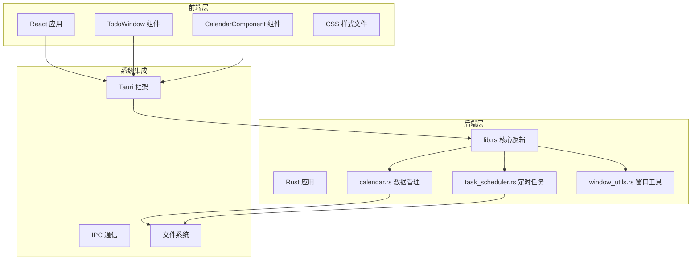
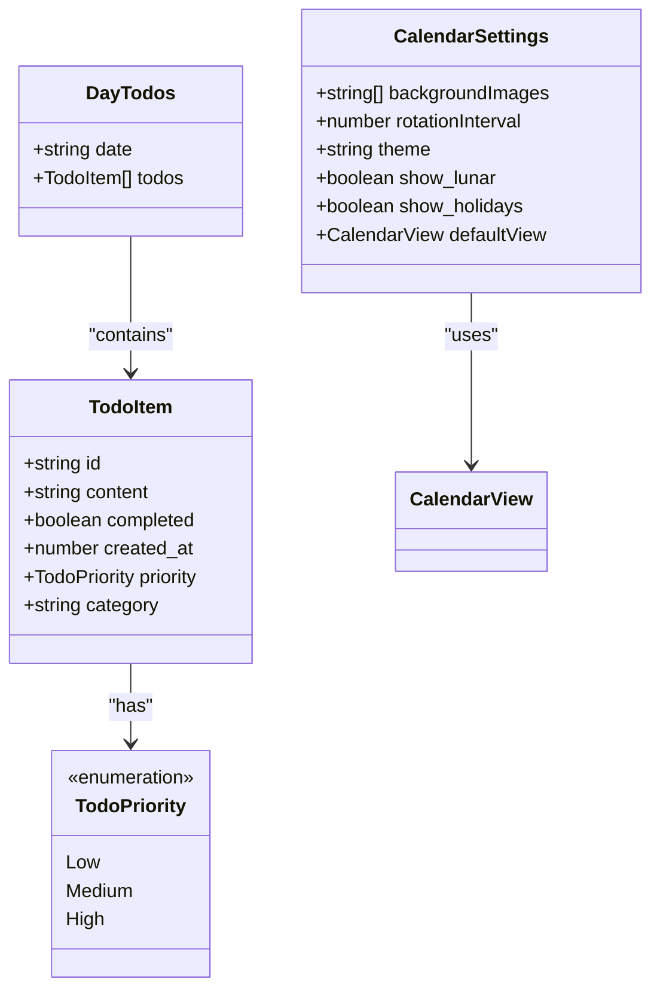
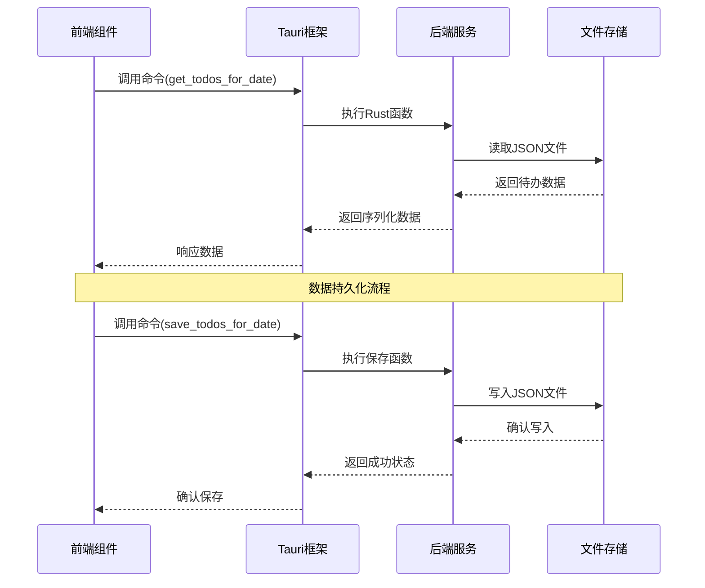
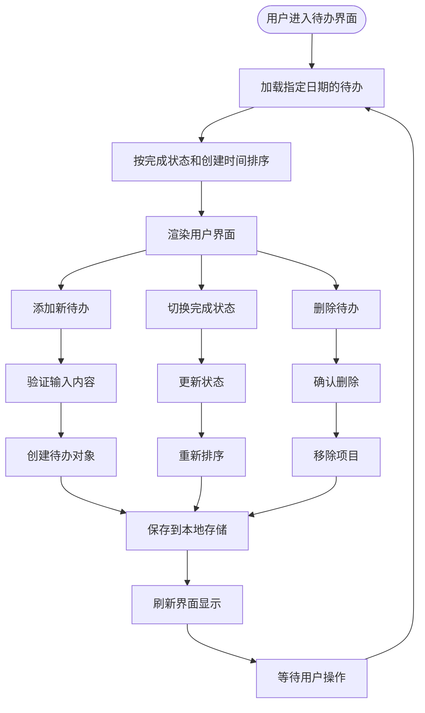
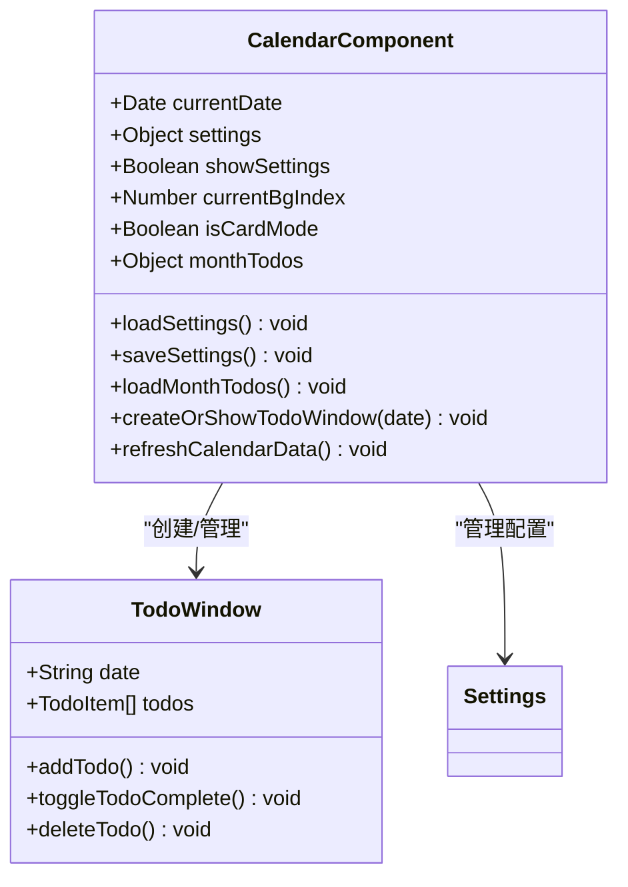
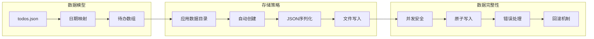
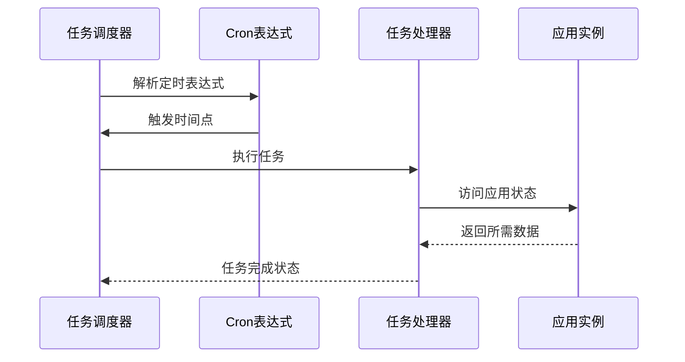

# 待办事项管理

<cite>
**本文档引用的文件**
- [TodoWindow.tsx](file://src/components/TodoWindow.tsx)
- [TodoWindow.css](file://src/components/TodoWindow.css)
- [CalendarComponent.tsx](file://src/components/CalendarComponent.tsx)
- [lib.rs](file://src-tauri/src/lib.rs)
- [calendar.rs](file://src-tauri/src/calendar.rs)
- [task_scheduler.rs](file://src-tauri/src/task_scheduler.rs)
- [main.rs](file://src-tauri/src/main.rs)
- [Cargo.toml](file://src-tauri/Cargo.toml)
- [App.tsx](file://src/App.tsx)
- [window_utils.rs](file://src-tauri/src/window_utils.rs)
</cite>

## 目录
1. [简介](#简介)
2. [项目结构](#项目结构)
3. [核心组件](#核心组件)
4. [架构概览](#架构概览)
5. [详细组件分析](#详细组件分析)
6. [依赖关系分析](#依赖关系分析)
7. [性能考虑](#性能考虑)
8. [故障排除指南](#故障排除指南)
9. [结论](#结论)

## 简介

待办事项管理系统是一个基于Tauri框架构建的桌面应用程序，提供了完整的待办事项管理功能。该系统采用前端React + 后端Rust的双层架构设计，实现了跨平台的桌面应用体验。

系统的核心功能包括：
- 实时待办事项创建、编辑、完成和删除
- 基于日期的待办事项组织和管理
- 本地数据持久化存储
- 窗口间通信和事件驱动架构
- 响应式用户界面设计

## 项目结构

该项目采用模块化的文件组织方式，主要分为前端和后端两个部分：



**图表来源**
- [main.rs:1-11](file://src-tauri/src/main.rs#L1-L11)
- [lib.rs:1-1113](file://src-tauri/src/lib.rs#L1-L1113)

**章节来源**
- [main.rs:1-11](file://src-tauri/src/main.rs#L1-L11)
- [Cargo.toml:1-44](file://src-tauri/Cargo.toml#L1-L44)

## 核心组件

### 数据结构设计

系统采用统一的数据模型来表示待办事项：



**图表来源**
- [calendar.rs:5-51](file://src-tauri/src/calendar.rs#L5-L51)

### 核心数据字段说明

| 字段名 | 类型 | 描述 | 示例值 |
|--------|------|------|--------|
| id | string | 唯一标识符 | "1640995200000" |
| content | string | 任务内容 | "完成项目报告" |
| completed | boolean | 完成状态 | false |
| created_at | number | 创建时间戳 | 1640995200000 |
| priority | TodoPriority | 优先级 | High/Medium/Low |
| category | string | 分类标签 | "工作/个人/学习" |

**章节来源**
- [calendar.rs:548-560](file://src-tauri/src/calendar.rs#L548-L560)

## 架构概览

系统采用事件驱动的架构模式，通过IPC（进程间通信）实现前后端分离：



**图表来源**
- [lib.rs:571-631](file://src-tauri/src/lib.rs#L571-L631)

## 详细组件分析

### TodoWindow 组件

TodoWindow 是待办事项的主要交互界面，提供了完整的CRUD操作能力：



**图表来源**
- [TodoWindow.tsx:72-109](file://src/components/TodoWindow.tsx#L72-L109)

#### 核心功能实现

1. **待办事项创建**
   - 输入验证和空值检查
   - 自动生成唯一ID和创建时间戳
   - 立即更新本地状态并异步保存

2. **状态管理**
   - 完成状态切换时自动重排序
   - 未完成项优先显示在上方
   - 实时统计待办和完成数量

3. **数据持久化**
   - JSON格式存储到应用数据目录
   - 支持并发访问的安全写入
   - 自动创建缺失的目录结构

**章节来源**
- [TodoWindow.tsx:15-132](file://src/components/TodoWindow.tsx#L15-L132)

### CalendarComponent 组件

日历组件作为待办事项的入口点，提供了日期选择和窗口管理功能：



**图表来源**
- [CalendarComponent.tsx:25-194](file://src/components/CalendarComponent.tsx#L25-L194)

#### 窗口管理机制

系统实现了智能的窗口复用机制：

1. **窗口查找**：根据日期生成唯一窗口标签
2. **存在性检查**：避免重复创建相同日期的待办窗口
3. **焦点管理**：已存在窗口时直接显示并聚焦
4. **超时处理**：创建失败时的容错机制

**章节来源**
- [CalendarComponent.tsx:124-186](file://src/components/CalendarComponent.tsx#L124-L186)

### 数据存储机制

系统采用文件系统进行数据持久化，实现了以下特性：



**图表来源**
- [lib.rs:594-631](file://src-tauri/src/lib.rs#L594-L631)

#### 存储格式设计

待办事项数据采用键值对映射结构：
- **键**：日期字符串（YYYY-MM-DD格式）
- **值**：该日期对应的待办事项数组
- **文件位置**：应用数据目录下的todos.json

**章节来源**
- [lib.rs:571-631](file://src-tauri/src/lib.rs#L571-L631)

### 定时任务系统

系统集成了基于cron表达式的定时任务调度机制：



**图表来源**
- [task_scheduler.rs:21-61](file://src-tauri/src/task_scheduler.rs#L21-L61)

#### 当前定时任务实现

目前系统实现了工作日志AI处理的定时任务：
- **触发频率**：每分钟检查一次
- **执行条件**：周一至周五 17:00-17:05期间
- **任务内容**：自动处理工作日志并生成AI分析

**章节来源**
- [task_scheduler.rs:1-93](file://src-tauri/src/task_scheduler.rs#L1-L93)

## 依赖关系分析

系统的关键依赖关系如下：

```mermaid
graph TB
subgraph "前端依赖"
React[React 19.1.0]
TauriAPI[@tauri-apps/api ~2.8.0]
DialogPlugin[@tauri-apps/plugin-dialog ~2.4.0]
FSPlugin[@tauri-apps/plugin-fs ~2.4.0]
end
subgraph "后端依赖"
TauriCore[tauri = "2"]
Serde[serde = "1"]
Tokio[tokio = "1"]
Reqwest[reqwest = "0.12"]
Chrono[chrono = "0.4"]
Cron[cron = "0.12"]
Scheduler[tokio-cron-scheduler = "0.10"]
end
subgraph "开发工具"
Vite[Vite 7.0.4]
TypeScript[TypeScript 5.8.3]
CLI[@tauri-apps/cli ^2]
end
React --> TauriAPI
TauriAPI --> TauriCore
TauriCore --> Serde
Serde --> Tokio
Reqwest --> TauriCore
```

**图表来源**
- [Cargo.toml:15-44](file://src-tauri/Cargo.toml#L15-L44)
- [package.json:12-28](file://package.json#L12-L28)

**章节来源**
- [Cargo.toml:1-44](file://src-tauri/Cargo.toml#L1-44)
- [package.json:1-29](file://package.json#L1-L29)

## 性能考虑

### 内存优化策略

1. **虚拟滚动**：对于大量待办事项，可考虑实现虚拟滚动以减少DOM节点数量
2. **懒加载**：按需加载月份数据，避免一次性渲染整个日历
3. **状态缓存**：缓存已加载的日期数据，避免重复网络请求

### 网络性能

1. **批处理操作**：合并多个小的文件写入操作
2. **增量更新**：只更新变化的数据部分
3. **压缩传输**：对大文件进行压缩后再存储

### 用户体验优化

1. **防抖处理**：对频繁的输入操作进行防抖
2. **进度反馈**：长时间操作显示加载状态
3. **离线支持**：本地数据缓存确保离线可用性

## 故障排除指南

### 常见问题及解决方案

#### 数据加载失败
**症状**：待办事项无法显示或显示空白
**可能原因**：
- 应用数据目录权限不足
- todos.json文件损坏
- 文件路径配置错误

**解决步骤**：
1. 检查应用数据目录是否存在
2. 验证JSON文件格式正确性
3. 重启应用尝试自动修复

#### 窗口创建失败
**症状**：双击日期无法打开待办窗口
**可能原因**：
- 窗口标签冲突
- IPC通信异常
- 超时设置过短

**解决步骤**：
1. 检查现有窗口状态
2. 重新启动应用
3. 增加超时时间设置

#### 数据同步问题
**症状**：多窗口间数据不一致
**可能原因**：
- 事件监听器未正确注册
- IPC消息丢失
- 并发写入冲突

**解决步骤**：
1. 重新注册事件监听器
2. 检查IPC通道状态
3. 实现数据一致性检查

**章节来源**
- [TodoWindow.tsx:44-60](file://src/components/TodoWindow.tsx#L44-L60)
- [CalendarComponent.tsx:188-194](file://src/components/CalendarComponent.tsx#L188-L194)

## 结论

待办事项管理系统展现了现代桌面应用开发的最佳实践，通过合理的架构设计和模块化实现，提供了稳定可靠的功能体验。

### 主要优势

1. **架构清晰**：前后端分离，职责明确
2. **数据持久化**：可靠的本地存储机制
3. **用户体验**：响应式界面和流畅的交互
4. **扩展性强**：模块化设计便于功能扩展

### 改进建议

1. **批量操作**：实现全选、批量完成和批量删除功能
2. **搜索过滤**：添加关键词搜索和高级筛选功能
3. **导入导出**：支持CSV格式的数据迁移
4. **提醒机制**：实现基于时间的提醒和通知
5. **分类标签**：增强优先级和重要性标记系统

该系统为开发者提供了一个坚实的基础，可以在此基础上进一步完善功能，满足更复杂的待办事项管理需求。