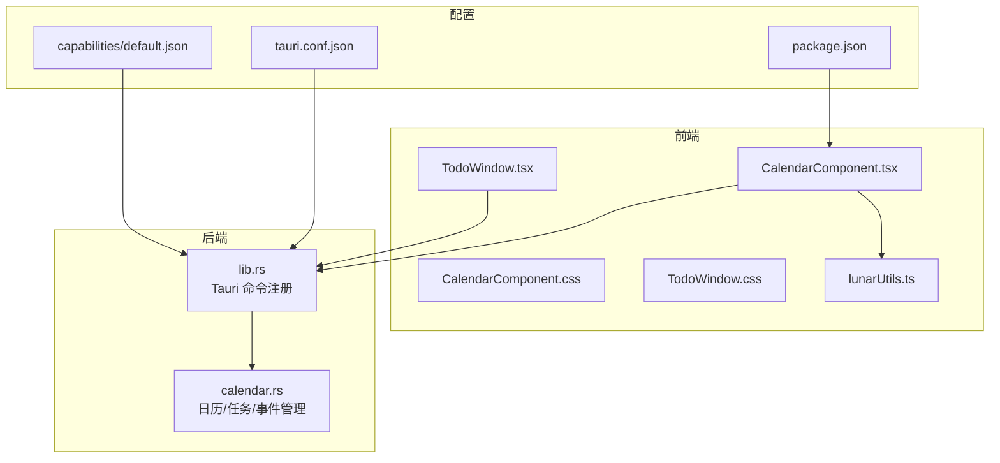
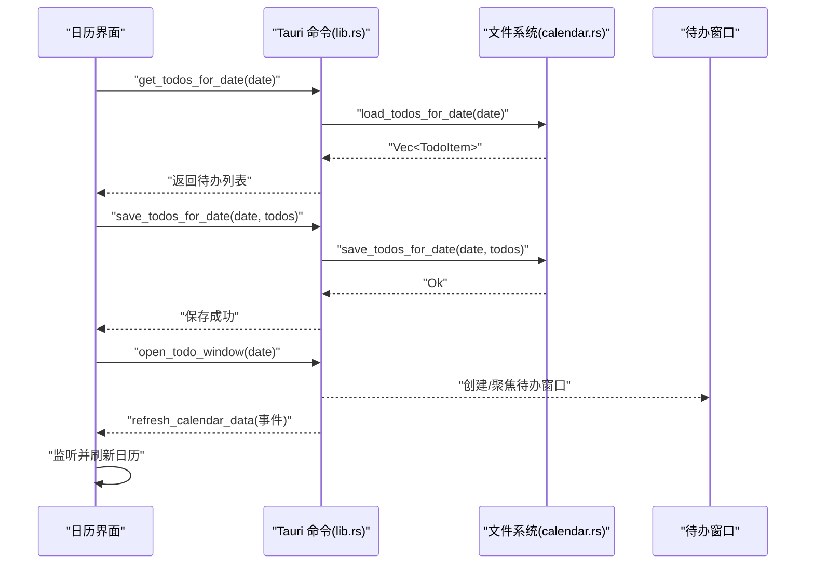
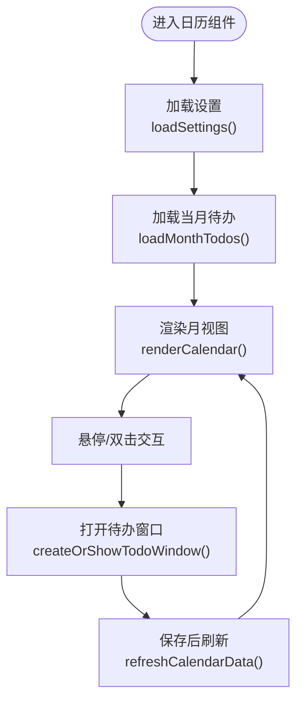
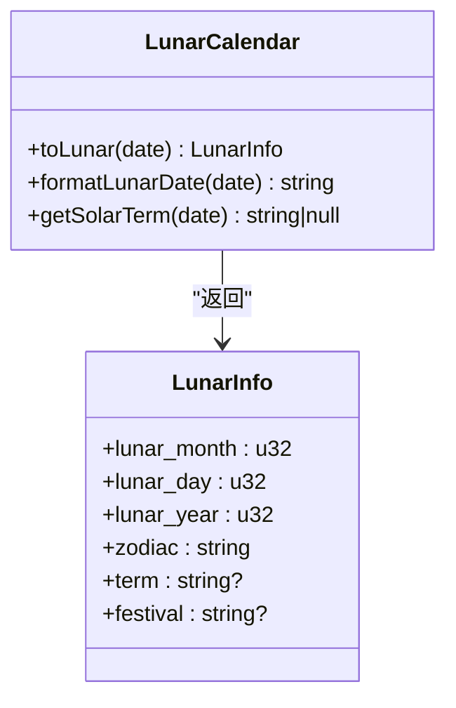
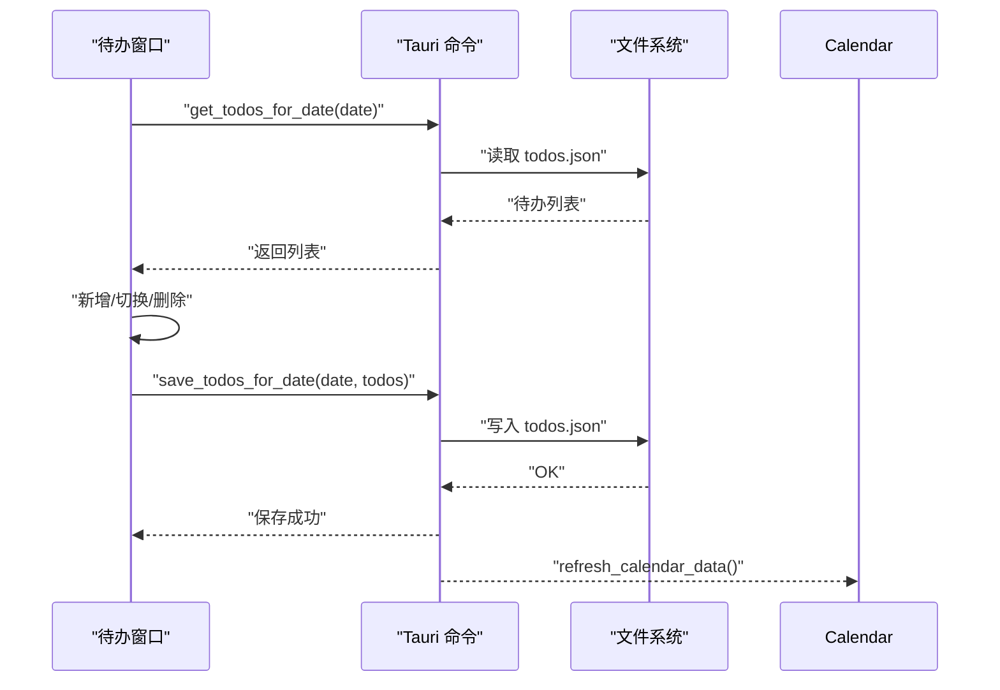
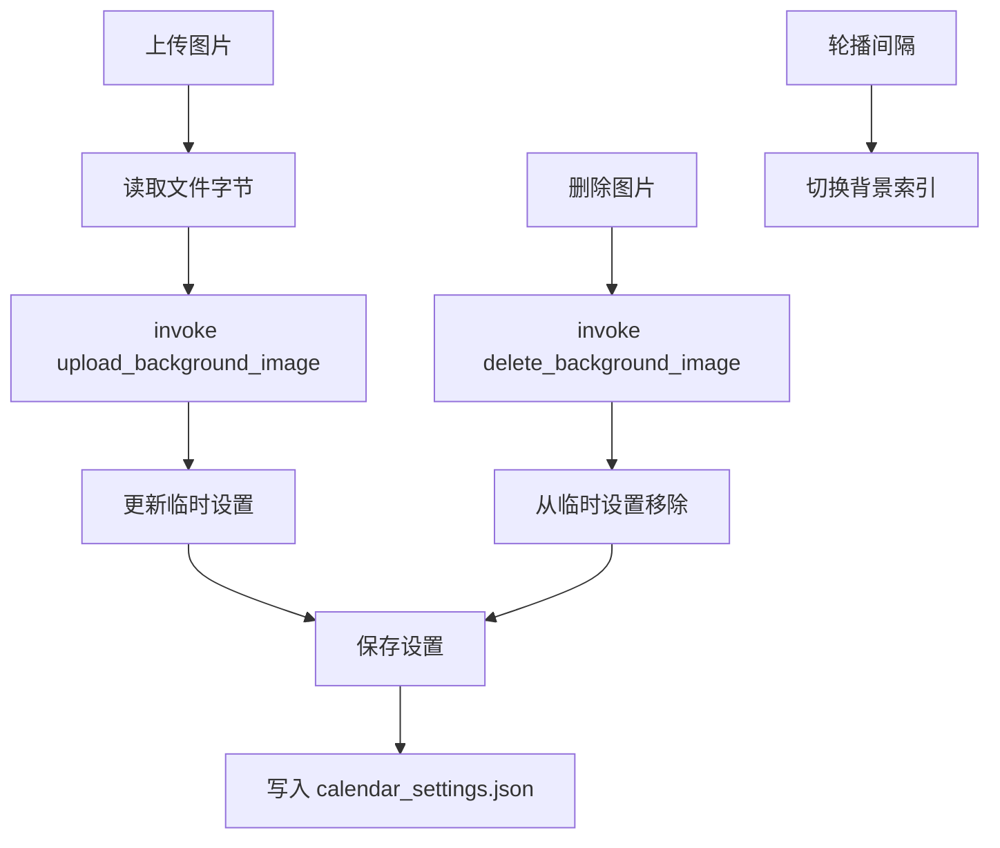

# 日历管理系统

<cite>
**本文档引用的文件**
- [CalendarComponent.tsx](file://src/components/CalendarComponent.tsx)
- [TodoWindow.tsx](file://src/components/TodoWindow.tsx)
- [lunarUtils.ts](file://src/utils/lunarUtils.ts)
- [CalendarComponent.css](file://src/components/CalendarComponent.css)
- [TodoWindow.css](file://src/components/TodoWindow.css)
- [calendar.rs](file://src-tauri/src/calendar.rs)
- [lib.rs](file://src-tauri/src/lib.rs)
- [tauri.conf.json](file://src-tauri/tauri.conf.json)
- [default.json](file://src-tauri/capabilities/default.json)
- [package.json](file://package.json)
</cite>

## 目录
1. [简介](#简介)
2. [项目结构](#项目结构)
3. [核心组件](#核心组件)
4. [架构总览](#架构总览)
5. [详细组件分析](#详细组件分析)
6. [依赖关系分析](#依赖关系分析)
7. [性能考虑](#性能考虑)
8. [故障排除指南](#故障排除指南)
9. [结论](#结论)
10. [附录](#附录)

## 简介
本项目是一个桌面端日历管理系统，结合了 React 前端与 Tauri 后端，提供以下能力：
- 月视图日历渲染、农历信息展示、节气标注
- 待办事项管理（创建、完成切换、删除）
- 背景图片轮播（上传、删除、定时切换）
- 数据持久化（本地 JSON 文件存储）
- 响应式与触摸友好交互
- 通过独立窗口实现卡片模式与待办编辑
- 事件与任务的数据模型扩展支持

## 项目结构
项目采用前端与后端分离的架构：
- 前端使用 React + TypeScript，组件位于 src/components，样式位于对应 .css 文件
- 后端使用 Rust + Tauri，命令接口在 src-tauri/src 下，通过 invoke 从前端调用
- 配置文件位于 src-tauri/tauri.conf.json 与 capabilities

**图表来源**
- [CalendarComponent.tsx:1-561](file://src/components/CalendarComponent.tsx#L1-L561)
- [TodoWindow.tsx:1-230](file://src/components/TodoWindow.tsx#L1-L230)
- [lunarUtils.ts:1-151](file://src/utils/lunarUtils.ts#L1-L151)
- [lib.rs:462-660](file://src-tauri/src/lib.rs#L462-L660)
- [calendar.rs:1-363](file://src-tauri/src/calendar.rs#L1-L363)
- [tauri.conf.json:1-74](file://src-tauri/tauri.conf.json#L1-L74)
- [default.json:1-12](file://src-tauri/capabilities/default.json#L1-L12)
- [package.json:1-29](file://package.json#L1-L29)

**章节来源**
- [CalendarComponent.tsx:1-561](file://src/components/CalendarComponent.tsx#L1-L561)
- [TodoWindow.tsx:1-230](file://src/components/TodoWindow.tsx#L1-L230)
- [lunarUtils.ts:1-151](file://src/utils/lunarUtils.ts#L1-L151)
- [lib.rs:462-660](file://src-tauri/src/lib.rs#L462-L660)
- [calendar.rs:1-363](file://src-tauri/src/calendar.rs#L1-L363)
- [tauri.conf.json:1-74](file://src-tauri/tauri.conf.json#L1-L74)
- [default.json:1-12](file://src-tauri/capabilities/default.json#L1-L12)
- [package.json:1-29](file://package.json#L1-L29)

## 核心组件
- 日历组件：负责月视图渲染、农历与节气显示、背景轮播、卡片模式、待办窗口打开
- 待办窗口：负责某一天的待办列表展示、增删改与排序
- 农历工具：提供农历日期转换、节气查询
- Tauri 命令层：封装本地文件读写、设置管理、事件广播

**章节来源**
- [CalendarComponent.tsx:25-122](file://src/components/CalendarComponent.tsx#L25-L122)
- [TodoWindow.tsx:15-114](file://src/components/TodoWindow.tsx#L15-L114)
- [lunarUtils.ts:3-151](file://src/utils/lunarUtils.ts#L3-L151)
- [lib.rs:462-660](file://src-tauri/src/lib.rs#L462-L660)
- [calendar.rs:87-245](file://src-tauri/src/calendar.rs#L87-L245)

## 架构总览
前端通过 @tauri-apps/api 的 invoke 调用后端命令，后端以 JSON 文件形式持久化数据，并通过事件向前端推送刷新。

**图表来源**
- [lib.rs:462-560](file://src-tauri/src/lib.rs#L462-L560)
- [calendar.rs:98-141](file://src-tauri/src/calendar.rs#L98-L141)
- [CalendarComponent.tsx:40-47](file://src/components/CalendarComponent.tsx#L40-L47)
- [CalendarComponent.tsx:124-186](file://src/components/CalendarComponent.tsx#L124-L186)
- [TodoWindow.tsx:15-42](file://src/components/TodoWindow.tsx#L15-L42)

**章节来源**
- [lib.rs:462-560](file://src-tauri/src/lib.rs#L462-L560)
- [calendar.rs:98-141](file://src-tauri/src/calendar.rs#L98-L141)
- [CalendarComponent.tsx:40-186](file://src/components/CalendarComponent.tsx#L40-L186)
- [TodoWindow.tsx:15-114](file://src/components/TodoWindow.tsx#L15-L114)

## 详细组件分析

### 日历视图与交互
- 月视图渲染：计算当月第一天星期、上月末尾日期、下月起始日期，生成 42 格网格
- 农历与节气：使用 LunarCalendar 工具类格式化农历日期与节气
- 背景轮播：根据设置中的图片数组与轮播间隔定时切换
- 日期双击：打开对应日期的待办窗口
- 卡片模式：将日历固定在右侧，按周显示，每格背景循环使用内置图片

**图表来源**
- [CalendarComponent.tsx:49-122](file://src/components/CalendarComponent.tsx#L49-L122)
- [CalendarComponent.tsx:188-194](file://src/components/CalendarComponent.tsx#L188-L194)
- [CalendarComponent.tsx:319-389](file://src/components/CalendarComponent.tsx#L319-L389)
- [CalendarComponent.tsx:391-446](file://src/components/CalendarComponent.tsx#L391-L446)

**章节来源**
- [CalendarComponent.tsx:25-122](file://src/components/CalendarComponent.tsx#L25-L122)
- [CalendarComponent.tsx:188-194](file://src/components/CalendarComponent.tsx#L188-L194)
- [CalendarComponent.tsx:319-446](file://src/components/CalendarComponent.tsx#L319-L446)

### 农历与节气
- 农历转换：基于固定表与偏移量计算农历年、月、日，支持润月识别
- 节气标注：提供节气名称映射（当前为示例数据），可扩展为精确天文算法
- 节日标注：传统节日简单映射（可扩展）

**图表来源**
- [lunarUtils.ts:3-151](file://src/utils/lunarUtils.ts#L3-L151)
- [calendar.rs:279-322](file://src-tauri/src/calendar.rs#L279-L322)

**章节来源**
- [lunarUtils.ts:3-151](file://src/utils/lunarUtils.ts#L3-L151)
- [calendar.rs:279-322](file://src-tauri/src/calendar.rs#L279-L322)

### 待办事项管理
- 数据模型：包含 id、内容、完成状态、创建时间
- 功能流程：加载 → 排序 → 新增 → 切换完成 → 删除 → 保存
- 事件联动：保存后通过事件通知日历刷新

**图表来源**
- [TodoWindow.tsx:44-109](file://src/components/TodoWindow.tsx#L44-L109)
- [lib.rs:485-522](file://src-tauri/src/lib.rs#L485-L522)
- [calendar.rs:115-141](file://src-tauri/src/calendar.rs#L115-L141)

**章节来源**
- [TodoWindow.tsx:15-114](file://src/components/TodoWindow.tsx#L15-L114)
- [lib.rs:485-522](file://src-tauri/src/lib.rs#L485-L522)
- [calendar.rs:115-141](file://src-tauri/src/calendar.rs#L115-L141)

### 背景图片轮播与设置
- 图片上传：选择文件 → 读取字节 → 调用命令上传 → 更新临时设置
- 图片删除：调用命令删除 → 从临时设置移除
- 轮播控制：根据设置中的图片数组与间隔定时切换
- 设置持久化：保存设置到本地 JSON 文件

**图表来源**
- [CalendarComponent.tsx:196-241](file://src/components/CalendarComponent.tsx#L196-L241)
- [CalendarComponent.tsx:54-61](file://src/components/CalendarComponent.tsx#L54-L61)
- [lib.rs:612-652](file://src-tauri/src/lib.rs#L612-L652)
- [calendar.rs:220-245](file://src-tauri/src/calendar.rs#L220-L245)

**章节来源**
- [CalendarComponent.tsx:196-241](file://src/components/CalendarComponent.tsx#L196-L241)
- [CalendarComponent.tsx:54-61](file://src/components/CalendarComponent.tsx#L54-L61)
- [lib.rs:612-652](file://src-tauri/src/lib.rs#L612-L652)
- [calendar.rs:220-245](file://src-tauri/src/calendar.rs#L220-L245)

### 用户界面与交互
- 响应式设计：针对移动端宽度进行媒体查询优化
- 触摸友好：按钮尺寸、点击区域、动画反馈
- 卡片模式：固定在右侧，每格背景循环使用内置图片，今日高亮
- 透明窗口与置顶：通过 Tauri 窗口属性实现悬浮效果

**章节来源**
- [CalendarComponent.css:1-707](file://src/components/CalendarComponent.css#L1-L707)
- [TodoWindow.css:1-375](file://src/components/TodoWindow.css#L1-L375)
- [tauri.conf.json:13-43](file://src-tauri/tauri.conf.json#L13-L43)

## 依赖关系分析
- 前端依赖：React、@tauri-apps/api、@tauri-apps/plugin-dialog、@tauri-apps/plugin-fs
- 后端依赖：Tauri、serde、tokio、chrono
- 能力配置：允许创建 webview 窗口、默认权限集合

**图表来源**
- [package.json:12-27](file://package.json#L12-L27)
- [lib.rs:462-660](file://src-tauri/src/lib.rs#L462-L660)
- [calendar.rs:1-363](file://src-tauri/src/calendar.rs#L1-L363)

**章节来源**
- [package.json:12-27](file://package.json#L12-L27)
- [default.json:1-12](file://src-tauri/capabilities/default.json#L1-L12)
- [lib.rs:462-660](file://src-tauri/src/lib.rs#L462-L660)
- [calendar.rs:1-363](file://src-tauri/src/calendar.rs#L1-L363)

## 性能考虑
- 数据加载：一次性加载一周与当月待办，避免频繁 IO
- 轮播优化：仅在图片数量大于 1 时启用定时器，及时清理
- 排序策略：按完成状态与创建时间排序，减少渲染抖动
- 样式优化：使用 backdrop-filter 与渐变，注意 GPU 开销；卡片模式下限制每格 todo 数量
- 事件驱动：通过事件刷新而非轮询，降低 CPU 占用

[本节为通用指导，无需特定文件引用]

## 故障排除指南
- 无法加载设置/待办：检查应用数据目录是否存在，确认文件读写权限
- 上传图片失败：确认文件类型与大小限制，检查磁盘空间
- 窗口无法聚焦：检查 Tauri 窗口属性与系统权限
- 节气/节日不准确：当前节气为示例映射，建议扩展为精确算法

**章节来源**
- [calendar.rs:188-218](file://src-tauri/src/calendar.rs#L188-L218)
- [calendar.rs:98-141](file://src-tauri/src/calendar.rs#L98-L141)
- [CalendarComponent.tsx:196-241](file://src/components/CalendarComponent.tsx#L196-L241)

## 结论
本系统通过前后端清晰分工，实现了完整的日历与待办管理功能。前端负责交互与展示，后端负责数据持久化与系统集成。建议后续增强：
- 节气与节日数据源的精确化
- 导入导出功能（如 JSON/CSV）
- 任务优先级与颜色编码的可视化
- 数据清理与备份策略

[本节为总结，无需特定文件引用]

## 附录

### 数据模型与持久化
- 待办项：id、内容、完成状态、创建时间
- 日历设置：背景图片数组、轮播间隔、主题、显示选项
- 事件：标题、描述、时间范围、全天、颜色
- 存储位置：应用数据目录下的 todos.json、events.json、calendar_settings.json

**章节来源**
- [calendar.rs:5-51](file://src-tauri/src/calendar.rs#L5-L51)
- [calendar.rs:98-141](file://src-tauri/src/calendar.rs#L98-L141)
- [calendar.rs:143-186](file://src-tauri/src/calendar.rs#L143-L186)
- [calendar.rs:188-218](file://src-tauri/src/calendar.rs#L188-L218)

### API 命令一览
- get_todos_for_date：按日期获取待办
- save_todos_for_date：保存某日待办
- open_todo_window：打开/聚焦待办窗口
- load_calendar_settings/save_calendar_settings：加载/保存设置
- upload_background_image/delete_background_image：上传/删除背景
- refresh_calendar_data：刷新日历

**章节来源**
- [lib.rs:462-660](file://src-tauri/src/lib.rs#L462-L660)
- [calendar.rs:220-245](file://src-tauri/src/calendar.rs#L220-L245)