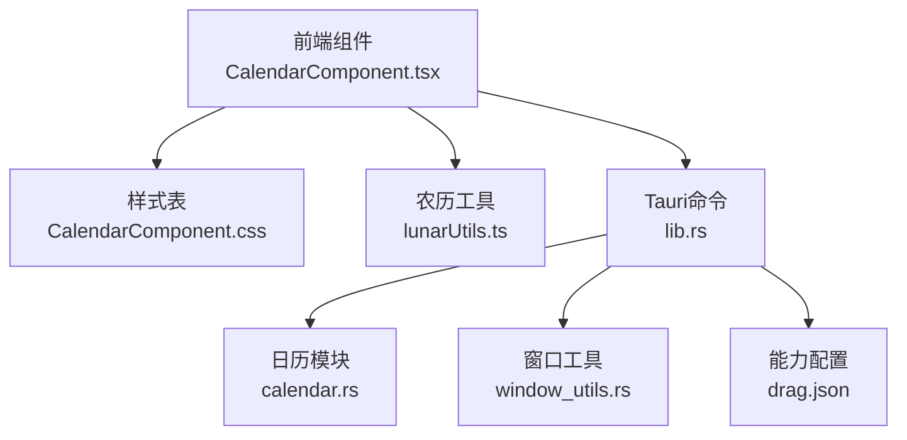
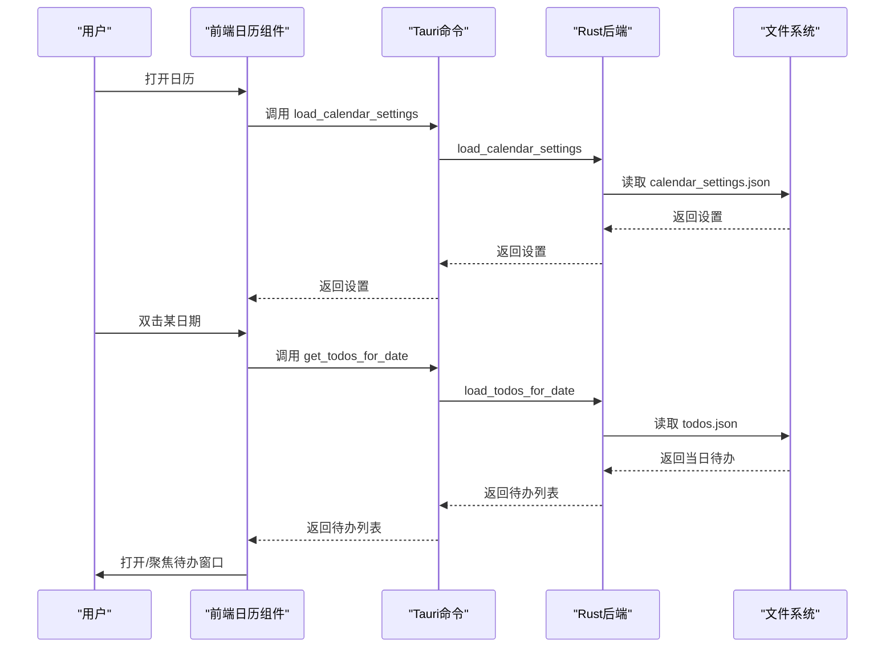
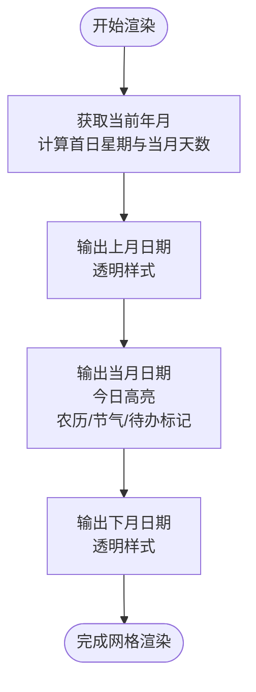
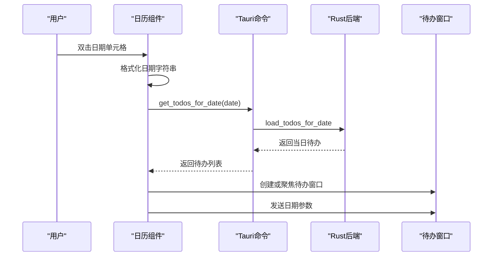
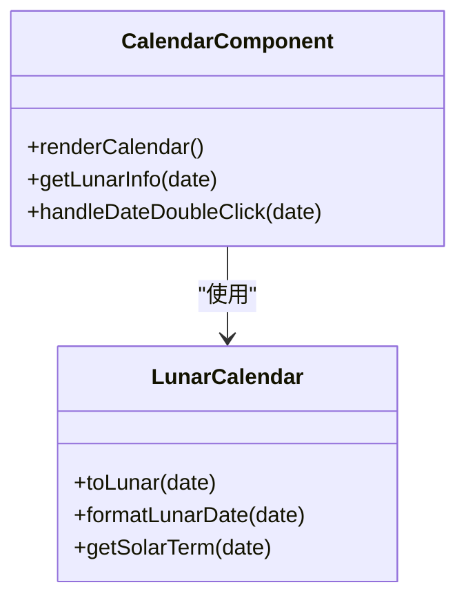
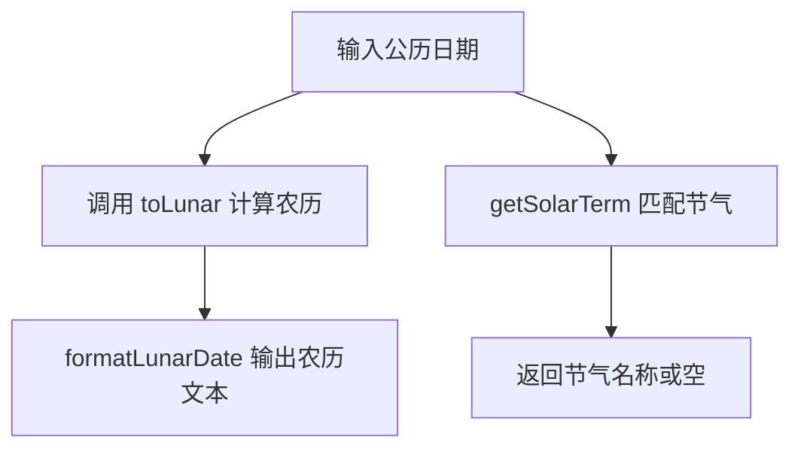
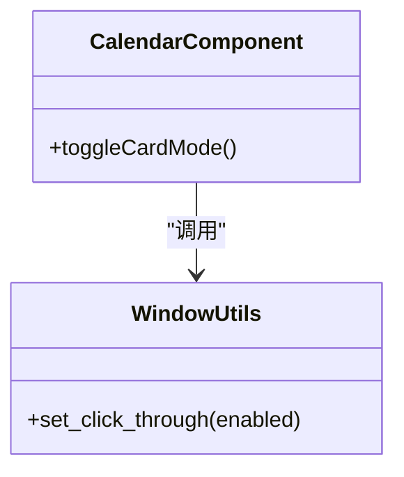
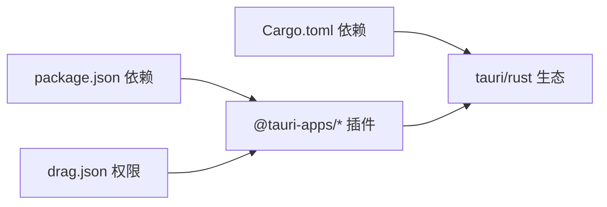

# 日历视图组件

<cite>
**本文档引用的文件**
- [CalendarComponent.tsx](file://src/components/CalendarComponent.tsx)
- [CalendarComponent.css](file://src/components/CalendarComponent.css)
- [lunarUtils.ts](file://src/utils/lunarUtils.ts)
- [calendar.rs](file://src-tauri/src/calendar.rs)
- [lib.rs](file://src-tauri/src/lib.rs)
- [window_utils.rs](file://src-tauri/src/window_utils.rs)
- [drag.json](file://src-tauri/capabilities/drag.json)
- [Cargo.toml](file://src-tauri/Cargo.toml)
- [package.json](file://package.json)
</cite>

## 目录
1. [简介](#简介)
2. [项目结构](#项目结构)
3. [核心组件](#核心组件)
4. [架构总览](#架构总览)
5. [详细组件分析](#详细组件分析)
6. [依赖关系分析](#依赖关系分析)
7. [性能考虑](#性能考虑)
8. [故障排除指南](#故障排除指南)
9. [结论](#结论)
10. [附录](#附录)

## 简介
本文件为桌面宠物应用中的日历视图组件提供全面的技术文档。内容涵盖日历网格渲染机制、日期选择与双击交互、农历信息集成、节气与节日标注、导航与键盘快捷键支持、响应式设计与移动端优化、样式自定义选项、性能优化策略以及最佳实践与用户体验建议。文档以代码为依据，结合可视化图表帮助开发者与非技术读者理解组件的设计与实现。

## 项目结构
日历组件位于前端 React 组件与 Tauri 后端之间，通过命令调用进行数据交互，并使用 CSS 样式实现美观的视觉呈现。关键文件与职责如下：
- 前端组件：CalendarComponent.tsx 负责界面渲染、用户交互、窗口控制与设置管理
- 样式表：CalendarComponent.css 提供完整的视觉样式与响应式布局
- 农历工具：lunarUtils.ts 提供农历日期转换与节气查询
- 后端命令：lib.rs 与 calendar.rs 提供日历设置、待办数据、背景图片等后端能力
- 窗口工具：window_utils.rs 提供点击穿透与窗口属性控制
- 能力配置：drag.json 配置拖拽与点击穿透权限

**图表来源**
- [CalendarComponent.tsx:1-561](file://src/components/CalendarComponent.tsx#L1-L561)
- [CalendarComponent.css:1-707](file://src/components/CalendarComponent.css#L1-L707)
- [lunarUtils.ts:1-151](file://src/utils/lunarUtils.ts#L1-L151)
- [lib.rs:573-720](file://src-tauri/src/lib.rs#L573-L720)
- [calendar.rs:1-363](file://src-tauri/src/calendar.rs#L1-L363)
- [window_utils.rs:1-32](file://src-tauri/src/window_utils.rs#L1-L32)
- [drag.json:1-13](file://src-tauri/capabilities/drag.json#L1-L13)

**章节来源**
- [CalendarComponent.tsx:1-561](file://src/components/CalendarComponent.tsx#L1-L561)
- [CalendarComponent.css:1-707](file://src/components/CalendarComponent.css#L1-L707)
- [lunarUtils.ts:1-151](file://src/utils/lunarUtils.ts#L1-L151)
- [lib.rs:573-720](file://src-tauri/src/lib.rs#L573-L720)
- [calendar.rs:1-363](file://src-tauri/src/calendar.rs#L1-L363)
- [window_utils.rs:1-32](file://src-tauri/src/window_utils.rs#L1-L32)
- [drag.json:1-13](file://src-tauri/capabilities/drag.json#L1-L13)

## 核心组件
- 日历容器与头部：负责标题、当前月份显示、导航按钮与设置入口
- 日历网格：星期标题行与 6×7 的日期单元格网格
- 日期单元格：包含公历日期、农历信息、节气、待办标记与双击交互
- 卡片模式：右侧悬浮卡片布局，展示一周日期与待办摘要
- 设置面板：背景图片管理、轮播间隔调节
- 窗口控制：展开/收起卡片模式、关闭窗口、点击穿透开关

**章节来源**
- [CalendarComponent.tsx:25-561](file://src/components/CalendarComponent.tsx#L25-L561)
- [CalendarComponent.css:27-707](file://src/components/CalendarComponent.css#L27-L707)

## 架构总览
前端通过 Tauri 命令与 Rust 后端通信，实现设置加载/保存、待办数据读写、背景图片上传/删除、窗口属性控制等功能。农历与节气信息由前端工具类提供，样式采用 CSS Grid 实现响应式布局。

**图表来源**
- [lib.rs:573-594](file://src-tauri/src/lib.rs#L573-L594)
- [calendar.rs:98-113](file://src-tauri/src/calendar.rs#L98-L113)
- [CalendarComponent.tsx:83-122](file://src/components/CalendarComponent.tsx#L83-L122)

## 详细组件分析

### 日历网格渲染机制
- 当月日期显示：根据当前年月生成首日星期与当月天数，循环输出 1 到 N 的日期单元格
- 上月/下月日期：在网格开头与末尾插入上月与下月日期，使用透明样式区分
- 星期标题：固定输出“日”到“六”的标题行
- 网格布局：使用 CSS Grid 实现 7 列，行高自适应，间距统一

**图表来源**
- [CalendarComponent.tsx:319-389](file://src/components/CalendarComponent.tsx#L319-L389)
- [CalendarComponent.css:167-173](file://src/components/CalendarComponent.css#L167-L173)

**章节来源**
- [CalendarComponent.tsx:319-389](file://src/components/CalendarComponent.tsx#L319-L389)
- [CalendarComponent.css:167-173](file://src/components/CalendarComponent.css#L167-L173)

### 日期选择与双击交互
- 双击行为：双击任意日期单元格触发创建或聚焦对应日期的待办窗口
- 窗口管理：若目标窗口已存在则直接显示并聚焦；否则新建窗口并传递日期参数
- 日期格式化：统一使用 YYYY-MM-DD 字符串作为日期标识
- 待办数据：按日期从后端加载并显示未完成/已完成计数

**图表来源**
- [CalendarComponent.tsx:124-194](file://src/components/CalendarComponent.tsx#L124-L194)
- [lib.rs:573-594](file://src-tauri/src/lib.rs#L573-L594)

**章节来源**
- [CalendarComponent.tsx:124-194](file://src/components/CalendarComponent.tsx#L124-L194)
- [lib.rs:573-594](file://src-tauri/src/lib.rs#L573-L594)

### 今日高亮与事件标记
- 今日高亮：比较日期对象的字符串表示，为当天单元格添加“today”类名
- 待办标记：统计当日未完成与已完成任务数量，在单元格底部显示指示器
- 农历与节气：调用农历工具类格式化农历日期与节气名称

**图表来源**
- [CalendarComponent.tsx:346-368](file://src/components/CalendarComponent.tsx#L346-L368)
- [lunarUtils.ts:58-149](file://src/utils/lunarUtils.ts#L58-L149)

**章节来源**
- [CalendarComponent.tsx:346-368](file://src/components/CalendarComponent.tsx#L346-L368)
- [lunarUtils.ts:58-149](file://src/utils/lunarUtils.ts#L58-L149)

### 农历信息集成
- 农历转换：基于固定表与算法计算农历年、月、日及是否为闰月
- 节气显示：内置 2025 年节气日期映射，按日期匹配显示
- 节日标注：简化版节日判断（如元旦、国庆节等）

**图表来源**
- [lunarUtils.ts:58-149](file://src/utils/lunarUtils.ts#L58-L149)

**章节来源**
- [lunarUtils.ts:58-149](file://src/utils/lunarUtils.ts#L58-L149)

### 日历导航与键盘快捷键
- 导航按钮：上一月、返回今天、下一月、设置、展开/收起、关闭
- 键盘快捷键：组件未实现键盘快捷键绑定，建议在扩展中增加如方向键移动、回车打开待办等交互

**章节来源**
- [CalendarComponent.tsx:476-496](file://src/components/CalendarComponent.tsx#L476-L496)

### 响应式设计与移动端优化
- 布局：使用 CSS Grid 与 Flex 布局，网格单元格等比缩放
- 移动端：卡片模式在右侧悬浮，每张卡片高度均分，支持点击穿透
- 点击穿透：通过窗口工具切换透明状态，避免遮挡鼠标交互

**图表来源**
- [window_utils.rs:9-31](file://src-tauri/src/window_utils.rs#L9-L31)
- [CalendarComponent.tsx:243-311](file://src/components/CalendarComponent.tsx#L243-L311)

**章节来源**
- [CalendarComponent.css:500-698](file://src/components/CalendarComponent.css#L500-L698)
- [window_utils.rs:9-31](file://src-tauri/src/window_utils.rs#L9-L31)
- [CalendarComponent.tsx:243-311](file://src/components/CalendarComponent.tsx#L243-L311)

### 样式自定义选项
- 主题颜色：通过渐变色与半透明背景实现柔和风格
- 字体大小与间距：统一使用 rem/em 单位，便于缩放
- 背景图片：支持多张图片轮播，可上传/删除
- 卡片模式：右侧悬浮卡片，背景图片可独立设置

**章节来源**
- [CalendarComponent.css:1-707](file://src/components/CalendarComponent.css#L1-L707)
- [CalendarComponent.tsx:53-81](file://src/components/CalendarComponent.tsx#L53-L81)

### 性能优化策略
- 虚拟滚动：当前未实现，建议对长列表（如待办）采用虚拟滚动减少 DOM 节点
- 懒加载：背景图片与待办数据按需加载，避免一次性渲染过多内容
- 状态管理：仅在月份变化或设置更新时重渲染网格
- 文件存储：使用 JSON 文件存储待办与设置，I/O 异步处理

**章节来源**
- [CalendarComponent.tsx:49-61](file://src/components/CalendarComponent.tsx#L49-L61)
- [calendar.rs:98-141](file://src-tauri/src/calendar.rs#L98-L141)

## 依赖关系分析
- 前端依赖：@tauri-apps/api、@tauri-apps/plugin-dialog、@tauri-apps/plugin-fs
- 后端依赖：tauri、serde、tokio、chrono、reqwest 等
- 能力配置：允许窗口拖拽与忽略光标事件

**图表来源**
- [package.json:12-28](file://package.json#L12-L28)
- [Cargo.toml:15-31](file://src-tauri/Cargo.toml#L15-L31)
- [drag.json:1-13](file://src-tauri/capabilities/drag.json#L1-L13)

**章节来源**
- [package.json:12-28](file://package.json#L12-L28)
- [Cargo.toml:15-31](file://src-tauri/Cargo.toml#L15-L31)
- [drag.json:1-13](file://src-tauri/capabilities/drag.json#L1-L13)

## 性能考虑
- 数据加载：按月加载待办，避免一次性加载整年的数据
- 图片轮播：仅在多张背景图时启用定时器，减少不必要的重绘
- 窗口操作：卡片模式动态计算屏幕尺寸，失败时使用默认值保证可用性
- I/O 优化：异步读写 JSON 文件，避免阻塞主线程

[本节为通用性能建议，不直接分析具体文件]

## 故障排除指南
- 设置加载失败：检查 calendar_settings.json 是否存在与可读
- 待办加载失败：确认 todos.json 存在且格式正确
- 窗口创建失败：检查初始化脚本与窗口标签是否冲突
- 点击穿透异常：确认平台差异（Windows 与非 Windows）的实现分支

**章节来源**
- [lib.rs:696-720](file://src-tauri/src/lib.rs#L696-L720)
- [calendar.rs:98-113](file://src-tauri/src/calendar.rs#L98-L113)
- [window_utils.rs:9-31](file://src-tauri/src/window_utils.rs#L9-L31)

## 结论
日历视图组件通过前后端协作实现了完整的日历展示、农历节气标注、待办数据管理与窗口控制功能。其响应式布局与卡片模式提升了多场景使用体验。建议后续引入虚拟滚动、键盘快捷键与更完善的节日标注，以进一步提升性能与交互体验。

[本节为总结性内容，不直接分析具体文件]

## 附录
- 最佳实践
  - 使用 YYYY-MM-DD 作为日期标识，避免时区与本地化问题
  - 对待办列表进行排序与去重，提升显示一致性
  - 在卡片模式下合理限制待办显示数量，避免拥挤
  - 提供默认值与降级方案，确保在异常情况下仍可运行
- 用户体验建议
  - 增加键盘导航（方向键移动、Enter 打开待办）
  - 提供主题切换与字体大小调节
  - 优化移动端手势（滑动切换月份）
  - 增加待办完成动画与反馈

[本节为通用建议，不直接分析具体文件]