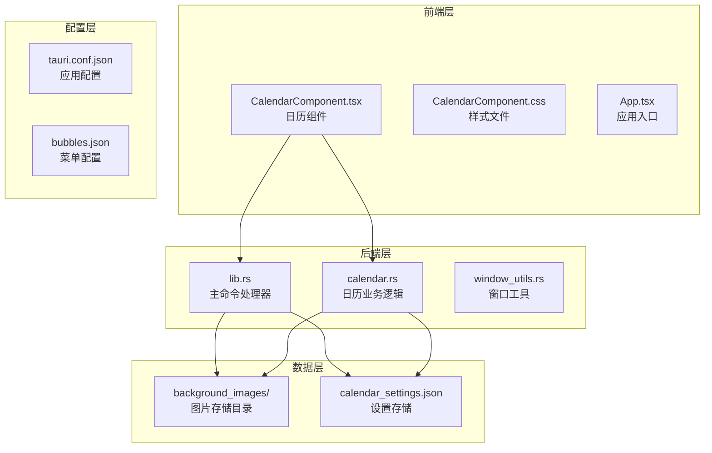
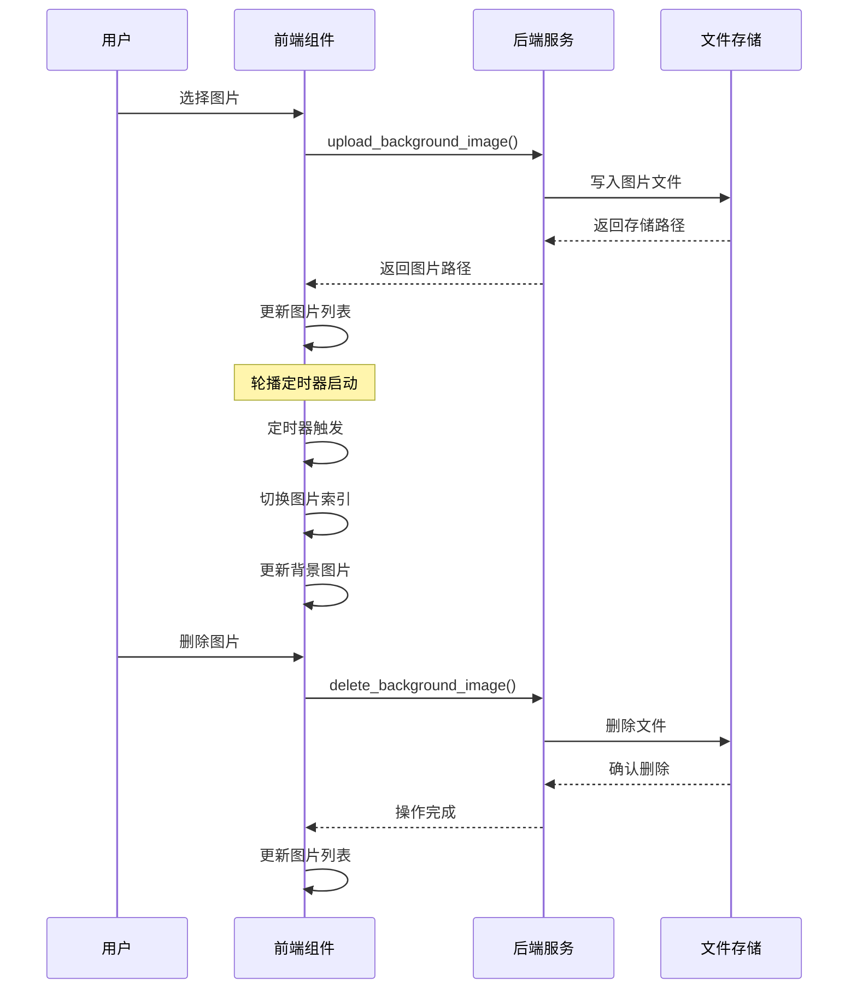
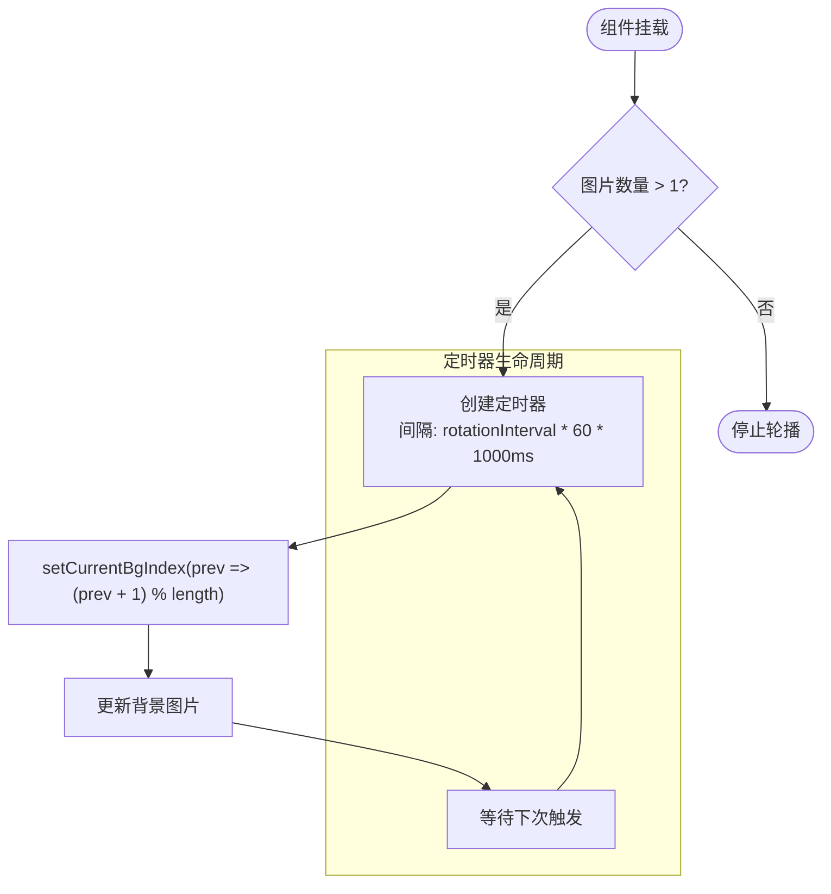
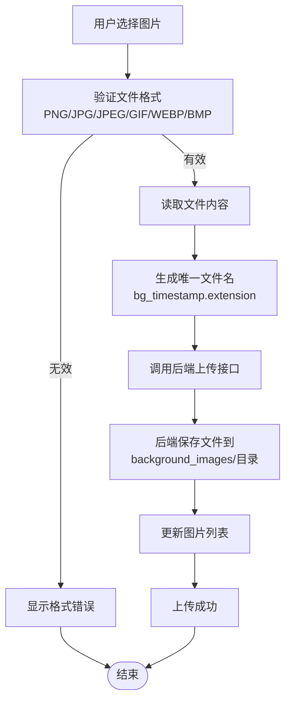
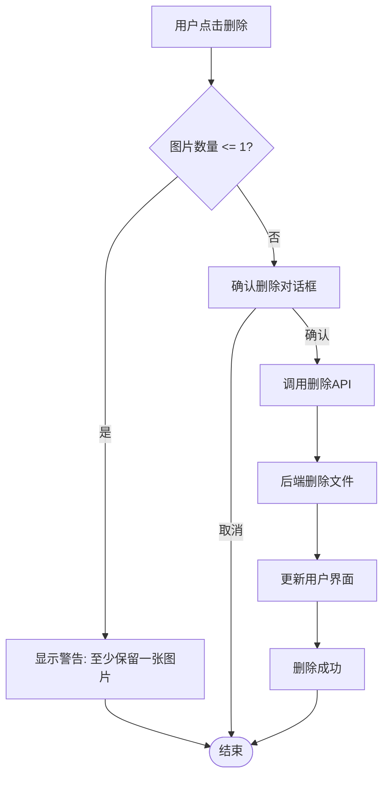
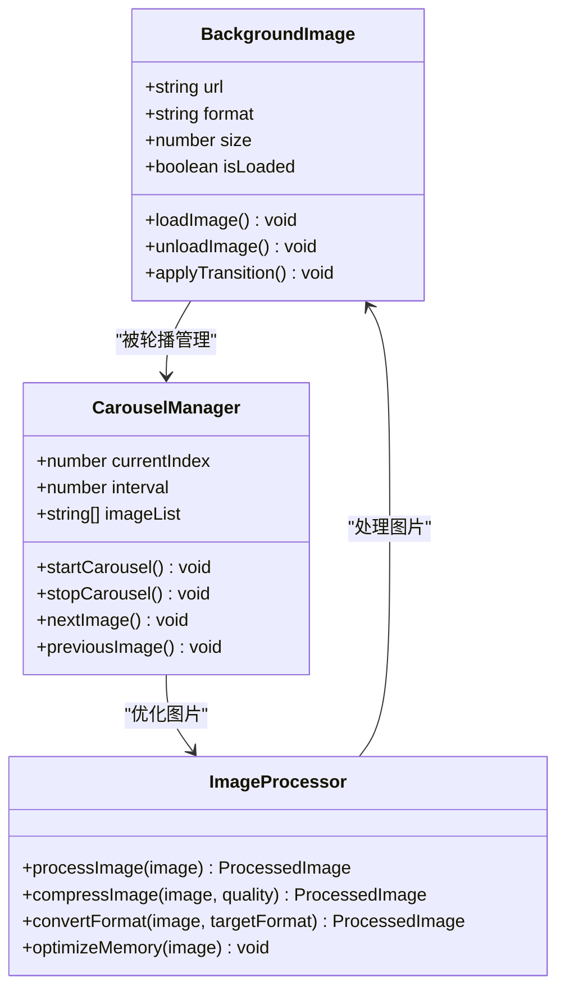
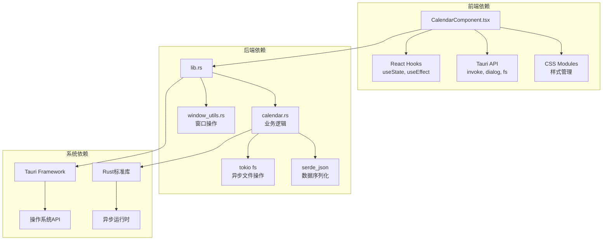
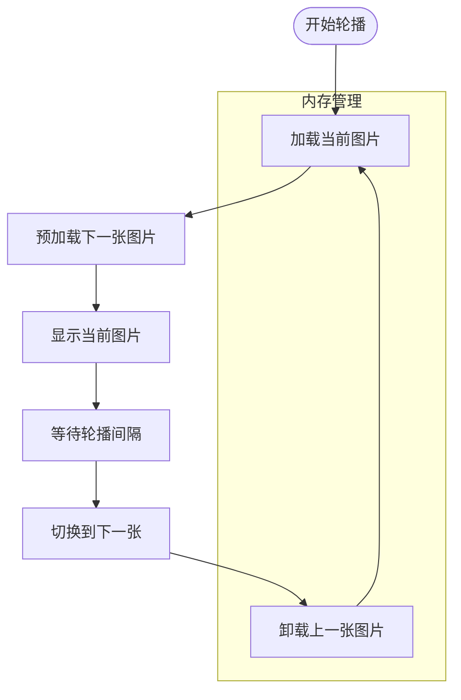

# 背景图片轮播

<cite>
**本文档引用的文件**
- [CalendarComponent.tsx](file://src/components/CalendarComponent.tsx)
- [CalendarComponent.css](file://src/components/CalendarComponent.css)
- [calendar.rs](file://src-tauri/src/calendar.rs)
- [lib.rs](file://src-tauri/src/lib.rs)
- [tauri.conf.json](file://src-tauri/tauri.conf.json)
- [README.md](file://README.md)
</cite>

## 目录
1. [简介](#简介)
2. [项目结构](#项目结构)
3. [核心组件](#核心组件)
4. [架构概览](#架构概览)
5. [详细组件分析](#详细组件分析)
6. [依赖关系分析](#依赖关系分析)
7. [性能考虑](#性能考虑)
8. [故障排除指南](#故障排除指南)
9. [结论](#结论)

## 简介

背景图片轮播功能是 XSUN Desktop Pet 桌面宠物应用中的一个重要特性，它允许用户自定义桌面背景图片并实现自动轮播效果。该功能结合了前端 React 组件和后端 Rust 逻辑，提供了完整的图片管理、轮播控制和视觉呈现解决方案。

本功能的主要特点包括：
- 支持多种图片格式（PNG、JPG、JPEG、GIF、WEBP、BMP）
- 可配置的轮播间隔时间（5分钟到24小时）
- 图片上传、删除和管理功能
- 卡片模式和全屏模式的视觉展示
- 异步加载和内存优化机制

## 项目结构

XSUN Desktop Pet 采用现代化的桌面应用架构，结合了 React + TypeScript 前端技术和 Rust + Tauri 后端技术栈。

**图表来源**
- [CalendarComponent.tsx:1-561](file://src/components/CalendarComponent.tsx#L1-561)
- [lib.rs:727-768](file://src-tauri/src/lib.rs#L727-L768)
- [calendar.rs:220-245](file://src-tauri/src/calendar.rs#L220-L245)

**章节来源**
- [README.md:129-168](file://README.md#L129-L168)
- [tauri.conf.json:1-74](file://src-tauri/tauri.conf.json#L1-L74)

## 核心组件

### 日历组件（CalendarComponent）

日历组件是背景图片轮播功能的核心实现，负责处理用户界面、图片管理和轮播逻辑。

**主要功能特性：**
- 图片轮播定时器控制
- 图片索引管理和循环播放
- 图片上传和删除机制
- 轮播间隔配置管理
- 卡片模式和全屏模式切换

**章节来源**
- [CalendarComponent.tsx:25-61](file://src/components/CalendarComponent.tsx#L25-L61)
- [CalendarComponent.tsx:196-241](file://src/components/CalendarComponent.tsx#L196-L241)

### 后端日历管理器（CalendarManager）

后端提供完整的图片管理服务，包括文件存储、数据持久化和业务逻辑处理。

**核心职责：**
- 图片文件的上传和存储
- 图片文件的删除和清理
- 用户设置的持久化存储
- 日历数据的管理

**章节来源**
- [calendar.rs:83-90](file://src-tauri/src/calendar.rs#L83-L90)
- [calendar.rs:220-245](file://src-tauri/src/calendar.rs#L220-L245)

## 架构概览

背景图片轮播功能采用分层架构设计，实现了前后端分离和职责明确的组件组织。

**图表来源**
- [CalendarComponent.tsx:55-61](file://src/components/CalendarComponent.tsx#L55-L61)
- [CalendarComponent.tsx:209-218](file://src/components/CalendarComponent.tsx#L209-L218)
- [lib.rs:727-768](file://src-tauri/src/lib.rs#L727-L768)

## 详细组件分析

### 图片轮播机制

#### 定时器控制逻辑

轮播功能通过 JavaScript 的 `setInterval` 实现定时切换，支持动态配置轮播间隔。

**图表来源**
- [CalendarComponent.tsx:55-61](file://src/components/CalendarComponent.tsx#L55-L61)

#### 图片索引管理

图片索引采用循环队列算法，确保图片列表的无缝循环播放。

**章节来源**
- [CalendarComponent.tsx:32-32](file://src/components/CalendarComponent.tsx#L32-L32)
- [CalendarComponent.tsx:56-58](file://src/components/CalendarComponent.tsx#L56-L58)

### 图片上传和管理

#### 文件上传流程

图片上传功能支持多种格式，并提供完整的错误处理机制。

**图表来源**
- [CalendarComponent.tsx:198-224](file://src/components/CalendarComponent.tsx#L198-L224)
- [lib.rs:727-750](file://src-tauri/src/lib.rs#L727-L750)

#### 图片存储路径管理

后端采用结构化的文件存储策略，确保数据的有序管理和易于维护。

**章节来源**
- [calendar.rs:220-233](file://src-tauri/src/calendar.rs#L220-L233)
- [lib.rs:738-749](file://src-tauri/src/lib.rs#L738-L749)

### 图片删除和替换机制

#### 删除安全检查

删除功能包含多重安全检查，防止误删和数据丢失。

**图表来源**
- [CalendarComponent.tsx:226-241](file://src/components/CalendarComponent.tsx#L226-L241)

#### 替换机制

图片替换采用原子操作策略，确保数据的一致性和完整性。

**章节来源**
- [CalendarComponent.tsx:232-238](file://src/components/CalendarComponent.tsx#L232-L238)
- [calendar.rs:235-245](file://src-tauri/src/calendar.rs#L235-L245)

### 轮播间隔配置

#### 配置选项设计

轮播间隔提供灵活的配置范围，满足不同用户的需求。

**配置参数：**
- 最小间隔：5分钟
- 最大间隔：1440分钟（24小时）
- 默认间隔：30分钟
- 配置精度：1分钟

**章节来源**
- [CalendarComponent.tsx:534-543](file://src/components/CalendarComponent.tsx#L534-L543)
- [CalendarComponent.tsx:27-30](file://src/components/CalendarComponent.tsx#L27-L30)

### 图片格式兼容性

#### 支持的图片格式

系统支持多种主流图片格式，确保广泛的兼容性。

**支持格式：**
- PNG（便携式网络图形）
- JPG/JPEG（联合图片专家组）
- GIF（图形交换格式）
- WEBP（Google开发的图片格式）
- BMP（位图图像格式）

**章节来源**
- [CalendarComponent.tsx:200-203](file://src/components/CalendarComponent.tsx#L200-L203)

### 视觉设计和用户体验

#### 背景轮播的视觉效果

系统采用渐进增强的视觉设计，提供流畅的用户体验。

**图表来源**
- [CalendarComponent.css:15-25](file://src/components/CalendarComponent.css#L15-L25)
- [CalendarComponent.css:486-498](file://src/components/CalendarComponent.css#L486-L498)

**章节来源**
- [CalendarComponent.css:1-13](file://src/components/CalendarComponent.css#L1-L13)
- [CalendarComponent.css:316-332](file://src/components/CalendarComponent.css#L316-L332)

## 依赖关系分析

### 组件间依赖关系

背景图片轮播功能涉及多个层次的依赖关系，形成了清晰的职责分工。

**图表来源**
- [CalendarComponent.tsx:1-12](file://src/components/CalendarComponent.tsx#L1-L12)
- [lib.rs:1-18](file://src-tauri/src/lib.rs#L1-L18)

### 外部依赖管理

系统使用 Cargo 包管理器管理 Rust 依赖，确保版本兼容性和安全性。

**主要依赖：**
- tokio：异步运行时框架
- serde：数据序列化/反序列化
- tauri：桌面应用框架
- chrono：日期时间处理

**章节来源**
- [lib.rs:1-11](file://src-tauri/src/lib.rs#L1-L11)

## 性能考虑

### 异步加载优化

系统采用异步加载策略，避免阻塞主线程，提升用户体验。

**优化措施：**
- 使用 `tokio::fs` 进行异步文件操作
- React Suspense 支持延迟加载
- 图片懒加载机制
- 内存缓存管理

### 预加载策略

为了减少轮播切换时的延迟，系统实现了智能预加载机制。

**图表来源**
- [CalendarComponent.tsx:55-61](file://src/components/CalendarComponent.tsx#L55-L61)

### 内存管理

系统实现了严格的内存管理策略，防止内存泄漏和过度占用。

**内存优化：**
- 图片资源的及时释放
- 大文件的分块处理
- 缓存大小的动态调整
- 垃圾回收的触发时机

## 故障排除指南

### 常见问题和解决方案

#### 图片上传失败

**可能原因：**
- 不支持的图片格式
- 文件大小超过限制
- 权限不足
- 存储空间不足

**解决步骤：**
1. 检查图片格式是否在支持列表中
2. 验证文件大小是否符合要求
3. 确认应用具有文件写入权限
4. 检查磁盘空间是否充足

#### 轮播功能异常

**可能原因：**
- 定时器未正确初始化
- 图片路径无效
- 网络连接问题
- 内存不足

**解决步骤：**
1. 检查控制台是否有错误信息
2. 验证图片路径的有效性
3. 确认网络连接正常
4. 监控内存使用情况

#### 删除操作失败

**可能原因：**
- 文件正在被使用
- 权限不足
- 文件已被删除
- 系统错误

**解决步骤：**
1. 确认图片未被其他进程使用
2. 检查文件权限设置
3. 验证文件是否存在
4. 查看系统日志获取详细错误信息

**章节来源**
- [CalendarComponent.tsx:220-223](file://src/components/CalendarComponent.tsx#L220-L223)
- [calendar.rs:220-245](file://src-tauri/src/calendar.rs#L220-L245)

### 错误恢复机制

系统内置了多重错误恢复机制，确保功能的稳定性和可靠性。

**恢复策略：**
- 自动重试机制
- 降级模式支持
- 数据备份和恢复
- 状态自动修复

## 结论

背景图片轮播功能展现了 XSUN Desktop Pet 应用在桌面应用开发方面的成熟技术栈和设计理念。通过前后端分离的架构设计、完善的错误处理机制和优化的性能策略，该功能为用户提供了流畅、可靠的图片轮播体验。

**主要优势：**
- 现代化的技术栈组合
- 完善的文件管理和存储机制
- 灵活的配置选项
- 优秀的性能表现
- 健壮的错误处理

**未来改进方向：**
- 增加更多的图片格式支持
- 实现更高级的图片处理功能
- 优化移动端适配
- 增强个性化定制能力

该功能的成功实现为整个 XSUN Desktop Pet 项目奠定了坚实的基础，体现了开发者在桌面应用开发领域的专业能力和创新精神。