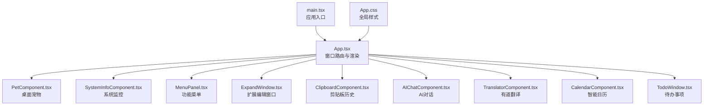
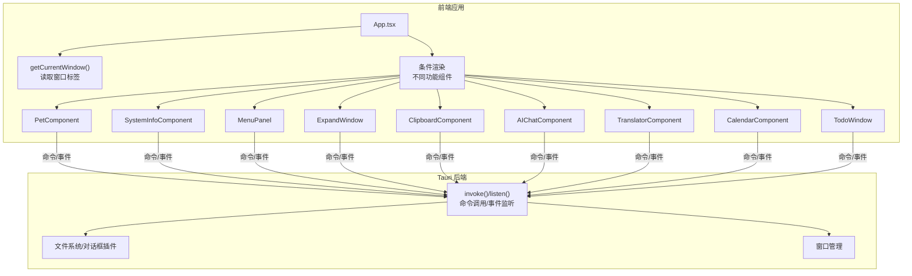
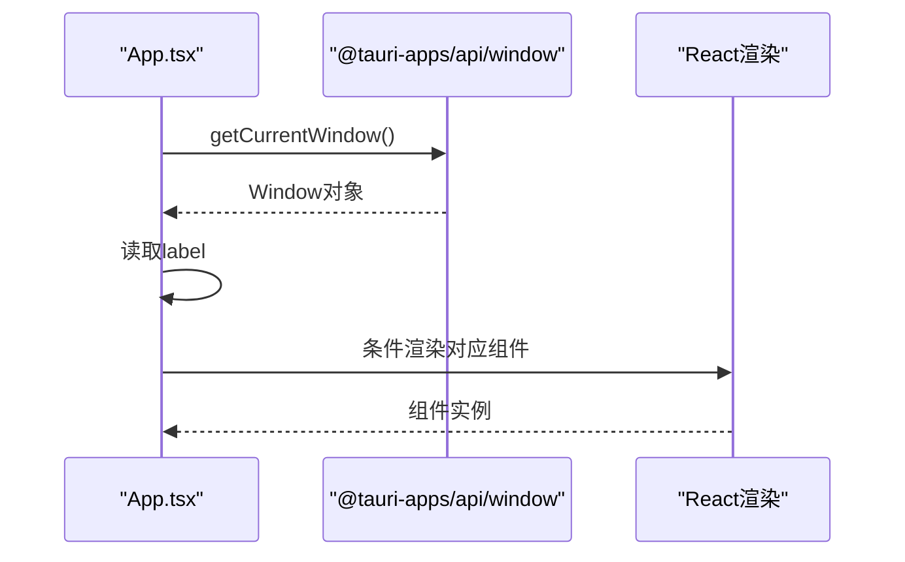
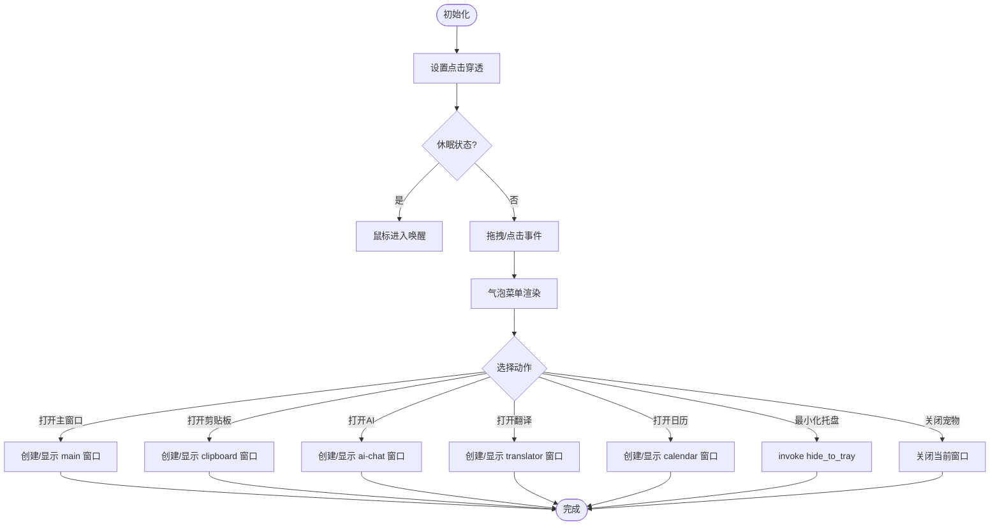
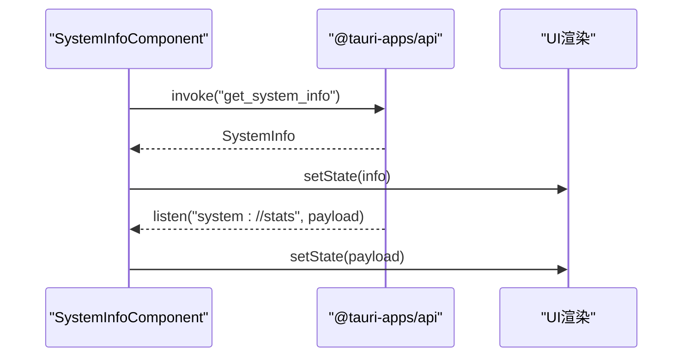
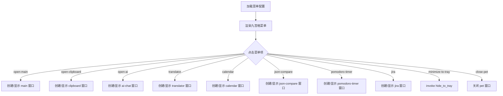
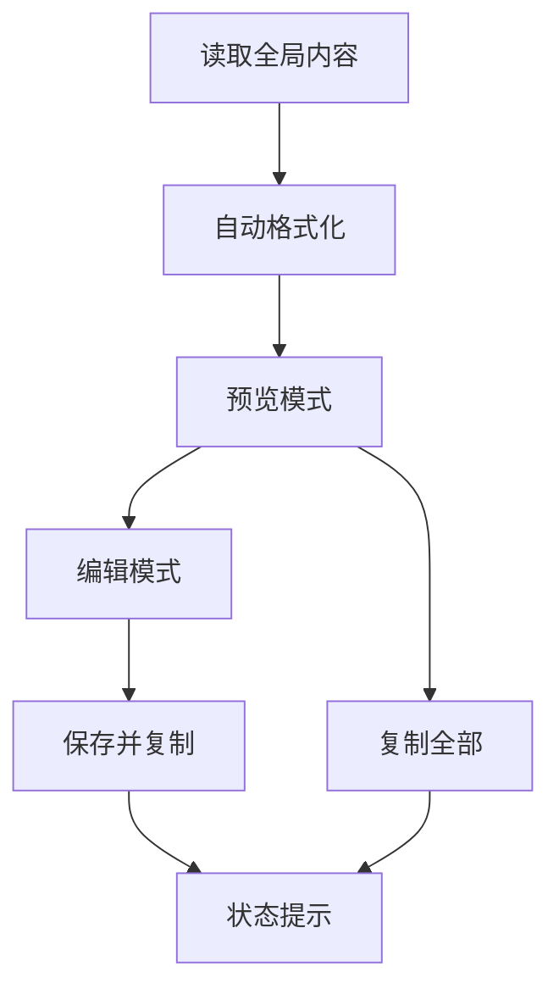
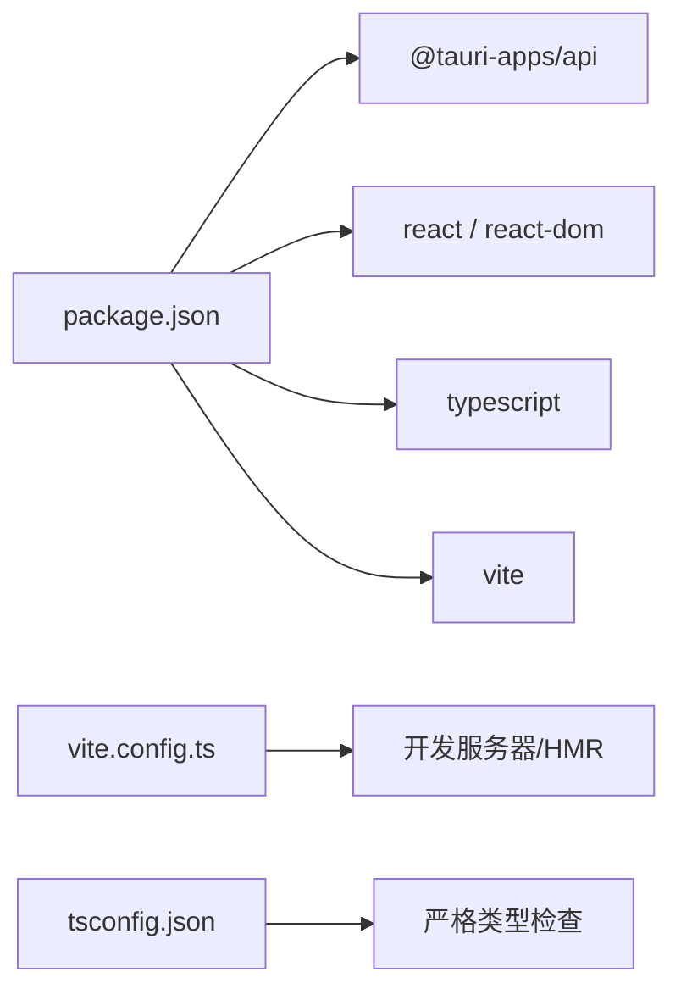

# 前端架构设计

<cite>
**本文档引用的文件**
- [src/App.tsx](file://src/App.tsx)
- [src/main.tsx](file://src/main.tsx)
- [package.json](file://package.json)
- [tsconfig.json](file://tsconfig.json)
- [vite.config.ts](file://vite.config.ts)
- [src/App.css](file://src/App.css)
- [src/components/PetComponent.tsx](file://src/components/PetComponent.tsx)
- [src/components/SystemInfoComponent.tsx](file://src/components/SystemInfoComponent.tsx)
- [src/components/MenuPanel.tsx](file://src/components/MenuPanel.tsx)
- [src/components/ExpandWindow.tsx](file://src/components/ExpandWindow.tsx)
- [src/components/ClipboardComponent.tsx](file://src/components/ClipboardComponent.tsx)
- [src/components/AIChatComponent.tsx](file://src/components/AIChatComponent.tsx)
- [src/components/TranslatorComponent.tsx](file://src/components/TranslatorComponent.tsx)
- [src/components/CalendarComponent.tsx](file://src/components/CalendarComponent.tsx)
- [src/components/TodoWindow.tsx](file://src/components/TodoWindow.tsx)
- [src/utils/lunarUtils.ts](file://src/utils/lunarUtils.ts)
</cite>

## 目录
1. [引言](#引言)
2. [项目结构](#项目结构)
3. [核心组件](#核心组件)
4. [架构总览](#架构总览)
5. [详细组件分析](#详细组件分析)
6. [依赖关系分析](#依赖关系分析)
7. [性能考虑](#性能考虑)
8. [故障排除指南](#故障排除指南)
9. [结论](#结论)

## 引言
本文件为 XSUN 桌面宠物项目的前端架构设计文档，面向使用 React 19.1.0 与 TypeScript 的开发者与维护者。文档围绕组件化架构、窗口路由机制、组件间通信、样式管理、性能优化以及与 Tauri 后端的集成方式进行系统性阐述，并提供可视化图示帮助理解。

## 项目结构
前端采用基于功能域的组件组织方式，入口位于 main.tsx，根组件 App.tsx 根据当前窗口标签动态选择渲染不同功能组件。各功能组件位于 src/components 目录下，公共样式位于 src/App.css，工具类位于 src/utils。

**图表来源**
- [src/main.tsx:1-10](file://src/main.tsx#L1-L10)
- [src/App.tsx:1-60](file://src/App.tsx#L1-L60)
- [src/App.css:1-130](file://src/App.css#L1-L130)

**章节来源**
- [src/main.tsx:1-10](file://src/main.tsx#L1-L10)
- [src/App.tsx:1-60](file://src/App.tsx#L1-L60)
- [src/App.css:1-130](file://src/App.css#L1-L130)

## 核心组件
- 应用入口与打包配置：main.tsx 负责挂载 React 根节点；package.json 定义依赖与脚本；vite.config.ts 提供开发服务器与 HMR 配置；tsconfig.json 启用严格类型检查。
- 根组件 App：通过 @tauri-apps/api/window 获取当前窗口 label 并进行分支渲染，实现“一个应用多窗口”的统一入口。
- 功能组件：PetComponent、SystemInfoComponent、MenuPanel、ExpandWindow、ClipboardComponent、AIChatComponent、TranslatorComponent、CalendarComponent、TodoWindow 等，分别负责不同业务场景。

**章节来源**
- [src/main.tsx:1-10](file://src/main.tsx#L1-L10)
- [package.json:1-29](file://package.json#L1-L29)
- [vite.config.ts:1-33](file://vite.config.ts#L1-L33)
- [tsconfig.json:1-26](file://tsconfig.json#L1-L26)
- [src/App.tsx:18-58](file://src/App.tsx#L18-L58)

## 架构总览
前端采用“单页多窗口”架构：同一 React 应用根据窗口标签动态渲染不同组件；组件间通过 props、事件监听与 Tauri 命令实现通信；样式采用 CSS 模块化与全局样式结合的方式；TypeScript 提供强类型保障。

**图表来源**
- [src/App.tsx:18-58](file://src/App.tsx#L18-L58)
- [src/components/PetComponent.tsx:19-202](file://src/components/PetComponent.tsx#L19-L202)
- [src/components/SystemInfoComponent.tsx:13-26](file://src/components/SystemInfoComponent.tsx#L13-L26)
- [src/components/MenuPanel.tsx:14-88](file://src/components/MenuPanel.tsx#L14-L88)
- [src/components/ExpandWindow.tsx:6-44](file://src/components/ExpandWindow.tsx#L6-L44)
- [src/components/ClipboardComponent.tsx:12-32](file://src/components/ClipboardComponent.tsx#L12-L32)
- [src/components/AIChatComponent.tsx:23-49](file://src/components/AIChatComponent.tsx#L23-L49)
- [src/components/TranslatorComponent.tsx:49-86](file://src/components/TranslatorComponent.tsx#L49-L86)
- [src/components/CalendarComponent.tsx:25-52](file://src/components/CalendarComponent.tsx#L25-L52)
- [src/components/TodoWindow.tsx:15-42](file://src/components/TodoWindow.tsx#L15-L42)

## 详细组件分析

### App 组件与窗口路由机制
- 通过 getCurrentWindow() 获取当前窗口实例，读取其 label。
- 基于 label 的精确匹配与前缀匹配（如 expand_、todo_）选择对应组件渲染。
- 该机制实现了“单一应用多窗口”的统一入口，减少重复构建与资源浪费。

**图表来源**
- [src/App.tsx:21-25](file://src/App.tsx#L21-L25)
- [src/App.tsx:27-55](file://src/App.tsx#L27-L55)

**章节来源**
- [src/App.tsx:18-58](file://src/App.tsx#L18-L58)

### 桌面宠物组件（PetComponent）
- 状态管理：包含动画索引、气泡显示、点击穿透、休眠状态等内部状态。
- 事件处理：鼠标进入/离开、指针按下/移动/抬起、双击检测等。
- 与后端交互：通过 invoke 调用 Rust 命令控制点击穿透、最小化到托盘；通过 listen 监听托盘/选择菜单等事件；通过 WebviewWindow 创建子窗口。
- 窗口生命周期：创建/显示/聚焦/关闭；超时保护与错误处理。

**图表来源**
- [src/components/PetComponent.tsx:36-47](file://src/components/PetComponent.tsx#L36-L47)
- [src/components/PetComponent.tsx:64-67](file://src/components/PetComponent.tsx#L64-L67)
- [src/components/PetComponent.tsx:156-202](file://src/components/PetComponent.tsx#L156-L202)
- [src/components/PetComponent.tsx:347-401](file://src/components/PetComponent.tsx#L347-L401)
- [src/components/PetComponent.tsx:403-458](file://src/components/PetComponent.tsx#L403-L458)
- [src/components/PetComponent.tsx:460-517](file://src/components/PetComponent.tsx#L460-L517)
- [src/components/PetComponent.tsx:519-573](file://src/components/PetComponent.tsx#L519-L573)
- [src/components/PetComponent.tsx:712-745](file://src/components/PetComponent.tsx#L712-L745)

**章节来源**
- [src/components/PetComponent.tsx:19-819](file://src/components/PetComponent.tsx#L19-L819)

### 系统监控组件（SystemInfoComponent）
- 类型安全：通过 SystemInfo 接口约束数据结构。
- 数据流：首次 invoke 获取系统信息，随后通过事件监听实时更新。
- UI 呈现：CPU/内存使用率、进度条与百分比展示，关闭按钮调用窗口关闭。

**图表来源**
- [src/components/SystemInfoComponent.tsx:13-26](file://src/components/SystemInfoComponent.tsx#L13-L26)

**章节来源**
- [src/components/SystemInfoComponent.tsx:13-149](file://src/components/SystemInfoComponent.tsx#L13-L149)

### 功能菜单组件（MenuPanel）
- 配置驱动：从公共配置加载菜单项，支持图标回退。
- 窗口管理：统一创建/显示/聚焦子窗口，集中处理超时与错误。
- 动作分发：根据 action 分派到不同窗口或系统行为（最小化到托盘、关闭宠物）。

**图表来源**
- [src/components/MenuPanel.tsx:14-88](file://src/components/MenuPanel.tsx#L14-L88)
- [src/components/MenuPanel.tsx:90-259](file://src/components/MenuPanel.tsx#L90-L259)

**章节来源**
- [src/components/MenuPanel.tsx:14-295](file://src/components/MenuPanel.tsx#L14-L295)

### 扩展编辑窗口（ExpandWindow）
- 数据注入：从全局变量读取内容，自动格式化（JSON 或逗号分隔）。
- 编辑能力：切换编辑模式，支持保存到剪贴板历史并同步复制。
- 状态反馈：保存中/已保存/错误状态提示。

**图表来源**
- [src/components/ExpandWindow.tsx:27-44](file://src/components/ExpandWindow.tsx#L27-L44)
- [src/components/ExpandWindow.tsx:57-70](file://src/components/ExpandWindow.tsx#L57-L70)

**章节来源**
- [src/components/ExpandWindow.tsx:6-168](file://src/components/ExpandWindow.tsx#L6-L168)

### 剪贴板历史组件（ClipboardComponent）
- 实时刷新：定时轮询后端剪贴板历史。
- 交互能力：复制、展开详情、清空历史。
- 用户体验：时间格式化、内容截断、大小显示。

**章节来源**
- [src/components/ClipboardComponent.tsx:12-182](file://src/components/ClipboardComponent.tsx#L12-L182)

### AI 对话组件（AIChatComponent）
- 配置管理：本地配置加载/保存，支持 DeepSeek API 参数。
- 消息流：用户消息 -> 后端推理 -> 助手回复；支持错误兜底。
- UI 交互：滚动到底部、快捷键发送、清空聊天。

**章节来源**
- [src/components/AIChatComponent.tsx:23-371](file://src/components/AIChatComponent.tsx#L23-L371)

### 有道翻译组件（TranslatorComponent）
- 多面板翻译：支持多个目标语言面板并行翻译。
- 配置校验：监听外部填充文本事件，支持有道 API 配置。
- 错误处理：翻译失败时显示错误信息。

**章节来源**
- [src/components/TranslatorComponent.tsx:49-409](file://src/components/TranslatorComponent.tsx#L49-L409)

### 日历组件（CalendarComponent）
- 设置持久化：背景图轮播、轮播间隔等设置。
- 事件驱动：监听刷新事件，动态更新数据。
- 卡片模式：支持右侧悬浮卡片模式，适配不同屏幕布局。
- 子窗口联动：双击日期打开对应 TodoWindow，并通过事件传递日期。

**章节来源**
- [src/components/CalendarComponent.tsx:25-561](file://src/components/CalendarComponent.tsx#L25-L561)

### 待办事项组件（TodoWindow）
- 数据绑定：从 URL 参数或事件接收日期，加载对应日期的待办列表。
- 排序规则：未完成在前，按创建时间排序；完成的待办单独展示。
- 与后端交互：保存/更新待办，触发日历刷新。

**章节来源**
- [src/components/TodoWindow.tsx:15-230](file://src/components/TodoWindow.tsx#L15-L230)

## 依赖关系分析
- 运行时依赖：@tauri-apps/api 提供窗口、命令、事件、WebviewWindow 等能力；各插件提供文件系统、对话框、opener 等能力。
- 构建工具：Vite + React 插件；TypeScript 编译；严格模式开启。
- 开发环境：固定端口 1420，支持 HMR；忽略 src-tauri 目录。

**图表来源**
- [package.json:12-27](file://package.json#L12-L27)
- [vite.config.ts:8-32](file://vite.config.ts#L8-L32)
- [tsconfig.json:18-21](file://tsconfig.json#L18-L21)

**章节来源**
- [package.json:1-29](file://package.json#L1-L29)
- [vite.config.ts:1-33](file://vite.config.ts#L1-L33)
- [tsconfig.json:1-26](file://tsconfig.json#L1-L26)

## 性能考虑
- 组件渲染优化
  - 使用 React 19 的并发特性与细粒度状态拆分，减少不必要的重渲染。
  - 在 PetComponent 中对定时器与事件监听进行清理，避免内存泄漏。
- 窗口级懒加载
  - 仅在需要时创建子窗口（如 main、clipboard、ai-chat 等），并通过 show/focus 控制可见性，降低初始资源占用。
- 数据缓存与轮询
  - ClipboardComponent 使用定时轮询获取历史，建议在后台标签页或非活跃窗口时降低轮询频率。
- 样式与资源
  - App.css 中设置 body 高度与溢出控制，避免滚动条影响；组件内使用相对路径资源，减少额外请求。
- TypeScript 类型约束
  - 通过接口定义（如 SystemInfo、ClipboardItem、TodoItem 等）在编译期捕获潜在错误，减少运行时异常。

[本节为通用性能指导，无需特定文件引用]

## 故障排除指南
- 窗口创建失败
  - 现象：WebviewWindow 创建后超时或报错。
  - 排查：检查 tauri://created 与 tauri://error 事件回调；确认 URL 与端口配置；验证窗口选项（透明、装饰、尺寸）。
  - 参考：PetComponent、MenuPanel、CalendarComponent、TodoWindow 中的窗口创建逻辑。
- 命令调用异常
  - 现象：invoke 返回错误或无响应。
  - 排查：确认后端命令注册与权限；检查参数类型与命名；在组件中增加 try/catch 并记录错误日志。
  - 参考：各组件中 invoke 调用点（如 get_system_info、copy_to_clipboard、open_expand_window 等）。
- 事件监听未生效
  - 现象：listen 未收到事件或重复监听。
  - 排查：确保返回的 unlisten 函数在卸载时调用；避免在多次渲染中重复订阅。
  - 参考：PetComponent、SystemInfoComponent、CalendarComponent、TranslatorComponent 的事件监听。
- 样式冲突
  - 现象：全局样式影响组件外观。
  - 排查：检查 App.css 中的全局选择器与组件局部样式优先级；必要时使用更具体的选择器或 CSS Modules。
  - 参考：App.css 与各组件样式文件。

**章节来源**
- [src/components/PetComponent.tsx:347-401](file://src/components/PetComponent.tsx#L347-L401)
- [src/components/MenuPanel.tsx:60-88](file://src/components/MenuPanel.tsx#L60-L88)
- [src/components/CalendarComponent.tsx:144-186](file://src/components/CalendarComponent.tsx#L144-L186)
- [src/components/TodoWindow.tsx:30-42](file://src/components/TodoWindow.tsx#L30-L42)
- [src/App.css:118-130](file://src/App.css#L118-L130)

## 结论
XSUN 桌面宠物前端采用“单应用多窗口”的统一入口设计，结合 Tauri 的命令与事件机制，实现了灵活的功能组合与良好的用户体验。通过 TypeScript 的强类型约束、组件化的状态与事件处理、以及合理的性能策略，整体架构具备可维护性与扩展性。后续可在以下方面持续优化：引入状态管理库（如 Zustand/Redux）以统一跨窗口状态、增强错误边界与日志上报、完善自动化测试与构建流程。