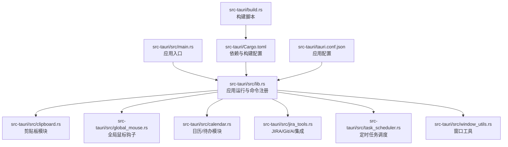
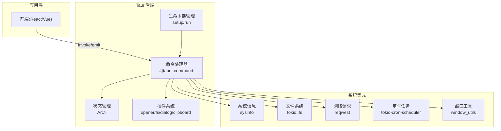
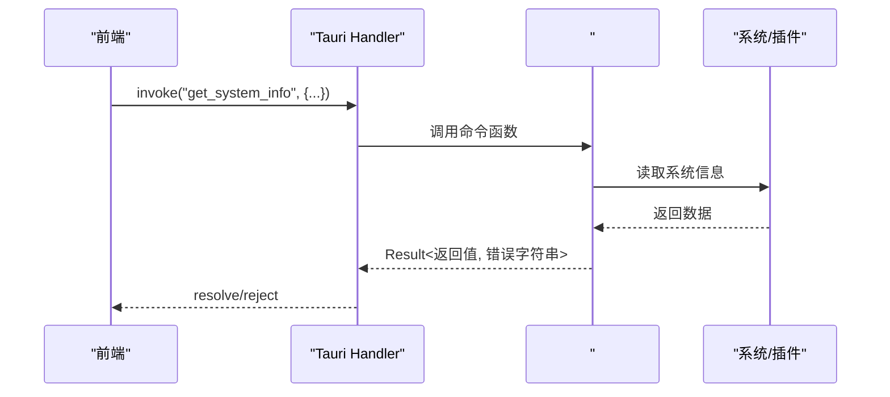
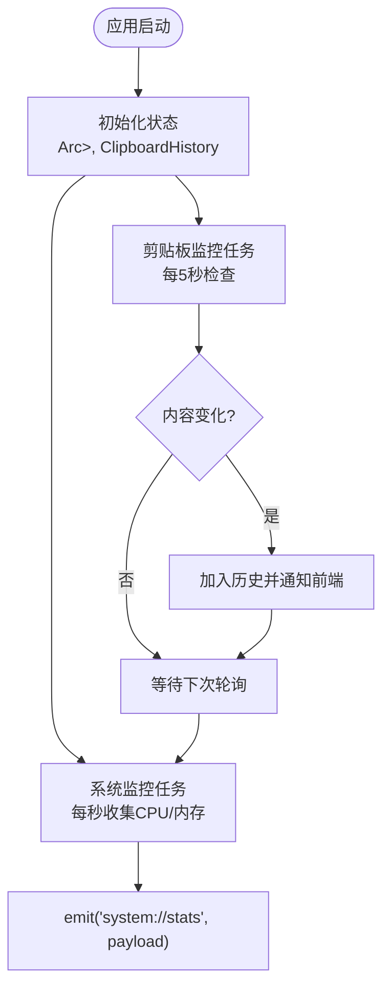
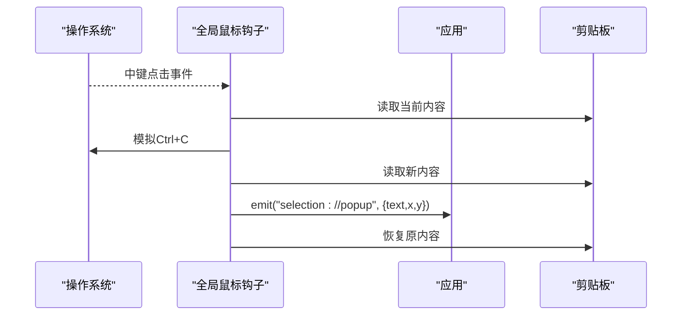
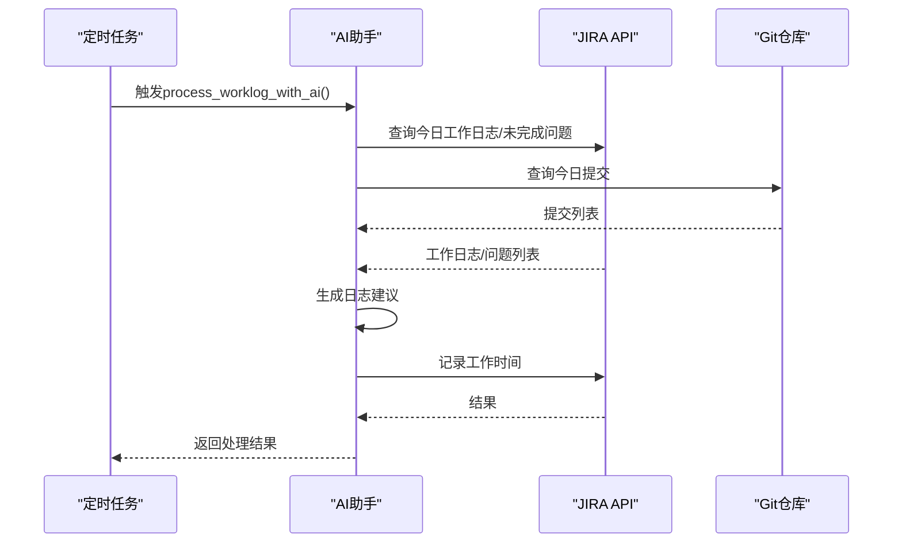
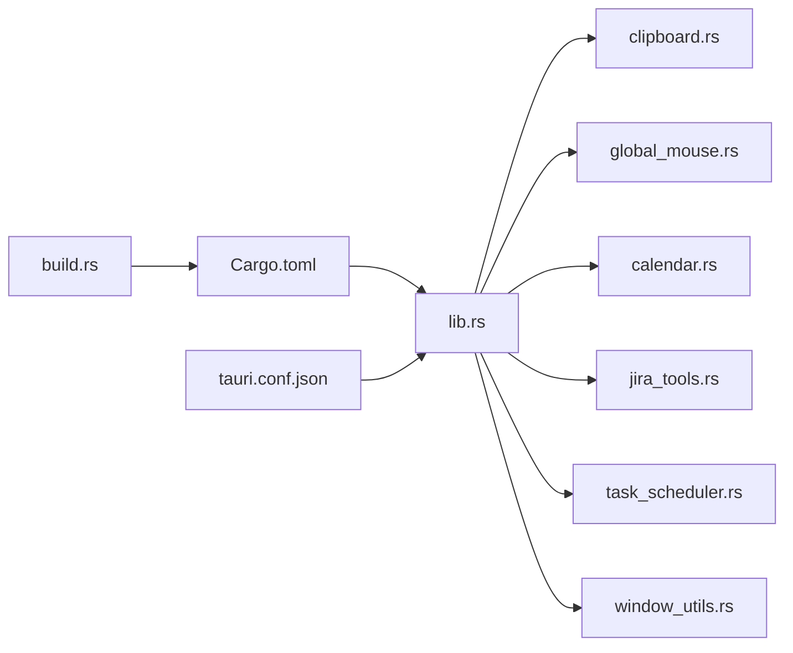

# 后端架构设计

<cite>
**本文档引用的文件**
- [lib.rs](file://src-tauri/src/lib.rs)
- [main.rs](file://src-tauri/src/main.rs)
- [calendar.rs](file://src-tauri/src/calendar.rs)
- [clipboard.rs](file://src-tauri/src/clipboard.rs)
- [global_mouse.rs](file://src-tauri/src/global_mouse.rs)
- [jira_tools.rs](file://src-tauri/src/jira_tools.rs)
- [task_scheduler.rs](file://src-tauri/src/task_scheduler.rs)
- [window_utils.rs](file://src-tauri/src/window_utils.rs)
- [Cargo.toml](file://src-tauri/Cargo.toml)
- [tauri.conf.json](file://src-tauri/tauri.conf.json)
- [build.rs](file://src-tauri/build.rs)
</cite>

## 目录
1. [简介](#简介)
2. [项目结构](#项目结构)
3. [核心组件](#核心组件)
4. [架构总览](#架构总览)
5. [详细组件分析](#详细组件分析)
6. [依赖关系分析](#依赖关系分析)
7. [性能考量](#性能考量)
8. [故障排查指南](#故障排查指南)
9. [结论](#结论)
10. [附录](#附录)

## 简介
本文件面向XSUN桌面宠物项目的后端架构设计，基于Rust与Tauri 2.0构建。文档重点阐述命令处理架构、系统集成机制、业务模块化设计（系统监控、AI集成、文件操作、剪贴板与鼠标钩子、JIRA/Git集成、定时任务等）、Tauri命令系统与生命周期管理、错误处理与异常管理、性能优化策略以及Cargo依赖管理与版本控制策略。

## 项目结构
后端位于src-tauri目录，采用模块化组织，核心入口通过main.rs调用lib.rs中的run()函数启动Tauri应用。各功能模块独立封装在单独的源文件中，通过lib.rs统一导出与注册命令、插件与状态管理。

图表来源
- [main.rs:1-11](file://src-tauri/src/main.rs#L1-L11)
- [lib.rs:940-1113](file://src-tauri/src/lib.rs#L940-L1113)
- [clipboard.rs:1-251](file://src-tauri/src/clipboard.rs#L1-L251)
- [global_mouse.rs:1-149](file://src-tauri/src/global_mouse.rs#L1-L149)
- [calendar.rs:1-363](file://src-tauri/src/calendar.rs#L1-L363)
- [jira_tools.rs:1-1029](file://src-tauri/src/jira_tools.rs#L1-L1029)
- [task_scheduler.rs:1-93](file://src-tauri/src/task_scheduler.rs#L1-L93)
- [window_utils.rs:1-33](file://src-tauri/src/window_utils.rs#L1-L33)
- [Cargo.toml:1-44](file://src-tauri/Cargo.toml#L1-L44)
- [tauri.conf.json:1-74](file://src-tauri/tauri.conf.json#L1-L74)
- [build.rs:1-4](file://src-tauri/build.rs#L1-L4)

章节来源
- [main.rs:1-11](file://src-tauri/src/main.rs#L1-L11)
- [lib.rs:940-1113](file://src-tauri/src/lib.rs#L940-L1113)
- [Cargo.toml:1-44](file://src-tauri/Cargo.toml#L1-L44)
- [tauri.conf.json:1-74](file://src-tauri/tauri.conf.json#L1-L74)
- [build.rs:1-4](file://src-tauri/build.rs#L1-L4)

## 核心组件
- 应用运行器与命令注册：lib.rs中的run()负责插件初始化、状态管理、命令注册与应用生命周期管理。
- 剪贴板模块：提供剪贴板历史、复制、粘贴、手动检查等能力。
- 全局鼠标钩子：在Windows上拦截中键点击，模拟Ctrl+C获取选中文本并派发事件。
- 日历/待办模块：提供待办项、事件、日历设置的持久化与管理。
- JIRA/Git/AI集成：提供JIRA问题查询、工作日志记录、Git提交查询、AI辅助工作日志生成。
- 定时任务调度：基于cron表达式的异步任务调度器，支持周期性AI工作日志处理。
- 窗口工具：跨平台的窗口穿透/非穿透切换。
- 配置与构建：Cargo.toml定义依赖与构建目标；tauri.conf.json定义窗口、安全与打包配置；build.rs委托编译期生成。

章节来源
- [lib.rs:940-1113](file://src-tauri/src/lib.rs#L940-L1113)
- [clipboard.rs:1-251](file://src-tauri/src/clipboard.rs#L1-L251)
- [global_mouse.rs:1-149](file://src-tauri/src/global_mouse.rs#L1-L149)
- [calendar.rs:1-363](file://src-tauri/src/calendar.rs#L1-L363)
- [jira_tools.rs:1-1029](file://src-tauri/src/jira_tools.rs#L1-L1029)
- [task_scheduler.rs:1-93](file://src-tauri/src/task_scheduler.rs#L1-L93)
- [window_utils.rs:1-33](file://src-tauri/src/window_utils.rs#L1-L33)

## 架构总览
后端采用“命令驱动 + 异步运行时 + 插件扩展”的架构。Tauri 2.0通过#[tauri::command]宏将Rust函数暴露为前端可调用的命令，配合状态管理与插件系统实现系统监控、文件操作、网络请求与窗口管理。

图表来源
- [lib.rs:940-1113](file://src-tauri/src/lib.rs#L940-L1113)
- [clipboard.rs:1-251](file://src-tauri/src/clipboard.rs#L1-L251)
- [jira_tools.rs:1-1029](file://src-tauri/src/jira_tools.rs#L1-L1029)
- [task_scheduler.rs:1-93](file://src-tauri/src/task_scheduler.rs#L1-L93)
- [window_utils.rs:1-33](file://src-tauri/src/window_utils.rs#L1-L33)

## 详细组件分析

### 命令处理架构与#[tauri::command]宏
- #[tauri::command]宏将Rust函数自动暴露为Tauri命令，支持同步与异步函数，参数与返回值自动序列化/反序列化。
- 命令注册集中在lib.rs的invoke_handler中，统一管理所有后端命令。
- 命令参数常包含AppHandle、State、WebviewWindow等，用于访问插件、状态与窗口。
- 错误通过Result<String,...>传播，前端收到字符串错误信息。

图表来源
- [lib.rs:41-72](file://src-tauri/src/lib.rs#L41-L72)
- [lib.rs:949-996](file://src-tauri/src/lib.rs#L949-L996)

章节来源
- [lib.rs:41-72](file://src-tauri/src/lib.rs#L41-L72)
- [lib.rs:949-996](file://src-tauri/src/lib.rs#L949-L996)

### 系统监控与状态管理
- 状态管理：通过manage注册Arc<Mutex<System>>与ClipboardHistory，供命令与后台任务使用。
- 系统监控：setup阶段启动异步任务，每秒收集CPU/内存使用率并通过事件推送至前端。
- 剪贴板监控：每5秒检查剪贴板变化，具备错误重试与限流保护。

图表来源
- [lib.rs:1035-1103](file://src-tauri/src/lib.rs#L1035-L1103)

章节来源
- [lib.rs:947-948](file://src-tauri/src/lib.rs#L947-L948)
- [lib.rs:1035-1103](file://src-tauri/src/lib.rs#L1035-L1103)

### 文件操作与配置管理
- 异步文件系统：使用tokio::fs进行读写、创建目录、检查存在性。
- 配置存储：应用数据目录下保存JIRA、AI、DeepSeek、有道翻译、日历等配置与数据文件。
- JSON序列化：使用serde_json进行配置与数据的序列化/反序列化。

章节来源
- [lib.rs:296-308](file://src-tauri/src/lib.rs#L296-L308)
- [lib.rs:352-379](file://src-tauri/src/lib.rs#L352-L379)
- [lib.rs:458-469](file://src-tauri/src/lib.rs#L458-L469)
- [lib.rs:572-631](file://src-tauri/src/lib.rs#L572-L631)
- [lib.rs:672-718](file://src-tauri/src/lib.rs#L672-L718)
- [lib.rs:725-743](file://src-tauri/src/lib.rs#L725-L743)
- [calendar.rs:98-141](file://src-tauri/src/calendar.rs#L98-L141)
- [calendar.rs:188-218](file://src-tauri/src/calendar.rs#L188-L218)

### 网络请求与API集成
- 请求库：reqwest支持HTTP/HTTPS请求，支持JSON与rustls-tls。
- JIRA集成：基础认证、搜索问题、查询工作日志、记录工作时间、连接测试。
- 有道翻译：生成签名、表单请求、错误码处理。
- DeepSeek/通用AI：构建请求、鉴权头、错误处理与响应解析。

章节来源
- [lib.rs:262-294](file://src-tauri/src/lib.rs#L262-L294)
- [lib.rs:472-545](file://src-tauri/src/lib.rs#L472-L545)
- [jira_tools.rs:169-185](file://src-tauri/src/jira_tools.rs#L169-L185)
- [jira_tools.rs:188-243](file://src-tauri/src/jira_tools.rs#L188-L243)
- [jira_tools.rs:262-373](file://src-tauri/src/jira_tools.rs#L262-L373)
- [jira_tools.rs:375-455](file://src-tauri/src/jira_tools.rs#L375-L455)
- [jira_tools.rs:458-503](file://src-tauri/src/jira_tools.rs#L458-L503)

### 剪贴板与鼠标钩子
- 剪贴板历史：去重、容量限制、线程安全、错误处理与事件通知。
- 全局鼠标钩子：Windows中键点击捕获、模拟Ctrl+C、恢复剪贴板、坐标获取、事件派发。

图表来源
- [global_mouse.rs:30-69](file://src-tauri/src/global_mouse.rs#L30-L69)
- [clipboard.rs:85-121](file://src-tauri/src/clipboard.rs#L85-L121)

章节来源
- [clipboard.rs:1-251](file://src-tauri/src/clipboard.rs#L1-L251)
- [global_mouse.rs:1-149](file://src-tauri/src/global_mouse.rs#L1-L149)

### 日历/待办与窗口管理
- 数据模型：TodoItem、CalendarEvent、DayData、CalendarSettings等。
- 文件存储：todos.json、events.json、calendar_settings.json。
- 窗口管理：通过WebviewWindowBuilder创建透明、无装饰、置顶窗口，支持初始化脚本注入数据。

章节来源
- [calendar.rs:1-363](file://src-tauri/src/calendar.rs#L1-L363)
- [lib.rs:572-631](file://src-tauri/src/lib.rs#L572-L631)
- [lib.rs:634-669](file://src-tauri/src/lib.rs#L634-L669)
- [lib.rs:672-718](file://src-tauri/src/lib.rs#L672-L718)
- [lib.rs:725-761](file://src-tauri/src/lib.rs#L725-L761)

### JIRA/Git/AI集成与定时任务
- JIRA：查询未完成问题、今日工作日志、记录工作时间、连接测试。
- Git：克隆/抓取远程分支、遍历提交、按作者与日期筛选。
- AI：基于提示词模板与当前数据生成工作日志建议，调用AI服务。
- 定时任务：每日17:00前后（约5分钟窗口）自动执行AI工作日志处理。

图表来源
- [task_scheduler.rs:21-61](file://src-tauri/src/task_scheduler.rs#L21-L61)
- [jira_tools.rs:808-955](file://src-tauri/src/jira_tools.rs#L808-L955)

章节来源
- [jira_tools.rs:1-1029](file://src-tauri/src/jira_tools.rs#L1-L1029)
- [task_scheduler.rs:1-93](file://src-tauri/src/task_scheduler.rs#L1-L93)

### 窗口工具与系统集成
- 窗口穿透：Windows通过SetWindowLongW设置EX_LAYERED/EX_TRANSPARENT；其他平台通过忽略光标事件实现。
- 打开外部链接：tauri-plugin-opener插件封装系统默认浏览器打开。

章节来源
- [window_utils.rs:1-33](file://src-tauri/src/window_utils.rs#L1-L33)
- [lib.rs:212-217](file://src-tauri/src/lib.rs#L212-L217)

## 依赖关系分析

图表来源
- [lib.rs:12-17](file://src-tauri/src/lib.rs#L12-L17)
- [Cargo.toml:15-44](file://src-tauri/Cargo.toml#L15-L44)
- [tauri.conf.json:1-74](file://src-tauri/tauri.conf.json#L1-L74)
- [build.rs:1-4](file://src-tauri/build.rs#L1-L4)

章节来源
- [lib.rs:12-17](file://src-tauri/src/lib.rs#L12-L17)
- [Cargo.toml:15-44](file://src-tauri/Cargo.toml#L15-L44)

## 性能考量
- 并发与异步：Tokio运行时提供多线程与异步IO，命令与后台任务均采用async/await，避免阻塞主线程。
- 资源限制：剪贴板监控每5秒一次，系统监控每秒一次，避免过度占用CPU；剪贴板历史最多保留固定数量。
- 内存管理：使用Arc<Mutex<T>>共享状态，避免频繁拷贝；对大对象（如剪贴板内容）进行长度限制与预览截断。
- 网络优化：请求库启用rustls-tls，减少TLS握手开销；对错误响应进行快速失败与错误码解析。
- 定时任务：使用tokio-cron-scheduler，仅在工作日17:00附近执行AI任务，降低非必要负载。

[本节为通用性能指导，无需特定文件引用]

## 故障排查指南
- 剪贴板监控异常：检查错误计数与重试逻辑，超过阈值会暂停一段时间；确认权限与内容长度限制。
- 系统监控失败：检查sysinfo初始化与锁竞争；确认事件发送失败时的中断条件。
- JIRA/有道/DeepSeek API错误：查看状态码与错误文本，确认鉴权头与配置文件有效性。
- 定时任务未执行：核对cron表达式与时区设置，确认工作日判断与时间窗口。
- 窗口穿透失效：Windows平台检查SetWindowLongW调用与句柄有效性；其他平台检查忽略事件设置。

章节来源
- [lib.rs:1067-1103](file://src-tauri/src/lib.rs#L1067-L1103)
- [clipboard.rs:85-121](file://src-tauri/src/clipboard.rs#L85-L121)
- [jira_tools.rs:211-215](file://src-tauri/src/jira_tools.rs#L211-L215)
- [lib.rs:278-282](file://src-tauri/src/lib.rs#L278-L282)
- [task_scheduler.rs:25-53](file://src-tauri/src/task_scheduler.rs#L25-L53)

## 结论
XSUN桌面宠物后端以Tauri 2.0为核心，结合#[tauri::command]命令系统与模块化设计，实现了系统监控、文件操作、网络请求、剪贴板与鼠标钩子、JIRA/Git/AI集成以及定时任务调度的完整能力集。通过状态管理、插件系统与异步运行时，系统在保证功能完整性的同时兼顾性能与可靠性。建议持续关注依赖版本升级与安全补丁，完善错误日志与监控指标，进一步提升用户体验与系统稳定性。

[本节为总结性内容，无需特定文件引用]

## 附录

### Tauri命令系统与生命周期
- 命令注册：在lib.rs的invoke_handler中集中注册所有#[tauri::command]函数。
- 生命周期：setup阶段初始化托盘、窗口、状态与后台任务；run阶段启动应用。
- 插件：opener、fs、dialog、clipboard-manager等插件按需启用。

章节来源
- [lib.rs:949-996](file://src-tauri/src/lib.rs#L949-L996)
- [lib.rs:997-1112](file://src-tauri/src/lib.rs#L997-L1112)

### 错误处理与异常管理
- 统一错误类型：Result<T,String>，错误字符串传递至前端。
- 事件驱动：通过emit向前端推送系统状态与业务事件。
- 异常恢复：后台任务具备错误计数与限流，避免无限重试导致资源耗尽。

章节来源
- [lib.rs:1067-1103](file://src-tauri/src/lib.rs#L1067-L1103)
- [clipboard.rs:85-121](file://src-tauri/src/clipboard.rs#L85-L121)

### Cargo依赖管理与版本控制
- 依赖范围：tauri、reqwest、serde、tokio、sysinfo、git2、md5、urlencoding、base64、uuid、tokio-util、cron、tokio-cron-scheduler等。
- 特性开关：tauri启用tray-icon；reqwest启用json与rustls-tls；tokio启用rt-multi-thread、macros、time、fs。
- 平台依赖：Windows启用Win32 UI与输入相关特性。
- 构建目标：lib crate-type包含staticlib、cdylib、rlib，便于前端调用。

章节来源
- [Cargo.toml:15-44](file://src-tauri/Cargo.toml#L15-L44)