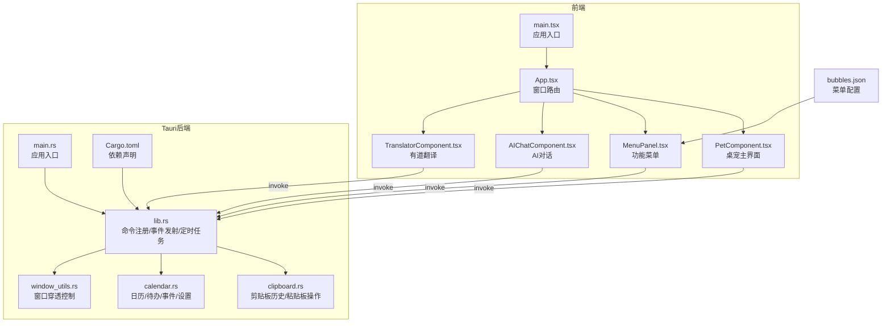
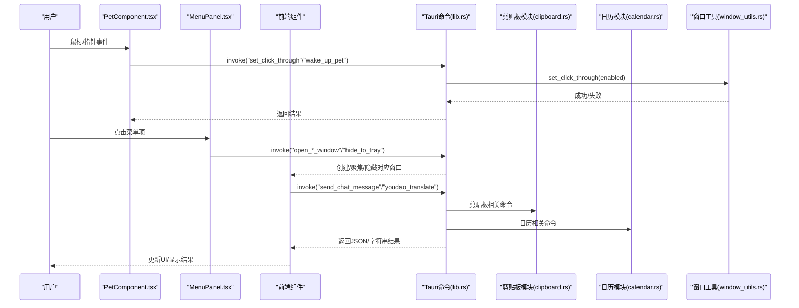
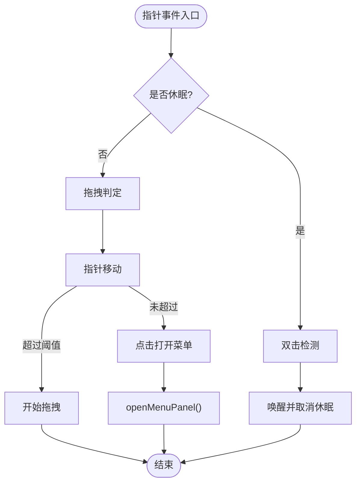
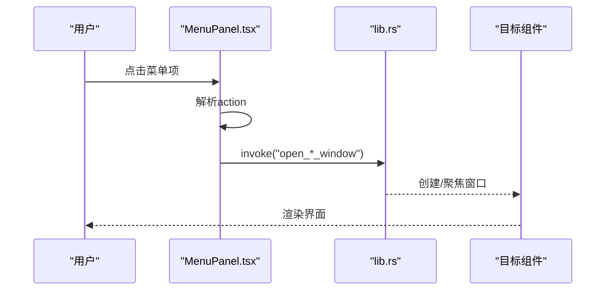
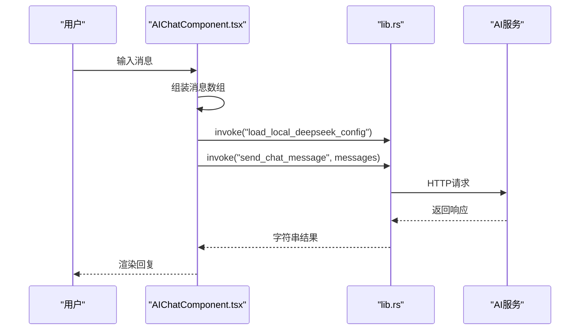
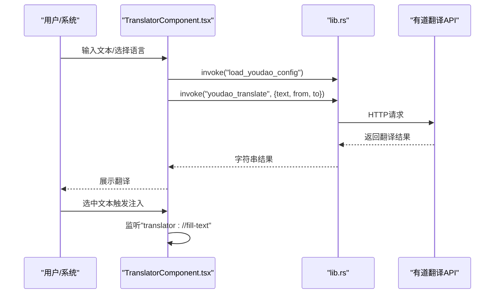
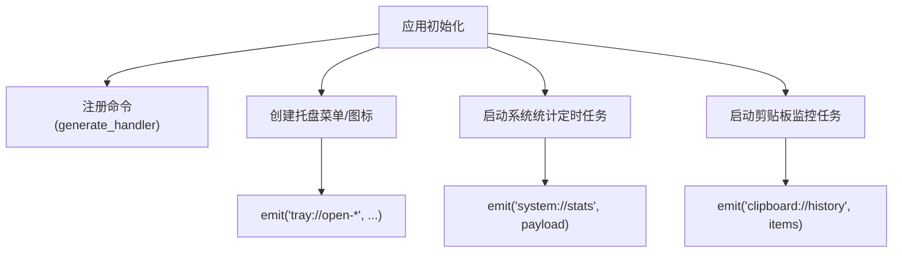
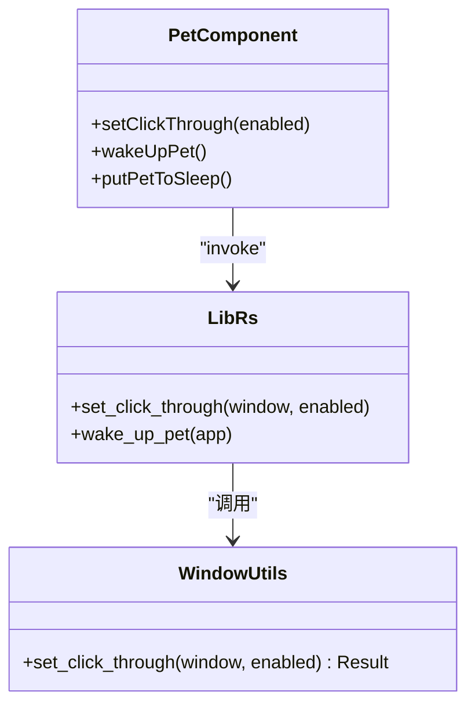

# 数据流设计

<cite>
**本文引用的文件**
- [README.md](file://README.md)
- [main.tsx](file://src/main.tsx)
- [App.tsx](file://src/App.tsx)
- [PetComponent.tsx](file://src/components/PetComponent.tsx)
- [MenuPanel.tsx](file://src/components/MenuPanel.tsx)
- [AIChatComponent.tsx](file://src/components/AIChatComponent.tsx)
- [TranslatorComponent.tsx](file://src/components/TranslatorComponent.tsx)
- [lib.rs](file://src-tauri/src/lib.rs)
- [main.rs](file://src-tauri/src/main.rs)
- [Cargo.toml](file://src-tauri/Cargo.toml)
- [clipboard.rs](file://src-tauri/src/clipboard.rs)
- [calendar.rs](file://src-tauri/src/calendar.rs)
- [window_utils.rs](file://src-tauri/src/window_utils.rs)
- [bubbles.json](file://public/config/bubbles.json)
</cite>

## 目录
1. [简介](#简介)
2. [项目结构](#项目结构)
3. [核心组件](#核心组件)
4. [架构总览](#架构总览)
5. [详细组件分析](#详细组件分析)
6. [依赖关系分析](#依赖关系分析)
7. [性能考量](#性能考量)
8. [故障排查指南](#故障排查指南)
9. [结论](#结论)
10. [附录](#附录)

## 简介
本文件面向XSUN桌面宠物项目的“数据流设计”，系统化梳理从用户交互到最终响应的完整数据通路，涵盖前端组件状态更新、Tauri命令调用、后端业务处理与前端响应渲染；解释鼠标、键盘、窗口事件的捕获与处理；阐述invoke命令与#[tauri::command]的双向数据传输；介绍异步数据处理模式、状态同步机制、数据验证与转换流程，以及性能优化策略。

## 项目结构
项目采用“前端React + TypeScript + Tauri 2后端”的分层架构：
- 前端层：src/components 下的功能组件、App.tsx路由选择、main.tsx入口
- 后端层：src-tauri/src 下的业务模块（lib.rs、clipboard.rs、calendar.rs、window_utils.rs），以及main.rs入口
- 配置与资源：public/config/bubbles.json菜单配置、src-tauri/Cargo.toml依赖声明

图表来源
- [main.tsx:1-10](file://src/main.tsx#L1-L10)
- [App.tsx:18-58](file://src/App.tsx#L18-L58)
- [PetComponent.tsx:19-745](file://src/components/PetComponent.tsx#L19-L745)
- [MenuPanel.tsx:14-259](file://src/components/MenuPanel.tsx#L14-L259)
- [AIChatComponent.tsx:23-160](file://src/components/AIChatComponent.tsx#L23-L160)
- [TranslatorComponent.tsx:49-130](file://src/components/TranslatorComponent.tsx#L49-L130)
- [lib.rs:941-1113](file://src-tauri/src/lib.rs#L941-L1113)
- [clipboard.rs:1-251](file://src-tauri/src/clipboard.rs#L1-L251)
- [calendar.rs:1-363](file://src-tauri/src/calendar.rs#L1-L363)
- [window_utils.rs:1-33](file://src-tauri/src/window_utils.rs#L1-L33)
- [main.rs:8-10](file://src-tauri/src/main.rs#L8-L10)
- [Cargo.toml:15-44](file://src-tauri/Cargo.toml#L15-L44)
- [bubbles.json:1-52](file://public/config/bubbles.json#L1-L52)

章节来源
- [README.md:129-169](file://README.md#L129-L169)
- [main.tsx:1-10](file://src/main.tsx#L1-L10)
- [App.tsx:18-58](file://src/App.tsx#L18-L58)
- [main.rs:8-10](file://src-tauri/src/main.rs#L8-L10)
- [Cargo.toml:15-44](file://src-tauri/Cargo.toml#L15-L44)

## 核心组件
- 桌宠主界面（PetComponent）：负责鼠标/指针事件、窗口穿透控制、菜单弹出、托盘事件监听与派发、窗口生命周期管理
- 功能菜单（MenuPanel）：读取bubbles.json配置，根据action映射创建/聚焦对应功能窗口
- AI对话（AIChatComponent）：配置检查、消息历史维护、调用后端send_chat_message
- 有道翻译（TranslatorComponent）：配置检查、批量翻译、监听外部注入文本事件
- 后端命令（lib.rs）：集中注册#[tauri::command]，发射系统/剪贴板/日历等事件，管理定时任务
- 剪贴板模块（clipboard.rs）：剪贴板历史、去重、容量限制、手动检查
- 日历模块（calendar.rs）：待办/事件/设置的读写与清理
- 窗口工具（window_utils.rs）：跨平台窗口穿透控制

章节来源
- [PetComponent.tsx:19-745](file://src/components/PetComponent.tsx#L19-L745)
- [MenuPanel.tsx:14-259](file://src/components/MenuPanel.tsx#L14-L259)
- [AIChatComponent.tsx:23-160](file://src/components/AIChatComponent.tsx#L23-L160)
- [TranslatorComponent.tsx:49-130](file://src/components/TranslatorComponent.tsx#L49-L130)
- [lib.rs:941-1113](file://src-tauri/src/lib.rs#L941-L1113)
- [clipboard.rs:1-251](file://src-tauri/src/clipboard.rs#L1-L251)
- [calendar.rs:1-363](file://src-tauri/src/calendar.rs#L1-L363)
- [window_utils.rs:1-33](file://src-tauri/src/window_utils.rs#L1-L33)

## 架构总览
下图展示从用户交互到后端处理再到前端渲染的端到端数据流：

图表来源
- [PetComponent.tsx:36-62](file://src/components/PetComponent.tsx#L36-L62)
- [MenuPanel.tsx:90-259](file://src/components/MenuPanel.tsx#L90-L259)
- [lib.rs:41-59](file://src-tauri/src/lib.rs#L41-L59)
- [lib.rs:949-996](file://src-tauri/src/lib.rs#L949-L996)
- [clipboard.rs:124-224](file://src-tauri/src/clipboard.rs#L124-L224)
- [calendar.rs:98-141](file://src-tauri/src/calendar.rs#L98-L141)
- [window_utils.rs:9-32](file://src-tauri/src/window_utils.rs#L9-L32)

## 详细组件分析

### 桌宠主界面（PetComponent）数据流
- 事件捕获与处理
  - 鼠标进入/离开：控制休眠与唤醒，设置延时休眠
  - 指针按下/移动/抬起：拖拽与菜单打开
  - 双击检测：休眠状态下通过透明覆盖层检测并唤醒
- 状态更新
  - isSleeping/isClickThrough：驱动UI样式与穿透行为
  - showBubbles：控制菜单气泡显示
- 命令调用
  - invoke("set_click_through", enabled)：切换穿透
  - invoke("wake_up_pet")：主动唤醒
- 事件监听
  - 监听"pet://wake-up"、托盘事件、全局选中文本事件，派发到对应窗口

图表来源
- [PetComponent.tsx:69-139](file://src/components/PetComponent.tsx#L69-L139)
- [PetComponent.tsx:156-202](file://src/components/PetComponent.tsx#L156-L202)

章节来源
- [PetComponent.tsx:19-745](file://src/components/PetComponent.tsx#L19-L745)

### 功能菜单（MenuPanel）数据流
- 配置来源：读取bubbles.json，动态渲染九宫格
- 行为映射：根据action调用对应窗口创建/聚焦逻辑
- 异步窗口管理：getAllWindows查询、WebviewWindow创建、超时等待、show/setFocus

图表来源
- [MenuPanel.tsx:14-259](file://src/components/MenuPanel.tsx#L14-L259)
- [bubbles.json:1-52](file://public/config/bubbles.json#L1-L52)

章节来源
- [MenuPanel.tsx:14-259](file://src/components/MenuPanel.tsx#L14-L259)
- [bubbles.json:1-52](file://public/config/bubbles.json#L1-L52)

### AI对话（AIChatComponent）数据流
- 配置检查：load_local_deepseek_config/load_deepseek_config
- 消息发送：收集历史消息，invoke("send_chat_message", messages)
- 错误处理：异常时插入错误消息，提示用户
- UI更新：滚动到底部、加载指示器、清空聊天

图表来源
- [AIChatComponent.tsx:55-135](file://src/components/AIChatComponent.tsx#L55-L135)
- [lib.rs:255-294](file://src-tauri/src/lib.rs#L255-L294)

章节来源
- [AIChatComponent.tsx:23-160](file://src/components/AIChatComponent.tsx#L23-L160)
- [lib.rs:255-294](file://src-tauri/src/lib.rs#L255-L294)

### 有道翻译（TranslatorComponent）数据流
- 配置检查：load_youdao_config
- 翻译执行：invoke("youdao_translate", {text, from, to})
- 批量翻译：多面板并发翻译
- 外部注入：监听"translator://fill-text"事件，注入选中文本

图表来源
- [TranslatorComponent.tsx:75-188](file://src/components/TranslatorComponent.tsx#L75-L188)
- [lib.rs:472-545](file://src-tauri/src/lib.rs#L472-L545)

章节来源
- [TranslatorComponent.tsx:49-130](file://src/components/TranslatorComponent.tsx#L49-L130)
- [lib.rs:472-545](file://src-tauri/src/lib.rs#L472-L545)

### 后端命令与事件发射
- 命令注册：generate_handler!集中注册所有#[tauri::command]函数
- 事件发射：系统统计、剪贴板历史、日历刷新等事件通过app.emit向前端推送
- 定时任务：系统信息采集、剪贴板监控（5秒间隔）、JIRA定时调度初始化

图表来源
- [lib.rs:949-996](file://src-tauri/src/lib.rs#L949-L996)
- [lib.rs:1039-1103](file://src-tauri/src/lib.rs#L1039-L1103)
- [lib.rs:800-869](file://src-tauri/src/lib.rs#L800-L869)

章节来源
- [lib.rs:941-1113](file://src-tauri/src/lib.rs#L941-L1113)

### 窗口穿透与状态同步
- 窗口穿透：set_click_through通过window_utils.rs在Windows使用扩展样式位，在其他平台使用忽略光标事件
- 状态同步：前端通过invoke同步后端状态（如系统信息、剪贴板历史），后端通过事件向前端推送实时数据

图表来源
- [window_utils.rs:9-32](file://src-tauri/src/window_utils.rs#L9-L32)
- [PetComponent.tsx:36-62](file://src/components/PetComponent.tsx#L36-L62)
- [lib.rs:48-59](file://src-tauri/src/lib.rs#L48-L59)

章节来源
- [window_utils.rs:1-33](file://src-tauri/src/window_utils.rs#L1-L33)
- [PetComponent.tsx:19-745](file://src/components/PetComponent.tsx#L19-L745)
- [lib.rs:41-59](file://src-tauri/src/lib.rs#L41-L59)

## 依赖关系分析
- 前端依赖
  - @tauri-apps/api：窗口、事件、invoke调用
  - 组件间通过App.tsx的窗口label路由到具体组件
- 后端依赖
  - tauri、reqwest、tokio、serde、sysinfo、git2等
  - 通过plugins（clipboard、fs、dialog、opener）扩展能力

图表来源
- [Cargo.toml:15-44](file://src-tauri/Cargo.toml#L15-L44)
- [lib.rs:942-947](file://src-tauri/src/lib.rs#L942-L947)

章节来源
- [Cargo.toml:15-44](file://src-tauri/Cargo.toml#L15-L44)
- [lib.rs:941-1113](file://src-tauri/src/lib.rs#L941-L1113)

## 性能考量
- 异步与并发
  - 后端使用tokio::time::interval定期采集系统信息与剪贴板监控，避免阻塞主线程
  - 剪贴板监控5秒一次，连续错误超过阈值后退避暂停，防止频繁失败影响性能
- 数据缓存与批处理
  - 剪贴板历史使用VecDeque，最多保留固定数量，避免无限增长
  - 批量翻译时按面板并发执行，减少用户等待时间
- 延迟加载与懒创建
  - 功能窗口按需创建，关闭即销毁，降低内存占用
  - 菜单窗口在点击时创建，避免常驻进程
- 序列化与网络
  - 使用serde_json进行配置与数据的序列化/反序列化，统一格式
  - HTTP请求使用reqwest，错误时返回可读信息，便于前端提示

章节来源
- [lib.rs:1039-1103](file://src-tauri/src/lib.rs#L1039-L1103)
- [clipboard.rs:29-122](file://src-tauri/src/clipboard.rs#L29-L122)
- [AIChatComponent.tsx:88-135](file://src/components/AIChatComponent.tsx#L88-L135)
- [TranslatorComponent.tsx:182-188](file://src/components/TranslatorComponent.tsx#L182-L188)

## 故障排查指南
- 剪贴板监控异常
  - 现象：连续报错后暂停
  - 处理：检查系统权限、内容长度限制、错误计数阈值
- 配置加载失败
  - 现象：AI/翻译组件提示需要配置
  - 处理：确认本地配置文件存在且格式正确，必要时重新保存
- 窗口创建超时
  - 现象：创建窗口时报超时
  - 处理：检查dev/prod URL、窗口参数、等待tauri://created事件
- 事件监听未生效
  - 现象：托盘/选中文本事件未触发
  - 处理：确认事件通道名称一致、监听在组件挂载时注册、卸载时解绑

章节来源
- [lib.rs:1078-1103](file://src-tauri/src/lib.rs#L1078-L1103)
- [PetComponent.tsx:156-202](file://src/components/PetComponent.tsx#L156-L202)
- [AIChatComponent.tsx:55-68](file://src/components/AIChatComponent.tsx#L55-L68)
- [TranslatorComponent.tsx:75-102](file://src/components/TranslatorComponent.tsx#L75-L102)

## 结论
XSUN桌面宠物项目通过清晰的前后端职责划分与Tauri命令机制，实现了稳定的数据流闭环。前端负责事件捕获与UI渲染，后端负责系统能力与业务逻辑，并通过事件与invoke双向通信实现状态同步与实时反馈。通过异步任务、缓存与懒加载等策略，系统在功能丰富的同时保持了较好的性能与稳定性。

## 附录
- 关键命令一览
  - 系统信息：get_system_info
  - 窗口穿透：set_click_through
  - 唤醒桌宠：wake_up_pet
  - 剪贴板：get_clipboard_history/add_to_clipboard_history/copy_to_clipboard/get_current_clipboard/clear_clipboard_history/manual_clipboard_check
  - AI对话：send_chat_message/save_deepseek_config/load_deepseek_config/load_local_deepseek_config
  - 有道翻译：youdao_translate/save_youdao_config/load_youdao_config
  - 日历：get_todos_for_date/save_todos_for_date/open_todo_window/save_calendar_settings/load_calendar_settings/upload_background_image/delete_background_image/refresh_calendar_data
  - 托盘：show_from_tray/hide_to_tray
  - 番茄钟：show_pomodoro_notification/close_pomodoro_notification
  - 其他：open_expand_window/open_translator_with_text/open_json_compare_with_text/open_url_in_browser

章节来源
- [lib.rs:949-996](file://src-tauri/src/lib.rs#L949-L996)