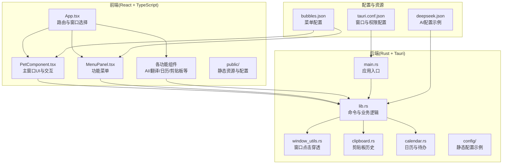
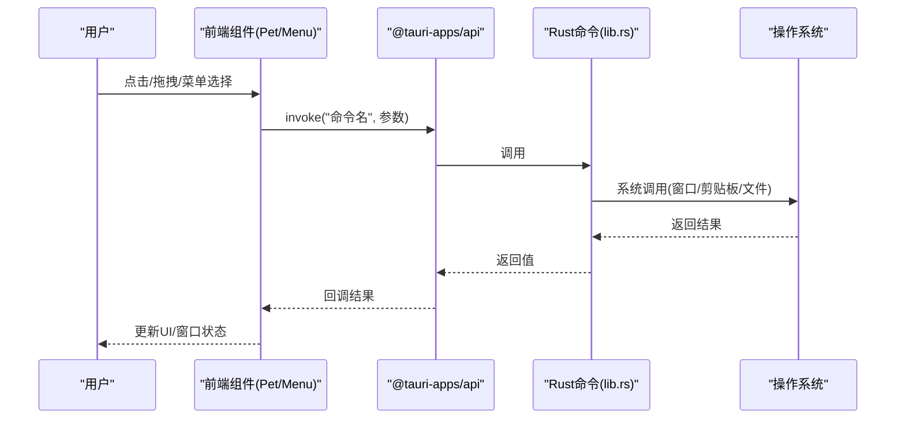
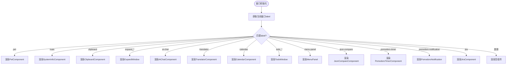
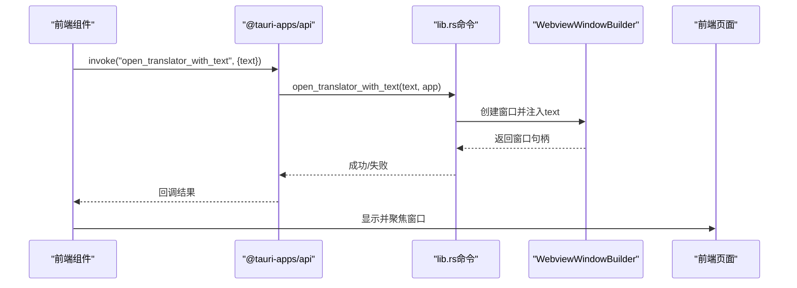
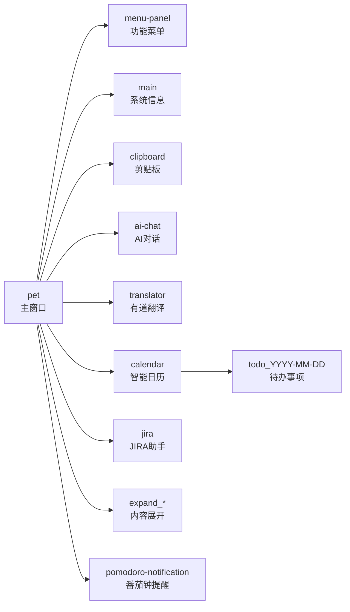
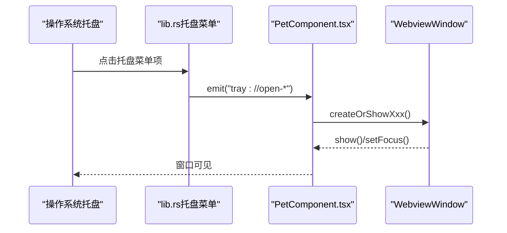
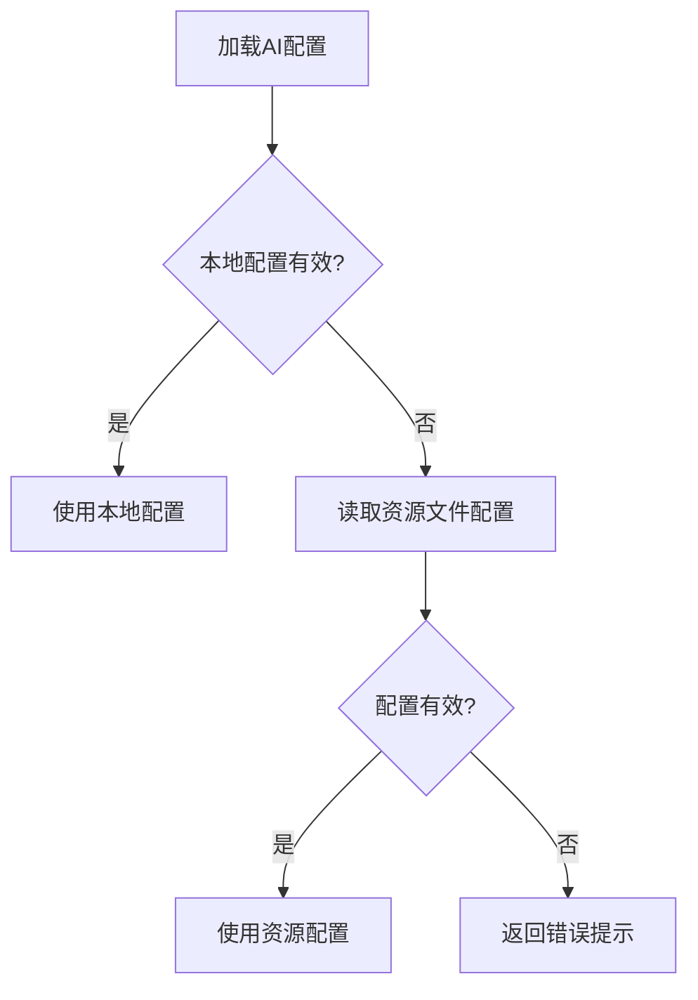
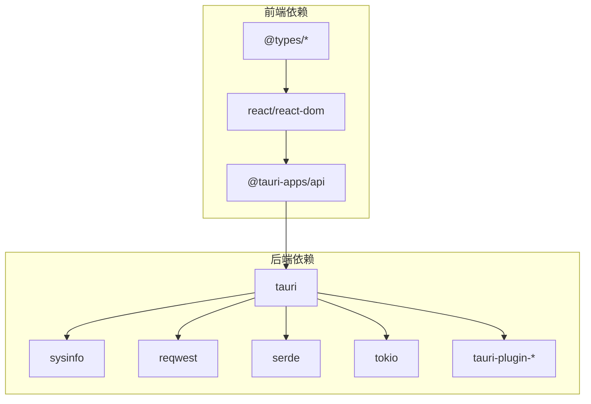

# 整体架构概览

<cite>
**本文档引用的文件**
- [README.md](file://README.md)
- [package.json](file://package.json)
- [src-tauri/Cargo.toml](file://src-tauri/Cargo.toml)
- [src/main.tsx](file://src/main.tsx)
- [src/App.tsx](file://src/App.tsx)
- [src-tauri/tauri.conf.json](file://src-tauri/tauri.conf.json)
- [src-tauri/src/lib.rs](file://src-tauri/src/lib.rs)
- [src-tauri/src/main.rs](file://src-tauri/src/main.rs)
- [src-tauri/src/window_utils.rs](file://src-tauri/src/window_utils.rs)
- [src-tauri/src/clipboard.rs](file://src-tauri/src/clipboard.rs)
- [src-tauri/src/calendar.rs](file://src-tauri/src/calendar.rs)
- [public/config/bubbles.json](file://public/config/bubbles.json)
- [src-tauri/config/deepseek.json](file://src-tauri/config/deepseek.json)
- [src/components/PetComponent.tsx](file://src/components/PetComponent.tsx)
- [src/components/MenuPanel.tsx](file://src/components/MenuPanel.tsx)
</cite>

## 目录
1. [简介](#简介)
2. [项目结构](#项目结构)
3. [核心组件](#核心组件)
4. [架构总览](#架构总览)
5. [详细组件分析](#详细组件分析)
6. [依赖关系分析](#依赖关系分析)
7. [性能考虑](#性能考虑)
8. [故障排除指南](#故障排除指南)
9. [结论](#结论)

## 简介
XSUN桌面宠物是一个基于 React + TypeScript 前端与 Rust + Tauri 2 后端的跨平台桌面应用，提供多种实用工具与娱乐功能。项目采用前后端分离架构，通过 Tauri 的 Webview 与系统能力桥接，实现 Web 技术与原生应用的无缝结合。核心设计理念包括：
- 前端负责用户交互与界面渲染，后端负责系统级功能与业务逻辑。
- 多窗口架构：主桌宠窗口常驻，功能窗口按需创建与销毁，菜单窗口临时弹出。
- 托盘集成：提供系统托盘图标、菜单与事件处理，支持显示/隐藏与快速启动功能。
- 配置管理：静态资源配置与动态配置存储分离，兼顾灵活性与易用性。

## 项目结构
项目采用典型的“前端 + 后端(src-tauri)”分层组织，前端使用 Vite + React + TypeScript，后端使用 Rust + Tauri，通过命令调用实现前后端通信。

**图表来源**
- [src/App.tsx:17-55](file://src/App.tsx#L17-L55)
- [src-tauri/src/main.rs:8-10](file://src-tauri/src/main.rs#L8-L10)
- [src-tauri/src/lib.rs:12-32](file://src-tauri/src/lib.rs#L12-L32)
- [src-tauri/tauri.conf.json:13-51](file://src-tauri/tauri.conf.json#L13-L51)

**章节来源**
- [README.md:129-181](file://README.md#L129-L181)
- [package.json:1-29](file://package.json#L1-L29)
- [src-tauri/Cargo.toml:1-44](file://src-tauri/Cargo.toml#L1-L44)

## 核心组件
- 前端应用入口与路由：App.tsx 根据窗口 label 动态渲染不同组件，实现多窗口统一入口。
- 主窗口组件：PetComponent.tsx 负责桌宠 UI、拖拽、点击穿透控制、菜单弹出与托盘事件监听。
- 功能菜单：MenuPanel.tsx 读取静态菜单配置，动态创建并管理功能窗口。
- 后端命令与业务：lib.rs 定义系统信息、窗口管理、AI/翻译、日历/剪贴板等命令，并提供托盘菜单构建。
- 窗口工具：window_utils.rs 提供跨平台点击穿透实现。
- 配置与资源：bubbles.json 与 deepseek.json 提供静态配置；应用数据目录用于动态配置持久化。

**章节来源**
- [src/App.tsx:17-55](file://src/App.tsx#L17-L55)
- [src/components/PetComponent.tsx:19-749](file://src/components/PetComponent.tsx#L19-L749)
- [src/components/MenuPanel.tsx:14-295](file://src/components/MenuPanel.tsx#L14-L295)
- [src-tauri/src/lib.rs:41-800](file://src-tauri/src/lib.rs#L41-L800)
- [src-tauri/src/window_utils.rs:9-32](file://src-tauri/src/window_utils.rs#L9-L32)
- [public/config/bubbles.json:1-52](file://public/config/bubbles.json#L1-L52)
- [src-tauri/config/deepseek.json:1-6](file://src-tauri/config/deepseek.json#L1-L6)

## 架构总览
Tauri 作为桥接层，将前端 Web 技术与操作系统能力连接起来。前端通过 @tauri-apps/api 的 invoke 调用后端命令，后端通过 tauri::command 注解暴露函数，实现类型安全的 IPC。窗口管理由后端统一调度，前端负责 UI 与事件绑定。

**图表来源**
- [src-tauri/src/lib.rs:41-112](file://src-tauri/src/lib.rs#L41-L112)
- [src-tauri/src/lib.rs:257-296](file://src-tauri/src/lib.rs#L257-L296)
- [src-tauri/src/lib.rs:474-547](file://src-tauri/src/lib.rs#L474-L547)

**章节来源**
- [README.md:170-176](file://README.md#L170-L176)
- [src-tauri/src/lib.rs:12-32](file://src-tauri/src/lib.rs#L12-L32)

## 详细组件分析

### 前端架构与窗口标签系统
- App.tsx 根据窗口 label 切换渲染组件，支持 pet、main、clipboard、expand_*、ai-chat、translator、calendar、todo_*、menu-panel、json-compare、pomodoro-timer、pomodoro-notification、jira 等标签。
- PetComponent.tsx 负责主窗口交互：拖拽、点击穿透、休眠/活跃状态切换、菜单弹出与托盘事件监听。
- MenuPanel.tsx 读取 bubbles.json，动态创建功能窗口，统一管理窗口生命周期。

**图表来源**
- [src/App.tsx:17-55](file://src/App.tsx#L17-L55)

**章节来源**
- [src/App.tsx:17-55](file://src/App.tsx#L17-L55)
- [src/components/PetComponent.tsx:19-749](file://src/components/PetComponent.tsx#L19-L749)
- [src/components/MenuPanel.tsx:14-295](file://src/components/MenuPanel.tsx#L14-L295)

### 后端命令与窗口管理
- 系统信息与窗口控制：get_system_info、set_click_through、wake_up_pet 等命令实现系统监控与窗口交互。
- 窗口创建与注入：open_expand_window、open_translator_with_text、open_json_compare_with_text、open_todo_window 等命令按需创建窗口并注入初始数据。
- 托盘菜单：create_tray_menu 构建托盘菜单项，支持显示/隐藏、功能窗口快速启动与退出。

**图表来源**
- [src-tauri/src/lib.rs:115-162](file://src-tauri/src/lib.rs#L115-L162)
- [src-tauri/src/lib.rs:774-799](file://src-tauri/src/lib.rs#L774-L799)

**章节来源**
- [src-tauri/src/lib.rs:41-112](file://src-tauri/src/lib.rs#L41-L112)
- [src-tauri/src/lib.rs:115-211](file://src-tauri/src/lib.rs#L115-L211)
- [src-tauri/src/lib.rs:774-799](file://src-tauri/src/lib.rs#L774-L799)

### 窗口标签系统设计
- 主窗口：pet（常驻，始终存在）
- 功能窗口：按需创建，如 main、clipboard、ai-chat、translator、calendar、jira 等
- 菜单窗口：menu-panel（临时弹出）
- 扩展窗口：expand_*（唯一标签，用于内容编辑）
- 待办窗口：todo_日期（按日期唯一标签）
- 通知窗口：pomodoro-notification（透明、置顶、居中）

**图表来源**
- [src-tauri/tauri.conf.json:13-42](file://src-tauri/tauri.conf.json#L13-L42)
- [src-tauri/src/lib.rs:636-671](file://src-tauri/src/lib.rs#L636-L671)

**章节来源**
- [README.md:193-205](file://README.md#L193-L205)
- [src-tauri/tauri.conf.json:13-42](file://src-tauri/tauri.conf.json#L13-L42)

### 系统托盘集成
- 托盘图标与菜单：通过 create_tray_menu 构建菜单项，包含显示/隐藏、功能窗口入口与退出。
- 事件处理：前端监听 tray://* 事件，实现托盘菜单点击与主窗口交互。
- 状态同步：wake_up_pet 与 set_click_through 协同实现主窗口休眠/唤醒。

**图表来源**
- [src-tauri/src/lib.rs:774-799](file://src-tauri/src/lib.rs#L774-L799)
- [src/components/PetComponent.tsx:161-194](file://src/components/PetComponent.tsx#L161-L194)

**章节来源**
- [README.md:216-229](file://README.md#L216-L229)
- [src-tauri/src/lib.rs:774-799](file://src-tauri/src/lib.rs#L774-L799)

### 配置管理架构
- 静态配置：bubbles.json 定义菜单项与动作；deepseek.json 提供 AI 配置示例；tauri.conf.json 定义窗口与权限。
- 动态配置：应用数据目录用于保存用户配置与数据，如 deepseek_config.json、youdao_config.json、todos.json、calendar_settings.json 等。
- 优先级策略：load_deepseek_config 优先使用本地配置，其次回退到资源文件配置。

**图表来源**
- [src-tauri/src/lib.rs:352-381](file://src-tauri/src/lib.rs#L352-L381)
- [src-tauri/config/deepseek.json:1-6](file://src-tauri/config/deepseek.json#L1-L6)

**章节来源**
- [README.md:177-181](file://README.md#L177-L181)
- [src-tauri/src/lib.rs:298-350](file://src-tauri/src/lib.rs#L298-L350)
- [src-tauri/src/lib.rs:423-457](file://src-tauri/src/lib.rs#L423-L457)
- [src-tauri/src/lib.rs:674-720](file://src-tauri/src/lib.rs#L674-L720)

### 数据持久化策略
- 剪贴板历史：内存存储，应用重启丢失（clipboard.rs）。
- AI/翻译配置：用户应用数据目录下的 JSON 文件（deepseek_config.json、youdao_config.json）。
- 日历数据：todos.json、calendar_settings.json、background_images 目录。
- 窗口状态：由 Tauri 管理，窗口关闭即销毁实例。

**章节来源**
- [README.md:206-215](file://README.md#L206-L215)
- [src-tauri/src/clipboard.rs:14-122](file://src-tauri/src/clipboard.rs#L14-L122)
- [src-tauri/src/lib.rs:574-720](file://src-tauri/src/lib.rs#L574-L720)

## 依赖关系分析
- 前端依赖：@tauri-apps/api 提供窗口、命令调用与事件监听；React 生态提供 UI 组件。
- 后端依赖：tauri 提供窗口与托盘能力；sysinfo、reqwest、serde 等提供系统信息、网络与序列化；tokio 提供异步运行时。
- 构建与打包：Vite + TypeScript 前端构建；Tauri CLI + Cargo 后端构建与打包。

**图表来源**
- [package.json:12-27](file://package.json#L12-L27)
- [src-tauri/Cargo.toml:15-36](file://src-tauri/Cargo.toml#L15-L36)

**章节来源**
- [package.json:12-27](file://package.json#L12-L27)
- [src-tauri/Cargo.toml:15-36](file://src-tauri/Cargo.toml#L15-L36)

## 性能考虑
- 异步 I/O：后端大量使用 tokio 异步文件与网络操作，避免阻塞主线程。
- 窗口复用：窗口存在则复用，减少创建/销毁开销；窗口关闭即销毁，避免资源泄漏。
- 点击穿透：window_utils.rs 提供跨平台点击穿透，减少不必要的事件拦截。
- 配置缓存：本地配置优先，减少资源文件读取次数；必要时进行校验与降级。

## 故障排除指南
- 窗口创建超时：前端在创建窗口时设置了超时与错误回调，检查 tauri://created 与 tauri://error 事件。
- 剪贴板异常：clipboard.rs 对内容长度与重复内容做了限制与去重，注意日志输出定位问题。
- 托盘事件未响应：确认托盘菜单项 ID 与前端监听事件一致，检查 emit 与监听的命名空间。
- 配置加载失败：检查应用数据目录权限与文件存在性，优先使用本地配置，必要时回退资源文件。

**章节来源**
- [src/components/PetComponent.tsx:254-279](file://src/components/PetComponent.tsx#L254-L279)
- [src-tauri/src/clipboard.rs:84-122](file://src-tauri/src/clipboard.rs#L84-L122)
- [src-tauri/src/lib.rs:352-381](file://src-tauri/src/lib.rs#L352-L381)

## 结论
XSUN桌面宠物通过 React + Tauri 的组合实现了高性能、可扩展的桌面应用。前端专注于用户体验与界面，后端提供系统级能力与业务逻辑，两者通过命令调用与事件机制紧密协作。多窗口与托盘集成提升了可用性，静态与动态配置分离兼顾了灵活性与稳定性。该架构为后续功能扩展提供了清晰的边界与可维护性。