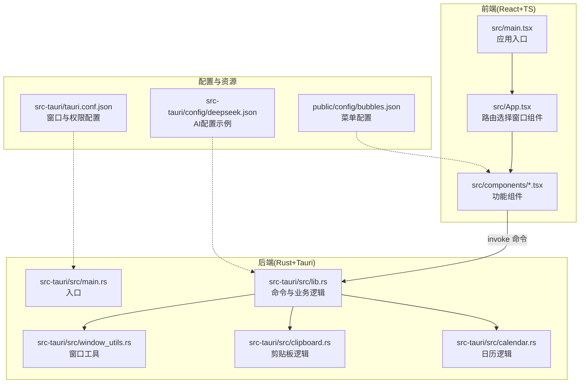
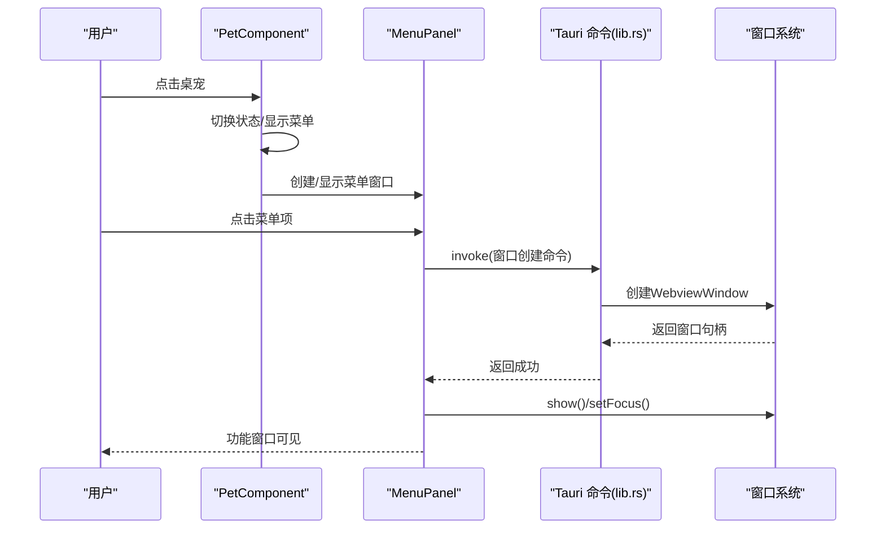
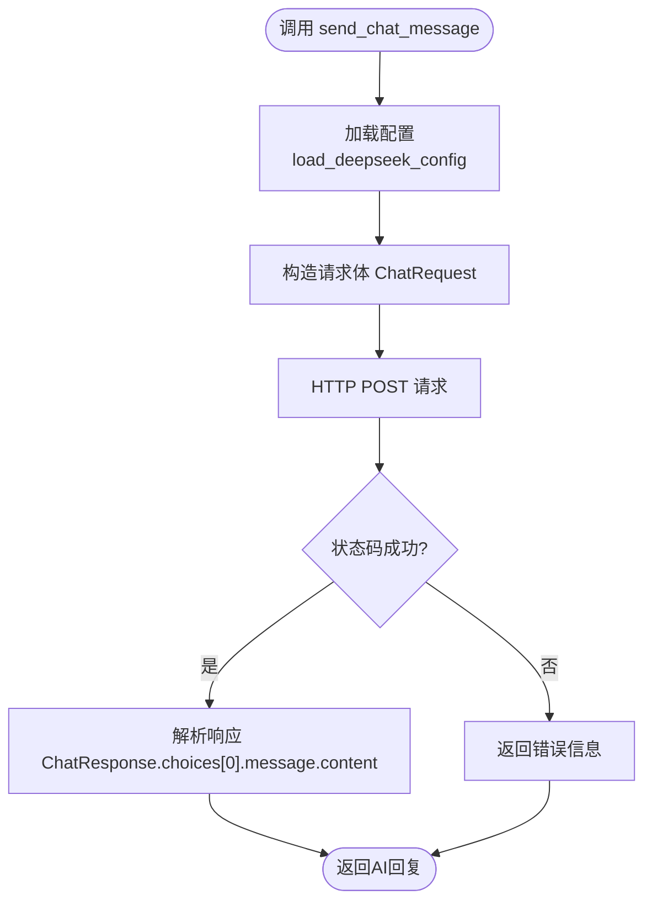
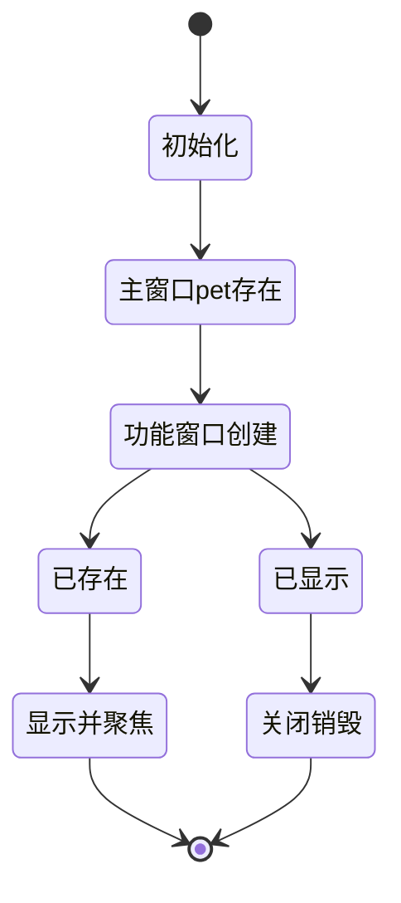
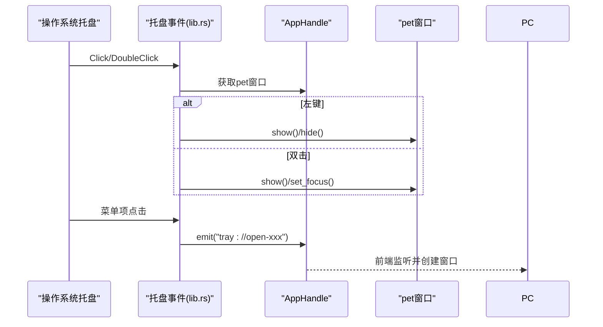
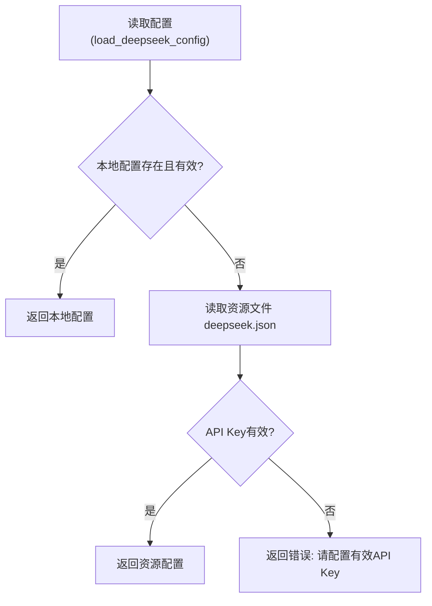
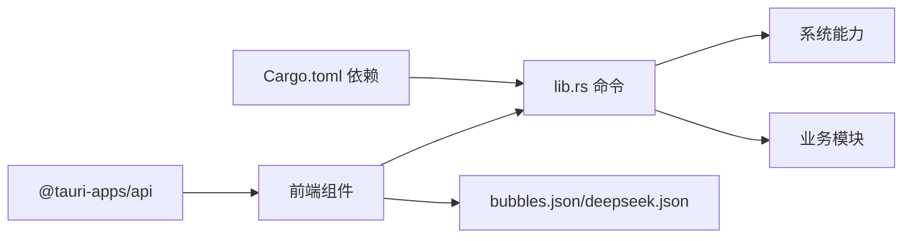

# 架构设计

<cite>
**本文引用的文件**
- [README.md](file://README.md)
- [package.json](file://package.json)
- [src-tauri/Cargo.toml](file://src-tauri/Cargo.toml)
- [src/main.tsx](file://src/main.tsx)
- [src/App.tsx](file://src/App.tsx)
- [src-tauri/tauri.conf.json](file://src-tauri/tauri.conf.json)
- [public/config/bubbles.json](file://public/config/bubbles.json)
- [src-tauri/config/deepseek.json](file://src-tauri/config/deepseek.json)
- [src-tauri/src/lib.rs](file://src-tauri/src/lib.rs)
- [src-tauri/src/main.rs](file://src-tauri/src/main.rs)
- [src-tauri/src/window_utils.rs](file://src-tauri/src/window_utils.rs)
- [src-tauri/src/clipboard.rs](file://src-tauri/src/clipboard.rs)
- [src-tauri/src/calendar.rs](file://src-tauri/src/calendar.rs)
- [src/components/PetComponent.tsx](file://src/components/PetComponent.tsx)
- [src/components/MenuPanel.tsx](file://src/components/MenuPanel.tsx)
</cite>

## 目录
1. [引言](#引言)
2. [项目结构](#项目结构)
3. [核心组件](#核心组件)
4. [架构总览](#架构总览)
5. [详细组件分析](#详细组件分析)
6. [依赖关系分析](#依赖关系分析)
7. [性能考虑](#性能考虑)
8. [故障排查指南](#故障排查指南)
9. [结论](#结论)
10. [附录](#附录)

## 引言
本项目为 XSUN 桌面宠物，采用前后端分离架构：前端使用 React + TypeScript，后端使用 Rust（通过 Tauri 2）。Tauri 将 Web 技术与原生应用能力结合，既保证了跨平台与开发效率，又提供了系统级功能（如托盘、窗口管理、剪贴板、文件系统等）。本文档系统梳理整体架构、数据流、多窗口与托盘集成、配置管理、组件通信与依赖关系，并给出性能与故障排查建议。

## 项目结构
项目采用“前端 + 后端（Rust）”分层组织，前端组件按功能模块拆分，后端通过 Tauri 暴露命令给前端调用；静态资源配置于 public 与 src-tauri/config 目录。



图表来源
- [src/main.tsx:1-10](file://src/main.tsx#L1-L10)
- [src/App.tsx:1-57](file://src/App.tsx#L1-L57)
- [src-tauri/src/main.rs:1-11](file://src-tauri/src/main.rs#L1-L11)
- [src-tauri/src/lib.rs:1-800](file://src-tauri/src/lib.rs#L1-L800)
- [src-tauri/src/window_utils.rs:1-33](file://src-tauri/src/window_utils.rs#L1-L33)
- [src-tauri/src/clipboard.rs:1-251](file://src-tauri/src/clipboard.rs#L1-L251)
- [src-tauri/src/calendar.rs:1-363](file://src-tauri/src/calendar.rs#L1-L363)
- [public/config/bubbles.json:1-52](file://public/config/bubbles.json#L1-L52)
- [src-tauri/config/deepseek.json:1-6](file://src-tauri/config/deepseek.json#L1-L6)
- [src-tauri/tauri.conf.json:1-74](file://src-tauri/tauri.conf.json#L1-L74)

章节来源
- [README.md:129-247](file://README.md#L129-L247)
- [package.json:1-29](file://package.json#L1-L29)
- [src-tauri/Cargo.toml:1-43](file://src-tauri/Cargo.toml#L1-L43)
- [src-tauri/tauri.conf.json:1-74](file://src-tauri/tauri.conf.json#L1-L74)

## 核心组件
- 前端应用入口与路由：React 应用通过 App 组件根据当前窗口 label 动态渲染不同功能组件。
- 桌宠主窗口与菜单：PetComponent 负责拖拽、休眠/活跃状态切换、点击打开菜单；MenuPanel 提供九宫格菜单并创建对应功能窗口。
- 后端命令与业务：lib.rs 定义系统信息、窗口控制、托盘事件、AI/翻译、日历/剪贴板等命令；window_utils 提供跨平台点击穿透；clipboard 与 calendar 提供数据持久化与业务逻辑。
- 配置与资源：bubbles.json 控制菜单项；deepseek.json 为示例 AI 配置；tauri.conf.json 管理窗口与权限。

章节来源
- [src/App.tsx:17-55](file://src/App.tsx#L17-L55)
- [src/components/PetComponent.tsx:19-749](file://src/components/PetComponent.tsx#L19-L749)
- [src/components/MenuPanel.tsx:14-295](file://src/components/MenuPanel.tsx#L14-L295)
- [src-tauri/src/lib.rs:38-778](file://src-tauri/src/lib.rs#L38-L778)
- [src-tauri/src/window_utils.rs:9-32](file://src-tauri/src/window_utils.rs#L9-L32)
- [src-tauri/src/clipboard.rs:124-224](file://src-tauri/src/clipboard.rs#L124-L224)
- [src-tauri/src/calendar.rs:462-462](file://src-tauri/src/calendar.rs#L462-L462)

## 架构总览
整体采用“前端组件 + Tauri 命令 + Rust 后端”的分层架构。前端负责 UI 与交互，后端负责系统能力与业务逻辑，二者通过 Tauri 的 invoke/emit 机制通信。

```mermaid
graph TB
FE["前端组件<br/>PetComponent/MenuPanel 等"] --> CMD["Tauri 命令<br/>lib.rs 中 #[tauri::command]"]
CMD --> SYS["系统能力<br/>窗口/托盘/文件系统/网络"]
CMD --> BUS["业务逻辑<br/>AI/翻译/日历/剪贴板"]
FE < --> "事件监听<br/>listen(...)" --> FE
SYS --> FE
BUS --> FE
```

图表来源
- [src-tauri/src/lib.rs:38-778](file://src-tauri/src/lib.rs#L38-L778)
- [src/components/PetComponent.tsx:156-196](file://src/components/PetComponent.tsx#L156-L196)
- [src/components/MenuPanel.tsx:8-88](file://src/components/MenuPanel.tsx#L8-L88)

## 详细组件分析

### 前端：PetComponent 与 MenuPanel
- PetComponent
  - 状态机：活跃/休眠，点击穿透；鼠标进入唤醒、离开延时休眠；双击休眠态唤醒。
  - 事件：拖拽移动、点击打开菜单；监听后端“pet://wake-up”事件；响应托盘事件。
  - 窗口管理：按需创建/显示/聚焦功能窗口；支持超时等待与错误处理。
- MenuPanel
  - 读取 bubbles.json，渲染九宫格菜单；点击后创建对应窗口并显示；支持点击外部关闭。



图表来源
- [src/components/PetComponent.tsx:580-640](file://src/components/PetComponent.tsx#L580-L640)
- [src/components/MenuPanel.tsx:45-88](file://src/components/MenuPanel.tsx#L45-L88)
- [src-tauri/src/lib.rs:762-778](file://src-tauri/src/lib.rs#L762-L778)

章节来源
- [src/components/PetComponent.tsx:19-749](file://src/components/PetComponent.tsx#L19-L749)
- [src/components/MenuPanel.tsx:14-295](file://src/components/MenuPanel.tsx#L14-L295)

### 后端：命令与业务逻辑
- 系统信息与窗口控制：提供 get_system_info、set_click_through、wake_up_pet 等命令，配合 window_utils 实现跨平台点击穿透。
- 托盘集成：创建托盘菜单与事件处理，左键显示/隐藏主窗口，右键弹出菜单；支持双击显示。
- AI/翻译：封装 DeepSeek 与有道翻译 API 请求，支持本地配置优先加载。
- 日历/剪贴板：提供待办/事件/设置的读写、背景图上传/删除、剪贴板历史管理与去重。



图表来源
- [src-tauri/src/lib.rs:147-186](file://src-tauri/src/lib.rs#L147-L186)
- [src-tauri/src/lib.rs:243-271](file://src-tauri/src/lib.rs#L243-L271)

章节来源
- [src-tauri/src/lib.rs:38-778](file://src-tauri/src/lib.rs#L38-L778)
- [src-tauri/src/window_utils.rs:9-32](file://src-tauri/src/window_utils.rs#L9-L32)
- [src-tauri/src/clipboard.rs:124-224](file://src-tauri/src/clipboard.rs#L124-L224)
- [src-tauri/src/calendar.rs:462-462](file://src-tauri/src/calendar.rs#L462-L462)

### 多窗口架构与生命周期
- 主窗口 pet：始终存在，常驻顶层，支持透明/无装饰/点击穿透。
- 功能窗口：按需创建，label 唯一；若已存在则 show/setFocus；关闭即销毁。
- 菜单窗口 menu-panel：点击桌宠时临时创建，点击外部区域或选择菜单项后关闭。
- 通知窗口 pomodoro-notification：透明、居中、不可见，默认 alwaysOnTop。



图表来源
- [src-tauri/tauri.conf.json:13-42](file://src-tauri/tauri.conf.json#L13-L42)
- [src-tauri/src/lib.rs:762-778](file://src-tauri/src/lib.rs#L762-L778)
- [src/components/PetComponent.tsx:282-340](file://src/components/PetComponent.tsx#L282-L340)

章节来源
- [src-tauri/tauri.conf.json:13-42](file://src-tauri/tauri.conf.json#L13-L42)
- [src/components/PetComponent.tsx:224-567](file://src/components/PetComponent.tsx#L224-L567)

### 系统托盘集成
- 托盘菜单：包含“显示桌宠、剪贴板、系统信息、AI对话、有道翻译、日历、退出”等项。
- 事件处理：左键显示/隐藏主窗口；双击显示；菜单项通过 emit 触发前端创建对应窗口。
- 生命周期：托盘图标随应用启动创建，退出时销毁。



图表来源
- [src-tauri/src/lib.rs:691-760](file://src-tauri/src/lib.rs#L691-L760)
- [src/components/PetComponent.tsx:161-184](file://src/components/PetComponent.tsx#L161-L184)

章节来源
- [src-tauri/src/lib.rs:662-760](file://src-tauri/src/lib.rs#L662-L760)
- [src/components/PetComponent.tsx:161-196](file://src/components/PetComponent.tsx#L161-L196)

### 配置管理架构
- 静态配置：bubbles.json 定义菜单项；deepseek.json 为示例 AI 配置。
- 动态配置：后端优先读取用户应用数据目录中的本地配置（如 deepseek_config.json、youdao_config.json、todos.json、calendar_settings.json），若不存在则回退到资源文件。
- 读写策略：异步文件读写，序列化/反序列化，错误统一处理并返回字符串。



图表来源
- [src-tauri/src/lib.rs:243-271](file://src-tauri/src/lib.rs#L243-L271)
- [src-tauri/config/deepseek.json:1-6](file://src-tauri/config/deepseek.json#L1-L6)

章节来源
- [public/config/bubbles.json:1-52](file://public/config/bubbles.json#L1-L52)
- [src-tauri/src/lib.rs:203-240](file://src-tauri/src/lib.rs#L203-L240)
- [src-tauri/src/lib.rs:312-346](file://src-tauri/src/lib.rs#L312-L346)
- [src-tauri/src/lib.rs:462-609](file://src-tauri/src/lib.rs#L462-L609)

## 依赖关系分析
- 前端依赖：@tauri-apps/api 提供 window/invoke/listen；各功能组件按需引入。
- 后端依赖：tauri、sysinfo、reqwest、serde、tokio、uuid、git2 等；插件包括 fs、dialog、opener、clipboard-manager。
- 配置与资源：public 与 src-tauri/config 下的 JSON 文件作为静态/示例配置。



图表来源
- [package.json:12-27](file://package.json#L12-L27)
- [src-tauri/Cargo.toml:15-43](file://src-tauri/Cargo.toml#L15-L43)
- [src-tauri/src/lib.rs:1-30](file://src-tauri/src/lib.rs#L1-L30)
- [public/config/bubbles.json:1-52](file://public/config/bubbles.json#L1-L52)
- [src-tauri/config/deepseek.json:1-6](file://src-tauri/config/deepseek.json#L1-L6)

章节来源
- [package.json:12-27](file://package.json#L12-L27)
- [src-tauri/Cargo.toml:15-43](file://src-tauri/Cargo.toml#L15-L43)

## 性能考虑
- 前端
  - 窗口创建采用超时等待与错误回调，避免阻塞主线程。
  - 桌宠休眠减少渲染与事件开销；点击穿透避免误触。
- 后端
  - 异步文件读写与网络请求，避免阻塞主线程；合理限制剪贴板内容长度与历史数量。
  - 窗口管理按需创建/销毁，减少内存占用。
- 配置
  - 本地配置优先，减少资源文件 IO；配置变更后及时序列化。

## 故障排查指南
- 窗口创建失败
  - 检查 tauri://created/tauri://error 事件是否触发；确认 devUrl/prodUrl 与 tauri.conf.json 配置一致。
- 托盘事件无效
  - 确认托盘菜单创建与事件绑定；检查 emit 的事件名与前端监听一致。
- 配置加载异常
  - 本地配置为空或 API Key 无效时回退至资源文件；检查应用数据目录权限与文件存在性。
- 剪贴板历史异常
  - 检查内容长度限制与重复过滤；确认 clipboard-manager 插件可用。

章节来源
- [src/components/PetComponent.tsx:254-278](file://src/components/PetComponent.tsx#L254-L278)
- [src-tauri/src/lib.rs:243-271](file://src-tauri/src/lib.rs#L243-L271)
- [src-tauri/src/clipboard.rs:29-122](file://src-tauri/src/clipboard.rs#L29-L122)

## 结论
本项目通过 React + Tauri 的组合实现了高性能、跨平台的桌面应用。前端负责交互与 UI，后端提供系统能力与业务逻辑，两者通过命令与事件解耦协作。多窗口与托盘集成提升了用户体验；配置管理兼顾灵活性与易用性。后续可在窗口复用策略、缓存与事件总线优化方面进一步完善。

## 附录
- 开发与构建
  - 开发：npm run tauri dev
  - 生产：cargo tauri build
- 新功能扩展步骤
  - 在 bubbles.json 添加菜单项
  - 创建前端组件
  - 在 lib.rs 添加命令
  - 在 MenuPanel 或 PetComponent 中接入窗口创建逻辑
  - 在 PetComponent 中处理托盘菜单事件

章节来源
- [README.md:249-268](file://README.md#L249-L268)