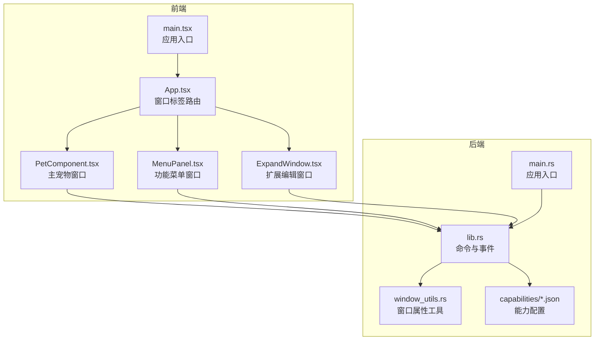
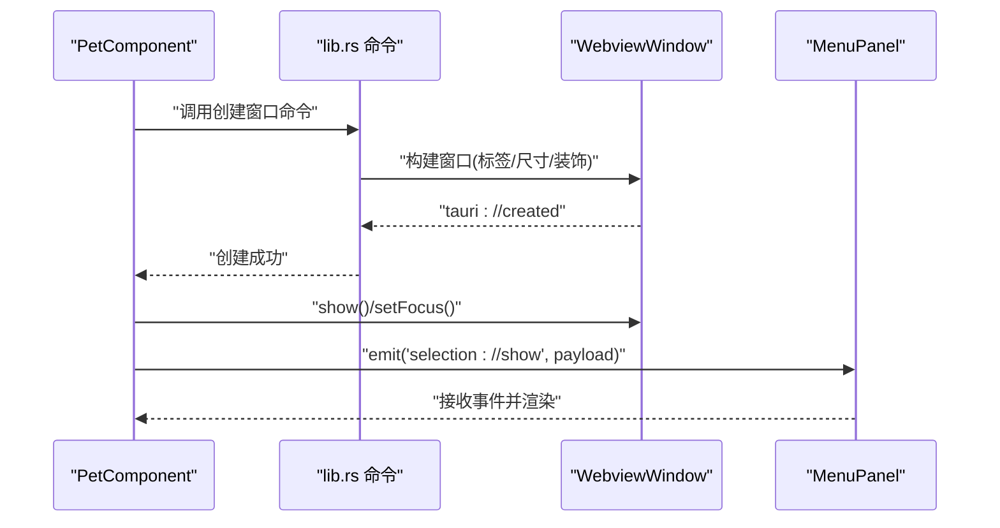
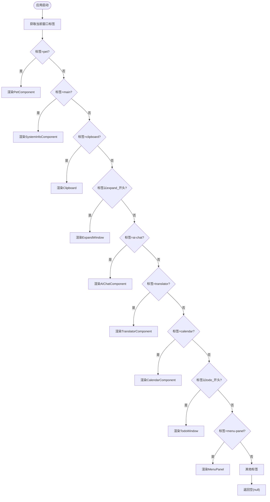
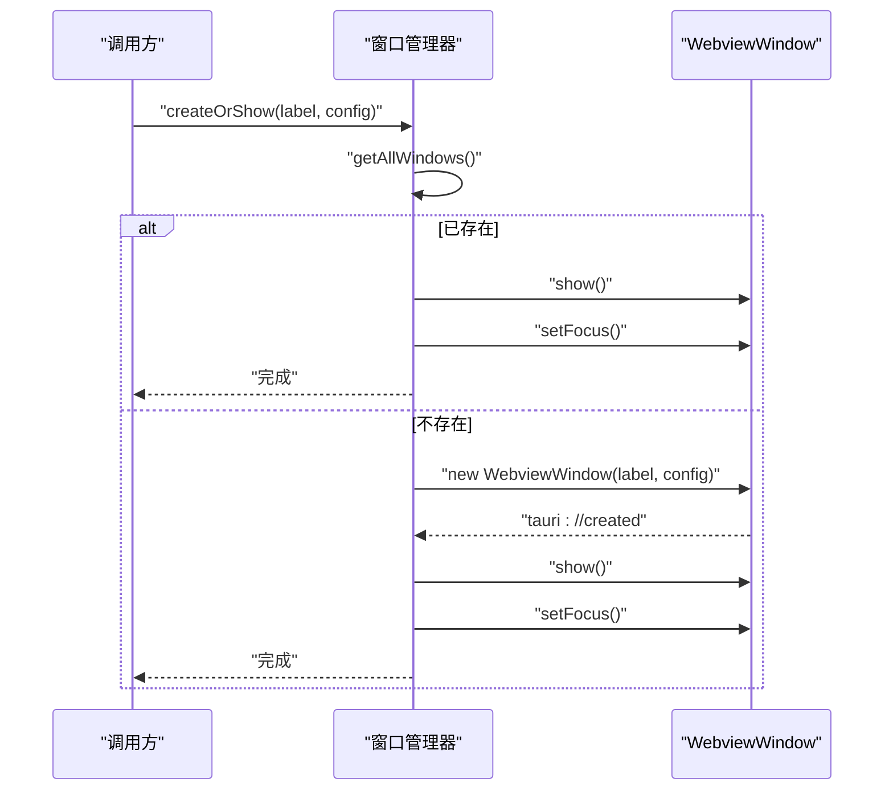
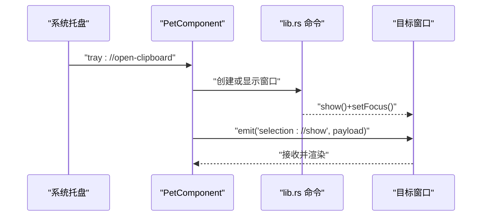
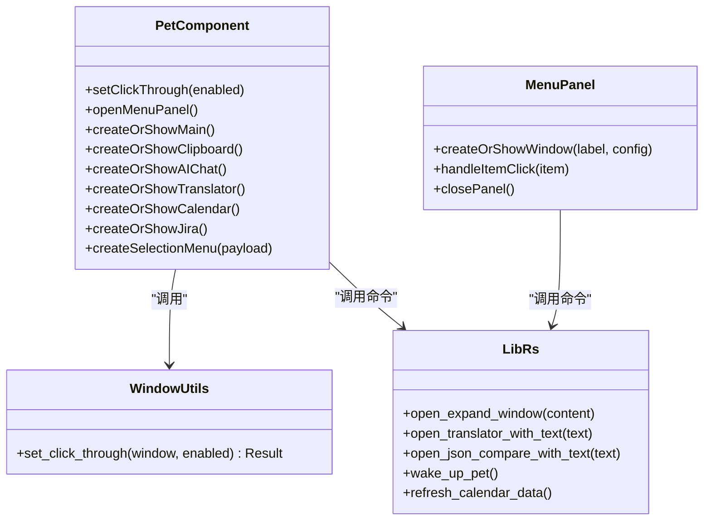
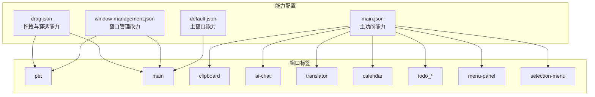
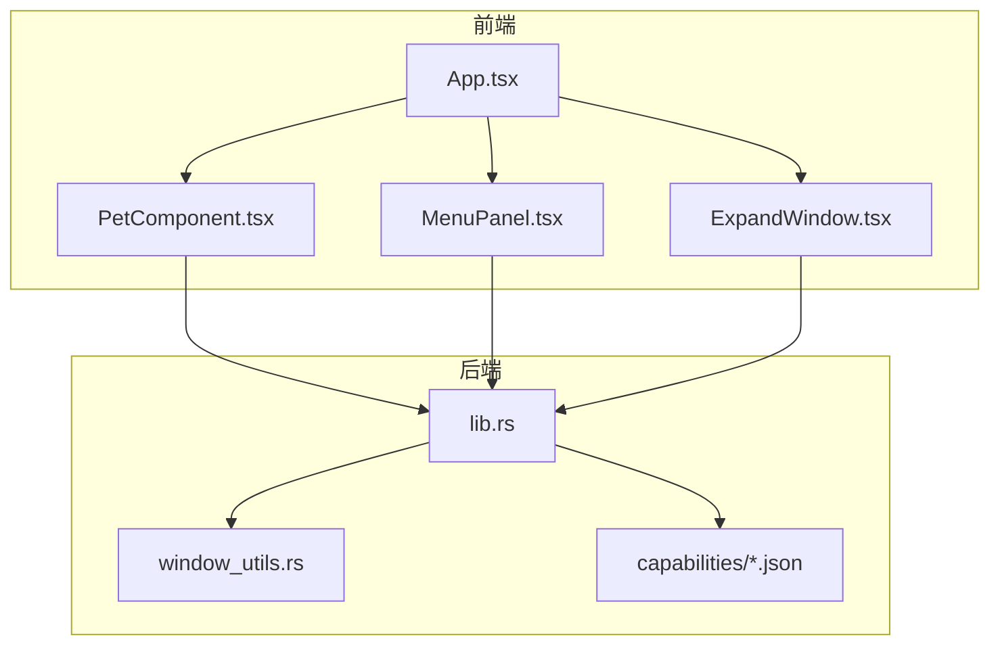

# 窗口管理架构

<cite>
**本文档引用的文件**
- [src/main.tsx](file://src/main.tsx)
- [src/App.tsx](file://src/App.tsx)
- [src/components/PetComponent.tsx](file://src/components/PetComponent.tsx)
- [src/components/MenuPanel.tsx](file://src/components/MenuPanel.tsx)
- [src/components/ExpandWindow.tsx](file://src/components/ExpandWindow.tsx)
- [src-tauri/src/main.rs](file://src-tauri/src/main.rs)
- [src-tauri/src/lib.rs](file://src-tauri/src/lib.rs)
- [src-tauri/src/window_utils.rs](file://src-tauri/src/window_utils.rs)
- [src-tauri/Cargo.toml](file://src-tauri/Cargo.toml)
- [src-tauri/capabilities/default.json](file://src-tauri/capabilities/default.json)
- [src-tauri/capabilities/drag.json](file://src-tauri/capabilities/drag.json)
- [src-tauri/capabilities/window-management.json](file://src-tauri/capabilities/window-management.json)
- [src-tauri/capabilities/main.json](file://src-tauri/capabilities/main.json)
- [public/config/bubbles.json](file://public/config/bubbles.json)
</cite>

## 目录
1. [引言](#引言)
2. [项目结构](#项目结构)
3. [核心组件](#核心组件)
4. [架构总览](#架构总览)
5. [详细组件分析](#详细组件分析)
6. [依赖关系分析](#依赖关系分析)
7. [性能考虑](#性能考虑)
8. [故障排除指南](#故障排除指南)
9. [结论](#结论)

## 引言
本文件面向XSUN桌面宠物项目的窗口管理架构，系统性阐述多窗口设计理念与实现机制，涵盖主窗口、功能窗口与菜单窗口的职责划分与生命周期管理；解释基于窗口标签的动态路由与组件渲染；详述窗口创建与销毁的生命周期流程、状态维护与资源清理；介绍跨窗口数据传递、事件广播与状态同步；描述窗口属性管理（尺寸、位置、层级、可见性）；解释窗口权限与安全机制（能力配置与访问控制）；分析性能优化策略（缓存、懒加载、内存管理）；最后说明与系统窗口管理器的集成方式（任务栏与窗口切换）。

## 项目结构
项目采用前端React + Tauri后端的混合架构，前端负责UI与窗口标签路由，后端负责窗口创建、事件广播与系统交互。关键目录与文件如下：
- 前端入口与应用根组件：src/main.tsx、src/App.tsx
- 窗口组件：PetComponent（主宠物窗口）、MenuPanel（功能菜单）、ExpandWindow（扩展编辑窗口）
- 后端入口与库：src-tauri/src/main.rs、src-tauri/src/lib.rs
- 窗口工具：src-tauri/src/window_utils.rs
- 能力配置：src-tauri/capabilities/*.json
- 配置数据：public/config/bubbles.json

**图表来源**
- [src/main.tsx:1-10](file://src/main.tsx#L1-L10)
- [src/App.tsx:1-60](file://src/App.tsx#L1-L60)
- [src/components/PetComponent.tsx:1-819](file://src/components/PetComponent.tsx#L1-L819)
- [src/components/MenuPanel.tsx:1-295](file://src/components/MenuPanel.tsx#L1-L295)
- [src/components/ExpandWindow.tsx:1-168](file://src/components/ExpandWindow.tsx#L1-L168)
- [src-tauri/src/main.rs:1-11](file://src-tauri/src/main.rs#L1-L11)
- [src-tauri/src/lib.rs:1-800](file://src-tauri/src/lib.rs#L1-L800)
- [src-tauri/src/window_utils.rs:1-33](file://src-tauri/src/window_utils.rs#L1-L33)
- [src-tauri/capabilities/default.json:1-12](file://src-tauri/capabilities/default.json#L1-L12)

**章节来源**
- [src/main.tsx:1-10](file://src/main.tsx#L1-L10)
- [src/App.tsx:1-60](file://src/App.tsx#L1-L60)
- [src-tauri/src/main.rs:1-11](file://src-tauri/src/main.rs#L1-L11)

## 核心组件
- 应用入口与根组件：负责挂载React应用，App组件根据当前窗口的label选择渲染对应组件。
- 主宠物窗口（PetComponent）：负责窗口标签路由、窗口属性控制（点击穿透/唤醒/休眠）、窗口创建与显示逻辑、事件监听与跨窗口通信。
- 功能菜单窗口（MenuPanel）：提供统一的功能入口，根据配置动态创建或复用其他功能窗口。
- 扩展编辑窗口（ExpandWindow）：用于展示和编辑剪贴板内容，演示窗口间数据注入与保存流程。
- 后端命令与事件：提供窗口创建、事件广播、系统交互等能力，并通过能力配置进行权限控制。

**章节来源**
- [src/App.tsx:18-58](file://src/App.tsx#L18-L58)
- [src/components/PetComponent.tsx:19-202](file://src/components/PetComponent.tsx#L19-L202)
- [src/components/MenuPanel.tsx:14-88](file://src/components/MenuPanel.tsx#L14-L88)
- [src/components/ExpandWindow.tsx:6-84](file://src/components/ExpandWindow.tsx#L6-L84)
- [src-tauri/src/lib.rs:41-160](file://src-tauri/src/lib.rs#L41-L160)

## 架构总览
窗口管理采用“标签驱动 + 能力授权”的设计。前端通过窗口标签区分不同功能窗口，后端通过Tauri命令与事件实现窗口创建、属性设置与跨窗口通信，能力配置文件控制权限范围。

**图表来源**
- [src/components/PetComponent.tsx:649-710](file://src/components/PetComponent.tsx#L649-L710)
- [src-tauri/src/lib.rs:75-112](file://src-tauri/src/lib.rs#L75-L112)
- [src/components/MenuPanel.tsx:90-259](file://src/components/MenuPanel.tsx#L90-L259)

## 详细组件分析

### 窗口标签系统与动态路由
- 标签定义：窗口标签由“pet”、“main”、“clipboard”、“expand_*”、“ai-chat”、“translator”、“calendar”、“todo_*”、“menu-panel”、“json-compare”、“pomodoro-timer”、“pomodoro-notification”、“jira”、“selection-menu”等组成。
- 路由机制：App组件在初始化时读取当前窗口label，依据标签返回对应的组件进行渲染。
- 配置驱动：功能菜单项来源于bubbles.json，通过action字段映射到具体窗口标签。

**图表来源**
- [src/App.tsx:18-58](file://src/App.tsx#L18-L58)
- [public/config/bubbles.json:1-52](file://public/config/bubbles.json#L1-L52)

**章节来源**
- [src/App.tsx:18-58](file://src/App.tsx#L18-L58)
- [public/config/bubbles.json:1-52](file://public/config/bubbles.json#L1-L52)

### 窗口生命周期管理
- 初始化：PetComponent在effect中读取当前窗口label并设置状态；MenuPanel在effect中注册点击外部关闭逻辑。
- 创建与显示：PetComponent与MenuPanel均提供createOrShowXxx函数，先查询是否存在同标签窗口，若存在则show+setFocus，否则新建WebviewWindow并等待“tauri://created”事件。
- 销毁：各组件提供close方法；MenuPanel在点击外部区域时关闭自身；PetComponent支持关闭宠物窗口。
- 资源清理：组件卸载时移除事件监听与定时器；MenuPanel延时添加监听避免误触。

**图表来源**
- [src/components/PetComponent.tsx:230-286](file://src/components/PetComponent.tsx#L230-L286)
- [src/components/MenuPanel.tsx:45-88](file://src/components/MenuPanel.tsx#L45-L88)

**章节来源**
- [src/components/PetComponent.tsx:230-758](file://src/components/PetComponent.tsx#L230-L758)
- [src/components/MenuPanel.tsx:14-88](file://src/components/MenuPanel.tsx#L14-L88)

### 窗口间通信机制
- 事件监听与广播：PetComponent监听多个自定义事件（如“pet://wake-up”、“tray://open-*”、“selection://popup”），并在满足条件时创建或显示目标窗口。
- 数据传递：通过WebviewWindow的emit方法向目标窗口发送数据；后端命令通过initialization_script注入全局变量（如__EXPAND_CONTENT__、__TRANSLATE_TEXT__等）。
- 状态同步：后端提供refresh-calendar等命令向特定窗口广播刷新事件。

**图表来源**
- [src/components/PetComponent.tsx:156-202](file://src/components/PetComponent.tsx#L156-L202)
- [src-tauri/src/lib.rs:114-160](file://src-tauri/src/lib.rs#L114-L160)

**章节来源**
- [src/components/PetComponent.tsx:156-202](file://src/components/PetComponent.tsx#L156-L202)
- [src-tauri/src/lib.rs:114-160](file://src-tauri/src/lib.rs#L114-L160)

### 窗口属性管理
- 点击穿透：PetComponent通过invoke调用后端set_click_through，实现窗口忽略鼠标事件；Windows平台使用扩展样式，非Windows平台使用忽略光标事件API。
- 层级与可见性：窗口创建时可设置alwaysOnTop、visible、skipTaskbar等属性；show/hide/setFocus用于控制可见性与焦点。
- 尺寸与位置：窗口创建时指定width/height/center/x/y；支持resizable/minWidth/minHeight；通过startDragging实现原生拖拽。

**图表来源**
- [src-tauri/src/window_utils.rs:9-32](file://src-tauri/src/window_utils.rs#L9-L32)
- [src/components/PetComponent.tsx:36-62](file://src/components/PetComponent.tsx#L36-L62)
- [src/components/MenuPanel.tsx:45-88](file://src/components/MenuPanel.tsx#L45-L88)
- [src-tauri/src/lib.rs:48-59](file://src-tauri/src/lib.rs#L48-L59)

**章节来源**
- [src-tauri/src/window_utils.rs:9-32](file://src-tauri/src/window_utils.rs#L9-L32)
- [src/components/PetComponent.tsx:36-62](file://src/components/PetComponent.tsx#L36-L62)
- [src/components/MenuPanel.tsx:45-88](file://src/components/MenuPanel.tsx#L45-L88)
- [src-tauri/src/lib.rs:48-59](file://src-tauri/src/lib.rs#L48-L59)

### 窗口权限与安全机制
- 能力配置：default.json、window-management.json、drag.json、main.json分别定义不同场景下的窗口权限，限定允许的操作（创建、显示、隐藏、焦点、拖拽、忽略光标事件等）。
- 权限范围：不同窗口标签拥有不同的能力集合，避免越权操作；例如“pet”和“main”窗口具备拖拽与点击穿透能力。
- 安全边界：前端仅能通过后端命令与事件与系统交互，防止直接调用底层系统API。

**图表来源**
- [src-tauri/capabilities/default.json:1-12](file://src-tauri/capabilities/default.json#L1-L12)
- [src-tauri/capabilities/window-management.json:1-17](file://src-tauri/capabilities/window-management.json#L1-L17)
- [src-tauri/capabilities/drag.json:1-14](file://src-tauri/capabilities/drag.json#L1-L14)
- [src-tauri/capabilities/main.json:1-40](file://src-tauri/capabilities/main.json#L1-L40)

**章节来源**
- [src-tauri/capabilities/default.json:1-12](file://src-tauri/capabilities/default.json#L1-L12)
- [src-tauri/capabilities/window-management.json:1-17](file://src-tauri/capabilities/window-management.json#L1-L17)
- [src-tauri/capabilities/drag.json:1-14](file://src-tauri/capabilities/drag.json#L1-L14)
- [src-tauri/capabilities/main.json:1-40](file://src-tauri/capabilities/main.json#L1-L40)

### 性能优化策略
- 窗口复用：创建前先查询同标签窗口，避免重复创建；失败时再回退重建。
- 异步等待：使用Promise等待“tauri://created”或“tauri://error”，超时保护，避免阻塞。
- 懒加载：菜单面板与功能窗口在用户触发时才创建，减少初始资源占用。
- 内存管理：组件卸载时清理事件监听与定时器；窗口关闭时释放相关资源。
- 渲染优化：根据标签精确渲染对应组件，避免不必要的重渲染。

**章节来源**
- [src/components/PetComponent.tsx:230-286](file://src/components/PetComponent.tsx#L230-L286)
- [src/components/MenuPanel.tsx:45-88](file://src/components/MenuPanel.tsx#L45-L88)

### 与系统窗口管理器的集成
- 任务栏集成：部分窗口设置skipTaskbar=true，不显示在任务栏；其他窗口正常参与任务栏管理。
- 窗口切换：通过setFocus确保目标窗口获得焦点；startDragging实现原生拖拽体验。
- 托盘交互：后端创建托盘菜单，前端监听托盘事件并触发相应窗口创建或显示。

**章节来源**
- [src/components/PetComponent.tsx:491-517](file://src/components/PetComponent.tsx#L491-L517)
- [src-tauri/src/lib.rs:780-800](file://src-tauri/src/lib.rs#L780-L800)

## 依赖关系分析
前端与后端通过Tauri命令与事件解耦，能力配置文件约束权限范围，形成清晰的分层架构。

**图表来源**
- [src/App.tsx:1-60](file://src/App.tsx#L1-L60)
- [src/components/PetComponent.tsx:1-819](file://src/components/PetComponent.tsx#L1-L819)
- [src/components/MenuPanel.tsx:1-295](file://src/components/MenuPanel.tsx#L1-L295)
- [src/components/ExpandWindow.tsx:1-168](file://src/components/ExpandWindow.tsx#L1-L168)
- [src-tauri/src/lib.rs:1-800](file://src-tauri/src/lib.rs#L1-L800)
- [src-tauri/src/window_utils.rs:1-33](file://src-tauri/src/window_utils.rs#L1-L33)
- [src-tauri/capabilities/default.json:1-12](file://src-tauri/capabilities/default.json#L1-L12)

**章节来源**
- [src-tauri/src/lib.rs:1-800](file://src-tauri/src/lib.rs#L1-L800)
- [src-tauri/src/window_utils.rs:1-33](file://src-tauri/src/window_utils.rs#L1-L33)
- [src-tauri/Cargo.toml:15-44](file://src-tauri/Cargo.toml#L15-L44)

## 性能考虑
- 窗口创建成本：尽量复用现有窗口，减少创建与销毁频率。
- 事件风暴防护：对高频事件（如鼠标移动）使用节流/防抖与超时保护。
- 资源占用控制：透明窗口与无装饰窗口减少GPU压力；合理设置窗口尺寸与阴影。
- 异步并发：使用Promise与超时机制避免阻塞主线程。

## 故障排除指南
- 窗口创建超时：检查“tauri://created”与“tauri://error”事件处理，确认URL与HTML路径正确。
- 焦点与显示失败：确认窗口权限配置包含“core:window:allow-show”和“core:window:allow-set-focus”。
- 点击穿透失效：Windows平台检查扩展样式设置，非Windows平台检查忽略光标事件API。
- 事件未到达：确认事件监听在组件挂载后注册，且在卸载时正确移除。

**章节来源**
- [src/components/PetComponent.tsx:260-274](file://src/components/PetComponent.tsx#L260-L274)
- [src/components/MenuPanel.tsx:67-81](file://src/components/MenuPanel.tsx#L67-L81)
- [src-tauri/capabilities/window-management.json:9-15](file://src-tauri/capabilities/window-management.json#L9-L15)

## 结论
XSUN桌面宠物项目的窗口管理架构以“标签驱动 + 能力授权”为核心，结合前端路由与后端命令，实现了灵活的多窗口体系。通过严格的权限控制、完善的生命周期管理与事件通信机制，系统在保证安全性的同时提供了良好的用户体验。建议持续优化窗口复用策略与事件处理性能，进一步提升整体响应速度与稳定性。