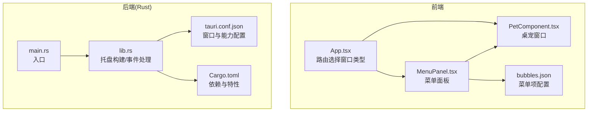
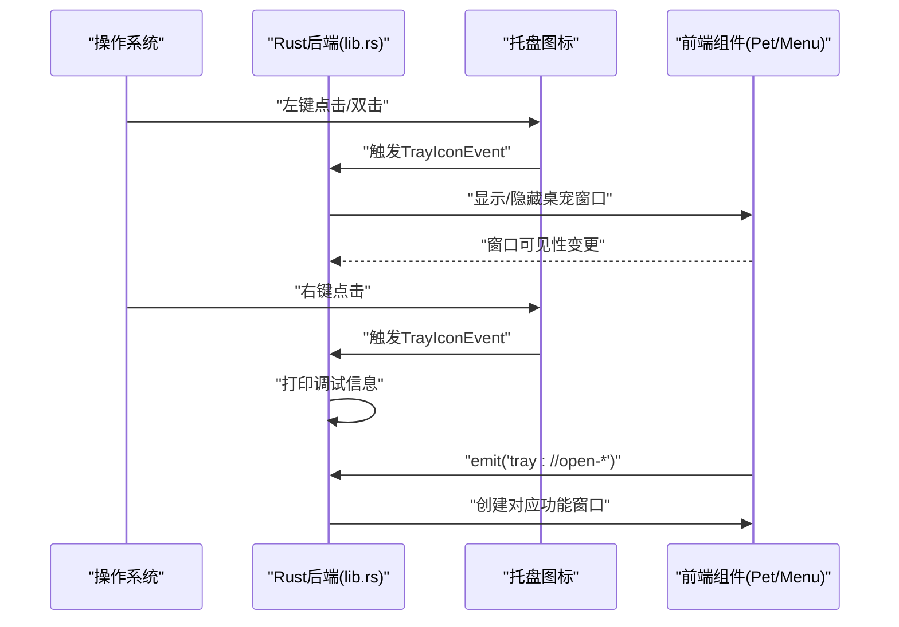
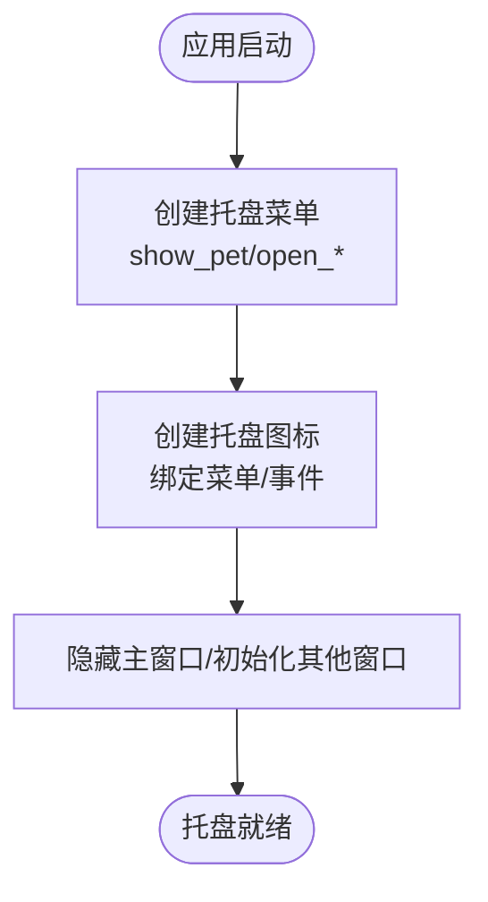
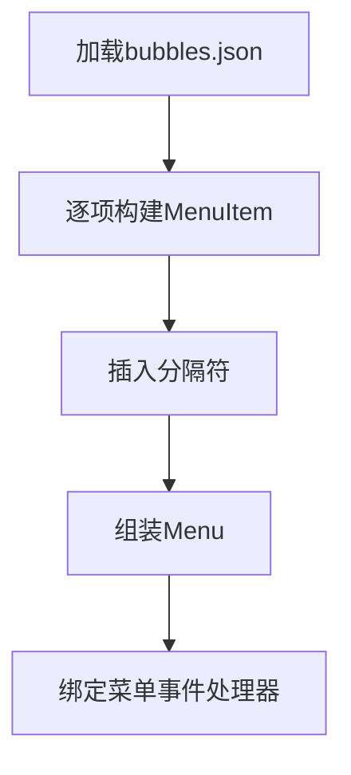
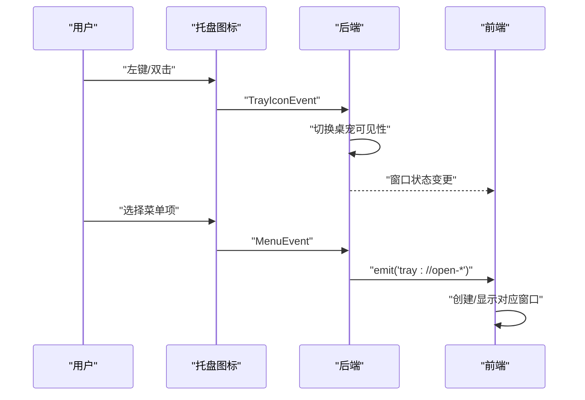
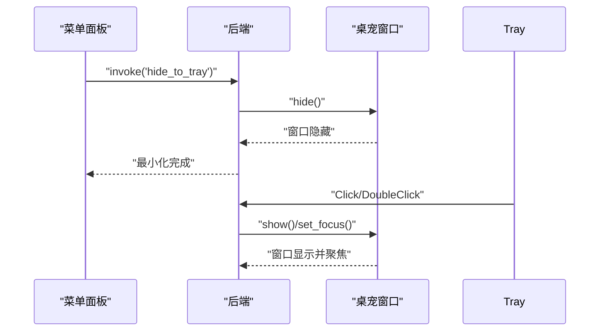
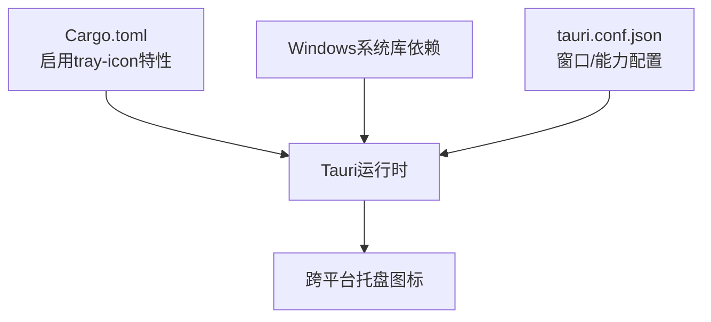
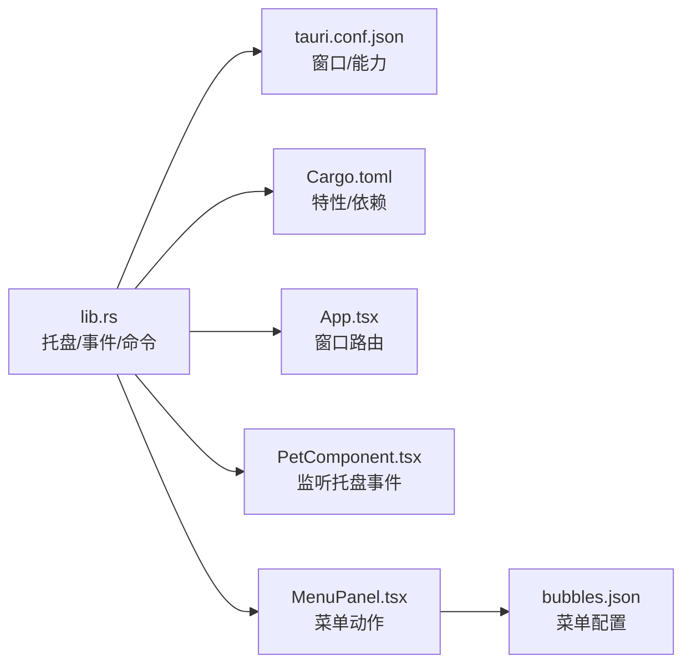

# 系统托盘集成架构

<cite>
**本文档引用的文件**
- [src-tauri/src/lib.rs](file://src-tauri/src/lib.rs)
- [src-tauri/src/main.rs](file://src-tauri/src/main.rs)
- [src-tauri/tauri.conf.json](file://src-tauri/tauri.conf.json)
- [src-tauri/Cargo.toml](file://src-tauri/Cargo.toml)
- [src/App.tsx](file://src/App.tsx)
- [src/components/PetComponent.tsx](file://src/components/PetComponent.tsx)
- [src/components/MenuPanel.tsx](file://src/components/MenuPanel.tsx)
- [public/config/bubbles.json](file://public/config/bubbles.json)
</cite>

## 目录
1. [简介](#简介)
2. [项目结构](#项目结构)
3. [核心组件](#核心组件)
4. [架构总览](#架构总览)
5. [详细组件分析](#详细组件分析)
6. [依赖关系分析](#依赖关系分析)
7. [性能考量](#性能考量)
8. [故障排除指南](#故障排除指南)
9. [结论](#结论)

## 简介
本文件面向XSUN桌面宠物项目的系统托盘集成，系统性梳理托盘图标管理、菜单设计与事件处理机制，解释托盘图标创建与管理、菜单动态生成、事件处理流程、托盘与主窗口交互以及跨平台兼容性设计，并提供用户体验与安全考虑建议。文档基于仓库实际代码进行分析，避免臆测，确保可追溯性。

## 项目结构
XSUN桌面宠物采用Tauri 2作为原生壳，前端使用React/Vite。托盘集成主要分布在Rust后端与前端组件之间，通过Tauri命令与事件实现桥接。

**图表来源**
- [src-tauri/src/main.rs:1-11](file://src-tauri/src/main.rs#L1-L11)
- [src-tauri/src/lib.rs:948-1120](file://src-tauri/src/lib.rs#L948-L1120)
- [src-tauri/tauri.conf.json:1-74](file://src-tauri/tauri.conf.json#L1-L74)
- [src-tauri/Cargo.toml:1-44](file://src-tauri/Cargo.toml#L1-L44)
- [src/App.tsx:18-60](file://src/App.tsx#L18-L60)
- [src/components/MenuPanel.tsx:240-295](file://src/components/MenuPanel.tsx#L240-L295)
- [public/config/bubbles.json:1-52](file://public/config/bubbles.json#L1-L52)

**章节来源**
- [src-tauri/src/main.rs:1-11](file://src-tauri/src/main.rs#L1-L11)
- [src-tauri/src/lib.rs:948-1120](file://src-tauri/src/lib.rs#L948-L1120)
- [src-tauri/tauri.conf.json:1-74](file://src-tauri/tauri.conf.json#L1-L74)
- [src-tauri/Cargo.toml:1-44](file://src-tauri/Cargo.toml#L1-L44)
- [src/App.tsx:18-60](file://src/App.tsx#L18-L60)
- [src/components/MenuPanel.tsx:240-295](file://src/components/MenuPanel.tsx#L240-L295)
- [public/config/bubbles.json:1-52](file://public/config/bubbles.json#L1-L52)

## 核心组件
- 托盘图标与菜单构建：在后端创建托盘图标、绑定菜单与事件监听器。
- 菜单动态生成：基于配置文件动态生成菜单项与分隔符。
- 事件处理：左键点击显示/隐藏桌宠；双击强制显示；菜单项触发前端窗口创建或托盘命令调用。
- 前端桥接：前端监听托盘事件并创建对应功能窗口；菜单面板支持“最小化到托盘”、“关闭桌宠”等动作。
- 跨平台特性：通过Tauri特性启用托盘图标，Windows平台额外引入系统库以支持全局钩子。

**章节来源**
- [src-tauri/src/lib.rs:778-804](file://src-tauri/src/lib.rs#L778-L804)
- [src-tauri/src/lib.rs:807-844](file://src-tauri/src/lib.rs#L807-L844)
- [src-tauri/src/lib.rs:846-876](file://src-tauri/src/lib.rs#L846-L876)
- [src-tauri/src/lib.rs:1008-1019](file://src-tauri/src/lib.rs#L1008-L1019)
- [src/components/MenuPanel.tsx:240-295](file://src/components/MenuPanel.tsx#L240-L295)
- [src/components/PetComponent.tsx:161-184](file://src/components/PetComponent.tsx#L161-L184)
- [src-tauri/Cargo.toml:16](file://src-tauri/Cargo.toml#L16)

## 架构总览
托盘集成采用“后端构建托盘+前端事件桥接”的模式。后端负责托盘图标、菜单与事件监听器的创建，前端负责窗口创建与状态展示。

**图表来源**
- [src-tauri/src/lib.rs:1008-1019](file://src-tauri/src/lib.rs#L1008-L1019)
- [src-tauri/src/lib.rs:807-844](file://src-tauri/src/lib.rs#L807-L844)
- [src-tauri/src/lib.rs:846-876](file://src-tauri/src/lib.rs#L846-L876)
- [src/components/PetComponent.tsx:161-184](file://src/components/PetComponent.tsx#L161-L184)

## 详细组件分析

### 托盘图标与菜单构建
- 托盘图标创建：在应用初始化阶段，使用TrayIconBuilder创建带菜单的托盘图标，设置默认图标与提示文本。
- 菜单项定义：通过MenuItemBuilder创建菜单项，包含“显示桌宠”、“剪贴板”、“系统信息”、“AI对话”、“有道翻译”、“日历TODO”、“退出”等。
- 事件绑定：注册托盘图标事件与菜单事件回调，分别处理点击/双击与菜单项选择。

**图表来源**
- [src-tauri/src/lib.rs:778-804](file://src-tauri/src/lib.rs#L778-L804)
- [src-tauri/src/lib.rs:1008-1019](file://src-tauri/src/lib.rs#L1008-L1019)
- [src-tauri/src/lib.rs:1020-1037](file://src-tauri/src/lib.rs#L1020-L1037)

**章节来源**
- [src-tauri/src/lib.rs:778-804](file://src-tauri/src/lib.rs#L778-L804)
- [src-tauri/src/lib.rs:1008-1019](file://src-tauri/src/lib.rs#L1008-L1019)
- [src-tauri/src/lib.rs:1020-1037](file://src-tauri/src/lib.rs#L1020-L1037)

### 菜单动态生成机制
- 配置驱动：菜单项来源于配置文件，包含标签、动作标识与图标路径。
- 运行时生成：后端在构建菜单时遍历配置生成菜单项与分隔符。
- 前端映射：前端根据动作标识创建对应窗口或执行托盘命令。

**图表来源**
- [public/config/bubbles.json:1-52](file://public/config/bubbles.json#L1-L52)
- [src-tauri/src/lib.rs:778-804](file://src-tauri/src/lib.rs#L778-L804)
- [src-tauri/src/lib.rs:846-876](file://src-tauri/src/lib.rs#L846-L876)

**章节来源**
- [public/config/bubbles.json:1-52](file://public/config/bubbles.json#L1-L52)
- [src-tauri/src/lib.rs:778-804](file://src-tauri/src/lib.rs#L778-L804)
- [src-tauri/src/lib.rs:846-876](file://src-tauri/src/lib.rs#L846-L876)

### 事件处理架构
- 图标事件：
  - 左键点击：切换桌宠窗口显示/隐藏。
  - 双击：强制显示桌宠窗口并聚焦。
  - 右键：记录调试信息（菜单通常由系统接管）。
- 菜单事件：
  - “显示桌宠”：显示并聚焦桌宠窗口。
  - “剪贴板/系统信息/AI对话/有道翻译/日历TODO”：向前端发出特定事件，由前端创建对应窗口。
  - “退出”：退出应用。

**图表来源**
- [src-tauri/src/lib.rs:807-844](file://src-tauri/src/lib.rs#L807-L844)
- [src-tauri/src/lib.rs:846-876](file://src-tauri/src/lib.rs#L846-L876)
- [src/components/PetComponent.tsx:161-184](file://src/components/PetComponent.tsx#L161-L184)

**章节来源**
- [src-tauri/src/lib.rs:807-844](file://src-tauri/src/lib.rs#L807-L844)
- [src-tauri/src/lib.rs:846-876](file://src-tauri/src/lib.rs#L846-L876)
- [src/components/PetComponent.tsx:161-184](file://src/components/PetComponent.tsx#L161-L184)

### 托盘与主窗口交互机制
- 最小化到托盘：菜单面板提供“最小化到托盘”动作，前端调用后端命令隐藏桌宠窗口。
- 从托盘恢复：托盘图标事件或菜单项可恢复显示并聚焦桌宠窗口。
- 状态同步：前端监听托盘事件，确保窗口状态与托盘行为一致。

**图表来源**
- [src/components/MenuPanel.tsx:240-242](file://src/components/MenuPanel.tsx#L240-L242)
- [src-tauri/src/lib.rs:878-894](file://src-tauri/src/lib.rs#L878-L894)
- [src-tauri/src/lib.rs:807-844](file://src-tauri/src/lib.rs#L807-L844)

**章节来源**
- [src/components/MenuPanel.tsx:240-242](file://src/components/MenuPanel.tsx#L240-L242)
- [src-tauri/src/lib.rs:878-894](file://src-tauri/src/lib.rs#L878-L894)
- [src-tauri/src/lib.rs:807-844](file://src-tauri/src/lib.rs#L807-L844)

### 跨平台兼容性设计
- 平台特性：通过Cargo.toml启用Tauri的tray-icon特性，确保托盘图标可用。
- Windows扩展：在Windows目标下引入系统库以支持全局鼠标钩子等能力。
- 配置统一：通过tauri.conf.json集中管理窗口属性与能力，保证不同平台行为一致性。

**图表来源**
- [src-tauri/Cargo.toml:16](file://src-tauri/Cargo.toml#L16)
- [src-tauri/Cargo.toml:37-43](file://src-tauri/Cargo.toml#L37-L43)
- [src-tauri/tauri.conf.json:44-51](file://src-tauri/tauri.conf.json#L44-L51)

**章节来源**
- [src-tauri/Cargo.toml:16](file://src-tauri/Cargo.toml#L16)
- [src-tauri/Cargo.toml:37-43](file://src-tauri/Cargo.toml#L37-L43)
- [src-tauri/tauri.conf.json:44-51](file://src-tauri/tauri.conf.json#L44-L51)

### 用户体验设计
- 图标设计：托盘图标使用应用默认窗口图标，配合提示文本“XSun桌宠”，便于识别。
- 菜单布局：采用分组与分隔符组织菜单项，逻辑清晰，便于用户快速定位功能。
- 交互反馈：左键点击即时切换窗口可见性；双击强制显示；菜单项通过事件驱动创建窗口，反馈明确。

**章节来源**
- [src-tauri/src/lib.rs:1008-1019](file://src-tauri/src/lib.rs#L1008-L1019)
- [src-tauri/src/lib.rs:807-844](file://src-tauri/src/lib.rs#L807-L844)
- [src-tauri/src/lib.rs:846-876](file://src-tauri/src/lib.rs#L846-L876)

### 安全考虑
- 权限管理：通过tauri.conf.json中的capabilities字段声明所需能力，限制不必要的权限暴露。
- 事件隔离：托盘事件与菜单事件通过命名空间化的事件名（如tray://open-*）进行隔离，避免冲突。
- 资源访问：窗口创建与资源加载遵循前端路由与静态资源路径约定，避免越权访问。

**章节来源**
- [src-tauri/tauri.conf.json:44-51](file://src-tauri/tauri.conf.json#L44-L51)
- [src-tauri/src/lib.rs:855-867](file://src-tauri/src/lib.rs#L855-L867)

## 依赖关系分析
托盘集成的关键依赖与耦合点如下：

**图表来源**
- [src-tauri/src/lib.rs:948-1120](file://src-tauri/src/lib.rs#L948-L1120)
- [src-tauri/tauri.conf.json:1-74](file://src-tauri/tauri.conf.json#L1-L74)
- [src-tauri/Cargo.toml:1-44](file://src-tauri/Cargo.toml#L1-L44)
- [src/App.tsx:18-60](file://src/App.tsx#L18-L60)
- [src/components/PetComponent.tsx:161-184](file://src/components/PetComponent.tsx#L161-L184)
- [src/components/MenuPanel.tsx:240-295](file://src/components/MenuPanel.tsx#L240-L295)
- [public/config/bubbles.json:1-52](file://public/config/bubbles.json#L1-L52)

**章节来源**
- [src-tauri/src/lib.rs:948-1120](file://src-tauri/src/lib.rs#L948-L1120)
- [src-tauri/tauri.conf.json:1-74](file://src-tauri/tauri.conf.json#L1-L74)
- [src-tauri/Cargo.toml:1-44](file://src-tauri/Cargo.toml#L1-L44)
- [src/App.tsx:18-60](file://src/App.tsx#L18-L60)
- [src/components/PetComponent.tsx:161-184](file://src/components/PetComponent.tsx#L161-L184)
- [src/components/MenuPanel.tsx:240-295](file://src/components/MenuPanel.tsx#L240-L295)
- [public/config/bubbles.json:1-52](file://public/config/bubbles.json#L1-L52)

## 性能考量
- 事件处理轻量：托盘事件处理逻辑简单，仅做窗口可见性切换与事件转发，避免阻塞主线程。
- 异步任务：系统信息采集与剪贴板监控使用Tokio异步任务，降低对UI线程的影响。
- 窗口复用：前端在创建窗口时检查同名窗口是否存在，避免重复创建，节省资源。

[本节为通用指导，不直接分析具体文件]

## 故障排除指南
- 托盘图标不显示：
  - 检查是否启用tray-icon特性与平台依赖。
  - 确认托盘图标构建流程未抛出异常。
- 菜单项无响应：
  - 检查菜单事件处理器是否正确绑定。
  - 确认前端是否监听对应事件并创建窗口。
- 最小化到托盘无效：
  - 确认菜单面板“最小化到托盘”动作是否调用后端命令。
  - 检查后端命令是否成功隐藏桌宠窗口。

**章节来源**
- [src-tauri/Cargo.toml:16](file://src-tauri/Cargo.toml#L16)
- [src-tauri/src/lib.rs:1008-1019](file://src-tauri/src/lib.rs#L1008-L1019)
- [src-tauri/src/lib.rs:846-876](file://src-tauri/src/lib.rs#L846-L876)
- [src-tauri/src/lib.rs:878-894](file://src-tauri/src/lib.rs#L878-L894)

## 结论
XSUN桌面宠物的系统托盘集成了图标管理、动态菜单与事件处理，通过后端托盘构建与前端事件桥接实现稳定的功能交互。配置驱动的菜单生成提升了可维护性，跨平台特性与能力声明保障了安全性与一致性。建议后续可进一步完善托盘状态持久化与多语言支持，持续优化用户体验。