# 宠物交互机制

<cite>
**本文档引用的文件**
- [PetComponent.tsx](file://src/components/PetComponent.tsx)
- [PetComponent.css](file://src/components/PetComponent.css)
- [App.tsx](file://src/App.tsx)
- [main.tsx](file://src/main.tsx)
- [lib.rs](file://src-tauri/src/lib.rs)
- [window_utils.rs](file://src-tauri/src/window_utils.rs)
- [drag.json](file://src-tauri/capabilities/drag.json)
- [default.json](file://src-tauri/capabilities/default.json)
- [bubbles.json](file://public/config/bubbles.json)
</cite>

## 目录
1. [简介](#简介)
2. [项目结构](#项目结构)
3. [核心组件](#核心组件)
4. [架构概览](#架构概览)
5. [详细组件分析](#详细组件分析)
6. [依赖关系分析](#依赖关系分析)
7. [性能考虑](#性能考虑)
8. [故障排除指南](#故障排除指南)
9. [结论](#结论)

## 简介

本文档深入分析了桌面宠物交互机制的完整实现，重点关注以下核心功能：
- 拖拽交互实现：包括指针事件处理、拖拽阈值检测算法和startDragging API调用机制
- 双击检测逻辑：涵盖双击时间间隔判断、事件捕获和阻止传播的实现
- 鼠标进入/离开事件处理：包括唤醒逻辑、休眠定时器和状态切换条件
- 点击穿透状态管理：说明setClickThrough API的工作原理和状态同步机制
- 交互事件调试方法和性能优化建议

该系统采用React前端配合Tauri后端的混合架构，实现了高度响应式的桌面宠物交互体验。

## 项目结构

项目采用前后端分离的架构设计，主要分为以下层次：

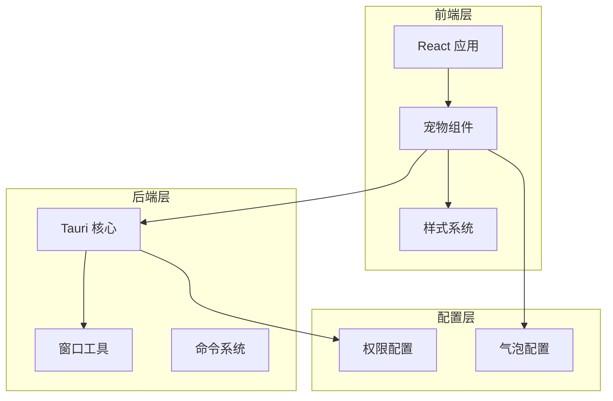

**图表来源**
- [PetComponent.tsx:19-749](file://src/components/PetComponent.tsx#L19-L749)
- [lib.rs:1-1109](file://src-tauri/src/lib.rs#L1-L1109)

**章节来源**
- [main.tsx:1-10](file://src/main.tsx#L1-L10)
- [App.tsx:17-55](file://src/App.tsx#L17-L55)

## 核心组件

### 宠物组件架构

宠物组件是整个交互系统的核心，负责处理所有用户输入事件和状态管理：

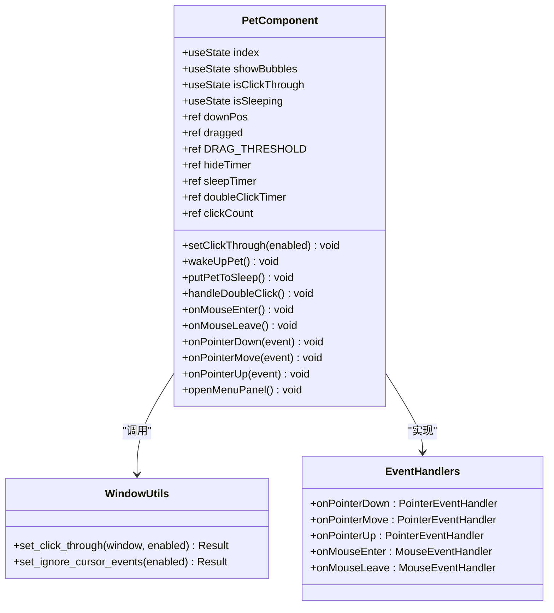

**图表来源**
- [PetComponent.tsx:19-749](file://src/components/PetComponent.tsx#L19-L749)
- [window_utils.rs:9-32](file://src-tauri/src/window_utils.rs#L9-L32)

### 状态管理系统

系统采用多层状态管理机制，确保交互行为的一致性和可预测性：

| 状态类型 | 状态变量 | 作用域 | 触发条件 |
|---------|---------|--------|----------|
| 交互状态 | isClickThrough | 全局 | setClickThrough API调用 |
| 休眠状态 | isSleeping | 组件级 | 鼠标进入/离开事件 |
| 拖拽状态 | dragged | 会话级 | 拖拽阈值检测 |
| 气泡状态 | showBubbles | 组件级 | 菜单面板交互 |
| 位置状态 | downPos | 会话级 | 鼠标按下事件 |

**章节来源**
- [PetComponent.tsx:20-31](file://src/components/PetComponent.tsx#L20-L31)
- [PetComponent.tsx:36-62](file://src/components/PetComponent.tsx#L36-L62)

## 架构概览

系统采用分层架构设计，实现了清晰的职责分离：

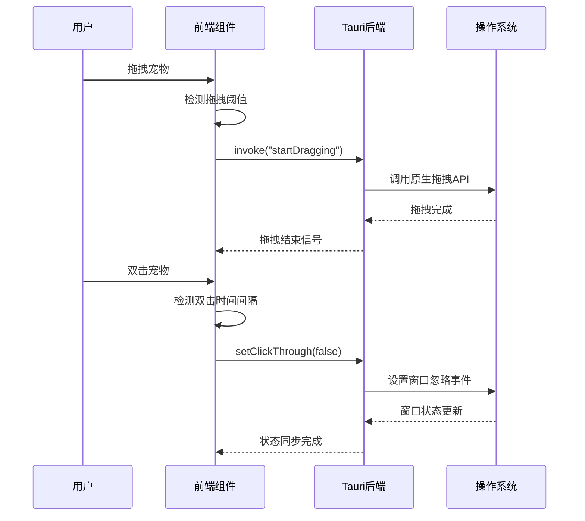

**图表来源**
- [PetComponent.tsx:90-139](file://src/components/PetComponent.tsx#L90-L139)
- [lib.rs:48-59](file://src-tauri/src/lib.rs#L48-L59)
- [window_utils.rs:9-32](file://src-tauri/src/window_utils.rs#L9-L32)

## 详细组件分析

### 拖拽交互实现

#### 指针事件处理机制

拖拽交互采用现代的Pointer Events API，提供了跨平台的统一事件处理：

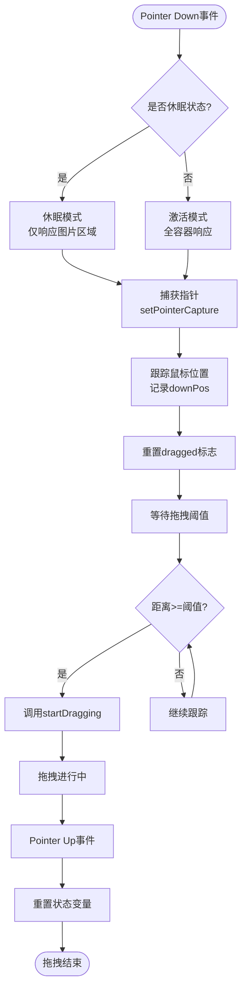

**图表来源**
- [PetComponent.tsx:90-127](file://src/components/PetComponent.tsx#L90-L127)

#### 拖拽阈值检测算法

拖拽阈值检测采用了精确的距离计算算法：

```mermaid
flowchart LR
subgraph "坐标系统"
XAxis[X轴]
YAxis[Y轴]
Origin[原点]
end
subgraph "计算过程"
DownPos[按下位置<br/>downPos]
CurrentPos[当前位置<br/>e.clientX/Y]
DeltaX[Δx = x2-x1]
DeltaY[Δy = y2-y1]
Distance[距离 = √(Δx²+Δy²)]
Threshold[阈值 = 3像素]
Decision{Distance >= 3?}
end
DownPos --> CurrentPos
CurrentPos --> DeltaX
CurrentPos --> DeltaY
DeltaX --> Distance
DeltaY --> Distance
Distance --> Threshold
Threshold --> Decision
Decision --> |是| StartDrag["开始拖拽"]
Decision --> |否| ContinueTrack["继续跟踪"]
```

**图表来源**
- [PetComponent.tsx:118-127](file://src/components/PetComponent.tsx#L118-L127)

**章节来源**
- [PetComponent.tsx:26](file://src/components/PetComponent.tsx#L26)
- [PetComponent.tsx:118-127](file://src/components/PetComponent.tsx#L118-L127)

### 双击检测逻辑

#### 时间间隔判断机制

双击检测实现了精确的时间控制和事件管理：

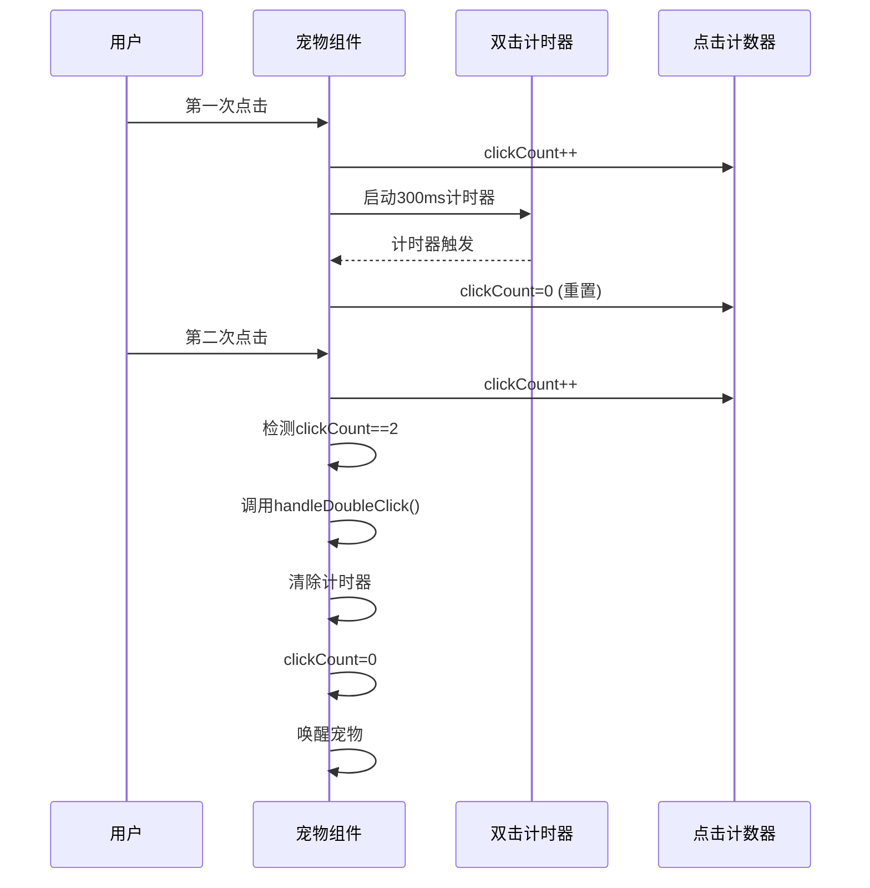

**图表来源**
- [PetComponent.tsx:65-67](file://src/components/PetComponent.tsx#L65-L67)
- [PetComponent.tsx:95-106](file://src/components/PetComponent.tsx#L95-L106)

#### 事件捕获和阻止传播

双击检测实现了完整的事件处理链路：

| 事件阶段 | 处理逻辑 | 目的 |
|---------|---------|------|
| 捕获阶段 | 检查目标元素类名 | 确保只在宠物图片上响应 |
| 冒泡阶段 | 更新点击计数器 | 维护双击状态 |
| 阻止传播 | preventDefault() | 防止事件穿透到底层窗口 |
| 延迟处理 | clearTimeout() | 清理未完成的双击序列 |

**章节来源**
- [PetComponent.tsx:90-111](file://src/components/PetComponent.tsx#L90-L111)

### 鼠标进入/离开事件处理

#### 唤醒逻辑机制

鼠标进入事件实现了智能的唤醒策略：

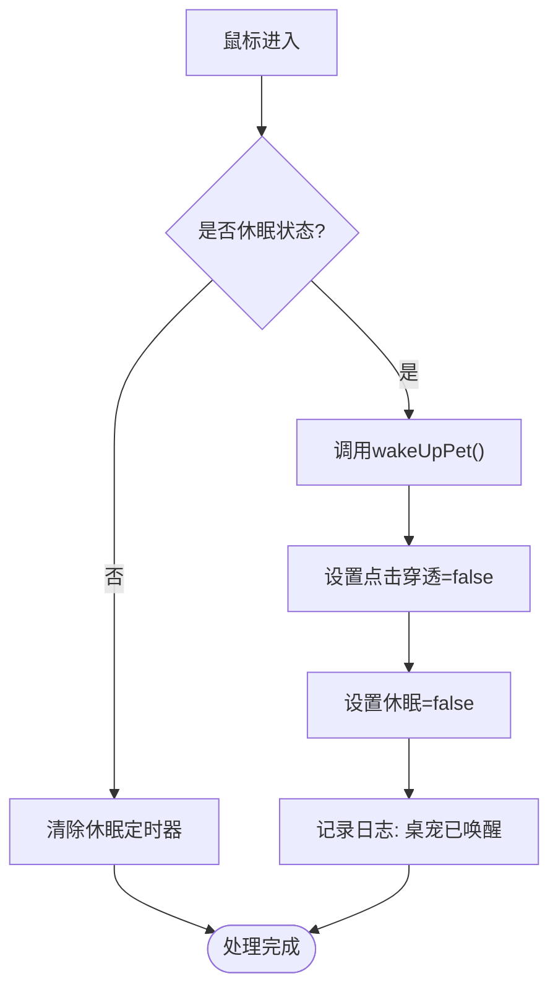

**图表来源**
- [PetComponent.tsx:69-78](file://src/components/PetComponent.tsx#L69-L78)

#### 休眠定时器管理

休眠定时器实现了优雅的自动休眠机制：

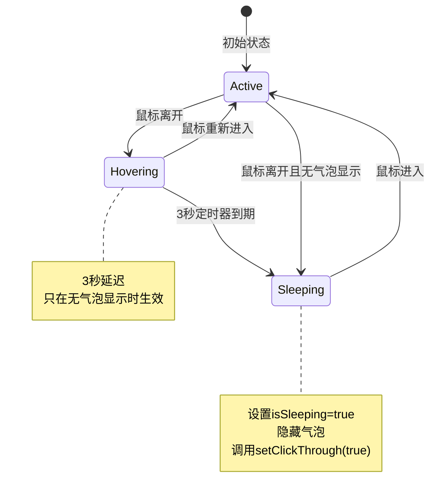

**图表来源**
- [PetComponent.tsx:80-87](file://src/components/PetComponent.tsx#L80-L87)

**章节来源**
- [PetComponent.tsx:69-87](file://src/components/PetComponent.tsx#L69-L87)

### 点击穿透状态管理

#### setClickThrough API工作原理

点击穿透状态管理是整个交互系统的核心机制：

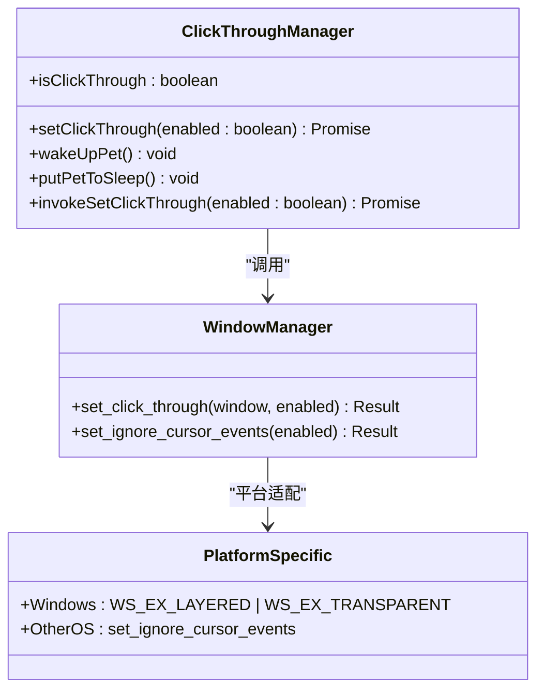

**图表来源**
- [PetComponent.tsx:36-47](file://src/components/PetComponent.tsx#L36-L47)
- [lib.rs:48-50](file://src-tauri/src/lib.rs#L48-L50)
- [window_utils.rs:9-32](file://src-tauri/src/window_utils.rs#L9-L32)

#### 状态同步机制

状态同步确保了前端和后端状态的一致性：

| 状态变更 | 前端更新 | 后端调用 | 同步验证 |
|---------|---------|---------|---------|
| setClickThrough(true) | setIsClickThrough(true) | invoke("set_click_through", true) | 窗口忽略事件 |
| setClickThrough(false) | setIsClickThrough(false) | invoke("set_click_through", false) | 窗口接收事件 |
| wakeUpPet() | setIsSleeping(false) | emit("pet://wake-up") | 通知所有监听者 |
| putPetToSleep() | setIsSleeping(true) | 调用setClickThrough(true) | 自动休眠 |

**章节来源**
- [PetComponent.tsx:36-62](file://src/components/PetComponent.tsx#L36-L62)
- [lib.rs:53-59](file://src-tauri/src/lib.rs#L53-L59)

### 气泡交互系统

#### 动态气泡布局算法

气泡采用圆形布局算法，实现了美观的视觉效果：

```mermaid
flowchart LR
subgraph "参数配置"
Count[N气泡数量]
Radius[半径=120px]
StartAngle[-90°]
end
subgraph "计算过程"
Angle[角度 = 360°/N * i - 90°]
Radians[弧度 = 角度 * π/180]
X[cos(弧度) * 半径]
Y[sin(弧度) * 半径]
end
subgraph "定位系统"
Center[容器中心]
Translate[translate(X,Y)]
Absolute[绝对定位]
end
Count --> Angle
Radius --> X
StartAngle --> Angle
Angle --> Radians
Radians --> X
Radians --> Y
X --> Translate
Y --> Translate
Center --> Absolute
Translate --> Absolute
```

**图表来源**
- [PetComponent.tsx:689-718](file://src/components/PetComponent.tsx#L689-L718)

**章节来源**
- [PetComponent.tsx:689-718](file://src/components/PetComponent.tsx#L689-L718)
- [bubbles.json:1-52](file://public/config/bubbles.json#L1-L52)

## 依赖关系分析

### 权限配置系统

系统采用细粒度的权限控制机制：

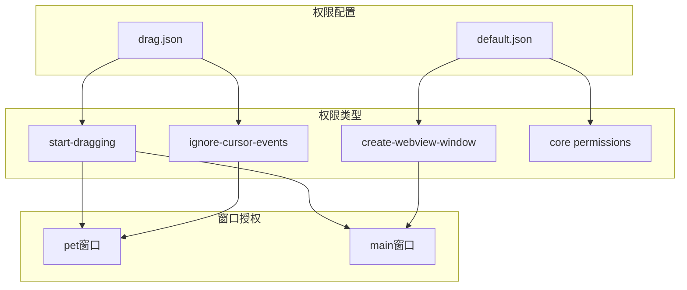

**图表来源**
- [drag.json:1-14](file://src-tauri/capabilities/drag.json#L1-L14)
- [default.json:1-12](file://src-tauri/capabilities/default.json#L1-L12)

### 命令系统架构

系统通过Tauri命令系统实现前后端通信：

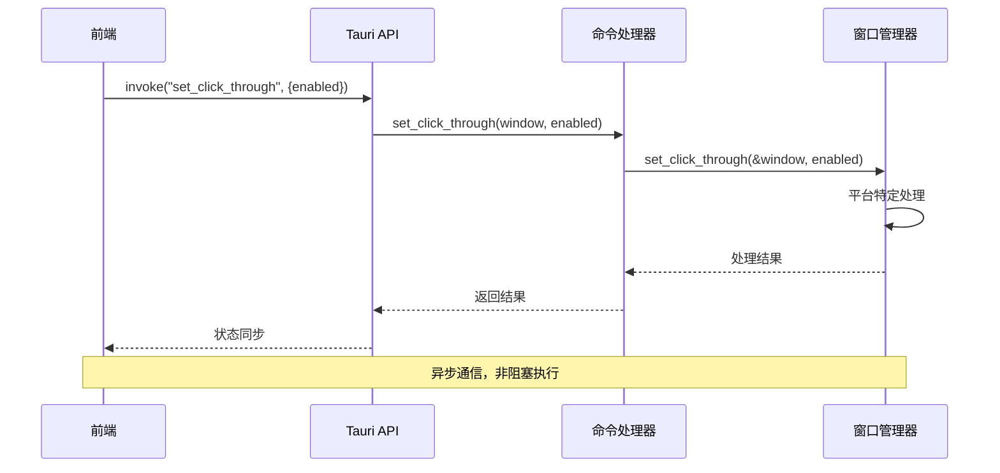

**图表来源**
- [lib.rs:48-50](file://src-tauri/src/lib.rs#L48-L50)
- [window_utils.rs:9-32](file://src-tauri/src/window_utils.rs#L9-L32)

**章节来源**
- [lib.rs:1-1109](file://src-tauri/src/lib.rs#L1-L1109)

## 性能考虑

### 事件处理优化

系统在多个层面实现了性能优化：

1. **事件节流**：使用ref变量避免不必要的状态更新
2. **内存管理**：及时清理定时器和事件监听器
3. **计算优化**：使用Math.hypot替代手动平方根计算
4. **DOM操作最小化**：批量更新状态变量

### 内存泄漏防护

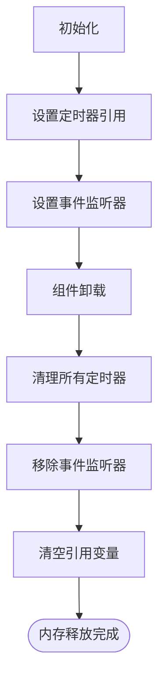

**图表来源**
- [PetComponent.tsx:194-196](file://src/components/PetComponent.tsx#L194-L196)
- [PetComponent.tsx:217-222](file://src/components/PetComponent.tsx#L217-L222)

### 响应式优化建议

1. **阈值调整**：根据用户反馈调整DRAG_THRESHOLD值
2. **动画性能**：使用transform而非改变布局属性
3. **事件委托**：考虑使用事件委托减少监听器数量
4. **缓存策略**：缓存计算结果避免重复计算

## 故障排除指南

### 常见问题诊断

#### 拖拽功能异常

**症状**：宠物无法拖拽或拖拽不灵敏

**排查步骤**：
1. 检查DRAG_THRESHOLD值是否合理
2. 验证Pointer Events支持情况
3. 确认setPointerCapture调用成功
4. 检查startDragging API调用权限

**解决方案**：
- 调整阈值检测算法
- 实现降级方案支持传统鼠标事件
- 添加详细的错误日志

#### 双击检测失效

**症状**：双击无法唤醒宠物

**排查步骤**：
1. 检查clickCount计数器状态
2. 验证doubleClickTimer定时器
3. 确认preventDefault和stopPropagation调用
4. 测试不同浏览器兼容性

**解决方案**：
- 实现更精确的时间戳检测
- 添加双击检测状态机
- 提供用户可配置的双击间隔

#### 点击穿透问题

**症状**：宠物休眠状态下仍可接收点击事件

**排查步骤**：
1. 检查setClickThrough API调用结果
2. 验证平台特定的窗口属性设置
3. 确认事件忽略机制正常工作
4. 测试不同操作系统的行为差异

**解决方案**：
- 实现平台特定的回退机制
- 添加状态同步验证
- 提供手动重置功能

### 调试方法

#### 开发者工具使用

1. **React DevTools**：监控组件状态变化
2. **浏览器开发者工具**：检查事件监听器和定时器
3. **Tauri Inspector**：调试后端命令调用
4. **系统事件监视器**：观察原生窗口事件

#### 日志记录策略

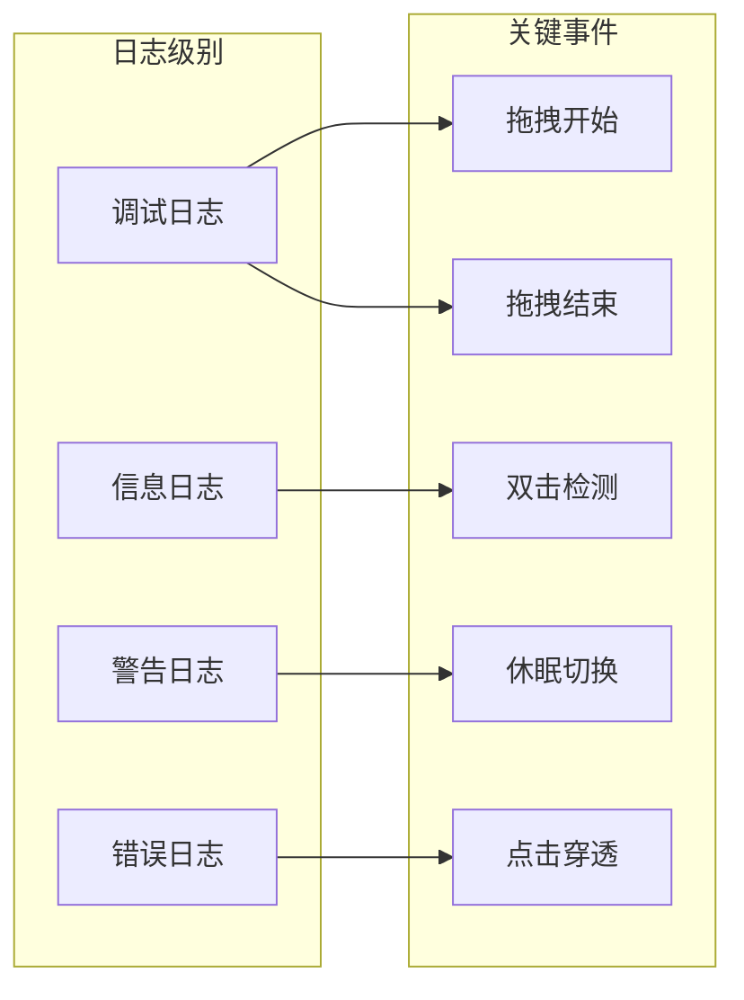

**章节来源**
- [PetComponent.tsx:43](file://src/components/PetComponent.tsx#L43)
- [PetComponent.tsx:53](file://src/components/PetComponent.tsx#L53)
- [PetComponent.tsx:61](file://src/components/PetComponent.tsx#L61)

## 结论

桌面宠物交互机制展现了现代前端开发的最佳实践，通过精心设计的状态管理、事件处理和平台适配，实现了流畅自然的用户体验。系统的主要优势包括：

1. **响应式设计**：采用现代Pointer Events API，提供一致的跨平台体验
2. **状态一致性**：完善的前后端状态同步机制，确保行为可预测
3. **性能优化**：多层优化策略，包括事件节流、内存管理和计算优化
4. **可维护性**：清晰的架构设计和模块化组织，便于后续扩展

未来可以考虑的改进方向：
- 添加手势识别支持
- 实现更丰富的动画效果
- 增强无障碍访问功能
- 扩展到更多平台支持