# 宠物状态管理

<cite>
**本文档引用的文件**
- [PetComponent.tsx](file://src/components/PetComponent.tsx)
- [PetComponent.css](file://src/components/PetComponent.css)
- [bubbles.json](file://public/config/bubbles.json)
- [lib.rs](file://src-tauri/src/lib.rs)
- [App.tsx](file://src/App.tsx)
- [main.tsx](file://src/main.tsx)
</cite>

## 目录
1. [简介](#简介)
2. [项目结构](#项目结构)
3. [核心组件](#核心组件)
4. [架构概览](#架构概览)
5. [详细组件分析](#详细组件分析)
6. [依赖关系分析](#依赖关系分析)
7. [性能考虑](#性能考虑)
8. [故障排除指南](#故障排除指南)
9. [结论](#结论)

## 简介

宠物状态管理系统是一个基于React和Tauri构建的桌面宠物应用，实现了智能的状态切换机制。该系统支持活跃状态和休眠状态之间的无缝切换，包含自动休眠机制、手动唤醒方式以及完善的视觉反馈系统。

系统的核心特性包括：
- 自动休眠机制（鼠标离开3秒后休眠）
- 手动唤醒方式（鼠标进入、双击唤醒）
- 状态标志位管理（isSleeping、isClickThrough）
- CSS类名切换和视觉反馈
- 透明覆盖层检测机制
- 生命周期管理（sleepTimer、doubleClickTimer）

## 项目结构

该项目采用前后端分离的架构设计，主要分为以下层次：

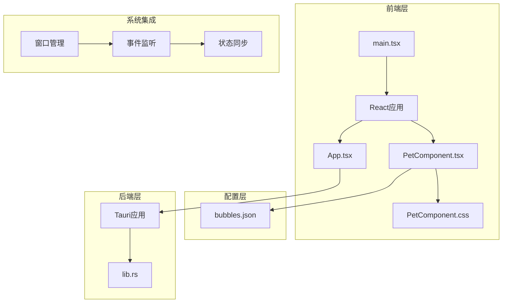

**图表来源**
- [PetComponent.tsx:1-819](file://src/components/PetComponent.tsx#L1-L819)
- [App.tsx:1-60](file://src/App.tsx#L1-L60)
- [lib.rs:1-1113](file://src-tauri/src/lib.rs#L1-L1113)

**章节来源**
- [PetComponent.tsx:1-819](file://src/components/PetComponent.tsx#L1-L819)
- [App.tsx:18-58](file://src/App.tsx#L18-L58)
- [main.tsx:1-10](file://src/main.tsx#L1-L10)

## 核心组件

### 状态管理核心

系统的核心状态管理由以下关键组件构成：

| 组件 | 类型 | 功能描述 |
|------|------|----------|
| isSleeping | 布尔值 | 宠物休眠状态标志位 |
| isClickThrough | 布尔值 | 点击穿透状态标志位 |
| sleepTimer | Ref | 休眠延迟计时器 |
| doubleClickTimer | Ref | 双击检测计时器 |
| hideTimer | Ref | 气泡隐藏计时器 |

### 状态切换流程

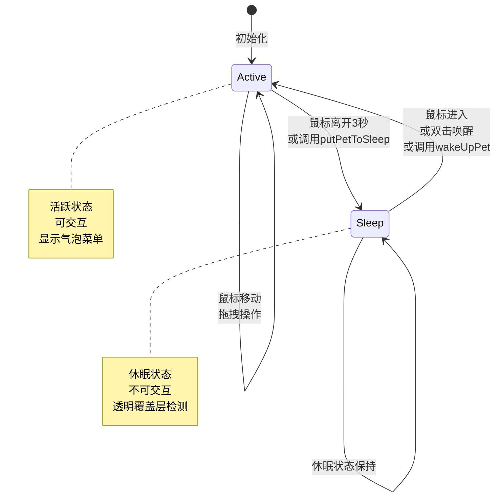

**图表来源**
- [PetComponent.tsx:49-87](file://src/components/PetComponent.tsx#L49-L87)

**章节来源**
- [PetComponent.tsx:20-30](file://src/components/PetComponent.tsx#L20-L30)
- [PetComponent.tsx:49-87](file://src/components/PetComponent.tsx#L49-L87)

## 架构概览

系统采用分层架构设计，实现了前后端的清晰分离：

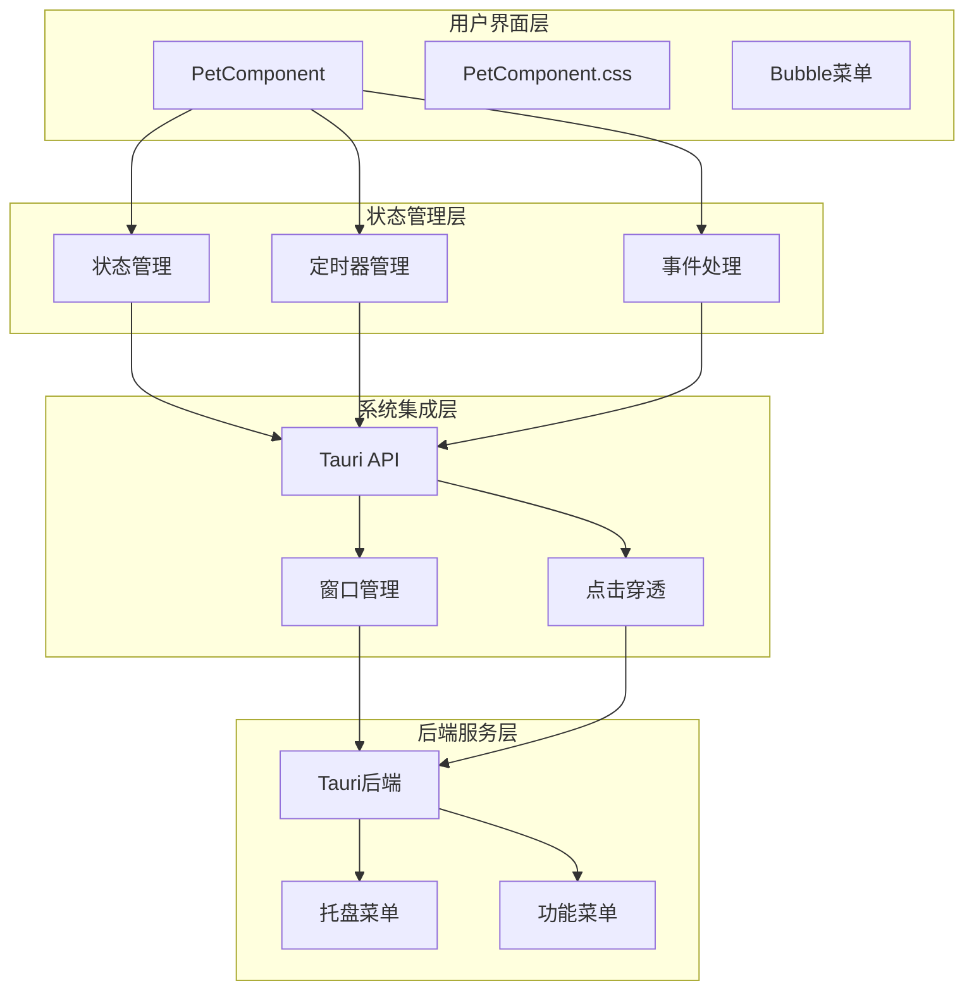

**图表来源**
- [PetComponent.tsx:19-819](file://src/components/PetComponent.tsx#L19-L819)
- [lib.rs:48-59](file://src-tauri/src/lib.rs#L48-L59)

## 详细组件分析

### 状态标志位管理

#### isSleeping标志位

`isSleeping`是系统的核心状态标志位，控制着宠物的激活/休眠状态：

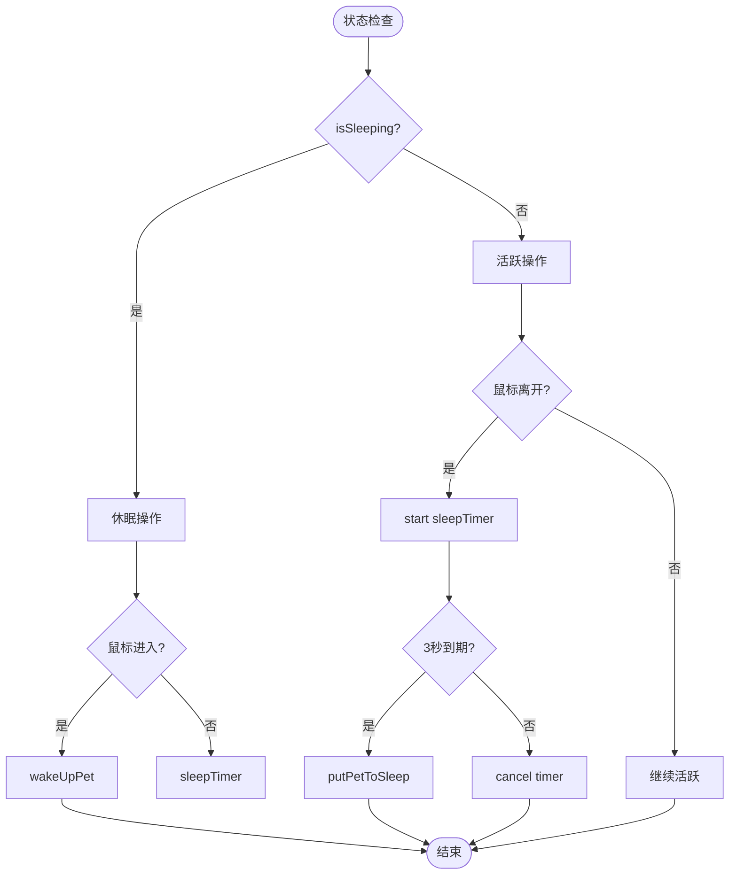

**图表来源**
- [PetComponent.tsx:69-87](file://src/components/PetComponent.tsx#L69-L87)
- [PetComponent.tsx:49-62](file://src/components/PetComponent.tsx#L49-L62)

#### isClickThrough标志位

`isClickThrough`控制着窗口的点击穿透行为：

| 状态 | 行为 | 视觉效果 |
|------|------|----------|
| true | 点击穿透 | 透明覆盖层 |
| false | 点击拦截 | 正常交互 |

**章节来源**
- [PetComponent.tsx:36-47](file://src/components/PetComponent.tsx#L36-L47)
- [PetComponent.tsx:50-62](file://src/components/PetComponent.tsx#L50-L62)

### CSS类名切换机制

系统通过动态类名切换实现视觉状态反馈：

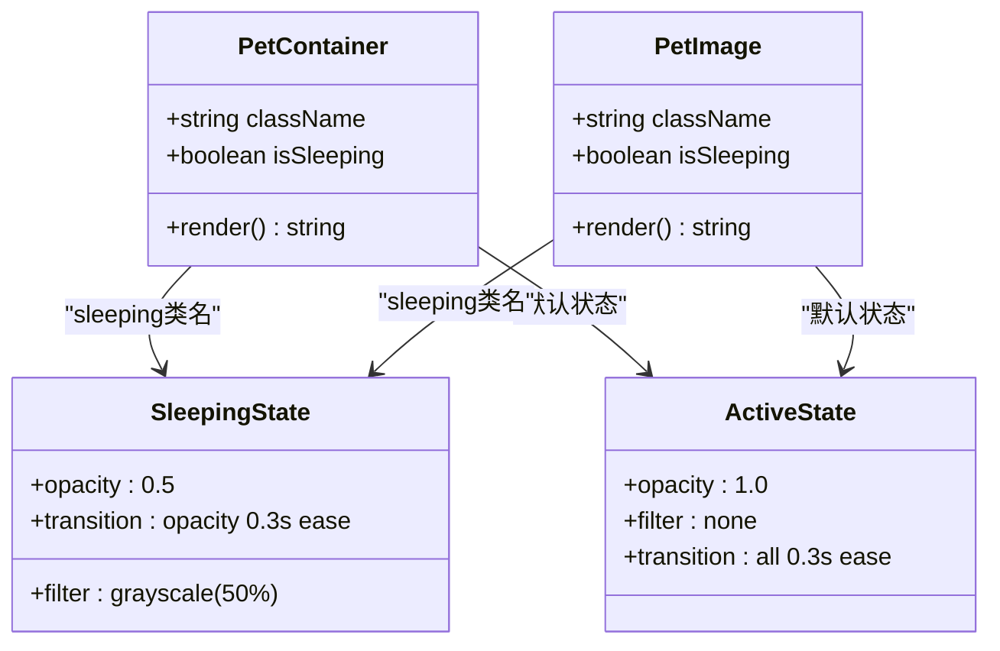

**图表来源**
- [PetComponent.css:101-105](file://src/components/PetComponent.css#L101-L105)
- [PetComponent.tsx:790-803](file://src/components/PetComponent.tsx#L790-L803)

**章节来源**
- [PetComponent.css:101-105](file://src/components/PetComponent.css#L101-L105)
- [PetComponent.tsx:790-803](file://src/components/PetComponent.tsx#L790-L803)

### 自动休眠机制

#### 鼠标离开检测

自动休眠机制通过鼠标事件监听实现：

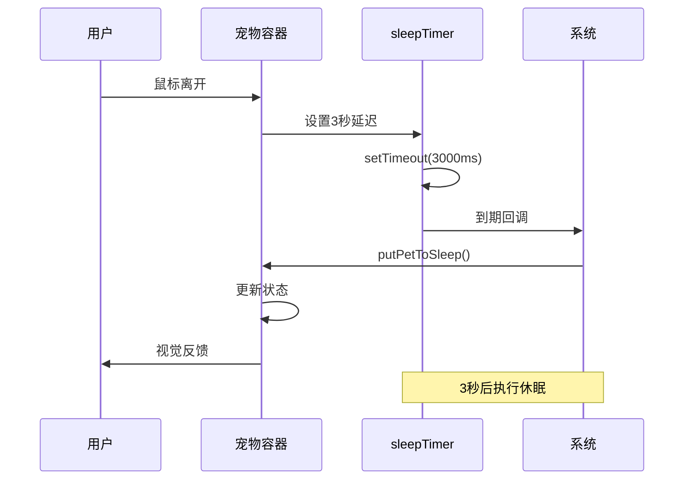

**图表来源**
- [PetComponent.tsx:80-87](file://src/components/PetComponent.tsx#L80-L87)

#### 休眠定时器生命周期

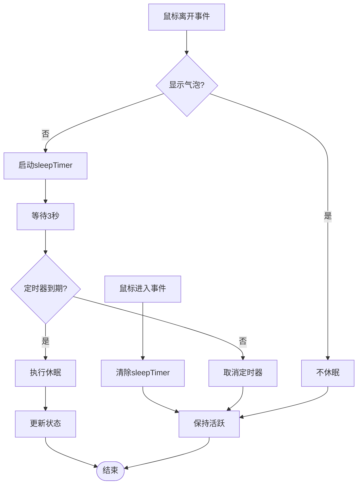

**图表来源**
- [PetComponent.tsx:70-87](file://src/components/PetComponent.tsx#L70-L87)

**章节来源**
- [PetComponent.tsx:70-87](file://src/components/PetComponent.tsx#L70-L87)

### 手动唤醒方式

#### 鼠标进入事件处理

鼠标进入事件是最重要的手动唤醒方式：

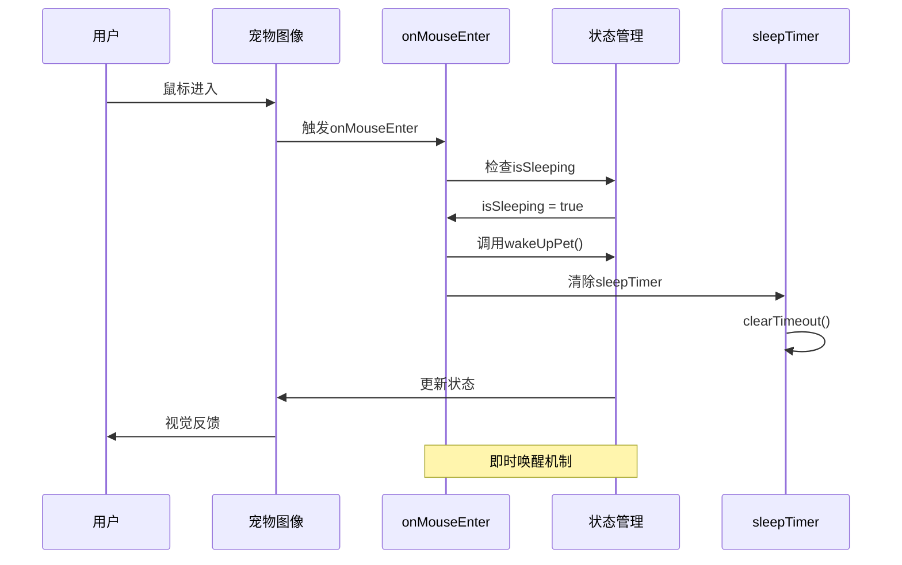

**图表来源**
- [PetComponent.tsx:69-78](file://src/components/PetComponent.tsx#L69-L78)

#### wakeUpPet函数调用

wakeUpPet函数负责完整的状态重置：

| 步骤 | 操作 | 影响 |
|------|------|------|
| 1 | setClickThrough(false) | 关闭点击穿透 |
| 2 | setIsSleeping(false) | 设置非休眠状态 |
| 3 | 清除sleepTimer | 取消自动休眠 |
| 4 | 控制台输出日志 | 状态变更记录 |

**章节来源**
- [PetComponent.tsx:49-54](file://src/components/PetComponent.tsx#L49-L54)
- [PetComponent.tsx:69-78](file://src/components/PetComponent.tsx#L69-L78)

### 休眠状态下的特殊处理

#### 透明覆盖层检测

休眠状态下通过透明覆盖层实现双击唤醒：

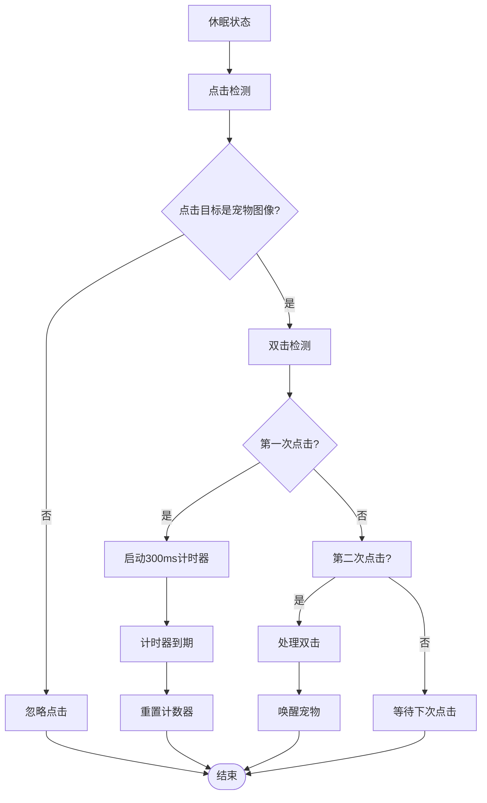

**图表来源**
- [PetComponent.tsx:90-111](file://src/components/PetComponent.tsx#L90-L111)

#### 双击唤醒机制

双击检测实现细节：

| 参数 | 值 | 作用 |
|------|----|------|
| clickCount | Ref | 记录点击次数 |
| doubleClickTimer | Ref | 双击检测计时器 |
| 300ms阈值 | 300ms | 双击时间间隔 |

**章节来源**
- [PetComponent.tsx:90-111](file://src/components/PetComponent.tsx#L90-L111)

### 视觉反馈机制

#### CSS动画效果

系统提供了丰富的CSS动画效果：

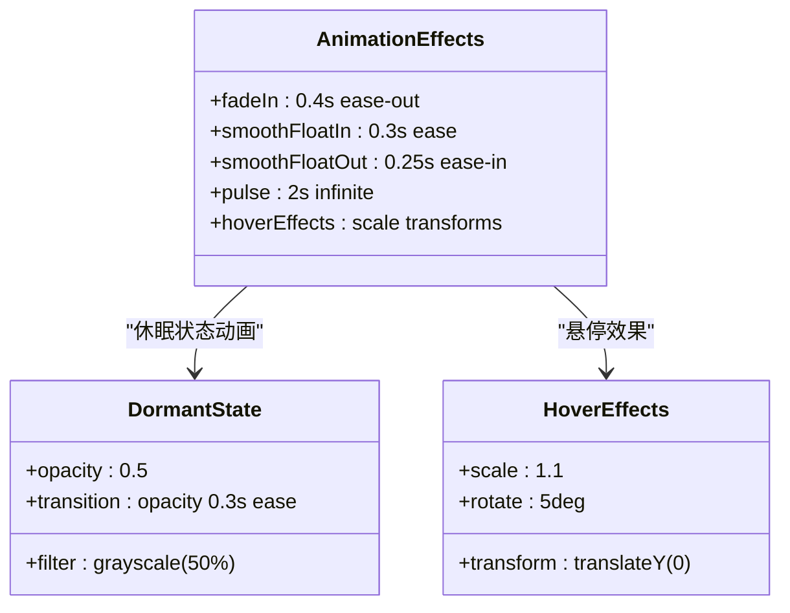

**图表来源**
- [PetComponent.css:89-141](file://src/components/PetComponent.css#L89-L141)
- [PetComponent.css:101-105](file://src/components/PetComponent.css#L101-L105)

**章节来源**
- [PetComponent.css:89-141](file://src/components/PetComponent.css#L89-L141)
- [PetComponent.css:101-105](file://src/components/PetComponent.css#L101-L105)

## 依赖关系分析

### 前端依赖关系

```mermaid
graph TB
subgraph "PetComponent.tsx"
A[React Hooks]
B[事件处理器]
C[定时器管理]
D[状态管理]
end
subgraph "外部依赖"
E[@tauri-apps/api]
F[WebviewWindow]
G[bubbles.json]
end
subgraph "样式依赖"
H[PetComponent.css]
I[CSS动画]
J[类名切换]
end
A --> E
B --> E
C --> E
D --> E
E --> F
G --> A
H --> I
H --> J
```

**图表来源**
- [PetComponent.tsx:1-7](file://src/components/PetComponent.tsx#L1-L7)
- [PetComponent.tsx:5-6](file://src/components/PetComponent.tsx#L5-L6)

### 后端集成

系统与Tauri后端的集成点：

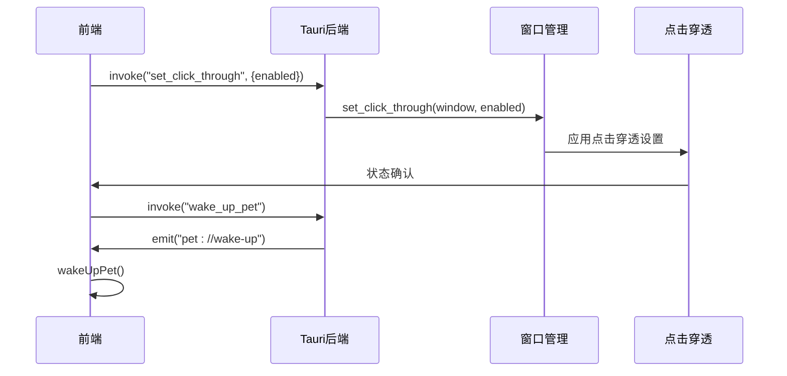

**图表来源**
- [PetComponent.tsx:36-47](file://src/components/PetComponent.tsx#L36-L47)
- [lib.rs:48-59](file://src-tauri/src/lib.rs#L48-L59)

**章节来源**
- [PetComponent.tsx:36-47](file://src/components/PetComponent.tsx#L36-L47)
- [lib.rs:48-59](file://src-tauri/src/lib.rs#L48-L59)

## 性能考虑

### 内存管理

系统采用了高效的内存管理模式：

| 管理策略 | 实现方式 | 效果 |
|----------|----------|------|
| 定时器清理 | useEffect返回清理函数 | 防止内存泄漏 |
| 引用优化 | useRef替代useState | 减少不必要的重渲染 |
| 事件监听 | 组件卸载时清理 | 避免重复监听 |

### 性能优化建议

1. **定时器优化**
   - 合并相似的定时器操作
   - 实施定时器去抖动机制

2. **状态更新优化**
   - 使用useMemo缓存计算结果
   - 避免频繁的状态切换

3. **事件处理优化**
   - 实施事件节流机制
   - 优化事件监听器的注册和注销

## 故障排除指南

### 常见问题及解决方案

#### 休眠状态无法唤醒

**问题症状**：鼠标进入宠物区域但无反应

**可能原因**：
1. sleepTimer未正确清除
2. isSleeping状态异常
3. 事件监听器失效

**解决方案**：
```typescript
// 检查定时器状态
if (sleepTimer.current) {
    clearTimeout(sleepTimer.current);
    sleepTimer.current = null;
}

// 验证状态标志
console.log('isSleeping:', isSleeping);
console.log('isClickThrough:', isClickThrough);
```

#### 双击唤醒失效

**问题症状**：双击宠物图像无响应

**可能原因**：
1. 双击计时器冲突
2. 事件冒泡阻止
3. 图像元素检测失败

**解决方案**：
```typescript
// 确保只在宠物图像上响应双击
if ((e.target as HTMLElement).classList.contains('pet-image')) {
    // 双击检测逻辑
}
```

#### CSS类名切换异常

**问题症状**：休眠状态视觉效果不正确

**可能原因**：
1. 类名拼接错误
2. CSS样式覆盖
3. 动画冲突

**解决方案**：
```css
/* 确保正确的类名映射 */
.pet-container.sleeping .pet-image {
    opacity: 0.5;
    filter: grayscale(50%);
}
```

**章节来源**
- [PetComponent.tsx:90-111](file://src/components/PetComponent.tsx#L90-L111)
- [PetComponent.tsx:69-78](file://src/components/PetComponent.tsx#L69-L78)

## 结论

宠物状态管理系统通过精心设计的状态管理机制，实现了智能的活跃/休眠切换。系统的关键优势包括：

1. **智能自动休眠**：基于鼠标离开检测的3秒延时机制
2. **多维度唤醒方式**：支持鼠标进入、双击等多种唤醒方式
3. **完善的视觉反馈**：通过CSS类名切换和动画效果提供直观的状态指示
4. **健壮的状态管理**：使用ref和effect确保状态的一致性和可靠性
5. **前后端协同**：通过Tauri API实现窗口级别的状态控制

该系统为桌面宠物应用提供了可靠的状态管理基础，其设计理念和实现模式可以作为类似应用开发的参考模板。