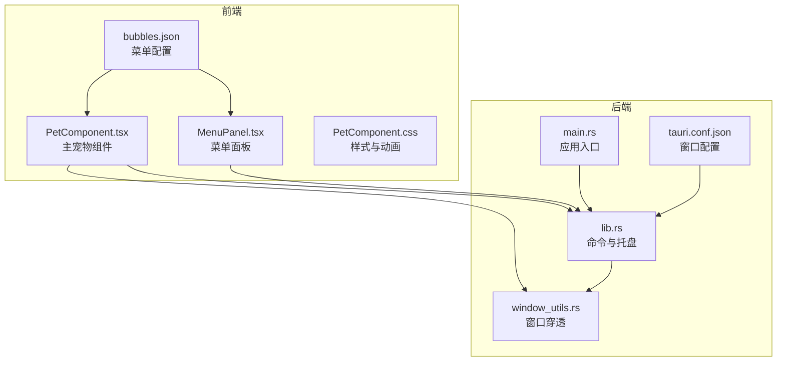
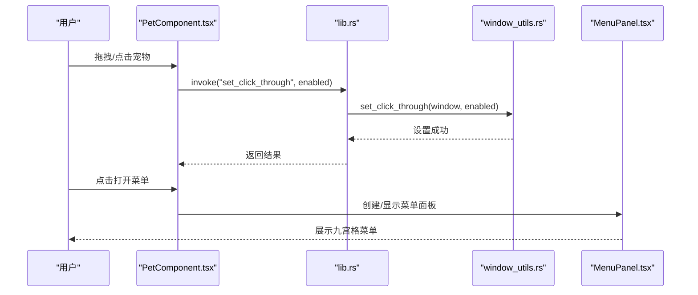
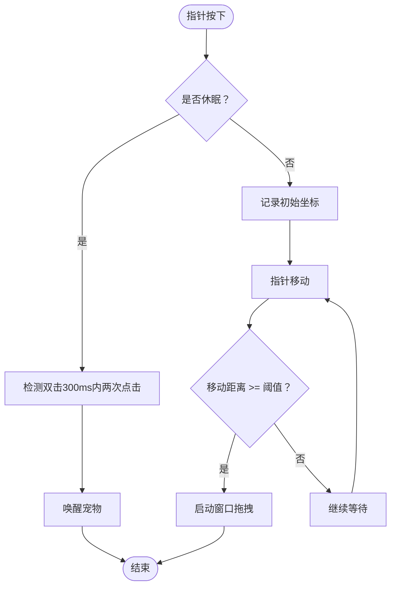
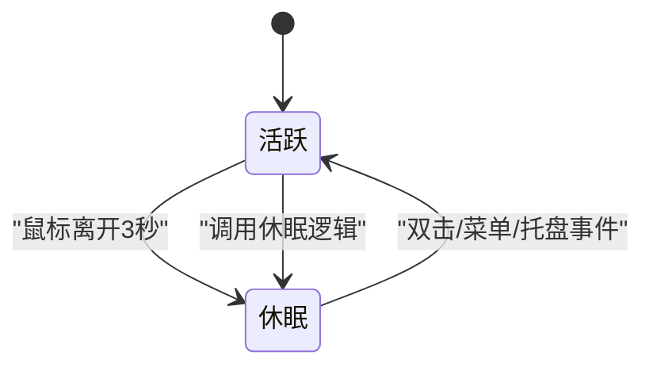
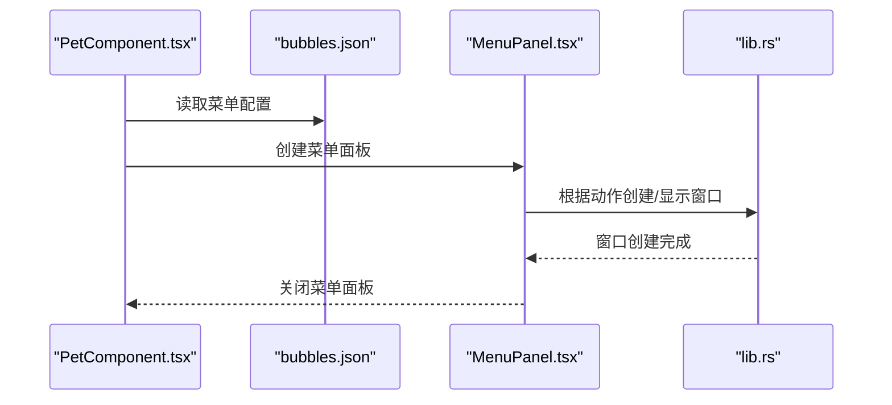
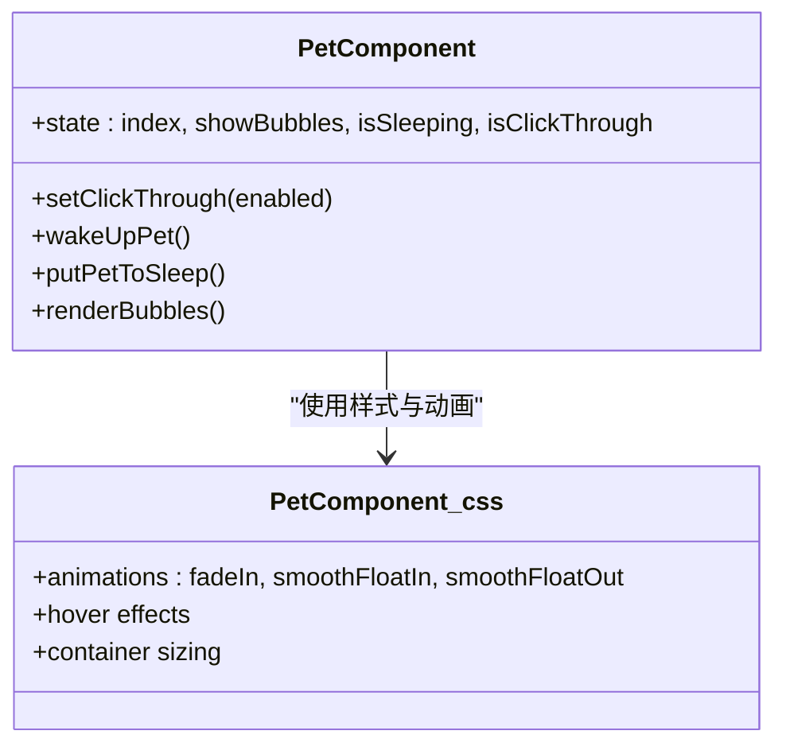
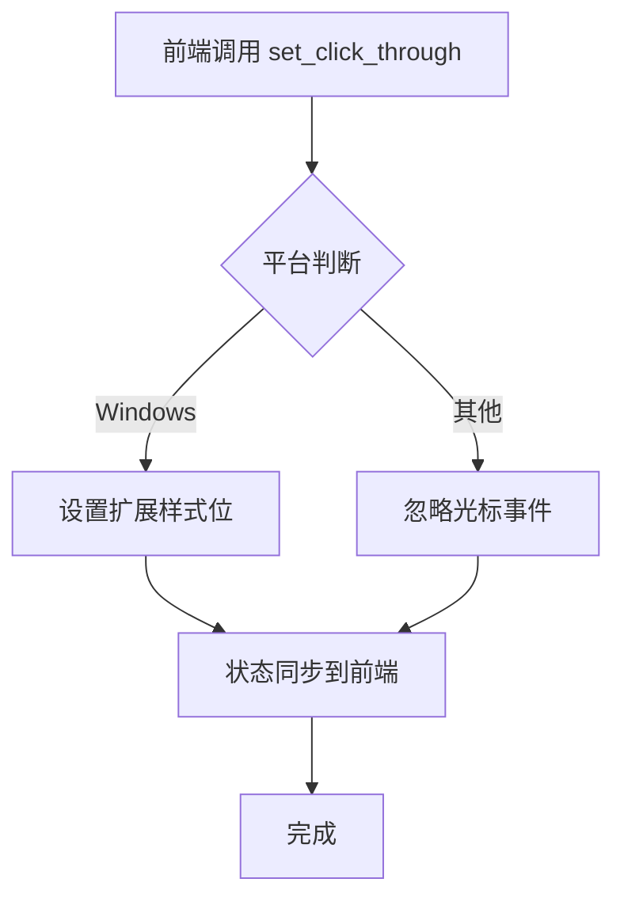
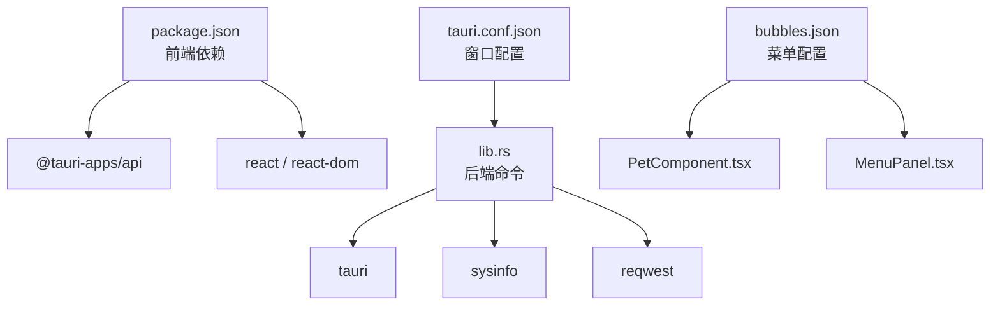

# 桌面宠物系统

<cite>
**本文档引用的文件**
- [README.md](file://README.md)
- [PetComponent.tsx](file://src/components/PetComponent.tsx)
- [PetComponent.css](file://src/components/PetComponent.css)
- [MenuPanel.tsx](file://src/components/MenuPanel.tsx)
- [bubbles.json](file://public/config/bubbles.json)
- [lib.rs](file://src-tauri/src/lib.rs)
- [main.rs](file://src-tauri/src/main.rs)
- [tauri.conf.json](file://src-tauri/tauri.conf.json)
- [window_utils.rs](file://src-tauri/src/window_utils.rs)
- [package.json](file://package.json)
</cite>

## 目录
1. [简介](#简介)
2. [项目结构](#项目结构)
3. [核心组件](#核心组件)
4. [架构总览](#架构总览)
5. [详细组件分析](#详细组件分析)
6. [依赖关系分析](#依赖关系分析)
7. [性能考虑](#性能考虑)
8. [故障排除指南](#故障排除指南)
9. [结论](#结论)
10. [附录](#附录)

## 简介
本项目为基于 Rust 与 Tauri 2 的桌面宠物系统，提供可拖拽的桌面动画角色、功能菜单、托盘交互以及多窗口管理能力。系统支持两种核心状态：活跃状态（可拖拽、可交互）与休眠状态（点击穿透、不影响其他应用操作）。本文档围绕以下主题进行深入说明：
- 可拖拽功能的实现原理与边界检测算法
- 状态管理（活跃/休眠）切换逻辑、自动休眠机制与手动唤醒方式
- 气泡菜单系统的实现（菜单项配置、定位算法、交互逻辑）
- 动画系统（精灵图切换、帧动画控制、性能优化策略）
- 窗口穿透机制（休眠状态下保持可见性）
- 行为定制选项（移动速度、动画效果、交互响应）
- 常见问题调试与解决方案

## 项目结构
前端采用 React + TypeScript，后端使用 Rust（Tauri 2），通过命令调用实现前后端通信。核心文件分布如下：
- 前端组件：PetComponent.tsx（主宠物）、MenuPanel.tsx（菜单面板）
- 配置文件：bubbles.json（菜单项配置）
- 样式文件：PetComponent.css（动画与交互样式）
- 后端：lib.rs（命令与托盘逻辑）、window_utils.rs（窗口穿透实现）、tauri.conf.json（窗口配置）

**图表来源**
- [PetComponent.tsx:1-749](file://src/components/PetComponent.tsx#L1-L749)
- [MenuPanel.tsx:1-295](file://src/components/MenuPanel.tsx#L1-L295)
- [PetComponent.css:1-242](file://src/components/PetComponent.css#L1-L242)
- [bubbles.json:1-52](file://public/config/bubbles.json#L1-L52)
- [lib.rs:1-998](file://src-tauri/src/lib.rs#L1-L998)
- [window_utils.rs:1-33](file://src-tauri/src/window_utils.rs#L1-L33)
- [main.rs:1-11](file://src-tauri/src/main.rs#L1-L11)
- [tauri.conf.json:1-74](file://src-tauri/tauri.conf.json#L1-L74)

**章节来源**
- [README.md:129-168](file://README.md#L129-L168)
- [package.json:1-29](file://package.json#L1-L29)

## 核心组件
- 主宠物组件（PetComponent.tsx）：负责拖拽、状态切换、菜单弹出、窗口管理与事件监听。
- 菜单面板（MenuPanel.tsx）：根据配置动态渲染九宫格菜单，创建并管理功能窗口。
- 窗口穿透（window_utils.rs）：在 Windows 上通过扩展样式位实现点击穿透，在非 Windows 平台通过忽略光标事件实现。
- 托盘与命令（lib.rs）：托盘菜单事件处理、窗口命令（如 set_click_through、hide_to_tray、wake_up_pet）。

**章节来源**
- [PetComponent.tsx:1-749](file://src/components/PetComponent.tsx#L1-L749)
- [MenuPanel.tsx:1-295](file://src/components/MenuPanel.tsx#L1-L295)
- [window_utils.rs:1-33](file://src-tauri/src/window_utils.rs#L1-L33)
- [lib.rs:44-56](file://src-tauri/src/lib.rs#L44-L56)

## 架构总览
系统采用“主宠物窗口 + 多功能子窗口”的多窗口架构。主宠物窗口始终存在，功能窗口按需创建并在关闭时销毁。前后端通过 Tauri 的 invoke 机制通信，后端提供窗口穿透、托盘、系统信息等命令。

**图表来源**
- [PetComponent.tsx:36-47](file://src/components/PetComponent.tsx#L36-L47)
- [lib.rs:44-47](file://src-tauri/src/lib.rs#L44-L47)
- [window_utils.rs:9-32](file://src-tauri/src/window_utils.rs#L9-L32)
- [MenuPanel.tsx:1-295](file://src/components/MenuPanel.tsx#L1-L295)

## 详细组件分析

### 可拖拽功能与边界检测
- 拖拽触发条件：指针按下时记录初始坐标，移动距离超过阈值（DRAG_THRESHOLD）后启动窗口拖拽。
- 边界检测：通过窗口拖拽 API 触发系统级拖拽，边界由操作系统窗口管理器处理。
- 休眠状态下的交互：休眠时仅在宠物图片区域响应双击唤醒，阻止事件穿透。

**图表来源**
- [PetComponent.tsx:89-127](file://src/components/PetComponent.tsx#L89-L127)

**章节来源**
- [PetComponent.tsx:26-127](file://src/components/PetComponent.tsx#L26-L127)

### 状态管理（活跃/休眠）
- 休眠状态：启用点击穿透，宠物不可拖拽，不影响其他应用操作；容器类名包含 sleeping。
- 自动休眠：鼠标离开宠物且未显示菜单时，延时 3 秒进入休眠。
- 手动唤醒：双击休眠中的宠物、点击功能菜单、或通过托盘事件唤醒。
- 状态切换：set_click_through 命令在后端设置窗口穿透，并同步前端状态。

**图表来源**
- [PetComponent.tsx:49-87](file://src/components/PetComponent.tsx#L49-L87)
- [lib.rs:49-56](file://src-tauri/src/lib.rs#L49-L56)

**章节来源**
- [PetComponent.tsx:19-87](file://src/components/PetComponent.tsx#L19-L87)
- [lib.rs:49-56](file://src-tauri/src/lib.rs#L49-L56)

### 气泡菜单系统
- 菜单项配置：来源于 bubbles.json，包含标签、动作与图标。
- 菜单定位：九宫格布局，中心点固定，按等角度分布，半径可调。
- 交互逻辑：点击菜单项后创建或显示对应功能窗口，关闭菜单面板。

**图表来源**
- [PetComponent.tsx:32-718](file://src/components/PetComponent.tsx#L32-L718)
- [MenuPanel.tsx:14-259](file://src/components/MenuPanel.tsx#L14-L259)
- [bubbles.json:1-52](file://public/config/bubbles.json#L1-L52)

**章节来源**
- [PetComponent.tsx:32-718](file://src/components/PetComponent.tsx#L32-L718)
- [MenuPanel.tsx:14-259](file://src/components/MenuPanel.tsx#L14-L259)
- [bubbles.json:1-52](file://public/config/bubbles.json#L1-L52)

### 动画系统
- 精灵图切换：通过 actions 数组循环切换图片路径，点击宠物时递增索引。
- 帧动画控制：使用 CSS 动画（fadeIn/smoothFloatIn/smoothFloatOut）实现菜单气泡的出现/消失效果。
- 性能优化：菜单气泡使用 pointer-events:none 控制事件穿透，避免影响底层窗口；容器扩大感应区域以提升拖拽体验。

**图表来源**
- [PetComponent.tsx:9-13](file://src/components/PetComponent.tsx#L9-L13)
- [PetComponent.css:40-170](file://src/components/PetComponent.css#L40-L170)

**章节来源**
- [PetComponent.tsx:9-13](file://src/components/PetComponent.tsx#L9-L13)
- [PetComponent.css:40-170](file://src/components/PetComponent.css#L40-L170)

### 窗口穿透机制
- Windows 实现：通过设置窗口扩展样式位（WS_EX_LAYERED | WS_EX_TRANSPARENT）实现点击穿透。
- 非 Windows 实现：通过忽略光标事件（set_ignore_cursor_events）实现相同效果。
- 状态同步：前端调用 set_click_through 命令，后端执行平台特定设置。

**图表来源**
- [PetComponent.tsx:36-47](file://src/components/PetComponent.tsx#L36-L47)
- [lib.rs:44-47](file://src-tauri/src/lib.rs#L44-L47)
- [window_utils.rs:9-32](file://src-tauri/src/window_utils.rs#L9-L32)

**章节来源**
- [window_utils.rs:1-33](file://src-tauri/src/window_utils.rs#L1-L33)
- [lib.rs:44-47](file://src-tauri/src/lib.rs#L44-L47)

### 行为定制选项
- 移动速度：通过 DRAG_THRESHOLD 控制拖拽触发灵敏度（当前值较低以提升响应速度）。
- 动画效果：可通过调整 CSS 动画参数（时长、缓动、延迟）定制菜单气泡出现/消失效果。
- 交互响应：菜单项动作映射到具体窗口创建逻辑，可在 MenuPanel.tsx 中扩展新动作。

**章节来源**
- [PetComponent.tsx:26-139](file://src/components/PetComponent.tsx#L26-L139)
- [MenuPanel.tsx:90-259](file://src/components/MenuPanel.tsx#L90-L259)

## 依赖关系分析
- 前端依赖：@tauri-apps/api（窗口、事件、调用）、React、TypeScript。
- 后端依赖：Tauri（命令、托盘、窗口管理）、sysinfo（系统信息）、reqwest（网络请求）。
- 配置依赖：bubbles.json（菜单项）、tauri.conf.json（窗口属性）。

**图表来源**
- [package.json:12-28](file://package.json#L12-L28)
- [lib.rs:1-36](file://src-tauri/src/lib.rs#L1-L36)
- [tauri.conf.json:13-51](file://src-tauri/tauri.conf.json#L13-L51)
- [bubbles.json:1-52](file://public/config/bubbles.json#L1-L52)

**章节来源**
- [package.json:12-28](file://package.json#L12-L28)
- [lib.rs:1-36](file://src-tauri/src/lib.rs#L1-L36)
- [tauri.conf.json:13-51](file://src-tauri/tauri.conf.json#L13-L51)

## 性能考虑
- 动画性能：菜单气泡使用 CSS 动画而非 JavaScript 帧动画，减少主线程压力。
- 事件穿透：通过点击穿透避免不必要的事件处理，降低系统开销。
- 窗口管理：窗口按需创建与销毁，避免常驻实例占用资源。
- 系统监控：系统信息采集与剪贴板监控采用异步任务与错误重试，防止阻塞主线程。

[本节为通用性能建议，无需特定文件引用]

## 故障排除指南
- 拖拽无效
  - 检查是否处于休眠状态（休眠时不响应拖拽）。
  - 确认 DRAG_THRESHOLD 是否过大导致误判。
- 点击穿透异常
  - Windows 平台确认扩展样式位设置是否成功。
  - 非 Windows 平台确认忽略光标事件是否生效。
- 菜单不显示
  - 检查 bubbles.json 配置是否正确。
  - 确认 MenuPanel.tsx 的窗口创建逻辑是否抛出异常。
- 托盘唤醒无效
  - 检查托盘事件监听与 wake_up_pet 命令是否正常注册。
- 窗口创建超时
  - 查看 tauri://error 事件，确认窗口 URL 与配置是否正确。

**章节来源**
- [PetComponent.tsx:186-196](file://src/components/PetComponent.tsx#L186-L196)
- [MenuPanel.tsx:67-87](file://src/components/MenuPanel.tsx#L67-L87)
- [lib.rs:840-884](file://src-tauri/src/lib.rs#L840-L884)

## 结论
桌面宠物系统通过清晰的前后端分层与多窗口架构，实现了可拖拽、可交互、可穿透的桌面角色。其状态管理、菜单系统与动画机制均围绕用户体验与性能优化展开。通过配置文件与命令扩展，系统具备良好的可定制性与可维护性。

[本节为总结性内容，无需特定文件引用]

## 附录

### 窗口配置要点
- 主宠物窗口：透明、无装饰、始终置顶、跳过任务栏。
- 功能窗口：按需创建，透明、无装饰、可设置尺寸与居中。

**章节来源**
- [tauri.conf.json:13-43](file://src-tauri/tauri.conf.json#L13-L43)

### 菜单项配置示例
- 菜单项包含标签、动作与图标，动作映射到具体窗口创建逻辑。

**章节来源**
- [bubbles.json:1-52](file://public/config/bubbles.json#L1-L52)