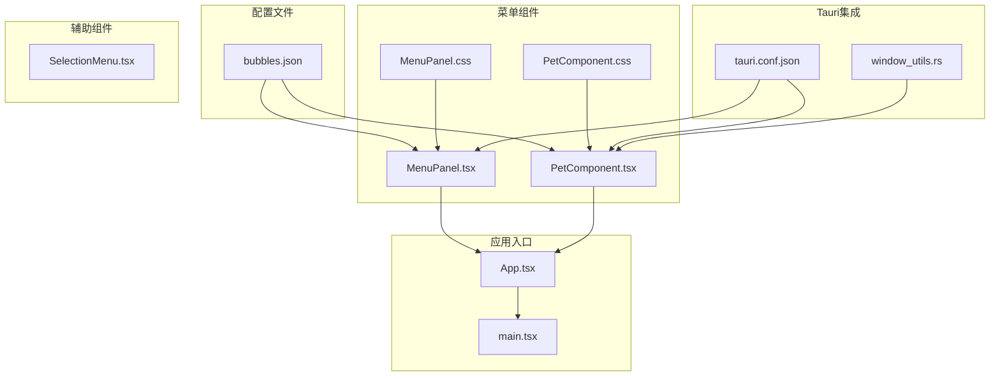
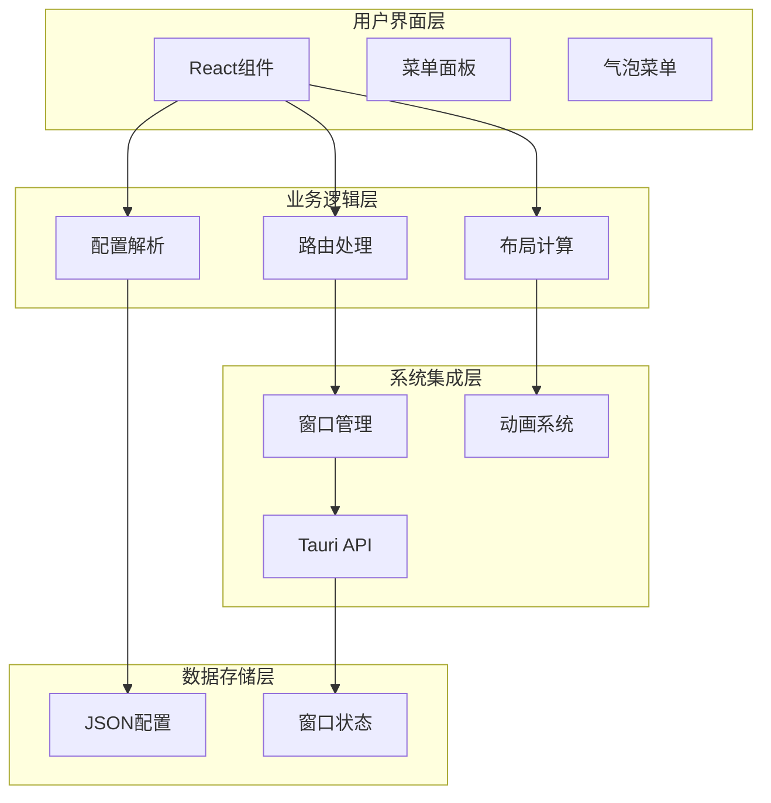
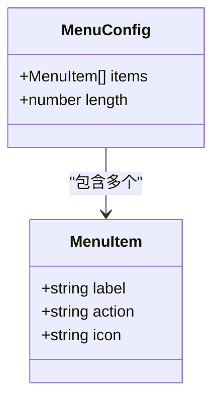
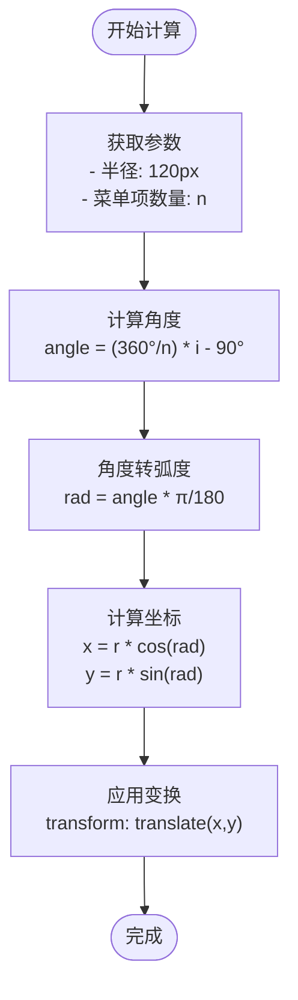
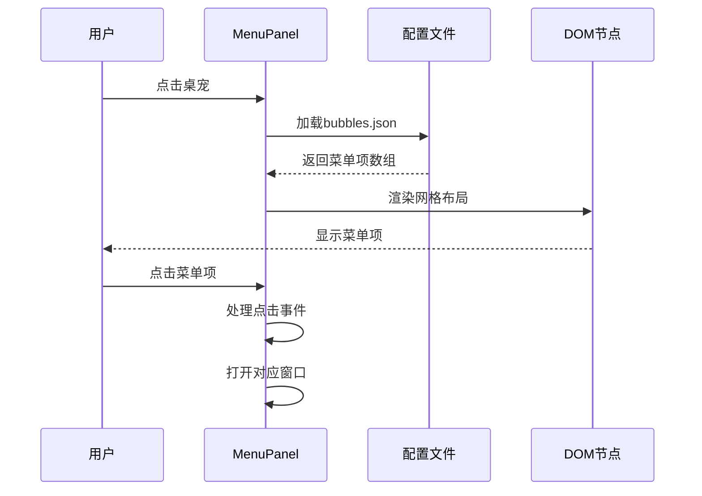
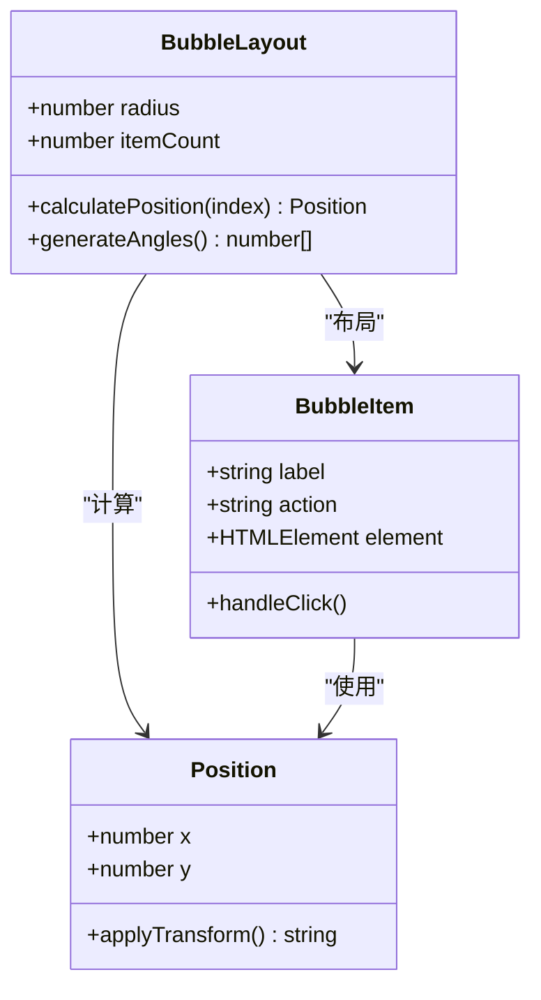
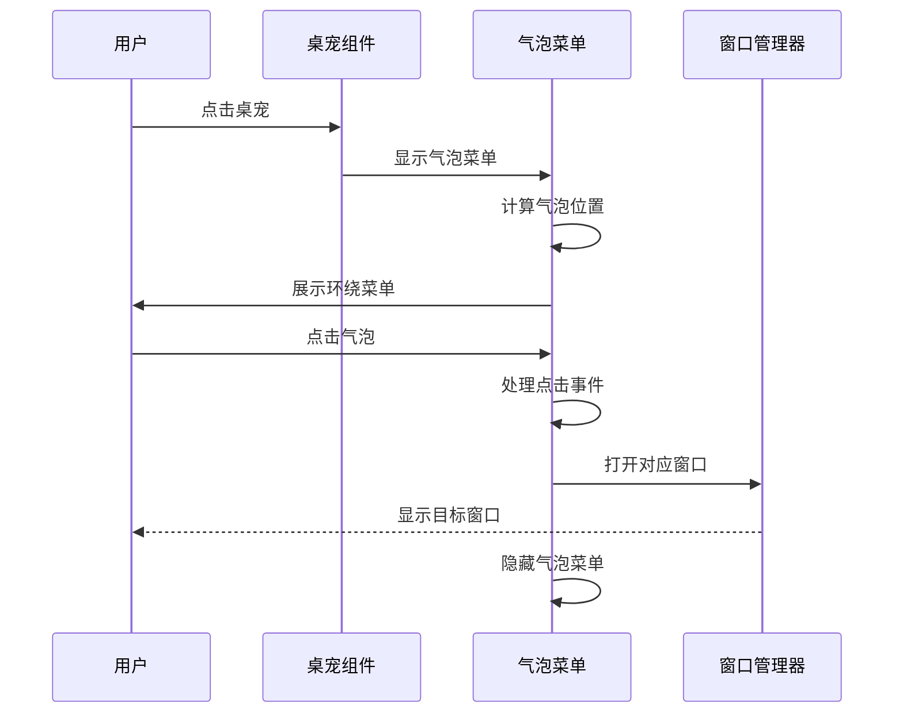
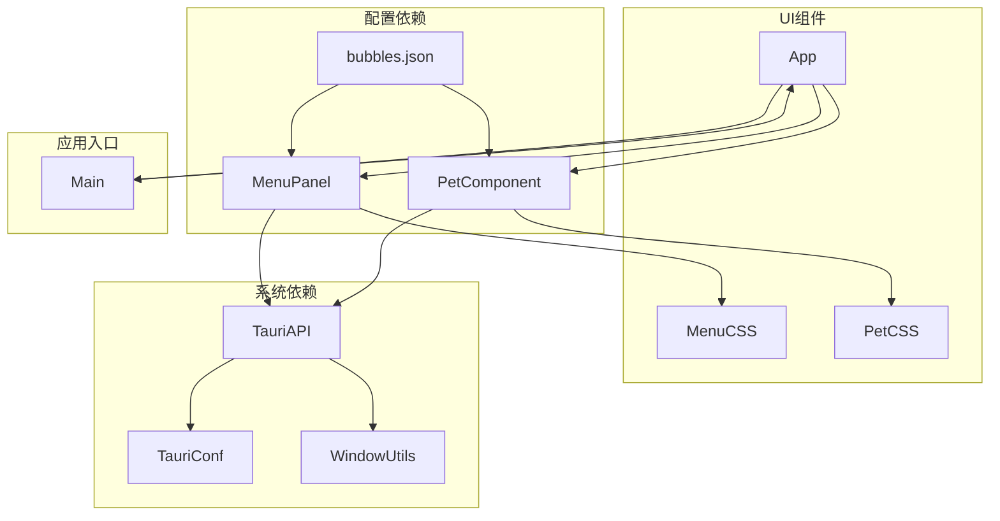

# 气泡菜单系统

<cite>
**本文档引用的文件**
- [bubbles.json](file://public/config/bubbles.json)
- [MenuPanel.tsx](file://src/components/MenuPanel.tsx)
- [MenuPanel.css](file://src/components/MenuPanel.css)
- [PetComponent.tsx](file://src/components/PetComponent.tsx)
- [PetComponent.css](file://src/components/PetComponent.css)
- [App.tsx](file://src/App.tsx)
- [SelectionMenu.tsx](file://src/components/SelectionMenu.tsx)
- [tauri.conf.json](file://src-tauri/tauri.conf.json)
- [window_utils.rs](file://src-tauri/src/window_utils.rs)
</cite>

## 目录
1. [简介](#简介)
2. [项目结构](#项目结构)
3. [核心组件](#核心组件)
4. [架构概览](#架构概览)
5. [详细组件分析](#详细组件分析)
6. [依赖关系分析](#依赖关系分析)
7. [性能考虑](#性能考虑)
8. [故障排除指南](#故障排除指南)
9. [结论](#结论)

## 简介

气泡菜单系统是一个基于Tauri框架开发的桌面宠物应用中的交互功能模块。该系统提供了两种主要的菜单交互模式：传统的网格菜单面板和环绕式的气泡菜单。系统通过配置文件驱动菜单项的定义，实现了灵活的菜单定制能力。

该系统的核心特性包括：
- 基于JSON配置的菜单项管理
- 圆形布局算法的气泡菜单
- Tauri Webview窗口管理系统
- 平滑的动画过渡效果
- 响应式设计适配不同屏幕尺寸

## 项目结构

气泡菜单系统位于项目的前端组件目录中，主要由以下文件组成：



**图表来源**
- [bubbles.json:1-52](file://public/config/bubbles.json#L1-L52)
- [MenuPanel.tsx:1-295](file://src/components/MenuPanel.tsx#L1-L295)
- [PetComponent.tsx:1-819](file://src/components/PetComponent.tsx#L1-L819)

**章节来源**
- [bubbles.json:1-52](file://public/config/bubbles.json#L1-L52)
- [MenuPanel.tsx:1-295](file://src/components/MenuPanel.tsx#L1-L295)
- [PetComponent.tsx:1-819](file://src/components/PetComponent.tsx#L1-L819)

## 核心组件

### 菜单配置系统

系统采用JSON配置文件驱动菜单项定义，每个菜单项包含以下关键字段：

| 字段名 | 类型 | 必需 | 描述 | 示例 |
|--------|------|------|------|------|
| label | string | 是 | 菜单项显示文本 | "剪贴板" |
| action | string | 是 | 动作标识符，用于路由处理 | "open-clipboard" |
| icon | string | 否 | 图标路径，若缺失则使用默认图标 | "/menu/clipboard_512.png" |

### 菜单渲染组件

系统提供两种菜单渲染模式：

1. **网格菜单面板**：基于CSS Grid布局的九宫格菜单
2. **气泡菜单**：基于圆形布局的环绕式菜单

**章节来源**
- [bubbles.json:1-52](file://public/config/bubbles.json#L1-L52)
- [MenuPanel.tsx:8-12](file://src/components/MenuPanel.tsx#L8-L12)

## 架构概览

气泡菜单系统采用分层架构设计，实现了清晰的关注点分离：



**图表来源**
- [MenuPanel.tsx:14-295](file://src/components/MenuPanel.tsx#L14-L295)
- [PetComponent.tsx:19-819](file://src/components/PetComponent.tsx#L19-L819)

## 详细组件分析

### 菜单配置文件分析

#### bubbles.json配置结构

配置文件采用数组格式，每个元素代表一个菜单项：



**图表来源**
- [bubbles.json:2-46](file://public/config/bubbles.json#L2-L46)

#### 配置字段详解

| 字段 | 类型 | 作用 | 默认值 | 说明 |
|------|------|------|--------|------|
| label | string | 显示文本 | 必填 | 菜单项的用户可见标签 |
| action | string | 动作标识 | 必填 | 控制菜单项行为的关键字 |
| icon | string | 图标路径 | 可选 | 自定义图标的资源路径 |

**章节来源**
- [bubbles.json:1-52](file://public/config/bubbles.json#L1-L52)

### 菜单定位算法

#### 圆形布局计算

气泡菜单采用极坐标系统进行位置计算：



**图表来源**
- [PetComponent.tsx:760-788](file://src/components/PetComponent.tsx#L760-L788)

#### 角度分配公式

- **基础公式**：`angle = (360°/n) * i - 90°`
- **起始角度偏移**：-90°确保第一个菜单项位于上方
- **均匀分布**：每个菜单项之间的角度差为 `360°/n`

#### 坐标变换逻辑

1. **极坐标转换**：使用三角函数将极坐标转换为笛卡尔坐标
2. **CSS变换**：通过 `translate(x,y)` 实现精确位置控制
3. **居中对齐**：结合 `left: 50%`, `top: 50%` 和负边距实现中心对齐

**章节来源**
- [PetComponent.tsx:760-788](file://src/components/PetComponent.tsx#L760-L788)

### 菜单渲染机制

#### React组件渲染

菜单面板采用函数式组件设计：



**图表来源**
- [MenuPanel.tsx:14-295](file://src/components/MenuPanel.tsx#L14-L295)

#### CSS样式计算

菜单面板采用现代化的CSS设计：

| 样式特性 | 实现方式 | 效果 |
|----------|----------|------|
| 模糊背景 | `backdrop-filter: blur(20px)` | 半透明毛玻璃效果 |
| 圆角边框 | `border-radius: 20px` | 现代化圆润外观 |
| 阴影效果 | `box-shadow: 0 8px 32px rgba(0,0,0,0.1)` | 深层立体感 |
| 网格布局 | `display: grid` | 响应式九宫格排列 |

#### 动画效果实现

系统实现了多层次的动画效果：

1. **入场动画**：`slideIn` 关键帧动画
2. **悬停效果**：平滑的缩放和阴影变化
3. **点击反馈**：微妙的按压动画
4. **气泡动画**：顺序出现的淡入效果

**章节来源**
- [MenuPanel.css:1-180](file://src/components/MenuPanel.css#L1-L180)

### 菜单交互逻辑

#### 点击事件处理

```mermaid
flowchart TD
Click[用户点击] --> CheckTarget{检查目标元素}
CheckTarget --> |菜单项| HandleAction[处理动作]
CheckTarget --> |外部区域| ClosePanel[关闭面板]
CheckTarget --> |关闭按钮| ClosePanel
HandleAction --> SwitchAction{switch(action)}
SwitchAction --> |open-main| OpenMain[打开系统信息]
SwitchAction --> |open-clipboard| OpenClipboard[打开剪贴板]
SwitchAction --> |open-ai| OpenAI[打开AI对话]
SwitchAction --> |translator| OpenTranslator[打开翻译]
SwitchAction --> |calendar| OpenCalendar[打开日历]
SwitchAction --> |json-compare| OpenJSON[打开JSON比较]
SwitchAction --> |pomodoro-timer| OpenPomodoro[打开番茄钟]
SwitchAction --> |jira| OpenJira[打开JIRA]
SwitchAction --> |minimize-to-tray| MinimizeTray[最小化到托盘]
SwitchAction --> |close-pet| ClosePet[关闭桌宠]
OpenMain --> ClosePanel
OpenClipboard --> ClosePanel
OpenAI --> ClosePanel
OpenTranslator --> ClosePanel
OpenCalendar --> ClosePanel
OpenJSON --> ClosePanel
OpenPomodoro --> ClosePanel
OpenJira --> ClosePanel
MinimizeTray --> ClosePanel
ClosePet --> ClosePanel
```

**图表来源**
- [MenuPanel.tsx:90-259](file://src/components/MenuPanel.tsx#L90-L259)

#### 菜单项路由

每个菜单项通过 `action` 字段与具体功能关联：

| Action值 | 对应功能 | 窗口标签 | URL路径 |
|----------|----------|----------|---------|
| open-main | 系统信息 | main | http://localhost:1420 |
| open-clipboard | 剪贴板历史 | clipboard | http://localhost:1420/clipboard |
| open-ai | AI对话助手 | ai-chat | http://localhost:1420 |
| translator | 有道翻译 | translator | http://localhost:1420 |
| calendar | 智能日历 | calendar | http://localhost:1420 |
| json-compare | JSON对比工具 | json-compare | http://localhost:1420 |
| pomodoro-timer | 番茄钟 | pomodoro-timer | http://localhost:1420 |
| jira | JIRA工作流助手 | jira | http://localhost:1420 |
| minimize-to-tray | 最小化到托盘 | - | Tauri命令 |
| close-pet | 关闭桌宠 | - | Tauri命令 |

**章节来源**
- [MenuPanel.tsx:90-259](file://src/components/MenuPanel.tsx#L90-L259)

### 气泡菜单系统

#### 气泡布局算法

气泡菜单采用环绕式布局，每个气泡围绕中心点分布：



**图表来源**
- [PetComponent.tsx:760-788](file://src/components/PetComponent.tsx#L760-L788)

#### 气泡交互流程



**图表来源**
- [PetComponent.tsx:712-745](file://src/components/PetComponent.tsx#L712-L745)

**章节来源**
- [PetComponent.tsx:712-745](file://src/components/PetComponent.tsx#L712-L745)

## 依赖关系分析

### 组件依赖图



**图表来源**
- [MenuPanel.tsx:1-6](file://src/components/MenuPanel.tsx#L1-L6)
- [PetComponent.tsx:5-7](file://src/components/PetComponent.tsx#L5-L7)

### 外部依赖

系统依赖的主要外部库：

| 依赖库 | 版本 | 用途 |
|--------|------|------|
| @tauri-apps/api | 最新版 | Tauri原生API访问 |
| react | 最新版 | React框架支持 |
| react-dom | 最新版 | DOM渲染支持 |

**章节来源**
- [MenuPanel.tsx:1-6](file://src/components/MenuPanel.tsx#L1-L6)
- [PetComponent.tsx:1-7](file://src/components/PetComponent.tsx#L1-L7)

## 性能考虑

### 渲染优化

1. **虚拟滚动**：对于大量菜单项的情况，可考虑实现虚拟滚动以减少DOM节点数量
2. **懒加载**：菜单项图标采用懒加载策略，避免阻塞页面渲染
3. **CSS动画**：使用GPU加速的CSS变换实现流畅动画

### 内存管理

1. **事件监听器清理**：组件卸载时自动清理所有事件监听器
2. **定时器管理**：合理管理各种定时器，避免内存泄漏
3. **窗口生命周期**：严格管理Tauri窗口的创建和销毁

### 网络优化

1. **静态资源缓存**：菜单图标等静态资源启用浏览器缓存
2. **开发环境优化**：开发模式下使用本地服务器，生产模式使用打包资源

## 故障排除指南

### 常见问题及解决方案

#### 菜单项无法显示

**症状**：菜单面板空白或部分菜单项不显示

**可能原因**：
1. 配置文件格式错误
2. 图标资源路径无效
3. 权限不足导致资源加载失败

**解决步骤**：
1. 检查 `bubbles.json` 格式是否正确
2. 验证图标文件是否存在且可访问
3. 查看浏览器开发者工具的网络面板

#### 窗口创建失败

**症状**：点击菜单项后窗口无法打开

**可能原因**：
1. Tauri窗口配置错误
2. 开发服务器未启动
3. 窗口标签冲突

**解决步骤**：
1. 检查 `tauri.conf.json` 中的窗口配置
2. 确认开发服务器正在运行
3. 避免使用重复的窗口标签

#### 动画效果异常

**症状**：菜单动画卡顿或不生效

**可能原因**：
1. CSS动画属性设置错误
2. 浏览器兼容性问题
3. GPU加速被禁用

**解决步骤**：
1. 检查CSS动画关键帧定义
2. 测试不同浏览器的兼容性
3. 启用硬件加速

**章节来源**
- [MenuPanel.tsx:36-43](file://src/components/MenuPanel.tsx#L36-L43)
- [PetComponent.tsx:205-228](file://src/components/PetComponent.tsx#L205-L228)

## 结论

气泡菜单系统是一个设计精良的桌面应用交互模块，具有以下特点：

### 技术优势

1. **模块化设计**：清晰的组件分离和职责划分
2. **配置驱动**：通过JSON配置实现灵活的菜单定制
3. **现代技术栈**：基于React和Tauri的现代化开发
4. **用户体验**：流畅的动画效果和直观的交互设计

### 扩展性

系统提供了良好的扩展接口：
- 支持动态添加新的菜单项
- 可自定义布局参数和样式
- 易于集成新的功能模块

### 改进建议

1. **性能优化**：考虑实现虚拟滚动和资源预加载
2. **国际化支持**：添加多语言支持功能
3. **主题系统**：实现可定制的主题切换
4. **键盘导航**：添加键盘快捷键支持

该系统为桌面应用提供了一个优秀的菜单交互范例，其设计理念和实现方式值得其他类似项目参考和借鉴。