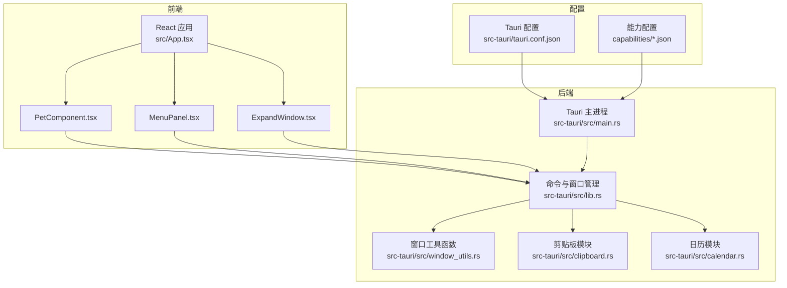
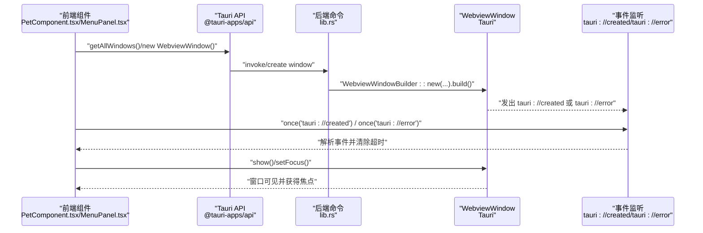
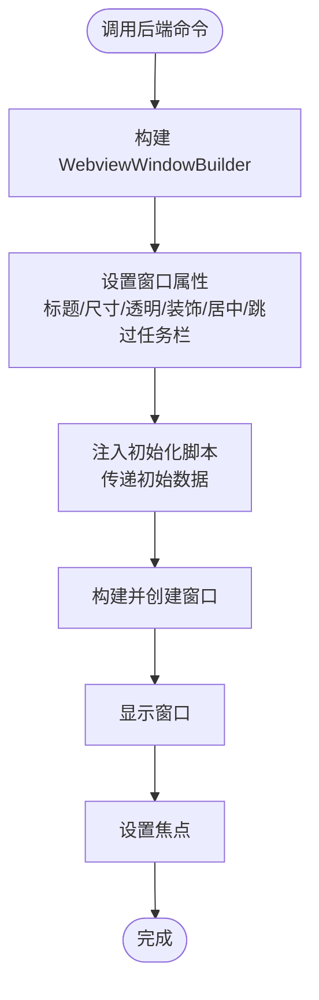
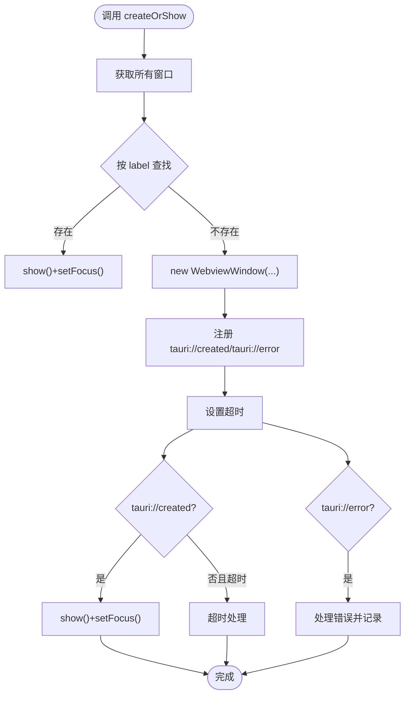
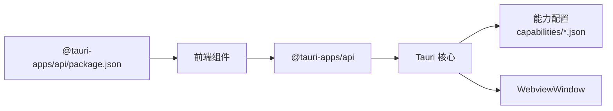

# 窗口集成机制

<cite>
**本文档引用的文件**
- [src-tauri/src/lib.rs](file://src-tauri/src/lib.rs)
- [src-tauri/src/window_utils.rs](file://src-tauri/src/window_utils.rs)
- [src-tauri/src/main.rs](file://src-tauri/src/main.rs)
- [src-tauri/tauri.conf.json](file://src-tauri/tauri.conf.json)
- [src-tauri/capabilities/window-management.json](file://src-tauri/capabilities/window-management.json)
- [src-tauri/capabilities/main.json](file://src-tauri/capabilities/main.json)
- [src-tauri/capabilities/drag.json](file://src-tauri/capabilities/drag.json)
- [src/App.tsx](file://src/App.tsx)
- [src/components/PetComponent.tsx](file://src/components/PetComponent.tsx)
- [src/components/MenuPanel.tsx](file://src/components/MenuPanel.tsx)
- [src/components/ExpandWindow.tsx](file://src/components/ExpandWindow.tsx)
- [src-tauri/src/clipboard.rs](file://src-tauri/src/clipboard.rs)
- [src-tauri/src/calendar.rs](file://src-tauri/src/calendar.rs)
- [package.json](file://package.json)
</cite>

## 目录
1. [简介](#简介)
2. [项目结构](#项目结构)
3. [核心组件](#核心组件)
4. [架构总览](#架构总览)
5. [详细组件分析](#详细组件分析)
6. [依赖关系分析](#依赖关系分析)
7. [性能考虑](#性能考虑)
8. [故障排除指南](#故障排除指南)
9. [结论](#结论)

## 简介
本文件系统性阐述桌面宠物应用中的窗口集成机制，重点覆盖以下方面：
- WebviewWindow 的创建与管理流程，包括窗口配置参数、URL 处理与生命周期管理
- 窗口间通信机制，涵盖 createOrShow 通用模式、窗口查找逻辑与焦点管理
- 窗口属性配置，包括透明度、装饰禁用、始终置顶与任务栏显示控制
- 窗口事件处理，包括 tauri://created 与 tauri://error 事件监听、超时机制与错误处理策略
- 最佳实践，包括内存清理、错误恢复与用户体验优化

## 项目结构
该项目采用 Tauri + React 技术栈，前端通过 @tauri-apps/api 调用后端能力；后端 Rust 提供窗口管理、系统信息采集、剪贴板与日历等功能。

**图表来源**
- [src-tauri/src/main.rs:1-11](file://src-tauri/src/main.rs#L1-L11)
- [src-tauri/src/lib.rs:1-1113](file://src-tauri/src/lib.rs#L1-L1113)
- [src-tauri/src/window_utils.rs:1-33](file://src-tauri/src/window_utils.rs#L1-L33)
- [src-tauri/tauri.conf.json:1-74](file://src-tauri/tauri.conf.json#L1-L74)
- [src-tauri/capabilities/main.json:1-40](file://src-tauri/capabilities/main.json#L1-L40)

**章节来源**
- [src-tauri/src/main.rs:1-11](file://src-tauri/src/main.rs#L1-L11)
- [src-tauri/tauri.conf.json:1-74](file://src-tauri/tauri.conf.json#L1-L74)
- [src-tauri/capabilities/main.json:1-40](file://src-tauri/capabilities/main.json#L1-L40)

## 核心组件
- 窗口管理后端命令：统一在后端定义窗口创建、显示、聚焦、关闭等操作，并提供跨平台的窗口属性设置（如透明、装饰、置顶、跳过任务栏）。
- 前端窗口创建与通信：前端通过 createOrShow 通用模式进行窗口查找、创建、事件监听与焦点管理；同时支持初始化脚本注入数据。
- 窗口工具函数：封装平台差异（Windows 层叠/透明样式与非 Windows 忽略光标事件）以实现点击穿透等行为。
- 能力与权限：通过 capability 文件声明窗口管理、Webview 创建、窗口属性修改等权限，确保前端调用安全可控。

**章节来源**
- [src-tauri/src/lib.rs:41-112](file://src-tauri/src/lib.rs#L41-L112)
- [src-tauri/src/lib.rs:114-209](file://src-tauri/src/lib.rs#L114-L209)
- [src-tauri/src/lib.rs:633-669](file://src-tauri/src/lib.rs#L633-L669)
- [src-tauri/src/window_utils.rs:9-32](file://src-tauri/src/window_utils.rs#L9-L32)
- [src-tauri/capabilities/window-management.json:1-17](file://src-tauri/capabilities/window-management.json#L1-L17)

## 架构总览
下图展示窗口创建与通信的关键交互路径，从前端发起到后端执行再到前端事件回调与焦点管理。

**图表来源**
- [src/components/PetComponent.tsx:230-286](file://src/components/PetComponent.tsx#L230-L286)
- [src/components/MenuPanel.tsx:45-88](file://src/components/MenuPanel.tsx#L45-L88)
- [src-tauri/src/lib.rs:74-112](file://src-tauri/src/lib.rs#L74-L112)

## 详细组件分析

### WebviewWindow 创建与管理（后端）
- 统一入口：通过命令函数集中管理窗口创建，例如打开扩展编辑窗口、翻译器、JSON 比较、待办事项等。
- 配置参数：标题、尺寸、可见性、透明度、装饰、可调整大小、居中、跳过任务栏、初始化脚本注入等。
- 生命周期：创建后立即显示并聚焦，确保用户感知与交互连续性。

**图表来源**
- [src-tauri/src/lib.rs:74-112](file://src-tauri/src/lib.rs#L74-L112)
- [src-tauri/src/lib.rs:114-160](file://src-tauri/src/lib.rs#L114-L160)
- [src-tauri/src/lib.rs:162-209](file://src-tauri/src/lib.rs#L162-L209)
- [src-tauri/src/lib.rs:633-669](file://src-tauri/src/lib.rs#L633-L669)

**章节来源**
- [src-tauri/src/lib.rs:74-112](file://src-tauri/src/lib.rs#L74-L112)
- [src-tauri/src/lib.rs:114-160](file://src-tauri/src/lib.rs#L114-L160)
- [src-tauri/src/lib.rs:162-209](file://src-tauri/src/lib.rs#L162-L209)
- [src-tauri/src/lib.rs:633-669](file://src-tauri/src/lib.rs#L633-L669)

### createOrShow 通用模式（前端）
- 窗口查找：通过 getAllWindows() 获取当前所有窗口，按 label 判断是否存在。
- 已存在处理：若存在则 show() 并 setFocus()，失败时回退到重新创建。
- 不存在处理：构造 WebviewWindow 实例，设置 URL、标题、尺寸、透明、装饰、居中等参数。
- 事件监听：注册 tauri://created 与 tauri://error 事件，配合超时机制保证健壮性。
- 焦点管理：创建完成后立即 show() 与 setFocus()，确保窗口激活。

**图表来源**
- [src/components/PetComponent.tsx:230-286](file://src/components/PetComponent.tsx#L230-L286)
- [src/components/PetComponent.tsx:288-346](file://src/components/PetComponent.tsx#L288-L346)
- [src/components/PetComponent.tsx:347-401](file://src/components/PetComponent.tsx#L347-L401)
- [src/components/PetComponent.tsx:403-458](file://src/components/PetComponent.tsx#L403-L458)
- [src/components/PetComponent.tsx:460-517](file://src/components/PetComponent.tsx#L460-L517)
- [src/components/PetComponent.tsx:519-573](file://src/components/PetComponent.tsx#L519-L573)
- [src/components/MenuPanel.tsx:45-88](file://src/components/MenuPanel.tsx#L45-L88)

**章节来源**
- [src/components/PetComponent.tsx:230-286](file://src/components/PetComponent.tsx#L230-L286)
- [src/components/PetComponent.tsx:288-346](file://src/components/PetComponent.tsx#L288-L346)
- [src/components/PetComponent.tsx:347-401](file://src/components/PetComponent.tsx#L347-L401)
- [src/components/PetComponent.tsx:403-458](file://src/components/PetComponent.tsx#L403-L458)
- [src/components/PetComponent.tsx:460-517](file://src/components/PetComponent.tsx#L460-L517)
- [src/components/PetComponent.tsx:519-573](file://src/components/PetComponent.tsx#L519-L573)
- [src/components/MenuPanel.tsx:45-88](file://src/components/MenuPanel.tsx#L45-L88)

### 窗口属性配置
- 透明度：通过 transparent(true) 实现无边框半透明窗口，常用于悬浮类窗口。
- 装饰禁用：decorations(false) 移除系统标题栏与边框，便于自绘窗口。
- 始终置顶：alwaysOnTop 控制窗口层级，适用于桌面宠物与提醒类窗口。
- 任务栏显示：skipTaskbar(true) 隐藏任务栏入口，减少干扰。
- 居中与尺寸：center() 与 inner_size()/size() 确保窗口初始位置与大小合理。
- 可调整大小：resizable 控制窗口尺寸可变性，兼顾易用性与稳定性。

**章节来源**
- [src-tauri/src/lib.rs:74-112](file://src-tauri/src/lib.rs#L74-L112)
- [src-tauri/src/lib.rs:114-160](file://src-tauri/src/lib.rs#L114-L160)
- [src-tauri/src/lib.rs:162-209](file://src-tauri/src/lib.rs#L162-L209)
- [src-tauri/src/lib.rs:633-669](file://src-tauri/src/lib.rs#L633-L669)
- [src-tauri/tauri.conf.json:13-42](file://src-tauri/tauri.conf.json#L13-L42)

### 窗口事件处理与超时机制
- 事件监听：前端在创建窗口后监听 tauri://created 与 tauri://error，确保窗口正确初始化与异常捕获。
- 超时机制：设置固定超时时间（如 5 秒），超时未收到事件则抛出错误，避免无限等待。
- 错误处理：区分“创建前”与“创建后”的错误场景，分别采取重试或回退策略。

**章节来源**
- [src/components/PetComponent.tsx:260-274](file://src/components/PetComponent.tsx#L260-L274)
- [src/components/PetComponent.tsx:320-334](file://src/components/PetComponent.tsx#L320-L334)
- [src/components/PetComponent.tsx:379-393](file://src/components/PetComponent.tsx#L379-L393)
- [src/components/PetComponent.tsx:436-450](file://src/components/PetComponent.tsx#L436-L450)
- [src/components/PetComponent.tsx:495-509](file://src/components/PetComponent.tsx#L495-L509)
- [src/components/PetComponent.tsx:551-565](file://src/components/PetComponent.tsx#L551-L565)
- [src/components/MenuPanel.tsx:67-81](file://src/components/MenuPanel.tsx#L67-L81)

### 点击穿透与焦点管理（平台差异）
- 点击穿透：在 Windows 上通过修改扩展样式实现层叠与透明穿透；在非 Windows 平台上使用忽略光标事件接口。
- 焦点管理：统一通过 setFocus() 确保新建或已存在窗口获得输入焦点，提升交互一致性。

**章节来源**
- [src-tauri/src/window_utils.rs:9-32](file://src-tauri/src/window_utils.rs#L9-L32)
- [src-tauri/src/lib.rs:48-50](file://src-tauri/src/lib.rs#L48-L50)
- [src/components/PetComponent.tsx:36-47](file://src/components/PetComponent.tsx#L36-L47)

### 窗口间通信与初始化脚本
- 事件通信：通过 emit/send 事件在窗口间传递数据（如翻译器填充文本、日历刷新等）。
- 初始化脚本：通过 initialization_script 注入全局变量，实现前后端数据桥接（如扩展窗口内容、翻译器初始文本等）。

**章节来源**
- [src-tauri/src/lib.rs:114-160](file://src-tauri/src/lib.rs#L114-L160)
- [src-tauri/src/lib.rs:162-209](file://src-tauri/src/lib.rs#L162-L209)
- [src-tauri/src/lib.rs:633-669](file://src-tauri/src/lib.rs#L633-L669)
- [src-tauri/src/lib.rs:52-59](file://src-tauri/src/lib.rs#L52-L59)

## 依赖关系分析
- 前端依赖：@tauri-apps/api 提供窗口、事件、命令调用能力；React 生态负责 UI 渲染。
- 后端依赖：tauri、serde、tokio 等，提供窗口管理、序列化、异步运行时支持。
- 能力配置：通过 capability 文件声明权限范围，确保窗口管理与 Webview 创建的安全性。

**图表来源**
- [package.json:12-28](file://package.json#L12-L28)
- [src-tauri/capabilities/main.json:1-40](file://src-tauri/capabilities/main.json#L1-L40)
- [src-tauri/capabilities/window-management.json:1-17](file://src-tauri/capabilities/window-management.json#L1-L17)

**章节来源**
- [package.json:12-28](file://package.json#L12-L28)
- [src-tauri/capabilities/main.json:1-40](file://src-tauri/capabilities/main.json#L1-L40)
- [src-tauri/capabilities/window-management.json:1-17](file://src-tauri/capabilities/window-management.json#L1-L17)

## 性能考虑
- 窗口数量控制：避免频繁创建临时窗口，优先复用已存在实例并进行 show/setFocus。
- 初始化脚本最小化：仅注入必要数据，减少前端解析与渲染压力。
- 事件监听去抖：在高频事件场景下，合并或去抖处理，避免重复聚焦与闪烁。
- 资源清理：窗口关闭时及时释放监听器与定时器，防止内存泄漏。

## 故障排除指南
- 窗口创建超时：检查 tauri://created 是否正常触发，确认前端超时时间与网络/资源加载情况。
- 焦点丢失：确认 alwaysOnTop 与 skipTaskbar 配置是否符合预期，避免被系统规则影响。
- 点击穿透失效：在 Windows 平台检查扩展样式设置，在非 Windows 平台检查忽略光标事件权限。
- 权限不足：核对 capability 文件中窗口管理与 Webview 创建权限是否启用。

**章节来源**
- [src/components/PetComponent.tsx:260-274](file://src/components/PetComponent.tsx#L260-L274)
- [src-tauri/src/window_utils.rs:9-32](file://src-tauri/src/window_utils.rs#L9-L32)
- [src-tauri/capabilities/window-management.json:1-17](file://src-tauri/capabilities/window-management.json#L1-L17)

## 结论
本项目通过统一的后端命令与前端 createOrShow 通用模式，实现了稳定、可维护的窗口集成机制。结合透明、装饰、置顶与任务栏控制等属性配置，以及完善的事件监听与超时处理策略，既提升了用户体验，也保证了系统的健壮性。建议在后续迭代中进一步完善窗口生命周期管理与资源回收策略，持续优化性能与稳定性。