# 窗口定位与层级管理

<cite>
**本文档引用的文件**
- [PetComponent.tsx](file://src/components/PetComponent.tsx)
- [CalendarComponent.tsx](file://src/components/CalendarComponent.tsx)
- [window_utils.rs](file://src-tauri/src/window_utils.rs)
- [lib.rs](file://src-tauri/src/lib.rs)
- [main.rs](file://src-tauri/src/main.rs)
- [window-management.json](file://src-tauri/capabilities/window-management.json)
- [main.json](file://src-tauri/capabilities/main.json)
- [default.json](file://src-tauri/capabilities/default.json)
- [Cargo.toml](file://src-tauri/Cargo.toml)
- [PetComponent.css](file://src/components/PetComponent.css)
- [CalendarComponent.css](file://src/components/CalendarComponent.css)
</cite>

## 目录
1. [简介](#简介)
2. [项目结构](#项目结构)
3. [核心组件](#核心组件)
4. [架构概览](#架构概览)
5. [详细组件分析](#详细组件分析)
6. [依赖关系分析](#依赖关系分析)
7. [性能考虑](#性能考虑)
8. [故障排除指南](#故障排除指南)
9. [结论](#结论)

## 简介

本文档深入分析了 xsun_desktop_pet 项目中的窗口定位与层级管理系统。该项目基于 Tauri 框架构建，实现了桌面宠物及其相关功能窗口的完整生命周期管理。系统涵盖了窗口位置计算、屏幕边界检测、层级控制、重叠处理、焦点管理、尺寸管理和动画效果等多个方面。

## 项目结构

项目采用典型的 Tauri 应用结构，分为前端 React 组件和后端 Rust 逻辑两大部分：

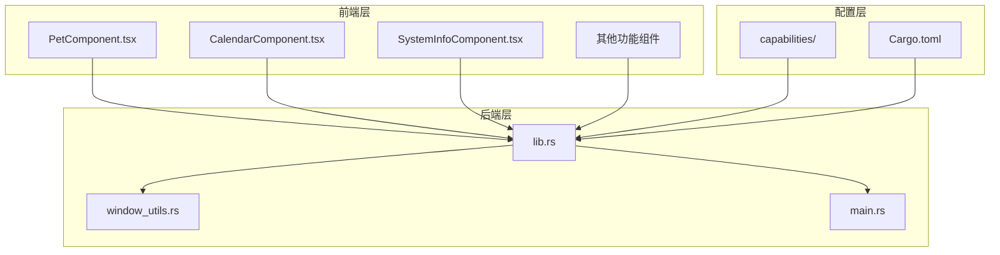

**图表来源**
- [PetComponent.tsx:1-819](file://src/components/PetComponent.tsx#L1-L819)
- [CalendarComponent.tsx:1-707](file://src/components/CalendarComponent.tsx#L1-L707)
- [lib.rs:1-1120](file://src-tauri/src/lib.rs#L1-L1120)
- [window_utils.rs:1-33](file://src-tauri/src/window_utils.rs#L1-L33)

**章节来源**
- [PetComponent.tsx:1-819](file://src/components/PetComponent.tsx#L1-L819)
- [CalendarComponent.tsx:1-707](file://src/components/CalendarComponent.tsx#L1-L707)
- [lib.rs:1-1120](file://src-tauri/src/lib.rs#L1-L1120)

## 核心组件

### 窗口定位与层级管理核心模块

系统的核心功能主要集中在以下三个组件中：

1. **PetComponent** - 桌面宠物窗口管理
2. **CalendarComponent** - 日历窗口定位与卡片模式
3. **window_utils** - 窗口层级控制工具

### 窗口类型与特性

| 窗口类型 | 标签 | 特性 | 默认行为 |
|---------|------|------|----------|
| 桌面宠物 | pet | 透明、可拖拽、点击穿透 | 休眠状态 |
| 主窗口 | main | 透明、无装饰、居中 | 活跃状态 |
| 剪贴板 | clipboard | 透明、无装饰、居中 | 活跃状态 |
| AI对话 | ai-chat | 透明、可调整大小、最小尺寸 | 活跃状态 |
| 翻译器 | translator | 透明、可调整大小、最小尺寸 | 活跃状态 |
| 日历 | calendar | 透明、可调整大小、最小尺寸 | 活跃状态 |
| 菜单面板 | menu-panel | 透明、无装饰、居中 | 活跃状态 |

**章节来源**
- [PetComponent.tsx:230-573](file://src/components/PetComponent.tsx#L230-L573)
- [CalendarComponent.tsx:247-305](file://src/components/CalendarComponent.tsx#L247-L305)

## 架构概览

系统采用分层架构设计，实现了前后端分离的窗口管理机制：

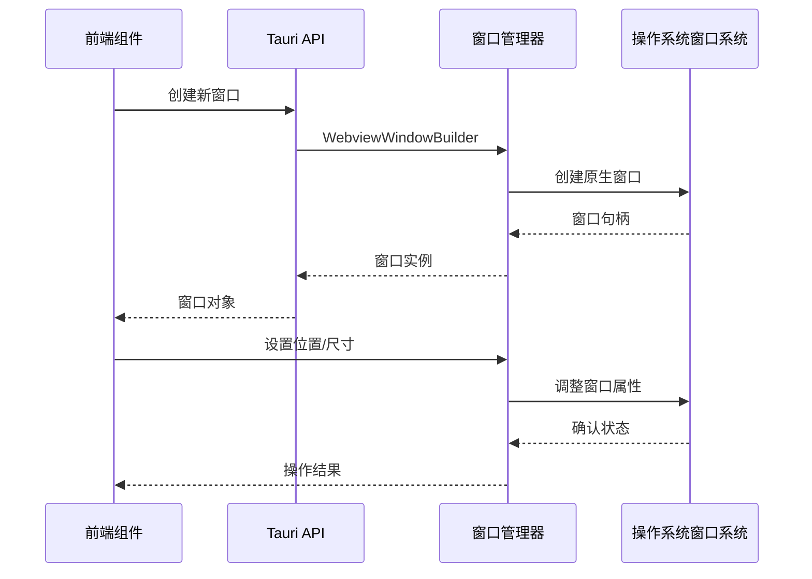

**图表来源**
- [PetComponent.tsx:230-573](file://src/components/PetComponent.tsx#L230-L573)
- [lib.rs:74-160](file://src-tauri/src/lib.rs#L74-L160)

### 窗口层级控制架构

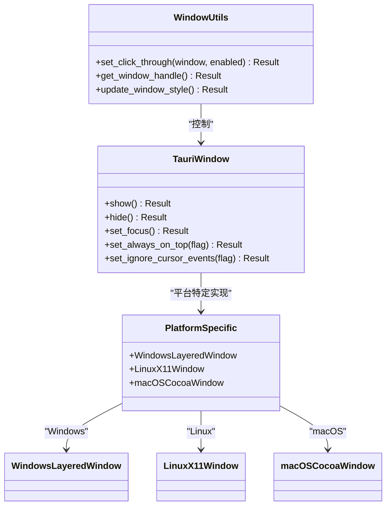

**图表来源**
- [window_utils.rs:1-33](file://src-tauri/src/window_utils.rs#L1-L33)
- [lib.rs:48-59](file://src-tauri/src/lib.rs#L48-L59)

## 详细组件分析

### 桌面宠物窗口管理

桌面宠物是系统的核心交互元素，实现了复杂的窗口定位和层级控制机制。

#### 点击穿透机制

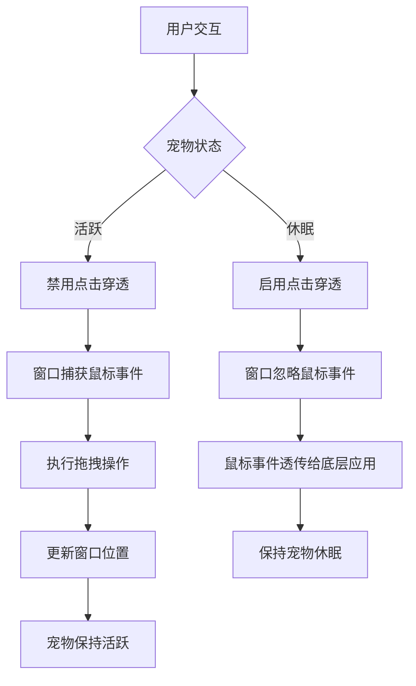

**图表来源**
- [PetComponent.tsx:36-62](file://src/components/PetComponent.tsx#L36-L62)
- [window_utils.rs:9-32](file://src-tauri/src/window_utils.rs#L9-L32)

#### 窗口创建流程

桌面宠物窗口的创建采用了智能的重用和创建策略：

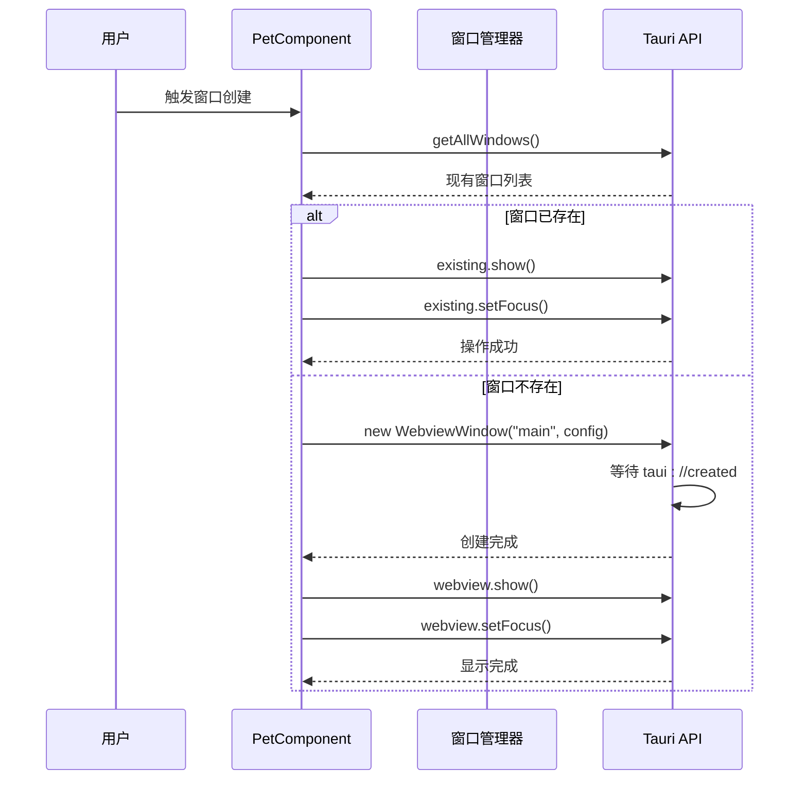

**图表来源**
- [PetComponent.tsx:230-286](file://src/components/PetComponent.tsx#L230-L286)

**章节来源**
- [PetComponent.tsx:36-62](file://src/components/PetComponent.tsx#L36-L62)
- [PetComponent.tsx:230-286](file://src/components/PetComponent.tsx#L230-L286)

### 日历窗口定位系统

日历组件实现了复杂的屏幕适配和窗口定位功能，支持卡片模式和全屏模式的切换。

#### 多显示器环境适配

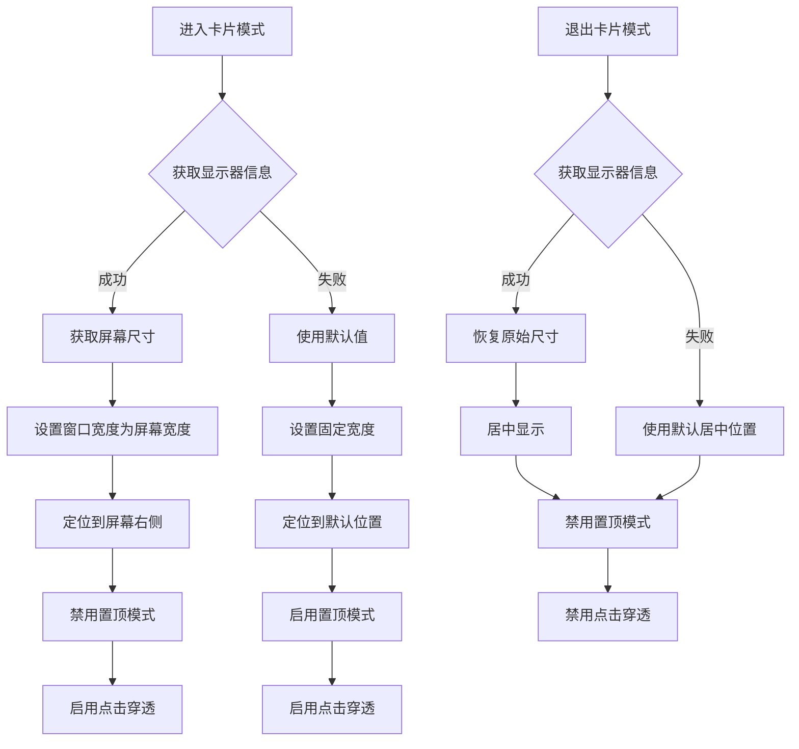

**图表来源**
- [CalendarComponent.tsx:247-305](file://src/components/CalendarComponent.tsx#L247-L305)

#### 屏幕边界检测机制

日历组件实现了完善的屏幕边界检测和保护机制：

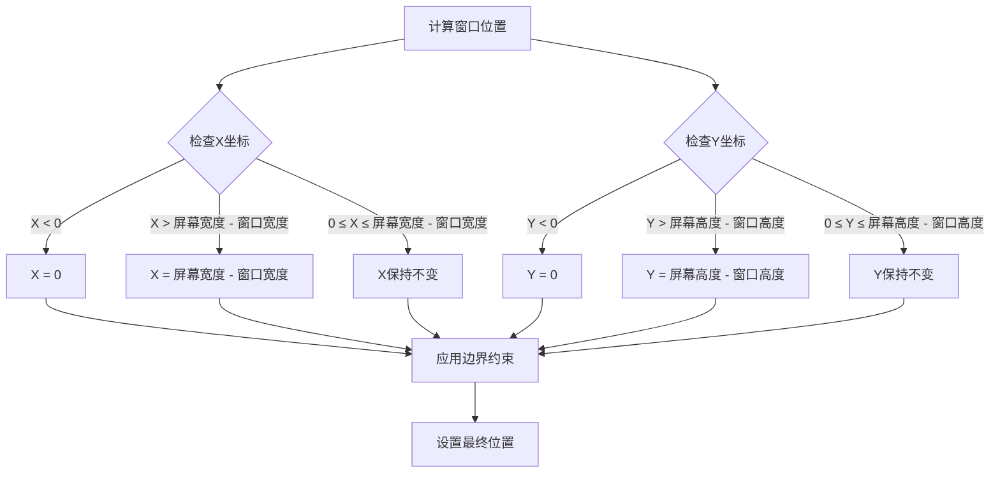

**图表来源**
- [CalendarComponent.tsx:608-617](file://src/components/CalendarComponent.tsx#L608-L617)

**章节来源**
- [CalendarComponent.tsx:247-305](file://src/components/CalendarComponent.tsx#L247-L305)
- [CalendarComponent.tsx:608-617](file://src/components/CalendarComponent.tsx#L608-L617)

### 窗口层级控制系统

系统提供了灵活的窗口层级控制机制，支持置顶、置底和普通层级的切换。

#### 平台特定实现

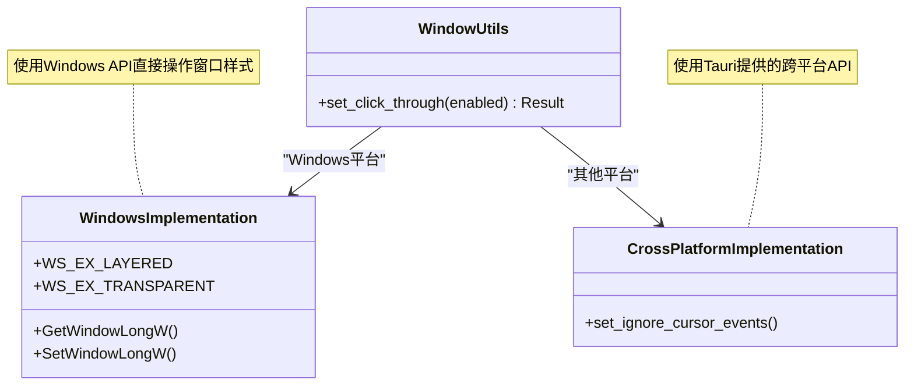

**图表来源**
- [window_utils.rs:1-33](file://src-tauri/src/window_utils.rs#L1-L33)

#### 窗口层级控制流程

```mermaid
flowchart TD
A[用户触发层级变更] --> B{目标层级}
B --> |置顶| C[调用setAlwaysOnTop(true)]
B --> |置底| D[调用setOnBottom()]
B --> |普通| E[调用setAlwaysOnTop(false)]
C --> F{平台检查}
D --> F
E --> F
F --> |Windows| G[修改窗口扩展样式]
F --> |其他平台| H[使用平台特定API]
G --> I[更新窗口Z序]
H --> I
I --> J[通知用户界面更新]
```

**图表来源**
- [PetComponent.tsx:56-62](file://src/components/PetComponent.tsx#L56-L62)
- [CalendarComponent.tsx:267-268](file://src/components/CalendarComponent.tsx#L267-L268)

**章节来源**
- [window_utils.rs:1-33](file://src-tauri/src/window_utils.rs#L1-L33)
- [PetComponent.tsx:56-62](file://src/components/PetComponent.tsx#L56-L62)
- [CalendarComponent.tsx:267-268](file://src/components/CalendarComponent.tsx#L267-L268)

### 窗口焦点管理系统

系统实现了完整的窗口焦点管理机制，确保用户体验的一致性和流畅性。

#### 焦点转移策略

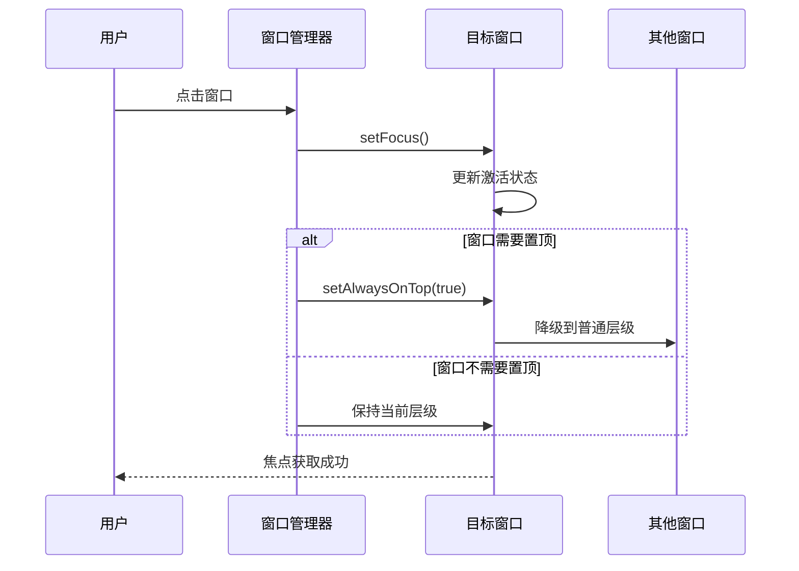

**图表来源**
- [PetComponent.tsx:237-238](file://src/components/PetComponent.tsx#L237-L238)
- [PetComponent.tsx:337-338](file://src/components/PetComponent.tsx#L337-L338)

#### 焦点保持机制

系统通过多种方式确保窗口焦点的稳定保持：

1. **自动焦点恢复** - 当窗口重新显示时自动恢复焦点
2. **事件监听** - 监听系统焦点变化事件
3. **状态同步** - 保持前端和后端焦点状态一致

**章节来源**
- [PetComponent.tsx:230-286](file://src/components/PetComponent.tsx#L230-L286)
- [PetComponent.tsx:336-342](file://src/components/PetComponent.tsx#L336-L342)

### 窗口尺寸管理系统

系统提供了灵活的窗口尺寸控制机制，支持最小尺寸限制、最大尺寸限制和自适应布局。

#### 尺寸限制机制

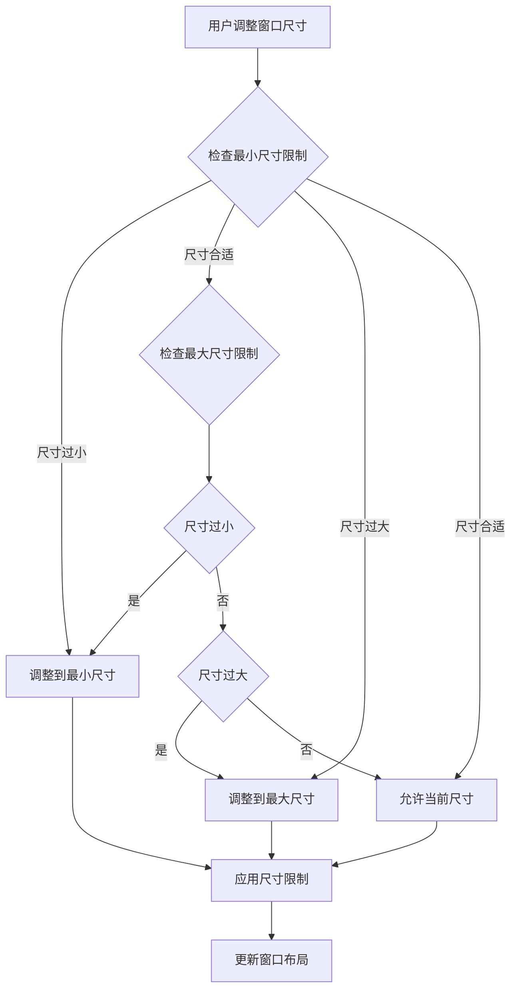

**图表来源**
- [PetComponent.tsx:373-374](file://src/components/PetComponent.tsx#L373-L374)
- [PetComponent.tsx:430-431](file://src/components/PetComponent.tsx#L430-L431)

#### 自适应布局实现

系统通过 CSS 和 JavaScript 实现了响应式的窗口布局：

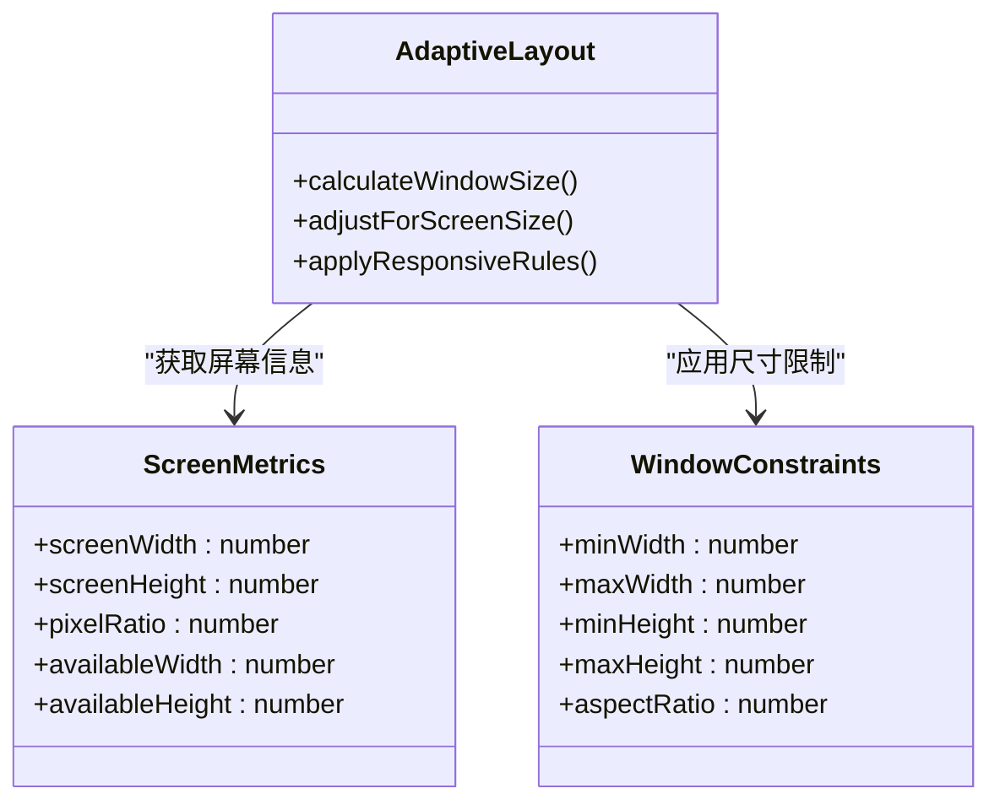

**图表来源**
- [PetComponent.tsx:373-374](file://src/components/PetComponent.tsx#L373-L374)
- [PetComponent.tsx:430-431](file://src/components/PetComponent.tsx#L430-L431)

**章节来源**
- [PetComponent.tsx:373-374](file://src/components/PetComponent.tsx#L373-L374)
- [PetComponent.tsx:430-431](file://src/components/PetComponent.tsx#L430-L431)

### 窗口动画效果系统

系统实现了丰富的窗口动画效果，包括淡入淡出、滑动和缩放等过渡效果。

#### 动画状态机

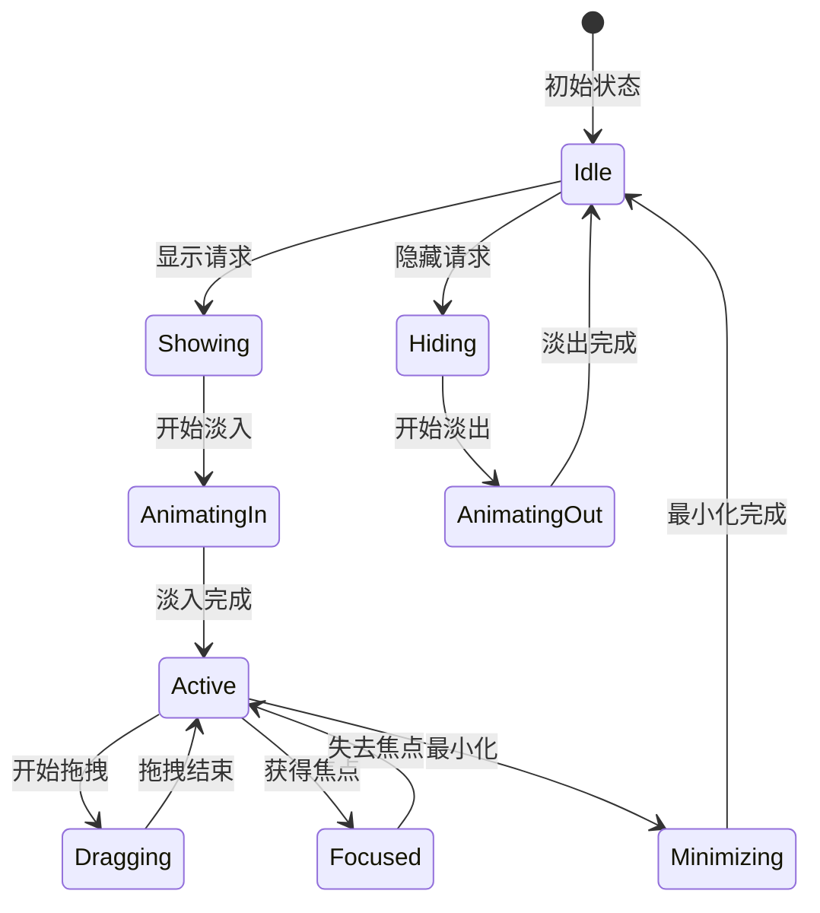

**图表来源**
- [PetComponent.css:89-141](file://src/components/PetComponent.css#L89-L141)
- [PetComponent.css:156-170](file://src/components/PetComponent.css#L156-L170)

#### 动画实现细节

系统通过 CSS 动画和 JavaScript 控制实现了流畅的过渡效果：

1. **淡入淡出效果** - 使用 opacity 和 transform 属性实现平滑过渡
2. **缩放动画** - 通过 scale 变换实现缩放效果
3. **旋转动画** - 使用 rotate 属性实现轻微的旋转效果
4. **延迟动画** - 通过 animation-delay 实现多个元素的序列动画

**章节来源**
- [PetComponent.css:89-141](file://src/components/PetComponent.css#L89-L141)
- [PetComponent.css:156-170](file://src/components/PetComponent.css#L156-L170)

## 依赖关系分析

### 窗口管理权限体系

系统通过能力配置文件实现了精细的权限控制：

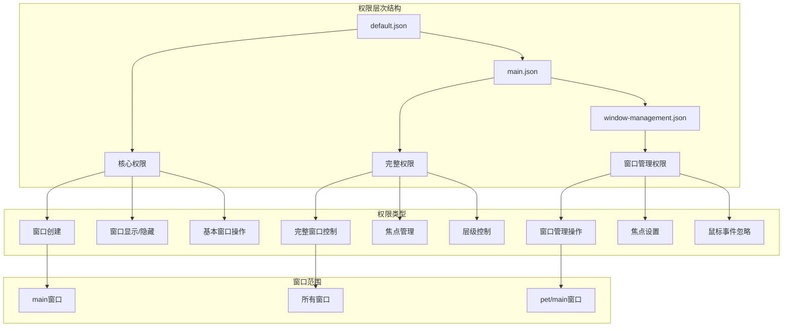

**图表来源**
- [default.json:1-12](file://src-tauri/capabilities/default.json#L1-L12)
- [main.json:1-40](file://src-tauri/capabilities/main.json#L1-L40)
- [window-management.json:1-17](file://src-tauri/capabilities/window-management.json#L1-L17)

### 平台依赖关系

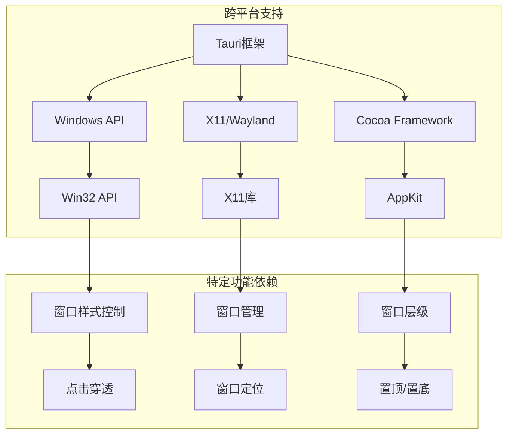

**图表来源**
- [Cargo.toml:37-44](file://src-tauri/Cargo.toml#L37-L44)
- [window_utils.rs:3-7](file://src-tauri/src/window_utils.rs#L3-L7)

**章节来源**
- [default.json:1-12](file://src-tauri/capabilities/default.json#L1-L12)
- [main.json:1-40](file://src-tauri/capabilities/main.json#L1-L40)
- [window-management.json:1-17](file://src-tauri/capabilities/window-management.json#L1-L17)
- [Cargo.toml:37-44](file://src-tauri/Cargo.toml#L37-L44)

## 性能考虑

### 窗口操作优化

系统在窗口管理方面采用了多项性能优化措施：

1. **智能窗口重用** - 避免重复创建窗口实例
2. **异步操作处理** - 使用 Promise 和 async/await 处理异步窗口操作
3. **事件监听优化** - 合理管理事件监听器的注册和注销
4. **内存管理** - 及时清理不再使用的窗口引用

### 渲染性能优化

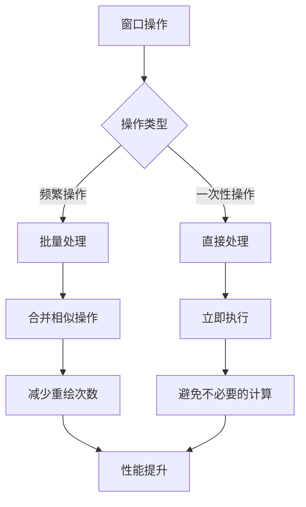

## 故障排除指南

### 常见问题及解决方案

#### 窗口创建失败

**问题症状**：窗口创建超时或创建失败
**可能原因**：
1. 网络连接问题
2. 文件路径配置错误
3. 权限不足
4. 系统资源限制

**解决步骤**：
1. 检查网络连接状态
2. 验证文件路径配置
3. 确认权限设置
4. 查看系统资源使用情况

#### 窗口层级异常

**问题症状**：窗口无法置顶或置底
**可能原因**：
1. 平台特定限制
2. 系统安全策略
3. 窗口样式冲突

**解决步骤**：
1. 检查平台支持情况
2. 验证系统安全设置
3. 调整窗口样式配置

#### 焦点管理问题

**问题症状**：窗口焦点丢失或无法获得焦点
**可能原因**：
1. 系统焦点策略
2. 其他应用程序干扰
3. 窗口状态异常

**解决步骤**：
1. 检查系统焦点策略
2. 关闭干扰的应用程序
3. 重启窗口管理服务

**章节来源**
- [PetComponent.tsx:260-274](file://src/components/PetComponent.tsx#L260-L274)
- [PetComponent.tsx:335-342](file://src/components/PetComponent.tsx#L335-L342)

## 结论

本项目展示了现代桌面应用中窗口定位与层级管理的最佳实践。通过 Tauri 框架的跨平台能力，系统实现了：

1. **完整的窗口生命周期管理** - 从创建到销毁的全流程控制
2. **智能的窗口定位策略** - 支持多显示器环境和动态屏幕适配
3. **灵活的层级控制机制** - 支持置顶、置底和普通层级的切换
4. **完善的焦点管理** - 确保用户体验的一致性
5. **丰富的动画效果** - 提升用户交互体验
6. **跨平台兼容性** - 通过能力配置实现平台特定的功能

系统的架构设计充分考虑了可维护性和扩展性，为类似桌面应用的开发提供了宝贵的参考经验。