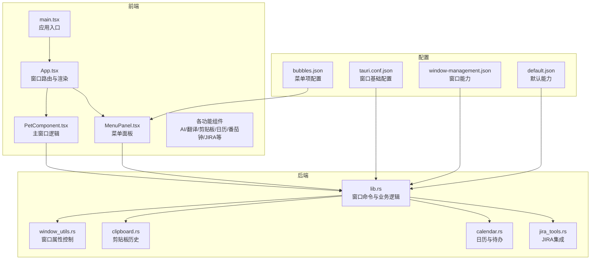
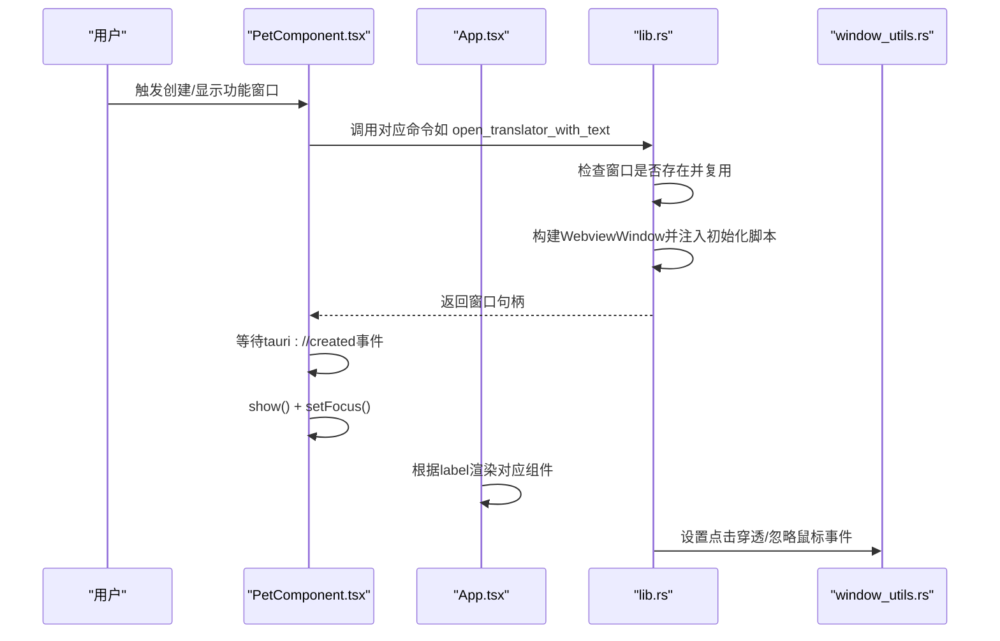
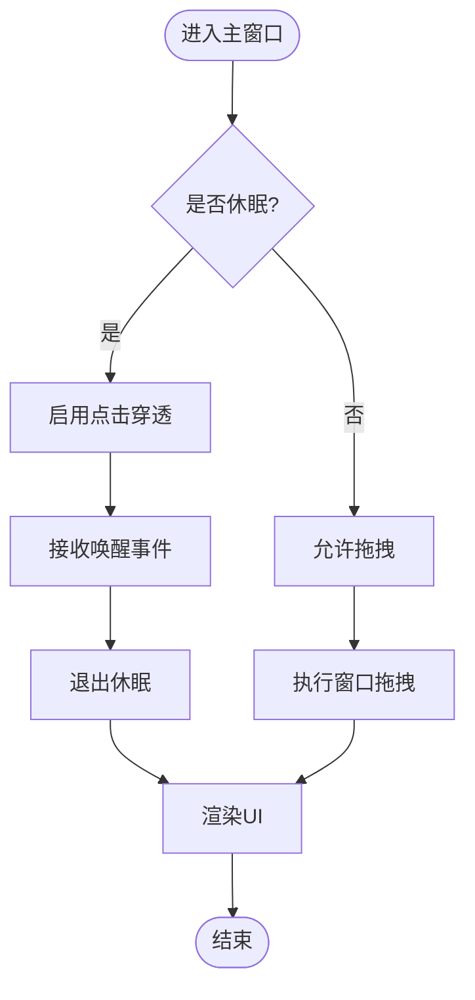
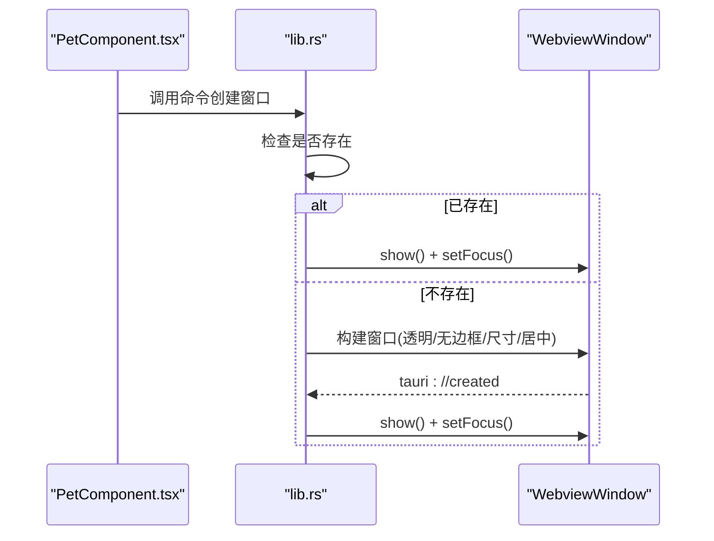
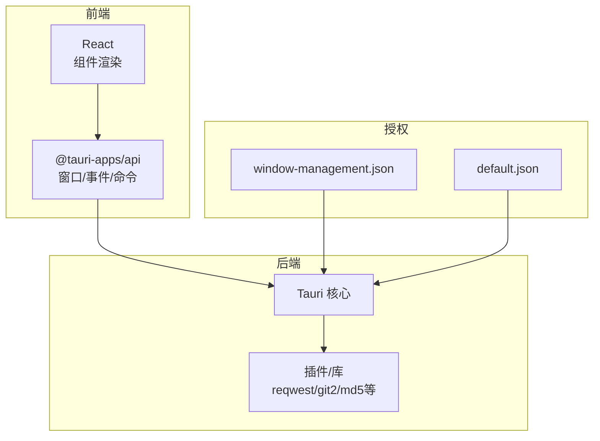

# 窗口架构设计

<cite>
**本文档引用的文件**
- [src/main.tsx](file://src/main.tsx)
- [src/App.tsx](file://src/App.tsx)
- [src/components/PetComponent.tsx](file://src/components/PetComponent.tsx)
- [src/components/MenuPanel.tsx](file://src/components/MenuPanel.tsx)
- [src-tauri/src/lib.rs](file://src-tauri/src/lib.rs)
- [src-tauri/src/window_utils.rs](file://src-tauri/src/window_utils.rs)
- [src-tauri/src/clipboard.rs](file://src-tauri/src/clipboard.rs)
- [src-tauri/src/calendar.rs](file://src-tauri/src/calendar.rs)
- [src-tauri/src/jira_tools.rs](file://src-tauri/src/jira_tools.rs)
- [src-tauri/tauri.conf.json](file://src-tauri/tauri.conf.json)
- [src-tauri/capabilities/window-management.json](file://src-tauri/capabilities/window-management.json)
- [src-tauri/capabilities/default.json](file://src-tauri/capabilities/default.json)
- [public/config/bubbles.json](file://public/config/bubbles.json)
</cite>

## 目录
1. [引言](#引言)
2. [项目结构](#项目结构)
3. [核心组件](#核心组件)
4. [架构总览](#架构总览)
5. [详细组件分析](#详细组件分析)
6. [依赖关系分析](#依赖关系分析)
7. [性能考量](#性能考量)
8. [故障排查指南](#故障排查指南)
9. [结论](#结论)
10. [附录](#附录)

## 引言
本文件系统性阐述桌面宠物应用的窗口架构设计，围绕多窗口体系中的三大类窗口职责（主窗口、功能窗口、系统窗口）展开，结合窗口标签命名规范、窗口类型分类、层级管理策略、创建策略、扩展性设计以及跨平台兼容性进行深入分析，并提供可视化图示帮助读者快速理解。

## 项目结构
前端采用 React + Tauri 架构，窗口逻辑主要分布在前端组件与后端 Rust 命令之间协作实现；窗口配置集中在 Tauri 配置文件与能力声明中。

**图表来源**
- [src/main.tsx:1-10](file://src/main.tsx#L1-L10)
- [src/App.tsx:17-57](file://src/App.tsx#L17-L57)
- [src/components/PetComponent.tsx:19-749](file://src/components/PetComponent.tsx#L19-L749)
- [src/components/MenuPanel.tsx:1-295](file://src/components/MenuPanel.tsx#L1-L295)
- [src-tauri/src/lib.rs:1-1113](file://src-tauri/src/lib.rs#L1-L1113)
- [src-tauri/src/window_utils.rs:1-33](file://src-tauri/src/window_utils.rs#L1-L33)
- [src-tauri/src/clipboard.rs:1-251](file://src-tauri/src/clipboard.rs#L1-L251)
- [src-tauri/src/calendar.rs:1-363](file://src-tauri/src/calendar.rs#L1-L363)
- [src-tauri/src/jira_tools.rs:1-1029](file://src-tauri/src/jira_tools.rs#L1-L1029)
- [src-tauri/tauri.conf.json:1-74](file://src-tauri/tauri.conf.json#L1-L74)
- [src-tauri/capabilities/window-management.json:1-17](file://src-tauri/capabilities/window-management.json#L1-L17)
- [src-tauri/capabilities/default.json:1-12](file://src-tauri/capabilities/default.json#L1-L12)
- [public/config/bubbles.json:1-52](file://public/config/bubbles.json#L1-L52)

**章节来源**
- [src/main.tsx:1-10](file://src/main.tsx#L1-L10)
- [src/App.tsx:17-57](file://src/App.tsx#L17-L57)
- [src-tauri/tauri.conf.json:13-42](file://src-tauri/tauri.conf.json#L13-L42)

## 核心组件
- 主窗口（pet）：桌面宠物窗口，始终置顶、无边框、透明、不可调整大小，用于交互与托盘联动。
- 功能窗口：AI对话、翻译、剪贴板、日历、待办、JSON对比、番茄钟、JIRA助手等，按需创建、复用与销毁。
- 系统窗口：托盘菜单、通知（如番茄钟提醒）等，负责系统级交互与状态提示。
- 菜单面板：九宫格菜单，统一调度各类功能窗口的创建与显示。

**章节来源**
- [src-tauri/tauri.conf.json:15-28](file://src-tauri/tauri.conf.json#L15-L28)
- [src-tauri/tauri.conf.json:29-42](file://src-tauri/tauri.conf.json#L29-L42)
- [src/components/PetComponent.tsx:224-567](file://src/components/PetComponent.tsx#L224-L567)
- [src/components/MenuPanel.tsx:45-259](file://src/components/MenuPanel.tsx#L45-L259)
- [src/App.tsx:26-52](file://src/App.tsx#L26-L52)

## 架构总览
窗口架构以“前端路由 + 后端命令”的模式组织：前端根据窗口 label 决定渲染哪个组件；后端通过命令暴露窗口创建、属性设置、事件通信等能力；能力通过 Tauri 能力配置进行授权控制。

**图表来源**
- [src/components/PetComponent.tsx:341-452](file://src/components/PetComponent.tsx#L341-L452)
- [src-tauri/src/lib.rs:114-160](file://src-tauri/src/lib.rs#L114-L160)
- [src-tauri/src/window_utils.rs:9-32](file://src-tauri/src/window_utils.rs#L9-L32)
- [src/App.tsx:26-52](file://src/App.tsx#L26-L52)

## 详细组件分析

### 主窗口（pet）设计
- 设计理念：轻量、常驻、高优先级，作为系统交互入口与托盘联动中枢。
- 属性特征：透明、无边框、置顶、不可调整大小、不显示在任务栏。
- 行为特性：支持点击穿透（休眠态）、拖拽移动、气泡菜单、唤醒/休眠切换、事件监听（托盘/其他窗口）。

**图表来源**
- [src/components/PetComponent.tsx:19-749](file://src/components/PetComponent.tsx#L19-L749)
- [src-tauri/tauri.conf.json:15-28](file://src-tauri/tauri.conf.json#L15-L28)

**章节来源**
- [src-tauri/tauri.conf.json:15-28](file://src-tauri/tauri.conf.json#L15-L28)
- [src/components/PetComponent.tsx:36-62](file://src/components/PetComponent.tsx#L36-L62)
- [src/components/PetComponent.tsx:152-196](file://src/components/PetComponent.tsx#L152-L196)

### 功能窗口（AI对话、翻译、剪贴板、日历、待办、JSON对比、番茄钟、JIRA）
- 创建策略：按需创建，若已存在则复用并聚焦；创建后等待“tauri://created”事件，超时则回退重建。
- 初始化：部分窗口通过 initialization_script 注入全局变量（如翻译/JSON对比/日历）。
- 属性：多数为透明、无边框、可调整大小、居中显示；部分窗口设置 skipTaskbar、alwaysOnTop 等。
- 事件通信：通过 emit/send 与后端或前端组件通信（如翻译填充、日历刷新）。

**图表来源**
- [src/components/PetComponent.tsx:341-452](file://src/components/PetComponent.tsx#L341-L452)
- [src-tauri/src/lib.rs:114-160](file://src-tauri/src/lib.rs#L114-L160)

**章节来源**
- [src/components/PetComponent.tsx:224-567](file://src/components/PetComponent.tsx#L224-L567)
- [src-tauri/src/lib.rs:75-112](file://src-tauri/src/lib.rs#L75-L112)
- [src-tauri/src/lib.rs:114-160](file://src-tauri/src/lib.rs#L114-L160)
- [src-tauri/src/lib.rs:162-209](file://src-tauri/src/lib.rs#L162-L209)
- [src-tauri/src/lib.rs:634-669](file://src-tauri/src/lib.rs#L634-L669)

### 系统窗口（托盘、通知）
- 托盘菜单：包含显示桌宠、剪贴板、系统信息、AI对话、翻译、日历、退出等项。
- 通知：如番茄钟提醒窗口，透明、无边框、置顶、居中、可见性受控。
- 事件：托盘菜单项触发后端命令，命令再调用前端窗口创建或事件分发。

**图表来源**
- [src-tauri/src/lib.rs:771-797](file://src-tauri/src/lib.rs#L771-L797)
- [src-tauri/tauri.conf.json:29-42](file://src-tauri/tauri.conf.json#L29-L42)

**章节来源**
- [src-tauri/src/lib.rs:771-797](file://src-tauri/src/lib.rs#L771-L797)
- [src-tauri/tauri.conf.json:29-42](file://src-tauri/tauri.conf.json#L29-L42)

### 菜单面板（MenuPanel）
- 统一入口：通过公共配置文件加载菜单项，集中处理窗口创建与显示。
- 交互：点击菜单项后，根据 action 调用相应命令或直接创建窗口。
- 安全：创建流程包含超时等待与错误捕获，失败时回退处理。

**章节来源**
- [src/components/MenuPanel.tsx:45-259](file://src/components/MenuPanel.tsx#L45-L259)
- [public/config/bubbles.json:1-52](file://public/config/bubbles.json#L1-L52)

## 依赖关系分析
- 前端依赖：@tauri-apps/api 提供窗口、事件、命令调用能力；React 负责组件渲染与生命周期。
- 后端依赖：Tauri 核心、插件（如剪贴板、打开器）、第三方库（如 reqwest、git2、md5 等）。
- 能力授权：通过 capabilities 文件声明窗口管理、Webview 创建、窗口焦点等权限。

**图表来源**
- [src-tauri/capabilities/window-management.json:1-17](file://src-tauri/capabilities/window-management.json#L1-L17)
- [src-tauri/capabilities/default.json:1-12](file://src-tauri/capabilities/default.json#L1-L12)

**章节来源**
- [src-tauri/capabilities/window-management.json:1-17](file://src-tauri/capabilities/window-management.json#L1-L17)
- [src-tauri/capabilities/default.json:1-12](file://src-tauri/capabilities/default.json#L1-L12)

## 性能考量
- 窗口创建：采用“先查询是否存在再决定复用或新建”的策略，减少重复创建开销。
- 初始化脚本：通过 initialization_script 注入数据，避免额外网络请求或状态同步。
- 事件监听：仅在需要时监听事件，组件卸载时及时清理，防止内存泄漏。
- 平台差异：点击穿透在 Windows 与非 Windows 平台采用不同实现，避免不必要的性能损耗。

[本节为通用指导，无需具体文件分析]

## 故障排查指南
- 窗口创建超时：前端等待“tauri://created”事件，超时后抛出错误；检查后端命令构建参数与前端 URL 配置。
- 窗口聚焦失败：在已存在窗口情况下，show/setFocus 失败会回退重建；检查窗口状态与平台焦点策略。
- 点击穿透异常：Windows 平台通过窗口扩展样式设置，非 Windows 平台通过忽略鼠标事件；确认平台分支逻辑与权限配置。
- 菜单面板点击外部关闭：通过延时添加事件监听避免误触；检查事件绑定时机与 DOM 结构。

**章节来源**
- [src/components/PetComponent.tsx:254-268](file://src/components/PetComponent.tsx#L254-L268)
- [src/components/PetComponent.tsx:314-338](file://src/components/PetComponent.tsx#L314-L338)
- [src-tauri/src/window_utils.rs:9-32](file://src-tauri/src/window_utils.rs#L9-L32)
- [src/components/MenuPanel.tsx:18-34](file://src/components/MenuPanel.tsx#L18-L34)

## 结论
该窗口架构以“主窗口 + 功能窗口 + 系统窗口”的分层设计为核心，结合前端路由与后端命令的协同，实现了灵活、可扩展且跨平台的窗口管理体系。通过严格的窗口标签命名规范、按需创建与复用策略、以及能力授权与事件通信机制，既保证了用户体验，也为后续新增窗口类型提供了清晰的扩展路径。

## 附录

### 窗口标签命名规范与唯一性保证
- 固定标签：pet、main、clipboard、ai-chat、translator、calendar、json-compare、pomodoro-timer、pomodoro-notification、jira、menu-panel 等。
- 动态标签：
  - expand_*：用于扩展编辑窗口，使用时间戳拼接保证唯一性。
  - todo_YYYY-MM-DD：用于日历待办窗口，基于日期唯一标识。
- 唯一性策略：创建前查询 getAllWindows，若存在则复用；动态标签通过时间戳或日期确保不冲突。

**章节来源**
- [src-tauri/src/lib.rs:78-85](file://src-tauri/src/lib.rs#L78-L85)
- [src-tauri/src/lib.rs:637-638](file://src-tauri/src/lib.rs#L637-L638)
- [src/components/PetComponent.tsx:224-567](file://src/components/PetComponent.tsx#L224-L567)

### 窗口类型分类与适用场景
- 透明窗口：主窗口、功能窗口（AI/翻译/剪贴板/日历/JSON对比/番茄钟/JIRA）等，强调与桌面融合。
- 无边框窗口：与透明窗口配合，提供沉浸式体验。
- 装饰窗口：系统信息窗口等，保留标题栏与边框便于用户操作。
- 置顶窗口：主窗口、通知窗口（如番茄钟提醒），确保可见性。
- 任务栏隐藏：菜单面板、部分功能窗口设置 skipTaskbar，避免干扰任务栏。

**章节来源**
- [src-tauri/tauri.conf.json:15-42](file://src-tauri/tauri.conf.json#L15-L42)
- [src/components/PetComponent.tsx:242-252](file://src/components/PetComponent.tsx#L242-L252)
- [src/components/MenuPanel.tsx:96-107](file://src/components/MenuPanel.tsx#L96-L107)

### 窗口层级管理策略
- Z-order 控制：通过 alwaysOnTop、setFocus 等实现窗口前置；主窗口固定置顶。
- 遮挡处理：点击穿透与鼠标事件忽略策略在休眠态避免误触发；功能窗口创建时居中显示，减少遮挡风险。
- 通知窗口：独立窗口配置，可见性受控，避免长期遮挡。

**章节来源**
- [src-tauri/tauri.conf.json:23-27](file://src-tauri/tauri.conf.json#L23-L27)
- [src-tauri/src/window_utils.rs:9-32](file://src-tauri/src/window_utils.rs#L9-L32)

### 窗口创建策略
- 延迟创建：首次使用时才创建窗口，减少启动开销。
- 按需创建：根据用户操作触发，避免冗余窗口。
- 复用机制：创建前查询是否存在，存在则直接显示并聚焦。
- 初始化注入：通过 initialization_script 注入数据，提升首屏体验。

**章节来源**
- [src/components/PetComponent.tsx:224-567](file://src/components/PetComponent.tsx#L224-L567)
- [src-tauri/src/lib.rs:114-160](file://src-tauri/src/lib.rs#L114-L160)

### 扩展性设计与最佳实践
- 新增窗口类型步骤：
  1) 在前端组件中实现窗口创建与显示逻辑（参考 PetComponent/MenuPanel）。
  2) 在后端命令中实现窗口构建、初始化脚本注入与事件分发（参考 lib.rs 中的命令实现）。
  3) 在 Tauri 配置中声明窗口基础属性（如透明、无边框、置顶等）。
  4) 在能力配置中授予相应权限（如窗口管理、Webview 创建）。
  5) 在菜单配置中添加菜单项（参考 bubbles.json）。
- 最佳实践：
  - 严格遵循标签命名规范，避免冲突。
  - 统一错误处理与超时机制，提升稳定性。
  - 合理使用 initialization_script 减少二次请求。
  - 在跨平台环境下分别处理点击穿透与鼠标事件。

**章节来源**
- [src-tauri/src/lib.rs:1-1113](file://src-tauri/src/lib.rs#L1-L1113)
- [src-tauri/tauri.conf.json:1-74](file://src-tauri/tauri.conf.json#L1-L74)
- [src-tauri/capabilities/window-management.json:1-17](file://src-tauri/capabilities/window-management.json#L1-L17)
- [public/config/bubbles.json:1-52](file://public/config/bubbles.json#L1-L52)

### 跨平台窗口兼容性
- 点击穿透：Windows 平台通过窗口扩展样式设置；非 Windows 平台通过忽略鼠标事件实现。
- 窗口焦点：统一使用 setFocus，平台差异由 Tauri 核心处理。
- 任务栏与置顶：通过配置项在不同平台下自动适配。

**章节来源**
- [src-tauri/src/window_utils.rs:9-32](file://src-tauri/src/window_utils.rs#L9-L32)
- [src-tauri/tauri.conf.json:1-74](file://src-tauri/tauri.conf.json#L1-L74)