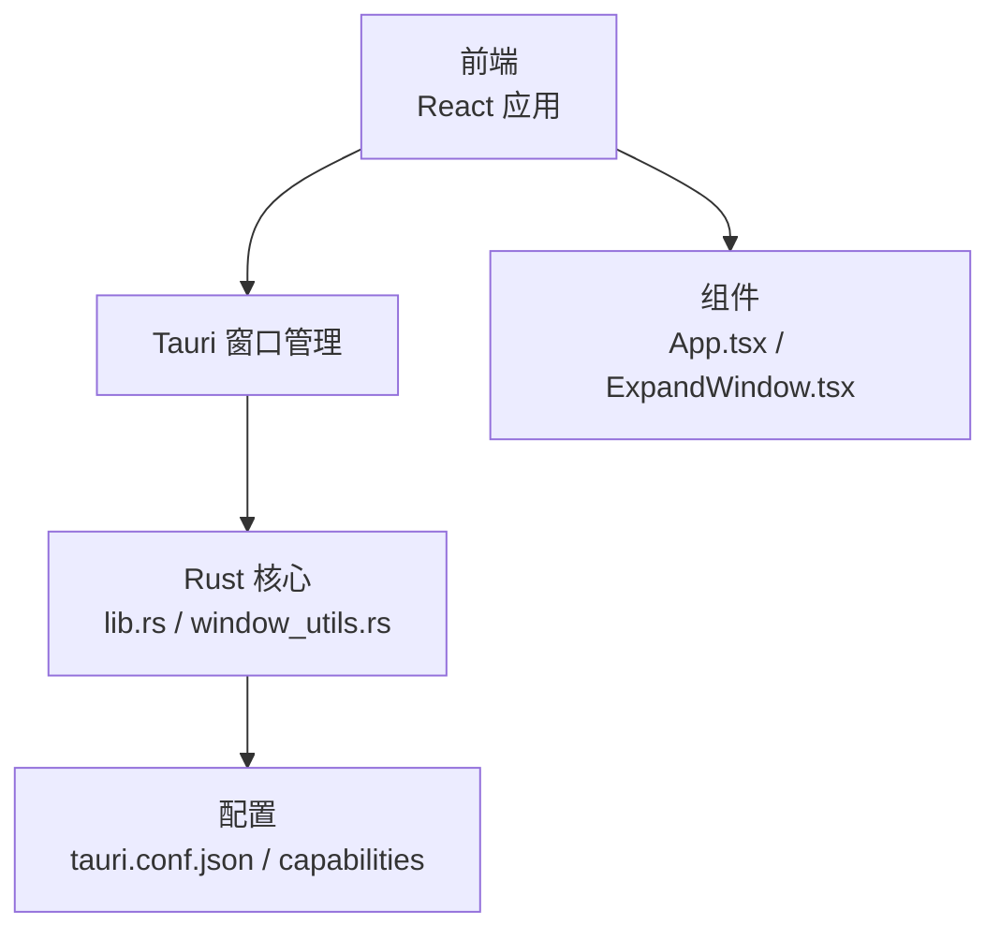
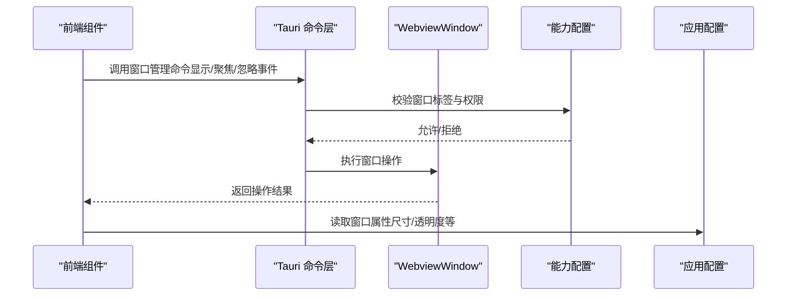
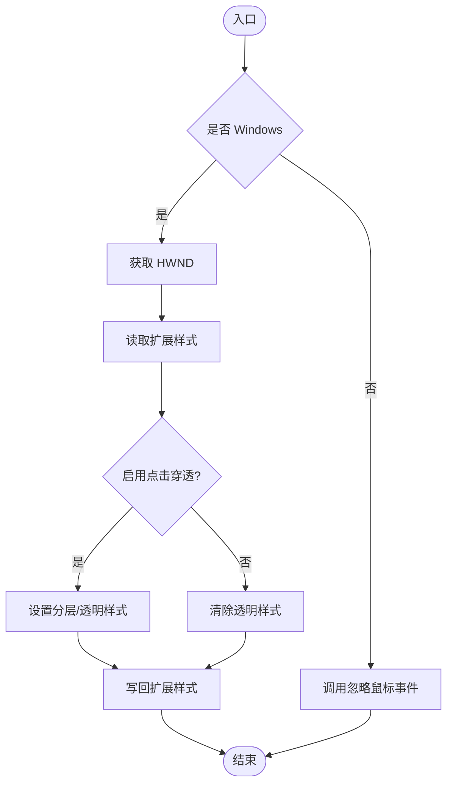
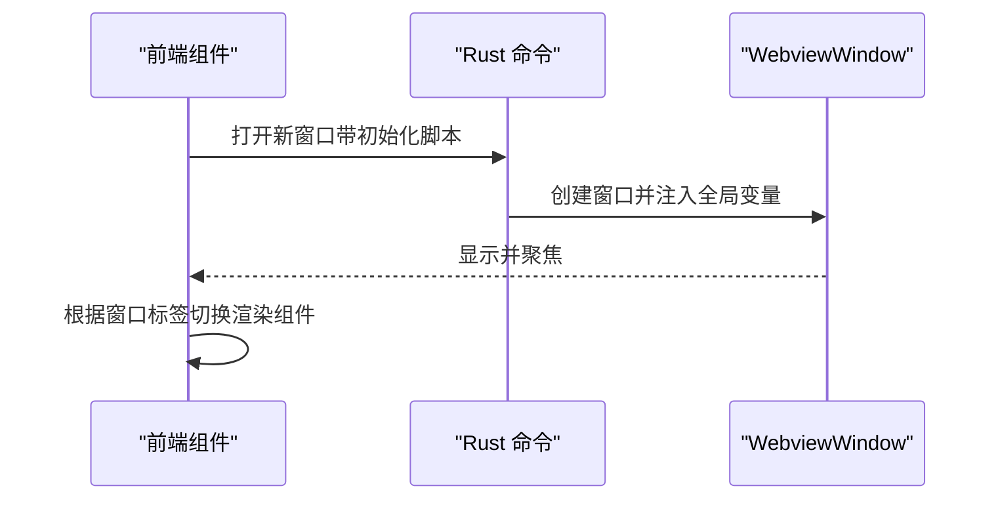
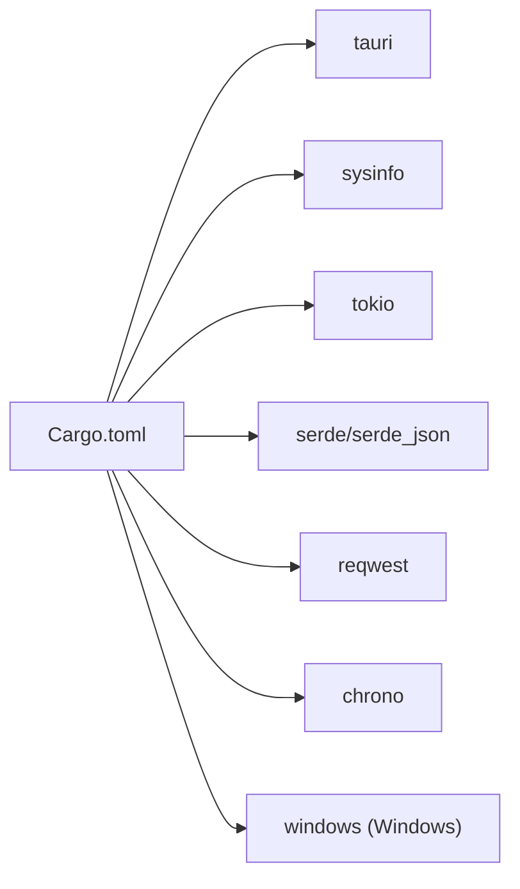

# 窗口状态持久化

<cite>
**本文引用的文件**
- [src-tauri/src/lib.rs](file://src-tauri/src/lib.rs)
- [src-tauri/src/main.rs](file://src-tauri/src/main.rs)
- [src-tauri/src/window_utils.rs](file://src-tauri/src/window_utils.rs)
- [src-tauri/src/calendar.rs](file://src-tauri/src/calendar.rs)
- [src-tauri/Cargo.toml](file://src-tauri/Cargo.toml)
- [src-tauri/tauri.conf.json](file://src-tauri/tauri.conf.json)
- [src-tauri/capabilities/window-management.json](file://src-tauri/capabilities/window-management.json)
- [src/App.tsx](file://src/App.tsx)
- [src/components/ExpandWindow.tsx](file://src/components/ExpandWindow.tsx)
</cite>

## 目录
1. [引言](#引言)
2. [项目结构](#项目结构)
3. [核心组件](#核心组件)
4. [架构总览](#架构总览)
5. [详细组件分析](#详细组件分析)
6. [依赖关系分析](#依赖关系分析)
7. [性能考量](#性能考量)
8. [故障排查指南](#故障排查指南)
9. [结论](#结论)
10. [附录](#附录)

## 引言
本文件围绕“窗口状态持久化”主题，结合代码库现状进行系统化技术文档整理。当前仓库在窗口状态持久化方面主要体现在以下能力：
- 窗口可见性与焦点控制（显示/隐藏/聚焦）
- 窗口属性（尺寸、透明度、装饰、可调整大小等）在配置中的声明
- 基于窗口标签的窗口生命周期管理
- 通过初始化脚本注入内容以实现窗口间数据传递

需要特别说明的是：当前代码库并未实现对窗口位置、尺寸、可见状态等状态的“持久化存储与恢复”。本文将基于现有实现进行分析，并提出面向未来的扩展建议。

## 项目结构
本项目采用 Tauri + React 的桌面应用架构，前端位于 src 目录，Rust 后端位于 src-tauri 目录。窗口状态相关的实现主要分布在：
- Rust 层：窗口工具函数、窗口管理命令、能力配置
- 前端层：窗口标签识别与组件路由、窗口初始化脚本注入

图示来源
- [src-tauri/src/lib.rs](file://src-tauri/src/lib.rs)
- [src-tauri/src/window_utils.rs](file://src-tauri/src/window_utils.rs)
- [src-tauri/tauri.conf.json](file://src-tauri/tauri.conf.json)
- [src/App.tsx](file://src/App.tsx)
- [src/components/ExpandWindow.tsx](file://src/components/ExpandWindow.tsx)

章节来源
- [src-tauri/src/lib.rs](file://src-tauri/src/lib.rs)
- [src-tauri/src/main.rs](file://src-tauri/src/main.rs)
- [src-tauri/tauri.conf.json](file://src-tauri/tauri.conf.json)
- [src-tauri/capabilities/window-management.json](file://src-tauri/capabilities/window-management.json)
- [src/App.tsx](file://src/App.tsx)
- [src/components/ExpandWindow.tsx](file://src/components/ExpandWindow.tsx)

## 核心组件
- 窗口工具模块：提供跨平台的点击穿透设置，用于实现“桌面宠物”等无边框窗口的交互体验。
- 窗口管理命令：提供显示、聚焦、忽略鼠标事件等窗口级操作。
- 能力配置：定义允许的窗口操作权限与目标窗口标签。
- 前端窗口标签识别：根据窗口 label 切换渲染对应组件，支持多窗口场景。
- 初始化脚本注入：通过 initialization_script 将初始数据注入到新窗口的全局变量中，实现窗口间数据传递。

章节来源
- [src-tauri/src/window_utils.rs](file://src-tauri/src/window_utils.rs)
- [src-tauri/src/lib.rs](file://src-tauri/src/lib.rs)
- [src-tauri/capabilities/window-management.json](file://src-tauri/capabilities/window-management.json)
- [src/App.tsx](file://src/App.tsx)
- [src/components/ExpandWindow.tsx](file://src/components/ExpandWindow.tsx)

## 架构总览
下图展示了窗口状态相关的关键交互路径：前端发起窗口操作，Tauri Rust 层执行具体动作，能力配置约束操作范围，配置文件声明窗口属性。

图示来源
- [src-tauri/src/lib.rs](file://src-tauri/src/lib.rs)
- [src-tauri/capabilities/window-management.json](file://src-tauri/capabilities/window-management.json)
- [src-tauri/tauri.conf.json](file://src-tauri/tauri.conf.json)

## 详细组件分析

### 窗口工具模块（点击穿透）
该模块提供跨平台的点击穿透能力，Windows 平台通过 Win32 API 设置窗口扩展样式；非 Windows 平台通过 Tauri 的忽略鼠标事件接口实现。

图示来源
- [src-tauri/src/window_utils.rs](file://src-tauri/src/window_utils.rs)

章节来源
- [src-tauri/src/window_utils.rs](file://src-tauri/src/window_utils.rs)

### 窗口管理命令与前端集成
Rust 层提供窗口管理命令，前端通过标签识别与组件路由配合使用。例如：
- 通过窗口标签区分不同功能窗口（如 pet、main、translator 等）
- 通过 initialization_script 注入初始数据，实现窗口间数据传递

图示来源
- [src-tauri/src/lib.rs](file://src-tauri/src/lib.rs)
- [src/App.tsx](file://src/App.tsx)
- [src/components/ExpandWindow.tsx](file://src/components/ExpandWindow.tsx)

章节来源
- [src-tauri/src/lib.rs](file://src-tauri/src/lib.rs)
- [src/App.tsx](file://src/App.tsx)
- [src/components/ExpandWindow.tsx](file://src/components/ExpandWindow.tsx)

### 能力配置与窗口属性
- 能力配置定义了允许的操作（显示、隐藏、聚焦、忽略鼠标事件）以及目标窗口标签。
- 应用配置文件声明了窗口的初始属性（尺寸、透明度、装饰、可调整大小等），这些属性在窗口创建时生效。

章节来源
- [src-tauri/capabilities/window-management.json](file://src-tauri/capabilities/window-management.json)
- [src-tauri/tauri.conf.json](file://src-tauri/tauri.conf.json)

### 数据模型与持久化现状
当前仓库未实现窗口状态的持久化存储。日志与配置持久化示例（如剪贴板历史、日历设置）展示了基于文件系统的序列化与反序列化模式，可作为未来窗口状态持久化的参考。

章节来源
- [src-tauri/src/calendar.rs](file://src-tauri/src/calendar.rs)

## 依赖关系分析
- Rust 依赖：Tauri、sysinfo、tokio、serde、reqwest、chrono 等。
- Windows 平台依赖：windows crate 提供 Win32 API 支持。
- 能力与配置：通过 capabilities 与 tauri.conf.json 控制窗口行为与权限。

图示来源
- [src-tauri/Cargo.toml](file://src-tauri/Cargo.toml)

章节来源
- [src-tauri/Cargo.toml](file://src-tauri/Cargo.toml)

## 性能考量
- 异步 I/O：日志与配置读写使用 tokio 的异步文件系统，避免阻塞主线程。
- 序列化成本：JSON 序列化/反序列化在频繁读写时需关注内存与 CPU 开销。
- 窗口操作频率：频繁的显示/隐藏/聚焦操作可能影响系统资源，应避免不必要的重复调用。

章节来源
- [src-tauri/src/calendar.rs](file://src-tauri/src/calendar.rs)

## 故障排查指南
- 窗口操作失败：检查能力配置中是否允许相应操作与目标窗口标签是否匹配。
- 初始化脚本注入失败：确认 initialization_script 的全局变量名与前端读取逻辑一致。
- 点击穿透异常：Windows 平台检查 Win32 API 调用返回值；非 Windows 平台检查忽略鼠标事件接口调用。

章节来源
- [src-tauri/capabilities/window-management.json](file://src-tauri/capabilities/window-management.json)
- [src-tauri/src/lib.rs](file://src-tauri/src/lib.rs)
- [src-tauri/src/window_utils.rs](file://src-tauri/src/window_utils.rs)

## 结论
当前代码库在窗口状态持久化方面尚未实现对位置、尺寸、可见状态等的持久化与恢复。现有能力集中在窗口可见性与焦点控制、窗口属性配置、以及通过初始化脚本实现的窗口间数据传递。若需引入窗口状态持久化，建议参考日历设置与剪贴板历史的文件存储模式，结合 Tauri 的状态管理与能力配置，设计统一的状态数据结构与版本管理策略。

## 附录

### 状态数据结构设计（建议）
- 窗口标识：字符串（如窗口标签）
- 位置信息：整数坐标（x, y）
- 尺寸信息：宽度、高度（数值）
- 可见状态：布尔值
- 焦点状态：布尔值
- 其他：透明度、装饰、可调整大小等属性
- 版本字段：用于向后兼容与迁移

### 状态保存机制（建议）
- 定时保存：后台任务定期检查状态变化并持久化
- 事件触发保存：监听窗口显示/隐藏/移动/调整大小等事件
- 应用退出保存：应用关闭时统一落盘

### 状态恢复流程（建议）
- 应用启动时加载状态文件
- 重建窗口并应用属性
- 同步焦点与可见性状态

### 状态版本管理（建议）
- 版本字段：在状态结构中加入版本号
- 向后兼容：读取时检测版本并进行字段映射
- 状态迁移：提供迁移函数处理旧版本字段

### 状态冲突解决（建议）
- 单实例：通过进程间通信或文件锁确保唯一实例
- 多实例：为每个实例维护独立状态文件或命名空间

### 状态验证与错误恢复（建议）
- 完整性校验：校验关键字段类型与范围
- 错误状态恢复：遇到损坏状态时回退到默认值

### 存储优化（建议）
- 压缩算法：对大体量状态使用压缩
- 增量更新：仅保存变化部分
- 存储空间管理：定期清理过期状态

### 安全与隐私（建议）
- 最小化存储：仅保存必要状态
- 加密存储：敏感状态加密
- 访问控制：限制状态文件访问权限
- 隐私合规：遵守相关隐私法规