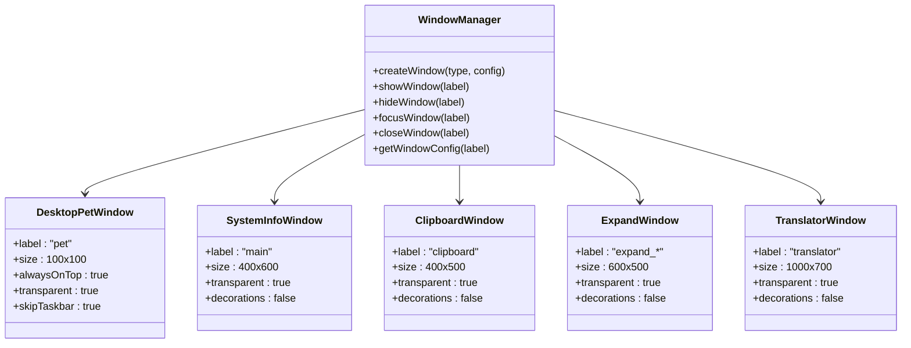
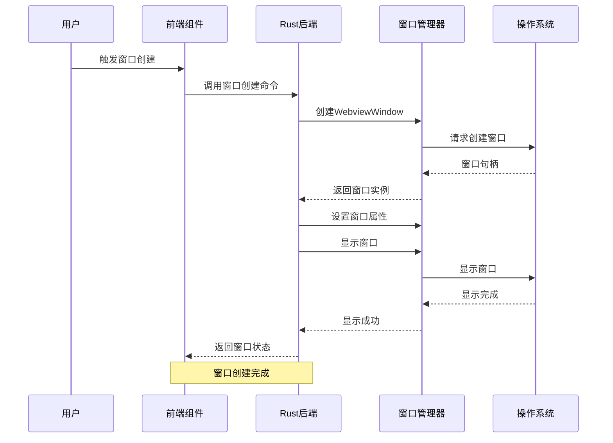
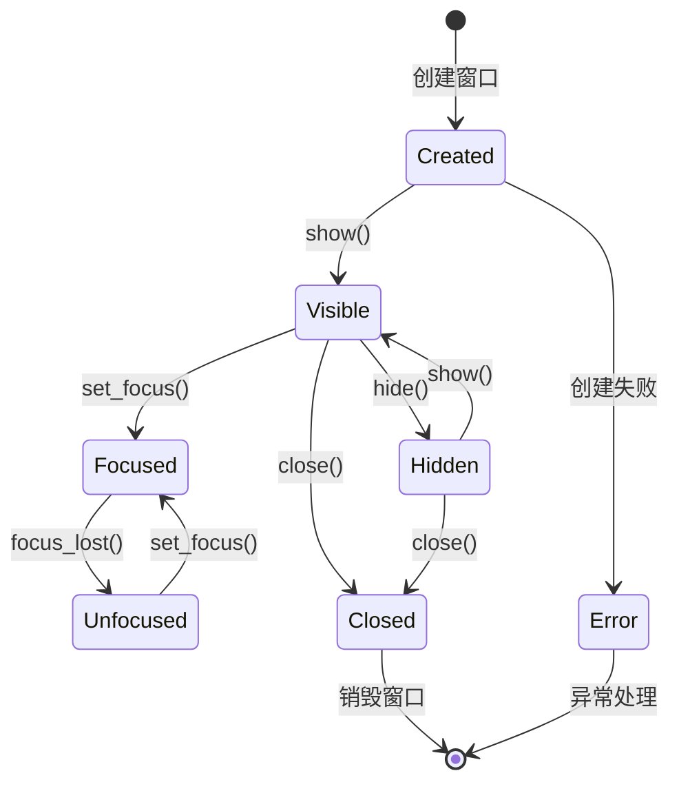
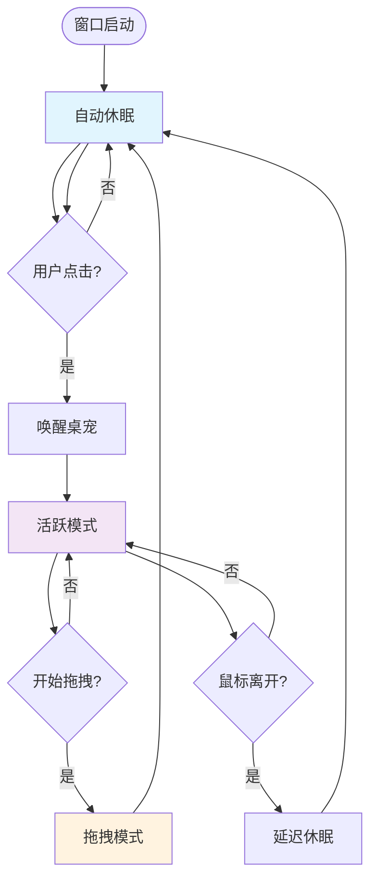
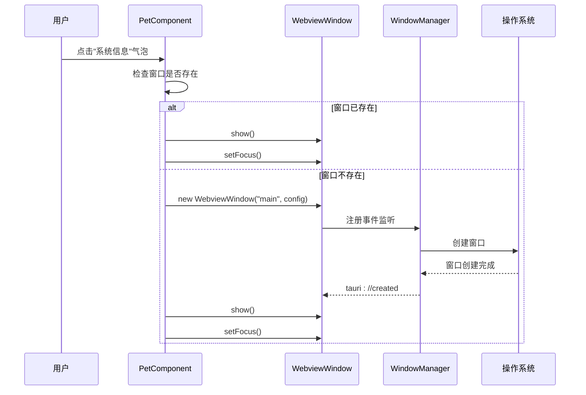
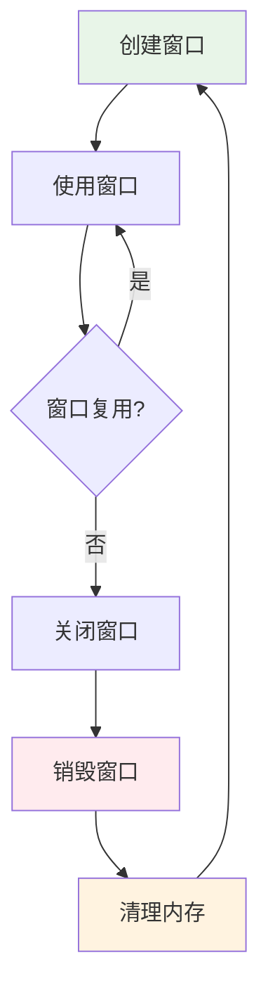

# 窗口生命周期管理

<cite>
**本文档引用的文件**
- [main.rs](file://src-tauri/src/main.rs)
- [lib.rs](file://src-tauri/src/lib.rs)
- [window_utils.rs](file://src-tauri/src/window_utils.rs)
- [App.tsx](file://src/App.tsx)
- [PetComponent.tsx](file://src/components/PetComponent.tsx)
- [ExpandWindow.tsx](file://src/components/ExpandWindow.tsx)
- [TranslatorComponent.tsx](file://src/components/TranslatorComponent.tsx)
- [MenuPanel.tsx](file://src/components/MenuPanel.tsx)
- [window-management.json](file://src-tauri/capabilities/window-management.json)
- [tauri.conf.json](file://src-tauri/tauri.conf.json)
- [package.json](file://package.json)
</cite>

## 目录
1. [简介](#简介)
2. [项目结构](#项目结构)
3. [核心组件](#核心组件)
4. [架构概览](#架构概览)
5. [详细组件分析](#详细组件分析)
6. [依赖关系分析](#依赖关系分析)
7. [性能考虑](#性能考虑)
8. [故障排除指南](#故障排除指南)
9. [结论](#结论)

## 简介

本文档深入分析了 xsun_desktop_pet 项目中的窗口生命周期管理系统。该项目是一个基于 Tauri 的桌面宠物应用，提供了多个独立的窗口组件，包括桌宠窗口、系统信息窗口、剪贴板窗口、翻译窗口等。

窗口生命周期管理涵盖了从窗口创建到销毁的完整流程，包括初始化配置、显示隐藏控制、焦点管理、大小位置控制、状态持久化以及事件监听等多个方面。

## 项目结构

项目采用前后端分离的架构设计，前端使用 React + TypeScript，后端使用 Rust + Tauri：

```mermaid
graph TB
subgraph "前端层"
FE[React 应用]
PC[PetComponent]
EW[ExpandWindow]
TC[TranslatorComponent]
MP[MenuPanel]
APP[App.tsx]
end
subgraph "后端层"
RS[Rust 应用]
LU[window_utils.rs]
LIB[lib.rs]
MAIN[main.rs]
end
subgraph "配置层"
CONF[tauri.conf.json]
CAP[window-management.json]
PKG[package.json]
end
FE --> APP
APP --> PC
APP --> EW
APP --> TC
APP --> MP
PC < --> RS
EW < --> RS
TC < --> RS
MP < --> RS
RS --> LU
RS --> LIB
RS --> MAIN
CONF --> RS
CAP --> RS
PKG --> FE
```

**图表来源**
- [App.tsx:18-58](file://src/App.tsx#L18-L58)
- [main.rs:8-10](file://src-tauri/src/main.rs#L8-L10)
- [lib.rs:1-50](file://src-tauri/src/lib.rs#L1-L50)

**章节来源**
- [App.tsx:1-60](file://src/App.tsx#L1-L60)
- [main.rs:1-11](file://src-tauri/src/main.rs#L1-L11)
- [tauri.conf.json:1-74](file://src-tauri/tauri.conf.json#L1-L74)

## 核心组件

### 窗口管理核心架构

项目实现了完整的窗口生命周期管理机制，主要包括以下核心组件：

1. **窗口创建器**：负责创建各种类型的窗口
2. **窗口状态管理**：跟踪窗口的可见性和焦点状态
3. **窗口配置管理**：管理窗口的尺寸、位置和装饰属性
4. **事件监听系统**：处理窗口的各种事件和用户交互
5. **跨平台兼容性**：支持 Windows 和其他平台的特定功能

### 窗口类型分类

项目中定义了多种窗口类型，每种都有特定的用途和生命周期管理策略：



**图表来源**
- [lib.rs:75-160](file://src-tauri/src/lib.rs#L75-L160)
- [lib.rs:634-669](file://src-tauri/src/lib.rs#L634-L669)
- [tauri.conf.json:13-42](file://src-tauri/tauri.conf.json#L13-L42)

**章节来源**
- [lib.rs:75-160](file://src-tauri/src/lib.rs#L75-L160)
- [lib.rs:634-669](file://src-tauri/src/lib.rs#L634-L669)
- [tauri.conf.json:13-42](file://src-tauri/tauri.conf.json#L13-L42)

## 架构概览

### 窗口生命周期管理架构



**图表来源**
- [PetComponent.tsx:231-286](file://src/components/PetComponent.tsx#L231-L286)
- [lib.rs:75-112](file://src-tauri/src/lib.rs#L75-L112)

### 窗口状态管理流程



**图表来源**
- [PetComponent.tsx:231-286](file://src/components/PetComponent.tsx#L231-L286)
- [lib.rs:75-112](file://src-tauri/src/lib.rs#L75-L112)

## 详细组件分析

### 桌宠窗口生命周期管理

桌宠窗口是项目的核心窗口组件，具有独特的生命周期管理策略：

#### 初始化阶段

桌宠窗口在应用启动时自动创建，并具有以下初始配置：
- 固定尺寸：100x100像素
- 始终置顶：alwaysOnTop = true
- 透明背景：transparent = true
- 无装饰：decorations = false
- 不可调整：resizable = false

#### 状态管理模式



**图表来源**
- [PetComponent.tsx:36-62](file://src/components/PetComponent.tsx#L36-L62)
- [PetComponent.tsx:70-87](file://src/components/PetComponent.tsx#L70-L87)

#### 点击穿透机制

桌宠实现了智能的点击穿透功能，允许用户在休眠状态下仍然可以与底层应用交互：

**章节来源**
- [PetComponent.tsx:36-62](file://src/components/PetComponent.tsx#L36-L62)
- [window_utils.rs:9-32](file://src-tauri/src/window_utils.rs#L9-L32)

### 系统信息窗口管理

系统信息窗口提供了系统监控功能，具有以下生命周期特征：

#### 创建和显示流程



**图表来源**
- [PetComponent.tsx:231-286](file://src/components/PetComponent.tsx#L231-L286)

#### 错误处理机制

系统信息窗口实现了完善的错误处理机制：

**章节来源**
- [PetComponent.tsx:231-286](file://src/components/PetComponent.tsx#L231-L286)

### 翻译窗口生命周期

翻译窗口提供了有道翻译功能，具有以下生命周期管理特点：

#### 窗口配置

翻译窗口具有以下配置特征：
- 标签：translator
- 初始尺寸：1000x700像素
- 透明背景：true
- 无装饰：false
- 可调整大小：true
- 最小尺寸：800x600像素
- 居中显示：true

#### 文本注入机制

翻译窗口支持从外部应用注入文本内容：

**章节来源**
- [lib.rs:115-160](file://src-tauri/src/lib.rs#L115-L160)
- [TranslatorComponent.tsx:75-86](file://src/components/TranslatorComponent.tsx#L75-L86)

### 扩展窗口管理

扩展窗口用于编辑剪贴板内容，具有以下生命周期特征：

#### 内容格式化

扩展窗口实现了智能的内容格式化功能：
- JSON自动格式化
- 逗号分隔格式化
- 内容大小显示
- 编辑状态管理

#### 数据持久化

扩展窗口支持内容的保存和复制功能：

**章节来源**
- [ExpandWindow.tsx:13-25](file://src/components/ExpandWindow.tsx#L13-L25)
- [ExpandWindow.tsx:57-70](file://src/components/ExpandWindow.tsx#L57-L70)

### 菜单面板窗口

菜单面板窗口提供了应用功能的统一入口：

#### 动态窗口创建

菜单面板支持动态创建各种类型的窗口，包括：
- 系统信息窗口
- 剪贴板窗口  
- AI对话窗口
- 翻译窗口
- 日历窗口
- JSON对比窗口
- 番茄钟窗口
- JIRA窗口

#### 窗口复用策略

菜单面板实现了智能的窗口复用机制：
- 检查现有窗口
- 复用已存在的窗口
- 创建新窗口作为后备方案

**章节来源**
- [MenuPanel.tsx:45-88](file://src/components/MenuPanel.tsx#L45-L88)
- [MenuPanel.tsx:90-259](file://src/components/MenuPanel.tsx#L90-L259)

## 依赖关系分析

### 技术栈依赖

```mermaid
graph TB
subgraph "前端依赖"
REACT[React 19.1.0]
TS[TypeScript 5.8.3]
TAURI_API[@tauri-apps/api ~2.8.0]
TAURI_DIALOG[@tauri-apps/plugin-dialog ~2.4.0]
end
subgraph "后端依赖"
RUST[Rust]
TAURI_CORE[tauri ~2]
TAURI_PLUGIN_CLIPBOARD[tauri-plugin-clipboard-manager]
TAURI_PLUGIN_OPENER[tauri-plugin-opener]
end
subgraph "构建工具"
VITE[Vite]
CLI[@tauri/cli ~2]
TYPESCRIPT[TypeScript Compiler]
end
REACT --> TAURI_API
TS --> TAURI_API
TAURI_API --> TAURI_CORE
TAURI_CORE --> TAURI_PLUGIN_CLIPBOARD
TAURI_CORE --> TAURI_PLUGIN_OPENER
VITE --> REACT
CLI --> TAURI_CORE
TYPESCRIPT --> REACT
```

**图表来源**
- [package.json:12-28](file://package.json#L12-L28)

### 窗口权限管理

项目实现了细粒度的窗口权限控制系统：

```mermaid
classDiagram
class Capability {
+identifier : string
+description : string
+windows : Array[string]
+permissions : Array[string]
}
class WindowPermission {
+allow-show : boolean
+allow-hide : boolean
+allow-set-focus : boolean
+allow-set-ignore-cursor-events : boolean
}
class WindowManagementCapability {
+identifier : "window-management"
+windows : ["main", "pet"]
+permissions : [
"core : window : default",
"core : window : allow-show",
"core : window : allow-hide",
"core : window : allow-set-focus",
"core : window : allow-set-ignore-cursor-events"
]
}
Capability --> WindowPermission
WindowManagementCapability --> WindowPermission
```

**图表来源**
- [window-management.json:1-17](file://src-tauri/capabilities/window-management.json#L1-L17)

**章节来源**
- [window-management.json:1-17](file://src-tauri/capabilities/window-management.json#L1-L17)
- [tauri.conf.json:44-51](file://src-tauri/tauri.conf.json#L44-L51)

## 性能考虑

### 窗口创建优化

项目实现了多种性能优化策略：

1. **延迟创建**：仅在用户需要时才创建窗口
2. **窗口复用**：优先复用现有窗口而非重新创建
3. **异步处理**：使用Promise和async/await避免阻塞UI线程
4. **超时机制**：为窗口创建设置超时时间防止无限等待

### 内存管理



### 资源优化

- **最小化窗口**：使用skipTaskbar减少任务栏占用
- **透明窗口**：合理使用透明效果提升视觉体验
- **无装饰窗口**：减少系统装饰开销
- **始终置顶**：确保重要窗口的可见性

## 故障排除指南

### 常见问题及解决方案

#### 窗口创建失败

**问题症状**：
- 窗口创建超时
- tauri://error事件触发
- 控制台出现错误日志

**解决步骤**：
1. 检查窗口配置参数
2. 验证前端URL路径
3. 确认权限配置正确
4. 查看系统资源限制

#### 窗口显示失败

**问题症状**：
- 窗口创建成功但无法显示
- show()方法调用失败
- 窗口处于不可见状态

**解决步骤**：
1. 检查窗口属性配置
2. 验证透明度设置
3. 确认装饰属性兼容性
4. 测试不同平台的兼容性

#### 焦点管理问题

**问题症状**：
- 窗口无法获得焦点
- 焦点丢失频繁
- 无法接收键盘输入

**解决步骤**：
1. 检查alwaysOnTop设置
2. 验证窗口层级关系
3. 确认平台特定的焦点规则
4. 测试与其他应用的交互

### 调试工具和技巧

#### 开发者工具

- 使用浏览器开发者工具调试前端逻辑
- 利用Tauri的调试模式查看后端日志
- 监控窗口事件和生命周期回调
- 分析内存使用情况和性能指标

#### 日志记录

项目在关键节点添加了详细的日志记录：
- 窗口创建和销毁日志
- 状态变更通知
- 错误处理信息
- 性能监控数据

**章节来源**
- [PetComponent.tsx:260-282](file://src/components/PetComponent.tsx#L260-L282)
- [MenuPanel.tsx:67-81](file://src/components/MenuPanel.tsx#L67-L81)

## 结论

本项目实现了完整的窗口生命周期管理系统，具有以下特点：

1. **模块化设计**：每个窗口组件都有清晰的职责分工
2. **跨平台兼容**：支持Windows和其他平台的特定功能
3. **性能优化**：通过延迟创建和复用机制提升性能
4. **错误处理**：完善的异常处理和恢复机制
5. **用户体验**：流畅的窗口管理和交互体验

通过合理的架构设计和实现策略，该项目为桌面应用的窗口管理提供了良好的参考范例。建议在实际项目中根据具体需求调整窗口配置和生命周期管理策略，以获得最佳的用户体验。