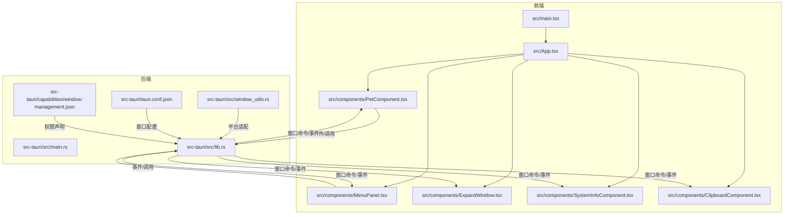
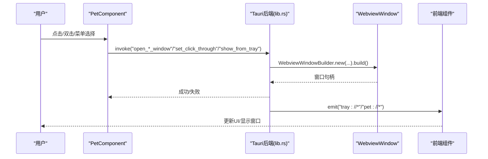
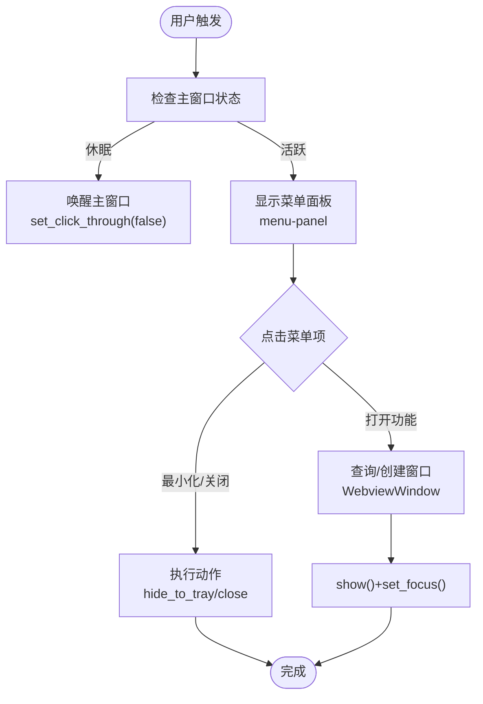
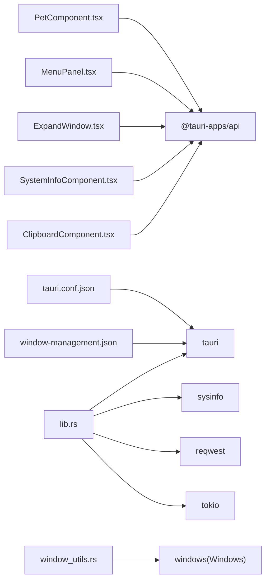
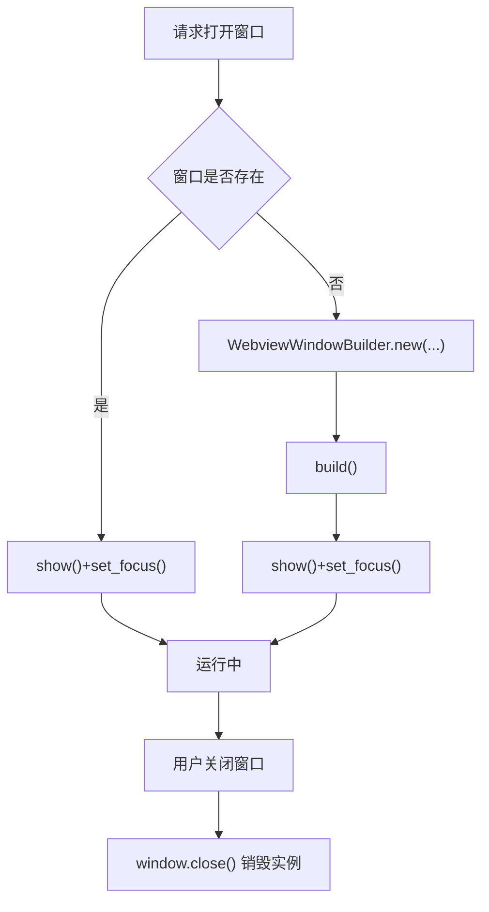

# 窗口管理系统

<cite>
**本文引用的文件**
- [src/main.tsx](file://src/main.tsx)
- [src/App.tsx](file://src/App.tsx)
- [src-tauri/src/main.rs](file://src-tauri/src/main.rs)
- [src-tauri/src/lib.rs](file://src-tauri/src/lib.rs)
- [src-tauri/src/window_utils.rs](file://src-tauri/src/window_utils.rs)
- [src-tauri/Cargo.toml](file://src-tauri/Cargo.toml)
- [src-tauri/tauri.conf.json](file://src-tauri/tauri.conf.json)
- [src-tauri/capabilities/window-management.json](file://src-tauri/capabilities/window-management.json)
- [src/components/PetComponent.tsx](file://src/components/PetComponent.tsx)
- [src/components/MenuPanel.tsx](file://src/components/MenuPanel.tsx)
- [src/components/ExpandWindow.tsx](file://src/components/ExpandWindow.tsx)
- [src/components/SystemInfoComponent.tsx](file://src/components/SystemInfoComponent.tsx)
- [src/components/ClipboardComponent.tsx](file://src/components/ClipboardComponent.tsx)
- [public/config/bubbles.json](file://public/config/bubbles.json)
- [README.md](file://README.md)
</cite>

## 目录
1. [简介](#简介)
2. [项目结构](#项目结构)
3. [核心组件](#核心组件)
4. [架构总览](#架构总览)
5. [详细组件分析](#详细组件分析)
6. [依赖关系分析](#依赖关系分析)
7. [性能考虑](#性能考虑)
8. [故障排查指南](#故障排查指南)
9. [结论](#结论)
10. [附录](#附录)

## 简介
本文件面向“窗口管理系统”的技术文档，围绕多窗口架构设计、窗口生命周期管理、窗口间通信、窗口定位与层级、状态持久化、性能优化、跨平台兼容与错误处理等方面进行系统化阐述。系统采用前端 React + TypeScript 与后端 Rust + Tauri 的混合架构，主窗口（桌宠）常驻，功能窗口按需创建与销毁，菜单窗口作为临时交互入口。

## 项目结构
- 前端入口与应用分发：src/main.tsx、src/App.tsx
- 后端入口与能力声明：src-tauri/src/main.rs、src-tauri/tauri.conf.json、src-tauri/capabilities/window-management.json
- 窗口工具与平台适配：src-tauri/src/window_utils.rs
- 功能组件：PetComponent、MenuPanel、ExpandWindow、SystemInfoComponent、ClipboardComponent 等
- 配置与能力：public/config/bubbles.json、src-tauri/capabilities/window-management.json

图表来源
- [src/main.tsx:1-10](file://src/main.tsx#L1-L10)
- [src/App.tsx:1-57](file://src/App.tsx#L1-L57)
- [src-tauri/src/main.rs:1-11](file://src-tauri/src/main.rs#L1-L11)
- [src-tauri/src/lib.rs:1-120](file://src-tauri/src/lib.rs#L1-L120)
- [src-tauri/src/window_utils.rs:1-33](file://src-tauri/src/window_utils.rs#L1-L33)
- [src-tauri/tauri.conf.json:1-74](file://src-tauri/tauri.conf.json#L1-L74)
- [src-tauri/capabilities/window-management.json:1-17](file://src-tauri/capabilities/window-management.json#L1-L17)

章节来源
- [src/main.tsx:1-10](file://src/main.tsx#L1-L10)
- [src/App.tsx:1-57](file://src/App.tsx#L1-L57)
- [src-tauri/src/main.rs:1-11](file://src-tauri/src/main.rs#L1-L11)
- [src-tauri/tauri.conf.json:1-74](file://src-tauri/tauri.conf.json#L1-L74)
- [src-tauri/capabilities/window-management.json:1-17](file://src-tauri/capabilities/window-management.json#L1-L17)

## 核心组件
- 主窗口（pet）：始终运行，负责桌面宠物交互、托盘事件、窗口状态控制与事件广播。
- 功能窗口：按需创建，如 main（系统信息）、clipboard（剪贴板）、ai-chat、translator、calendar、todo_*、menu-panel、json-compare、pomodoro-*、jira 等。
- 菜单窗口（menu-panel）：点击桌宠或托盘菜单触发，临时展示功能入口，点击后创建对应功能窗口或执行动作。

章节来源
- [src/App.tsx:17-55](file://src/App.tsx#L17-L55)
- [src-tauri/tauri.conf.json:13-42](file://src-tauri/tauri.conf.json#L13-L42)
- [src-tauri/capabilities/window-management.json:5-8](file://src-tauri/capabilities/window-management.json#L5-L8)
- [public/config/bubbles.json:1-52](file://public/config/bubbles.json#L1-L52)

## 架构总览
系统采用“主窗口常驻 + 功能窗口按需创建”的多窗口模式。前端通过 @tauri-apps/api 与后端命令交互；后端通过 Tauri 的 WebviewWindowBuilder 管理窗口生命周期；window_utils 提供跨平台窗口穿透与层级控制；托盘菜单驱动窗口显示/隐藏与事件广播。

图表来源
- [src/components/PetComponent.tsx:224-280](file://src/components/PetComponent.tsx#L224-L280)
- [src-tauri/src/lib.rs:72-109](file://src-tauri/src/lib.rs#L72-L109)
- [src-tauri/src/lib.rs:49-56](file://src-tauri/src/lib.rs#L49-L56)
- [src-tauri/src/lib.rs:693-728](file://src-tauri/src/lib.rs#L693-L728)

## 详细组件分析

### 主窗口（PetComponent）与菜单窗口（MenuPanel）
- 主窗口职责：桌面宠物交互、点击穿透/唤醒、窗口状态控制、事件监听与转发、托盘事件处理、创建/显示/聚焦功能窗口。
- 菜单窗口职责：展示功能入口、点击后创建对应窗口或执行动作、点击外部区域关闭。

图表来源
- [src/components/PetComponent.tsx:156-196](file://src/components/PetComponent.tsx#L156-L196)
- [src/components/PetComponent.tsx:224-280](file://src/components/PetComponent.tsx#L224-L280)
- [src/components/MenuPanel.tsx:45-88](file://src/components/MenuPanel.tsx#L45-L88)

章节来源
- [src/components/PetComponent.tsx:19-749](file://src/components/PetComponent.tsx#L19-L749)
- [src/components/MenuPanel.tsx:14-295](file://src/components/MenuPanel.tsx#L14-L295)

### 系统信息窗口（SystemInfoComponent）
- 负责实时系统监控数据展示，通过命令获取系统信息并通过事件接收更新。
- 生命周期：按需创建，关闭即销毁。

章节来源
- [src/components/SystemInfoComponent.tsx:13-149](file://src/components/SystemInfoComponent.tsx#L13-L149)

### 剪贴板窗口（ClipboardComponent）与展开窗口（ExpandWindow）
- 剪贴板窗口：展示剪贴板历史、复制、清空、展开编辑。
- 展开窗口：基于初始化脚本注入内容，支持格式化、编辑、复制与保存。

章节来源
- [src/components/ClipboardComponent.tsx:12-182](file://src/components/ClipboardComponent.tsx#L12-L182)
- [src/components/ExpandWindow.tsx:6-168](file://src/components/ExpandWindow.tsx#L6-L168)
- [src-tauri/src/lib.rs:72-109](file://src-tauri/src/lib.rs#L72-L109)

### 窗口工具与平台适配（window_utils）
- Windows 平台：通过 Win32 API 设置窗口样式实现穿透/非穿透。
- 非 Windows：通过忽略光标事件实现类似效果。

章节来源
- [src-tauri/src/window_utils.rs:1-33](file://src-tauri/src/window_utils.rs#L1-L33)

### 托盘与事件广播
- 托盘菜单项触发后端命令，实现显示/隐藏主窗口、打开功能窗口、退出应用等。
- 后端通过 emit 向前端广播事件，前端监听并执行相应 UI 行为。

章节来源
- [src-tauri/src/lib.rs:662-728](file://src-tauri/src/lib.rs#L662-L728)
- [src-tauri/src/lib.rs:693-728](file://src-tauri/src/lib.rs#L693-L728)
- [src/components/PetComponent.tsx:161-184](file://src/components/PetComponent.tsx#L161-L184)

## 依赖关系分析
- 前端依赖：@tauri-apps/api（窗口、事件、invoke），React 生态。
- 后端依赖：tauri、sysinfo、reqwest、tokio、serde、windows（Windows 平台）等。
- 能力与权限：通过 capabilities/window-management.json 声明窗口管理权限，tauri.conf.json 定义窗口初始属性。

图表来源
- [src-tauri/Cargo.toml:15-43](file://src-tauri/Cargo.toml#L15-L43)
- [src-tauri/src/lib.rs:1-120](file://src-tauri/src/lib.rs#L1-L120)
- [src-tauri/src/window_utils.rs:1-33](file://src-tauri/src/window_utils.rs#L1-L33)
- [src-tauri/tauri.conf.json:1-74](file://src-tauri/tauri.conf.json#L1-L74)
- [src-tauri/capabilities/window-management.json:1-17](file://src-tauri/capabilities/window-management.json#L1-L17)

章节来源
- [src-tauri/Cargo.toml:15-43](file://src-tauri/Cargo.toml#L15-L43)
- [src-tauri/src/lib.rs:1-120](file://src-tauri/src/lib.rs#L1-L120)
- [src-tauri/tauri.conf.json:1-74](file://src-tauri/tauri.conf.json#L1-L74)
- [src-tauri/capabilities/window-management.json:1-17](file://src-tauri/capabilities/window-management.json#L1-L17)

## 性能考虑
- 窗口复用优先：若目标窗口已存在则 show+set_focus，避免重复创建带来的资源消耗。
- 异步与超时：窗口创建过程使用 Promise + 超时机制，防止阻塞主线程。
- 跨平台适配：Windows 使用 Win32 API，非 Windows 使用忽略光标事件，减少不必要的渲染开销。
- 数据持久化：配置与数据写入磁盘采用 tokio 异步文件系统，避免阻塞 UI。
- 资源释放：窗口关闭即销毁，避免内存泄漏；事件监听在组件卸载时及时移除。

章节来源
- [src/components/PetComponent.tsx:224-280](file://src/components/PetComponent.tsx#L224-L280)
- [src/components/MenuPanel.tsx:45-88](file://src/components/MenuPanel.tsx#L45-L88)
- [src-tauri/src/lib.rs:203-240](file://src-tauri/src/lib.rs#L203-L240)

## 故障排查指南
- 窗口创建失败：检查 tauri.conf.json 中窗口配置与 capabilities 权限；确认 WebviewUrl 与初始化脚本正确。
- 窗口显示/聚焦失败：确认窗口句柄有效，调用 show/set_focus 的错误处理分支。
- 点击穿透无效：检查 window_utils 在当前平台的实现；Windows 平台需确保 Win32 API 调用成功。
- 事件未触发：确认前端监听的事件名与后端 emit 的事件名一致；检查命令调用链路。
- 托盘菜单无响应：验证托盘事件处理函数与菜单项 ID 匹配；确认 AppHandle 正确传递。

章节来源
- [src-tauri/tauri.conf.json:13-42](file://src-tauri/tauri.conf.json#L13-L42)
- [src-tauri/capabilities/window-management.json:1-17](file://src-tauri/capabilities/window-management.json#L1-L17)
- [src-tauri/src/window_utils.rs:9-32](file://src-tauri/src/window_utils.rs#L9-L32)
- [src-tauri/src/lib.rs:693-728](file://src-tauri/src/lib.rs#L693-L728)

## 结论
该窗口管理系统以“主窗口常驻 + 功能窗口按需创建”为核心，结合托盘事件与前端命令调用，实现了灵活、可扩展且跨平台的多窗口桌面应用。通过统一的窗口工具与权限配置，系统在不同平台上保持一致的行为与体验，并通过事件广播与生命周期管理保障了良好的交互与性能表现。

## 附录

### 窗口生命周期流程（创建/显示/隐藏/销毁）

图表来源
- [src/components/PetComponent.tsx:224-280](file://src/components/PetComponent.tsx#L224-L280)
- [src/components/MenuPanel.tsx:45-88](file://src/components/MenuPanel.tsx#L45-L88)
- [src-tauri/src/lib.rs:525-560](file://src-tauri/src/lib.rs#L525-L560)

### 窗口定位与层级管理
- 初始配置：tauri.conf.json 中定义窗口尺寸、透明、装饰、置顶、跳过任务栏等属性。
- 运行时控制：通过 set_focus、show、hide 控制层级与可见性；点击穿透通过 window_utils 实现。

章节来源
- [src-tauri/tauri.conf.json:13-42](file://src-tauri/tauri.conf.json#L13-L42)
- [src-tauri/src/window_utils.rs:9-32](file://src-tauri/src/window_utils.rs#L9-L32)

### 窗口间通信机制
- 命令调用：前端通过 invoke 调用后端命令，后端执行业务逻辑并返回结果。
- 事件广播：后端通过 emit 向前端广播事件，前端监听并更新 UI。
- 初始化脚本：通过 initialization_script 注入全局变量，实现窗口间数据传递。

章节来源
- [src-tauri/src/lib.rs:38-47](file://src-tauri/src/lib.rs#L38-L47)
- [src-tauri/src/lib.rs:50-56](file://src-tauri/src/lib.rs#L50-L56)
- [src-tauri/src/lib.rs:93-98](file://src-tauri/src/lib.rs#L93-L98)
- [src-tauri/src/lib.rs:545-548](file://src-tauri/src/lib.rs#L545-L548)

### 状态持久化
- 配置持久化：AI/翻译配置保存至用户应用数据目录；日历设置与待办事项同样持久化。
- 剪贴板历史：当前实现为内存缓存，重启丢失。

章节来源
- [src-tauri/src/lib.rs:203-240](file://src-tauri/src/lib.rs#L203-L240)
- [src-tauri/src/lib.rs:462-522](file://src-tauri/src/lib.rs#L462-L522)
- [src-tauri/src/lib.rs:562-609](file://src-tauri/src/lib.rs#L562-L609)

### 跨平台兼容性
- Windows：使用 Win32 API 设置窗口样式，实现穿透/非穿透。
- 非 Windows：使用忽略光标事件 API 达到相似效果。
- 依赖声明：Cargo.toml 中针对 Windows 的 windows crate 条件依赖。

章节来源
- [src-tauri/src/window_utils.rs:9-32](file://src-tauri/src/window_utils.rs#L9-L32)
- [src-tauri/Cargo.toml:37-43](file://src-tauri/Cargo.toml#L37-L43)

### 最佳实践与扩展建议
- 窗口管理
  - 优先复用已存在窗口，避免重复创建。
  - 为窗口创建增加超时与错误回调，提升健壮性。
  - 使用 initialization_script 传递必要参数，减少额外 IPC。
- 事件与通信
  - 统一事件命名规范，前后端一致。
  - 在组件卸载时及时移除事件监听，防止内存泄漏。
- 性能优化
  - 异步读写配置与数据，避免阻塞 UI。
  - 合理使用透明与装饰选项，平衡视觉与性能。
- 扩展方法
  - 在 bubbles.json 中新增菜单项，前端组件中添加对应处理逻辑。
  - 后端命令函数中实现业务逻辑，必要时扩展 capabilities。

章节来源
- [public/config/bubbles.json:1-52](file://public/config/bubbles.json#L1-L52)
- [README.md:261-268](file://README.md#L261-L268)