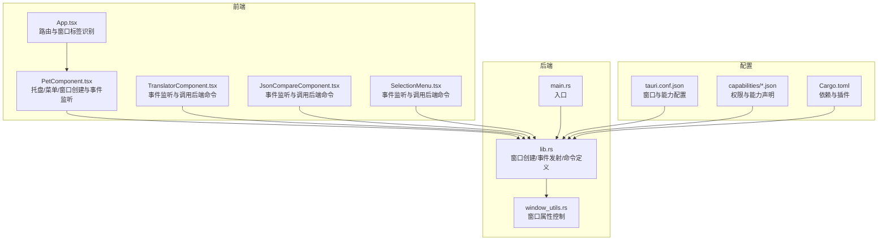
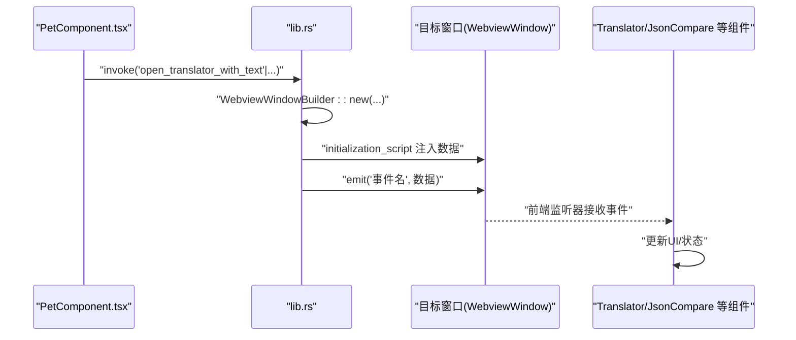
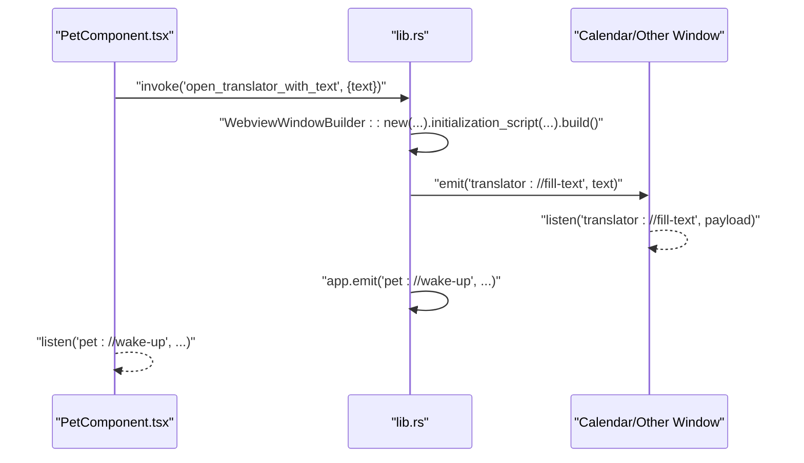
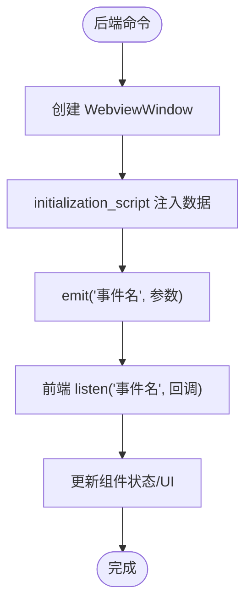
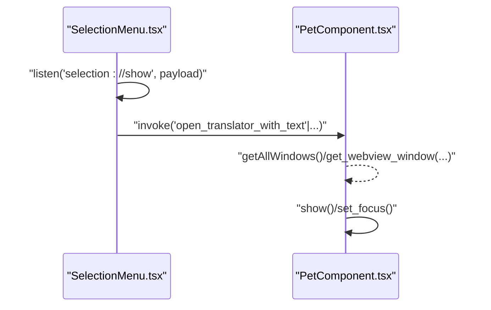
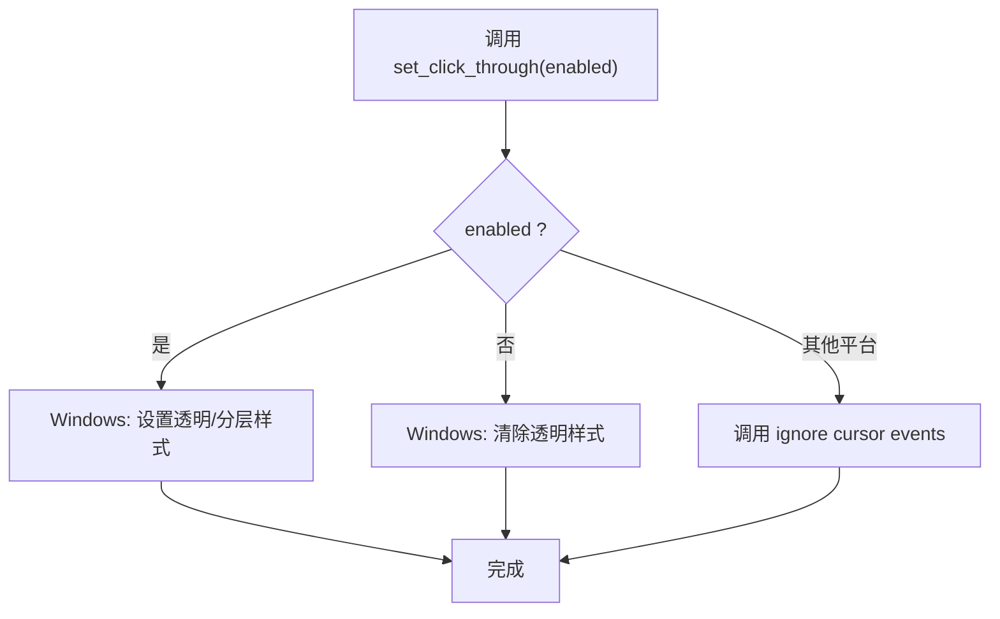
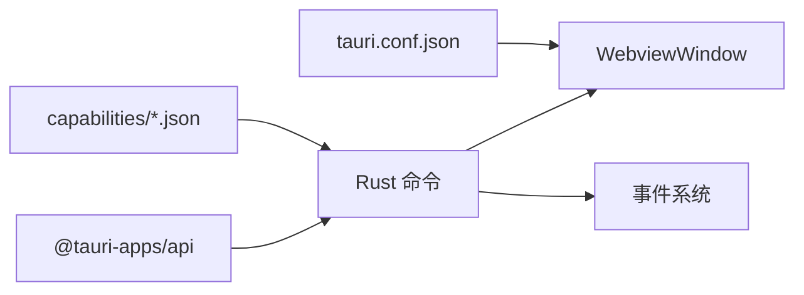

# 窗口间通信机制

<cite>
**本文引用的文件**
- [src-tauri/src/main.rs](file://src-tauri/src/main.rs)
- [src-tauri/src/lib.rs](file://src-tauri/src/lib.rs)
- [src-tauri/src/window_utils.rs](file://src-tauri/src/window_utils.rs)
- [src/App.tsx](file://src/App.tsx)
- [src/main.tsx](file://src/main.tsx)
- [src/components/PetComponent.tsx](file://src/components/PetComponent.tsx)
- [src/components/TranslatorComponent.tsx](file://src/components/TranslatorComponent.tsx)
- [src/components/JsonCompareComponent.tsx](file://src/components/JsonCompareComponent.tsx)
- [src/components/SelectionMenu.tsx](file://src/components/SelectionMenu.tsx)
- [src-tauri/Cargo.toml](file://src-tauri/Cargo.toml)
- [src-tauri/tauri.conf.json](file://src-tauri/tauri.conf.json)
- [src-tauri/capabilities/default.json](file://src-tauri/capabilities/default.json)
- [src-tauri/capabilities/window-management.json](file://src-tauri/capabilities/window-management.json)
</cite>

## 目录
1. [引言](#引言)
2. [项目结构](#项目结构)
3. [核心组件](#核心组件)
4. [架构总览](#架构总览)
5. [详细组件分析](#详细组件分析)
6. [依赖关系分析](#依赖关系分析)
7. [性能考量](#性能考量)
8. [故障排查指南](#故障排查指南)
9. [结论](#结论)
10. [附录](#附录)

## 引言
本文件系统性阐述该 Tauri 桌面应用中的“窗口间通信机制”。围绕以下主题展开：
- WebviewWindow 的获取与管理策略
- 事件发射与监听（app.emit 与 window.on）的使用模式
- 消息传递协议（事件命名规范、数据序列化与反序列化）
- 跨窗口状态同步（全局状态共享与局部状态隔离）
- 窗口间数据传递（初始化脚本注入、事件参数传递、回调机制）
- 安全与性能优化（事件验证、权限控制、数据过滤、批量事件、去重与内存管理）
- 常见通信模式与最佳实践

## 项目结构
该项目采用前端 React + Tauri 后端的分层架构。前端负责 UI 与事件监听，后端 Rust 提供窗口管理、命令接口与系统能力。

图表来源
- [src-tauri/src/lib.rs:74-160](file://src-tauri/src/lib.rs#L74-L160)
- [src-tauri/src/window_utils.rs:1-33](file://src-tauri/src/window_utils.rs#L1-L33)
- [src-tauri/src/main.rs:8-11](file://src-tauri/src/main.rs#L8-L11)
- [src-tauri/tauri.conf.json:13-51](file://src-tauri/tauri.conf.json#L13-L51)
- [src-tauri/capabilities/default.json:1-12](file://src-tauri/capabilities/default.json#L1-L12)
- [src-tauri/capabilities/window-management.json:1-17](file://src-tauri/capabilities/window-management.json#L1-L17)
- [src-tauri/Cargo.toml:15-36](file://src-tauri/Cargo.toml#L15-L36)

章节来源
- [src-tauri/src/lib.rs:1-1113](file://src-tauri/src/lib.rs#L1-L1113)
- [src-tauri/src/window_utils.rs:1-33](file://src-tauri/src/window_utils.rs#L1-L33)
- [src-tauri/src/main.rs:1-11](file://src-tauri/src/main.rs#L1-L11)
- [src-tauri/tauri.conf.json:1-74](file://src-tauri/tauri.conf.json#L1-L74)
- [src-tauri/capabilities/default.json:1-12](file://src-tauri/capabilities/default.json#L1-L12)
- [src-tauri/capabilities/window-management.json:1-17](file://src-tauri/capabilities/window-management.json#L1-L17)
- [src-tauri/Cargo.toml:1-44](file://src-tauri/Cargo.toml#L1-L44)

## 核心组件
- 后端命令与窗口管理
  - 窗口创建与初始化脚本注入：通过命令创建新窗口，并以 initialization_script 注入初始数据。
  - 事件发射：在后端使用 app.emit 或 window.emit 将事件广播到前端监听器。
  - 窗口属性控制：通过命令控制窗口点击穿透、可见性、焦点等。
- 前端事件监听与窗口创建
  - 通过 @tauri-apps/api/event.listen 监听后端事件，执行 UI 更新或窗口操作。
  - 通过 @tauri-apps/api/window.WebviewWindow 创建新窗口，监听 tauri://created/tauri://error 生命周期事件。
- 配置与权限
  - tauri.conf.json 定义窗口属性与能力集合。
  - capabilities/*.json 声明窗口权限（如窗口管理、Webview 创建等）。

章节来源
- [src-tauri/src/lib.rs:48-112](file://src-tauri/src/lib.rs#L48-L112)
- [src-tauri/src/lib.rs:114-209](file://src-tauri/src/lib.rs#L114-L209)
- [src-tauri/src/lib.rs:634-669](file://src-tauri/src/lib.rs#L634-L669)
- [src-tauri/src/window_utils.rs:9-32](file://src-tauri/src/window_utils.rs#L9-L32)
- [src/components/PetComponent.tsx:156-202](file://src/components/PetComponent.tsx#L156-L202)
- [src/components/TranslatorComponent.tsx:75-86](file://src/components/TranslatorComponent.tsx#L75-L86)
- [src/components/JsonCompareComponent.tsx:46-66](file://src/components/JsonCompareComponent.tsx#L46-L66)
- [src-tauri/tauri.conf.json:13-51](file://src-tauri/tauri.conf.json#L13-L51)
- [src-tauri/capabilities/default.json:1-12](file://src-tauri/capabilities/default.json#L1-L12)
- [src-tauri/capabilities/window-management.json:1-17](file://src-tauri/capabilities/window-management.json#L1-L17)

## 架构总览
下图展示从前端事件到后端命令再到前端监听的整体流程。

图表来源
- [src-tauri/src/lib.rs:114-160](file://src-tauri/src/lib.rs#L114-L160)
- [src-tauri/src/lib.rs:162-209](file://src-tauri/src/lib.rs#L162-L209)
- [src-tauri/src/lib.rs:634-669](file://src-tauri/src/lib.rs#L634-L669)
- [src/components/TranslatorComponent.tsx:75-86](file://src/components/TranslatorComponent.tsx#L75-L86)
- [src/components/JsonCompareComponent.tsx:46-66](file://src/components/JsonCompareComponent.tsx#L46-L66)

## 详细组件分析

### 组件一：窗口创建与事件发射（PetComponent → lib.rs）
- 前端通过 WebviewWindow 创建窗口，并监听 tauri://created/tauri://error 生命周期事件。
- 后端通过命令创建窗口，注入初始化脚本，并可向窗口发射事件。
- 桌宠窗口通过 app.emit 广播唤醒事件，其他窗口监听并响应。

图表来源
- [src/components/PetComponent.tsx:156-202](file://src/components/PetComponent.tsx#L156-L202)
- [src-tauri/src/lib.rs:52-59](file://src-tauri/src/lib.rs#L52-L59)
- [src-tauri/src/lib.rs:114-160](file://src-tauri/src/lib.rs#L114-L160)

章节来源
- [src/components/PetComponent.tsx:156-202](file://src/components/PetComponent.tsx#L156-L202)
- [src-tauri/src/lib.rs:52-59](file://src-tauri/src/lib.rs#L52-L59)
- [src-tauri/src/lib.rs:114-160](file://src-tauri/src/lib.rs#L114-L160)

### 组件二：初始化脚本注入与事件参数传递（lib.rs → Translator/JsonCompare）
- 后端命令通过 initialization_script 将初始数据注入到新窗口的全局变量。
- 前端组件监听对应事件，接收 payload 并更新本地状态。
- 事件名采用命名空间前缀区分功能域（如 translator://、json://）。

图表来源
- [src-tauri/src/lib.rs:96-99](file://src-tauri/src/lib.rs#L96-L99)
- [src-tauri/src/lib.rs:145-148](file://src-tauri/src/lib.rs#L145-L148)
- [src-tauri/src/lib.rs:194-197](file://src-tauri/src/lib.rs#L194-L197)
- [src-tauri/src/lib.rs:654-657](file://src-tauri/src/lib.rs#L654-L657)
- [src/components/TranslatorComponent.tsx:75-86](file://src/components/TranslatorComponent.tsx#L75-L86)
- [src/components/JsonCompareComponent.tsx:46-66](file://src/components/JsonCompareComponent.tsx#L46-L66)

章节来源
- [src-tauri/src/lib.rs:74-112](file://src-tauri/src/lib.rs#L74-L112)
- [src-tauri/src/lib.rs:114-209](file://src-tauri/src/lib.rs#L114-L209)
- [src-tauri/src/lib.rs:634-669](file://src-tauri/src/lib.rs#L634-L669)
- [src/components/TranslatorComponent.tsx:75-86](file://src/components/TranslatorComponent.tsx#L75-L86)
- [src/components/JsonCompareComponent.tsx:46-66](file://src/components/JsonCompareComponent.tsx#L46-L66)

### 组件三：事件监听与窗口生命周期（SelectionMenu → PetComponent）
- 选中文本快捷菜单窗口监听 selection://show 事件，接收坐标与文本，随后关闭自身。
- 桌宠窗口监听托盘事件，创建或聚焦相应功能窗口。

图表来源
- [src/components/SelectionMenu.tsx:18-44](file://src/components/SelectionMenu.tsx#L18-L44)
- [src/components/PetComponent.tsx:586-647](file://src/components/PetComponent.tsx#L586-L647)
- [src-tauri/src/lib.rs:114-160](file://src-tauri/src/lib.rs#L114-L160)

章节来源
- [src/components/SelectionMenu.tsx:1-141](file://src/components/SelectionMenu.tsx#L1-L141)
- [src/components/PetComponent.tsx:586-647](file://src/components/PetComponent.tsx#L586-L647)
- [src-tauri/src/lib.rs:114-160](file://src-tauri/src/lib.rs#L114-L160)

### 组件四：窗口属性控制与全局状态（window_utils.rs）
- 通过命令 set_click_through 控制窗口忽略鼠标事件（点击穿透），用于实现“休眠”态。
- 该命令在不同平台采用不同的底层 API 实现。

图表来源
- [src-tauri/src/window_utils.rs:9-32](file://src-tauri/src/window_utils.rs#L9-L32)

章节来源
- [src-tauri/src/window_utils.rs:1-33](file://src-tauri/src/window_utils.rs#L1-L33)

## 依赖关系分析
- 前端依赖
  - @tauri-apps/api 提供 window、event、core（invoke）等能力。
  - React 负责组件化 UI 与状态管理。
- 后端依赖
  - tauri 提供窗口、菜单、托盘、事件等能力；serde/serde_json 用于序列化。
  - tokio 用于异步文件系统与网络请求。
- 配置依赖
  - tauri.conf.json 定义窗口与能力集合。
  - capabilities/*.json 声明权限范围。

图表来源
- [src-tauri/Cargo.toml:15-36](file://src-tauri/Cargo.toml#L15-L36)
- [src-tauri/tauri.conf.json:44-51](file://src-tauri/tauri.conf.json#L44-L51)
- [src-tauri/capabilities/default.json:6-10](file://src-tauri/capabilities/default.json#L6-L10)
- [src-tauri/capabilities/window-management.json:9-15](file://src-tauri/capabilities/window-management.json#L9-L15)

章节来源
- [src-tauri/Cargo.toml:1-44](file://src-tauri/Cargo.toml#L1-L44)
- [src-tauri/tauri.conf.json:1-74](file://src-tauri/tauri.conf.json#L1-L74)
- [src-tauri/capabilities/default.json:1-12](file://src-tauri/capabilities/default.json#L1-L12)
- [src-tauri/capabilities/window-management.json:1-17](file://src-tauri/capabilities/window-management.json#L1-L17)

## 性能考量
- 批量事件处理
  - 对于高频事件（如日历刷新），建议后端聚合后再一次性发射，减少前端监听压力。
- 事件去重
  - 前端监听器可在回调中进行幂等判断（例如基于 payload 的哈希或时间戳）。
- 内存管理
  - 监听器需在组件卸载时及时解绑（React useEffect 返回值解绑）。
  - 窗口关闭后释放资源，避免残留事件句柄。
- 序列化成本
  - 大对象传输前尽量压缩或拆分，避免阻塞主线程。
- 异步与超时
  - 窗口创建过程加入超时与错误回调，避免 UI 卡死。

## 故障排查指南
- 窗口创建失败
  - 检查 tauri://created/tauri://error 生命周期事件是否触发。
  - 核对 capabilities 是否允许创建 WebviewWindow。
- 事件未到达
  - 确认事件名拼写一致且命名空间正确。
  - 确认监听器在组件挂载后注册，卸载时解绑。
- 初始化脚本未生效
  - 检查 initialization_script 注入的数据是否为合法 JSON 字符串。
  - 确认前端在窗口 ready 后再发起事件通信。
- 权限不足
  - 检查 tauri.conf.json 中的能力集合与 capabilities/*.json 的权限声明。

章节来源
- [src-tauri/tauri.conf.json:44-51](file://src-tauri/tauri.conf.json#L44-L51)
- [src-tauri/capabilities/default.json:6-10](file://src-tauri/capabilities/default.json#L6-L10)
- [src-tauri/capabilities/window-management.json:9-15](file://src-tauri/capabilities/window-management.json#L9-L15)
- [src/components/PetComponent.tsx:260-274](file://src/components/PetComponent.tsx#L260-L274)

## 结论
本项目通过“命令驱动 + 事件驱动”的混合模式实现了稳定的窗口间通信：
- 命令用于创建窗口与注入初始数据；
- 事件用于跨窗口状态同步与即时交互；
- 配置与权限明确划分了能力边界；
- 前后端配合实现了良好的用户体验与可维护性。

## 附录

### 事件命名规范与数据模型
- 事件命名
  - 使用功能域前缀区分（如 pet://、tray://、translator://、json://、selection://）。
- 数据序列化
  - 后端通过 serde_json 序列化注入脚本与事件参数。
  - 前端通过 listen 接收 payload 并更新本地状态。
- 全局状态共享
  - 通过 app.emit 广播全局事件（如唤醒）。
- 局部状态隔离
  - 窗口内组件状态独立，仅通过事件共享必要数据。

章节来源
- [src-tauri/src/lib.rs:52-59](file://src-tauri/src/lib.rs#L52-L59)
- [src-tauri/src/lib.rs:96-99](file://src-tauri/src/lib.rs#L96-L99)
- [src-tauri/src/lib.rs:145-148](file://src-tauri/src/lib.rs#L145-L148)
- [src-tauri/src/lib.rs:194-197](file://src-tauri/src/lib.rs#L194-L197)
- [src-tauri/src/lib.rs:654-657](file://src-tauri/src/lib.rs#L654-L657)
- [src/components/TranslatorComponent.tsx:75-86](file://src/components/TranslatorComponent.tsx#L75-L86)
- [src/components/JsonCompareComponent.tsx:46-66](file://src/components/JsonCompareComponent.tsx#L46-L66)