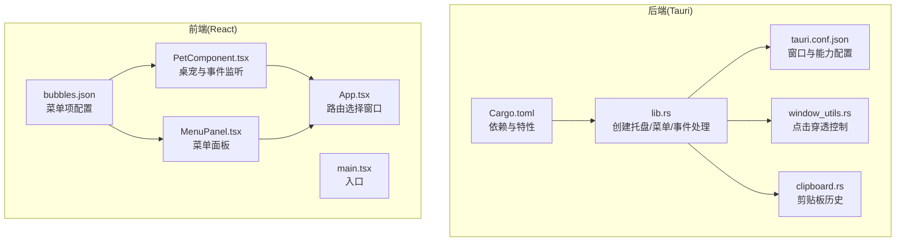
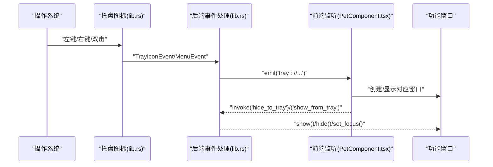
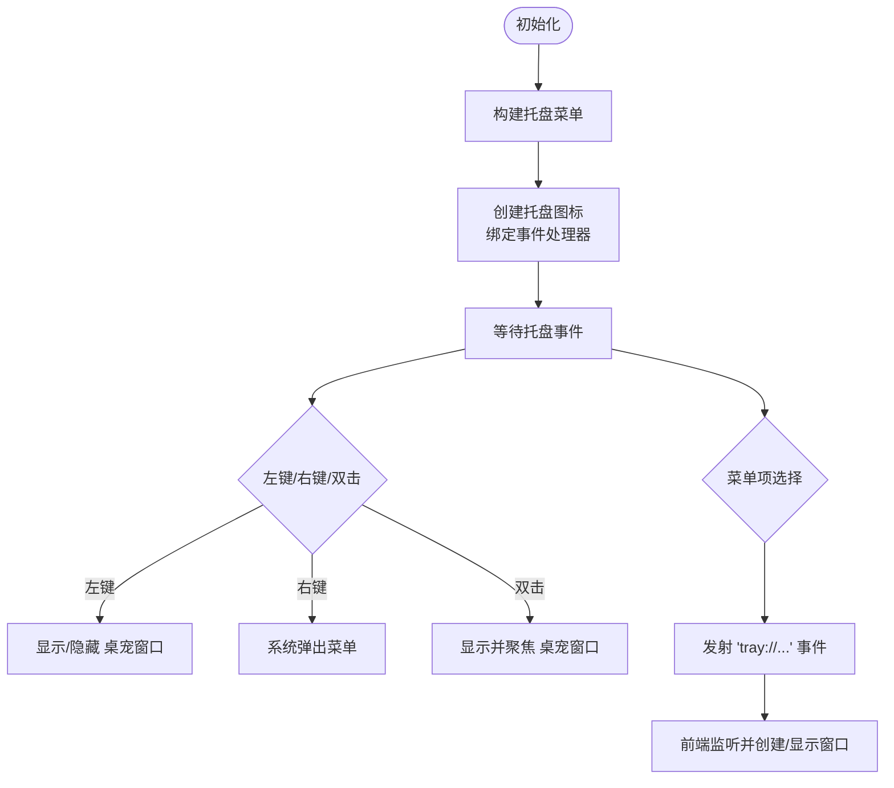
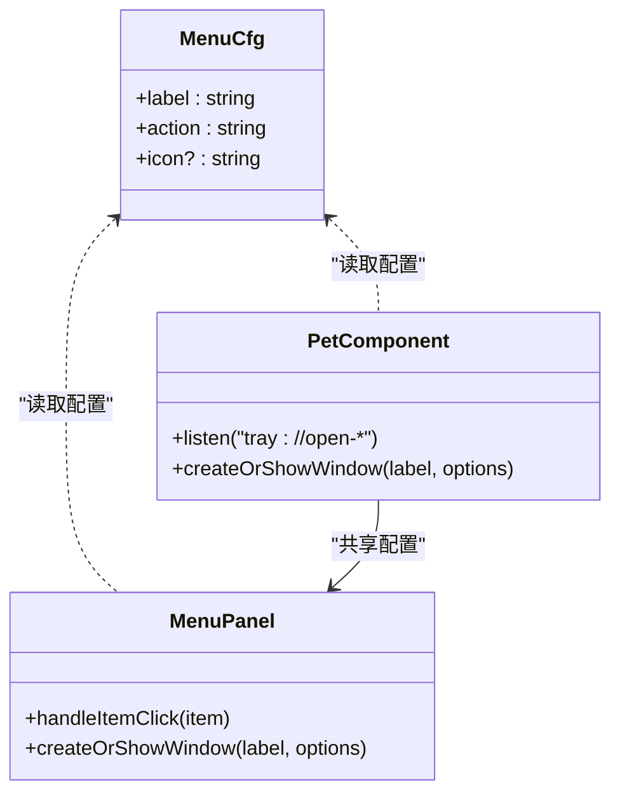
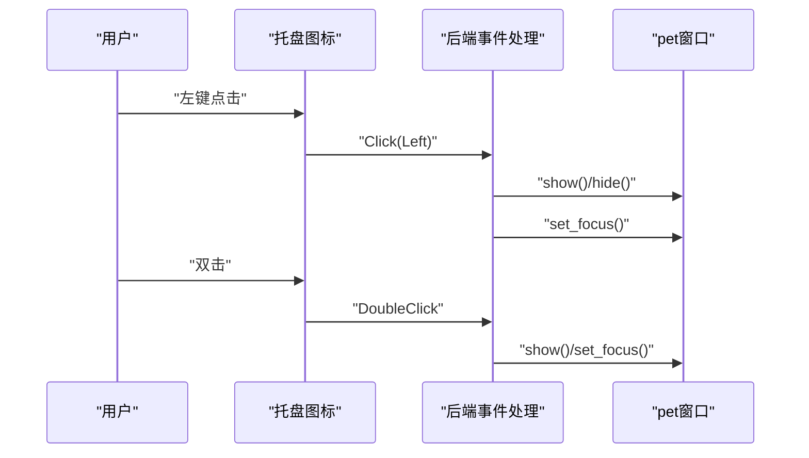
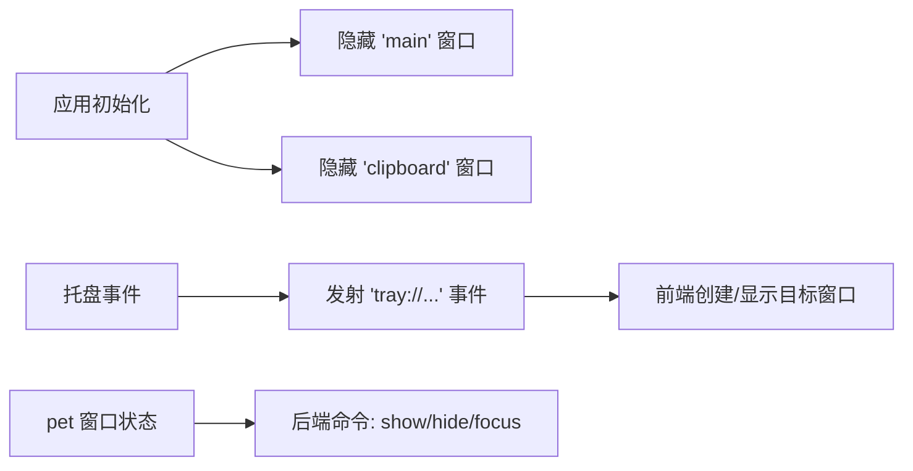
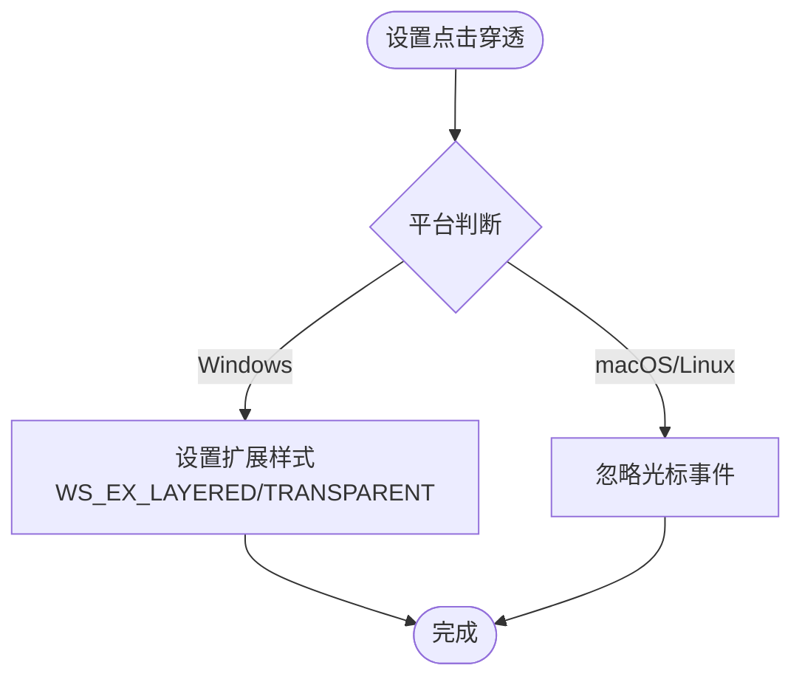
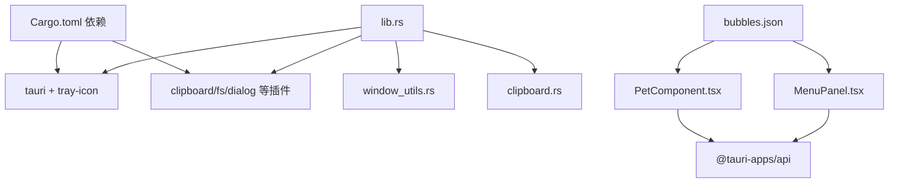

# 系统托盘集成

<cite>
**本文引用的文件**
- [src-tauri/src/lib.rs](file://src-tauri/src/lib.rs)
- [src-tauri/src/main.rs](file://src-tauri/src/main.rs)
- [src-tauri/Cargo.toml](file://src-tauri/Cargo.toml)
- [src-tauri/tauri.conf.json](file://src-tauri/tauri.conf.json)
- [src-tauri/src/window_utils.rs](file://src-tauri/src/window_utils.rs)
- [src-tauri/src/clipboard.rs](file://src-tauri/src/clipboard.rs)
- [src/App.tsx](file://src/App.tsx)
- [src/main.tsx](file://src/main.tsx)
- [src/components/PetComponent.tsx](file://src/components/PetComponent.tsx)
- [src/components/MenuPanel.tsx](file://src/components/MenuPanel.tsx)
- [public/config/bubbles.json](file://public/config/bubbles.json)
</cite>

## 目录
1. [简介](#简介)
2. [项目结构](#项目结构)
3. [核心组件](#核心组件)
4. [架构总览](#架构总览)
5. [详细组件分析](#详细组件分析)
6. [依赖关系分析](#依赖关系分析)
7. [性能考量](#性能考量)
8. [故障排查指南](#故障排查指南)
9. [结论](#结论)
10. [附录](#附录)

## 简介
本文件面向“系统托盘集成”功能，围绕托盘图标、菜单、事件处理、与主窗口的协调机制展开，结合跨平台差异与性能优化策略，提供可操作的配置说明、调试方法与最佳实践建议。读者无需深入底层即可理解托盘功能如何在桌面宠物应用中运行。

## 项目结构
托盘功能主要由后端 Rust（Tauri）负责创建托盘图标、构建菜单、处理事件；前端 React 负责监听事件并创建/显示对应的功能窗口。配置文件用于定义菜单项与行为映射。

**图表来源**
- [src-tauri/src/lib.rs:885-900](file://src-tauri/src/lib.rs#L885-L900)
- [src-tauri/src/window_utils.rs:9-32](file://src-tauri/src/window_utils.rs#L9-L32)
- [src-tauri/src/clipboard.rs:1-122](file://src-tauri/src/clipboard.rs#L1-L122)
- [src-tauri/tauri.conf.json:1-74](file://src-tauri/tauri.conf.json#L1-L74)
- [src-tauri/Cargo.toml:15-36](file://src-tauri/Cargo.toml#L15-L36)
- [src/App.tsx:17-55](file://src/App.tsx#L17-L55)
- [src/main.tsx:1-10](file://src/main.tsx#L1-L10)
- [src/components/PetComponent.tsx:156-196](file://src/components/PetComponent.tsx#L156-L196)
- [src/components/MenuPanel.tsx:14-34](file://src/components/MenuPanel.tsx#L14-L34)
- [public/config/bubbles.json:1-52](file://public/config/bubbles.json#L1-L52)

**章节来源**
- [src-tauri/src/lib.rs:885-900](file://src-tauri/src/lib.rs#L885-L900)
- [src-tauri/tauri.conf.json:13-51](file://src-tauri/tauri.conf.json#L13-L51)
- [src-tauri/Cargo.toml:15-36](file://src-tauri/Cargo.toml#L15-L36)
- [src/App.tsx:17-55](file://src/App.tsx#L17-L55)
- [src/main.tsx:1-10](file://src/main.tsx#L1-L10)
- [src/components/PetComponent.tsx:156-196](file://src/components/PetComponent.tsx#L156-L196)
- [src/components/MenuPanel.tsx:14-34](file://src/components/MenuPanel.tsx#L14-L34)
- [public/config/bubbles.json:1-52](file://public/config/bubbles.json#L1-L52)

## 核心组件
- 托盘图标与菜单
  - 后端在应用初始化阶段创建托盘图标与菜单，并注册托盘事件与菜单事件回调。
  - 菜单项包括“显示桌宠”“剪贴板”“系统信息”“AI对话”“有道翻译”“日历TODO”“退出”等。
- 托盘事件处理
  - 左键点击：显示/隐藏桌宠窗口。
  - 双击：强制显示并聚焦桌宠窗口。
  - 右键：由系统弹出菜单（本实现中右键事件日志输出，实际菜单由系统处理）。
- 前端事件桥接
  - 后端通过事件通道向前端发出“tray://...”事件，前端监听并创建/显示对应窗口。
- 点击穿透控制
  - 通过后端提供的命令切换桌宠窗口的点击穿透状态，配合前端休眠/活跃状态联动。
- 菜单配置
  - 菜单项与动作映射来自公共配置文件，前端菜单面板与桌宠气泡菜单均读取该配置。

**章节来源**
- [src-tauri/src/lib.rs:663-760](file://src-tauri/src/lib.rs#L663-L760)
- [src-tauri/src/lib.rs:885-900](file://src-tauri/src/lib.rs#L885-L900)
- [src/components/PetComponent.tsx:156-196](file://src/components/PetComponent.tsx#L156-L196)
- [src-tauri/src/window_utils.rs:9-32](file://src-tauri/src/window_utils.rs#L9-L32)
- [public/config/bubbles.json:1-52](file://public/config/bubbles.json#L1-L52)

## 架构总览
托盘功能采用“后端驱动、前端响应”的模式：后端负责托盘生命周期与事件分发，前端负责窗口创建与展示。

**图表来源**
- [src-tauri/src/lib.rs:885-900](file://src-tauri/src/lib.rs#L885-L900)
- [src-tauri/src/lib.rs:692-760](file://src-tauri/src/lib.rs#L692-L760)
- [src/components/PetComponent.tsx:156-196](file://src/components/PetComponent.tsx#L156-L196)
- [src-tauri/src/lib.rs:865-870](file://src-tauri/src/lib.rs#L865-L870)

## 详细组件分析

### 托盘图标与菜单构建
- 菜单项定义
  - “显示桌宠”“剪贴板”“系统信息”“AI对话”“有道翻译”“日历TODO”“退出”，并用分隔线组织。
- 菜单事件处理
  - 根据菜单项 ID 分派到相应动作：显示/隐藏桌宠、发射前端事件以创建窗口、退出应用。
- 托盘事件处理
  - 左键：切换桌宠可见性；右键：日志提示；双击：强制显示并聚焦。

**图表来源**
- [src-tauri/src/lib.rs:663-760](file://src-tauri/src/lib.rs#L663-L760)
- [src-tauri/src/lib.rs:885-900](file://src-tauri/src/lib.rs#L885-L900)

**章节来源**
- [src-tauri/src/lib.rs:663-760](file://src-tauri/src/lib.rs#L663-L760)
- [src-tauri/src/lib.rs:885-900](file://src-tauri/src/lib.rs#L885-L900)

### 托盘菜单项与事件绑定
- 菜单项与动作映射
  - 菜单项来源于公共配置文件，前端菜单面板与桌宠气泡菜单共享同一配置。
- 前端事件监听
  - 桌宠组件监听多个“tray://...”事件，分别对应不同功能窗口的创建与显示。
- 动态更新
  - 菜单项可通过修改配置文件进行增删改，无需改动后端代码。

**图表来源**
- [public/config/bubbles.json:1-52](file://public/config/bubbles.json#L1-L52)
- [src/components/PetComponent.tsx:156-196](file://src/components/PetComponent.tsx#L156-L196)
- [src/components/MenuPanel.tsx:90-259](file://src/components/MenuPanel.tsx#L90-L259)

**章节来源**
- [public/config/bubbles.json:1-52](file://public/config/bubbles.json#L1-L52)
- [src/components/PetComponent.tsx:156-196](file://src/components/PetComponent.tsx#L156-L196)
- [src/components/MenuPanel.tsx:90-259](file://src/components/MenuPanel.tsx#L90-L259)

### 托盘交互处理机制
- 左键点击
  - 切换“pet”窗口可见性；若隐藏则显示并聚焦。
- 右键菜单
  - 由系统处理，本实现记录日志。
- 双击
  - 强制显示并聚焦“pet”窗口。
- 菜单项
  - 通过事件通道触发前端创建/显示对应窗口。

**图表来源**
- [src-tauri/src/lib.rs:692-728](file://src-tauri/src/lib.rs#L692-L728)

**章节来源**
- [src-tauri/src/lib.rs:692-728](file://src-tauri/src/lib.rs#L692-L728)

### 与主窗口的协调机制
- 应用启动时隐藏部分窗口（如“main”“clipboard”），托盘作为唯一入口。
- 通过事件通道在托盘与前端之间传递状态与指令，避免直接耦合。
- 前端根据窗口标签统一管理窗口生命周期，避免重复创建。

**图表来源**
- [src-tauri/src/lib.rs:902-920](file://src-tauri/src/lib.rs#L902-L920)
- [src-tauri/src/lib.rs:885-900](file://src-tauri/src/lib.rs#L885-L900)

**章节来源**
- [src-tauri/src/lib.rs:902-920](file://src-tauri/src/lib.rs#L902-L920)
- [src-tauri/src/lib.rs:885-900](file://src-tauri/src/lib.rs#L885-L900)

### 跨平台实现差异与兼容性
- Windows
  - 使用系统 API 设置窗口扩展样式以实现点击穿透。
- macOS/Linux
  - 使用忽略光标事件的通用接口实现点击穿透。
- 能力声明
  - Cargo.toml 中启用托盘图标特性，确保编译期可用。

**图表来源**
- [src-tauri/src/window_utils.rs:9-32](file://src-tauri/src/window_utils.rs#L9-L32)
- [src-tauri/Cargo.toml:16-16](file://src-tauri/Cargo.toml#L16-L16)

**章节来源**
- [src-tauri/src/window_utils.rs:9-32](file://src-tauri/src/window_utils.rs#L9-L32)
- [src-tauri/Cargo.toml:16-16](file://src-tauri/Cargo.toml#L16-L16)

### 配置选项与行为
- 菜单定制
  - 通过公共配置文件调整菜单项顺序、标签与图标。
- 快捷键设置
  - 未在当前实现中提供全局快捷键；可通过系统托盘菜单或窗口内快捷键扩展。
- 行为配置
  - 窗口属性（透明、置顶、装饰等）在配置文件中集中管理。

**章节来源**
- [public/config/bubbles.json:1-52](file://public/config/bubbles.json#L1-L52)
- [src-tauri/tauri.conf.json:13-51](file://src-tauri/tauri.conf.json#L13-L51)

### 性能优化与资源管理
- 剪贴板监控
  - 定时轮询，带错误重试与暂停策略，避免频繁 IO 与崩溃。
- 窗口复用
  - 前端在创建前检查同标签窗口是否存在，避免重复创建。
- 状态同步
  - 通过事件通道与命令调用，减少直接状态共享带来的耦合与竞争。

**章节来源**
- [src-tauri/src/lib.rs:952-988](file://src-tauri/src/lib.rs#L952-L988)
- [src/components/PetComponent.tsx:224-280](file://src/components/PetComponent.tsx#L224-L280)
- [src-tauri/src/clipboard.rs:84-121](file://src-tauri/src/clipboard.rs#L84-L121)

## 依赖关系分析
- 后端依赖
  - Tauri 托盘图标、菜单、事件；系统信息采集；剪贴板插件；定时任务调度。
- 前端依赖
  - @tauri-apps/api 的窗口、事件、核心调用；React 组件按标签路由到具体功能。
- 配置依赖
  - 公共 JSON 配置文件驱动菜单项与窗口参数。

**图表来源**
- [src-tauri/Cargo.toml:15-36](file://src-tauri/Cargo.toml#L15-L36)
- [src-tauri/src/lib.rs:832-884](file://src-tauri/src/lib.rs#L832-L884)
- [src-tauri/src/window_utils.rs:1-33](file://src-tauri/src/window_utils.rs#L1-L33)
- [src-tauri/src/clipboard.rs:1-122](file://src-tauri/src/clipboard.rs#L1-L122)
- [src/components/PetComponent.tsx:1-10](file://src/components/PetComponent.tsx#L1-L10)
- [src/components/MenuPanel.tsx:1-6](file://src/components/MenuPanel.tsx#L1-L6)
- [public/config/bubbles.json:1-52](file://public/config/bubbles.json#L1-L52)

**章节来源**
- [src-tauri/Cargo.toml:15-36](file://src-tauri/Cargo.toml#L15-L36)
- [src-tauri/src/lib.rs:832-884](file://src-tauri/src/lib.rs#L832-L884)
- [src-tauri/src/window_utils.rs:1-33](file://src-tauri/src/window_utils.rs#L1-L33)
- [src-tauri/src/clipboard.rs:1-122](file://src-tauri/src/clipboard.rs#L1-L122)
- [src/components/PetComponent.tsx:1-10](file://src/components/PetComponent.tsx#L1-L10)
- [src/components/MenuPanel.tsx:1-6](file://src/components/MenuPanel.tsx#L1-L6)
- [public/config/bubbles.json:1-52](file://public/config/bubbles.json#L1-L52)

## 性能考量
- 轮询频率与节流
  - 剪贴板监控间隔为 5 秒，连续错误超过阈值时暂停 60 秒，降低系统负载。
- 窗口生命周期
  - 复用现有窗口，避免频繁创建销毁带来的资源消耗。
- 事件驱动
  - 使用事件通道与命令调用，减少阻塞与同步开销。

**章节来源**
- [src-tauri/src/lib.rs:952-988](file://src-tauri/src/lib.rs#L952-L988)

## 故障排查指南
- 托盘图标不显示
  - 检查托盘图标构建与菜单绑定是否在初始化阶段执行。
  - 确认窗口配置中“pet”“pomodoro-notification”等标签存在且属性合理。
- 左键点击无反应
  - 检查“pet”窗口是否存在以及可见性状态；确认事件回调已注册。
- 右键菜单不出现
  - 右键通常由系统处理，若自定义菜单未生效，检查菜单构建与绑定。
- 剪贴板监控异常
  - 查看错误计数与暂停逻辑；确认剪贴板插件已启用。
- 点击穿透无效
  - Windows 平台检查扩展样式设置；非 Windows 平台检查忽略事件接口调用。

**章节来源**
- [src-tauri/src/lib.rs:885-900](file://src-tauri/src/lib.rs#L885-L900)
- [src-tauri/src/lib.rs:952-988](file://src-tauri/src/lib.rs#L952-L988)
- [src-tauri/src/window_utils.rs:9-32](file://src-tauri/src/window_utils.rs#L9-L32)
- [src-tauri/tauri.conf.json:13-51](file://src-tauri/tauri.conf.json#L13-L51)

## 结论
托盘功能通过清晰的前后端分工与事件驱动机制，实现了稳定的图标显示、菜单管理与窗口协调。跨平台差异通过平台分支处理，性能方面通过轮询节流与窗口复用得到保障。建议后续扩展全局快捷键与托盘状态动画，进一步提升用户体验。

## 附录
- 最佳实践
  - 使用统一配置文件管理菜单项，便于维护与扩展。
  - 严格区分“托盘事件”与“菜单事件”，避免逻辑混淆。
  - 对窗口创建增加超时与错误回退，提升健壮性。
- 用户体验优化建议
  - 提供托盘状态提示（如闪烁/颜色变化）。
  - 支持右键直接打开常用功能窗口。
  - 增加“最小化到托盘”快捷方式与系统设置入口。