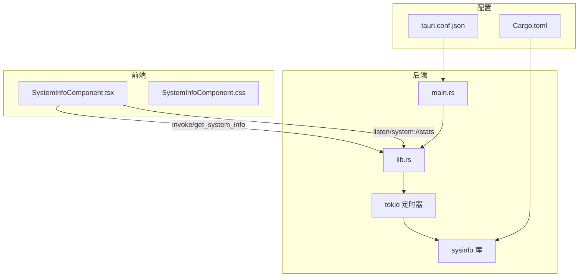
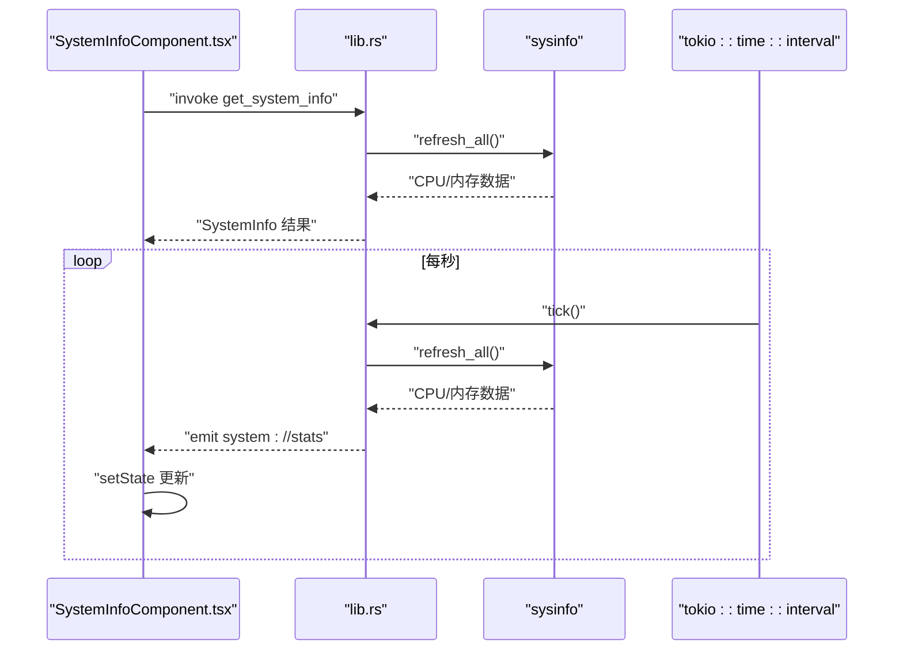
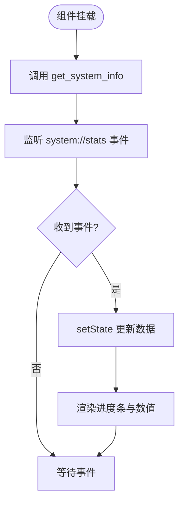
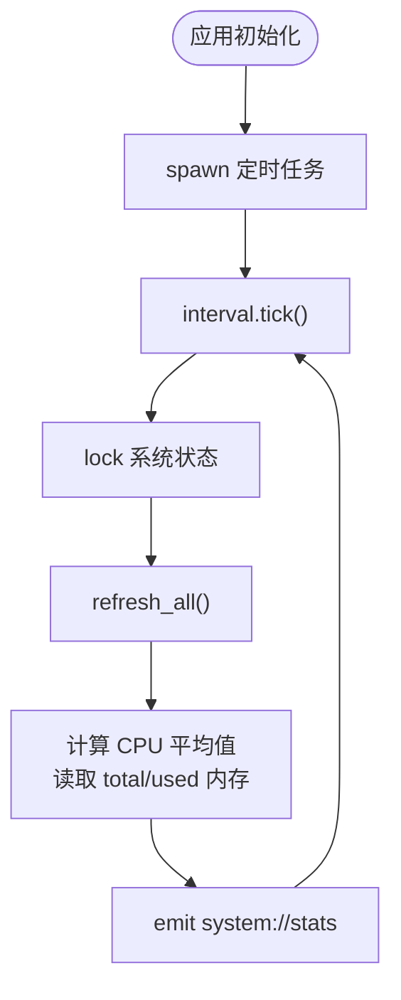
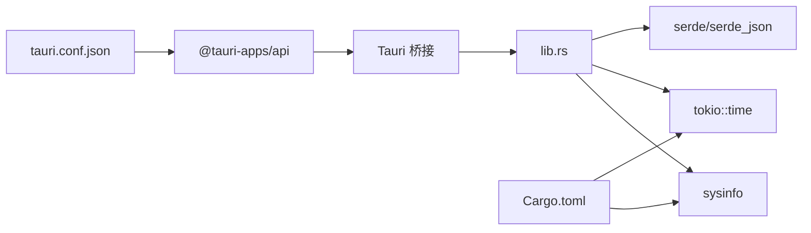

# 系统监控功能

<cite>
**本文引用的文件**
- [SystemInfoComponent.tsx](file://src/components/SystemInfoComponent.tsx)
- [SystemInfoComponent.css](file://src/components/SystemInfoComponent.css)
- [lib.rs](file://src-tauri/src/lib.rs)
- [main.rs](file://src-tauri/src/main.rs)
- [Cargo.toml](file://src-tauri/Cargo.toml)
- [tauri.conf.json](file://src-tauri/tauri.conf.json)
- [task_scheduler.rs](file://src-tauri/src/task_scheduler.rs)
</cite>

## 目录
1. [简介](#简介)
2. [项目结构](#项目结构)
3. [核心组件](#核心组件)
4. [架构总览](#架构总览)
5. [详细组件分析](#详细组件分析)
6. [依赖关系分析](#依赖关系分析)
7. [性能考量](#性能考量)
8. [故障排查指南](#故障排查指南)
9. [结论](#结论)
10. [附录](#附录)

## 简介
本文件系统性阐述桌面宠物应用中的“系统监控”功能，涵盖CPU与内存使用率的采集、实时更新机制、数据计算与可视化展示，并对性能影响、兼容性、精度与延迟、资源消耗以及可配置项进行深入分析。该功能基于Tauri + React技术栈，通过Rust侧系统信息采集与前端事件驱动刷新实现。

## 项目结构
系统监控功能主要分布在以下位置：
- 前端组件：React组件负责UI渲染与事件监听
- 后端桥接：Tauri命令与系统信息采集逻辑
- 配置与打包：Tauri配置与依赖声明

**图示来源**
- [SystemInfoComponent.tsx:1-149](file://src/components/SystemInfoComponent.tsx#L1-L149)
- [lib.rs:38-69](file://src-tauri/src/lib.rs#L38-L69)
- [lib.rs:924-946](file://src-tauri/src/lib.rs#L924-L946)
- [main.rs:8-10](file://src-tauri/src/main.rs#L8-L10)
- [tauri.conf.json:1-74](file://src-tauri/tauri.conf.json#L1-L74)
- [Cargo.toml:15-36](file://src-tauri/Cargo.toml#L15-L36)

**章节来源**
- [SystemInfoComponent.tsx:1-149](file://src/components/SystemInfoComponent.tsx#L1-L149)
- [lib.rs:38-69](file://src-tauri/src/lib.rs#L38-L69)
- [lib.rs:924-946](file://src-tauri/src/lib.rs#L924-L946)
- [main.rs:8-10](file://src-tauri/src/main.rs#L8-L10)
- [tauri.conf.json:1-74](file://src-tauri/tauri.conf.json#L1-L74)
- [Cargo.toml:15-36](file://src-tauri/Cargo.toml#L15-L36)

## 核心组件
- 前端组件：负责首次拉取系统信息、订阅实时事件、格式化数值与渲染进度条。
- 后端命令：提供一次性查询接口与系统状态定时推送。
- 系统信息采集：使用sysinfo库刷新系统状态并计算CPU与内存指标。
- 实时推送：基于Tokio定时器周期性发射事件，前端监听并更新UI。

关键职责与交互：
- 前端在挂载时调用后端命令获取初始数据；随后监听后端推送的实时事件以更新界面。
- 后端在应用初始化时启动定时任务，每秒采集一次系统信息并通过事件通道推送到前端。

**章节来源**
- [SystemInfoComponent.tsx:16-26](file://src/components/SystemInfoComponent.tsx#L16-L26)
- [lib.rs:38-69](file://src-tauri/src/lib.rs#L38-L69)
- [lib.rs:924-946](file://src-tauri/src/lib.rs#L924-L946)

## 架构总览
系统监控采用“前端事件驱动 + 后端定时采集”的架构模式，确保低耦合与高可维护性。

**图示来源**
- [SystemInfoComponent.tsx:16-26](file://src/components/SystemInfoComponent.tsx#L16-L26)
- [lib.rs:38-69](file://src-tauri/src/lib.rs#L38-L69)
- [lib.rs:924-946](file://src-tauri/src/lib.rs#L924-L946)

## 详细组件分析

### 前端组件：SystemInfoComponent
- 数据模型：包含CPU使用率、总内存、已用内存三项指标。
- 生命周期：组件挂载时发起一次性调用获取初始数据；同时订阅system://stats事件以接收实时更新。
- 渲染策略：使用CSS进度条与渐变色表达占用率；内存使用率超过阈值时改变进度条颜色以示警告。
- 交互：提供关闭按钮，调用Tauri窗口API关闭当前窗口。

**图示来源**
- [SystemInfoComponent.tsx:16-26](file://src/components/SystemInfoComponent.tsx#L16-L26)
- [SystemInfoComponent.tsx:59-128](file://src/components/SystemInfoComponent.tsx#L59-L128)
- [SystemInfoComponent.css:128-134](file://src/components/SystemInfoComponent.css#L128-L134)

**章节来源**
- [SystemInfoComponent.tsx:1-149](file://src/components/SystemInfoComponent.tsx#L1-L149)
- [SystemInfoComponent.css:1-239](file://src/components/SystemInfoComponent.css#L1-L239)

### 后端命令与系统信息采集
- 命令定义：提供get_system_info命令用于一次性查询；collect_system_info函数封装采集逻辑。
- 采集算法：
  - CPU使用率：遍历所有CPU核心，累加各核心使用率后除以核心数，得到平均值。
  - 内存：直接读取总内存与已用内存。
- 事件推送：应用初始化时启动后台任务，每秒采集一次并通过事件通道向前端推送。

**图示来源**
- [lib.rs:38-69](file://src-tauri/src/lib.rs#L38-L69)
- [lib.rs:924-946](file://src-tauri/src/lib.rs#L924-L946)

**章节来源**
- [lib.rs:38-69](file://src-tauri/src/lib.rs#L38-L69)
- [lib.rs:924-946](file://src-tauri/src/lib.rs#L924-L946)

### 实时数据更新机制
- 定时器管理：使用Tokio的interval，周期为1秒，保证高频但可控的更新频率。
- 数据缓存策略：后端仅在每次tick时重新计算并推送，前端在每次事件到达时更新状态，避免重复计算。
- UI刷新优化：React组件通过useState与事件驱动更新，避免不必要的重渲染；进度条宽度通过内联样式动态设置，渲染开销较低。

**章节来源**
- [lib.rs:924-946](file://src-tauri/src/lib.rs#L924-L946)
- [SystemInfoComponent.tsx:16-26](file://src/components/SystemInfoComponent.tsx#L16-L26)

### 可视化展示与阈值告警
- 图表绘制：使用纯CSS进度条容器与宽度变化模拟柱状图效果。
- 颜色编码：
  - CPU与内存进度条分别使用渐变色。
  - 内存使用率超过阈值（示例为80%）时，进度条颜色切换为警示色。
- 数值格式化：内存数值按GB显示，保留一位小数；CPU使用率保留一位小数。

**章节来源**
- [SystemInfoComponent.tsx:59-128](file://src/components/SystemInfoComponent.tsx#L59-L128)
- [SystemInfoComponent.css:128-134](file://src/components/SystemInfoComponent.css#L128-L134)

## 依赖关系分析
- Rust侧依赖：
  - sysinfo：系统信息采集（CPU、内存等）。
  - tokio：异步运行时与定时器。
  - serde/serde_json：结构体序列化与事件载荷传输。
- 前端依赖：
  - @tauri-apps/api：Tauri桥接能力（invoke、listen、window）。
- 打包与平台：
  - Tauri配置支持多平台打包目标（如MSI、NSIS、DMG）。
  - Windows特定依赖在Cargo.toml中声明。

**图示来源**
- [Cargo.toml:15-36](file://src-tauri/Cargo.toml#L15-L36)
- [tauri.conf.json:1-74](file://src-tauri/tauri.conf.json#L1-L74)
- [lib.rs:38-69](file://src-tauri/src/lib.rs#L38-L69)

**章节来源**
- [Cargo.toml:15-36](file://src-tauri/Cargo.toml#L15-L36)
- [tauri.conf.json:1-74](file://src-tauri/tauri.conf.json#L1-L74)
- [lib.rs:38-69](file://src-tauri/src/lib.rs#L38-L69)

## 性能考量
- 采样频率控制：默认每秒采集一次，兼顾实时性与系统开销。若需降低开销，可在后端调整interval周期。
- 计算复杂度：CPU平均值为O(n_cpu)，内存读取为O(1)，整体复杂度低。
- I/O与线程：使用Tokio异步运行时，避免阻塞主线程；sysinfo内部对系统调用进行封装，减少重复查询。
- 前端渲染：进度条宽度通过样式属性更新，避免大对象重绘；建议在更高负载场景下考虑节流或合并更新。

[本节为通用性能指导，不直接分析具体文件]

## 故障排查指南
- 事件未到达：确认前端已正确监听system://stats事件；检查后端定时任务是否正常运行。
- 初始数据为空：检查get_system_info命令是否返回有效数据；确认后端已正确初始化系统状态。
- 进度条不更新：检查事件监听回调是否被调用；确认React状态更新逻辑。
- 错误日志：后端在锁失败或事件发射失败时会打印错误信息，便于定位问题。

**章节来源**
- [lib.rs:931-944](file://src-tauri/src/lib.rs#L931-L944)
- [SystemInfoComponent.tsx:16-26](file://src/components/SystemInfoComponent.tsx#L16-L26)

## 结论
系统监控功能通过前后端清晰分离的设计，实现了低开销、高实时性的系统指标展示。Rust侧使用sysinfo与Tokio定时器保障数据准确性与时序稳定性，前端通过事件驱动与CSS进度条实现直观的可视化呈现。整体架构具备良好的扩展性，可进一步引入更多指标与更精细的配置项。

[本节为总结性内容，不直接分析具体文件]

## 附录

### 技术指标与参数
- 采样频率：默认1秒一次（可在后端调整）。
- CPU计算：各核心使用率求和后平均，单位百分比。
- 内存计算：总内存与已用内存，单位字节，前端转换为GB显示。
- 阈值告警：内存使用率超过阈值时改变进度条颜色（示例阈值为80%）。

**章节来源**
- [lib.rs:58-69](file://src-tauri/src/lib.rs#L58-L69)
- [SystemInfoComponent.tsx:32-35](file://src/components/SystemInfoComponent.tsx#L32-L35)
- [SystemInfoComponent.tsx:102-105](file://src/components/SystemInfoComponent.tsx#L102-L105)

### 配置选项与自定义参数
- 采样周期：修改后端定时器间隔即可调整（当前为1秒）。
- 颜色与阈值：可在前端CSS与逻辑中调整进度条颜色与告警阈值。
- 事件通道：system://stats为固定事件名，前端监听同名事件。
- 窗口行为：通过Tauri配置控制窗口透明、装饰、置顶等属性。

**章节来源**
- [lib.rs:924-946](file://src-tauri/src/lib.rs#L924-L946)
- [SystemInfoComponent.css:128-134](file://src/components/SystemInfoComponent.css#L128-L134)
- [tauri.conf.json:13-43](file://src-tauri/tauri.conf.json#L13-L43)

### 系统兼容性
- 平台支持：Tauri支持Windows、macOS、Linux，系统信息采集依赖sysinfo库，跨平台表现一致。
- 平台特定依赖：Windows平台在Cargo.toml中声明了相关依赖，确保编译通过。
- 打包目标：配置文件声明了多种打包目标，便于在不同平台部署。

**章节来源**
- [Cargo.toml:37-42](file://src-tauri/Cargo.toml#L37-L42)
- [tauri.conf.json:58-67](file://src-tauri/tauri.conf.json#L58-L67)