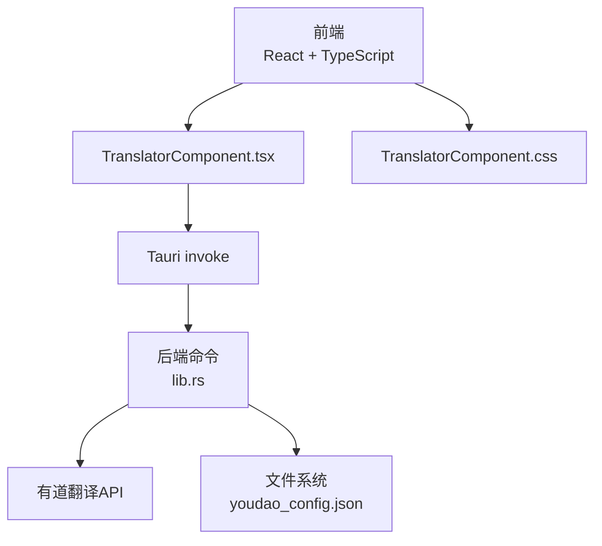
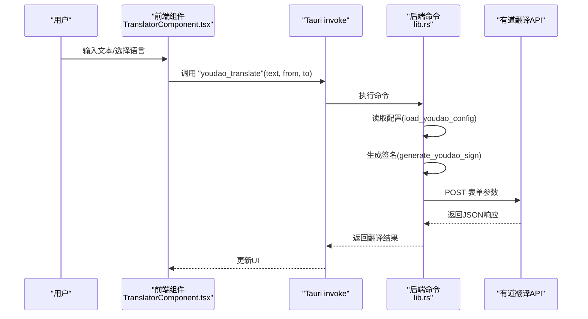
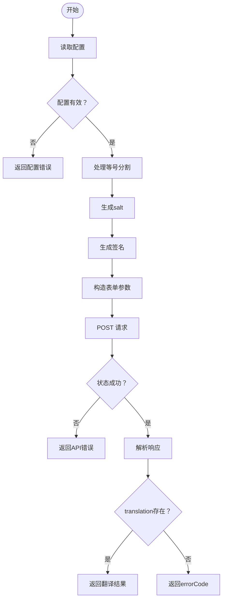
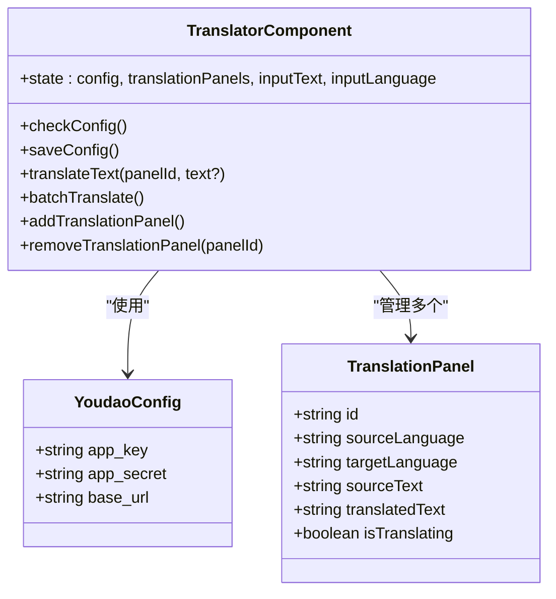
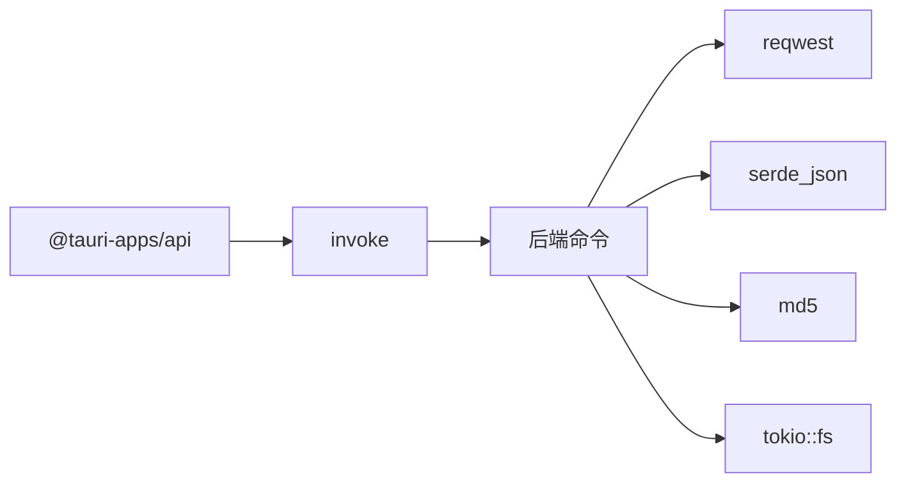

# 翻译系统

<cite>
**本文引用的文件**
- [TranslatorComponent.tsx](file://src/components/TranslatorComponent.tsx)
- [TranslatorComponent.css](file://src/components/TranslatorComponent.css)
- [lib.rs](file://src-tauri/src/lib.rs)
- [App.tsx](file://src/App.tsx)
- [README.md](file://README.md)
- [package.json](file://package.json)
</cite>

## 目录
1. [简介](#简介)
2. [项目结构](#项目结构)
3. [核心组件](#核心组件)
4. [架构总览](#架构总览)
5. [详细组件分析](#详细组件分析)
6. [依赖关系分析](#依赖关系分析)
7. [性能考量](#性能考量)
8. [故障排查指南](#故障排查指南)
9. [结论](#结论)
10. [附录](#附录)

## 简介
本文件为“翻译系统”的完整技术文档，聚焦于有道翻译API的集成实现与扩展能力。系统采用前端React + TypeScript + Tauri 2（Rust）的混合架构，前端负责UI与交互，后端通过Tauri命令桥接调用Rust实现网络请求与配置管理。本文围绕以下主题展开：
- 有道翻译API集成：密钥配置、请求参数构造、响应处理
- 多语言翻译：语言代码映射、翻译方向控制、批量翻译
- 结果展示与编辑：原文显示、译文呈现、格式保持
- 配置管理：API密钥存储、默认语言设置、翻译质量参数
- 国际化处理：特殊字符、换行符、格式保留
- 翻译历史记录：最近翻译查询与搜索过滤（现状与扩展建议）
- 性能优化：请求去重、缓存策略、并发控制
- 准确性、API限制与成本控制
- 常见问题与最佳实践

## 项目结构
翻译系统位于前端组件与后端命令之间，通过Tauri的invoke机制进行通信。核心文件如下：
- 前端组件：TranslatorComponent.tsx（UI与交互）、TranslatorComponent.css（样式）
- 后端命令：lib.rs（有道翻译命令、配置读写、签名生成）
- 应用入口：App.tsx（窗口路由与组件挂载）
- 项目说明：README.md（功能概览、持久化位置）
- 依赖声明：package.json（Tauri相关依赖）

图表来源
- [App.tsx:36-37](file://src/App.tsx#L36-L37)
- [TranslatorComponent.tsx:78-105](file://src/components/TranslatorComponent.tsx#L78-L105)
- [lib.rs:312-346](file://src-tauri/src/lib.rs#L312-L346)

章节来源
- [README.md:85-95](file://README.md#L85-L95)
- [package.json:12-18](file://package.json#L12-L18)

## 核心组件
- 翻译组件（TranslatorComponent.tsx）
  - 负责UI渲染、语言选择、文本输入、面板管理、批量翻译、错误提示与设置弹窗。
  - 通过invoke调用后端命令完成配置读取/保存与翻译请求。
- 后端命令（lib.rs）
  - 提供有道翻译命令、配置读写命令、签名生成函数与配置路径管理。
  - 负责HTTP请求构造、参数签名、响应解析与错误处理。
- 应用入口（App.tsx）
  - 根据窗口label渲染对应组件，其中包含“translator”标签用于打开翻译窗口。

章节来源
- [TranslatorComponent.tsx:48-76](file://src/components/TranslatorComponent.tsx#L48-L76)
- [lib.rs:363-436](file://src-tauri/src/lib.rs#L363-L436)
- [App.tsx:36-37](file://src/App.tsx#L36-L37)

## 架构总览
前端与后端通过Tauri命令通道通信，前端发起翻译请求与配置管理，后端执行网络调用与本地持久化。

图表来源
- [TranslatorComponent.tsx:147-170](file://src/components/TranslatorComponent.tsx#L147-L170)
- [lib.rs:363-436](file://src-tauri/src/lib.rs#L363-L436)

## 详细组件分析

### 1) 有道翻译API集成
- 配置读取与保存
  - 前端通过invoke调用后端命令load_youdao_config与save_youdao_config。
  - 后端将配置写入用户应用数据目录下的youdao_config.json，并确保目录存在。
- 请求参数构造
  - 必填参数：q（待翻译文本）、from（源语言）、to（目标语言）、appKey（应用ID）、salt（随机数）、sign（签名）。
  - 签名算法：对appKey+q+salt+appSecret拼接后做MD5。
  - 请求方式：POST表单。
- 响应数据处理
  - 成功：解析translation数组首元素作为结果；若为空则报错。
  - 失败：解析errorCode字段或返回通用错误。
  - 特殊处理：当输入包含“=”时，保留等号前缀，仅对等号后半部分进行翻译。

图表来源
- [lib.rs:363-436](file://src-tauri/src/lib.rs#L363-L436)
- [lib.rs:304-309](file://src-tauri/src/lib.rs#L304-L309)

章节来源
- [lib.rs:312-346](file://src-tauri/src/lib.rs#L312-L346)
- [lib.rs:348-360](file://src-tauri/src/lib.rs#L348-L360)
- [lib.rs:363-436](file://src-tauri/src/lib.rs#L363-L436)

### 2) 多语言翻译功能
- 语言代码映射
  - 前端维护SUPPORTED_LANGUAGES列表，包含自动检测与多种语言代码及名称。
- 翻译方向控制
  - 输入语言由全局inputLanguage控制（支持自动检测）。
  - 每个翻译面板拥有独立targetLanguage，支持多面板并行翻译。
- 批量翻译处理
  - 将同一输入文本批量发送至所有面板，逐个更新结果。

图表来源
- [TranslatorComponent.tsx:6-24](file://src/components/TranslatorComponent.tsx#L6-L24)
- [TranslatorComponent.tsx:48-76](file://src/components/TranslatorComponent.tsx#L48-L76)
- [TranslatorComponent.tsx:121-178](file://src/components/TranslatorComponent.tsx#L121-L178)

章节来源
- [TranslatorComponent.tsx:26-46](file://src/components/TranslatorComponent.tsx#L26-L46)
- [TranslatorComponent.tsx:71-72](file://src/components/TranslatorComponent.tsx#L71-L72)
- [TranslatorComponent.tsx:121-178](file://src/components/TranslatorComponent.tsx#L121-L178)

### 3) 翻译结果的展示与编辑
- 原文显示：输入区textarea绑定inputText，支持多行文本。
- 译文呈现：每个面板的translatedText在UI中以pre-wrap与word-wrap方式呈现，保留换行与空白。
- 编辑功能：当前未提供直接编辑译文的交互控件，可在UI层扩展textarea或富文本编辑器。

章节来源
- [TranslatorComponent.tsx:290-335](file://src/components/TranslatorComponent.tsx#L290-L335)
- [TranslatorComponent.css:324-335](file://src/components/TranslatorComponent.css#L324-L335)

### 4) 翻译配置管理
- API密钥存储
  - 配置文件：youdao_config.json，存储位置为用户应用数据目录。
  - 命令：save_youdao_config与load_youdao_config。
- 默认语言设置
  - 输入语言默认auto（自动检测），目标语言默认英语。
- 翻译质量参数
  - 当前未暴露额外参数（如效果模式、词典开关等），可在请求参数扩展。

章节来源
- [README.md:212](file://README.md#L212)
- [lib.rs:312-346](file://src-tauri/src/lib.rs#L312-L346)
- [lib.rs:348-360](file://src-tauri/src/lib.rs#L348-L360)
- [TranslatorComponent.tsx:49-72](file://src/components/TranslatorComponent.tsx#L49-L72)

### 5) 国际化处理逻辑
- 特殊字符处理：通过表单编码与JSON解析处理，避免特殊字符导致的请求异常。
- 换行符转换：译文采用white-space: pre-wrap，保留换行与空白。
- 格式保留：译文容器使用word-wrap与min-height，确保长句与多行文本可读。

章节来源
- [lib.rs:378-388](file://src-tauri/src/lib.rs#L378-L388)
- [TranslatorComponent.css:324-335](file://src/components/TranslatorComponent.css#L324-L335)

### 6) 翻译历史记录
- 现状：未实现历史记录功能。
- 扩展建议：
  - 后端新增历史存储：在应用数据目录维护历史文件（如history.json），记录时间戳、原文、译文、语言对。
  - 前端新增历史面板：支持最近翻译查询与关键词搜索过滤。
  - 建议的数据模型（示意）：
    - 历史项：{ id, text, translated, from, to, timestamp }
    - 查询接口：按时间范围、语言对、关键词检索。

（本节为概念性扩展说明，不直接分析具体文件）

### 7) 性能优化
- 请求去重：对相同原文+语言对的请求进行缓存，避免重复网络请求。
- 缓存策略：短期缓存（如10秒内相同请求直接命中），过期后重新请求。
- 并发控制：批量翻译时串行或限制并发数（例如每秒最多N个请求），防止触发API限流。
- 前端优化：使用防抖/节流减少频繁输入带来的请求风暴。

（本节为通用性能建议，不直接分析具体文件）

### 8) 准确性、API限制与成本控制
- 准确性：合理选择源语言（非auto时可提升准确性）；对技术术语建议二次校对。
- API限制：关注有道翻译的QPS与配额限制，必要时增加重试与退避策略。
- 成本控制：统计请求次数与字符数，结合缓存降低调用频率；在UI中提示剩余配额或费用估算。

（本节为通用指导，不直接分析具体文件）

### 9) 常见问题与最佳实践
- 配置错误
  - 现象：提示“请配置有道翻译API密钥”或“API密钥配置无效”。
  - 处理：检查youdao_config.json内容与网络连通性。
- 签名错误
  - 现象：API返回签名相关错误。
  - 处理：确认appKey/appSecret正确，字符串拼接与MD5计算无误。
- 翻译失败
  - 现象：返回errorCode或未知错误。
  - 处理：检查输入长度、语言对是否受支持、网络状态。
- 性能问题
  - 现象：频繁输入导致请求过多。
  - 处理：启用去重与缓存，限制并发，增加防抖。

章节来源
- [lib.rs:370-376](file://src-tauri/src/lib.rs#L370-L376)
- [lib.rs:414-418](file://src-tauri/src/lib.rs#L414-L418)
- [lib.rs:425-435](file://src-tauri/src/lib.rs#L425-L435)

## 依赖关系分析
- 前端依赖
  - @tauri-apps/api：提供invoke与窗口管理能力。
  - react/react-dom：前端框架。
- 后端依赖
  - reqwest：HTTP客户端。
  - serde/serde_json：序列化与反序列化。
  - md5：签名生成。
  - tokio/fs：异步文件读写。

图表来源
- [package.json:12-18](file://package.json#L12-L18)
- [lib.rs:1-11](file://src-tauri/src/lib.rs#L1-L11)

章节来源
- [package.json:12-18](file://package.json#L12-L18)
- [lib.rs:398-412](file://src-tauri/src/lib.rs#L398-L412)

## 性能考量
- 去重与缓存：对相同输入+语言对的结果进行缓存，减少重复请求。
- 并发控制：批量翻译时限制并发，避免触发API限流。
- 前端防抖：对输入事件增加防抖，降低高频输入带来的请求压力。
- 错误重试：对网络异常与超时增加有限重试与退避策略。

（本节为通用性能建议，不直接分析具体文件）

## 故障排查指南
- 配置问题
  - 检查youdao_config.json是否存在且格式正确。
  - 确认appKey与appSecret未被篡改。
- 网络问题
  - 检查代理与防火墙设置，确保可访问有道翻译API域名。
- 响应异常
  - 查看后端返回的错误码与错误信息，定位具体原因。
- UI无响应
  - 检查前端invoke调用是否正常，以及isTranslating状态是否被正确更新。

章节来源
- [lib.rs:338-345](file://src-tauri/src/lib.rs#L338-L345)
- [lib.rs:414-418](file://src-tauri/src/lib.rs#L414-L418)
- [TranslatorComponent.tsx:154-169](file://src/components/TranslatorComponent.tsx#L154-L169)

## 结论
翻译系统以简洁清晰的方式实现了有道翻译API的集成，具备多语言支持、批量翻译与本地配置持久化能力。后续可在历史记录、缓存与并发控制方面进一步增强，以提升用户体验与稳定性。建议在UI层增加译文编辑与历史检索功能，并在后端引入请求去重与限流策略，确保在高并发场景下仍能稳定运行。

## 附录
- 窗口路由
  - “translator”标签用于打开翻译窗口，由App.tsx根据窗口label进行渲染。
- 项目说明
  - README对翻译功能、持久化位置与窗口管理进行了说明。

章节来源
- [App.tsx:36-37](file://src/App.tsx#L36-L37)
- [README.md:85-95](file://README.md#L85-L95)
- [README.md:212](file://README.md#L212)