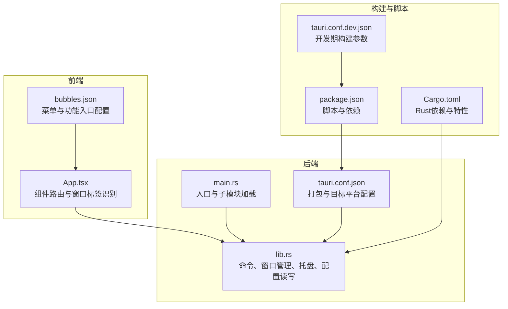
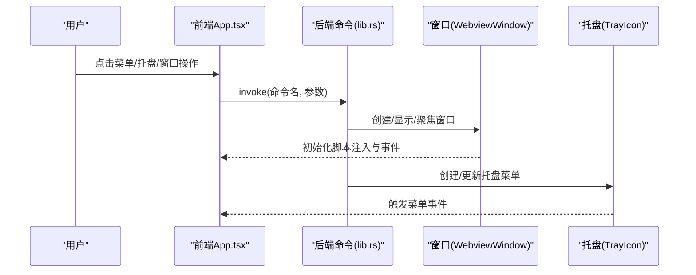
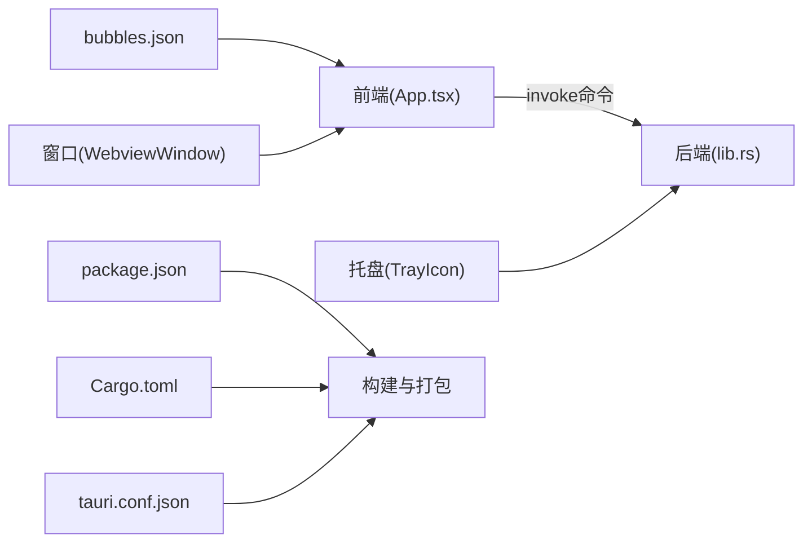

# 分发策略

<cite>
**本文引用的文件**
- [package.json](file://package.json)
- [Cargo.toml](file://src-tauri/Cargo.toml)
- [tauri.conf.json](file://src-tauri/tauri.conf.json)
- [tauri.conf.dev.json](file://src-tauri/tauri.conf.dev.json)
- [main.rs](file://src-tauri/src/main.rs)
- [lib.rs](file://src-tauri/src/lib.rs)
- [App.tsx](file://src/App.tsx)
- [bubbles.json](file://public/config/bubbles.json)
- [deepseek.json](file://src-tauri/config/deepseek.json)
- [README.md](file://README.md)
</cite>

## 目录
1. [引言](#引言)
2. [项目结构](#项目结构)
3. [核心组件](#核心组件)
4. [架构总览](#架构总览)
5. [详细组件分析](#详细组件分析)
6. [依赖关系分析](#依赖关系分析)
7. [性能考量](#性能考量)
8. [故障排查指南](#故障排查指南)
9. [结论](#结论)
10. [附录](#附录)

## 引言
本文件面向XSUN桌面宠物项目的分发与发布团队，提供一套完整的分发策略文档。内容覆盖分发渠道选择（官方网站、应用商店、第三方平台）、数字签名与证书管理、版本与更新机制设计（自动与手动）、发布流程自动化（CI/CD与持续交付）、用户体验优化（安装与卸载）、以及法律合规与安全注意事项。本文所有技术要点均基于仓库现有配置与实现进行分析与建议。

## 项目结构
XSUN桌面宠物采用Tauri 2 + React + TypeScript的混合架构，前端通过Vite构建，后端由Rust实现并通过Tauri桥接到前端。打包与分发配置集中在Tauri配置文件中，支持Windows MSI/NSIS与macOS DMG产物。

**图表来源**
- [App.tsx:18-58](file://src/App.tsx#L18-L58)
- [bubbles.json:1-52](file://public/config/bubbles.json#L1-L52)
- [main.rs:8-10](file://src-tauri/src/main.rs#L8-L10)
- [lib.rs:771-797](file://src-tauri/src/lib.rs#L771-L797)
- [tauri.conf.json:53-68](file://src-tauri/tauri.conf.json#L53-L68)
- [package.json:6-11](file://package.json#L6-L11)
- [Cargo.toml:15-31](file://src-tauri/Cargo.toml#L15-L31)
- [tauri.conf.dev.json:2-7](file://src-tauri/tauri.conf.dev.json#L2-L7)

**章节来源**
- [package.json:1-29](file://package.json#L1-L29)
- [Cargo.toml:1-44](file://src-tauri/Cargo.toml#L1-L44)
- [tauri.conf.json:1-74](file://src-tauri/tauri.conf.json#L1-L74)
- [tauri.conf.dev.json:1-8](file://src-tauri/tauri.conf.dev.json#L1-L8)
- [main.rs:1-11](file://src-tauri/src/main.rs#L1-L11)
- [lib.rs:771-797](file://src-tauri/src/lib.rs#L771-L797)
- [App.tsx:18-58](file://src/App.tsx#L18-L58)
- [bubbles.json:1-52](file://public/config/bubbles.json#L1-L52)

## 核心组件
- 前端应用入口与窗口路由：通过窗口标签区分不同功能窗口，实现统一入口与按需渲染。
- 后端命令与窗口管理：提供窗口创建、显示、聚焦、初始化脚本注入等能力；托盘菜单与事件处理。
- 配置与持久化：深色/有道翻译配置、日历设置与待办数据持久化至用户应用数据目录。
- 打包与目标平台：配置MSI/NSIS（Windows）、DMG（macOS）产物，包含图标与资源。

**章节来源**
- [App.tsx:18-58](file://src/App.tsx#L18-L58)
- [lib.rs:74-217](file://src-tauri/src/lib.rs#L74-L217)
- [lib.rs:296-348](file://src-tauri/src/lib.rs#L296-L348)
- [lib.rs:421-455](file://src-tauri/src/lib.rs#L421-L455)
- [lib.rs:571-718](file://src-tauri/src/lib.rs#L571-L718)
- [tauri.conf.json:53-68](file://src-tauri/tauri.conf.json#L53-L68)

## 架构总览
下图展示从用户交互到后端命令调用、再到窗口与托盘交互的整体流程，映射到实际代码位置。

**图表来源**
- [App.tsx:18-58](file://src/App.tsx#L18-L58)
- [lib.rs:74-217](file://src-tauri/src/lib.rs#L74-L217)
- [lib.rs:771-797](file://src-tauri/src/lib.rs#L771-L797)

## 详细组件分析

### 分发渠道策略
- 官方网站下载
  - 优势：可控性强、可嵌入引导页与更新提示、便于收集反馈。
  - 适用场景：首次发布、重大版本、需要强引导的场景。
  - 实施要点：提供多平台安装包（Windows MSI/NSIS、macOS DMG），在页面展示版本号、变更摘要与校验信息。
- 应用商店发布（Windows Store/Mac App Store）
  - 优势：信任度高、便于分发与更新、内置审核与安全扫描。
  - 适用场景：稳定版本、面向普通用户的常规更新。
  - 实施要点：遵循商店规范、准备元数据与截图、确保签名与权限声明完整。
- 第三方平台分发
  - 优势：覆盖面广、生态丰富、便于社区传播。
  - 适用场景：早期测试版、内测版、开发者渠道。
  - 实施要点：明确授权范围、提供安装包与校验信息、避免侵权与违规内容。

### 数字签名与证书管理
- Windows平台
  - 产物类型：MSI、NSIS安装包。
  - 签名需求：安装包与可执行文件需具备有效代码签名证书，确保免误报与受信安装。
  - 证书申请：向权威CA机构申请EV代码签名证书，完成企业验证与证书颁发。
  - 配置要点：在CI中安全存储证书与私钥，使用签名工具对安装包进行签名，并进行时间戳与时钟同步。
- macOS平台
  - 产物类型：DMG镜像。
  - 签名需求：应用需经Developer ID签名，安装包需经Apple Gatekeeper认可。
  - 证书申请：加入Apple Developer Program，申请Developer ID Application证书。
  - 配置要点：在CI中使用notarytool进行公证，确保通过Gatekeeper校验。
- 证书生命周期管理
  - 证书有效期监控与续签提醒。
  - 私钥安全存储与访问控制，避免硬编码在仓库中。

### 版本管理与更新机制
- 版本号策略
  - 语义化版本：主版本.次版本.修订号，结合构建号形成发布版本标识。
  - 前端与后端版本同步：前端package.json与Rust Cargo.toml中的version保持一致。
- 更新机制设计
  - 自动更新（推荐）
    - 方案：在应用启动时检查远程版本，若发现新版本则下载并提示安装；安装完成后重启生效。
    - 通道控制：稳定版与测试版分离，允许用户选择更新通道。
    - 安全性：校验下载包的哈希值与签名，防止中间人攻击与篡改。
  - 手动更新
    - 方案：在托盘菜单或设置页提供“检查更新”按钮，跳转至官网或应用商店页面。
    - 适用场景：受限网络或安全策略严格的企业环境。
- 版本回滚
  - 保留上一版本安装包或提供一键回滚功能，降低升级风险。

**章节来源**
- [package.json:4-4](file://package.json#L4-L4)
- [Cargo.toml:3-3](file://src-tauri/Cargo.toml#L3-L3)
- [tauri.conf.json:3-4](file://src-tauri/tauri.conf.json#L3-L4)

### 发布流程自动化（CI/CD与持续交付）
- 构建阶段
  - 前端构建：执行构建脚本生成dist静态资源。
  - 后端构建：调用Tauri CLI构建多平台产物（MSI/NSIS/DMG）。
- 签名与公证
  - Windows：对安装包进行代码签名与时间戳。
  - macOS：对应用进行签名并使用notarytool公证。
- 分发阶段
  - 将产物上传至发布仓库（如GitHub Releases、内部制品库）。
  - 更新下载页面与元数据（版本号、变更日志、校验信息）。
- 回归验证
  - 在关键平台进行自动化回归测试（安装、启动、核心功能）。
- 可观测性
  - 记录构建日志、产物哈希、签名状态与分发结果，便于审计与追踪。

### 用户体验优化
- 安装体验
  - 简洁的安装向导：说明权限与必要性，避免冗余选项。
  - 静默安装选项：面向高级用户与批量部署。
  - 卸载引导：提供卸载向导，提示清理残留文件与注册表项。
- 卸载清理
  - 清理用户应用数据目录中的配置与缓存。
  - 卸载托盘与开机自启项，恢复系统原状。
- 更新体验
  - 静默更新：在后台下载并提示重启生效。
  - 重要更新：弹窗提示并强制重启以确保一致性。

### 法律合规与安全
- 许可证与版权声明：在安装包与应用内显式展示许可证与版权声明。
- 隐私政策：明确数据收集与使用范围，提供隐私设置入口。
- 安全基线：启用最小权限原则，仅授予必要系统权限；定期进行安全扫描与漏洞评估。
- 合规审查：遵循各平台商店的审核规范与政策。

## 依赖关系分析
- 前端与后端耦合点
  - 前端通过Tauri invoke调用后端命令，窗口标签决定渲染组件。
  - 配置文件（bubbles.json）驱动菜单与功能入口，影响窗口创建逻辑。
- 打包与目标平台
  - tauri.conf.json集中定义打包目标、图标与资源，决定最终产物类型与元数据。

**图表来源**
- [App.tsx:18-58](file://src/App.tsx#L18-L58)
- [lib.rs:74-217](file://src-tauri/src/lib.rs#L74-L217)
- [bubbles.json:1-52](file://public/config/bubbles.json#L1-L52)
- [tauri.conf.json:53-68](file://src-tauri/tauri.conf.json#L53-L68)
- [package.json:6-11](file://package.json#L6-L11)
- [Cargo.toml:15-31](file://src-tauri/Cargo.toml#L15-L31)

**章节来源**
- [App.tsx:18-58](file://src/App.tsx#L18-L58)
- [lib.rs:74-217](file://src-tauri/src/lib.rs#L74-L217)
- [bubbles.json:1-52](file://public/config/bubbles.json#L1-L52)
- [tauri.conf.json:53-68](file://src-tauri/tauri.conf.json#L53-L68)
- [package.json:6-11](file://package.json#L6-L11)
- [Cargo.toml:15-31](file://src-tauri/Cargo.toml#L15-L31)

## 性能考量
- 构建性能
  - 并行构建前端与后端，减少重复编译。
  - 使用增量构建与缓存策略，缩短CI时间。
- 运行性能
  - 窗口透明与装饰关闭减少GPU压力，适合长期运行。
  - 避免频繁窗口创建与销毁，复用已存在窗口。
- 更新性能
  - 差分更新与断点续传，降低带宽与时间成本。

## 故障排查指南
- 安装失败
  - 检查系统权限与杀毒软件拦截，确认签名有效且未过期。
  - 查看安装日志，定位具体失败步骤。
- 启动异常
  - 确认前端dist与后端资源路径正确，检查打包配置。
  - 核对托盘与窗口初始化脚本注入是否成功。
- 更新失败
  - 校验下载包完整性与签名，检查网络与代理设置。
  - 回退到上一版本并重试，记录错误日志以便分析。

**章节来源**
- [tauri.conf.json:53-68](file://src-tauri/tauri.conf.json#L53-L68)
- [lib.rs:74-217](file://src-tauri/src/lib.rs#L74-L217)

## 结论
本分发策略以Tauri多平台产物为基础，结合数字签名、版本与更新机制、CI/CD自动化与用户体验优化，形成可落地的发布体系。建议优先采用官方网站与应用商店双轨分发，配合严格的签名与合规审查，确保用户信任与产品安全。

## 附录
- 快速对照清单
  - 证书与签名：Windows EV代码签名、macOS Developer ID，CI中安全存储与使用。
  - 版本与更新：语义化版本、自动更新通道、校验与回滚策略。
  - CI/CD：前端构建、后端打包、签名与公证、产物上传与元数据更新。
  - 用户体验：简洁安装向导、卸载清理、静默更新与重要更新提示。
  - 合规与安全：许可证与隐私政策、最小权限原则、安全扫描与漏洞评估。