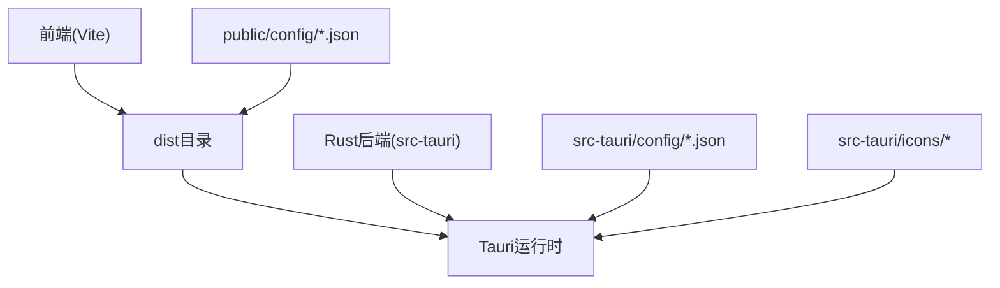
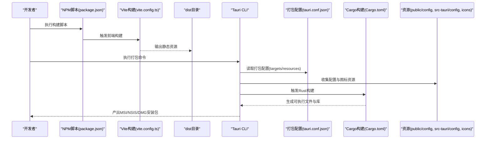
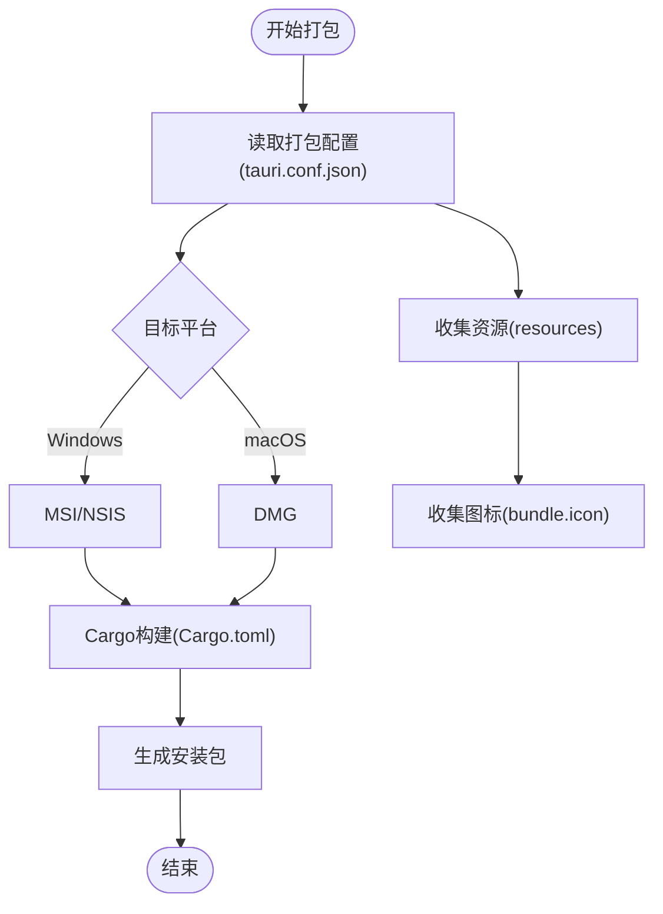
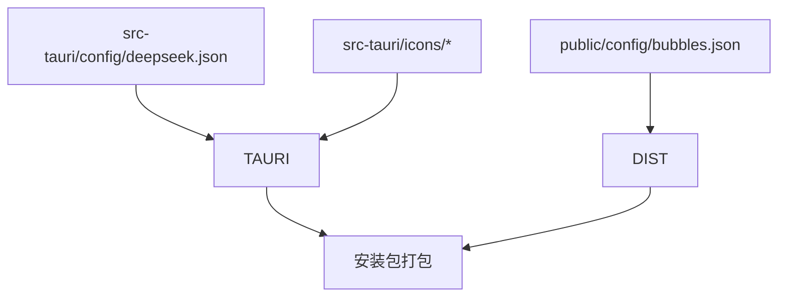
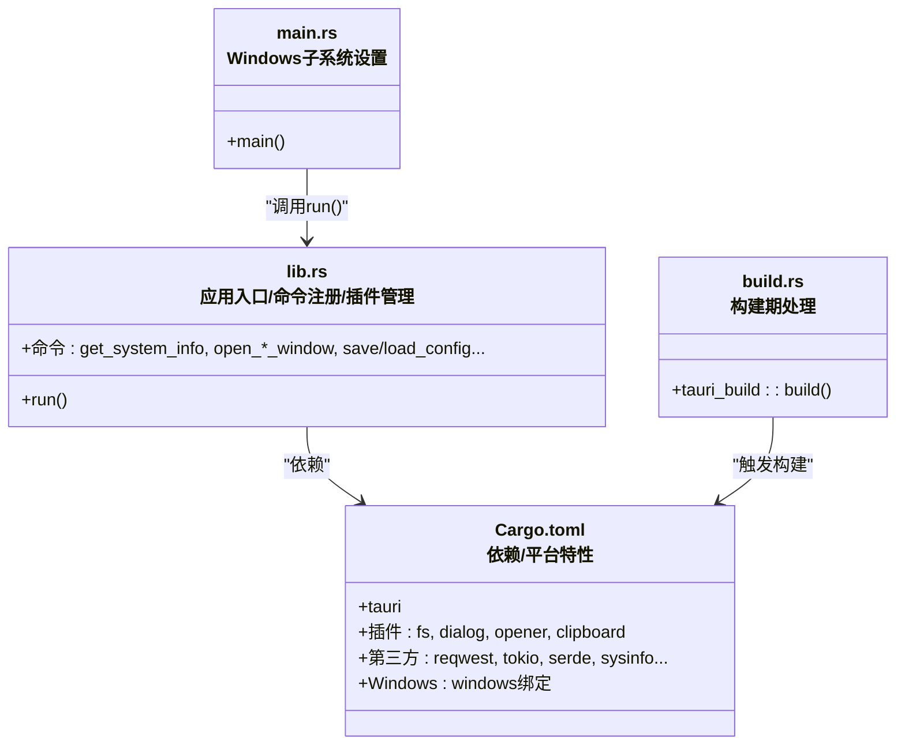
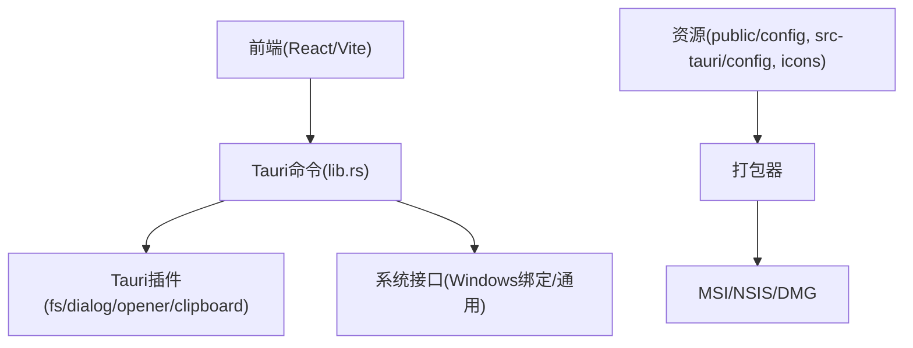

# 打包流程

<cite>
**本文引用的文件**
- [package.json](file://package.json)
- [vite.config.ts](file://vite.config.ts)
- [src-tauri/Cargo.toml](file://src-tauri/Cargo.toml)
- [src-tauri/tauri.conf.json](file://src-tauri/tauri.conf.json)
- [src-tauri/build.rs](file://src-tauri/build.rs)
- [src-tauri/tauri.conf.dev.json](file://src-tauri/tauri.conf.dev.json)
- [src-tauri/src/main.rs](file://src-tauri/src/main.rs)
- [src-tauri/src/lib.rs](file://src-tauri/src/lib.rs)
- [src-tauri/src/window_utils.rs](file://src-tauri/src/window_utils.rs)
- [src-tauri/src/clipboard.rs](file://src-tauri/src/clipboard.rs)
- [src-tauri/src/calendar.rs](file://src-tauri/src/calendar.rs)
- [src-tauri/config/deepseek.json](file://src-tauri/config/deepseek.json)
- [public/config/bubbles.json](file://public/config/bubbles.json)
</cite>

## 目录
1. [简介](#简介)
2. [项目结构](#项目结构)
3. [核心组件](#核心组件)
4. [架构总览](#架构总览)
5. [详细组件分析](#详细组件分析)
6. [依赖关系分析](#依赖关系分析)
7. [性能考虑](#性能考虑)
8. [故障排查指南](#故障排查指南)
9. [结论](#结论)
10. [附录](#附录)

## 简介
本文件面向XSUN桌面宠物项目的打包流程，覆盖多平台安装包生成（MSI、NSIS、DMG）、资源打包（配置文件、图标、依赖库）、Rust后端编译与链接（Cargo配置与依赖管理）、文件组织与目录结构、打包优化策略以及常见问题与调试方法。文档以Tauri为宿主框架，前端基于Vite+React，后端为Rust模块，通过Tauri配置统一控制打包目标与资源。

## 项目结构
项目采用前后端分离与Tauri集成的典型布局：
- 前端：Vite构建产物输出至dist目录，供Tauri在运行时作为应用页面资源加载
- 后端：src-tauri包含Rust二进制与库、Tauri配置、插件能力与资源
- 资源：public与src-tauri内icons、config等目录用于打包时资源收集

图表来源
- [vite.config.ts:1-33](file://vite.config.ts#L1-L33)
- [src-tauri/tauri.conf.json:54-67](file://src-tauri/tauri.conf.json#L54-L67)
- [src-tauri/Cargo.toml:1-44](file://src-tauri/Cargo.toml#L1-L44)

章节来源
- [package.json:1-29](file://package.json#L1-L29)
- [vite.config.ts:1-33](file://vite.config.ts#L1-L33)
- [src-tauri/tauri.conf.json:1-74](file://src-tauri/tauri.conf.json#L1-L74)

## 核心组件
- 构建脚本与前端配置
  - package.json定义开发、构建与预览脚本，前端构建由Vite驱动
  - vite.config.ts固定开发端口与忽略src-tauri监听，确保Tauri Dev体验
- Rust后端与插件
  - src-tauri/Cargo.toml声明Rust crate类型、依赖与平台特定依赖
  - src-tauri/src/lib.rs集中注册命令、插件与应用生命周期
- 打包配置
  - src-tauri/tauri.conf.json启用多平台打包目标与资源收集规则
  - src-tauri/build.rs委托tauri-build执行构建期资源处理

章节来源
- [package.json:6-11](file://package.json#L6-L11)
- [vite.config.ts:8-32](file://vite.config.ts#L8-L32)
- [src-tauri/Cargo.toml:1-44](file://src-tauri/Cargo.toml#L1-L44)
- [src-tauri/src/lib.rs:940-1113](file://src-tauri/src/lib.rs#L940-L1113)
- [src-tauri/tauri.conf.json:53-68](file://src-tauri/tauri.conf.json#L53-L68)
- [src-tauri/build.rs:1-4](file://src-tauri/build.rs#L1-L4)

## 架构总览
下图展示从前端构建到多平台安装包生成的关键流程，以及资源与依赖如何被打包器收集。

图表来源
- [package.json:6-11](file://package.json#L6-L11)
- [vite.config.ts:8-32](file://vite.config.ts#L8-L32)
- [src-tauri/tauri.conf.json:53-68](file://src-tauri/tauri.conf.json#L53-L68)
- [src-tauri/Cargo.toml:1-44](file://src-tauri/Cargo.toml#L1-L44)

## 详细组件分析

### 多平台打包目标配置（MSI、NSIS、DMG）
- 目标启用位置：打包目标在tauri.conf.json的bundle.targets中声明，支持Windows MSI、NSIS与macOS DMG
- 图标与资源：bundle.icon指定图标集合；bundle.resources声明需要打包的配置文件路径
- 平台差异：Windows平台通过Cargo.toml的[target.'cfg(windows)']添加特定依赖（如windows绑定）

图表来源
- [src-tauri/tauri.conf.json:53-68](file://src-tauri/tauri.conf.json#L53-L68)
- [src-tauri/Cargo.toml:37-43](file://src-tauri/Cargo.toml#L37-L43)

章节来源
- [src-tauri/tauri.conf.json:58-62](file://src-tauri/tauri.conf.json#L58-L62)
- [src-tauri/tauri.conf.json:63-67](file://src-tauri/tauri.conf.json#L63-L67)
- [src-tauri/Cargo.toml:37-43](file://src-tauri/Cargo.toml#L37-L43)

### 资源打包过程（配置文件、图标、依赖库）
- 配置文件
  - 深度思考配置：src-tauri/config/deepseek.json作为默认配置资源，通过资源路径解析加载
  - 菜单配置：public/config/bubbles.json作为前端菜单项配置，随dist一起被打包
- 图标资源
  - tauri.conf.json的bundle.icon列出图标清单，用于各平台安装包与应用图标
- 依赖库
  - Cargo.toml声明的Rust依赖在构建阶段被解析并链接，生成最终可执行文件
  - Windows平台依赖通过[target.'cfg(windows)']显式声明，确保打包后具备必要系统接口

图表来源
- [src-tauri/config/deepseek.json:1-6](file://src-tauri/config/deepseek.json#L1-L6)
- [public/config/bubbles.json:1-52](file://public/config/bubbles.json#L1-L52)
- [src-tauri/tauri.conf.json:63-67](file://src-tauri/tauri.conf.json#L63-L67)

章节来源
- [src-tauri/config/deepseek.json:1-6](file://src-tauri/config/deepseek.json#L1-L6)
- [public/config/bubbles.json:1-52](file://public/config/bubbles.json#L1-L52)
- [src-tauri/tauri.conf.json:54-56](file://src-tauri/tauri.conf.json#L54-L56)
- [src-tauri/tauri.conf.json:63-67](file://src-tauri/tauri.conf.json#L63-L67)

### Rust后端编译与链接（Cargo配置与依赖管理）
- crate类型与入口
  - lib.rs导出run函数作为应用入口，main.rs在非调试模式下设置Windows子系统
- 依赖与功能
  - tauri、插件（fs、dialog、opener、clipboard）与第三方库（reqwest、tokio、serde、sysinfo等）
  - Windows平台通过windows绑定实现鼠标钩子与输入模拟
- 构建流程
  - build.rs调用tauri_build进行构建期处理，结合tauri.conf.json的资源与目标配置

图表来源
- [src-tauri/src/lib.rs:940-1113](file://src-tauri/src/lib.rs#L940-L1113)
- [src-tauri/src/main.rs:1-11](file://src-tauri/src/main.rs#L1-L11)
- [src-tauri/Cargo.toml:15-43](file://src-tauri/Cargo.toml#L15-L43)
- [src-tauri/build.rs:1-4](file://src-tauri/build.rs#L1-L4)

章节来源
- [src-tauri/src/main.rs:1-11](file://src-tauri/src/main.rs#L1-L11)
- [src-tauri/src/lib.rs:940-1113](file://src-tauri/src/lib.rs#L940-L1113)
- [src-tauri/Cargo.toml:15-43](file://src-tauri/Cargo.toml#L15-L43)
- [src-tauri/build.rs:1-4](file://src-tauri/build.rs#L1-L4)

### 文件组织与目录结构
- dist目录：Vite构建输出的静态资源，包含前端页面与资源文件
- public目录：前端公共资源（如菜单图标、配置），随dist参与打包
- src-tauri目录：Rust后端、Tauri配置、图标与默认配置
- 资源收集：tauri.conf.json的bundle.resources与bundle.icon决定打包器收集范围

章节来源
- [vite.config.ts:8-32](file://vite.config.ts#L8-L32)
- [src-tauri/tauri.conf.json:54-67](file://src-tauri/tauri.conf.json#L54-L67)

### 打包优化策略
- 安装包体积优化
  - 合理裁剪资源：仅保留bundle.resources与bundle.icon中必要的文件
  - 前端资源压缩：确保生产构建开启压缩与Tree-shaking（Vite默认行为）
  - 移除冗余依赖：定期审查Cargo.toml，避免引入不必要的平台绑定
- 启动速度优化
  - 延迟初始化：将非关键功能（如定时任务、网络请求）延迟到应用初始化后再启动
  - 异步加载：对大文件或远程资源采用异步加载策略
  - 插件按需启用：仅启用所需Tauri插件，减少初始化开销

## 依赖关系分析
- 前端到后端
  - 前端通过Tauri命令与后端交互，命令在lib.rs中集中注册
- 后端到系统
  - Windows平台通过windows绑定访问系统接口；通用平台通过Tauri插件与系统交互
- 打包器到资源
  - 打包器依据tauri.conf.json收集资源并生成安装包

图表来源
- [src-tauri/src/lib.rs:940-1113](file://src-tauri/src/lib.rs#L940-L1113)
- [src-tauri/Cargo.toml:15-43](file://src-tauri/Cargo.toml#L15-L43)
- [src-tauri/tauri.conf.json:53-68](file://src-tauri/tauri.conf.json#L53-L68)

章节来源
- [src-tauri/src/lib.rs:940-1113](file://src-tauri/src/lib.rs#L940-L1113)
- [src-tauri/Cargo.toml:15-43](file://src-tauri/Cargo.toml#L15-L43)
- [src-tauri/tauri.conf.json:53-68](file://src-tauri/tauri.conf.json#L53-L68)

## 性能考虑
- 构建性能
  - 使用并行构建与增量编译，避免不必要的重编译
  - 控制资源大小，减少打包时间
- 运行性能
  - 后端命令尽量异步化，避免阻塞UI线程
  - 对高频操作（如剪贴板监控）设置合理的轮询间隔

## 故障排查指南
- 开发与构建
  - 确认Vite开发端口与HMR配置一致，避免端口冲突
  - 检查beforeDevCommand与beforeBuildCommand是否正确指向前端脚本
- 资源加载
  - 确认bundle.resources包含所需配置文件路径
  - 检查资源路径解析逻辑（如load_deepseek_config）与文件存在性
- 平台特定问题
  - Windows：确认windows绑定依赖已正确安装与链接
  - macOS：确认DMG生成所需的图标与权限配置

章节来源
- [vite.config.ts:16-30](file://vite.config.ts#L16-L30)
- [src-tauri/tauri.conf.json:6-10](file://src-tauri/tauri.conf.json#L6-L10)
- [src-tauri/src/lib.rs:352-379](file://src-tauri/src/lib.rs#L352-L379)
- [src-tauri/Cargo.toml:37-43](file://src-tauri/Cargo.toml#L37-L43)

## 结论
本打包流程以Tauri为核心，结合Vite前端构建与Rust后端，通过tauri.conf.json统一配置多平台安装包目标与资源收集。遵循本文的资源组织、依赖管理与优化策略，可有效降低安装包体积并提升启动速度。遇到问题时，建议从开发端口、资源路径与平台依赖三方面入手排查。

## 附录
- 关键配置参考
  - 打包目标与资源：参见tauri.conf.json的bundle段
  - 前端构建与端口：参见vite.config.ts
  - Rust依赖与平台绑定：参见Cargo.toml
  - 构建期处理：参见build.rs