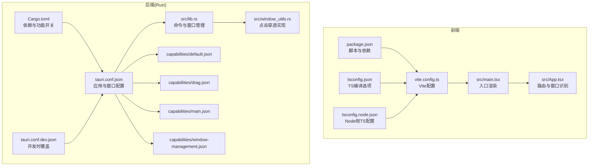
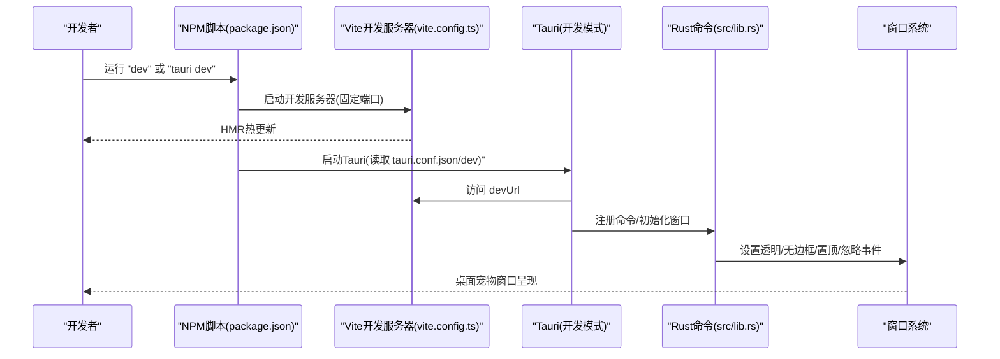
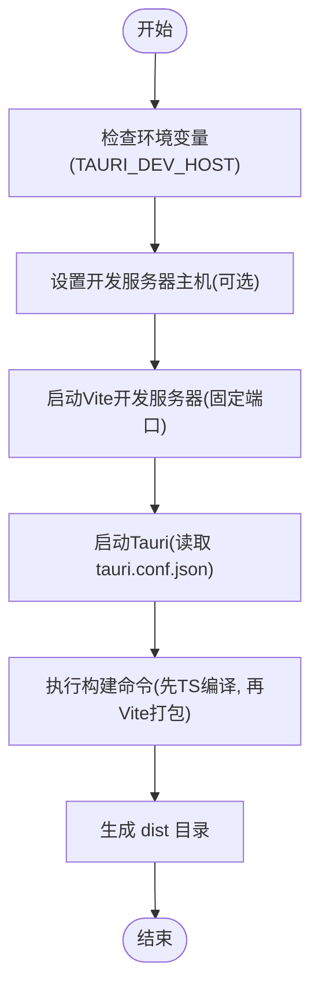
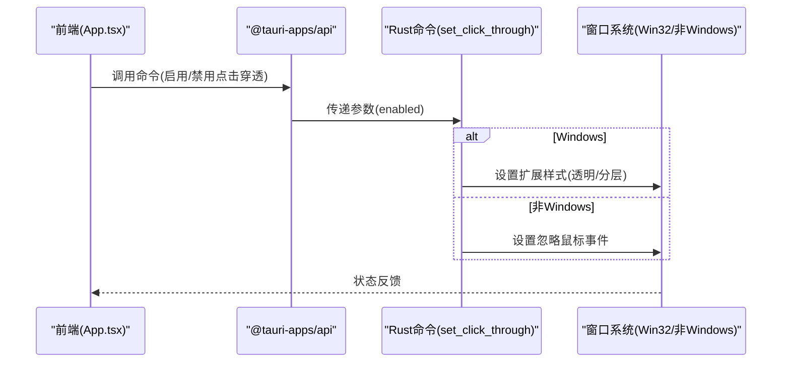
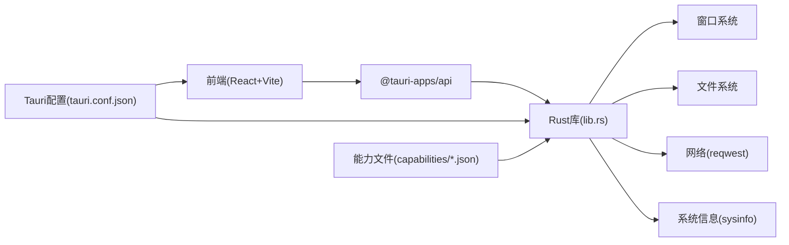

# 构建配置

<cite>
**本文引用的文件**
- [package.json](file://package.json)
- [vite.config.ts](file://vite.config.ts)
- [tsconfig.json](file://tsconfig.json)
- [tsconfig.node.json](file://tsconfig.node.json)
- [src-tauri/tauri.conf.json](file://src-tauri/tauri.conf.json)
- [src-tauri/tauri.conf.dev.json](file://src-tauri/tauri.conf.dev.json)
- [src-tauri/Cargo.toml](file://src-tauri/Cargo.toml)
- [src-tauri/src/main.rs](file://src-tauri/src/main.rs)
- [src-tauri/src/lib.rs](file://src-tauri/src/lib.rs)
- [src-tauri/src/window_utils.rs](file://src-tauri/src/window_utils.rs)
- [src-tauri/capabilities/default.json](file://src-tauri/capabilities/default.json)
- [src-tauri/capabilities/drag.json](file://src-tauri/capabilities/drag.json)
- [src-tauri/capabilities/main.json](file://src-tauri/capabilities/main.json)
- [src-tauri/capabilities/window-management.json](file://src-tauri/capabilities/window-management.json)
- [src/App.tsx](file://src/App.tsx)
- [src/main.tsx](file://src/main.tsx)
</cite>

## 目录
1. [简介](#简介)
2. [项目结构](#项目结构)
3. [核心组件](#核心组件)
4. [架构总览](#架构总览)
5. [详细组件分析](#详细组件分析)
6. [依赖关系分析](#依赖关系分析)
7. [性能考量](#性能考量)
8. [故障排查指南](#故障排查指南)
9. [结论](#结论)
10. [附录](#附录)

## 简介
本文件面向XSUN桌面宠物项目的构建与配置，系统性梳理Tauri配置、Vite与TypeScript构建流程、开发与生产环境差异、以及关键窗口行为（透明、无边框、始终置顶等）对应用行为的影响。同时提供优化建议与常见问题解决方案，帮助开发者快速理解并高效维护构建配置。

## 项目结构
项目采用前后端分离的Tauri架构：前端使用React + TypeScript + Vite进行开发与打包；后端使用Rust（Tauri）承载原生能力与窗口管理；Tauri配置文件集中定义应用元信息、构建入口、窗口属性与权限能力。

**图表来源**
- [package.json:1-29](file://package.json#L1-L29)
- [vite.config.ts:1-33](file://vite.config.ts#L1-L33)
- [tsconfig.json:1-26](file://tsconfig.json#L1-L26)
- [tsconfig.node.json:1-11](file://tsconfig.node.json#L1-L11)
- [src-tauri/Cargo.toml:1-44](file://src-tauri/Cargo.toml#L1-L44)
- [src-tauri/tauri.conf.json:1-74](file://src-tauri/tauri.conf.json#L1-L74)
- [src-tauri/tauri.conf.dev.json:1-8](file://src-tauri/tauri.conf.dev.json#L1-L8)
- [src-tauri/src/lib.rs:1-800](file://src-tauri/src/lib.rs#L1-L800)
- [src-tauri/src/window_utils.rs:1-33](file://src-tauri/src/window_utils.rs#L1-L33)
- [src-tauri/capabilities/default.json:1-12](file://src-tauri/capabilities/default.json#L1-L12)
- [src-tauri/capabilities/drag.json:1-14](file://src-tauri/capabilities/drag.json#L1-L14)
- [src-tauri/capabilities/main.json:1-40](file://src-tauri/capabilities/main.json#L1-L40)
- [src-tauri/capabilities/window-management.json:1-17](file://src-tauri/capabilities/window-management.json#L1-L17)
- [src/main.tsx:1-10](file://src/main.tsx#L1-L10)
- [src/App.tsx:1-57](file://src/App.tsx#L1-L57)

**章节来源**
- [package.json:1-29](file://package.json#L1-L29)
- [vite.config.ts:1-33](file://vite.config.ts#L1-L33)
- [tsconfig.json:1-26](file://tsconfig.json#L1-L26)
- [tsconfig.node.json:1-11](file://tsconfig.node.json#L1-L11)
- [src-tauri/tauri.conf.json:1-74](file://src-tauri/tauri.conf.json#L1-L74)
- [src-tauri/tauri.conf.dev.json:1-8](file://src-tauri/tauri.conf.dev.json#L1-L8)
- [src-tauri/Cargo.toml:1-44](file://src-tauri/Cargo.toml#L1-L44)
- [src-tauri/src/lib.rs:1-800](file://src-tauri/src/lib.rs#L1-L800)
- [src-tauri/src/window_utils.rs:1-33](file://src-tauri/src/window_utils.rs#L1-L33)
- [src-tauri/capabilities/default.json:1-12](file://src-tauri/capabilities/default.json#L1-L12)
- [src-tauri/capabilities/drag.json:1-14](file://src-tauri/capabilities/drag.json#L1-L14)
- [src-tauri/capabilities/main.json:1-40](file://src-tauri/capabilities/main.json#L1-L40)
- [src-tauri/capabilities/window-management.json:1-17](file://src-tauri/capabilities/window-management.json#L1-L17)
- [src/main.tsx:1-10](file://src/main.tsx#L1-L10)
- [src/App.tsx:1-57](file://src/App.tsx#L1-L57)

## 核心组件
- 应用元信息与标识
  - 应用名与版本：在应用配置与包配置中保持一致，确保发布与更新一致性。
  - 标识符：用于区分不同应用或版本，避免系统内冲突。
- 构建入口与命令
  - 开发入口：Vite固定端口与可选主机绑定，便于跨设备联调。
  - 构建命令：先执行TypeScript编译，再执行Vite打包，确保类型安全与产物正确。
- 窗口配置
  - 透明、无边框、始终置顶、不显示任务栏等，共同塑造“悬浮桌面宠物”的视觉与交互体验。
- 能力与权限
  - 通过能力文件声明窗口操作、拖拽、忽略鼠标事件等权限，配合Rust命令实现运行时控制。

**章节来源**
- [src-tauri/tauri.conf.json:3-11](file://src-tauri/tauri.conf.json#L3-L11)
- [package.json:6-11](file://package.json#L6-L11)
- [vite.config.ts:16-31](file://vite.config.ts#L16-L31)
- [src-tauri/tauri.conf.json:13-51](file://src-tauri/tauri.conf.json#L13-L51)
- [src-tauri/capabilities/main.json:1-40](file://src-tauri/capabilities/main.json#L1-L40)

## 架构总览
下图展示从开发到构建的关键流程：前端通过Vite启动开发服务器，Tauri在开发模式下以devUrl指向该服务器；生产模式下由Tauri加载已构建的前端静态资源。窗口行为由Rust侧命令与能力文件共同决定。

**图表来源**
- [package.json:6-11](file://package.json#L6-L11)
- [vite.config.ts:8-31](file://vite.config.ts#L8-L31)
- [src-tauri/tauri.conf.json:6-11](file://src-tauri/tauri.conf.json#L6-L11)
- [src-tauri/tauri.conf.dev.json:2-7](file://src-tauri/tauri.conf.dev.json#L2-L7)
- [src-tauri/src/lib.rs:1-800](file://src-tauri/src/lib.rs#L1-L800)

## 详细组件分析

### Tauri配置文件详解
- 应用基本信息
  - productName：应用名称，影响窗口标题与打包产物命名。
  - version：版本号，用于更新与发布追踪。
  - identifier：应用标识符，避免系统内冲突。
- 构建配置
  - devUrl：开发时前端服务地址，需与Vite端口一致。
  - beforeDevCommand：开发前执行的命令，通常为启动前端开发服务器。
  - beforeBuildCommand：构建前执行的命令，通常为TypeScript编译与Vite打包。
  - frontendDist：前端构建输出目录，供Tauri在生产环境加载。
- 窗口配置
  - 桌宠窗口与提醒窗口均设置透明、无边框、不可调整大小、始终置顶、跳过任务栏等，确保悬浮效果与最小干扰。
  - 提醒窗口额外设置居中与初始隐藏，便于按需显示。
- 安全与能力
  - 声明CSP为null（允许动态脚本），并启用多套能力集合，覆盖拖拽、窗口管理与主功能所需权限。
- 打包与图标
  - targets包含MSI、NSIS、DMG，满足多平台安装需求；图标列表包含多种尺寸。
- 插件
  - 文件系统插件允许读写文件，关闭严格点号规则以提升灵活性。

**章节来源**
- [src-tauri/tauri.conf.json:3-74](file://src-tauri/tauri.conf.json#L3-L74)
- [src-tauri/tauri.conf.dev.json:2-7](file://src-tauri/tauri.conf.dev.json#L2-L7)

### 前端构建流程（Vite + TypeScript）
- Vite配置要点
  - 固定端口与严格端口策略：保证Tauri能稳定连接开发服务器。
  - 可选主机绑定：支持跨设备联调（通过环境变量注入）。
  - HMR适配：当指定主机时启用WebSocket热更新。
  - 忽略监听src-tauri：避免Rust源码变更触发前端重编译。
- TypeScript配置
  - 编译目标与模块解析：采用bundler模式，支持ESNext模块与TS扩展。
  - JSX与严格模式：开启严格模式与未使用检测，提升代码质量。
  - Node侧配置：仅包含Vite配置文件，避免不必要的类型污染。
- 构建脚本
  - 先执行TypeScript编译，再执行Vite打包，确保类型检查与产物一致性。

**图表来源**
- [vite.config.ts:5-31](file://vite.config.ts#L5-L31)
- [package.json:6-11](file://package.json#L6-L11)
- [tsconfig.json:2-26](file://tsconfig.json#L2-L26)
- [tsconfig.node.json:2-10](file://tsconfig.node.json#L2-L10)

**章节来源**
- [vite.config.ts:1-33](file://vite.config.ts#L1-L33)
- [tsconfig.json:1-26](file://tsconfig.json#L1-L26)
- [tsconfig.node.json:1-11](file://tsconfig.node.json#L1-L11)
- [package.json:6-11](file://package.json#L6-L11)

### 开发与生产环境策略
- 开发环境
  - devUrl指向本地Vite服务器，beforeDevCommand启动前端开发服务器。
  - Vite使用固定端口与严格端口策略，确保Tauri稳定连接。
  - 支持跨设备联调（通过主机变量）。
- 生产环境
  - beforeBuildCommand负责TypeScript编译与Vite打包，输出至frontendDist目录。
  - Tauri在运行时加载dist目录下的静态资源，完成应用启动。

**章节来源**
- [src-tauri/tauri.conf.dev.json:2-7](file://src-tauri/tauri.conf.dev.json#L2-L7)
- [src-tauri/tauri.conf.json:6-11](file://src-tauri/tauri.conf.json#L6-L11)
- [package.json:6-11](file://package.json#L6-L11)

### 关键窗口行为与实现
- 透明窗口
  - 配置层：窗口属性设置透明。
  - 运行时：可通过命令切换点击穿透，Windows平台通过扩展样式位控制，非Windows平台使用忽略鼠标事件API。
- 无边框窗口
  - 配置层：禁用装饰，结合透明实现悬浮外观。
- 始终置顶
  - 配置层：alwaysOnTop为true，确保窗口在其他应用之上。
- 跳过任务栏
  - 配置层：skipTaskbar为true，避免任务栏干扰。
- 点击穿透与拖拽
  - 能力文件允许拖拽与忽略光标事件；Rust命令封装统一接口，前端通过命令调用实现运行时切换。

**图表来源**
- [src-tauri/src/lib.rs:48-50](file://src-tauri/src/lib.rs#L48-L50)
- [src-tauri/src/window_utils.rs:9-32](file://src-tauri/src/window_utils.rs#L9-L32)
- [src-tauri/capabilities/drag.json:1-14](file://src-tauri/capabilities/drag.json#L1-L14)
- [src-tauri/capabilities/window-management.json:1-17](file://src-tauri/capabilities/window-management.json#L1-L17)

**章节来源**
- [src-tauri/tauri.conf.json:13-51](file://src-tauri/tauri.conf.json#L13-L51)
- [src-tauri/src/lib.rs:48-50](file://src-tauri/src/lib.rs#L48-L50)
- [src-tauri/src/window_utils.rs:1-33](file://src-tauri/src/window_utils.rs#L1-L33)
- [src-tauri/capabilities/drag.json:1-14](file://src-tauri/capabilities/drag.json#L1-L14)
- [src-tauri/capabilities/window-management.json:1-17](file://src-tauri/capabilities/window-management.json#L1-L17)
- [src/App.tsx:17-57](file://src/App.tsx#L17-L57)

### 能力与权限体系
- default：主窗口能力，允许基本窗口与Webview操作。
- drag：允许拖拽与忽略光标事件，支撑“可拖动的桌面宠物”体验。
- window-management：允许显示/隐藏、聚焦、忽略事件等窗口管理操作。
- main-capability：覆盖全窗口的综合权限，包含窗口、剪贴板、对话框、文件系统等。

**章节来源**
- [src-tauri/capabilities/default.json:1-12](file://src-tauri/capabilities/default.json#L1-L12)
- [src-tauri/capabilities/drag.json:1-14](file://src-tauri/capabilities/drag.json#L1-L14)
- [src-tauri/capabilities/window-management.json:1-17](file://src-tauri/capabilities/window-management.json#L1-L17)
- [src-tauri/capabilities/main.json:1-40](file://src-tauri/capabilities/main.json#L1-L40)
- [src-tauri/tauri.conf.json:44-51](file://src-tauri/tauri.conf.json#L44-L51)

### Rust入口与库
- main.rs：设置Windows子系统，防止发布时出现额外控制台。
- lib.rs：注册命令、创建托盘菜单、管理窗口生命周期与事件，是窗口行为与能力的核心实现地。

**章节来源**
- [src-tauri/src/main.rs:1-11](file://src-tauri/src/main.rs#L1-L11)
- [src-tauri/src/lib.rs:1-800](file://src-tauri/src/lib.rs#L1-L800)

## 依赖关系分析
- 前端依赖
  - React与React DOM：UI框架。
  - @tauri-apps/api与插件：与后端通信与原生能力访问。
  - Vite与React插件：开发与打包工具链。
- 后端依赖
  - Tauri核心与功能插件：窗口、对话框、文件系统、剪贴板等。
  - Tokio与Reqwest：异步运行时与HTTP客户端。
  - Sysinfo与时间调度：系统信息采集与定时任务。
- 配置耦合
  - tauri.conf.json与tauri.conf.dev.json：开发与生产的入口与命令耦合。
  - 能力文件与Rust命令：权限声明与运行时控制强耦合。

**图表来源**
- [package.json:12-27](file://package.json#L12-L27)
- [src-tauri/Cargo.toml:15-35](file://src-tauri/Cargo.toml#L15-L35)
- [src-tauri/tauri.conf.json:6-11](file://src-tauri/tauri.conf.json#L6-L11)
- [src-tauri/capabilities/main.json:1-40](file://src-tauri/capabilities/main.json#L1-L40)

**章节来源**
- [package.json:12-27](file://package.json#L12-L27)
- [src-tauri/Cargo.toml:15-35](file://src-tauri/Cargo.toml#L15-L35)
- [src-tauri/tauri.conf.json:6-11](file://src-tauri/tauri.conf.json#L6-L11)
- [src-tauri/capabilities/main.json:1-40](file://src-tauri/capabilities/main.json#L1-L40)

## 性能考量
- 开发阶段
  - 固定端口与严格端口策略减少端口冲突与重连成本。
  - HMR在跨设备联调时启用WebSocket，提升迭代效率。
  - 忽略src-tauri监听，降低前端编译压力。
- 生产阶段
  - 前端构建顺序（TS编译 → Vite打包）确保类型安全与产物体积可控。
  - 窗口透明与无边框减少绘制开销，但需注意与系统合成器的兼容性。
  - 始终置顶与忽略事件可降低用户误触概率，但可能增加系统窗口管理负担。

[本节为通用指导，无需特定文件引用]

## 故障排查指南
- 开发服务器无法连接
  - 确认Vite端口与devUrl一致，且严格端口策略生效。
  - 若跨设备联调，确认主机变量与HMR配置。
- 构建失败或产物缺失
  - 确认构建命令顺序：先TypeScript编译，再Vite打包。
  - 确认frontendDist目录存在且包含构建产物。
- 窗口行为异常
  - 透明与无边框组合需与alwaysOnTop、skipTaskbar协同测试。
  - 点击穿透切换需验证平台差异（Windows与非Windows分支）。
- 权限不足
  - 检查能力文件是否包含所需权限，确保Rust命令已注册。
- 托盘菜单与窗口联动
  - 确认窗口标签与前端路由匹配，避免找不到窗口或焦点丢失。

**章节来源**
- [vite.config.ts:16-31](file://vite.config.ts#L16-L31)
- [src-tauri/tauri.conf.json:6-11](file://src-tauri/tauri.conf.json#L6-L11)
- [src-tauri/src/lib.rs:48-50](file://src-tauri/src/lib.rs#L48-L50)
- [src-tauri/src/window_utils.rs:9-32](file://src-tauri/src/window_utils.rs#L9-L32)
- [src-tauri/capabilities/main.json:1-40](file://src-tauri/capabilities/main.json#L1-L40)
- [src/App.tsx:17-57](file://src/App.tsx#L17-L57)

## 结论
本项目通过清晰的配置分层（前端Vite/TS、后端Tauri/Rust、能力与权限）实现了“悬浮桌面宠物”的高自由度窗口行为与稳定的开发体验。遵循本文档的配置策略与优化建议，可在不同平台上获得一致的构建与运行表现。

[本节为总结，无需特定文件引用]

## 附录
- 关键路径速览
  - 应用配置：[src-tauri/tauri.conf.json](file://src-tauri/tauri.conf.json)
  - 开发配置覆盖：[src-tauri/tauri.conf.dev.json](file://src-tauri/tauri.conf.dev.json)
  - 前端构建：[vite.config.ts](file://vite.config.ts)
  - 类型配置：[tsconfig.json](file://tsconfig.json)、[tsconfig.node.json](file://tsconfig.node.json)
  - 后端入口与库：[src-tauri/src/main.rs](file://src-tauri/src/main.rs)、[src-tauri/src/lib.rs](file://src-tauri/src/lib.rs)
  - 窗口工具：[src-tauri/src/window_utils.rs](file://src-tauri/src/window_utils.rs)
  - 能力文件：[capabilities/default.json](file://src-tauri/capabilities/default.json)、[capabilities/drag.json](file://src-tauri/capabilities/drag.json)、[capabilities/window-management.json](file://src-tauri/capabilities/window-management.json)、[capabilities/main.json](file://src-tauri/capabilities/main.json)
  - 前端入口与路由：[src/main.tsx](file://src/main.tsx)、[src/App.tsx](file://src/App.tsx)

[本节为索引，无需特定文件引用]