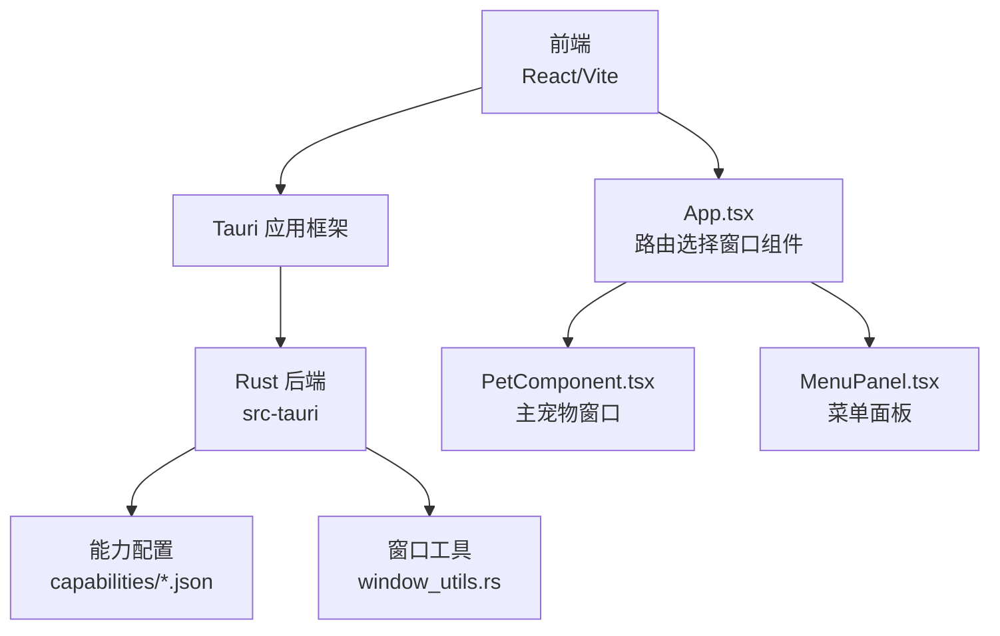
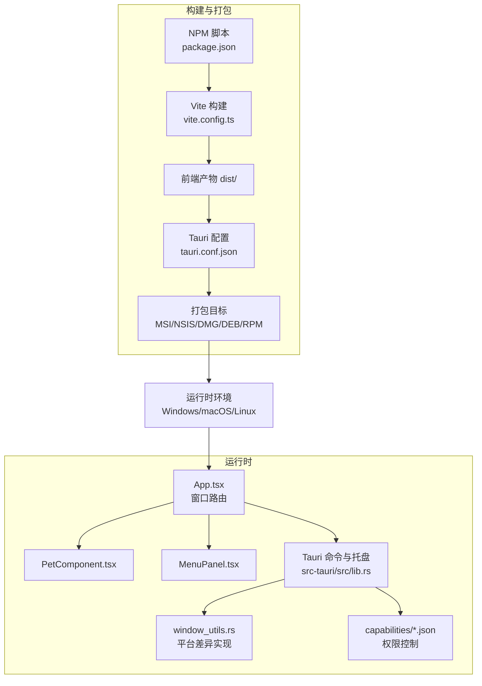
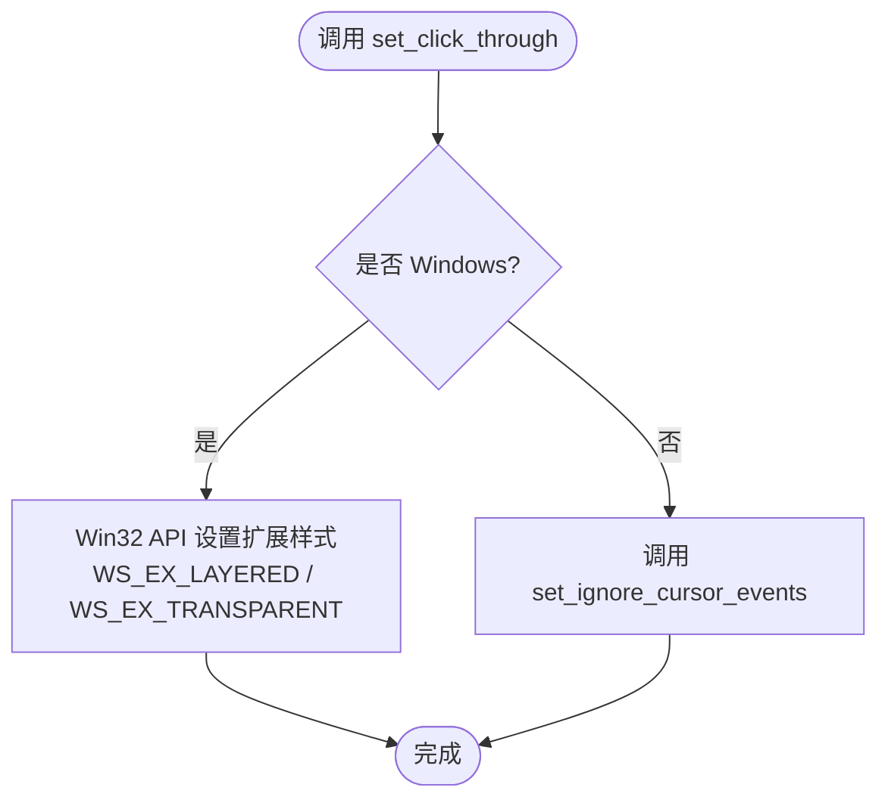
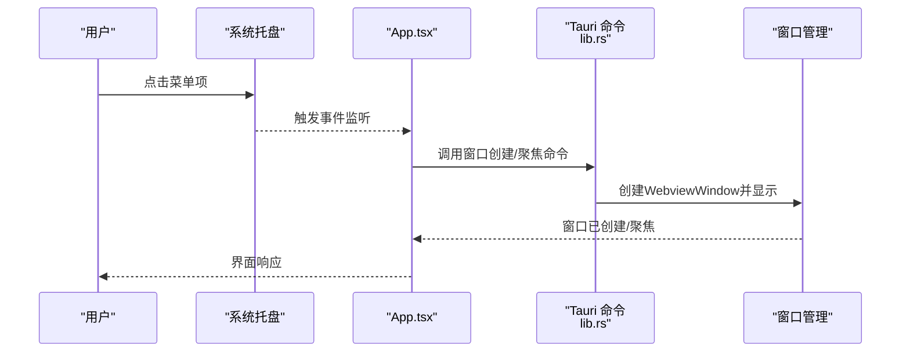
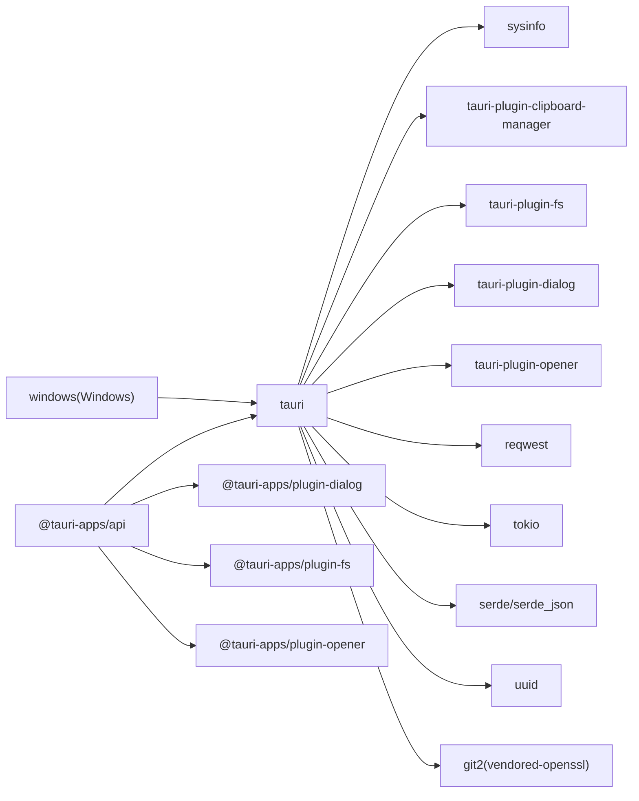

# 跨平台部署

<cite>
**本文引用的文件**
- [package.json](file://package.json)
- [vite.config.ts](file://vite.config.ts)
- [src-tauri/Cargo.toml](file://src-tauri/Cargo.toml)
- [src-tauri/tauri.conf.json](file://src-tauri/tauri.conf.json)
- [src-tauri/tauri.conf.dev.json](file://src-tauri/tauri.conf.dev.json)
- [src-tauri/build.rs](file://src-tauri/build.rs)
- [src-tauri/src/main.rs](file://src-tauri/src/main.rs)
- [src-tauri/src/lib.rs](file://src-tauri/src/lib.rs)
- [src-tauri/src/window_utils.rs](file://src-tauri/src/window_utils.rs)
- [src-tauri/capabilities/default.json](file://src-tauri/capabilities/default.json)
- [src-tauri/capabilities/drag.json](file://src-tauri/capabilities/drag.json)
- [src-tauri/capabilities/main.json](file://src-tauri/capabilities/main.json)
- [src-tauri/capabilities/window-management.json](file://src-tauri/capabilities/window-management.json)
- [src/App.tsx](file://src/App.tsx)
- [src/components/PetComponent.tsx](file://src/components/PetComponent.tsx)
- [src/components/MenuPanel.tsx](file://src/components/MenuPanel.tsx)
</cite>

## 目录
1. [简介](#简介)
2. [项目结构](#项目结构)
3. [核心组件](#核心组件)
4. [架构总览](#架构总览)
5. [详细组件分析](#详细组件分析)
6. [依赖关系分析](#依赖关系分析)
7. [性能考虑](#性能考虑)
8. [故障排查指南](#故障排查指南)
9. [结论](#结论)
10. [附录](#附录)

## 简介
本文件面向XSUN桌面宠物项目的跨平台部署，围绕Windows、macOS与Linux三大平台，系统阐述以下主题：
- 平台差异化配置与限制
- 打包产物差异（Windows MSI/NSIS、macOS DMG、Linux DEB/RPM）
- 平台特定功能支持（系统托盘、通知、快捷键）
- 兼容性测试方法与工具
- 性能优化建议与最佳实践
- 跨平台开发常见陷阱与解决方案

## 项目结构
该项目采用前端React/Vite + 后端Tauri(Rust)的混合架构，前端负责UI与交互，后端提供系统能力与窗口管理，并通过Tauri能力系统进行权限控制。

图表来源
- [src-tauri/src/lib.rs:1-120](file://src-tauri/src/lib.rs#L1-L120)
- [src-tauri/src/window_utils.rs:1-33](file://src-tauri/src/window_utils.rs#L1-L33)
- [src/App.tsx:1-60](file://src/App.tsx#L1-L60)
- [src/components/PetComponent.tsx:1-200](file://src/components/PetComponent.tsx#L1-L200)
- [src/components/MenuPanel.tsx:1-200](file://src/components/MenuPanel.tsx#L1-L200)

章节来源
- [package.json:1-29](file://package.json#L1-L29)
- [vite.config.ts:1-33](file://vite.config.ts#L1-L33)
- [src-tauri/Cargo.toml:1-44](file://src-tauri/Cargo.toml#L1-L44)
- [src-tauri/tauri.conf.json:1-74](file://src-tauri/tauri.conf.json#L1-L74)
- [src-tauri/tauri.conf.dev.json:1-8](file://src-tauri/tauri.conf.dev.json#L1-L8)

## 核心组件
- 前端构建与开发服务器：Vite配置固定端口与热更新，忽略src-tauri目录。
- Rust后端：统一入口调用库函数初始化窗口与托盘；提供命令接口供前端调用。
- 能力系统：通过capabilities/*.json声明窗口与权限，确保最小权限原则。
- 窗口工具：针对不同平台实现“点击穿透”与“忽略光标事件”的差异化逻辑。

章节来源
- [vite.config.ts:8-32](file://vite.config.ts#L8-L32)
- [src-tauri/src/main.rs:8-11](file://src-tauri/src/main.rs#L8-L11)
- [src-tauri/src/lib.rs:1-120](file://src-tauri/src/lib.rs#L1-L120)
- [src-tauri/src/window_utils.rs:1-33](file://src-tauri/src/window_utils.rs#L1-L33)
- [src-tauri/capabilities/main.json:1-40](file://src-tauri/capabilities/main.json#L1-L40)

## 架构总览
下图展示跨平台打包与运行时的关键节点：前端构建、Tauri配置、能力声明、平台特定依赖与打包目标。

图表来源
- [package.json:6-11](file://package.json#L6-L11)
- [vite.config.ts:8-32](file://vite.config.ts#L8-L32)
- [src-tauri/tauri.conf.json:53-68](file://src-tauri/tauri.conf.json#L53-L68)
- [src-tauri/src/lib.rs:778-800](file://src-tauri/src/lib.rs#L778-L800)
- [src-tauri/src/window_utils.rs:1-33](file://src-tauri/src/window_utils.rs#L1-L33)
- [src-tauri/capabilities/main.json:1-40](file://src-tauri/capabilities/main.json#L1-L40)

## 详细组件分析

### 窗口与点击穿透（平台差异）
- Windows：通过Win32 API设置扩展样式以实现点击穿透；启用分层窗口与透明属性。
- macOS/Linux：使用Tauri的忽略光标事件能力，避免对系统窗口管理器产生不必要影响。
- Rust侧封装统一接口，前端仅需调用命令切换状态。

图表来源
- [src-tauri/src/window_utils.rs:9-32](file://src-tauri/src/window_utils.rs#L9-L32)

章节来源
- [src-tauri/src/window_utils.rs:1-33](file://src-tauri/src/window_utils.rs#L1-L33)
- [src-tauri/Cargo.toml:37-43](file://src-tauri/Cargo.toml#L37-L43)

### 托盘与菜单（跨平台）
- 定义托盘菜单项：显示桌宠、剪贴板、系统信息、AI对话、有道翻译、日历、退出等。
- 通过事件监听响应托盘菜单点击，创建或聚焦对应窗口。
- 菜单面板负责窗口创建、显示与焦点管理。

图表来源
- [src-tauri/src/lib.rs:778-800](file://src-tauri/src/lib.rs#L778-L800)
- [src-tauri/src/lib.rs:78-160](file://src-tauri/src/lib.rs#L78-L160)
- [src/App.tsx:18-60](file://src/App.tsx#L18-L60)
- [src/components/MenuPanel.tsx:45-88](file://src/components/MenuPanel.tsx#L45-L88)

章节来源
- [src-tauri/src/lib.rs:778-800](file://src-tauri/src/lib.rs#L778-L800)
- [src-tauri/src/lib.rs:78-160](file://src-tauri/src/lib.rs#L78-L160)
- [src/App.tsx:18-60](file://src/App.tsx#L18-L60)
- [src/components/MenuPanel.tsx:1-200](file://src/components/MenuPanel.tsx#L1-L200)

### 能力与权限（capabilities）
- main-capability：允许窗口创建、显示、隐藏、拖拽、忽略光标事件、托盘、文件系统、对话框等。
- drag：允许启动原生窗口拖拽与设置忽略光标事件，限定于pet/main窗口。
- default：默认窗口权限，允许创建Webview窗口。
- window-management：限定窗口显示/隐藏/聚焦/忽略光标事件。

章节来源
- [src-tauri/capabilities/main.json:1-40](file://src-tauri/capabilities/main.json#L1-L40)
- [src-tauri/capabilities/drag.json:1-14](file://src-tauri/capabilities/drag.json#L1-L14)
- [src-tauri/capabilities/default.json:1-12](file://src-tauri/capabilities/default.json#L1-L12)
- [src-tauri/capabilities/window-management.json:1-17](file://src-tauri/capabilities/window-management.json#L1-L17)

### 打包目标与图标
- 打包目标：MSI、NSIS（Windows）、DMG（macOS）。
- 图标：cat32.png、cat48.png、cat72.ico。
- 资源：包含config/*。

章节来源
- [src-tauri/tauri.conf.json:53-68](file://src-tauri/tauri.conf.json#L53-L68)

## 依赖关系分析
- 前端依赖：React、ReactDOM、@tauri-apps/api及插件（对话框、文件系统、打开器）。
- Rust依赖：tauri（含tray-icon特性）、clipboard-manager、fs、dialog、reqwest、tokio、sysinfo、serde、git2、uuid等。
- 平台特定依赖：Windows平台引入Win32 API相关crate以实现点击穿透。

图表来源
- [package.json:12-19](file://package.json#L12-L19)
- [src-tauri/Cargo.toml:15-35](file://src-tauri/Cargo.toml#L15-L35)
- [src-tauri/Cargo.toml:37-43](file://src-tauri/Cargo.toml#L37-L43)

章节来源
- [package.json:1-29](file://package.json#L1-L29)
- [src-tauri/Cargo.toml:1-44](file://src-tauri/Cargo.toml#L1-L44)

## 性能考虑
- 窗口与渲染
  - 透明、无装饰、始终置顶的窗口会增加合成开销，建议按需启用并在空闲时恢复非置顶。
  - 点击穿透可减少输入事件处理成本，适合悬浮宠物类窗口。
- 网络与异步
  - 异步文件读写与HTTP请求使用Tokio运行时，注意避免阻塞主线程。
  - 对第三方API调用应设置合理的超时与重试策略。
- 资源与打包
  - 将静态资源纳入打包资源列表，减少运行时网络依赖。
  - 控制图标尺寸与数量，避免过大体积影响冷启动。

## 故障排查指南
- 开发服务器端口冲突
  - Vite固定端口1420，严格端口模式；若被占用，需释放或修改。
- 窗口创建失败
  - 检查capabilities权限与窗口选项；确认前端URL与窗口标签唯一性。
- 托盘事件未响应
  - 确认事件监听注册与托盘菜单项ID一致；查看命令调用返回错误。
- Windows点击穿透无效
  - 确认已启用tray-icon特性与Win32 API依赖；检查扩展样式设置流程。
- Linux/macOS窗口层级问题
  - 若出现无法置顶或被遮挡，检查平台窗口管理器策略与alwaysOnTop支持情况。

章节来源
- [vite.config.ts:16-26](file://vite.config.ts#L16-L26)
- [src-tauri/tauri.conf.json:13-43](file://src-tauri/tauri.conf.json#L13-L43)
- [src-tauri/src/lib.rs:778-800](file://src-tauri/src/lib.rs#L778-L800)
- [src-tauri/src/window_utils.rs:9-32](file://src-tauri/src/window_utils.rs#L9-L32)

## 结论
XSUN桌面宠物基于Tauri实现了跨平台部署，通过能力系统与平台特定实现，兼顾了功能完整性与用户体验。Windows平台通过Win32 API实现点击穿透，macOS/Linux则依赖Tauri的忽略光标事件能力。打包方面支持MSI/NSIS/DMG，并可通过配置扩展DEB/RPM目标。建议在实际发布前完善平台兼容性测试与性能优化，确保在各平台上的稳定性与流畅度。

## 附录

### 平台差异化配置与限制
- Windows
  - 特性：tray-icon、Win32 API（鼠标钩子、SendInput）。
  - 限制：需要管理员权限的系统级操作需额外处理；点击穿透通过扩展样式实现。
- macOS
  - 特性：托盘图标与菜单、通知中心集成。
  - 限制：沙盒与权限模型较为严格，需在打包时正确配置权限与签名。
- Linux
  - 特性：托盘图标与菜单、通知。
  - 限制：桌面环境差异较大，需验证不同桌面环境下的行为一致性。

章节来源
- [src-tauri/Cargo.toml:15-35](file://src-tauri/Cargo.toml#L15-L35)
- [src-tauri/Cargo.toml:37-43](file://src-tauri/Cargo.toml#L37-L43)
- [src-tauri/tauri.conf.json:53-68](file://src-tauri/tauri.conf.json#L53-L68)

### 打包差异
- Windows：MSI/NSIS安装包，支持卸载与注册表清理。
- macOS：DMG镜像，便于拖拽安装与签名。
- Linux：DEB/RPM包，需根据发行版选择合适格式；可结合打包工具生成。

章节来源
- [src-tauri/tauri.conf.json:58-62](file://src-tauri/tauri.conf.json#L58-L62)

### 平台特定功能支持
- 系统托盘：统一通过Tauri托盘API实现，菜单项与事件绑定。
- 通知：可结合系统通知服务（平台差异由Tauri抽象），建议在前端通过命令调用。
- 快捷键：可在Rust侧注册全局/窗口快捷键，前端通过命令触发对应功能。

章节来源
- [src-tauri/src/lib.rs:778-800](file://src-tauri/src/lib.rs#L778-L800)
- [src-tauri/Cargo.toml:15-25](file://src-tauri/Cargo.toml#L15-L25)

### 兼容性测试方法与工具
- 自动化测试：使用跨平台UI自动化框架（如Sikuli、Playwright）编写测试脚本。
- 平台矩阵：在CI中并行执行Windows/macOS/Linux的构建与基本功能验证。
- 性能基准：记录窗口创建耗时、内存占用、CPU占用等指标，对比不同平台表现。

### 最佳实践
- 权限最小化：仅授予所需能力，避免过度授权。
- 平台适配：为Windows/macOS/Linux分别配置图标、签名与打包参数。
- 错误处理：对平台特定API调用进行健壮性处理与降级方案设计。
- 用户体验：保持窗口行为一致性，避免在不同平台出现显著差异。