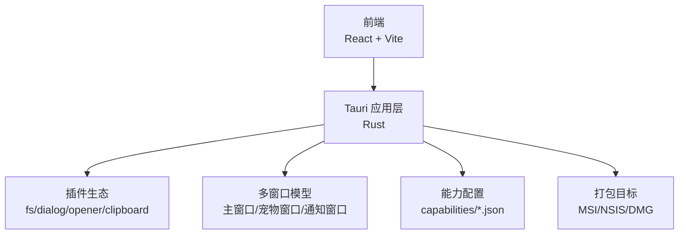
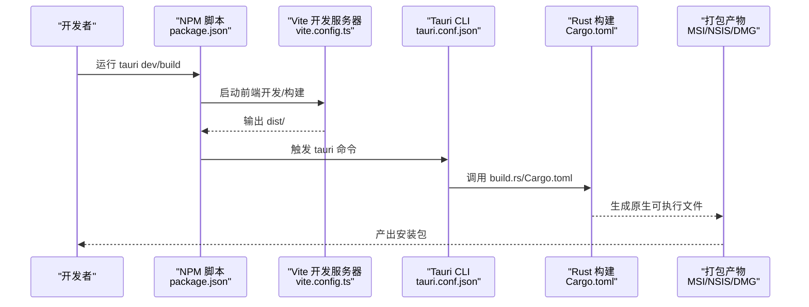
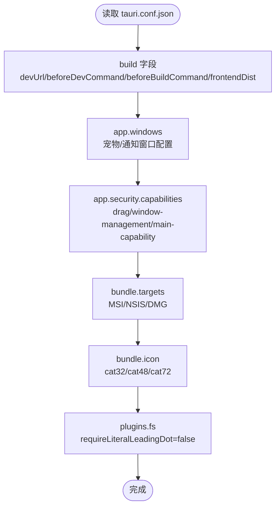
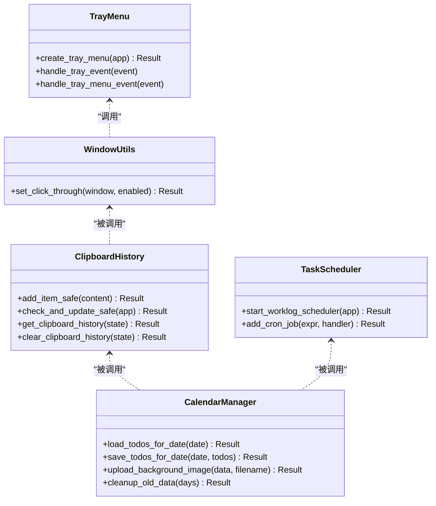
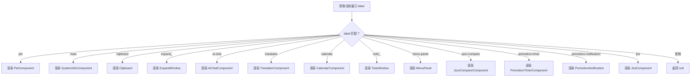
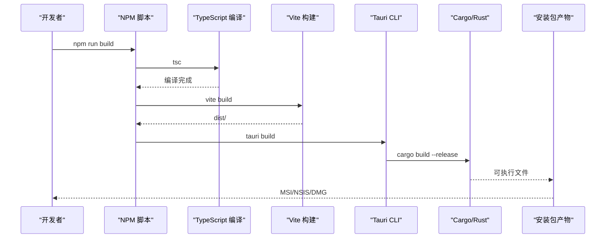
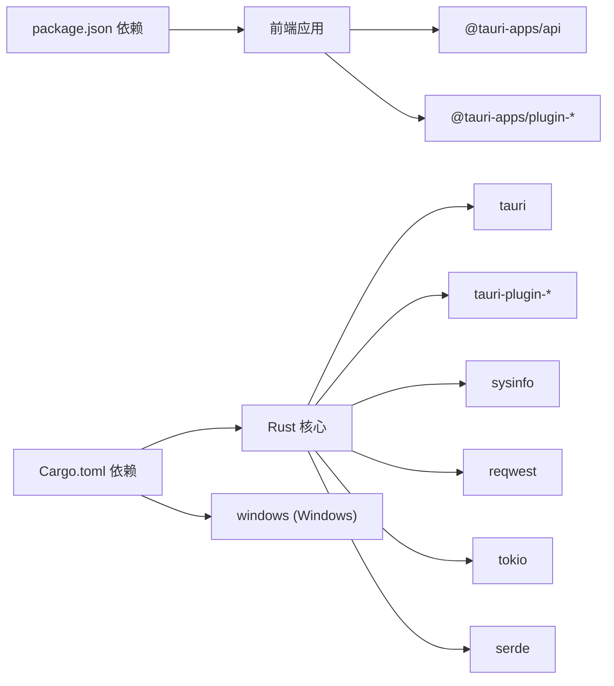

# 部署指南

<cite>
**本文引用的文件**
- [package.json](file://package.json)
- [vite.config.ts](file://vite.config.ts)
- [src-tauri/Cargo.toml](file://src-tauri/Cargo.toml)
- [src-tauri/tauri.conf.json](file://src-tauri/tauri.conf.json)
- [src-tauri/tauri.conf.dev.json](file://src-tauri/tauri.conf.dev.json)
- [src-tauri/build.rs](file://src-tauri/build.rs)
- [src-tauri/capabilities/default.json](file://src-tauri/capabilities/default.json)
- [src-tauri/capabilities/drag.json](file://src-tauri/capabilities/drag.json)
- [src-tauri/capabilities/main.json](file://src-tauri/capabilities/main.json)
- [src-tauri/capabilities/window-management.json](file://src-tauri/capabilities/window-management.json)
- [src-tauri/src/lib.rs](file://src-tauri/src/lib.rs)
- [src-tauri/src/main.rs](file://src-tauri/src/main.rs)
- [src-tauri/src/window_utils.rs](file://src-tauri/src/window_utils.rs)
- [src-tauri/src/clipboard.rs](file://src-tauri/src/clipboard.rs)
- [src-tauri/src/calendar.rs](file://src-tauri/src/calendar.rs)
- [src-tauri/src/task_scheduler.rs](file://src-tauri/src/task_scheduler.rs)
- [src/App.tsx](file://src/App.tsx)
- [src/main.tsx](file://src/main.tsx)
</cite>

## 目录
1. [简介](#简介)
2. [项目结构](#项目结构)
3. [核心组件](#核心组件)
4. [架构总览](#架构总览)
5. [详细组件分析](#详细组件分析)
6. [依赖关系分析](#依赖关系分析)
7. [性能考量](#性能考量)
8. [故障排查指南](#故障排查指南)
9. [结论](#结论)
10. [附录](#附录)

## 简介
本指南面向XSUN桌面宠物项目的部署与运维，覆盖从开发环境准备、构建配置、打包与分发，到跨平台差异处理、CI/CD集成、监控与维护的全流程。文档基于仓库中的实际配置文件与源码进行分析，帮助读者快速、稳定地完成应用的生产级部署。

## 项目结构
项目采用Tauri + React/Vite的双端架构：
- 前端：React + TypeScript，通过Vite进行开发与构建
- 后端：Rust（Tauri 2），负责系统交互、窗口管理、插件能力与定时任务
- 配置：Tauri配置文件集中定义应用元信息、窗口行为、打包目标与权限能力

图表来源
- [vite.config.ts:1-33](file://vite.config.ts#L1-L33)
- [src-tauri/tauri.conf.json:1-74](file://src-tauri/tauri.conf.json#L1-L74)
- [src-tauri/Cargo.toml:1-43](file://src-tauri/Cargo.toml#L1-L43)

章节来源
- [package.json:1-29](file://package.json#L1-L29)
- [vite.config.ts:1-33](file://vite.config.ts#L1-L33)
- [src-tauri/tauri.conf.json:1-74](file://src-tauri/tauri.conf.json#L1-L74)
- [src-tauri/Cargo.toml:1-43](file://src-tauri/Cargo.toml#L1-L43)

## 核心组件
- 构建与脚本
  - 前端构建：TypeScript编译与Vite打包
  - 应用入口：Tauri CLI与Rust后端
- 窗口与UI
  - 宠物窗口：透明、置顶、无边框、不参与任务栏
  - 通知窗口：透明、居中、可显隐
  - 主窗口：系统信息展示
- 插件与能力
  - 文件系统、对话框、剪贴板、打开器等
  - 能力配置按窗口维度授权
- 打包与图标
  - 多目标：MSI（Windows）、NSIS（Windows）、DMG（macOS）
  - 图标集：PNG与ICO多尺寸

章节来源
- [package.json:6-11](file://package.json#L6-L11)
- [src-tauri/tauri.conf.json:12-51](file://src-tauri/tauri.conf.json#L12-L51)
- [src-tauri/tauri.conf.json:53-68](file://src-tauri/tauri.conf.json#L53-L68)
- [src-tauri/Cargo.toml:15-31](file://src-tauri/Cargo.toml#L15-L31)

## 架构总览
下图展示了从开发到打包的关键流程与关键文件映射：

图表来源
- [package.json:6-11](file://package.json#L6-L11)
- [vite.config.ts:8-32](file://vite.config.ts#L8-L32)
- [src-tauri/tauri.conf.json:6-11](file://src-tauri/tauri.conf.json#L6-L11)
- [src-tauri/build.rs:1-4](file://src-tauri/build.rs#L1-L4)
- [src-tauri/Cargo.toml:12-14](file://src-tauri/Cargo.toml#L12-L14)

## 详细组件分析

### Tauri 配置与能力体系
- 应用元信息与窗口
  - 产品名、版本、标识符
  - 多窗口定义：宠物窗口（透明、置顶、无装饰）、通知窗口（居中、可显隐）
- 安全与能力
  - CSP设为null（允许前端自由访问）
  - 能力列表启用拖拽、窗口管理与主能力
- 打包与图标
  - targets：MSI、NSIS、DMG
  - icon：cat32.png、cat48.png、cat72.ico
  - resources：config/*
- 插件
  - fs：关闭“点开头文件必须带点”的限制

图表来源
- [src-tauri/tauri.conf.json:1-74](file://src-tauri/tauri.conf.json#L1-L74)

章节来源
- [src-tauri/tauri.conf.json:1-74](file://src-tauri/tauri.conf.json#L1-L74)
- [src-tauri/capabilities/default.json:1-12](file://src-tauri/capabilities/default.json#L1-L12)
- [src-tauri/capabilities/drag.json:1-14](file://src-tauri/capabilities/drag.json#L1-L14)
- [src-tauri/capabilities/main.json:1-40](file://src-tauri/capabilities/main.json#L1-L40)
- [src-tauri/capabilities/window-management.json:1-17](file://src-tauri/capabilities/window-management.json#L1-L17)

### Rust 后端与命令接口
- 窗口工具
  - Windows：通过Win32 API设置窗口样式实现穿透/取消穿透
  - 其他平台：使用忽略光标事件API
- 剪贴板
  - 历史记录结构与并发安全
  - 提供读取、写入、清空、去重与批量测试命令
- 日历与待办
  - 数据持久化：todos.json、events.json、calendar_settings.json
  - 支持背景图上传/删除、设置主题与旋转间隔
- 定时任务
  - 基于cron表达式的调度器，支持工作日志AI处理
- 托盘菜单
  - 左键显示/隐藏宠物窗口；右键显示系统菜单；双击显示宠物窗口
  - 菜单项：显示宠物、剪贴板、系统信息、AI对话、有道翻译、日历、退出

图表来源
- [src-tauri/src/window_utils.rs:1-33](file://src-tauri/src/window_utils.rs#L1-L33)
- [src-tauri/src/clipboard.rs:1-251](file://src-tauri/src/clipboard.rs#L1-L251)
- [src-tauri/src/calendar.rs:1-363](file://src-tauri/src/calendar.rs#L1-L363)
- [src-tauri/src/task_scheduler.rs:1-93](file://src-tauri/src/task_scheduler.rs#L1-L93)
- [src-tauri/src/lib.rs:662-778](file://src-tauri/src/lib.rs#L662-L778)

章节来源
- [src-tauri/src/window_utils.rs:1-33](file://src-tauri/src/window_utils.rs#L1-L33)
- [src-tauri/src/clipboard.rs:1-251](file://src-tauri/src/clipboard.rs#L1-L251)
- [src-tauri/src/calendar.rs:1-363](file://src-tauri/src/calendar.rs#L1-L363)
- [src-tauri/src/task_scheduler.rs:1-93](file://src-tauri/src/task_scheduler.rs#L1-L93)
- [src-tauri/src/lib.rs:662-778](file://src-tauri/src/lib.rs#L662-L778)

### 前端路由与窗口选择
前端根据当前窗口的label动态渲染不同组件：
- 宠物窗口：PetComponent
- 系统信息窗口：SystemInfoComponent
- 剪贴板窗口：Clipboard
- 展开编辑窗口：ExpandWindow
- AI对话：AIChatComponent
- 有道翻译：TranslatorComponent
- 日历：CalendarComponent
- 待办：TodoWindow
- 菜单面板：MenuPanel
- JSON比较：JsonCompareComponent
- 番茄钟：PomodoroTimerComponent
- 番茄钟通知：PomodoroNotification
- JIRA：JiraComponent

图表来源
- [src/App.tsx:17-57](file://src/App.tsx#L17-L57)

章节来源
- [src/App.tsx:1-57](file://src/App.tsx#L1-L57)
- [src/main.tsx:1-10](file://src/main.tsx#L1-L10)

### 构建与打包流程
- 开发模式
  - Vite监听前端变更，固定端口1420，严格端口占用
  - Tauri devUrl指向本地开发地址
- 生产构建
  - 先执行TypeScript编译与Vite构建，输出dist
  - Tauri调用Rust构建链，生成原生二进制
- 打包
  - targets：MSI（Windows）、NSIS（Windows）、DMG（macOS）
  - 资源：config/*随安装包一并打包
  - 图标：cat32、cat48、cat72

图表来源
- [package.json:8](file://package.json#L8)
- [vite.config.ts:8-32](file://vite.config.ts#L8-L32)
- [src-tauri/tauri.conf.json:6-11](file://src-tauri/tauri.conf.json#L6-L11)
- [src-tauri/Cargo.toml:12-14](file://src-tauri/Cargo.toml#L12-L14)

章节来源
- [package.json:6-11](file://package.json#L6-L11)
- [vite.config.ts:1-33](file://vite.config.ts#L1-L33)
- [src-tauri/tauri.conf.json:1-74](file://src-tauri/tauri.conf.json#L1-L74)
- [src-tauri/Cargo.toml:1-43](file://src-tauri/Cargo.toml#L1-L43)

### 跨平台部署注意事项
- Windows
  - 使用Windows子系统在发布版隐藏控制台
  - 通过Win32 API实现窗口穿透/取消穿透
  - 打包目标：MSI、NSIS
- macOS
  - 打包目标：DMG
  - 需要遵循Apple签名与公证流程（见分发策略）
- Linux
  - 当前配置未指定targets，需在打包阶段补充对应目标（如AppImage等）

章节来源
- [src-tauri/src/main.rs:1-11](file://src-tauri/src/main.rs#L1-L11)
- [src-tauri/src/window_utils.rs:3-32](file://src-tauri/src/window_utils.rs#L3-L32)
- [src-tauri/tauri.conf.json:58-62](file://src-tauri/tauri.conf.json#L58-L62)

### 分发策略与签名
- 安装包制作
  - Windows：MSI/NSIS
  - macOS：DMG
- 数字签名
  - Windows：建议对EXE/MSI进行代码签名
  - macOS：建议对DMG进行Apple签名与公证
- 发布渠道
  - 可选：GitHub Releases、企业内网仓库、应用商店（如适用）

章节来源
- [src-tauri/tauri.conf.json:58-62](file://src-tauri/tauri.conf.json#L58-L62)

### CI/CD 流水线建议
- 触发条件
  - 推送tag或合并到主分支
- 步骤建议
  - 安装Node.js与Rust工具链
  - 安装依赖：npm ci
  - 前端构建：npm run build
  - Tauri构建：tauri build
  - 产物归档与上传
  - 可选：自动化测试（单元/集成）
- 平台矩阵
  - Windows：MSI/NSIS
  - macOS：DMG
  - Linux：AppImage（如需）

章节来源
- [package.json:6-11](file://package.json#L6-L11)
- [src-tauri/tauri.conf.json:6-11](file://src-tauri/tauri.conf.json#L6-L11)

### 部署后的监控与维护
- 版本更新
  - 通过安装包升级；注意保留用户数据目录（应用数据目录由Tauri提供）
- 错误收集
  - 建议接入崩溃上报（如Sentry）与日志聚合
- 性能监控
  - 监控CPU/内存使用、窗口渲染帧率、网络请求耗时
- 数据备份
  - 用户配置与数据文件（todos.json、events.json、calendar_settings.json、剪贴板历史等）应纳入备份策略

章节来源
- [src-tauri/src/lib.rs:188-200](file://src-tauri/src/lib.rs#L188-L200)
- [src-tauri/src/calendar.rs:98-141](file://src-tauri/src/calendar.rs#L98-L141)
- [src-tauri/src/clipboard.rs:124-134](file://src-tauri/src/clipboard.rs#L124-L134)

## 依赖关系分析
- 前端依赖
  - React、@tauri-apps/api及常用插件
- Rust依赖
  - Tauri 2、插件集合（fs/dialog/opener/clipboard）、系统信息、HTTP客户端、时间调度、JSON序列化、Git客户端、UUID、MD5、URL编码等
- 平台特定
  - Windows：windows crate启用必要功能

图表来源
- [package.json:12-26](file://package.json#L12-L26)
- [src-tauri/Cargo.toml:15-42](file://src-tauri/Cargo.toml#L15-L42)

章节来源
- [package.json:12-26](file://package.json#L12-L26)
- [src-tauri/Cargo.toml:15-42](file://src-tauri/Cargo.toml#L15-L42)

## 性能考量
- 窗口渲染
  - 透明窗口与置顶可能增加GPU负载，建议在低性能设备上谨慎使用
- 网络请求
  - AI与翻译接口需设置超时与重试策略，避免阻塞UI线程
- 文件系统
  - 大文件读写与频繁序列化需注意I/O优化
- 定时任务
  - cron表达式应避免高并发冲突，合理拆分任务

## 故障排查指南
- 开发端口被占用
  - 确认Vite端口1420可用，或调整strictPort与host
- 前端无法热更新
  - 检查Vite watch配置，排除src-tauri目录
- 打包失败
  - 确认Rust工具链完整、Node依赖安装完成
- Windows控制台闪现
  - 发布版已设置Windows子系统，若仍出现请检查构建配置
- 权限不足
  - 检查capabilities配置与具体窗口授权

章节来源
- [vite.config.ts:14-31](file://vite.config.ts#L14-L31)
- [src-tauri/src/main.rs:1-11](file://src-tauri/src/main.rs#L1-L11)
- [src-tauri/tauri.conf.json:44-51](file://src-tauri/tauri.conf.json#L44-L51)

## 结论
本指南基于仓库实际配置与源码，给出了从构建、打包到跨平台分发与运维的完整路径。建议在CI/CD中固化流程，并结合数字签名与发布渠道保障用户体验与安全性。

## 附录

### 常见问题与解决方案
- 问：如何修改窗口大小与透明度？
  - 答：在窗口配置中调整宽高与透明属性
- 问：如何新增一个窗口？
  - 答：在窗口数组中添加新项，并在前端根据label渲染对应组件
- 问：如何扩展能力权限？
  - 答：在capabilities中新增权限条目并关联到目标窗口
- 问：如何切换打包目标？
  - 答：在bundle.targets中添加/删除目标，如AppImage（Linux）

章节来源
- [src-tauri/tauri.conf.json:13-43](file://src-tauri/tauri.conf.json#L13-L43)
- [src-tauri/tauri.conf.json:46-51](file://src-tauri/tauri.conf.json#L46-L51)
- [src-tauri/tauri.conf.json:58-62](file://src-tauri/tauri.conf.json#L58-L62)