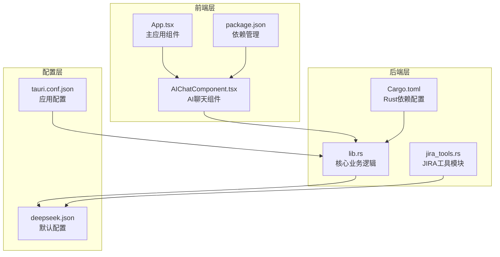
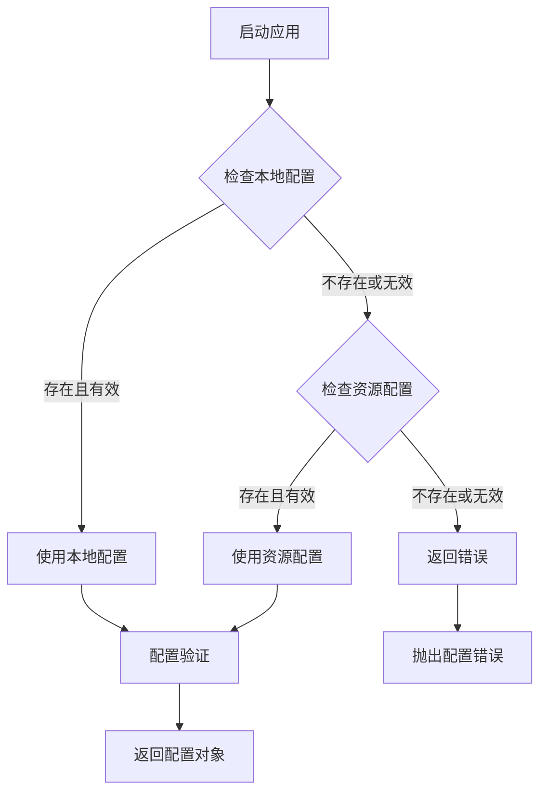
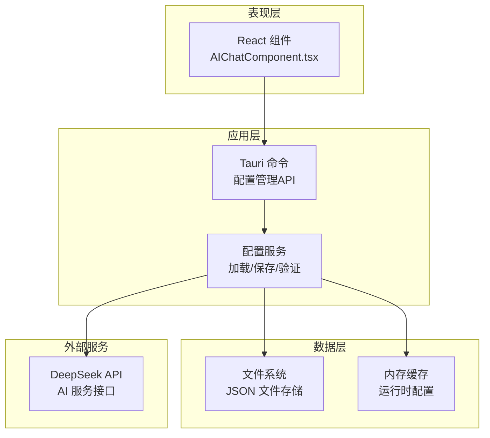
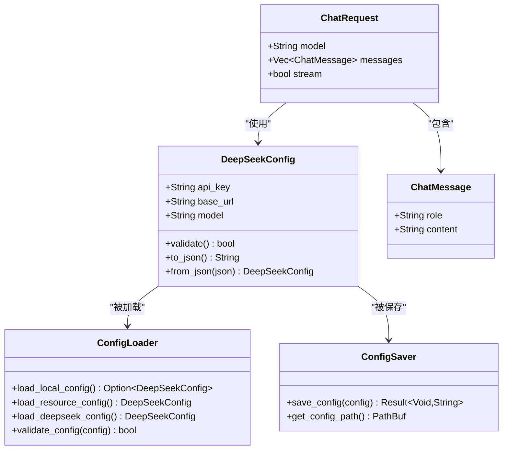
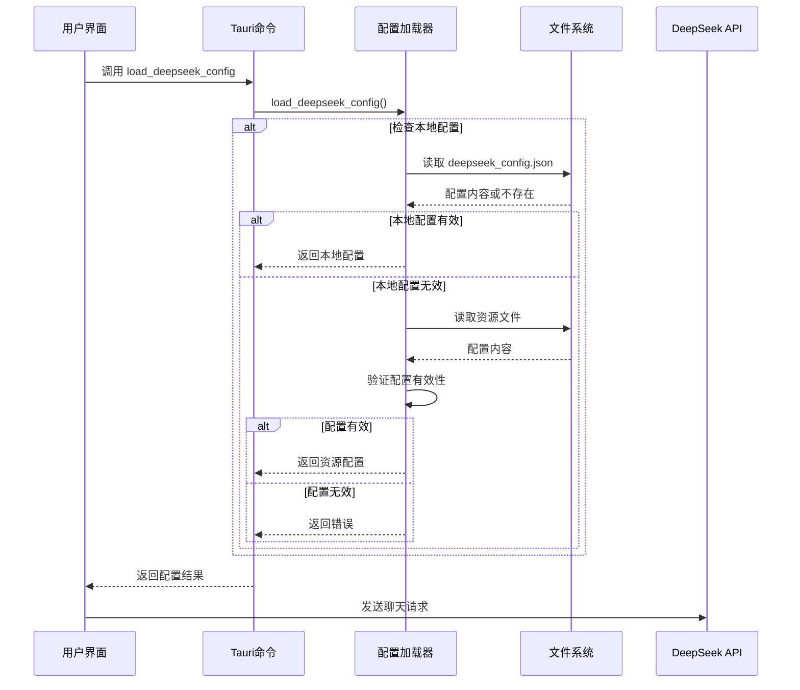
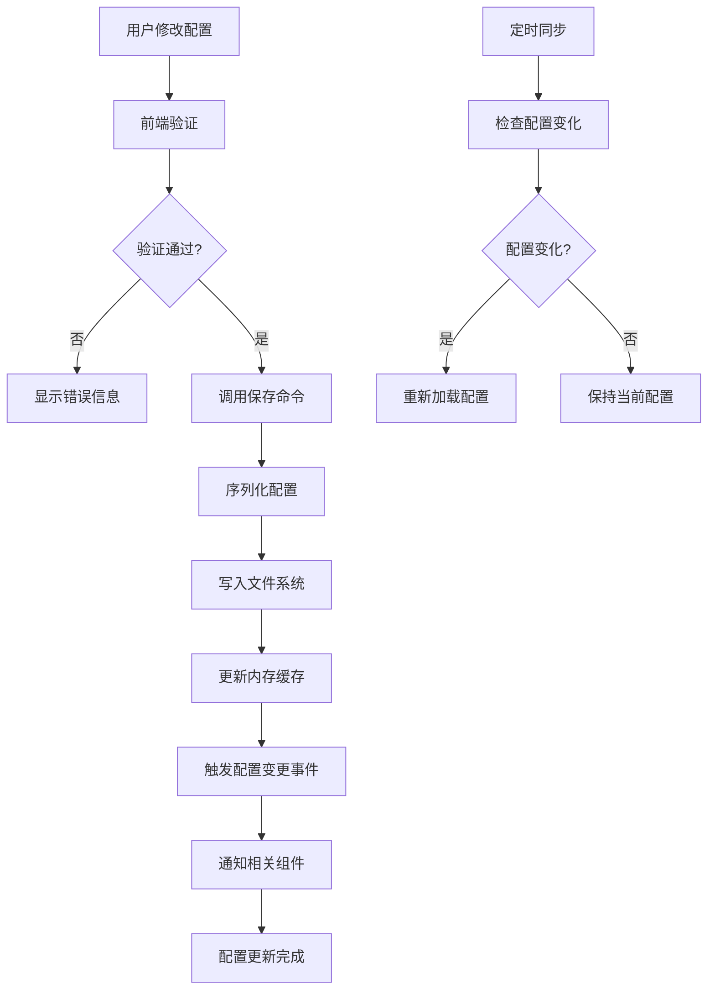

# 动态配置管理系统

<cite>
**本文档引用的文件**
- [deepseek.json](file://src-tauri/config/deepseek.json)
- [lib.rs](file://src-tauri/src/lib.rs)
- [AIChatComponent.tsx](file://src/components/AIChatComponent.tsx)
- [Cargo.toml](file://src-tauri/Cargo.toml)
- [tauri.conf.json](file://src-tauri/tauri.conf.json)
- [jira_tools.rs](file://src-tauri/src/jira_tools.rs)
- [App.tsx](file://src/App.tsx)
- [package.json](file://package.json)
</cite>

## 目录
1. [简介](#简介)
2. [项目结构](#项目结构)
3. [核心组件](#核心组件)
4. [架构概览](#架构概览)
5. [详细组件分析](#详细组件分析)
6. [依赖关系分析](#依赖关系分析)
7. [性能考虑](#性能考虑)
8. [故障排除指南](#故障排除指南)
9. [结论](#结论)

## 简介

动态配置管理系统是 xsun_desktop_pet 桌面宠物应用的核心基础设施，负责管理 DeepSeek AI 服务的配置参数。该系统提供了完整的配置生命周期管理，包括配置加载、验证、更新和持久化存储功能。

系统采用前后端分离的架构设计，前端使用 React 构建用户界面，后端基于 Tauri 框架提供系统级功能。配置管理支持多种数据源，包括本地文件存储、资源文件嵌入和运行时动态更新。

## 项目结构

项目采用模块化的文件组织方式，配置相关的文件主要分布在以下位置：



**图表来源**
- [lib.rs:1-1113](file://src-tauri/src/lib.rs#L1-L1113)
- [AIChatComponent.tsx:1-371](file://src/components/AIChatComponent.tsx#L1-L371)
- [deepseek.json:1-6](file://src-tauri/config/deepseek.json#L1-L6)

**章节来源**
- [lib.rs:1-1113](file://src-tauri/src/lib.rs#L1-L1113)
- [AIChatComponent.tsx:1-371](file://src/components/AIChatComponent.tsx#L1-L371)
- [deepseek.json:1-6](file://src-tauri/config/deepseek.json#L1-L6)

## 核心组件

### DeepSeek 配置结构

系统定义了完整的 DeepSeek 配置数据模型，包含以下核心字段：

| 字段名 | 类型 | 必填 | 默认值 | 描述 |
|--------|------|------|--------|------|
| apiKey | String | 是 | "" | API 密钥，用于身份验证 |
| baseUrl | String | 否 | "https://api.deepseek.com/v1" | API 基础地址 |
| model | String | 否 | "deepseek-chat" | AI 模型名称 |

### 配置加载机制

系统实现了智能的配置加载策略，支持多级优先级：



**图表来源**
- [lib.rs:351-379](file://src-tauri/src/lib.rs#L351-L379)

### 配置持久化

配置数据采用 JSON 格式存储在应用数据目录中，路径格式为 `{app_data_dir}/deepseek_config.json`。

**章节来源**
- [lib.rs:220-228](file://src-tauri/src/lib.rs#L220-L228)
- [lib.rs:295-308](file://src-tauri/src/lib.rs#L295-L308)
- [lib.rs:311-323](file://src-tauri/src/lib.rs#L311-L323)

## 架构概览

系统采用分层架构设计，确保配置管理的独立性和可维护性：



**图表来源**
- [lib.rs:255-294](file://src-tauri/src/lib.rs#L255-L294)
- [AIChatComponent.tsx:55-68](file://src/components/AIChatComponent.tsx#L55-L68)

## 详细组件分析

### 配置数据模型

系统定义了完整的配置数据结构，支持类型安全的配置管理：



**图表来源**
- [lib.rs:220-250](file://src-tauri/src/lib.rs#L220-L250)
- [lib.rs:255-294](file://src-tauri/src/lib.rs#L255-L294)

### 配置加载流程

配置加载过程实现了智能的优先级策略，确保应用能够正确获取有效的配置：



**图表来源**
- [lib.rs:351-379](file://src-tauri/src/lib.rs#L351-L379)
- [AIChatComponent.tsx:55-68](file://src/components/AIChatComponent.tsx#L55-L68)

### 配置验证机制

系统实现了多层次的配置验证，确保配置的有效性和安全性：

| 验证级别 | 验证内容 | 错误处理 |
|----------|----------|----------|
| 基础格式验证 | JSON 结构完整性 | 解析错误 |
| 必填字段验证 | apiKey、baseUrl、model | 配置缺失 |
| 有效性验证 | API Key 格式、URL 有效性 | 配置无效 |
| 连接测试 | API 可访问性 | 服务不可达 |

**章节来源**
- [lib.rs:351-379](file://src-tauri/src/lib.rs#L351-L379)
- [AIChatComponent.tsx:173-189](file://src/components/AIChatComponent.tsx#L173-L189)

### 配置更新流程

配置更新支持实时生效，无需重启应用：



**图表来源**
- [AIChatComponent.tsx:70-82](file://src/components/AIChatComponent.tsx#L70-L82)
- [lib.rs:311-323](file://src-tauri/src/lib.rs#L311-L323)

**章节来源**
- [AIChatComponent.tsx:70-82](file://src/components/AIChatComponent.tsx#L70-L82)
- [lib.rs:311-323](file://src-tauri/src/lib.rs#L311-L323)

## 依赖关系分析

系统依赖关系清晰明确，各模块职责分离：

```mermaid
graph TB
subgraph "前端依赖"
REACT[React ^19.1.0]
TAURI_API[@tauri-apps/api ~2.8.0]
TAURI_FS[@tauri-apps/plugin-fs ~2.4.0]
end
subgraph "后端依赖"
Tauri[tauri = "2"]
Serde[serde = "1"]
Reqwest[reqwest = "0.12"]
Tokio[tokio = "1"]
Sysinfo[sysinfo = "0.30"]
end
subgraph "AI服务"
DeepSeek[DeepSeek API]
end
REACT --> TAURI_API
TAURI_API --> Tauri
Tauri --> Serde
Tauri --> Reqwest
Tauri --> Tokio
Reqwest --> DeepSeek
```

**图表来源**
- [package.json:12-28](file://package.json#L12-L28)
- [Cargo.toml:15-44](file://src-tauri/Cargo.toml#L15-L44)

**章节来源**
- [package.json:12-28](file://package.json#L12-L28)
- [Cargo.toml:15-44](file://src-tauri/Cargo.toml#L15-L44)

## 性能考虑

系统在配置管理方面采用了多项性能优化措施：

### 异步I/O操作
- 使用 tokio 异步文件系统 API 进行配置读写
- 避免阻塞主线程，提升用户体验
- 支持并发配置操作

### 内存缓存策略
- 配置数据在内存中缓存，减少重复读取
- 智能缓存失效机制，确保数据一致性
- 支持配置热更新而不影响性能

### 错误处理优化
- 非阻塞的配置验证机制
- 优雅的降级策略，避免单点故障
- 完善的错误恢复机制

## 故障排除指南

### 常见配置错误

| 错误类型 | 症状 | 解决方案 |
|----------|------|----------|
| API Key 无效 | "请配置有效的API Key" | 检查 DeepSeek 控制台中的密钥 |
| 配置文件损坏 | JSON 解析错误 | 删除配置文件，重新配置 |
| 权限不足 | 文件写入失败 | 检查应用数据目录权限 |
| 网络连接失败 | API 请求超时 | 检查网络连接和代理设置 |

### 调试步骤

1. **检查配置文件路径**
   - Windows: `%APPDATA%\xsun_desktop_pet\deepseek_config.json`
   - macOS: `$HOME/Library/Application Support/xsun_desktop_pet/deepseek_config.json`
   - Linux: `$HOME/.local/share/xsun_desktop_pet/deepseek_config.json`

2. **验证配置格式**
   ```json
   {
     "apiKey": "sk-xxxxxxxxxxxxxxxxxxxxxxxxxxxxxxxx",
     "baseUrl": "https://api.deepseek.com/v1",
     "model": "deepseek-chat"
   }
   ```

3. **查看应用日志**
   - 启用调试模式
   - 检查控制台输出
   - 查看网络请求状态

**章节来源**
- [lib.rs:351-379](file://src-tauri/src/lib.rs#L351-L379)
- [AIChatComponent.tsx:173-189](file://src/components/AIChatComponent.tsx#L173-L189)

## 结论

动态配置管理系统为 xsun_desktop_pet 提供了强大而灵活的配置管理能力。系统通过合理的架构设计、完善的错误处理机制和优秀的性能优化，确保了配置管理的可靠性、安全性和易用性。

主要特点包括：
- **多源配置支持**：本地文件、资源文件、运行时配置的统一管理
- **智能验证机制**：多层次的配置验证确保数据完整性
- **热更新支持**：配置变更实时生效，无需重启应用
- **安全存储策略**：敏感信息的安全存储和访问控制
- **完善的错误处理**：全面的异常捕获和恢复机制

该系统为后续的功能扩展奠定了良好的基础，支持新增配置项、自定义验证器和回调函数等高级特性。