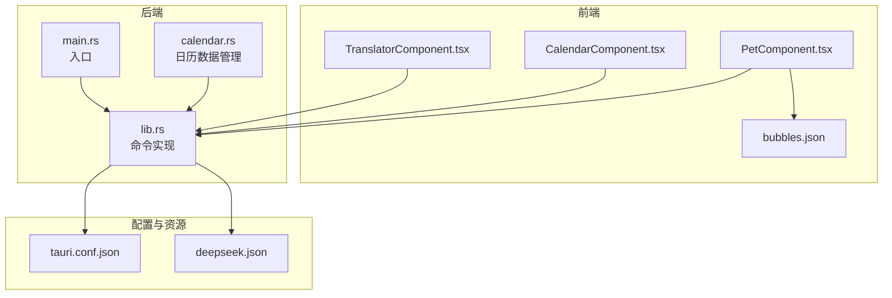
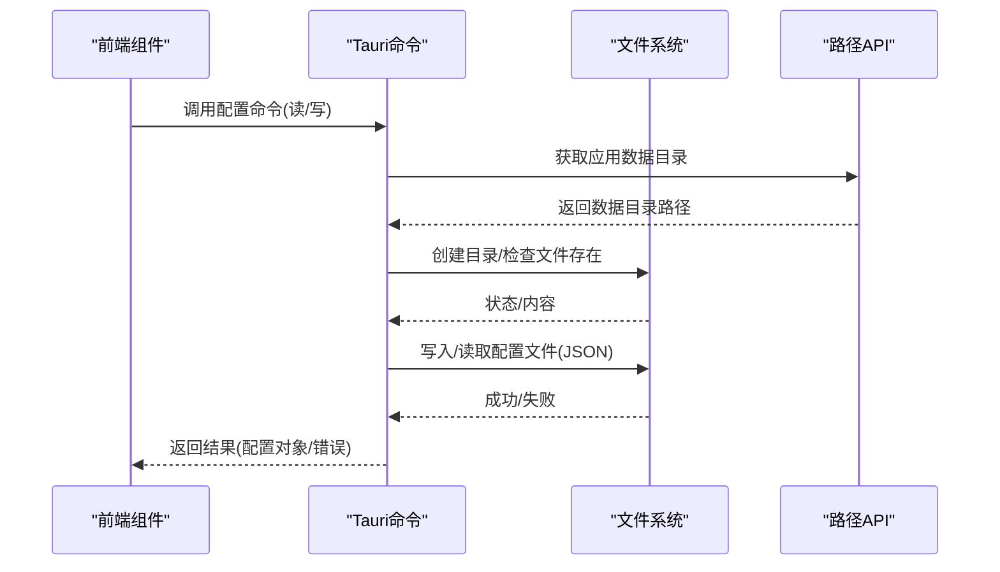
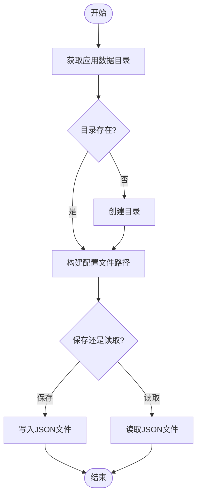
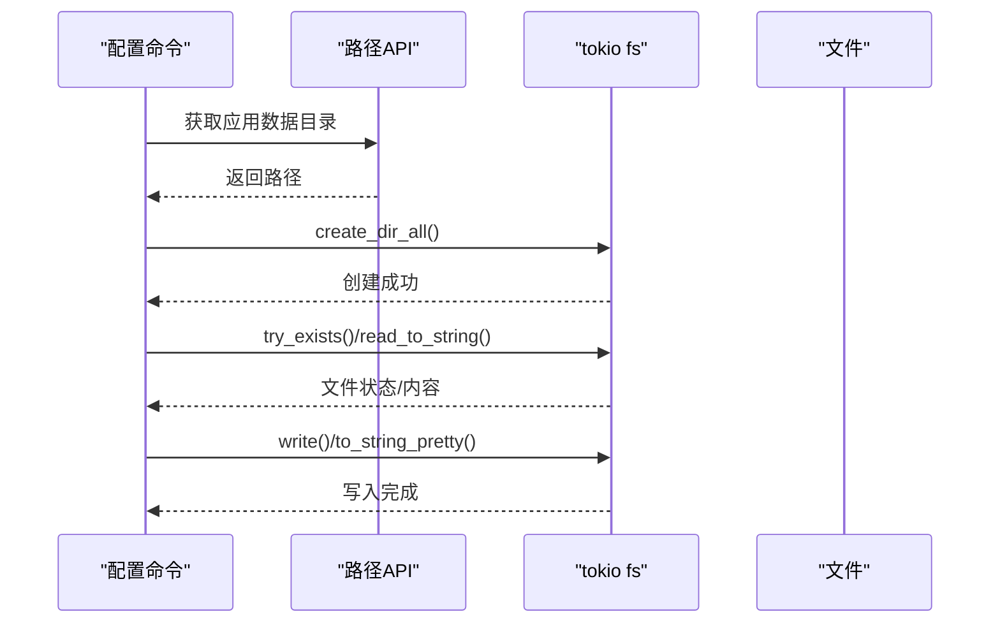
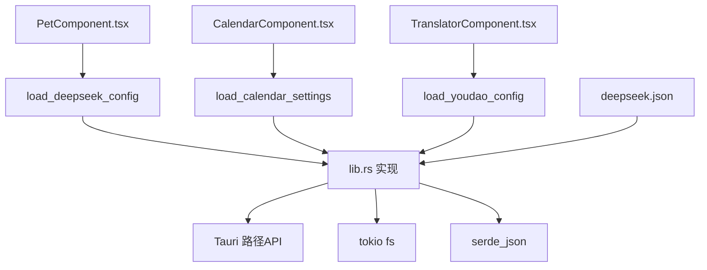

# 配置存储策略

<cite>
**本文档引用的文件**
- [package.json](file://package.json)
- [tauri.conf.json](file://src-tauri/tauri.conf.json)
- [tauri.conf.dev.json](file://src-tauri/tauri.conf.dev.json)
- [lib.rs](file://src-tauri/src/lib.rs)
- [main.rs](file://src-tauri/src/main.rs)
- [deepseek.json](file://src-tauri/config/deepseek.json)
- [bubbles.json](file://public/config/bubbles.json)
- [PetComponent.tsx](file://src/components/PetComponent.tsx)
- [CalendarComponent.tsx](file://src/components/CalendarComponent.tsx)
- [TranslatorComponent.tsx](file://src/components/TranslatorComponent.tsx)
- [calendar.rs](file://src-tauri/src/calendar.rs)
</cite>

## 目录
1. [简介](#简介)
2. [项目结构](#项目结构)
3. [核心组件](#核心组件)
4. [架构总览](#架构总览)
5. [详细组件分析](#详细组件分析)
6. [依赖关系分析](#依赖关系分析)
7. [性能考虑](#性能考虑)
8. [故障排除指南](#故障排除指南)
9. [结论](#结论)
10. [附录](#附录)

## 简介
本文件系统性梳理本项目的配置存储策略，涵盖配置文件的存储位置与命名规范、跨平台兼容性、持久化机制、版本管理、备份与恢复、加密与安全、性能优化以及故障恢复与数据完整性保障。通过对 Rust 后端与前端组件的协同实现进行深入分析，帮助开发者与运维人员建立一致的配置管理实践。

## 项目结构
项目采用 Tauri + React 的桌面应用架构，配置相关的关键位置如下：
- 应用配置与资源打包：Tauri 配置文件定义了资源打包规则，将配置目录纳入安装包。
- 用户数据目录：Rust 后端通过 Tauri 路径 API 获取应用数据目录，用于存放用户配置与数据。
- 前端静态配置：公共配置文件以 JSON 形式放置于 public 目录，供前端直接读取。
- 组件化配置：前端组件通过 Tauri 命令调用后端实现配置的读写。

**图表来源**
- [PetComponent.tsx](file://src/components/PetComponent.tsx)
- [CalendarComponent.tsx](file://src/components/CalendarComponent.tsx)
- [TranslatorComponent.tsx](file://src/components/TranslatorComponent.tsx)
- [lib.rs](file://src-tauri/src/lib.rs)
- [calendar.rs](file://src-tauri/src/calendar.rs)
- [tauri.conf.json](file://src-tauri/tauri.conf.json)
- [deepseek.json](file://src-tauri/config/deepseek.json)

**章节来源**
- [tauri.conf.json:54-56](file://src-tauri/tauri.conf.json#L54-L56)
- [package.json:12-18](file://package.json#L12-L18)

## 核心组件
本项目涉及以下与配置存储密切相关的组件：
- 配置加载与保存命令：后端提供统一的配置读写接口，前端通过 Tauri 命令调用。
- 用户数据目录：通过 Tauri 路径 API 获取应用数据目录，确保跨平台一致性。
- 静态配置文件：公共目录中的 JSON 文件作为默认配置或静态资源。
- 数据文件：如待办清单、日历设置、背景图等用户数据文件。

**章节来源**
- [lib.rs:303-386](file://src-tauri/src/lib.rs#L303-L386)
- [lib.rs:428-476](file://src-tauri/src/lib.rs#L428-L476)
- [lib.rs:578-725](file://src-tauri/src/lib.rs#L578-L725)
- [lib.rs:728-768](file://src-tauri/src/lib.rs#L728-L768)
- [bubbles.json:1-52](file://public/config/bubbles.json#L1-L52)

## 架构总览
配置存储的整体流程如下：
- 前端组件发起配置请求（读取或保存）。
- Tauri 命令在后端执行具体逻辑：解析路径、读取/写入文件、序列化/反序列化。
- 对于用户数据，统一写入应用数据目录；对于静态配置，从资源目录读取。
- 前端接收结果并更新界面状态。

**图表来源**
- [lib.rs:303-386](file://src-tauri/src/lib.rs#L303-L386)
- [lib.rs:428-476](file://src-tauri/src/lib.rs#L428-L476)
- [lib.rs:578-725](file://src-tauri/src/lib.rs#L578-L725)

## 详细组件分析

### 配置存储与路径解析
- 应用数据目录：后端通过 Tauri 路径 API 获取应用数据目录，并在首次使用前创建目录。
- 配置文件命名：不同功能模块使用独立的配置文件名，如 DeepSeek 配置、有道翻译配置、日历设置、待办清单等。
- 资源配置：静态配置文件位于资源目录，打包进安装包，便于默认配置分发。

**图表来源**
- [lib.rs:303-315](file://src-tauri/src/lib.rs#L303-L315)
- [lib.rs:318-355](file://src-tauri/src/lib.rs#L318-L355)
- [lib.rs:465-476](file://src-tauri/src/lib.rs#L465-L476)
- [lib.rs:679-725](file://src-tauri/src/lib.rs#L679-L725)

**章节来源**
- [lib.rs:303-386](file://src-tauri/src/lib.rs#L303-L386)
- [lib.rs:465-476](file://src-tauri/src/lib.rs#L465-L476)
- [lib.rs:679-725](file://src-tauri/src/lib.rs#L679-L725)
- [tauri.conf.json:54-56](file://src-tauri/tauri.conf.json#L54-L56)

### 持久化机制与并发控制
- 异步文件操作：使用 tokio 的异步文件系统 API 进行读写，避免阻塞主线程。
- 目录创建与存在性检查：在写入前确保目录存在，并对文件存在性进行检查。
- 并发控制：当前实现未显式加锁，建议在多线程/多窗口场景下引入文件锁或原子写入策略，防止竞态条件。

**图表来源**
- [lib.rs:318-355](file://src-tauri/src/lib.rs#L318-L355)
- [lib.rs:428-476](file://src-tauri/src/lib.rs#L428-L476)
- [lib.rs:602-638](file://src-tauri/src/lib.rs#L602-L638)

**章节来源**
- [lib.rs:318-355](file://src-tauri/src/lib.rs#L318-L355)
- [lib.rs:428-476](file://src-tauri/src/lib.rs#L428-L476)
- [lib.rs:602-638](file://src-tauri/src/lib.rs#L602-L638)

### 版本管理与迁移策略
- 当前实现未发现显式的配置版本字段与迁移逻辑。
- 建议在配置根对象中加入版本号字段，后续通过版本比较执行迁移脚本，保证向后兼容与降级处理。

**章节来源**
- [lib.rs:228-235](file://src-tauri/src/lib.rs#L228-L235)
- [lib.rs:389-396](file://src-tauri/src/lib.rs#L389-L396)

### 备份与恢复机制
- 自动备份：当前未实现自动备份功能。
- 手动导出/恢复：建议在前端增加导出/导入功能，将配置序列化为 JSON 文件，支持批量恢复。
- 数据文件：待办清单与日历设置可作为独立 JSON 文件进行备份。

**章节来源**
- [lib.rs:602-638](file://src-tauri/src/lib.rs#L602-L638)
- [lib.rs:679-725](file://src-tauri/src/lib.rs#L679-L725)

### 加密存储与安全
- 敏感信息保护：当前 API Key 等敏感信息以明文存储于 JSON 文件中，存在泄露风险。
- 建议：采用平台安全存储（如 Windows Credential Manager、macOS Keychain、Linux Secret-tool）或对称加密存储，配合访问权限控制与安全审计。

**章节来源**
- [deepseek.json:1-6](file://src-tauri/config/deepseek.json#L1-L6)
- [lib.rs:228-235](file://src-tauri/src/lib.rs#L228-L235)

### 性能优化
- 缓存策略：前端可缓存已加载的配置对象，减少重复命令调用。
- 懒加载：仅在需要时才触发配置读取，避免启动时大量 IO。
- 增量更新：对大型配置文件采用增量写入，减少磁盘占用与写放大。

**章节来源**
- [PetComponent.tsx:32-34](file://src/components/PetComponent.tsx#L32-L34)
- [CalendarComponent.tsx:63-71](file://src/components/CalendarComponent.tsx#L63-L71)
- [TranslatorComponent.tsx:95-109](file://src/components/TranslatorComponent.tsx#L95-L109)

### 故障恢复与数据完整性
- 错误处理：命令实现中对文件操作失败进行错误封装与返回。
- 数据完整性：建议在写入前进行校验与原子替换，防止部分写入导致的数据损坏。

**章节来源**
- [lib.rs:318-355](file://src-tauri/src/lib.rs#L318-L355)
- [lib.rs:428-476](file://src-tauri/src/lib.rs#L428-L476)

## 依赖关系分析
前后端配置相关依赖关系如下：

**图表来源**
- [PetComponent.tsx:1-20](file://src/components/PetComponent.tsx#L1-L20)
- [CalendarComponent.tsx:1-20](file://src/components/CalendarComponent.tsx#L1-L20)
- [TranslatorComponent.tsx:1-20](file://src/components/TranslatorComponent.tsx#L1-L20)
- [lib.rs:358-386](file://src-tauri/src/lib.rs#L358-L386)
- [lib.rs:701-725](file://src-tauri/src/lib.rs#L701-L725)
- [lib.rs:443-462](file://src-tauri/src/lib.rs#L443-L462)
- [deepseek.json:1-6](file://src-tauri/config/deepseek.json#L1-L6)

**章节来源**
- [PetComponent.tsx:1-20](file://src/components/PetComponent.tsx#L1-L20)
- [CalendarComponent.tsx:1-20](file://src/components/CalendarComponent.tsx#L1-L20)
- [TranslatorComponent.tsx:1-20](file://src/components/TranslatorComponent.tsx#L1-L20)
- [lib.rs:358-386](file://src-tauri/src/lib.rs#L358-L386)
- [lib.rs:701-725](file://src-tauri/src/lib.rs#L701-L725)
- [lib.rs:443-462](file://src-tauri/src/lib.rs#L443-L462)

## 性能考虑
- 异步 I/O：使用 tokio 的异步文件系统 API，避免阻塞 UI 线程。
- 目录预创建：在首次写入前确保目录存在，减少运行时错误与重试成本。
- JSON 序列化：使用格式化输出，便于人工审阅与调试。
- 前端缓存：对频繁读取的配置进行内存缓存，降低命令调用频率。

**章节来源**
- [lib.rs:318-355](file://src-tauri/src/lib.rs#L318-L355)
- [lib.rs:701-725](file://src-tauri/src/lib.rs#L701-L725)
- [PetComponent.tsx:32-34](file://src/components/PetComponent.tsx#L32-L34)

## 故障排除指南
- 配置读取失败：检查应用数据目录是否存在、文件权限是否正确、JSON 格式是否有效。
- 配置保存失败：确认目录可写、磁盘空间充足、无并发写入冲突。
- 资源配置缺失：确认打包配置是否包含所需资源文件，安装包是否完整。

**章节来源**
- [lib.rs:358-386](file://src-tauri/src/lib.rs#L358-L386)
- [lib.rs:701-725](file://src-tauri/src/lib.rs#L701-L725)
- [tauri.conf.json:54-56](file://src-tauri/tauri.conf.json#L54-L56)

## 结论
本项目已具备较为完善的配置存储基础：统一的应用数据目录、清晰的配置文件命名、异步文件操作与基本的错误处理。为进一步提升安全性、可维护性与用户体验，建议补充版本管理、自动备份、加密存储与并发控制等机制。

## 附录
- 存储位置与命名规范
  - 用户数据目录：由 Tauri 路径 API 提供，跨平台兼容。
  - 配置文件命名：按功能模块区分，如 deepseek_config.json、youdao_config.json、calendar_settings.json、todos.json 等。
  - 资源文件：打包于安装包内，便于默认配置分发。
- 跨平台兼容性
  - Tauri 路径 API 会根据操作系统返回合适的用户数据目录。
  - 文件路径拼接使用 PathBuf，避免硬编码分隔符。
- 安全与合规
  - 建议对敏感配置进行加密存储与访问控制，定期进行安全审计。