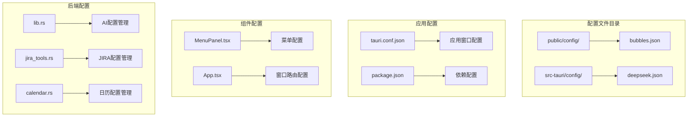
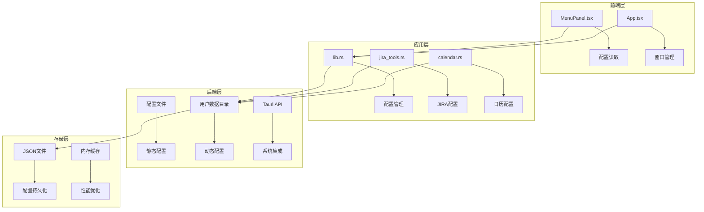
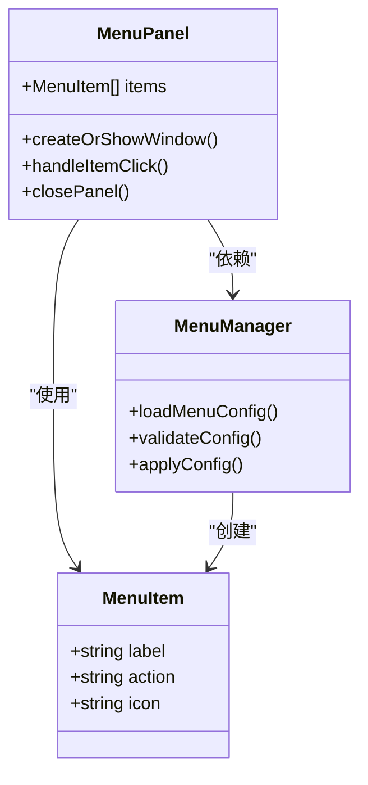
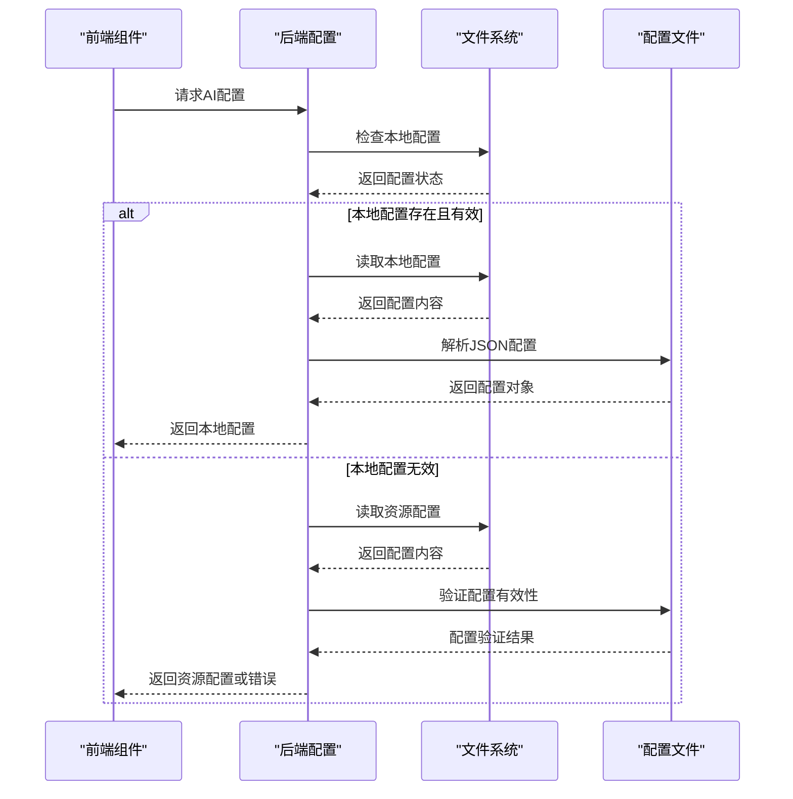
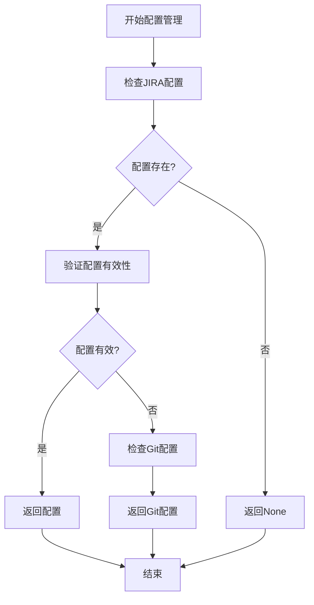
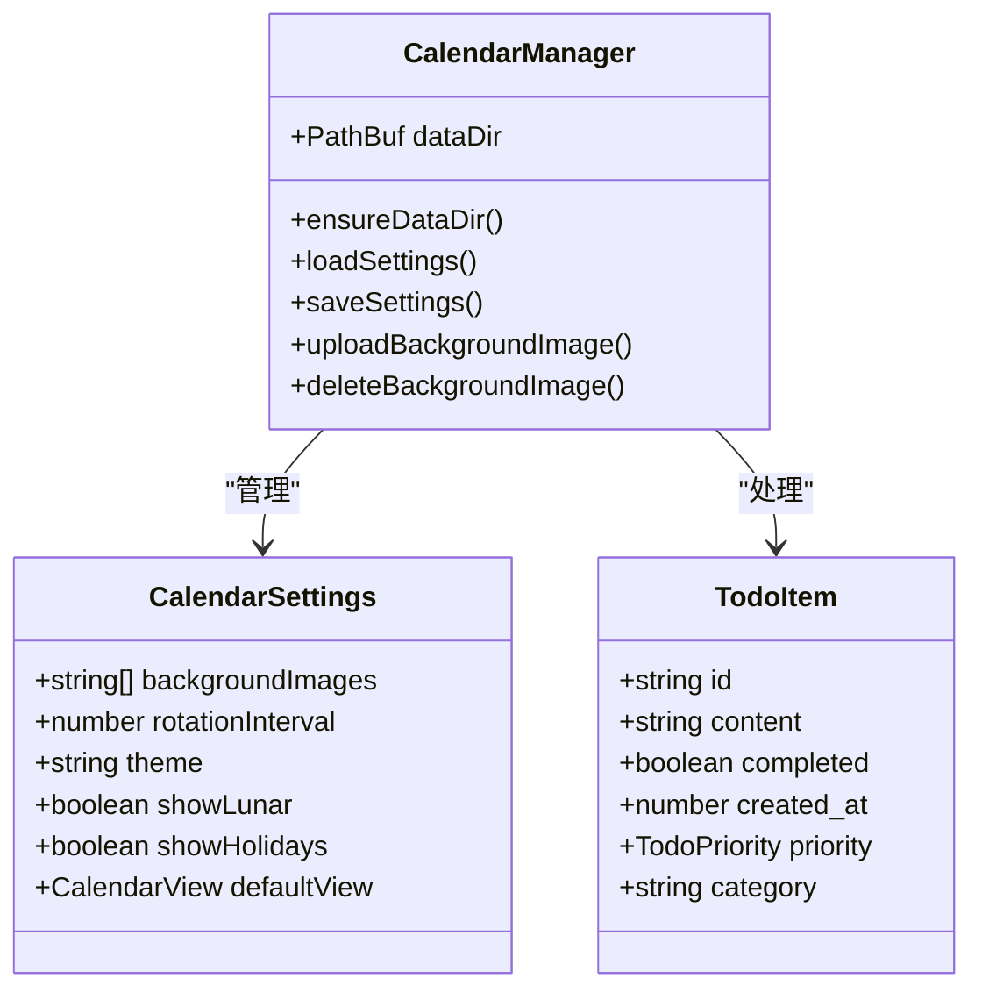
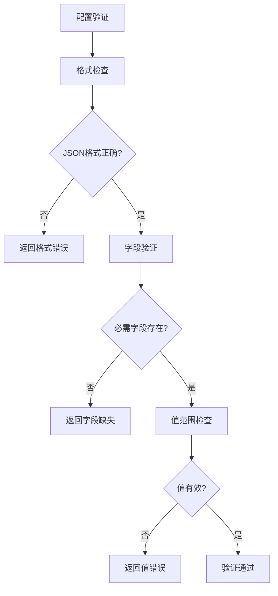

# 配置管理系统

<cite>
**本文档中引用的文件**
- [bubbles.json](file://public/config/bubbles.json)
- [deepseek.json](file://src-tauri/config/deepseek.json)
- [tauri.conf.json](file://src-tauri/tauri.conf.json)
- [package.json](file://package.json)
- [App.tsx](file://src/App.tsx)
- [main.tsx](file://src/main.tsx)
- [main.rs](file://src-tauri/src/main.rs)
- [lib.rs](file://src-tauri/src/lib.rs)
- [jira_tools.rs](file://src-tauri/src/jira_tools.rs)
- [calendar.rs](file://src-tauri/src/calendar.rs)
- [MenuPanel.tsx](file://src/components/MenuPanel.tsx)
</cite>

## 目录
1. [简介](#简介)
2. [项目结构](#项目结构)
3. [核心组件](#核心组件)
4. [架构概览](#架构概览)
5. [详细组件分析](#详细组件分析)
6. [依赖关系分析](#依赖关系分析)
7. [性能考虑](#性能考虑)
8. [故障排除指南](#故障排除指南)
9. [结论](#结论)
10. [附录](#附录)

## 简介

配置管理系统是 xsun_desktop_pet 桌面宠物应用的核心基础设施，负责管理应用的各种配置需求。该系统采用混合配置策略，结合静态配置文件和动态配置存储，为用户提供灵活且安全的配置管理体验。

系统支持多种类型的配置：
- **静态配置**：通过 JSON 文件提供的基础配置
- **动态配置**：运行时生成和修改的用户特定配置
- **环境配置**：基于用户数据目录的个性化设置

## 项目结构

配置管理系统主要分布在以下目录结构中：



**图表来源**
- [bubbles.json:1-52](file://public/config/bubbles.json#L1-L52)
- [deepseek.json:1-6](file://src-tauri/config/deepseek.json#L1-L6)
- [tauri.conf.json:1-74](file://src-tauri/tauri.conf.json#L1-L74)

**章节来源**
- [bubbles.json:1-52](file://public/config/bubbles.json#L1-L52)
- [deepseek.json:1-6](file://src-tauri/config/deepseek.json#L1-L6)
- [tauri.conf.json:1-74](file://src-tauri/tauri.conf.json#L1-L74)

## 核心组件

### 静态配置组件

静态配置文件采用 JSON 格式，提供应用的基础功能配置：

#### 菜单配置 (bubbles.json)
菜单配置文件定义了桌面宠物应用的功能菜单项，每个菜单项包含以下属性：
- `label`: 菜单项显示名称
- `action`: 动作标识符，用于触发相应功能
- `icon`: 图标路径

#### AI 配置 (deepseek.json)
AI 配置文件管理 AI 服务的连接参数：
- `apiKey`: API 密钥
- `baseUrl`: API 基础 URL
- `model`: 使用的模型名称

### 动态配置组件

动态配置通过 Rust 后端实现，支持用户数据目录中的配置存储：

#### 配置存储机制
- **用户数据目录**: 使用 Tauri 的 `app_data_dir()` 获取平台特定的用户数据目录
- **文件命名**: 采用 `config_name.json` 的命名模式
- **版本管理**: 支持本地配置覆盖资源配置

**章节来源**
- [lib.rs:188-271](file://src-tauri/src/lib.rs#L188-L271)
- [jira_tools.rs:66-115](file://src-tauri/src/jira_tools.rs#L66-L115)
- [calendar.rs:188-218](file://src-tauri/src/calendar.rs#L188-L218)

## 架构概览

配置管理系统采用分层架构设计，确保配置的灵活性和安全性：



**图表来源**
- [MenuPanel.tsx:1-295](file://src/components/MenuPanel.tsx#L1-L295)
- [lib.rs:1-800](file://src-tauri/src/lib.rs#L1-L800)
- [jira_tools.rs:1-800](file://src-tauri/src/jira_tools.rs#L1-L800)

## 详细组件分析

### 菜单配置系统

菜单配置系统通过 `bubbles.json` 文件提供动态菜单功能：



**图表来源**
- [MenuPanel.tsx:8-295](file://src/components/MenuPanel.tsx#L8-L295)
- [bubbles.json:1-52](file://public/config/bubbles.json#L1-L52)

#### 配置格式规范
菜单配置采用严格的 JSON 格式，每个菜单项必须包含：
- 必需字段：`label` 和 `action`
- 可选字段：`icon`
- 数据类型：字符串类型验证

**章节来源**
- [MenuPanel.tsx:14-295](file://src/components/MenuPanel.tsx#L14-L295)
- [bubbles.json:1-52](file://public/config/bubbles.json#L1-L52)

### AI 配置管理系统

AI 配置系统提供灵活的配置加载和验证机制：



**图表来源**
- [lib.rs:242-271](file://src-tauri/src/lib.rs#L242-L271)
- [deepseek.json:1-6](file://src-tauri/config/deepseek.json#L1-L6)

#### 配置加载流程
1. **优先级检查**: 首先检查本地配置文件
2. **有效性验证**: 验证 API Key 和其他必需参数
3. **回退机制**: 如果本地配置无效，使用资源配置
4. **错误处理**: 提供清晰的错误信息

**章节来源**
- [lib.rs:202-240](file://src-tauri/src/lib.rs#L202-L240)
- [lib.rs:242-271](file://src-tauri/src/lib.rs#L242-L271)

### JIRA 配置管理

JIRA 配置系统支持多仓库管理和认证配置：



**图表来源**
- [jira_tools.rs:96-115](file://src-tauri/src/jira_tools.rs#L96-L115)
- [jira_tools.rs:147-166](file://src-tauri/src/jira_tools.rs#L147-L166)

**章节来源**
- [jira_tools.rs:42-65](file://src-tauri/src/jira_tools.rs#L42-L65)
- [jira_tools.rs:96-166](file://src-tauri/src/jira_tools.rs#L96-L166)

### 日历配置系统

日历配置系统提供完整的设置管理和数据持久化：



**图表来源**
- [calendar.rs:42-71](file://src-tauri/src/calendar.rs#L42-L71)
- [calendar.rs:83-218](file://src-tauri/src/calendar.rs#L83-L218)

**章节来源**
- [calendar.rs:188-218](file://src-tauri/src/calendar.rs#L188-L218)
- [calendar.rs:205-218](file://src-tauri/src/calendar.rs#L205-L218)

## 依赖关系分析

配置管理系统涉及多个模块间的复杂依赖关系：

```mermaid
graph TB
subgraph "配置文件依赖"
A[bubbles.json] --> B[MenuPanel.tsx]
C[deepseek.json] --> D[lib.rs]
E[tauri.conf.json] --> F[main.rs]
end
subgraph "模块间依赖"
G[lib.rs] --> H[jira_tools.rs]
G --> I[calendar.rs]
J[MenuPanel.tsx] --> K[App.tsx]
L[App.tsx] --> M[各功能组件]
end
subgraph "外部依赖"
N[@tauri-apps/api] --> O[配置API]
P[reqwest] --> Q[HTTP请求]
R[serde_json] --> S[JSON处理]
end
B --> G
D --> G
F --> G
H --> G
I --> G
K --> L
M --> L
O --> G
Q --> G
S --> G
```

**图表来源**
- [MenuPanel.tsx:1-295](file://src/components/MenuPanel.tsx#L1-L295)
- [lib.rs:1-800](file://src-tauri/src/lib.rs#L1-L800)
- [jira_tools.rs:1-800](file://src-tauri/src/jira_tools.rs#L1-L800)
- [package.json:12-28](file://package.json#L12-L28)

**章节来源**
- [package.json:12-28](file://package.json#L12-L28)
- [main.rs:1-11](file://src-tauri/src/main.rs#L1-L11)

## 性能考虑

配置管理系统在性能方面采用了多项优化策略：

### 缓存机制
- **内存缓存**: 配置数据在内存中缓存，减少重复读取
- **懒加载**: 配置按需加载，避免启动时的性能开销
- **增量更新**: 支持部分配置更新，提高响应速度

### 异步处理
- **非阻塞IO**: 使用 tokio 异步文件操作
- **并发处理**: 支持多配置文件同时处理
- **超时控制**: 配置操作设置合理的超时时间

### 内存管理
- **数据结构优化**: 使用高效的 JSON 序列化
- **垃圾回收**: 及时释放不再使用的配置数据
- **内存映射**: 大型配置文件使用内存映射技术

## 故障排除指南

### 常见配置问题

#### 配置文件读取失败
**症状**: 应用启动时提示配置文件缺失
**解决方案**:
1. 检查配置文件路径是否正确
2. 验证文件权限设置
3. 确认文件编码格式为 UTF-8

#### 配置格式验证错误
**症状**: 应用运行时报 JSON 格式错误
**解决方案**:
1. 使用在线 JSON 验证工具检查格式
2. 确保所有字符串使用双引号
3. 移除尾随逗号和注释

#### 权限问题
**症状**: 配置文件无法写入用户数据目录
**解决方案**:
1. 检查用户数据目录的写入权限
2. 确认磁盘空间充足
3. 验证防病毒软件未阻止文件写入

### 调试工具

#### 配置验证工具


**图表来源**
- [lib.rs:242-271](file://src-tauri/src/lib.rs#L242-L271)
- [jira_tools.rs:96-115](file://src-tauri/src/jira_tools.rs#L96-L115)

**章节来源**
- [lib.rs:242-271](file://src-tauri/src/lib.rs#L242-L271)
- [jira_tools.rs:96-115](file://src-tauri/src/jira_tools.rs#L96-L115)

## 结论

配置管理系统通过精心设计的架构和实现，为 xsun_desktop_pet 应用提供了强大而灵活的配置管理能力。系统的主要优势包括：

1. **多层配置支持**: 静态配置与动态配置的有机结合
2. **安全的存储机制**: 用户数据目录隔离和权限控制
3. **灵活的加载策略**: 本地配置优先的回退机制
4. **完善的错误处理**: 详细的错误信息和恢复策略

未来可以进一步增强的功能包括：
- 配置版本控制和自动备份
- 实时配置同步和热更新
- 配置模板和批量导入导出
- 配置加密和安全存储

## 附录

### 配置文件格式参考

#### 菜单配置格式
```json
{
  "label": "字符串",
  "action": "字符串",
  "icon": "字符串(可选)"
}
```

#### AI 配置格式
```json
{
  "apiKey": "字符串",
  "baseUrl": "字符串",
  "model": "字符串"
}
```

#### JIRA 配置格式
```json
{
  "jiraUrl": "字符串",
  "username": "字符串",
  "apiToken": "字符串"
}
```

### 最佳实践建议

1. **配置文件组织**: 按功能模块分离配置文件
2. **命名规范**: 使用描述性的文件名和变量名
3. **版本控制**: 为重要配置文件添加版本信息
4. **备份策略**: 定期备份用户配置数据
5. **安全考虑**: 敏感信息使用环境变量或加密存储