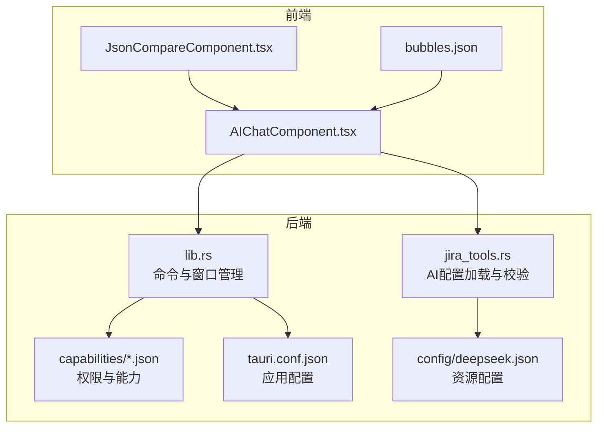
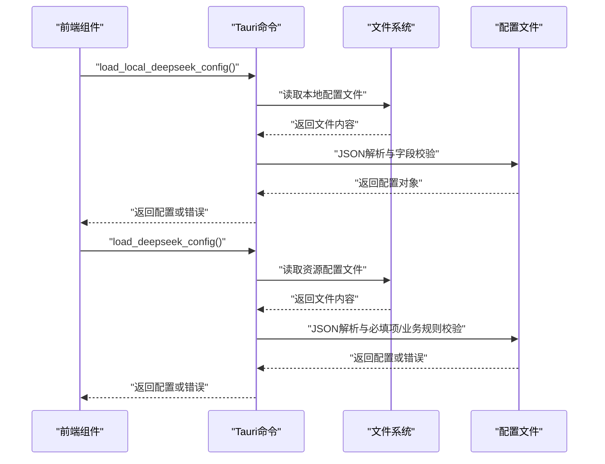
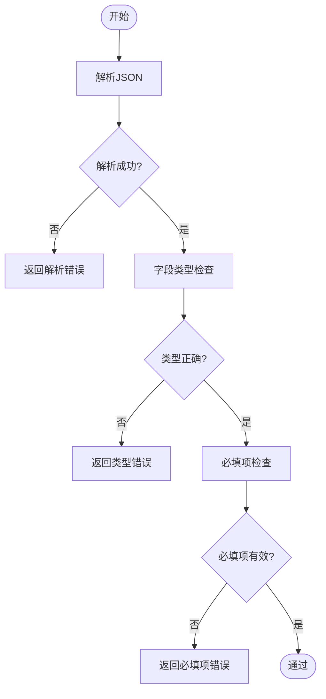
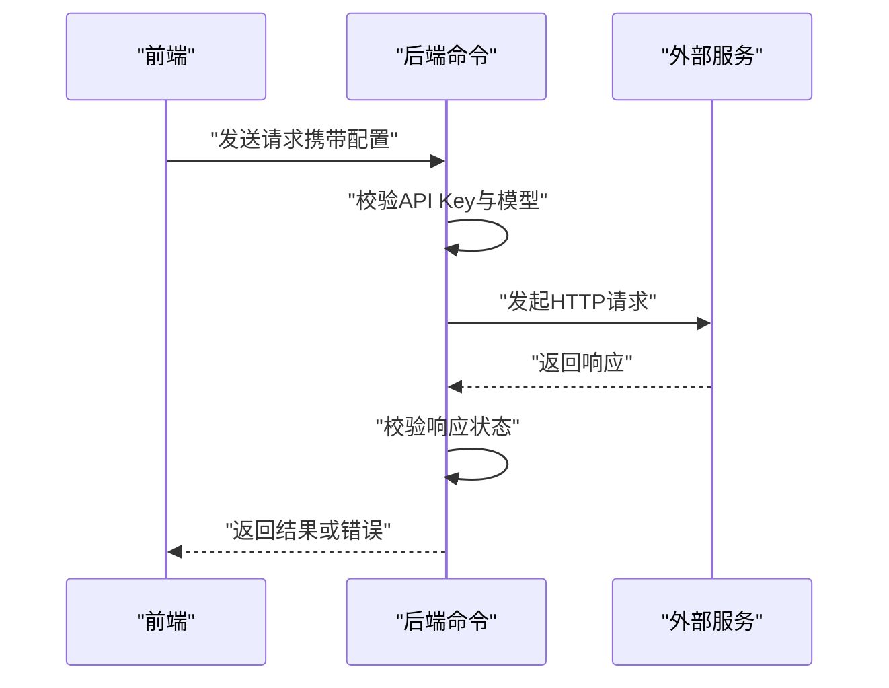
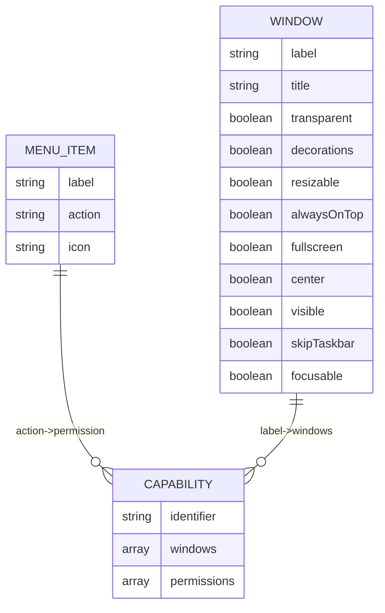
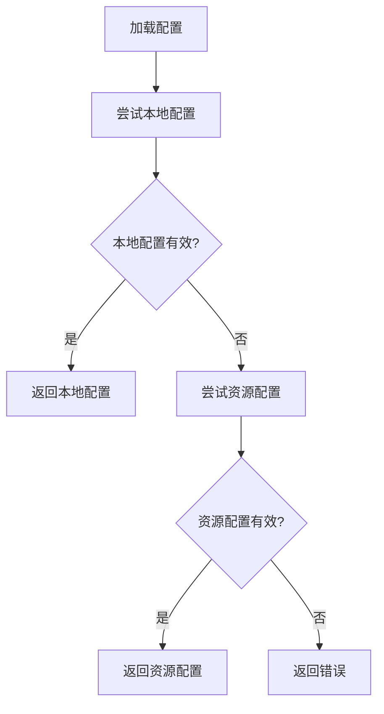
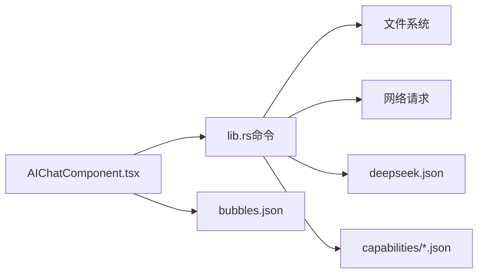

# 配置验证机制

<cite>
**本文档引用的文件**
- [tauri.conf.json](file://src-tauri/tauri.conf.json)
- [tauri.conf.dev.json](file://src-tauri/tauri.conf.dev.json)
- [deepseek.json](file://src-tauri/config/deepseek.json)
- [bubbles.json](file://public/config/bubbles.json)
- [default.json](file://src-tauri/capabilities/default.json)
- [drag.json](file://src-tauri/capabilities/drag.json)
- [main.json](file://src-tauri/capabilities/main.json)
- [window-management.json](file://src-tauri/capabilities/window-management.json)
- [lib.rs](file://src-tauri/src/lib.rs)
- [jira_tools.rs](file://src-tauri/src/jira_tools.rs)
- [AIChatComponent.tsx](file://src/components/AIChatComponent.tsx)
- [JsonCompareComponent.tsx](file://src/components/JsonCompareComponent.tsx)
- [package.json](file://package.json)
</cite>

## 目录
1. [引言](#引言)
2. [项目结构](#项目结构)
3. [核心组件](#核心组件)
4. [架构总览](#架构总览)
5. [详细组件分析](#详细组件分析)
6. [依赖关系分析](#依赖关系分析)
7. [性能考虑](#性能考虑)
8. [故障排除指南](#故障排除指南)
9. [结论](#结论)
10. [附录](#附录)

## 引言
本文件系统性阐述本项目的配置验证机制，覆盖配置文件的格式验证、字段类型与必填项校验、有效性范围与格式匹配、业务规则校验、冲突检测（重复项、依赖关系、循环引用）、加载失败的错误处理策略、扩展方法（自定义验证器、规则配置、性能优化），以及启动与运行时的差异化处理策略，并提供测试与调试建议。

## 项目结构
项目采用前端（React + Vite）与后端（Tauri/Rust）分离架构，配置文件主要分布在以下位置：
- 应用配置：Tauri 应用配置与能力控制文件位于 src-tauri 目录
- 资源配置：前端菜单配置等位于 public/config 目录
- 运行时配置：AI 接口配置位于 src-tauri/config 目录
- 前端组件：负责配置界面与基础 JSON 校验逻辑

图表来源
- [lib.rs:1-200](file://src-tauri/src/lib.rs#L1-L200)
- [jira_tools.rs:702-805](file://src-tauri/src/jira_tools.rs#L702-L805)
- [tauri.conf.json:1-74](file://src-tauri/tauri.conf.json#L1-L74)
- [bubbles.json:1-52](file://public/config/bubbles.json#L1-52)
- [deepseek.json:1-6](file://src-tauri/config/deepseek.json#L1-6)

章节来源
- [tauri.conf.json:1-74](file://src-tauri/tauri.conf.json#L1-L74)
- [tauri.conf.dev.json:1-8](file://src-tauri/tauri.conf.dev.json#L1-L8)
- [deepseek.json:1-6](file://src-tauri/config/deepseek.json#L1-6)
- [bubbles.json:1-52](file://public/config/bubbles.json#L1-52)
- [default.json:1-12](file://src-tauri/capabilities/default.json#L1-12)
- [drag.json:1-14](file://src-tauri/capabilities/drag.json#L1-14)
- [main.json:1-40](file://src-tauri/capabilities/main.json#L1-40)
- [window-management.json:1-17](file://src-tauri/capabilities/window-management.json#L1-17)
- [lib.rs:1-200](file://src-tauri/src/lib.rs#L1-L200)
- [jira_tools.rs:702-805](file://src-tauri/src/jira_tools.rs#L702-L805)
- [AIChatComponent.tsx:1-350](file://src/components/AIChatComponent.tsx#L1-350)
- [JsonCompareComponent.tsx:84-386](file://src/components/JsonCompareComponent.tsx#L84-L386)
- [package.json:1-29](file://package.json#L1-L29)

## 核心组件
- 配置文件类型与来源
  - Tauri 应用配置：tauri.conf.json 定义窗口、安全策略、打包资源等
  - 能力与权限：capabilities/*.json 控制窗口操作、文件系统、剪贴板等权限
  - 资源配置：config/deepseek.json 提供默认 AI 接口参数
  - 前端配置：public/config/bubbles.json 定义菜单项集合
- 配置加载与校验
  - Rust 后端通过命令接口加载本地与资源配置，进行 JSON 解析与必填项/业务规则校验
  - 前端组件负责 UI 层的配置展示、保存与基础 JSON 格式校验

章节来源
- [tauri.conf.json:1-74](file://src-tauri/tauri.conf.json#L1-L74)
- [deepseek.json:1-6](file://src-tauri/config/deepseek.json#L1-6)
- [bubbles.json:1-52](file://public/config/bubbles.json#L1-52)
- [lib.rs:307-376](file://src-tauri/src/lib.rs#L307-L376)
- [jira_tools.rs:729-767](file://src-tauri/src/jira_tools.rs#L729-L767)
- [AIChatComponent.tsx:55-82](file://src/components/AIChatComponent.tsx#L55-L82)

## 架构总览
配置验证贯穿启动与运行时两个阶段：
- 启动阶段：应用启动时加载并校验 Tauri 配置与能力文件；资源配置（如 deepseek.json）作为默认值参与校验
- 运行时：前端组件在交互过程中对用户输入进行即时校验，后端命令在调用外部服务前进行配置有效性校验

图表来源
- [lib.rs:326-376](file://src-tauri/src/lib.rs#L326-L376)
- [jira_tools.rs:729-767](file://src-tauri/src/jira_tools.rs#L729-L767)

## 详细组件分析

### 配置文件格式验证
- JSON 语法检查
  - 前端 JSON 对比组件在用户输入时进行 try-catch 解析，判断输入是否为有效 JSON
  - 后端使用 serde_json::from_str 进行解析，失败即抛出错误
- 字段类型验证
  - 前端组件定义了 DeepSeekConfig 类型，约束字段类型
  - 后端通过 serde_json::Value 访问字段，结合类型判断进行校验
- 必填项检查
  - 后端在加载资源配置时，若 apiKey 为空或为占位符字符串，则判定为无效配置并返回错误

图表来源
- [JsonCompareComponent.tsx:84-95](file://src/components/JsonCompareComponent.tsx#L84-L95)
- [jira_tools.rs:741-760](file://src-tauri/src/jira_tools.rs#L741-L760)
- [lib.rs:344-372](file://src-tauri/src/lib.rs#L344-L372)

章节来源
- [JsonCompareComponent.tsx:84-95](file://src/components/JsonCompareComponent.tsx#L84-L95)
- [jira_tools.rs:729-767](file://src-tauri/src/jira_tools.rs#L729-L767)
- [lib.rs:326-376](file://src-tauri/src/lib.rs#L326-L376)

### 配置值有效性验证
- 范围与格式匹配
  - 前端组件对 URL 字段进行基本格式提示（通过占位符与默认值）
  - 后端在调用外部 API 时，基于配置构造请求，若响应状态非成功则返回错误
- 业务规则验证
  - API Key 必须非空且非占位符字符串
  - 若本地配置存在但无效（如 API Key 不合法），回退到资源配置并再次校验

图表来源
- [jira_tools.rs:770-805](file://src-tauri/src/jira_tools.rs#L770-L805)
- [lib.rs:352-376](file://src-tauri/src/lib.rs#L352-L376)

章节来源
- [jira_tools.rs:770-805](file://src-tauri/src/jira_tools.rs#L770-L805)
- [lib.rs:352-376](file://src-tauri/src/lib.rs#L352-L376)

### 配置冲突检测
- 重复配置项识别
  - 菜单配置数组中，label 作为标识符，需保证唯一性
- 依赖关系检查
  - 能力文件中的 windows 数组与应用配置中的窗口列表需保持一致
- 循环引用检测
  - 当前配置未发现直接循环引用；若新增嵌套配置，应避免相互引用

图表来源
- [bubbles.json:1-52](file://public/config/bubbles.json#L1-52)
- [default.json:1-12](file://src-tauri/capabilities/default.json#L1-12)
- [drag.json:1-14](file://src-tauri/capabilities/drag.json#L1-14)
- [main.json:1-40](file://src-tauri/capabilities/main.json#L1-40)
- [tauri.conf.json:13-43](file://src-tauri/tauri.conf.json#L13-L43)

章节来源
- [bubbles.json:1-52](file://public/config/bubbles.json#L1-52)
- [default.json:1-12](file://src-tauri/capabilities/default.json#L1-12)
- [drag.json:1-14](file://src-tauri/capabilities/drag.json#L1-14)
- [main.json:1-40](file://src-tauri/capabilities/main.json#L1-40)
- [tauri.conf.json:13-43](file://src-tauri/tauri.conf.json#L13-L43)

### 配置加载失败的错误处理策略
- 错误分类
  - 文件不存在：路径解析失败、文件系统访问失败
  - JSON 解析失败：语法错误、类型不匹配
  - 业务规则失败：必填项缺失、占位符值、非法值
- 日志记录与用户提示
  - 后端统一返回错误字符串，前端捕获并展示
  - 前端组件在配置缺失时显示“需要配置”提示并引导用户设置

图表来源
- [lib.rs:352-376](file://src-tauri/src/lib.rs#L352-L376)
- [jira_tools.rs:729-767](file://src-tauri/src/jira_tools.rs#L729-L767)

章节来源
- [lib.rs:311-323](file://src-tauri/src/lib.rs#L311-L323)
- [jira_tools.rs:729-767](file://src-tauri/src/jira_tools.rs#L729-L767)
- [AIChatComponent.tsx:55-82](file://src/components/AIChatComponent.tsx#L55-L82)

### 配置验证的扩展方法
- 自定义验证器注册
  - 在后端新增命令时，可引入结构化配置模型（如 derive Deserialize/Serde）以获得更强的类型与默认值支持
- 验证规则配置
  - 将规则集中于配置模型中，便于维护与扩展
- 验证性能优化
  - 对频繁访问的配置进行缓存；对大文件配置采用懒加载策略

章节来源
- [lib.rs:307-376](file://src-tauri/src/lib.rs#L307-L376)
- [jira_tools.rs:702-712](file://src-tauri/src/jira_tools.rs#L702-L712)

### 启动与运行时的差异化处理策略
- 启动时
  - 应用配置（tauri.conf.json）在构建期由 Tauri CLI 校验
  - 能力文件（capabilities/*.json）在打包时生成模式文件，用于运行时权限控制
- 运行时
  - 前端组件在初始化时检查本地配置，若缺失则提示用户配置
  - 后端命令在调用外部服务前进行配置有效性校验

章节来源
- [tauri.conf.json:1-74](file://src-tauri/tauri.conf.json#L1-L74)
- [default.json:1-12](file://src-tauri/capabilities/default.json#L1-12)
- [AIChatComponent.tsx:42-68](file://src/components/AIChatComponent.tsx#L42-L68)

## 依赖关系分析
- 组件耦合
  - 前端 AIChatComponent 依赖后端命令接口与本地存储
  - 后端 jira_tools.rs 依赖文件系统与网络请求库
- 外部依赖
  - Tauri 插件（fs、dialog、opener）用于文件与对话框操作
  - React 生态用于 UI 渲染与状态管理

图表来源
- [AIChatComponent.tsx:1-350](file://src/components/AIChatComponent.tsx#L1-L350)
- [lib.rs:307-376](file://src-tauri/src/lib.rs#L307-L376)
- [jira_tools.rs:729-767](file://src-tauri/src/jira_tools.rs#L729-L767)
- [bubbles.json:1-52](file://public/config/bubbles.json#L1-52)
- [deepseek.json:1-6](file://src-tauri/config/deepseek.json#L1-6)
- [default.json:1-12](file://src-tauri/capabilities/default.json#L1-12)

章节来源
- [package.json:12-27](file://package.json#L12-L27)

## 性能考虑
- 异步 I/O：使用 tokio 的异步文件读写，避免阻塞主线程
- 缓存策略：对已加载的配置进行内存缓存，减少重复解析
- 最小化解析：仅在必要时解析完整配置，避免不必要的字段访问

## 故障排除指南
- 常见问题
  - API Key 未配置或为占位符：检查本地配置与资源配置
  - JSON 解析错误：确认配置文件语法正确
  - 权限不足：检查 capabilities 文件中的权限声明
- 调试步骤
  - 查看后端错误字符串定位问题
  - 在前端组件中观察配置错误提示
  - 使用浏览器开发者工具查看网络请求与响应

章节来源
- [jira_tools.rs:762-764](file://src-tauri/src/jira_tools.rs#L762-L764)
- [AIChatComponent.tsx:182-189](file://src/components/AIChatComponent.tsx#L182-L189)

## 结论
本项目在启动与运行时均实施了多层次的配置验证：前端负责基础 JSON 校验与用户提示，后端负责严格解析与业务规则校验。通过本地配置优先、资源配置回退的策略，确保应用在不同环境下稳定运行。建议后续引入结构化配置模型与缓存机制，进一步提升可维护性与性能。

## 附录
- 测试方法
  - 单元测试：针对配置解析与校验逻辑编写测试用例
  - 集成测试：模拟文件系统与网络环境，验证完整流程
- 调试工具
  - 后端：利用错误字符串与日志输出定位问题
  - 前端：在组件中增加状态提示与错误边界