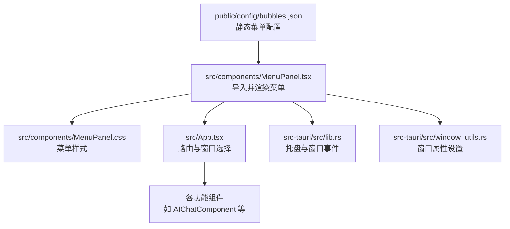
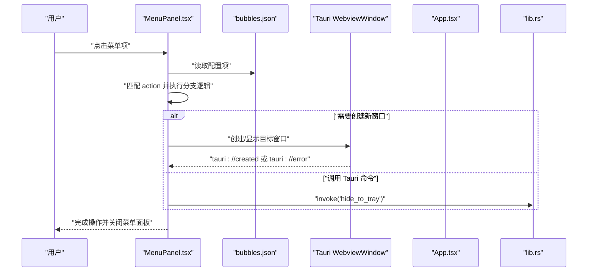
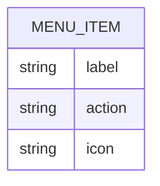
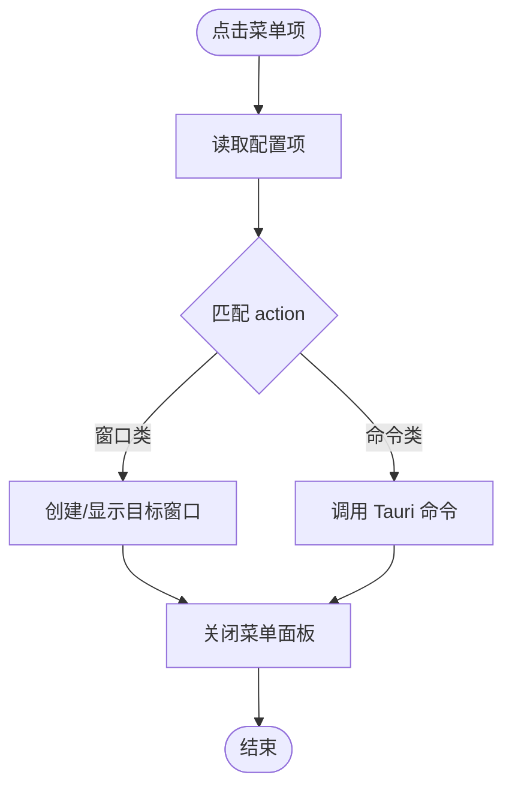
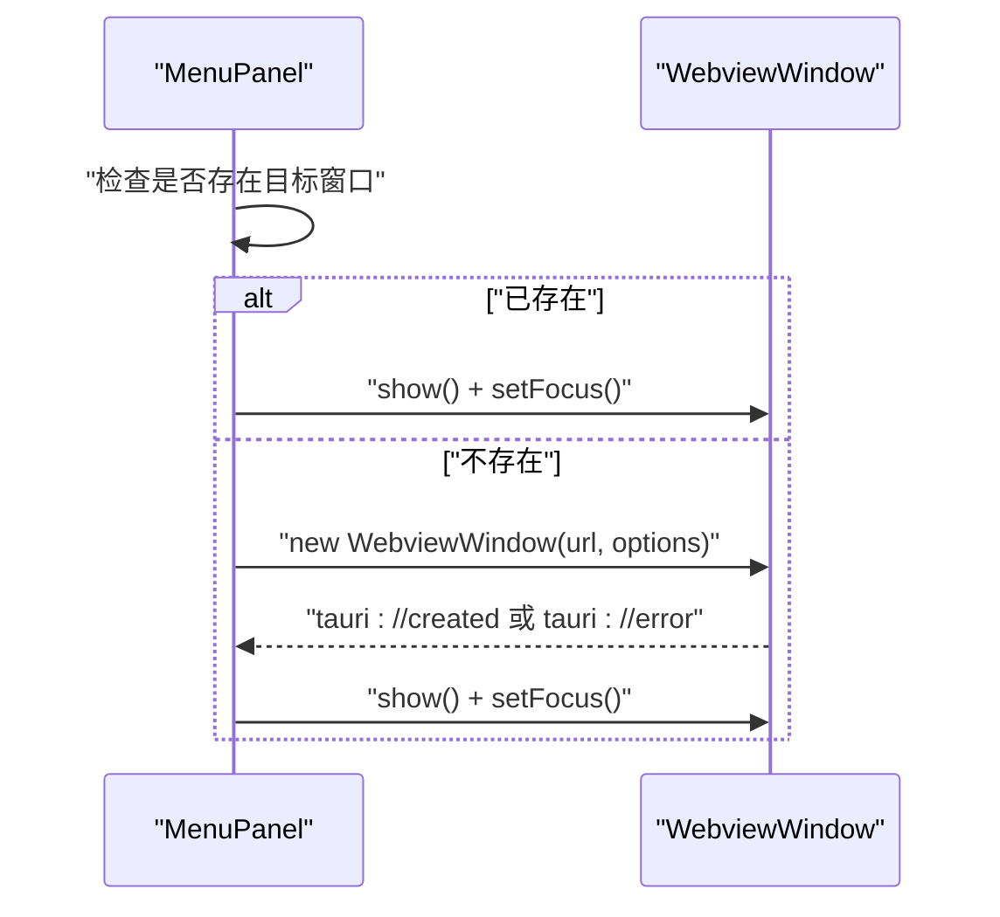
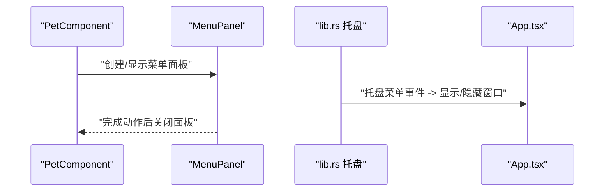
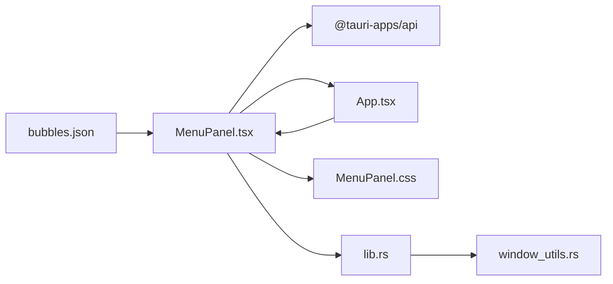

# 静态配置文件

<cite>
**本文引用的文件**
- [bubbles.json](file://public/config/bubbles.json)
- [MenuPanel.tsx](file://src/components/MenuPanel.tsx)
- [MenuPanel.css](file://src/components/MenuPanel.css)
- [App.tsx](file://src/App.tsx)
- [PetComponent.tsx](file://src/components/PetComponent.tsx)
- [lib.rs](file://src-tauri/src/lib.rs)
- [window_utils.rs](file://src-tauri/src/window_utils.rs)
- [package.json](file://package.json)
</cite>

## 目录
1. [简介](#简介)
2. [项目结构](#项目结构)
3. [核心组件](#核心组件)
4. [架构总览](#架构总览)
5. [详细组件分析](#详细组件分析)
6. [依赖关系分析](#依赖关系分析)
7. [性能考量](#性能考量)
8. [故障排查指南](#故障排查指南)
9. [结论](#结论)
10. [附录](#附录)

## 简介
本文件聚焦于桌面宠物应用中的静态配置文件——bubbles.json 菜单配置。该配置文件以 JSON 数组形式定义菜单项，每个菜单项包含标签、动作标识符与图标路径等字段，用于驱动前端菜单面板的渲染与交互行为。本文将系统阐述其结构、字段语义、加载机制、扩展方法、国际化支持现状与最佳实践，并给出常见问题的解决方案。

## 项目结构
bubbles.json 位于 public/config 目录下，作为静态资源被前端直接消费；MenuPanel 组件负责读取该配置并渲染九宫格菜单，同时根据 action 字段分发到不同的窗口或命令处理逻辑。

图表来源
- [bubbles.json](file://public/config/bubbles.json)
- [MenuPanel.tsx](file://src/components/MenuPanel.tsx)
- [MenuPanel.css](file://src/components/MenuPanel.css)
- [App.tsx](file://src/App.tsx)
- [lib.rs](file://src-tauri/src/lib.rs)
- [window_utils.rs](file://src-tauri/src/window_utils.rs)

章节来源
- [bubbles.json](file://public/config/bubbles.json)
- [MenuPanel.tsx](file://src/components/MenuPanel.tsx)
- [MenuPanel.css](file://src/components/MenuPanel.css)
- [App.tsx](file://src/App.tsx)

## 核心组件
- 静态配置文件：bubbles.json，定义菜单项集合，每项包含 label、action、icon 字段。
- 菜单面板组件：MenuPanel.tsx，负责读取配置、渲染九宫格、处理点击事件并创建/激活对应窗口。
- 应用入口：App.tsx，根据窗口 label 决定渲染哪个组件，支撑菜单项与组件的映射。
- 托盘与窗口控制：lib.rs 提供托盘事件与窗口生命周期控制；window_utils.rs 提供窗口属性设置。

章节来源
- [MenuPanel.tsx](file://src/components/MenuPanel.tsx)
- [App.tsx](file://src/App.tsx)
- [lib.rs](file://src-tauri/src/lib.rs)
- [window_utils.rs](file://src-tauri/src/window_utils.rs)

## 架构总览
bubbles.json 作为单一数据源，通过模块导入进入前端，MenuPanel 将其转换为可视化的九宫格菜单。用户点击菜单项后，MenuPanel 根据 action 分发到对应的窗口创建流程或 Tauri 命令调用，实现功能模块的打开与交互。

图表来源
- [MenuPanel.tsx](file://src/components/MenuPanel.tsx)
- [bubbles.json](file://public/config/bubbles.json)
- [lib.rs](file://src-tauri/src/lib.rs)

## 详细组件分析

### 配置文件结构与字段定义
- 结构：数组对象，每个元素代表一个菜单项。
- 字段：
  - label：菜单项显示文本，用于界面展示。
  - action：动作标识符，决定点击后的行为分支。
  - icon：图标路径，若缺失则回退到默认路径。

图表来源
- [bubbles.json](file://public/config/bubbles.json)

章节来源
- [bubbles.json](file://public/config/bubbles.json)

### 菜单面板渲染与交互
- 渲染：MenuPanel 读取配置数组，按网格布局渲染九宫格菜单项。
- 图标回退：若图标加载失败，自动替换为默认图标。
- 点击处理：根据 action 分发到不同窗口创建逻辑或命令调用。
- 外部点击关闭：面板外点击自动关闭面板，避免悬浮窗滞留。

图表来源
- [MenuPanel.tsx](file://src/components/MenuPanel.tsx)

章节来源
- [MenuPanel.tsx](file://src/components/MenuPanel.tsx)
- [MenuPanel.css](file://src/components/MenuPanel.css)

### 动作分发与窗口管理
- 窗口创建：根据 action 选择对应的 devUrl/prodUrl 与窗口选项，创建 WebviewWindow。
- 窗口复用：若目标窗口已存在，则优先显示并聚焦，避免重复创建。
- 错误处理：对窗口创建超时、创建失败进行捕获与日志输出。
- 关闭行为：菜单项处理完成后关闭当前菜单面板。

图表来源
- [MenuPanel.tsx](file://src/components/MenuPanel.tsx)

章节来源
- [MenuPanel.tsx](file://src/components/MenuPanel.tsx)

### 桌宠气泡菜单与托盘联动
- 气泡菜单：PetComponent 在特定交互下展示气泡菜单，气泡点击与菜单面板一致的动作分发逻辑。
- 托盘事件：lib.rs 监听托盘点击与菜单事件，支持显示/隐藏主窗口与发送前端事件。
- 窗口属性：window_utils.rs 提供跨平台的窗口穿透与忽略事件设置。

图表来源
- [PetComponent.tsx](file://src/components/PetComponent.tsx)
- [MenuPanel.tsx](file://src/components/MenuPanel.tsx)
- [lib.rs](file://src-tauri/src/lib.rs)
- [window_utils.rs](file://src-tauri/src/window_utils.rs)

章节来源
- [PetComponent.tsx](file://src/components/PetComponent.tsx)
- [lib.rs](file://src-tauri/src/lib.rs)
- [window_utils.rs](file://src-tauri/src/window_utils.rs)

## 依赖关系分析
- MenuPanel.tsx 直接依赖：
  - 静态配置：bubbles.json
  - Tauri API：WebviewWindow、getCurrentWindow、getAllWindows、invoke
  - React：useState、useEffect、useRef
- App.tsx 依赖 MenuPanel.tsx 进行菜单面板渲染。
- 托盘与窗口控制依赖 lib.rs 与 window_utils.rs。

图表来源
- [MenuPanel.tsx](file://src/components/MenuPanel.tsx)
- [App.tsx](file://src/App.tsx)
- [lib.rs](file://src-tauri/src/lib.rs)
- [window_utils.rs](file://src-tauri/src/window_utils.rs)
- [bubbles.json](file://public/config/bubbles.json)

章节来源
- [MenuPanel.tsx](file://src/components/MenuPanel.tsx)
- [App.tsx](file://src/App.tsx)
- [lib.rs](file://src-tauri/src/lib.rs)
- [window_utils.rs](file://src-tauri/src/window_utils.rs)
- [package.json](file://package.json)

## 性能考量
- 图标加载优化：使用 onError 回退默认图标，减少空白占位带来的视觉抖动。
- 窗口复用：优先显示已存在窗口，避免重复创建导致的资源浪费。
- 异步超时：窗口创建设置超时时间，防止长时间阻塞。
- 样式优化：菜单面板采用模糊背景与渐变阴影，兼顾美观与性能。

## 故障排查指南
- 图标不显示或闪烁
  - 检查 icon 路径是否正确且可访问。
  - 确认 public 目录下存在对应图标文件。
  - 查看浏览器控制台是否有 404 或跨域错误。
- 点击无响应
  - 确认 action 是否存在于 MenuPanel 的 switch 分支。
  - 检查 App.tsx 中是否正确映射了窗口 label。
- 窗口无法创建或超时
  - 检查 devUrl/prodUrl 是否可达。
  - 查看 tauri://error 事件日志，确认具体错误原因。
- 托盘功能异常
  - 确认 lib.rs 中托盘事件监听与菜单项 ID 匹配。
  - 检查平台差异导致的窗口属性设置（window_utils.rs）。

章节来源
- [MenuPanel.tsx](file://src/components/MenuPanel.tsx)
- [App.tsx](file://src/App.tsx)
- [lib.rs](file://src-tauri/src/lib.rs)
- [window_utils.rs](file://src-tauri/src/window_utils.rs)

## 结论
bubbles.json 作为轻量级静态配置，为菜单面板提供了清晰、可维护的扩展点。通过标准化的字段与明确的动作分发机制，配合 Tauri 的窗口管理能力，实现了从配置到界面交互的完整闭环。建议在扩展新菜单项时遵循现有规范，确保图标资源与窗口映射的一致性，并关注错误处理与性能优化。

## 附录

### 字段规范与示例路径
- label：字符串，用于界面显示。
- action：字符串，用于区分不同动作分支。
- icon：字符串，建议使用相对 public 目录的路径。

章节来源
- [bubbles.json](file://public/config/bubbles.json)

### 加载机制与校验
- 文件路径解析：MenuPanel 直接从 public/config 导入配置。
- JSON 格式验证：构建阶段由 Vite/TypeScript 进行类型检查；运行时由 JS 解析。
- 错误处理：对窗口创建超时、创建失败、图标加载失败进行捕获与日志记录。

章节来源
- [MenuPanel.tsx](file://src/components/MenuPanel.tsx)

### 扩展方法
- 新增菜单项：在 bubbles.json 中追加新的菜单项对象。
- 自定义图标：提供与 label 对应的图标文件，并在 icon 字段中指定路径。
- 动作绑定：在 MenuPanel 的 switch 分支中添加新的 case，并配置相应的窗口参数或命令调用。

章节来源
- [bubbles.json](file://public/config/bubbles.json)
- [MenuPanel.tsx](file://src/components/MenuPanel.tsx)

### 版本兼容性与向后兼容策略
- 静态配置层面：新增字段时建议保留可选性，避免破坏既有配置。
- 行为层面：新增 action 时需在 MenuPanel 与 App.tsx 中同步更新，保证向后兼容旧配置。
- 资源层面：图标路径变更需同时更新配置与资源文件，避免运行时 404。

章节来源
- [MenuPanel.tsx](file://src/components/MenuPanel.tsx)
- [App.tsx](file://src/App.tsx)

### 最佳实践
- 保持 label 与 action 的一致性，便于维护与调试。
- 图标尺寸统一，建议使用高分辨率 PNG 以适配高 DPI 屏幕。
- 动作命名采用语义化标识符，避免硬编码复杂逻辑。
- 对外部资源（URL、图标）进行容错处理，提升用户体验。