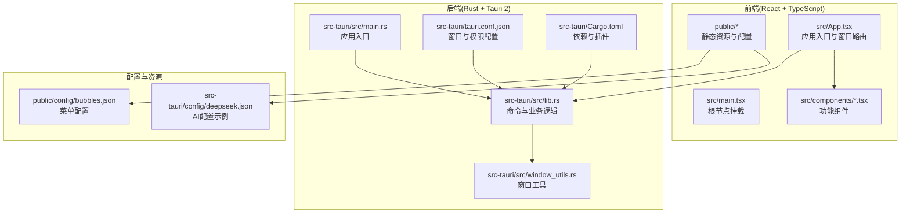
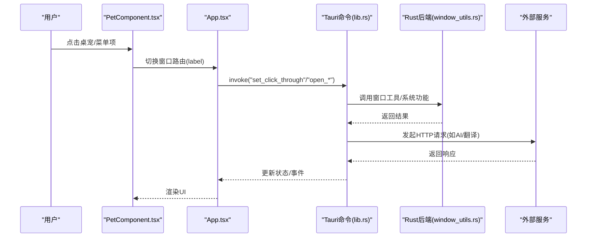
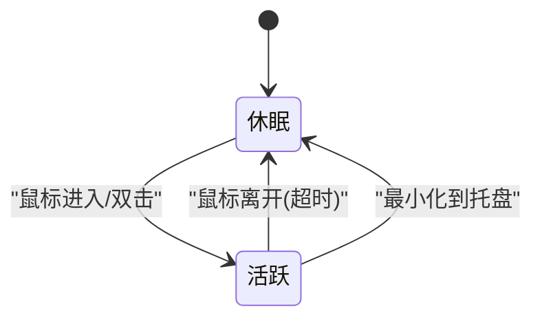
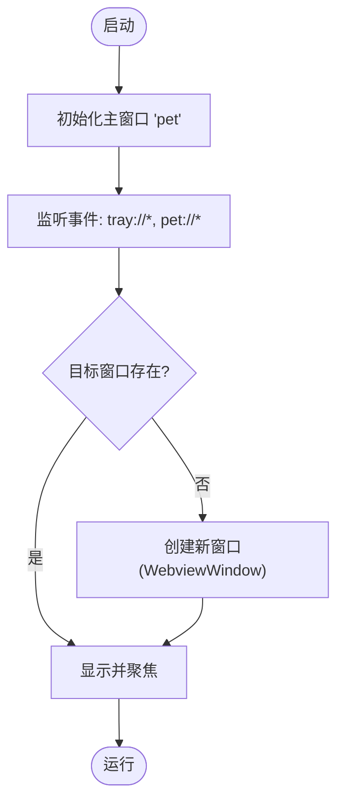
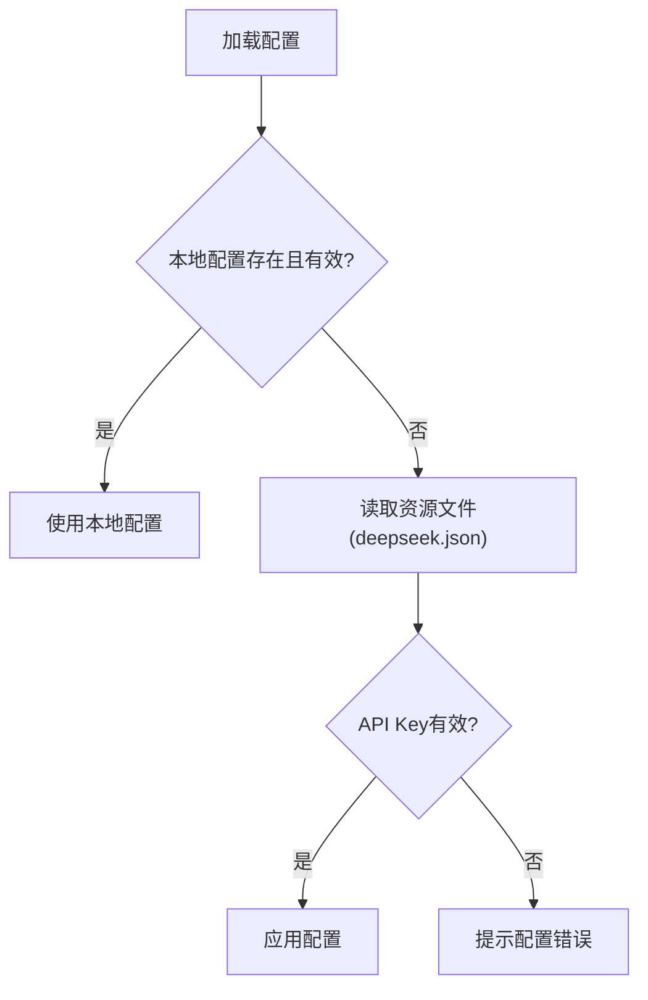
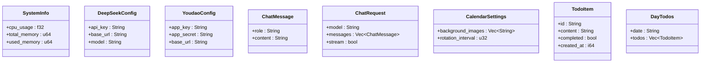
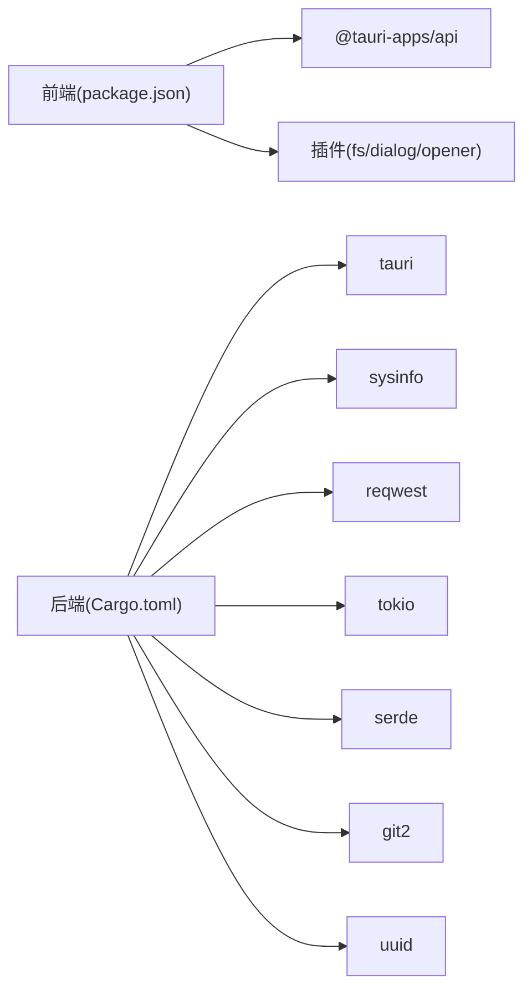

# 项目概述

<cite>
**本文档引用的文件**
- [README.md](file://README.md)
- [package.json](file://package.json)
- [src-tauri/Cargo.toml](file://src-tauri/Cargo.toml)
- [src/App.tsx](file://src/App.tsx)
- [src/main.tsx](file://src/main.tsx)
- [src-tauri/src/lib.rs](file://src-tauri/src/lib.rs)
- [public/config/bubbles.json](file://public/config/bubbles.json)
- [src-tauri/config/deepseek.json](file://src-tauri/config/deepseek.json)
- [src-tauri/src/main.rs](file://src-tauri/src/main.rs)
- [src-tauri/tauri.conf.json](file://src-tauri/tauri.conf.json)
- [src-tauri/src/window_utils.rs](file://src-tauri/src/window_utils.rs)
- [src/components/PetComponent.tsx](file://src/components/PetComponent.tsx)
- [src/components/MenuPanel.tsx](file://src/components/MenuPanel.tsx)
- [src/components/PetComponent.css](file://src/components/PetComponent.css)
</cite>

## 目录
1. [简介](#简介)
2. [项目结构](#项目结构)
3. [核心组件](#核心组件)
4. [架构总览](#架构总览)
5. [详细组件分析](#详细组件分析)
6. [依赖关系分析](#依赖关系分析)
7. [性能考虑](#性能考虑)
8. [故障排除指南](#故障排除指南)
9. [结论](#结论)
10. [附录](#附录)

## 简介
XSUN 桌面宠物是一个基于 Rust 与 Tauri 2 的多功能桌面应用程序，融合了实用工具与娱乐体验。项目采用“React + TypeScript 前端 + Rust 后端”的混合架构，既保证了现代化 Web 开发的高效迭代能力，又借助系统级语言 Rust 提供高性能与跨平台稳定性。

- 项目目标：打造一个轻量、可扩展、易维护的桌面助手，集合日常高频工具与趣味交互。
- 核心价值：模块化设计便于扩展；跨平台打包能力；前后端分离清晰；事件驱动的窗口管理机制。
- 技术特色：多窗口架构、托盘交互、点击穿透控制、异步 I/O、系统信息采集、外部服务集成（AI、翻译、JIRA）。

**章节来源**
- [README.md:12-276](file://README.md#L12-L276)

## 项目结构
项目采用典型的“前端 + 后端 + 配置”三层组织方式，配合 Tauri 的窗口与权限体系，形成清晰的职责边界。

**图表来源**
- [src/App.tsx:17-55](file://src/App.tsx#L17-L55)
- [src-tauri/src/main.rs:8-10](file://src-tauri/src/main.rs#L8-L10)
- [src-tauri/src/lib.rs:12-27](file://src-tauri/src/lib.rs#L12-L27)
- [src-tauri/tauri.conf.json:13-51](file://src-tauri/tauri.conf.json#L13-L51)
- [public/config/bubbles.json:1-52](file://public/config/bubbles.json#L1-52)
- [src-tauri/config/deepseek.json:1-6](file://src-tauri/config/deepseek.json#L1-L6)

**章节来源**
- [README.md:232-247](file://README.md#L232-L247)
- [package.json:1-29](file://package.json#L1-L29)
- [src-tauri/Cargo.toml:1-43](file://src-tauri/Cargo.toml#L1-L43)

## 核心组件
- 桌宠主界面（PetComponent）：可拖动、可点击、支持休眠/活跃状态切换，内置九宫格功能菜单。
- 功能菜单（MenuPanel）：动态读取配置，统一创建与管理各功能窗口。
- 系统信息（SystemInfoComponent）：实时采集 CPU/内存使用率。
- AI 对话（AIChatComponent）：集成 DeepSeek API，支持本地配置与流式响应。
- 有道翻译（TranslatorComponent）：多语言互译，支持等号分隔的特殊翻译场景。
- 日历 TODO（CalendarComponent）：带背景轮播的日历与待办管理。
- 剪贴板管理（ClipboardComponent）：历史记录、富文本支持、展开编辑。
- JSON 对比（JsonCompareComponent）：语法高亮与差异标记。
- 番茄钟（PomodoroTimerComponent）：专注计时与通知窗口。
- JIRA 助手（JiraComponent）：Git 与 JIRA 集成，AI 自动生成工作记录。

**章节来源**
- [README.md:30-128](file://README.md#L30-L128)
- [src/App.tsx:17-55](file://src/App.tsx#L17-L55)
- [public/config/bubbles.json:1-52](file://public/config/bubbles.json#L1-52)

## 架构总览
应用采用“前端组件 + Tauri 命令 + Rust 后端”的调用链路，前端通过 invoke 调用后端命令，后端执行系统级操作或网络请求，最终将结果回传给前端更新 UI。

**图表来源**
- [src/components/PetComponent.tsx:19-196](file://src/components/PetComponent.tsx#L19-L196)
- [src/App.tsx:17-55](file://src/App.tsx#L17-L55)
- [src-tauri/src/lib.rs:38-56](file://src-tauri/src/lib.rs#L38-L56)
- [src-tauri/src/window_utils.rs:9-32](file://src-tauri/src/window_utils.rs#L9-L32)

**章节来源**
- [README.md:170-176](file://README.md#L170-L176)
- [src-tauri/src/lib.rs:12-27](file://src-tauri/src/lib.rs#L12-L27)

## 详细组件分析

### 桌宠交互机制（PetComponent）
- 状态模型：活跃（可拖动/点击）、休眠（点击穿透，仅显示动画）。
- 触发策略：鼠标进入唤醒、离开延时休眠（默认 3 秒）、双击唤醒休眠态。
- 窗口管理：通过事件与命令控制点击穿透、唤醒事件广播、托盘菜单联动。

**图表来源**
- [src/components/PetComponent.tsx:20-87](file://src/components/PetComponent.tsx#L20-L87)
- [src-tauri/src/lib.rs:45-56](file://src-tauri/src/lib.rs#L45-L56)

**章节来源**
- [README.md:184-192](file://README.md#L184-L192)
- [src/components/PetComponent.tsx:19-196](file://src/components/PetComponent.tsx#L19-L196)

### 窗口管理系统
- 窗口策略：主窗口 pet 始终存在；功能窗口按需创建/销毁；菜单窗口临时显示。
- 路由映射：App.tsx 根据窗口 label 渲染不同组件。
- 事件驱动：通过 emit/监听事件实现跨窗口通信与托盘联动。

**图表来源**
- [src-tauri/tauri.conf.json:13-42](file://src-tauri/tauri.conf.json#L13-L42)
- [src/App.tsx:17-55](file://src/App.tsx#L17-L55)
- [src-tauri/src/lib.rs:662-760](file://src-tauri/src/lib.rs#L662-L760)

**章节来源**
- [README.md:193-205](file://README.md#L193-L205)
- [src-tauri/tauri.conf.json:13-51](file://src-tauri/tauri.conf.json#L13-L51)

### 数据持久化与配置
- 配置位置：用户应用数据目录（如 deepseek_config.json、youdao_config.json、todos.json、calendar_settings.json）。
- 配置加载：优先读取本地配置，若无效则回退至资源文件。
- 菜单配置：bubbles.json 控制功能入口与图标。

**图表来源**
- [src-tauri/src/lib.rs:242-271](file://src-tauri/src/lib.rs#L242-L271)
- [src-tauri/config/deepseek.json:1-6](file://src-tauri/config/deepseek.json#L1-L6)

**章节来源**
- [README.md:206-215](file://README.md#L206-L215)
- [public/config/bubbles.json:1-52](file://public/config/bubbles.json#L1-L52)

### 托盘功能
- 左键：显示/隐藏桌宠。
- 右键：弹出功能菜单（显示桌宠、剪贴板、系统信息、AI 对话、有道翻译、日历 TODO、退出）。
- 事件桥接：托盘事件通过 emit 传递给前端，触发相应窗口创建或显示。

**章节来源**
- [README.md:216-229](file://README.md#L216-L229)
- [src-tauri/src/lib.rs:662-760](file://src-tauri/src/lib.rs#L662-L760)

### 类关系图（核心类型与命令）

**图表来源**
- [src-tauri/src/lib.rs:31-69](file://src-tauri/src/lib.rs#L31-L69)
- [src-tauri/src/lib.rs:112-142](file://src-tauri/src/lib.rs#L112-L142)
- [src-tauri/src/lib.rs:273-297](file://src-tauri/src/lib.rs#L273-L297)
- [src-tauri/src/lib.rs:438-460](file://src-tauri/src/lib.rs#L438-L460)
- [src-tauri/src/lib.rs:447-451](file://src-tauri/src/lib.rs#L447-L451)

## 依赖关系分析
- 前端依赖：React、React DOM、@tauri-apps/api 及若干插件（fs、dialog、opener）。
- 后端依赖：Tauri（含 tray-icon）、sysinfo、reqwest、tokio、serde、git2、uuid 等。
- 构建与打包：Vite、Tauri CLI、跨平台打包（MSI/NSIS/DMG）。

**图表来源**
- [package.json:12-27](file://package.json#L12-L27)
- [src-tauri/Cargo.toml:15-43](file://src-tauri/Cargo.toml#L15-L43)

**章节来源**
- [package.json:1-29](file://package.json#L1-29)
- [src-tauri/Cargo.toml:1-43](file://src-tauri/Cargo.toml#L1-L43)

## 性能考虑
- 异步 I/O：使用 tokio 运行时与异步文件系统，避免阻塞 UI。
- 窗口复用：已存在窗口直接显示/聚焦，减少创建成本。
- 点击穿透：在休眠态启用忽略鼠标事件，降低系统开销。
- 资源加载：静态资源配置集中管理，减少网络请求与解析成本。
- 跨平台优化：针对 Windows 的窗口样式与事件处理做了专门适配。

[本节为通用指导，无需具体文件引用]

## 故障排除指南
- 窗口创建超时：检查 devUrl 与前端服务是否正常启动，确认窗口配置与权限。
- 托盘菜单无响应：确认托盘事件监听与 emit 是否正确，检查权限配置。
- 配置加载失败：验证本地配置文件路径与权限，检查资源文件是否存在。
- 翻译/AI 请求失败：核对 API Key 与基础 URL，检查网络连通性与错误码。

**章节来源**
- [src/components/PetComponent.tsx:254-278](file://src/components/PetComponent.tsx#L254-L278)
- [src-tauri/src/lib.rs:242-271](file://src-tauri/src/lib.rs#L242-L271)

## 结论
XSUN 桌面宠物以模块化与事件驱动为核心，结合 Tauri 的跨平台能力与 Rust 的高性能特性，构建了一个功能丰富、易于扩展的桌面助手。对于初学者，项目提供了清晰的前后端分离范式与丰富的 UI/UX 设计实践；对于经验开发者，项目展示了系统级功能集成、窗口管理与外部服务对接的最佳实践。

[本节为总结性内容，无需具体文件引用]

## 附录

### 版本与许可证信息
- 版本：0.1.0
- 技术栈版本：
  - RUST: 1.87.0
  - cargo: 1.87.0
  - tauri: 2.8.0
  - npm: 11.5.2
  - node: 22.18.0
- 许可证：未在仓库中明确声明
- 使用限制：仅供学习使用，不得用于商业用途

**章节来源**
- [README.md:22-28](file://README.md#L22-L28)
- [README.md:2](file://README.md#L2)
- [package.json:1-5](file://package.json#L1-L5)

### 应用场景与目标用户
- 场景：日常办公辅助（剪贴板、翻译、日历、AI 对话）、个人生产力工具、桌面趣味互动。
- 用户：希望在桌面获得轻量工具集与个性化交互的个人用户与开发者。

**章节来源**
- [README.md:14-19](file://README.md#L14-L19)
- [README.md:30-128](file://README.md#L30-L128)