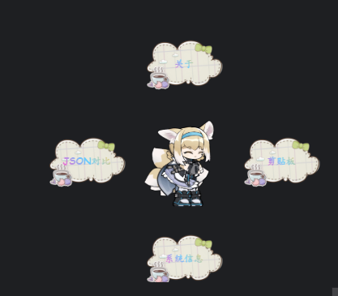
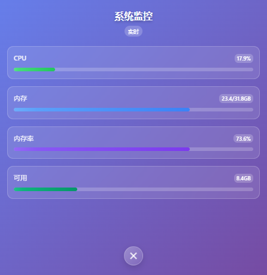

# Tauri + React + Typescript + RUST

This template should help get you started developing with Tauri, React and Typescript in Vite.

## Recommended IDE Setup

- 

## 目前功能支持
1. 读取五条剪贴板历史记录

2. 读取系统监控 
