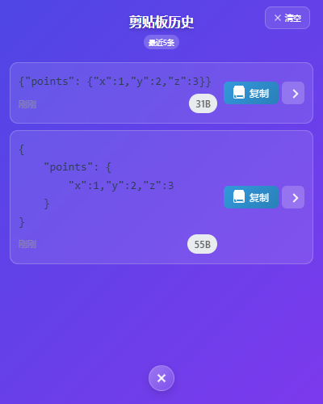
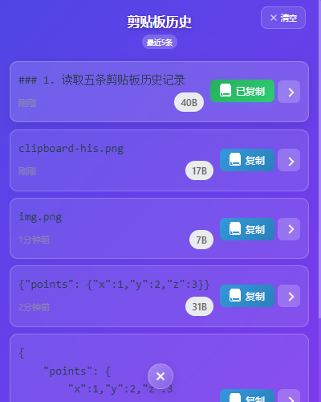
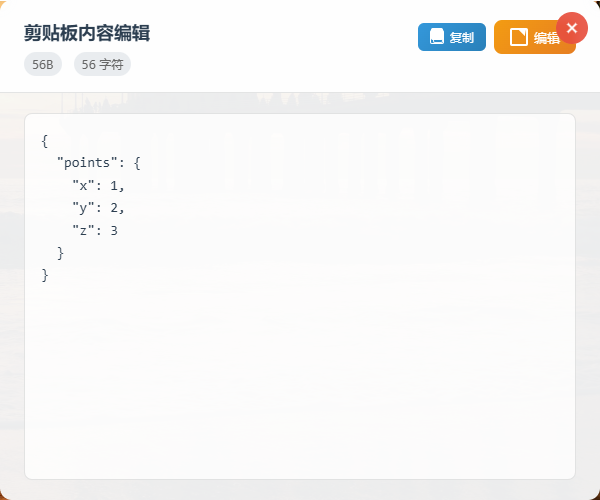
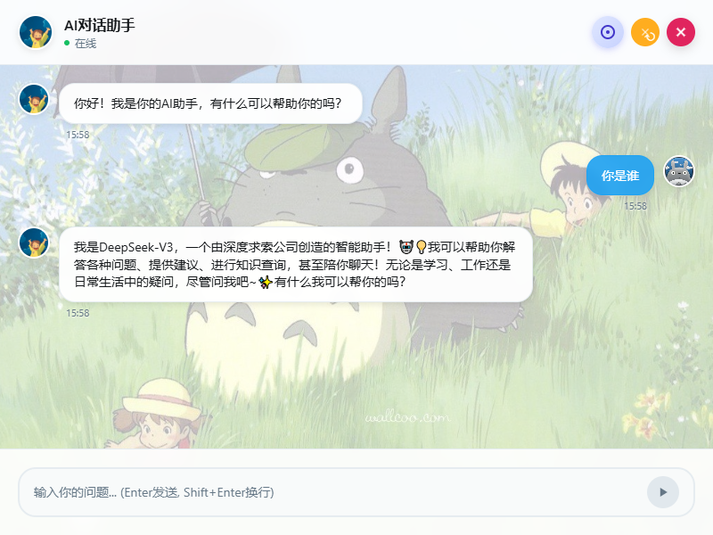
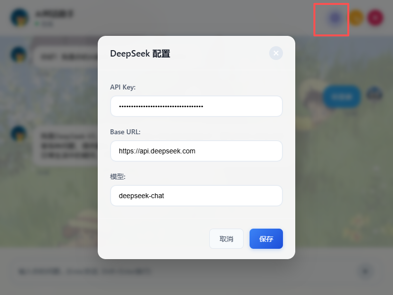

# XSUN DESKTOP PET (桌宠)
作品仅供使用学习RUST 与 tauri2,不用于商业用途
当前版本：

 
 
 
 
 

## 目前大致功能支持

## 功能支持
### 1. 读取五条剪贴板历史记录

#### 1.1 复制可以复制信息

#### 1.2 向右的角标会打开新的窗口，json会格式化

### 2. 读取系统监控 

### 3. AI对话

## 后续功能规划 
1. 添加json 对比功能
2. AI 聊天对话等
3. 支持点击穿透的 每日日程安排（TODO List等）
4. 有什么想要添加的功能欢迎给出你的idea